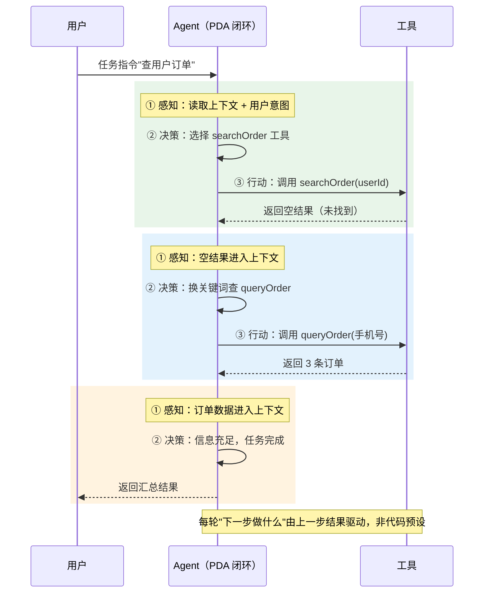
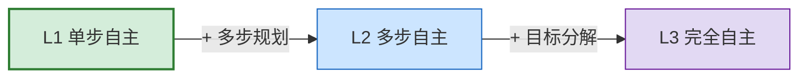
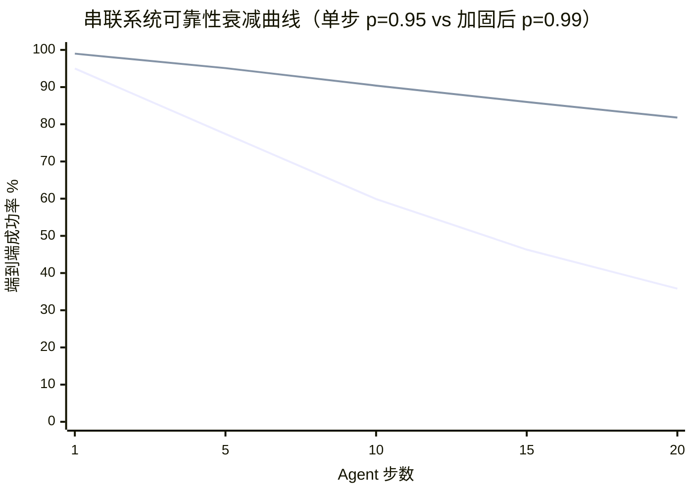
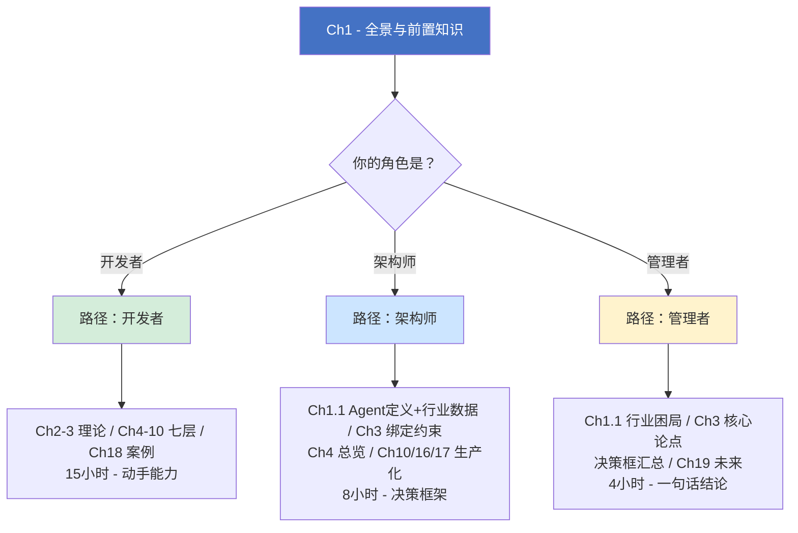

# 第 1 章 — Agent 工程全景与前置知识

使用 LLM API 的门槛已经很低，一行代码即可完成。但从第一次调用到形成可自主决策、多步行动的生产级 Agent，中间缺少的是工程方法。本书将这套包裹在模型之外的工程基础设施称为 Harness。

本章建立全书的术语共识和技术基线：1.1 定义什么是 Agent（PDA 闭环判定 + L1-L3 自主度分级 + 转化率低的根因诊断）；1.2 定义什么是 Harness（ETCLOVG 七层框架 + 级别判定 + 框架选型）；1.3 用 AgentScope 构建 Harness（第一个 Agent + 七层全景预览 + CodePilot 逐层进化路线）；1.4 给出按角色划分的阅读路径。

> **KP 说明**：本章知识点（Knowledge Point, KP）标注两类标签，【诊断】表示该知识点分析现状问题，【构建】表示该知识点给出工程方案。

***

## 1.1 什么是 Agent：定义、判定与自主度分级

### KP 1.1.1 什么算 Agent：判定标准与 PDA 闭环 【构建】

业界对 "Agent" 一词的使用范围较广，同一场景下不同角色可能讨论的是完全不同的东西。以下事物都可能被称为 "Agent"：

- 一个带 system prompt 的 GPT 聊天窗口（ChatGPT）
- 一个能调用搜索引擎的问答系统（Perplexity）
- 一个能查询数据库并执行 SQL 的工具（Text-to-SQL）
- 一个能自动创建 PR、运行 CI、等待结果的编码助手（Cursor Agent）
- 一个多个 AI 实例互相传递消息完成复杂任务的系统（AutoGen、CrewAI）

术语混淆直接导致架构选型错误。以下判定矩阵可用于架构评审：

| <br />    | 感知（Perceive）  | 决策（Decide）     | 行动（Act）     | 自主性（Autonomy）     |
| --------- | ------------- | -------------- | ----------- | ----------------- |
| **聊天机器人** | 用户输入          | 无（固定回复或检索）     | 文本输出        | 无                 |
| **RAG**   | 用户查询 + 检索知识库  | 检索策略（可选）       | 文本输出        | 低                 |
| **工作流**   | 上一步输出         | 预设分支           | 预设工具调用      | 无（决策路径已硬编码）       |
| **Agent** | 环境状态 + 工具返回结果 | **每一步自主决策下一步** | 自主选择工具 + 执行 | **高（感知-决策-行动闭环）** |

**判定法则**：如果系统在运行时每步都自主决定下一步做什么，它是 Agent；如果步骤序列是预设好的，它是工作流或 RAG。判定矩阵中 Agent 行的四个特征可以归结为一个底层机制，感知-决策-行动（PDA）闭环：Agent 的"感知"包含上一步行动的结果，工具调完后的返回值成为下一轮感知的输入，形成循环。



上图中，Agent 搜到空结果后不是报错退出（工作流行为），而是在下一轮感知中读到空结果，自主决定换关键词重搜。这个"换关键词"的决策不是预设步骤，而是 Agent 读了上一步结果后生成的。

用代码表达这个区别：

```java
/*
 * 框架：Java SE 21+ + AgentScope 2.x
 * 环境：JDK 21+, AgentScope 2.x, Maven 3.9+
 */

// 这是工作流，步骤是写死的，AI 只在步骤内生成内容
public Report generateReport(Query query) {
    Data data = dataCollector.collect(query);        // Step 1: 固定
    Analysis analysis = analyzer.analyze(data);       // Step 2: 固定
    Report report = reportWriter.write(analysis);     // Step 3: 固定
    return report;
}

// 这是 Agent，系统在运行时自主决定每一步动作
// AgentScope ReActAgent + Toolkit 模式
public Report agentGenerateReport(Query query) {
    Toolkit toolkit = new Toolkit();
    toolkit.registerObject(new ReportTools());  // @Tool 方法集合

    ReActAgent agent = ReActAgent.builder()
        .name("ReportAgent")
        .sysPrompt("你是一个报告生成助手，自主选择工具完成任务")
        .model(model)
        .toolkit(toolkit)
        .middlewares(List.of(
            new UsageLimitMiddleware(100_000L, 50L, 20L), // O 层：成本守卫
            new StepLimitMiddleware(10)                    // L 层：步数熔断
        ))
        .build();

    // Agent 自主决定：先查什么工具？查完要不要再查？什么时候该写报告？
    Msg response = agent.call(query.text()).block();
    return parseReport(response);
}
```

市面上一些标注为"Agent"的产品，实际功能是接收用户输入后生成文本回复，不执行外部操作。Microsoft 在 Dynamics 365 博客中将这种模式与 Agent 做了区分：**Copilot 是反应式的**（用户提问，系统回答），**Agent 是主动式的**（用户给目标，系统自己规划和执行）[^12]。判定矩阵中的"聊天机器人"行就是 Copilot 模式，能生成回复但不执行操作。

PDA 闭环的三个条件拆开看：

- **感知**：Agent 从多个来源动态吸收信息，用户指令、上一步工具返回结果、环境状态、历史对话上下文。不是一次性喂进去的，是每轮决策前组装的。
- **决策**：Agent 根据感知到的信息自主判断下一步该做什么，比如拿到订单查询结果后发现"已签收但不满意"，自主推导出"先检查退款政策，再调用退款工具"。不是预设分支。
- **行动**：Agent 真正调用工具执行，不是给用户看一段文字说"你应该调用 refundTool"，而是直接执行。执行结果成为新一轮感知的输入，形成**反馈循环**。

很多"Agent"只走了前两步：感知 → 决策，决策完了就吐文本给用户，"我建议您退款 ¥350，请点击确认"。闭环断在第三步，它没有行动，也就没有反馈。真正的 Agent 每一轮都走完整的四阶段：感知 → 决策 → 行动 → 反馈 → 再感知。

```java
// 感知→决策→行动闭环的最简 AgentScope 实现
@Bean
public ReActAgent agentWithLoop(Model model, List<Tool> tools) {
    return ReActAgent.builder()
        .model(model)
        .middlewares(List.of(
            // C 层：每次行动后结果回填到上下文（感知）
            new MessageChatMemoryMiddleware(new InMemoryChatMemory()),
            // T 层：工具调用分发（自主决策调用哪个工具）
            new ToolCallingMiddleware(),
            // G 层：每次行动前检查权限
            new SafeGuardMiddleware(new RefusalGuard())
        ))
        .build();
}
```

> PDA（Perceive-Decide-Act，感知-决策-行动）闭环源自 Stuart Russell 与 Peter Norvig 合著的 *AI: A Modern Approach*（AIMA）。该书自 1995 年第一版起将智能体定义为"通过传感器感知环境，通过执行器行动于环境"的实体。本书将这一理论定义工程化：把"传感器"映射为 LLM 的上下文窗口，"执行器"映射为 @Tool 工具接口，"环境"映射为 ETCLOVG 中 E 层的沙箱执行空间。

#### PDA 闭环的本质属性：非单调性

传统软件是**单调的**——同样的输入产生同样的输出，修复一个 bug 不会引入另一个 bug（除非改错了代码）。Agent 的 PDA 闭环引入了一个传统软件不具备的根本属性：**非单调性**（Non-monotonicity）。它体现在两个层面：

**1. 运行间非确定性**：同一个输入，多次运行可能产生不同输出。根因是 LLM 的 temperature 采样机制——temperature > 0 时，模型对"下一个 token"的概率分布进行随机采样，同一 prompt 在不同采样中可能走向完全不同的推理分支。即便 temperature = 0，部分模型厂商的实现仍存在微小波动（GPU 浮点精度、批次效应等），不存在 100% 的可复现性。这不是 bug，而是 LLM 作为概率系统的固有特性。

**2. 改进非单调性**：修改 prompt、更换工具或调整参数后，某些用例变好了，另一些用例可能同时变差。这不是"改错了"——LLM 的语义空间是连续的，调整一个维度的行为必然影响其他维度。传统软件的优化通常是单调的（修好一个 case 不会弄坏另一个），但 Agent 的优化是多维博弈，不存在"只改好不改坏"的单向优化。

PDA 闭环会放大非单调性的影响。传统软件的单步出错只影响当前结果，而 Agent 的每一步输出都进入上下文，成为下一步的感知输入。一个采样偏差导致的微小方向偏移，通过反馈循环逐级累积——第 1 步偏 5%，第 3 步偏 15%，第 7 步可能已完全偏离预期。这也解释了为什么第 3 章 KP 3.1.2 统计中"幻觉调用"以 31% 位居五种故障模式之首——它不是孤立的概率事件，而是非单调性在 PDA 闭环中累积放大的直接表现。

非单调性对工程实践有三个直接后果，后续章节逐一展开：

| 后果 | 传统软件做法 | Agent 工程做法 | 详见 |
|------|----------|-------------|------|
| 测试不能靠单次验证 | 跑一次通过 = 功能正确 | 统计检验：N ≥ 100, p < 0.05, Cohen's d > 0.2 | 第 9 章 V 层 |
| 优化不能靠直觉判断 | 改完觉得"好多了"就行 | 全量评估集量化对比，防止 regression | 第 2 章 EDD |
| 部署不能靠静态配置 | 上线后行为不变 | 运行时监控 + 自动回滚 | 第 16 章 MLOps |

理解非单调性是理解后续所有章节的前提——从 T 层的工具选择准确率波动，到 V 层的统计检验方法，再到 G 层的灰度发布策略，每一层的工程决策都需要在"Agent 行为不可精确复现"这一约束下设计。

***

### KP 1.1.2 Agent 自主度如何分级：L1-L3 与 ETCLOVG 配置 【构建】

同样是 Agent，自主程度差异很大。本书的 Agent 自主度分级以"谁决定下一步做什么"为核心维度，借鉴自动驾驶 SAE J3016 标准（国际汽车工程师学会发布的自动驾驶分级标准，L0-L5）的设计原则，每级定义一组该级新增的能力，而非一个绝对分数[^13]。SAE J3016 之所以被全行业接受，在于它让"L2 辅助驾驶"和"L4 自动驾驶"的区别可以直接映射到工程配置（传感器数量、责任归属、fallback 机制）；本书的分级同样追求这一特性，每个级别直接对应一组明确的 ETCLOVG 配置，可直接指导架构决策。



| 级别     | 名称   | 判定标准                | ETCLOVG 配置            | AgentScope 实现锚点                                                                                          |
| ------ | ---- | ------------------- | --------------------- | -------------------------------------------------------------------------------------------------------- |
| **L1** | 单步自主 | AI 自主选择调用什么工具、何时调用  | 需要 C + L（编排）+ T（工具接口） | `ReActAgent` + `ToolCallingMiddleware`                                                                   |
| **L2** | 多步自主 | AI 自主完成需多步工具调用的复杂任务 | 需要 E + C + L + T + O  | L1 + `SimpleLoggerMiddleware` + 沙箱                                                                       |
| **L3** | 完全自主 | AI 自主规划、执行、纠错、学习    | 全七层                   | L2 + `EvaluatorMiddleware`（ch01） + `SafeGuardMiddleware`（ch02） + `VectorStoreChatMemoryMiddleware`（ch06） |

每一级新增的能力（自主决策→多步规划→目标自设定）和新增的 Harness 层数一一对应，级间边界清晰，级内标准一致。

2025 年的多份行业调研普遍显示，大多数企业 Agent 应用仍停留在 L1 阶段（单步自主），少数探索 L2（多步自主），L3（完全自主）仅存在于受控实验环境中[^13]。Gartner 预测到 2028 年，33% 的企业软件将包含 Agentic AI（2024 年不足 1%），但其中大多数仍将是 L1 级别的工具增强型 Agent[^14]。

用代码直观感受 L1、L2、L3 的区别：

```java
// 框架：AgentScope 2.x | 环境：JDK 21+, Spring Boot 3.5+
// agent 已装配好 Toolkit（含 orderQueryTool / refundTool / emailTool / analyticsTool）

// L1：单步自主，AI 自主选择工具，只处理一步
String l1 = agent.call("查询用户ID=zhangsan的最近10条订单")
    .block().getTextContent();
// AI 决策：调用 orderQueryTool 一次，返回结果

// L2：多步自主，AI 自己决定用什么工具、什么顺序
String l2 = agent.call("用户张三要求退款订单#2024，原因：商品破损。" +
    "请查询订单、检查退换政策、执行退款、通知用户。")
    .block().getTextContent();
// AI 决策链：orderQueryTool（确认订单）→ refundTool（执行退款）→ emailTool（通知用户）

// L3：完全自主，AI 自己设定目标、自己纠错、自己学习
String l3 = agent.call("我们电商平台最近售后投诉增加了，你看怎么改善。")
    .block().getTextContent();
// AI 自主拆解目标：analyticsTool（分析投诉数据）→ 发现"退款响应慢"是主因
// → 自己制定改进方案 → refundTool（批量处理积压退款）→ emailTool（通知受影响用户）
// → analyticsTool（复验投诉率是否下降）→ 若未达标则调整方案再来一轮
```

L1 是整本书的"基准级"，我们讨论的"Agent Harness 工程"从 L1 起才真正适用。非 Agent 系统（固定流程的工作流、纯工具调用链）的可靠性问题更接近传统软件（确定性流程 + 概率性单步），Harness 工程的核心价值在 Agent 级别才显现。

L2 是目前生产环境的主流目标，多步自主意味着 Agent 需要自己规划工具调用顺序、处理中间结果、在出错时调整策略，这对 E 层沙箱隔离和 O 层可观测性提出了硬需求，单靠 L1 的 C+L+T 三层不足以支撑。

L3 仍处于研究探索阶段，AI 需要自己设定子目标、验证结果是否达标、不达标时调整方案再来一轮，这对 V 层验证（怎么判断"改善了"）和 G 层治理（AI 自主批量操作的风险兜底）提出了更高要求，需要全七层 Harness 才能安全支撑。

> **补充说明**：实际生产系统中的 Agent 往往不是单一自主度级别，同一 Agent 在不同子任务中可能以不同自主度运行（例如关键操作降级为 L1，常规操作以 L2 运行）。第 3 章将讨论运行时自主度动态调整的工程方案。

***

### KP 1.1.3 为什么 Agent 从 Demo 到生产的转化率低 【诊断】

2024 年到 2026 年上半年，AI Agent 领域供给端呈现爆发式增长，GitHub 上标注 "Agent" 的开源项目在 2025 年一季度同比增长超过 300%，各类 Demo 和新框架层出不穷。但多项行业调查显示，**供给的繁荣并未同步转化为生产端的成功落地**：

- PwC（2025 年 5 月，308 位美国企业高管）：79% 的企业在使用 AI Agent，但只有 14% 成功扩展到全组织范围的运营使用[^1]。
- G2（2025 年 8 月）：57% 声称 Agent 已"上线生产"，但进一步追问发现这些 Agent 大多只处理一个被严格约束的狭窄工作流[^2]。
- MIT（300+ 企业案例）：95% 的生成式 AI 试点项目未能产生可衡量的财务影响，企业平均在触及生产环境前放弃了 46% 的 AI PoC[^3]。
- Gartner（2025 年 6 月）：预测超过 40% 的 Agentic AI 项目将在 2027 年底前被取消，原因为"成本飙升、ROI 模糊和治理失败"[^4]。
- LangChain（2025 年底，1,340 名从业者）：89% 的团队有 Agent 可观测性工具，但只有 52% 运行离线评估，能发现失败但无法在部署前预防[^5]。

这些数据反映的共性问题是：Agent 从 Demo 到生产的转化率低。原因不在模型单次推理能力，当前主流模型（GPT-4、Claude 3.5 Sonnet、Gemini 2.5）在单个 prompt 下的表现已足够，能高质量的完成多数单步甚至多步的复杂任务。其根源在于**包裹模型的工程基础设施进度并没有跟上模型的发展。**

具体来说，Agent 工作流是串联系统。假设一个工作流包含 20 步，每步成功率 95%，端到端成功概率为 0.95²⁰ ≈ **36%**。每一步单独看问题都不大，但每多走一步，前一步的出错概率就叠加到整体系统中。这就是串联系统的乘法效应，P\_total = Π P\_i，步数越多，整体可靠度掉得越快。

所以要把每一步的成功率都提上去。靠换更强的模型、调 prompt 是一条路，但效率不高：模型从 95% 准确率提到 97% 已经很难，再加 1% 的代价往往是成本翻倍，ROI太低。更有效的做法是把常见的失败类型拆开，调用失败、上下文丢失、行为跑偏、成本失控、结果不可信、越权操作，每一类问题单独做一层防护，每层把自己管的那类失败拦下来，单步成功率就能从 95% 稳定抬到 99%。这套分层防护体系就是 **Harness**。

***

## 1.2 什么是 Harness：七层框架、级别判定与工具选型

### KP 1.2.1 Harness 是什么：ETCLOVG 七层与 Agent = Model + Harness 【构建】

上一节列出的六类失败，再加上执行环境安全的兜底，正好构成七层工程防护。本书基于 **ETCLOVG 七层 Harness 框架**[^6]，将这七层系统化整理如下：

| 层     | 英文            | 含义      | 对应的工程问题                |
| ----- | ------------- | ------- | ---------------------- |
| **E** | Execution     | 执行环境    | Agent 跑在哪，出错了怎么兜底      |
| **T** | Tooling       | 工具接口    | Agent 能调用什么，调用失败了怎么处理  |
| **C** | Context       | 上下文/记忆  | Agent 记得什么，忘掉了什么       |
| **L** | Lifecycle     | 编排/生命周期 | Agent 怎么思考、怎么行动、怎么停止   |
| **O** | Observability | 可观测性    | Agent 在做什么、花了多少钱、为什么犯错 |
| **V** | Verification  | 验证/评估   | 怎么知道 Agent 做对了         |
| **G** | Governance    | 治理/安全   | Agent 不能做什么、出事了谁负责     |

七层的工程对策是：在每一层独立加固，将单步可靠度提升后，串联系统的端到端可靠度随之改善。以下代码演示这一计算：

```java
/*
 * 串联系统可靠性衰减计算器
 * 环境：JDK 21+
 */
public class ReliabilityDecayCalculator {

    static double computeReliability(double stepReliability, int steps) {
        return Math.pow(stepReliability, steps);
    }

    static double computeHarnessGain(double baseReliability, int layers, double gainPerLayer, int steps) {
        double improved = Math.min(1.0, baseReliability + layers * gainPerLayer);
        return Math.pow(improved, steps);
    }

    public static void main(String[] args) {
        double p = 0.95;
        int[] stepCounts = {1, 5, 10, 15, 20};

        System.out.println("=== 串联系统可靠性衰减（单步 p=0.95）===");
        for (int n : stepCounts) {
            double r = computeReliability(p, n);
            System.out.printf("  %2d 步 → 端到端 %.1f%% 成功率%n", n, r * 100);
        }
        // 1 步 → 95.0%, 5 步 → 77.4%, 10 步 → 59.9%, 15 步 → 46.3%, 20 步 → 35.8%

        // 假设每层加固提升单步可靠度 1pp（0.01），5 层叠加后单步从 95% → 100%（上限 99%+5pp cap at 1.0）
        // 此处 gainPerLayer 为示意值，实际提升取决于任务类型和加固深度
        System.out.println("\n=== Harness 加固效果（示意：5 层 × 1pp/层）===");
        double harness = computeHarnessGain(p, 5, 0.01, 20);
        System.out.printf("  无 Harness: %.1f%% → 有 Harness: %.1f%%（+%.1fpp）%n",
            computeReliability(p, 20) * 100, harness * 100,
            (harness - computeReliability(p, 20)) * 100);
        // 无 Harness: 35.8% → 有 Harness: 82.4%（+46.6pp）

        System.out.println("\n=== 反推：20 步任务 90% 成功率需多少单步可靠度？===");
        System.out.printf("  需要单步 ≥ %.1f%%%n", Math.pow(0.90, 1.0 / 20) * 100);
        // 需要单步 ≥ 99.0%
    }
}
```

> **关于加固参数的说明**：上例中"每层提升 1pp"为示意值，用于演示串联系统对单步可靠度的敏感性。实际工程中各层的边际贡献取决于任务类型、Agent 基线和加固深度，需通过实际评估获得。



这一概念在 2026 年初被业界概括为：**Agent = Model + Harness**[^7]。模型是推理引擎，Harness 是包裹引擎的一切工程基础设施。**"Harness 决定可靠性，模型决定上限"** 这一论点有公开证据支撑：SWE-agent（Princeton）通过纯 T 层优化（ACI 设计，即 Agent-Computer Interface），在 SWE-bench 上从 3.8% 提升至 12.5%（未换模型）[^7]；LangChain 的实验表明，不换模型权重，仅通过 Harness 改进（编排循环、上下文管理、验证中间件、推理预算分配），可将同一模型驱动的编码 Agent 在 Terminal Bench 2.0 上从 52.8% 提升到 66.5%[^7]。OpenAI 团队在 5 个月内用 Agent 构建了产品代码，其总结为"Humans steer. Agents execute."[^8]。

本书的目标是将 ETCLOVG 七层框架从理论变为可落地的工程实践，用 AgentScope 的代码、量化实验和贯穿案例，展示每一层的设计决策如何提升 Agent 可靠性。全书代码以 AgentScope 作为示例，但 ETCLOVG 是框架无关的抽象蓝图，可用任何框架落地。

***

### KP 1.2.2 Harness 在什么级别：3 层、5 层还是 7 层 【构建】

Agent 有 L1-L3 自主度分级，Harness 也有级别，你实现了几层 ETCLOVG，决定了能支撑哪个级别的 Agent。

**Harness 三级判定**：

| Harness 级别 | 名称 | ETCLOVG 配置        | 层数  | 支撑 Agent 级别 | 典型场景        |
| ---------- | -- | ----------------- | --- | ----------- | ----------- |
| Level 1    | 基础 | C + L + T         | 3 层 | L1 单步自主     | 单步工具调用，无需沙箱 |
| Level 2    | 标准 | E + C + L + T + O | 5 层 | L2 多步自主     | 多步任务，需隔离+观测 |
| Level 3    | 完整 | 全七层               | 7 层 | L3 完全自主     | 自主规划+纠错+学习  |

判定规则很简单：**实现了几层，就是哪个级别**。缺的层就是构建Agent工程下一步要实现的。

Agent 级别与 Harness 级别的典型对应关系：Agent L1 需要 Harness Level 1（C+L+T 三层），Agent L2 需要 Harness Level 2（加上 E 层沙箱和 O 层观测），Agent L3 需要 Harness Level 3（全七层，含 V 层验证和 G 层治理）。用 Level 1 的 Harness 支撑 L2 级别的 Agent，缺少的 E 层和 O 层会直接暴露为生产故障：无沙箱则工具可误操作生产环境，无可观测性则失败无法归因。

回到 KP 1.1.3 的调查数据：PwC 发现 79% 的企业在使用 Agent，但只有 14% 扩展到全组织。这 14% 与 79% 之间的差距，对应的是 Harness 从 Level 1（C+L+T 三层，支撑 L1 单步工具调用）到 Level 2（补上 E 层沙箱隔离和 O 层可观测性，支撑 L2 多步自主）的工程投入。

***

### KP 1.2.3 用什么构建 Harness：框架选型与 ETCLOVG 覆盖度 【诊断】

Agent 框架的竞争在 2024 年到 2026 年上半年经历了快速扩张后开始收敛，据 AgentList.directory 公开追踪[^9]，截至 2026 年中，主流框架在各自定位上形成相对稳定的占位：LangChain（生态最大，Python 首选）、LangGraph（工作流场景占比快速上升）、CrewAI（多 Agent 角色编排场景）、AgentScope（Java 企业部署场景），以及 AutoGen、Dify、n8n、LlamaIndex、Semantic Kernel 等。每个框架仍在沿用自己的术语体系和 Agent 模型。

开发者的常见路径依然没变：学一个框架 → 发现不满足需求 → 换一个 → 重新学习。结果是掌握了框架 API 而非底层原理，换框架时已有知识几乎无法迁移。Stack Overflow 上带 `langchain` 标签的问题在 2025 年累计超过 8,500 个[^9]，加上 `langgraph`、`crewai`、`agentscope` 等新增标签的快速增长，拆开看这些问题，无论标签是什么，本质几乎都是 Agent 架构的通用问题：「Agent 为什么重复调用同一个工具」「上下文过长后行为异常」「执行到一半卡住不结束」，但被锁死在各自框架的特定术语和 API 里，答案很难跨框架复用。

一项对 1,575 个 LLM Agent 开源项目的研究发现，框架选择不当是导致项目失败的主要架构原因之一，这会放大 Agent 的不可靠性[^10]。典型错配包括：该用确定性工作流的地方用了自主 Agent（成本和可靠性都恶化），该用自主 Agent 的地方只做了 RAG（功能不足）。

各框架术语映射到同一组底层概念但缺乏共识层：LangChain 用 "Chain/Agent/Tool"，CrewAI 用 "Agent/Task/Crew"，AutoGen 用 "Agent/GroupChat"，AgentScope 用 "ReActAgent/Middleware/@Tool"。ETCLOVG 提供框架无关的系统蓝图，无论用哪个框架，Agent 系统其实都可以被分解为以下这七层。

在评估覆盖度之前，先澄清一个常见混淆：SDK、框架、平台、Harness 这四个标签在不同项目中指向不同范围的能力：

- **OpenAI SDK**：封装模型 API 调用（Chat Completions、Embeddings），加便利函数。本质是 SDK。
- **LangChain**：在模型 API 之上提供 Chain/Agent/Tool/Retriever 等抽象，加外部系统集成。本质是框架。
- **Dify**：提供可视化工作流编排、模型管理、日志监控、团队协作。本质是平台。
- **CrewAI**：专注于多 Agent 角色编排。本质是框架中的垂直子集。
- **AgentScope**：将 LLM 调用集成到 Spring 生态（ReActAgent 类似 RestClient，Middleware 类似 AOP，@Tool 类似 Spring Bean）。本质是 Spring 生态中的 Agent 框架。

Harness 不是一个产品或框架，它是包裹模型之外的全部工程基础设施（ETCLOVG 七层）。以下为 E/T/C 三层概念在三种框架中的对应实现：

| ETCLOVG 概念                     | LangChain (Python)                                            | AgentScope (Java)     | CrewAI (Python)    |
| ------------------------------ | ------------------------------------------------------------- | --------------------- | ------------------ |
| **E 层 · 执行环境**隔离 / 超时 / 资源限制   | ✗ 无内置沙箱，需自建或对接 Docker/E2B                                     | Sandbox 扩展+ Docker 沙箱 | ⚠ 框架不提供，需自建        |
| **T 层 · 工具接口**声明 / 参数校验 / 错误处理 | `@tool` 装饰器                                                   | `@Tool` 注解 + Toolkit  | `tools` 参数传入 Agent |
| **C 层 · 上下文与记忆**短期·长期记忆 / 窗口管理 | Checkpointer（线程级）+ Store（跨会话）+ summarizationMiddleware（上下文压缩） | AgentState+ 记忆管理      | 框架内置 shared memory |

**三大框架的 ETCLOVG 七层覆盖度**（基于各框架官方文档截至 2026 年中的公开 API 评估）：

| 框架         | E 执行环境 | T 工具接口 | C 上下文记忆 | L 编排 | O 可观测性 | V 验证评估 | G 治理安全 |  加权覆盖度  |
| ---------- | :----: | :----: | :-----: | :--: | :----: | :----: | :----: | :-----: |
| AgentScope |    ✓   |    ✓   |    ✓    |   ★  |    ✓   |    △   |    ✓   | 6.5 / 7 |
| LangChain  |    ✗   |    ✓   |    ✓    |   ✓  |    △   |    ✗   |    ✗   | 3.5 / 7 |
| CrewAI     |    ✗   |    △   |    △    |   ★  |    ✗   |    ✗   |    ✗   | 2.0 / 7 |

> **图例**：★ 核心能力（1.0）　✓ 完整支持（1.0）　△ 部分支持（0.5）　✗ 基本不覆盖（0）
>
> **评判标准**：基于各框架官方文档公开 API 的功能覆盖评估。"完整支持"指框架提供开箱即用的组件；"部分支持"指提供基础能力但需扩展；"基本不覆盖"指需完全自建。加权覆盖度 = 各层得分之和 / 7，AgentScope 在 V 层（验证评估）仍为部分支持，需自行扩展离线评估能力。此表反映的是框架内置能力，不代表框架整体质量，CrewAI 在多 Agent 角色编排场景下的易用性是其设计优势，LangChain 的生态集成广度也是其价值。

无论用什么框架，ETCLOVG 七层中框架没覆盖到的层，都需要工程团队自己补上。

***

## 1.3 用 AgentScope 构建 Harness：从第一个 Agent 到七层全景

### KP 1.3.1 如何构建第一个 Agent 【构建】

**前置环境要求**

| 依赖             | 版本建议                     | 验证命令                               |
| -------------- | ------------------------ | ---------------------------------- |
| JDK            | 21 LTS 及以上               | `java -version`                    |
| Maven 或 Gradle | Maven 3.9+ / Gradle 8.5+ | `mvn -version` / `gradle -version` |
| Spring Boot    | 3.5+                     | 见下方 `pom.xml` 片段                   |
| AgentScope     | 2.0.0（2026-07 GA）        | 见下方 `pom.xml` 片段                   |

**第 1 步：创建项目并添加依赖**

用 Spring Initializr 或 IDE 新建 Spring Boot 项目，在 `pom.xml` 中加入 AgentScope Starter：

```xml
<dependencies>
    <dependency>
        <groupId>io.agentscope</groupId>
        <artifactId>agentscope-spring-boot-starter</artifactId>
        <version>2.0.0</version>  <!-- 2026-07-10 GA，Maven Central 最新稳定版 -->
    </dependency>
</dependencies>
```

**第 2 步：配置模型 API Key**

通过环境变量注入，不硬编码（在 dashscope.console.aliyun.com 获取 Key）：

```bash
export DASHSCOPE_API_KEY="sk-..."
```

`src/main/resources/application.yml` 中引用：

```yaml
agentscope:
  model:
    api-key: ${DASHSCOPE_API_KEY}
```

**第 3 步：写第一个可运行的 Agent**

```java
/*
 * 全书第一个可运行的 Agent，最简配置：模型 + System Prompt
 * 代码见 CodePilot 配套仓库 ch01-foundation 模块（QuickstartAgent.java）
 *
 * 注意：@SpringBootApplication 是 Spring Boot 启动入口（不能用 @Component 启动），
 * QuickstartAgent 作为内嵌 @Component 被 Spring 扫描。
 */
@SpringBootApplication
public class QuickstartAgent {

    @Component
    public static class QuickstartAgent {

        private final ReActAgent agent;

        public QuickstartAgent() {
            this.agent = ReActAgent.builder()
                .name("quickstart-agent")
                .sysPrompt("你是一个有帮助的助手。")
                .model("dashscope:qwen-plus")       // 自动读取 DASHSCOPE_API_KEY
                .build();
        }

        public String respond(String message) {
            RuntimeContext rc = RuntimeContext.builder()
                .sessionId("quickstart-session")
                .userId("demo")
                .build();
            Msg response = agent.call(message, rc).block();
            return response == null ? "" : response.getTextContent();
        }
    }

    public static void main(String[] args) {
        var ctx = SpringApplication.run(QuickstartAgent.class, args);
        var quickstart = ctx.getBean(QuickstartAgent.class);
        String result = quickstart.respond("用一句话解释什么是 Agent");
        System.out.println(result);
    }
}
```

运行 `main()` 后，Agent 调用模型返回一句话回答。这段代码里出现了全书代码的四个核心概念，理解它们，后续每章的代码就不会陌生：

**四个核心概念速览**

| 概念               | 角色                                       | Spring 类比                    | 一句话理解                          |
| ---------------- | ---------------------------------------- | ---------------------------- | ------------------------------ |
| `ReActAgent`     | Agent 的核心入口，Builder 模式构建                 | `RestClient`                 | 一个能自主推理 + 调用工具的"LLM 客户端"       |
| `RuntimeContext` | 每次调用的上下文（sessionId / userId / 自定义 trace） | `RequestContextHolder`       | 一次对话的"行李箱"，Middleware 各层从中取存状态 |
| `Msg`            | 返回值，封装文本 / 工具调用 / 元数据                    | `ResponseEntity`             | Agent 的一次输出，可能是文字，也可能是工具调用请求   |
| `Toolkit`        | `@Tool` 方法的容器，模型可调用的能力清单                 | `ApplicationContext` Bean 容器 | 告诉模型"你能做什么"的注册表；下方加工具示例中首次出现   |

> 全书每一章都在围绕这四个概念扩展：Ch5 往 `Toolkit` 里加结构化工具，Ch6 往 `RuntimeContext` 里注入记忆，Ch7 用 Middleware 控制 `ReActAgent` 的编排循环，Ch8 在 `Msg` 上挂载 trace 标签。第 1 章记住它们，后续每章只需关注"这一层改了哪个"。

**给最简 Agent 加一个工具，T 层的扩展**

上面的 QuickstartAgent 只能聊天，不能"做事"。加一个 `@Tool` 让它能查询订单，这就是 T 层的最小形态。这里两个 Agent 的 DI 风格有一个刻意的递进：

- **QuickstartAgent（上例）**：构造函数里手动 `ReActAgent.builder()`，不注入任何外部 Bean，零依赖，适合快速跑通
- **OrderAgent（下例）**：通过构造注入 `Toolkit` Bean，这是 AgentScope 生产代码的标准模式

`Toolkit` Bean 的来源：`agentscope-spring-boot-starter` 的 auto-configuration 会扫描所有 `@Tool` 注解的方法，把它们装配成一个 `Toolkit` Bean。你只需要在 `OrderTools` 类上标注 `@Component`，Spring 就能发现并交给 AgentScope。

```java
/*
 * 全书第一个带工具的 Agent，在 QuickstartAgent 基础上加一个 @Tool
 * 代码见 CodePilot 配套仓库 ch01-foundation 模块（QuickstartAgent.java + MyTools.java）
 */

// ① 声明工具：@Component + @Tool → 被 AgentScope auto-config 自动收进 Toolkit Bean
@Component
public class OrderTools {

    @Tool(description = "根据用户ID查询订单列表，返回 JSON 格式的订单数据")
    public String queryOrders(String userId) {
        // 实际项目中这里调用数据库或远程服务
        return "[{\"orderId\":\"ORD-001\",\"amount\":199.00}]";
    }
}

// ② 启动类
@SpringBootApplication
public class OrderAgentApp {

    @Component
    public static class OrderAgent {

        private final ReActAgent agent;

        // Toolkit 由 AgentScope auto-config 自动创建，Spring 注入即可
        public OrderAgent(Toolkit toolkit) {
            this.agent = ReActAgent.builder()
                .name("order-agent")
                .sysPrompt("你是一个订单查询助手，需要时调用工具获取数据。")
                .model("dashscope:qwen-plus")
                .toolkit(toolkit)                   // ← 关键：把 @Tool 方法集合交给 Agent
                .build();
        }

        public String respond(String message) {
            RuntimeContext rc = RuntimeContext.builder()
                .sessionId("order-session").build();
            Msg response = agent.call(message, rc).block();
            return response == null ? "" : response.getTextContent();
        }
    }

    public static void main(String[] args) {
        var ctx = SpringApplication.run(OrderAgentApp.class, args);
        var agent = ctx.getBean(OrderAgent.class);
        // Agent 自主决定：调用 queryOrders("U123") 获取数据，再组织自然语言回复
        System.out.println(agent.respond("查一下用户 U123 的订单"));
    }
}
```

加了 `@Tool` 后，Agent 收到"查一下用户 U123 的订单"不再凭空编造，而是调用真实方法再回复。这就是 T 层做的事，**让模型从"说"变成"做"**。

但这个 Agent 仍然缺很多东西：没有步数限制（可能无限循环）、没有记忆截断（上下文会爆炸）、没有沙箱隔离（工具能直接操作生产库）、没有成本守卫（Token 烧多少都不知道）、没有安全过滤（用户可以注入恶意指令）。这些缺口正是后续每一层 Harness 需要补齐的。

***

### KP 1.3.2 AgentScope 的核心 API 与七层全景预览 【构建】

#### 为什么选 Java + AgentScope

Agent 领域主流教程以 Python 为主，但国内企业后端团队的实际技术栈以 Java 为主。JetBrains 2024 调查显示（23,262 名全球开发者），Java 过去 12 个月使用率 46%，Python 57%；作为主要语言两者并列（Python 30-35% vs Java 28-30%）[^11]。纯后端企业团队中，Java/Spring 存量基础设施占比仍是第一梯队。

本书选 AgentScope 的两条核心理由：(1) 它基于 Java/Spring 生态，企业 Java 团队无需引入额外语言栈；(2) 它的 API 设计复用了 Spring 20 年验证的成熟范式，`ReActAgent.builder()` 类比 `RestClient.builder()`，`@Tool` 类比 `@Service`，`MiddlewareBase` 链类比 AOP Advice 链。Spring 开发者上手几乎不用学新概念。

**为什么不选 LangChain / CrewAI？** KP 1.2.3 已有三大框架 ETCLOVG 覆盖度对比，这里仅展示实操维度差异

| 选型维度  | LangChain (Python)   | CrewAI (Python) | AgentScope (Java) |
| ----- | -------------------- | --------------- | ----------------- |
| 语言生态  | Python               | Python          | Java/Spring 原生    |
| 沙箱隔离  | ✗ 无内置                | ✗ 无内置           | ✓ Docker 沙箱       |
| 企业集成  | 需跨语言对接               | 需跨语言对接          | 原生 Spring DI/AOP  |
| 演示一致性 | E/G/V 层需自建，代码示例与生产脱节 | 多层需自建           | 七层代码同一框架可复用       |

LangChain 生态最大、教程最多，但 E 层（沙箱）和 G 层（治理）基本不覆盖，而这两层恰是生产环境的分水岭。本书每一层的代码都要在同一框架内落地：Ch4 要 Docker 沙箱、Ch9 要验证管道、Ch10 要治理守卫。选 LangChain 意味着这三层代码得完全自建，读者复制的代码示例和实际生产会严重脱节；选 AgentScope，七层都能在同一框架内演示。

#### 三种代码范式：Builder / @Tool / Middleware

以下三段代码分别对应 AgentScope 的三种核心范式。目的是建立"七层 Harness 的代码"的宏观印象：

```java
/*
 * 框架：AgentScope 2.x
 * 环境：JDK 21+, Spring Boot 3.5+
 *
 * AgentScope ↔ Spring 范式映射：
 *   ReActAgent.builder()  ≈  RestClient.builder()，Builder 模式
 *   @Tool                 ≈  @Service，声明式 Bean 注册
 *   MiddlewareBase 链     ≈  AOP Advice 链，横切关注点织入
 */

// ────── 范式 1：Builder 装配七层 Harness（ReActAgent = RestClient 的 LLM 版本）──────
// 每层 Middleware 通过 @Qualifier 注入，按 G→C→E→T→L→V→O 顺序注册
// 入站正向执行（G 最先检查输入），出站逆向执行（G 最后检查输出）
@Configuration
public class FullHarnessAgentConfig {

    @Bean
    public ReActAgent codePilotAgent(
            Toolkit toolkit,
            @Qualifier("safeGuard")     MiddlewareBase safeGuard,         // G · 治理
            @Qualifier("workingMemory") MiddlewareBase workingMemory,     // C · 工作记忆
            @Qualifier("episodicMemory") MiddlewareBase episodicMemory,   // C · 情景记忆
            @Qualifier("compactor")     MiddlewareBase compactor,         // C · 上下文压缩
            @Qualifier("sandboxAdvisor") MiddlewareBase sandboxAdvisor,   // E · 沙箱隔离
            @Qualifier("toolCalling")   MiddlewareBase toolCalling,       // T · 工具分发
            @Qualifier("orchestrator")  MiddlewareBase orchestrator,      // L · ReAct 编排
            @Qualifier("stepLimit")     MiddlewareBase stepLimit,         // L · 步数熔断
            @Qualifier("validator")     MiddlewareBase validator,         // V · 输出验证
            @Qualifier("tracer")        MiddlewareBase tracer,            // O · 链路追踪
            @Qualifier("costTracker")   MiddlewareBase costTracker) {     // O · 成本归因

        return ReActAgent.builder()
            .name("codepilot")
            .sysPrompt("你是一个编码助手，自主选择工具完成任务")
            .model("dashscope:qwen-plus")
            .toolkit(toolkit)
            .middlewares(List.of(
                safeGuard,       // G · 输入/输出/工具 三检查点
                workingMemory,   // C · 最近 N 轮对话原文
                episodicMemory,  // C · 向量检索相关历史任务
                compactor,       // C · 窗口溢出时自动摘要压缩
                sandboxAdvisor,  // E · onActing 注入沙箱隔离配置
                toolCalling,     // T · 分发 @Tool 方法调用
                orchestrator,    // L · 规划→执行→观察→收敛 循环
                stepLimit,       // L · 超出 maxSteps 自动中断
                validator,       // V · 每步输出质量评分
                tracer,          // O · sessionId 贯穿全链路
                costTracker      // O · Token 消耗与费用累计
            ))
            .build();
    }
}

// ────── 范式 2：@Tool = @Service 的 Agent 版本（声明式工具注册）──────
// @Tool 注解的方法被 auto-config 收进 Toolkit，注册为模型可调用的工具
// 此处示例为编码 Agent 场景的两个基础工具：读文件 + 查 Git 状态
@Component
public class CodeTools {

    @Tool(description = "读取指定路径的文件内容，参数为相对路径字符串")
    public String readFile(String path) {
        // 实际项目中 Ch4 沙箱会限制可访问目录，此处为范式示意
        return Files.readString(Path.of(path));
    }

    @Tool(description = "查询当前工作目录的 Git 状态（有哪些文件被修改、新增、删除），无参数")
    public String gitStatus() {
        // 实际项目中通过 Ch4 的 Docker 沙箱子进程调用，此处为范式示意
        return Runtime.getRuntime().exec(new String[]{"git", "status"})
            .inputReader().readText();
    }
}

// ────── 范式 3：MiddlewareBase = AOP Advice 的 Agent 版本（横切织入）──────
// 五阶段洋葱模型：子类按需覆写某一阶段，未覆写默认放行
//   onAgent(包裹完整流程) → onReasoning(包裹推理) → onActing(包裹工具)
//   → onModelCall(包裹模型 API) → onSystemPrompt(改写系统提示)
@Component
public class SimpleLoggerMiddleware extends AbstractLayerMiddleware {

    public SimpleLoggerMiddleware() {
        super(Layer.O, "SimpleLogger");      // 归属 O 层·可观测性
    }

    @Override
    public Flux<AgentEvent> onAgent(Agent agent, RuntimeContext rc, AgentInput input,
                                    Function<AgentInput, Flux<AgentEvent>> next) {
        long start = System.currentTimeMillis();
        return next.apply(input)             // ≈ AOP 的 proceed()：调用下一环节
            .doFinally(signal ->
                log.info("[SimpleLogger] 请求完成，耗时 {}ms",
                    System.currentTimeMillis() - start));
    }
}
```

如果你熟悉 Java Spring，这段代码几乎不用学新概念，七层 Middleware 将不是一套陌生的 Agent 术语，而是你每天在写的 Spring 模式换了名字：

| AgentScope 范式                            | Spring 对应                         | 开发者已有心智模型如何复用                                        |
| ---------------------------------------- | --------------------------------- | ---------------------------------------------------- |
| `@Tool` + `Toolkit` 自动装配                 | `@Service` + `ApplicationContext` | 工具方法像 Bean 一样被扫描注册，无需手动 `registerObject()`           |
| `@Qualifier` 注入 Middleware               | `@Qualifier` 注入同接口多实现             | 七层 Middleware 用同一接口 `MiddlewareBase`，靠限定符区分          |
| `MiddlewareBase` 五阶段链                    | AOP `@Around` + `proceed()`       | 覆写 `onAgent`/`onActing` 等于定义切点，调 `next.apply()` 等于放行 |
| `@Configuration` + `@Bean` 装配 ReActAgent | `@Configuration` 装配 RestClient    | Builder 模式 + 集中配置，和写一个 HTTP 客户端 Bean 无本质差异           |

这种范式对齐带来一个好处：企业已有的 Spring 监控（Actuator 指标）、安全（Spring Security 鉴权链）、配置管理（Nacos/Apollo 热更新）可以**直接接入 Agent 链路**，而不是为 Agent 单独搭一套旁路系统。Ch8 的 O 层可观测性会直接复用 Micrometer 指标体系，Ch10 的 G 层治理会接入 Spring Security 的过滤器链，这是选 AgentScope 而非 Python 框架的隐性收益：**Agent 系统不再是技术栈里的孤岛，而是 Spring 应用图谱中的一个节点**。

***

### KP 1.3.3 CodePilot 如何逐层进化 【构建】

1.3.1 留下两个最小 Agent 练手（QuickstartAgent / OrderAgent），1.3.2 预览了七层全配的终态代码。中间这一大段"怎么从 20 行最简代码走到 2,000 行七层闭环"，就是贯穿全书的案例 **CodePilot** 要做的事。

CodePilot 是一个从头构建的编码 Agent 示例：接收自然语言编码任务（如"写一个用户注册接口"），自动生成代码、运行测试、修复错误。Cursor、GitHub Copilot、Devin 等产品已证明编程 Agent 是 Agent 技术在垂直领域的主要落地场景，它们内部都包含多层 Harness 组件，使用者通常只看到最终效果。CodePilot 把这些内部组件按\*\*"一次只加一层"\*\*的方式拆开展示。

CodePilot 的设计在两个要求之间刻意平衡：**足够复杂**以展示七层 Harness 完整工程，**足够简单**以让读者在每章只关注当前层的独立贡献。

#### CodePilot 逐层进化路线（按实际阅读顺序）

进化表按**实际阅读顺序**排列（章号不连续是因为 Ch4 沙箱依赖 Ch5 工具和 Ch7 编排能力，延后到 Ch7 之后引入）：

| 阅读顺序 | 章节   | CodePilot 进化   | ETCLOVG 层           | 核心变化                 |
| ---- | ---- | -------------- | ------------------- | -------------------- |
| 1    | Ch3  | SQL Agent 雏形   | 单一 Agent（无 Harness） | 能调 SQL，但常删库、乱写参数     |
| 2    | Ch5  | + 结构化工具        | T 层                 | 工具描述精确，参数校验          |
| 3    | Ch6  | + 三层记忆         | C 层                 | 记住数据库结构，上下文不丢失       |
| 4    | Ch7  | + PipeReAct 编排 | L 层                 | 复杂任务先规划再执行           |
| 5    | Ch4  | + 沙箱加固         | E 层                 | SQL 在隔离环境执行          |
| 6    | Ch8  | + 全链路可观测       | O 层                 | 成本可视化（↓30-40%，教学示意值） |
| 7    | Ch9  | + 五阶段评估        | V 层                 | 变更前自动跑评估，阻止劣化        |
| 8    | Ch10 | + 四钩子治理        | G 层                 | 输入过滤+工具审查+输出检查+会话审计  |
| 9    | Ch11 | 完整闭环           | 全七层                 | 端到端从 Issue → PR      |

#### 各章核心类速查

代码路径 `codepilot/chXX-*/src/main/java/`，每章列 2-3 个代表性类；完整 95 个类清单见全书目录末尾「代码索引附录」。

| Part     | 章节   | 层      | 核心类（功能）                                                                                           |
| -------- | ---- | ------ | ------------------------------------------------------------------------------------------------- |
| **基础篇**  | Ch1  | —      | `QuickstartAgent` 最简启动 · `ReliabilityDecayCalculator` 串联衰减                                        |
| <br />   | Ch2  | —      | `ToolCallingMiddleware` T 层分发 · `MessageChatMemoryMiddleware` C 层记忆 · `SafeGuardMiddleware` G 层守卫 |
| <br />   | Ch3  | —      | `CodePilotSkeleton` 骨架 · `FaultDetector` 故障检测                                                     |
| **七层详解** | Ch4  | E      | `DockerSandboxClient` 容器沙箱 · `OverlayFSSnapshotManager` 快照回滚                                      |
| <br />   | Ch5  | T      | `WeatherTool` 工具示例 · `SemanticToolRouter` 语义路由                                                    |
| <br />   | Ch6  | C      | `WorkingMemoryManager` 工作记忆 · `VectorStoreChatMemoryMiddleware` 向量记忆                              |
| <br />   | Ch7  | L      | `PipeReActOrchestrator` 混合编排 · `StateMachineManager` 断点续传                                         |
| <br />   | Ch8  | O      | `TracerMiddleware` 链路追踪 · `CostTracker` 成本归因 · `BurnRateCalculator` 燃烧率                           |
| <br />   | Ch9  | V      | `VerificationPipeline` 验证管道 · `RegressionRunner` 自动回归 · `LLMJudgeAdvisor` 评判                      |
| <br />   | Ch10 | G      | `InputGuardMiddleware` 输入守卫 · `ConstitutionValidator` 宪法验证                                        |
| <br />   | Ch11 | 全      | `FullHarnessConfig` 七层装配 · `HarnessAssemblyConfig` 顺序配置                                           |
| **进阶篇**  | Ch12 | 模型     | `ModelRouter` 智能路由 · `ModelFallbackService` 优雅降级                                                  |
| <br />   | Ch13 | 知识     | `MultiBackendRouter` 三层知识路由 · `DataFlywheel` 数据飞轮                                                 |
| <br />   | Ch14 | 规划     | `ReasoningRouter` 四范式路由 · `ToTMiddleware` 思维树                                                     |
| <br />   | Ch15 | 多Agent | `DagDecomposer` DAG 分解 · `TopologyRouter` 拓扑选择 · `MastFailureDetector` 故障检测                       |
| **生产化**  | Ch16 | MLOps  | `GatePipelineOrchestrator` 四阶段门禁 · `CanaryController` 灰度发布                                        |
| <br />   | Ch17 | 可靠性    | `FourLayerBudgetEnforcer` 四层预算 · `ThreeTierControlLoop` 三级回路                                      |
| **展望**   | Ch18 | 案例     | `CodePilotFullHarness` 完整复盘（裸模型 → 七层全配）                                                           |
| <br />   | Ch19 | 未来     | `MetaHarnessGovernance` 元治理 · `ShadowModeEvaluator` 影子模式评估                                        |

> **阅读建议**：Part 2（Ch3-11）是全书代码主线，每章在 CodePilot 上**只叠加一层** Middleware，第 11 章组装为完整闭环。这是一个七变量、单因子的受控实验：每次不改模型，只改一层 Harness，读者能精确量化每一层的独立贡献。Part 3-4 的代码在七层闭环基础上扩展模型路由、多 Agent 协作和生产运维能力。

***

## 1.4 本书阅读路径与使用方法

### KP 1.4.1 不同角色如何高效阅读本书 【构建】

本书为三类读者设计了不同的阅读路径。按角色选路即可，不必从头读到尾。



### 路径一：Agent 开发者（从零构建）

**目标角色**：后端工程师、全栈工程师，需要构建或集成 Agent 到现有系统。

| 阅读顺序 | 章节                                   | 重点                   |
| ---- | ------------------------------------ | -------------------- |
| 必读   | Ch1 → Ch2 → Ch3 → Ch4-10（七层详解）       | 每章的 AgentScope 代码动手跑 |
| 精读   | Ch4（心智模型）、Ch12（模型层）、Ch13（数据/知识/工具制造） | 按需查                  |
| 参考   | 附录 C（AgentScope API 速查）              | 开发时随手翻阅              |

**动手要求**：每章末尾练习至少完成 60%，CodePilot 案例建议全程跟写。

### 路径二：Agent 架构师（做技术决策）

**目标角色**：技术 Leader、架构师，需要评估 Agent 方案、选型框架、设计架构。

| 阅读顺序 | 章节                                  | 重点        |
| ---- | ----------------------------------- | --------- |
| 必读   | Ch1 → Ch2 → Ch3 → 每章末的「跨层视角」节       | 理解七层间耦合关系 |
| 精读   | Ch5-10（每章设计决策部分）                    | 每层的关键权衡   |
| 必读   | Ch10（治理）、Ch16（MLOps 流水线）、Ch17（生产监控） | 生产化决策     |
| 参考   | 附录 A（ETCLOVG 速查表）、附录 B（评估检查清单）      | 方案评审时引用   |

### 路径三：技术管理者（评估投入产出）

**目标角色**：CTO/VP/技术总监/产品负责人，需要判断 Agent 投资的时机、范围和风险。

| 阅读顺序 | 章节                                    | 重点                |
| ---- | ------------------------------------- | ----------------- |
| 必读   | Ch1（本章）→ Ch2.1-2.3（挑战+对比传统软件）         | 行业数据和 Agent 本质差异  |
| 必读   | Ch3（完整阅读）                             | "绑定约束论点"，投资决策核心依据 |
| 精读   | 每章末的「管理者决策框」                          | 每章 1 页决策摘要        |
| 选读   | Ch16.5（ROI 评估）、Ch17（生产可靠性）、Ch19（趋势预测） | 按关注点查             |
| 参考   | 附录 A（ETCLOVG 速查表）                     | 与技术团队交流的统一语言      |

***

# 练习

1. **故障分析练习**：假设你接手了一个在生产环境运行的 Agent 系统。用户反馈"Agent 在 80% 的情况下能正确完成任务，但剩下 20% 会输出完全无关的内容"。你的团队成员认为是模型质量问题，建议换更贵的模型。你基于本章的数据会怎么回应？请用具体数字（20 步任务、95% 单步成功率、端到端 36%）和 ETCLOVG 框架说明诊断思路。
2. **系统设计练习**：你所在团队计划构建一个"自动代码审查 Agent"（CodePilot 的简化版）。请对照本章的术语矩阵和七层覆盖图，回答：
   - 这个系统应该是 Agent、工作流还是 RAG？为什么？
   - 在 ETCLOVG 七层中，前三个需要投入的层是哪些？为什么？
3. **级别对应练习**：一个 L2 级 Agent（多步编排，如"接收用户指令→查数据库→分析数据→生成报告"）通常需要配置 ETCLOVG 七层中的哪几层？对应 Harness 的哪个级别（Level 1/2/3）？请说明每层的必要性。

***

## 本章小结

第 1 章完成了五件事，为全书建立了共同起点：

1. **Agent 定义**：什么算 Agent（判定矩阵 + PDA 闭环），Agent 分三级（L1 单步 / L2 多步 / L3 完全自主）。
2. **问题诊断**：Agent 从 Demo 到生产转化率低，根因是串联系统乘法效应，20 步 × 95% = 36% 端到端成功率。Gartner 预测 40% 的 Agentic AI 项目将在 2027 年前被取消，行业数据佐证了这一转化鸿沟。
3. **Harness 定义**：ETCLOVG 七层框架（Agent = Model + Harness），Harness 也分三级（Level 1 三层 / Level 2 五层 / Level 3 七层），与 Agent 级别为典型对应关系。
4. **基线**：Java + AgentScope 的选择基于企业后端技术栈实际情况，全书代码共同围绕四个核心概念（ReActAgent / RuntimeContext / Msg / Toolkit）组织，后续每章的扩展都基于这四个概念的增量修改。
5. **锚点**：CodePilot，从无 Harness 的 SQL Agent 雏形开始，通过逐层叠加 ETCLOVG 七层达到完整闭环。

   <br />

[^1]: PwC, "AI Agent Survey," May 2025. <https://www.pwc.com/us/en/tech-effect/ai-analytics/ai-agent-survey.html>

[^2]: G2, "AI Agents Insights Report," August 2025.

[^3]: MIT, "The GenAI Divide: State of AI in Business 2025."

[^4]: Gartner, "Predicts 2025: AI Agent Projects Face 40% Cancellation Rate by 2027," June 2025.

[^5]: LangChain, "State of Agent Engineering 2025," November-December 2025, n=1,340.

[^9]: AgentList.directory, "AI Agent Stack Adoption Trends," 2025. <https://agentlist.directory/trends>

[^6]: Junjie Li, Xi Xiao, Yunbei Zhang, Chen Liu, Lin Zhao, et al. "Agent Harness Engineering: A Survey." CMU, Yale, JHU, NEU, Tulane, UAB, Virginia Tech, Amazon. TMLR (under review), 2026. 项目页面：<https://picrew.github.io/LLM-Harness/>，OpenReview：<https://openreview.net/forum?id=3hXEPbG0dh>。论文提出 ETCLOVG 七层分类法，系统分析了 170+ 开源项目，将 Agent Harness 定义为包裹模型的独立系统层。

[^11]: JetBrains, "The State of Developer Ecosystem 2024."

[^10]: "An Empirical Study of Agent Developer Practices in AI Agent Frameworks," 2025, 分析了 1,575 个 GitHub Agent 项目和 8,710 条开发者讨论。

[^7]: LangChain 实验数据来源：Vivek Trivedy, "The Anatomy of an Agent Harness," LangChain Blog, March 2026；Terminal Bench 2.0 排行榜（tbench.ai, 2026-02 榜单）。不换模型权重，仅通过 Harness 改进，LangChain "Deep Agents" 在 Terminal Bench 2.0 上从 52.8% 提升至 66.5%。公式 "Agent = Model + Harness" 出自 LangChain 博客。SWE-agent 数据来自 Princeton 团队 SWE-bench 论文。

[^8]: Ryan Lopopolo, "Harness engineering: leveraging Codex in an agent-first world," OpenAI Blog, February 2026。

[^12]: Microsoft, "Dynamics 365 Blog: Copilot vs Agent," 2025. 微软区分两种模式：Copilot 是反应式的（用户提问，系统回答），Agent 是主动式的（用户给目标，系统自己规划和执行）。

[^13]: IBM & Morning Consult, "AI Agents 2025: Expectations vs. Reality," 2025. 对 1,000 名企业 AI 开发者的调查显示，99% 的受访者正在探索或开发 AI Agent。SAE J3016 标准源自 SAE International（国际汽车工程师学会），定义了 L0-L5 六级自动驾驶分级。来源：<https://www.ibm.com/cn-zh/think/insights/ai-agents-2025-expectations-vs-reality>

[^14]: Gartner, "Over 40% of Agentic AI Projects Will Be Canceled by End of 2027," 2025 年 6 月 25 日. 预测 2028 年 33% 企业软件包含 Agentic AI（2024 年不足 1%）。来源：<https://www.gartner.com/en/newsroom/press-releases/2025-06-25-gartner-predicts-over-40-percent-of-agentic-ai-projects-will-be-canceled-by-end-of-2027>

