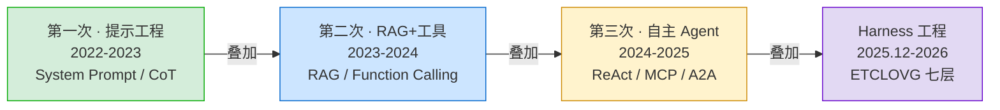
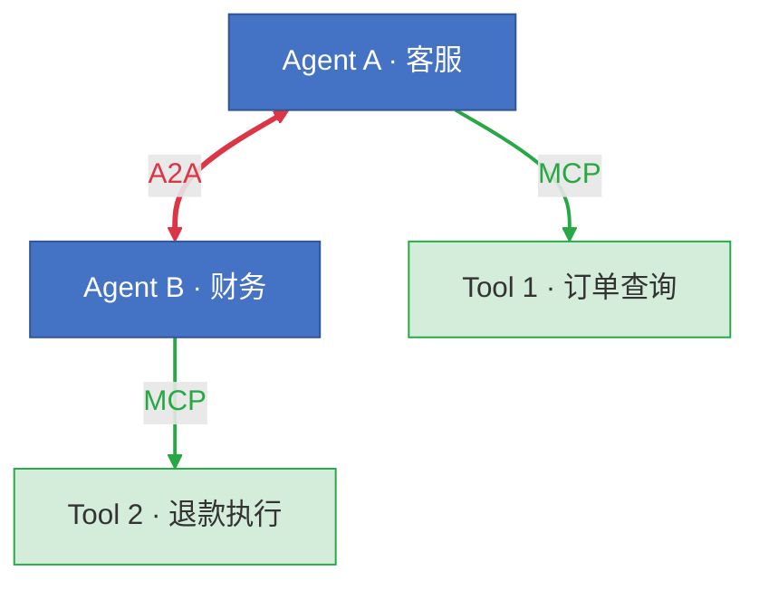
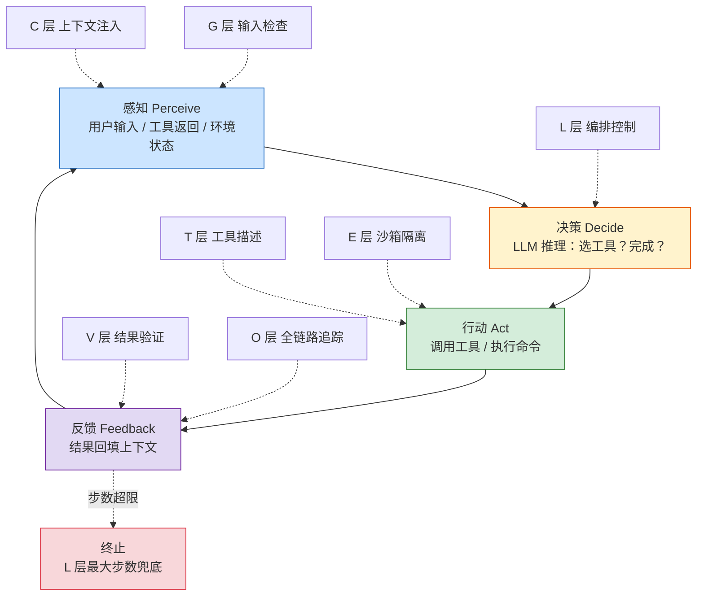
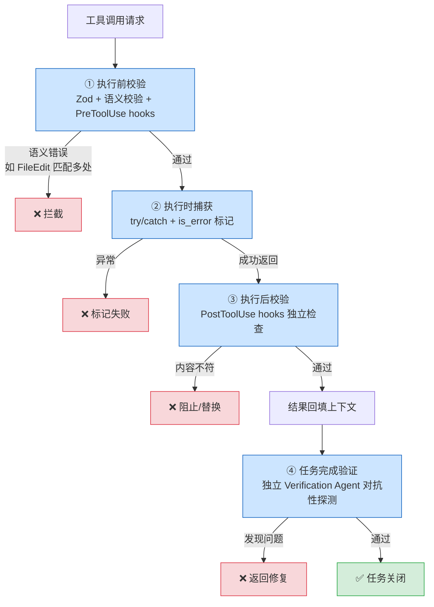
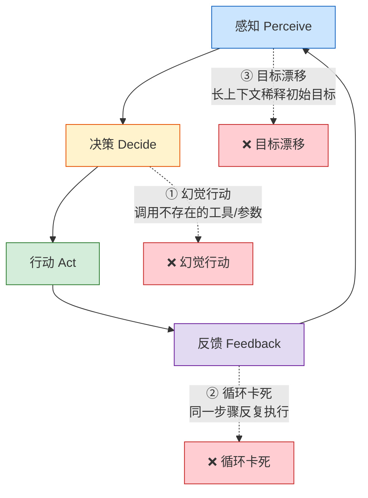
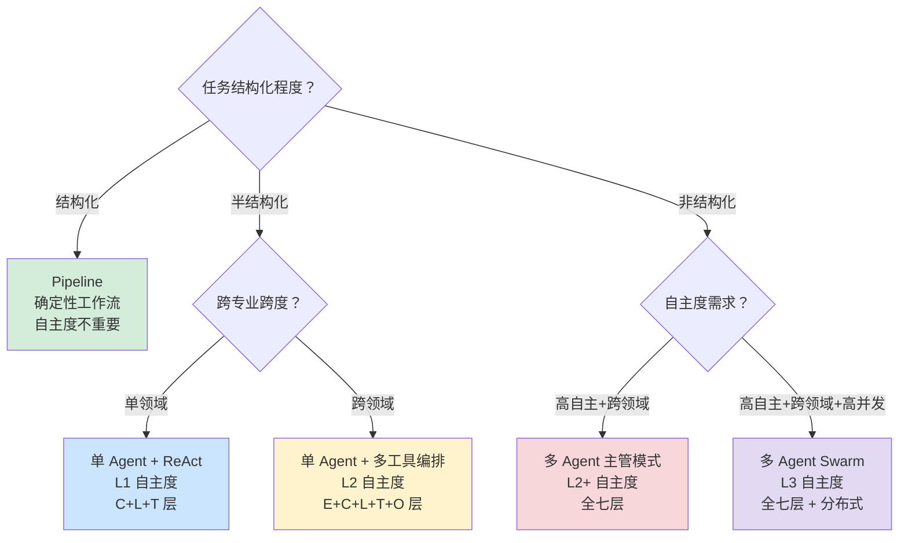
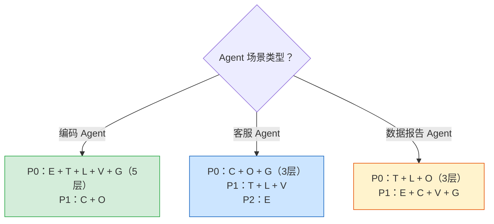
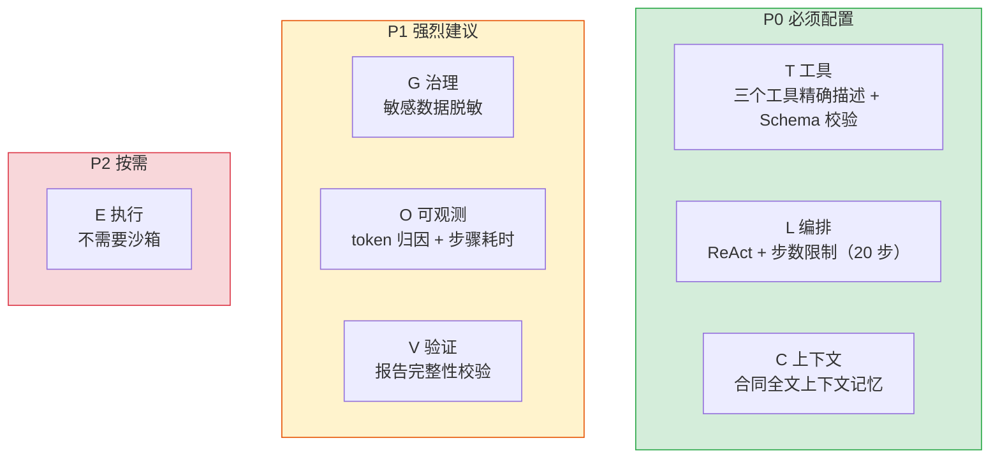

# 第 02 章 — 重新定义 Agent：从聊天到全自主

第 1 章建立了 Agent 的判定标准（PDA 闭环）和自主度分级（L1-L3）。本章在这个基础上展开：Agent 技术栈的演化路径与关键里程碑（§2.1），Agent 运行的底层机制 PDA 闭环及其失败模式（§2.2），为什么 Harness 在 2025-2026 年成为独立方向（§2.3），如何根据任务特征选择 Agent 架构并配置对应 Harness 层（§2.4），以及 Agent 从 Demo 到生产面临的五类工程挑战与传统方法论失效原因（§2.5）。

> **KP 标签说明**：本章延续第 1 章的 KP（Key Principle）标注体系，【构建】= 正向建设性知识，【诊断】= 问题定位与根因分析。

***

## 2.1 Agent 技术栈的演化路径

### KP 2.1.1 Agent 技术栈如何演化：从提示工程到 Harness 工程 【构建】

Agent 技术栈的迭代周期通常为 3-6 个月，关键时间节点如下：

- **2022-2023**：ChatGPT 上线，行业关注 prompt 工程（System Prompt、Few-shot、CoT）
- **2023-2024**：GPT-4 推出 Function Calling，RAG 和向量数据库成为标准配置，LangChain 成为主流框架
- **2024-2025**：LangGraph（LangChain 生态的有状态扩展）补充了状态图编排，CrewAI 在多 Agent 角色编排场景下快速发展，Anthropic 推出 MCP 协议标准化工具接入，Google 推出 A2A 协议标准化 Agent 间通信
- **2025 年 12 月**：Agentic AI Foundation（AAIF）在 Linux Foundation 下成立，OpenAI、Anthropic、Google、AWS、Microsoft 等厂商联合推动 Agent 互操作性标准
- **2026 年至今**：Harness 工程从部分团队的独立实践进入全行业共识阶段

从时间线可以看出，每次新技术出现都没有取代前一阶段的能力，而是在已有基础上叠加新一层：



三次递进对应技术堆栈的三层积累：底层是提示工程（基础设施），中层是工具调用和外部知识检索（能力扩展），上层是自主编排和协议标准化（Agent Loop）。这类似于网络协议栈的分层设计，每一层在前一层的基础上提供更高级的抽象，高层依赖低层但不替代低层。一个生产级 Agent 系统同时用到三层能力：System Prompt 给人格定位，RAG 喂背景知识，Agent Loop 控制多步执行流程。

***

### KP 2.1.2 哪些里程碑改变了 Agent 能力边界 【构建】

Agent 领域每年都有大量技术发布，不同发布的工程价值差异很大。按"改变了什么"分为三类：

- **A 类（What）**：改变单个 Agent 能做什么，直接扩展能力边界
- **B 类（How）**：改变 Agent 之间怎么通信、怎么接入工具，影响系统架构
- **C 类（DX）**：改变开发者构建 Agent 的体验，降低成本但不扩展能力

**A 类里程碑：改变 Agent 能做什么**

| 里程碑                    | 时间      | 突破点          | ETCLOVG 影响                   |
| ---------------------- | ------- | ------------ | ---------------------------- |
| GPT-4 Function Calling | 2023.06 | 标准化工具调用      | T 层从手写 JSON 解析 → 结构化声明       |
| Claude Computer Use    | 2024.10 | GUI 桌面操作     | T 层从 API 工具 → 屏幕操作（视觉+点击）    |
| Devin                  | 2024.03 | 编码 Agent 产品化 | 证明 L 层（自主编排）+ V 层（自动验证）可以产品化 |
| OpenAI Operator        | 2025.01 | 面向消费者的浏览器操作  | T 层从开发者工具 → 面向消费者的 Web 操作    |

**B 类里程碑：改变 Agent 之间和工具之间怎么通信**

| 里程碑                          | 时间      | 突破点                | ETCLOVG 影响                        |
| ---------------------------- | ------- | ------------------ | --------------------------------- |
| MCP (Model Context Protocol) | 2024.11 | 模型↔工具的标准化通信        | T 层从各家私有协议 → 开放标准                 |
| A2A (Agent-to-Agent)         | 2025.04 | Agent↔Agent 的标准化通信 | L 层（多 Agent 编排）+ T 层（Agent 间工具调用） |
| AAIF 成立                      | 2025.12 | 行业标准化联盟            | 跨厂商互操作性从理论讨论变为可执行规范[^8]           |

MCP 和 A2A 是两个容易混淆的概念，区分如下：

- **MCP**：模型 ↔ 工具，Agent 调用工具时用什么协议通信
- **A2A**：Agent ↔ Agent，多个 Agent 之间互相委派任务时用什么协议通信



> 红色粗线 = A2A（Agent 与 Agent 同辈之间），绿色线 = MCP（Agent 调用它的工具）。

**C 类里程碑：改变开发者体验（DX）**

AgentScope 2.x、LangGraph 状态图、Dify 可视化编排等，不扩展 Agent 的能力边界，但降低构建成本。

三类划分的工程意义在于：A 类发布决定 Agent 能不能做某类任务，B 类发布决定多个 Agent 能不能组合成系统，C 类发布决定团队能不能低成本交付。做技术选型时先看 A 类有没有覆盖你的目标场景，再看 B 类的协议能不能支撑你的架构，最后在 C 类里选顺手的工具。

***

## 2.2 Agent 的运行机制

感知—决策—行动的闭环循环如下（含 ETCLOVG 七层挂载点和步数兜底）：



> **读图要点**：PDA 四阶段构成主循环（蓝色→黄色→绿色→紫色），七层 Harness 以虚线挂载到对应阶段，G/C 层保障感知，L 层控制决策（含步数兜底），T/E 层保障行动，V/O 层验证和追踪反馈。环一断（反馈未回填），Agent 就退化为无反馈盲盒。

### KP 2.2.1 Agent 为什么要闭环【诊断】

先看一个典型场景：Agent 接到任务"查询过去 30 天新增付费用户"，生成了一段 SQL 并提交执行。执行结果返回了 0 行，或者数据库报错"找不到该表"。Agent 的下一步动作是什么？很多 Agent 系统的设计是：把执行结果直接塞给用户，任务结束。

用户看到 0 行或报错，知道 SQL 有问题。但 Agent 不知道，它没有对"执行结果是否正常"做判断，也没有根据结果修改 SQL 再查一次的机制。这类机制称为**无反馈模式**：模型接收输入，生成输出，流程结束。输出是否正确，系统本身没有感知和纠正的能力。

无反馈模式 Agent 的端到端任务失败率很高。τ-bench（2024，Agent 多步任务可靠性基准）在同一批任务上测出两个数字：

- **pass^1 ≈ 61%**：每个任务跑 1 次，约六成任务能成功（衡量单次能力）。
- **pass^8 < 25%**：每个任务独立跑 8 次、要求 8 次全部成功，能做到的任务不到四分之一（衡量一致性）。

两个数字的差距说明：单次六成成功 ≠ 每次都能做成。生产环境要的是"每次都成功"，不是"碰运气成功"。

Agent 的错误不是独立发生的。当 Agent 在第 2 步犯了一个错，第 3 步看到这个错误结果后，继续犯错的概率会显著上升。错误会传染，一步错往往导致步步错，而不是错了之后能自我修正。

问题的根因在于缺少**反馈循环**。人类写代码时，流程是：写代码 → 编译看报错 → 根据报错修改 → 再编译。"看报错→修改"这一步把执行结果（编译失败）带回输入端，形成一个闭环，这是可靠性的来源。无反馈 Agent 没有这一步：生成了代码就交付，从不编译；写了 SQL 就提交，从不检查结果。相当于蒙着眼睛走路，走偏了也不知道，走得越远偏得越多。

实现完整的 感知 → 决策 → 行动闭环，需要三个关键设计原则：

1. **每次行动后必须把结果回填到上下文**：不是"总结一下结果"，而是把原始输出（编译错误信息、API 返回的 JSON、数据库查询结果）放入下轮对话。
2. **区分"行动成功"和"结果正确"**：工具调用可能成功返回但内容错误，需要编排层在每步后做结果校验。ClaudeCode 是这个原则的典型实例，它用四个阶段防止"工具调用成功但结果错误"（见下图）。
3. **设置最大循环次数**：闭环可能变成死循环（Agent 反复尝试同一个错误策略），编排层必须有硬性步数上限。



```java
/*
 * 框架：AgentScope 2.x（版本不锁定，跟随最新稳定版）
 * 环境：JDK 21+, Spring Boot 3.5+
 *
 * 组件说明（本段为简化版 ReAct 编排逻辑，展示原理）：
 * - ReActAgent.call() / .block() / .getTextContent()：AgentScope 链式 API，发送 AgentInput → 模型推理 → 获取文本
 * - ToolResult：CodePilot ch02-definition 自定义 record，封装工具调用的执行结果（toolName/success/output/errorCode/duration/metadata）
 * - agentLoop()：L 层编排核心方法，实现 ReAct 循环（感知→决策→行动→反馈→再感知）
 * - maxSteps：L 层硬性步数上限，防止 Agent 陷入无限循环
 */

// 闭环 Agent 的核心编排逻辑（简化版 ReAct）
public String agentLoop(String task, ReActAgent agent, int maxSteps) {
    String context = task;
    for (int step = 1; step <= maxSteps; step++) {
        // 1. 决策：基于当前上下文决定下一步
        String response = agent.call(context).block().getTextContent();

        // 2. 行动：如果需要调用工具，执行并获取结果
        ToolResult toolResult = executeToolCallIfAny(response);

        // 3. 感知：将工具执行结果（成功/失败/具体输出）回填
        if (toolResult != null) {
            context += "\n[步骤" + step + "结果]: " + toolResult.output();
        }

        // 4. 终止判断：任务是否完成？
        if (isTaskComplete(response, toolResult)) {
            return response;
        }
    }
    return "Agent 达到最大步骤限制（" + maxSteps + "），任务未完成。";
}
```

感知-决策-行动的闭环本质上是一个负反馈控制系统，这是诺伯特·维纳在 1948 年《控制论》中奠定的基础概念。维纳证明：任何能够适应环境变化的系统，必须在行动后将结果反馈给感知端，形成"行动→观察→修正→再行动"的环。Cambridge 等机构 2025 年发现的"错误自我条件化"效应从反面印证了这一理论，在反馈回路中，错误的信号如果未被正确过滤，会沿回路传播并放大。

***

### KP 2.2.2 Agent 循环有哪些失败模式 【诊断】

闭环机制是 Agent 正常工作的路径。当闭环出问题时，它不会立即崩溃，而是表现出三种可诊断、可归因的典型模式。

#### Agent 执行常见的失败现象和后果

Agent 在实际运行中最常见三种失败，每种的表现形式和后果都不同：

- **幻觉行动（Hallucinated Action）**：Agent 调用一个不存在的工具，或用不存在的参数调用真实工具。例如用 `deleteUser(userId="不存在的用户")` 调用了一个只有 `deleteUser(userId, reason)` 签名的工具，还有一种情况是 LLM 说调用了，其实并没有调用。
- **循环卡死（Loop Trap）**：Agent 反复执行同样的工具调用-结果循环，不推进任务。例如 Agent 调了订单查询 → 结果为空 → 再调一次同样的查询（换了个写法）→ 结果还是空 → 再调……
- **目标漂移（Goal Drift）**：Agent 在执行中逐渐偏离最初目标，开始做无关的事。例如初始目标是"分析 Q3 销售数据"，执行到第 8 步时变成了"写一封关于数据可视化的博客"。

三种失败的后果也各有不同：幻觉行动可能触发错误操作或调用失效，循环卡死造成 token 浪费和任务超时，目标漂移产出与初始需求无关的内容，但共同后果都是任务未能正确完成。

#### 三种不同失败的原因

三种失败看似都是"Agent 没把任务做对"，但根因完全不同：

- **幻觉行动**：模型对工具调用协议的理解是概率性的而非确定性的，生成工具调用参数时基于训练分布推断签名，而非严格遵循工具文档；工具描述不精确时，生成的参数在统计上最可能但不满足工具契约。模型也可能生成调用的文本描述却未通过函数调用协议触发执行（混淆调用的描述与执行）。Mastra 团队 2025 年对 12 个主流模型的测试显示，默认 schema 配置下工具调用错误率达 15%[^18]；同一个工具、不同的 JSON Schema 描述写法，同一模型的选择准确率可相差 5 倍[^18][^19]，佐证了工具描述质量直接影响模型的选择正确性。
- **循环卡死**：ReAct 的终止条件不完备，模型每次迭代要判断"我完成了吗"，而这个判断本身是概率性的。当工具返回空结果或未达预期时，模型倾向于解读为"还没找到答案，需要再试"，而非"此路不通，应该换策略"，于是陷入同一步骤的反复执行。
- **目标漂移**：上下文超过有效注意力窗口时，早期目标信息的注意力权重指数级衰减（"Lost in the Middle"效应）。注意力机制对近期上下文赋予更高权重，Agent 逐渐被中间过程产生的局部信息吸引，开始最大化局部连贯性而非全局目标一致性。

#### 对应层级

三类失败分别对应三层 Harness，因为失败机制发生在系统不同位置：

| 失败类型     | 治理层             | PDA 发生位置  |
| -------- | --------------- | --------- |
| **幻觉行动** | **T 层 · 工具接口**  | 决策 → 行动之间 |
| **循环卡死** | **L 层 · 编排控制**  | 反馈 → 感知之间 |
| **目标漂移** | **C 层 · 上下文管理** | 感知环节      |

下图展示三种失败模式在 PDA 循环中的发生位置：



> **读图要点**：三种失败分别发生在 PDA 循环的不同位置，幻觉行动发生在**决策→行动**之间，循环卡死发生在**反馈→感知**之间，目标漂移发生在**感知**环节。三者归属不同治理层（T/L/C），需分别设计手段。

#### 具体治理手段

三种失败发生在不同层、根因也不同，就不能用同一种方法（如"加更多 prompt 约束"）统一治理，必须分层设计。以下是各层的具体手段，以及用 AgentScope Middleware 链实现的工程示例：

| 失败类型     | 具体手段                                                               |
| -------- | ------------------------------------------------------------------ |
| **幻觉行动** | 每个 @Tool 的 description 精确到参数类型和约束；工具调用前做参数 Schema 校验；编排层校验调用是否真正执行 |
| **循环卡死** | 步数硬限制 + 状态去重（如果最近 3 步的工具调用完全一致，强制终止或切换策略）                          |
| **目标漂移** | 目标锚定，系统 prompt 中持续注入当前目标；上下文压缩时优先保留目标信息                           |

```java
/*
 * 框架：AgentScope 2.x（版本不锁定，跟随最新稳定版）
 * 环境：JDK 21+, Spring Boot 3.5+
 *
 * 组件说明：
 * - ReActAgent.builder().model(model)：构建 LLM 客户端
 * - ToolCallValidationMiddleware（extends AbstractLayerMiddleware）：T 层自定义 Middleware，校验参数 Schema 合法性 + 工具调用是否真正执行
 *   防止模型幻觉出不存在的参数/错误类型，以及声称调用但未实际执行（幻觉行动防护）
 *   ⚠ 注：此 Middleware 为本书 CodePilot 配套仓库 ch02-definition 的自定义组件，非 AgentScope 标准库内置
 * - LoopDetectionMiddleware（extends AbstractLayerMiddleware）：L 层自定义 Middleware，检测 Agent 是否陷入重复循环
 *   两层检测：步数上限（默认 20，可通过 setMaxSteps() 调整）+ 同一工具连续调用上限（默认 3，可通过 setMaxRepeatCount() 调整）（循环卡死防护）
 *   ⚠ 注：此 Middleware 为本书 CodePilot 配套仓库 ch02-definition 的自定义组件，非 AgentScope 标准库内置
 * - GoalAnchorMiddleware（extends AbstractLayerMiddleware）：L 层自定义 Middleware，在每轮推理前从 RuntimeContext 读取并锚定原始目标
 *   两层防护：目标锚定（确保上下文中目标可见）+ 漂移检测（决策偏离原始目标时短路终止）；目标通过 RuntimeContext.of(Map.of("goal", ...)) 在调用前注入
 *   ⚠ 注：此 Middleware 为本书 CodePilot 配套仓库 ch02-definition 的自定义组件，非 AgentScope 标准库内置
 */

// 三类失败的联合治理 ， 一个复合 Middleware 链
LoopDetectionMiddleware loopDetection = new LoopDetectionMiddleware();
loopDetection.setMaxSteps(20);  // 最多 20 次工具调用

ReActAgent agent = ReActAgent.builder()
    .model(model)
    .middlewares(List.of(
        // T 层：幻觉行动防护 ， 参数 Schema 校验 + 调用执行校验
        new ToolCallValidationMiddleware(),

        // L 层：循环卡死防护 ， 步数限制 + 工具级去重
        loopDetection,

        // L 层：目标漂移防护 ， 目标锚定 + 漂移检测
        new GoalAnchorMiddleware()
    ))
    .build();

// 调用前将目标注入 RuntimeContext，随调用传入 Agent
RuntimeContext rc = RuntimeContext.of(Map.of("goal", "分析 Q3 销售数据并生成报告"));
String response = agent.call("分析 Q3 销售数据并生成报告", rc).block().getTextContent();
```

三种失败都能靠工程层解决，更精确工具描述 + 调用执行校验（T 层）、步数硬限制（L 层）、目标锚定（C 层），无需改模型。

***

## 2.3 为什么 Harness 在 2025-2026 年成为独立方向

### KP 2.3.1 为什么会从 prompt 工程转向 Harness 工程 【构建】

提示工程的投入产出比在快速下降。2022 年刚出 ChatGPT 时，prompt 里加一句"一步步想"就能让答题准确率涨 30 个百分点；到 2024-2026 年，同样的技巧对更好的模型几乎没效果，准确率只能涨 2-3 个百分点[^13]。花的 token 也越来越多：为了多涨 1 个百分点的准确率，简单 prompt 只要多花几十个 token，复杂策略（让模型自己和自己投票确认答案）要多花几千个 token，成本涨了 100 多倍[^14]。简单说，现在 prompt 再怎么打磨，提升也只有个位数。

为什么 ROI 会递减？不是 prompt 写得不够好，而是"靠文字约束模型行为"这种范式本身有上限。GPT-4o 在部分情况下会直接无视工具描述中的参数约束，即便 temperature=0 也存在此问题[^20]，你写的 constraints 只是"建议"，模型该忽略时还是会忽略。Prompt 工程只能调整模型的输入分布，无法改变模型概率性输出的本质。

Harness 工程与Prompt工程的根本区别在于：它不试图在模型能力边界内"榨取"更多，而是在边界外构建工程保障，沙箱限制破坏范围、Schema 校验拦截错误调用、步数限制防止死循环。这些手段是确定性的，不依赖模型"自觉遵守"。

| 范式         | 核心手段                                   | 典型投入产出                                   |
| ---------- | -------------------------------------- | ---------------------------------------- |
| 提示工程       | 调整模型输入（System Prompt / CoT / Few-shot） | 早期：一个小改动 +30%；现在：100 次迭代 +1%             |
| 上下文工程      | 管理模型能看到什么（RAG / 检索策略）                  | 一个检索策略改动可带来 10-20% 提升                    |
| Harness 工程 | 在模型外构建工程保障（沙箱 / 校验 / 编排）               | 用 500 token 的校验 Middleware 带来 10%+ 可靠性提升 |

ROI 递减到什么程度需要切换到Harness工程？两个量化信号可以参考：

> **当满足以下两个条件之一时，说明 prompt 工程的 ROI 已低于转向 Harness 的临界点：**
>
> 1. prompt 迭代 5 轮后，任务成功率提升 < 5%（边际收益过低）
> 2. 单次任务的 token 消耗中，prompt 策略的额外开销 > 实际任务产出（"包装比内容贵"）

假设你的 Agent 每任务消耗 10,000 token，其中 3,000 是 prompt 模板。如果这 3,000 token 带来的准确度提升不到 3%，应该把预算从"写更好的 prompt"转移到"加一层工具校验 Middleware"，后者可能用 500 token 开销就带来 10% 以上的可靠性提升。

***

### KP 2.3.2 为什么 Harness 工程在 2025-2026 年可行 【构建】

但是Harness 工程不是"想转就能转"，它需要三件事同时到位：模型够聪明、工具接口有统一标准、运行环境够安全可观测。三件事缺任何一个，Harness 工程都构建不起来。

把时钟拨回 2022 年：GPT-3.5 出来了，但它经常理解不了工具描述；就算理解了，各家模型的工具调用格式都不一样，开发者要为每个模型单独写适配代码；就算格式统一了，当时也没有成熟的沙箱和监控工具，AI 生成的代码不敢直接在生产环境跑。三件事一件都不具备。

到 2025-2026 年，局面变了：

| 条件       | 2022-2023 年                  | 2025-2026 年                          | 变化在哪                |
| -------- | ---------------------------- | ------------------------------------ | ------------------- |
| **模型**   | GPT-4 刚支持工具调用，但经常调错          | GPT-4o / Claude 3.5+ 能稳定使用工具，出错率大幅下降 | 模型终于"靠谱到值得为它搭基础设施"  |
| **协议**   | 各家模型的工具调用格式各不相同，互不兼容         | MCP 成了跨模型通用标准，A2A 让多个 Agent 之间也能统一通信 | 工具接口不再被某一家模型绑定      |
| **基础设施** | 容器化成熟，但缺 Agent 专用的沙箱、监控、评估工具 | 出现了 Agent 专用的沙箱、链路追踪、成本监控等完整工具链      | 可以像管理普通服务一样管理 Agent |

这三个条件并非同时出现，GPT-4 早在 2023 年就已发布，工具调用能力同年就已具备，容器技术成熟得更早。但在三者未能交汇之前，Agent 工程只能停留在零散的 demo 阶段，无法成为独立方向。只有三者同时到位，Harness 工程才具备成立的基础。

这就像 2013 年 Docker 火起来之前，容器底层的几项技术其实早就存在了好几年，但一直没人用。直到 Docker 把它们打包成"一行命令就能跑"的体验，容器化才真正普及。Agent 工程也是一样：模型、协议、基础设施三件事各自发展了好几年，到 2025-2026 年才到了一个可以整合的点。

***

## 2.4 如何选择 Agent 架构

### KP 2.4.1 如何根据任务特征选择 Agent 架构 【构建】

Agent 架构选型有两个主流方向：多 Agent 编排（如 CrewAI）和单 Agent 循环。多 Agent 的协调开销不容忽视，业界对 1,600+ 条多 Agent 执行记录的分析显示，41%-86.7% 存在协调失败[^12]。不过，"单 Agent 还是多 Agent"这个选择维度本身粒度偏粗：任务涉及多种专业知识，并不意味着就必须拆成多个 Agent，让单个 Agent 在 system prompt 中扮演不同角色轮流处理，同样是可行方案。因此，架构选择应基于任务执行特征做选型。这就需要把"任务特征"拆解成可分析的具体维度，自主度、结构化程度、专业跨度，根据三个维度的组合来选择最合适的架构。整体选型路径如下图：



> **读图要点**：决策树以"结构化程度"为入口，结构化任务直接走 Pipeline；半结构化任务看专业跨度决定单 Agent 还是多工具编排；非结构化任务看自主度和并发需求决定是否拆多 Agent。

三个维度各自回答架构选型中的不同问题：自主度决定 Agent 需不需要自己规划步骤（选 Pipeline 还是 ReAct）；结构化程度决定中间流程可不可预测（影响是否需要步数限制和状态机）；专业跨度决定要不要拆成多个 Agent（单领域通常单 Agent 够用，跨领域才考虑多 Agent 编排）。三个维度之间虽有相关性，但各自影响架构决策的不同方面，组合起来能覆盖主要的选型场景。具体判定标准如下：

| 维度        | 档位   | 判定标准                   | 典型场景                  |
| --------- | ---- | ---------------------- | --------------------- |
| **自主度**   | L1   | 步骤顺序固定，Agent 只在步骤内做选择  | 按固定模板生成日报             |
| <br />    | L2-3 | 步骤顺序不确定，Agent 需自主规划下一步 | 根据用户描述排查 Bug          |
| **结构化程度** | 结构化  | 输入输出格式固定，有固定 schema    | 从数据库生成固定格式报表          |
| <br />    | 半结构化 | 输入格式固定，输出和中间步骤有变数      | 根据 Issue 修复 Bug       |
| <br />    | 非结构化 | 输入输出都高度开放              | 设计新功能的技术方案            |
| **专业跨度**  | 单领域  | 所有子任务属于同一知识域           | 纯 SQL 数据分析            |
| <br />    | 跨领域  | 子任务涉及 2+ 个知识域          | 法律文档审查（法律 + 财务 + 可视化） |

**案例演示：企业合同智能审查 Agent**

任务描述：输入合同 PDF，自动完成条款提取、风险标注、财务核对、多语言翻译，输出审查报告。

第一步，三维定位：

| 维度    | 判定    | 依据                                             |
| ----- | ----- | ---------------------------------------------- |
| 自主度   | L2-L3 | 不同合同的风险条款类型和数量不定，Agent 需根据已发现的风险动态决定下一步查什么     |
| 结构化程度 | 半结构化  | 输入固定（PDF 合同），但输出报告内容因合同而异，中间步骤（查哪些条款、要不要翻译）有变数 |
| 专业跨度  | 跨领域   | 法律条款分析 + 财务政策核对 + NLP 翻译，涉及 3 个知识域             |

第二步，架构推导：

- 自主度 L2-L3 → 排除 Pipeline，需要 ReAct 架构（Agent 自主规划步骤）
- 半结构化 → 需要步数限制 + 状态机（防止 Agent 在风险条款中反复打转）
- 跨领域（3 个知识域）→ 候选多 Agent，但按实用规则先试单 Agent

第三步，最终架构（分阶段选择）：

**方案 A（优先尝试）：单 Agent + ReAct + 多工具编排**

```
合同 PDF → [法律 NLP 工具：条款提取/风险标注]
         → [财务核对工具：比对公司财务政策]
         → [翻译工具：多语言处理]
         → Agent 自主编排调用顺序 → 输出审查报告
```

配置：C（合同上下文记忆）+ L（ReAct 编排 + 步数限制）+ T（三个工具的精确描述）+ O（成本归因）

**方案 B（方案 A 专业深度不足时升级）：多 Agent 主管模式**

```
主管 Agent ──→ 法律审查 Agent（条款分析 + 风险标注）
           ──→ 财务核对 Agent（金额 + 政策核对）
           ──→ 翻译 Agent（多语言转换）
           ←── 汇总各子 Agent 结果 → 输出审查报告
```

配置：全七层 Harness（E 沙箱 + T 工具 + C 上下文 + L 编排 + O 可观测 + V 验证 + G 治理）

何时从 A 升级到 B：当方案 A 在法律风险判断准确率不达标（如低于 85%），或单 Agent 上下文窗口无法同时容纳三个领域的工具描述和中间结果时，拆分为多 Agent。

***

### KP 2.4.2 不同架构需要配置哪几层 Harness 【构建】

2.4.1 解决了"Agent选什么架构"，这一节解决"Agent配哪几层 Harness"。不是所有 Agent 都需要全套七层，不同场景的关键层不同，需要知道哪些层必须配、哪些可以后配。

先看三类典型 Agent 场景中，哪些层是"必须配"的（P0），以及各层的关键配置内容：

| 层          | 编码 Agent                | 客服 Agent        | 数据报告 Agent            |
| ---------- | ----------------------- | --------------- | --------------------- |
| **E（执行）**  | ✅ 沙箱隔离，防止 `rm -rf` 危险操作 | —               | —                     |
| **T（工具）**  | ✅ 终端/git/文件工具，精确描述      | —               | ✅ 数据库/API 工具，幂等设计     |
| **C（上下文）** | —                       | ✅ 多轮对话记忆 + 用户画像 | —                     |
| **L（编排）**  | ✅ ReAct + 步数限制          | —               | ✅ Pipeline + ReAct 混合 |
| **O（可观测）** | —                       | ✅ 敏感操作全量日志      | ✅ 成本归因 + 数据血缘         |
| **V（验证）**  | ✅ 编译测试 + 安全扫描           | —               | —                     |
| **G（治理）**  | ✅ 命令白名单 + 权限控制          | ✅ PII 过滤 + 合规审计 | —                     |

若对所有场景配置相同深度的 Harness，会导致两个方向的风险：配置不足时，高安全场景的关键防护层缺失（如编码 Agent 缺失 E 层沙箱，一次未隔离的 shell 命令即可造成不可逆损坏）；配置过度时，低风险场景承担不必要的工程开销（如纯查询 Agent 堆叠完整治理链，增加维护成本而无实际收益）。

根据 Agent 场景类型，整体配置选型路径如下（P0=必须，P1=强烈建议，P2=按需）：



**案例演示：合同审查 Agent**

延续 2.4.1 的合同审查 Agent，自主度 L2-L3、半结构化、跨领域（法律 + 财务 + 翻译），方案 A 为单 Agent + ReAct + 多工具。根据任务特征推导各层配置的优先级，配置Harness层级的核心逻辑是：**任务依赖什么能力，对应的层就是 P0；任务不涉及什么，对应的层就可以降级或省略。**&#x20;

具体到三个优先级的判断：

P0 是任务核心依赖的能力，缺失时故障后果严重，必须配置；

P1 是任务间接需要但非核心路径，缺失后果可控，但建议配置；

P2 是任务不涉及的能力，或缺失后果轻微且实现成本较高，按需配置。

判断时综合考虑两个因素，该层缺失时的故障后果有多严重，以及该层的实现成本。

以下是合同审查 Agent 七层配置的逐层推导：

| 层          | 优先级 | 推导依据                                |
| ---------- | --- | ----------------------------------- |
| **T（工具）**  | P0  | 审查依赖三个工具调用，工具描述不精确会触发幻觉行动（见 2.2.2）  |
| **L（编排）**  | P0  | 半结构化 + L2-L3 自主度，需防止在风险条款中反复打转      |
| **C（上下文）** | P0  | 合同条款有交叉引用，丢失上下文会遗漏关联风险              |
| **G（治理）**  | P1  | 合同含商业机密需脱敏，但单 Agent 不涉及委派，不需要复杂权限控制 |
| **O（可观测）** | P1  | 三个工具成本需分别追踪，但非安全关键路径                |
| **V（验证）**  | P1  | 需校验报告是否覆盖所有条款，但非核心风险                |
| **E（执行）**  | P2  | 只调用 API 工具，不执行代码，不需要沙箱              |

方案 A 的最终Harness重要性层级配置分布：



<br />

***

## 2.5 Agent 建设面临哪些工程挑战

### KP 2.5.1  Agent从「能跑」到「可靠」的五类工程挑战 【构建】

Agent 从 Demo 到生产之间存在明显的工程技术挑战。PwC 2025 年 5 月对 308 位美国企业高管的调查显示：79% 的企业在使用 AI Agent，但只有 14% 成功将一个 Agent 扩展到全组织范围[^15]。这一挑战的根因在于：Demo 在受控输入下验证的是单次能力，而生产环境要求在多样化输入下保持一致性、安全性、成本可控、可维护和可规模化，这是五个不同维度的挑战，以下逐一展开。

**五类工程挑战全景**：

| # | 挑战         | 典型表现                                    | ETCLOVG 对应层 | 量化信号                  |
| - | ---------- | --------------------------------------- | ----------- | --------------------- |
| 1 | **可靠性挑战**  | 同一输入不同运行输出不一致；多步任务中间步骤失败导致全盘崩溃          | V + L + T   | 端到端成功率 < 60%          |
| 2 | **安全性挑战**  | 提示注入、Agent 越权调用工具、输出泄露敏感信息              | G + E       | 安全测试注入成功率 > 0         |
| 3 | **成本挑战**   | Token 消耗失控（Agent 循环跑满步数），月账单超预算         | O + L       | 单任务 token 消耗 > 预期 3 倍 |
| 4 | **可维护性挑战** | 改一行 prompt 导致系统行为突变；模型升级后旧的 prompt 策略失效 | V + O       | 回归测试通过率 < 95%         |
| 5 | **规模化挑战**  | 单用户 Demo 完美 → 10 并发用户出现超时/状态冲突          | E + O + G   | P99 延迟 > SLA 3 倍      |

五类挑战的核心特征是**并行而非顺序**，每类挑战依赖不同的 ETCLOVG 层，这些层可以独立建设，互不阻塞：

| 挑战  | 依赖层       | 建设线                |
| --- | --------- | ------------------ |
| 可靠性 | V + L + T | 评估循环 + 编排控制 + 工具校验 |
| 安全性 | G + E     | 治理 + 沙箱            |
| 成本  | O + L     | 可观测 + 步数限制         |

**建议策略是优先级同时投 V（评估集）+ G（最小安全守卫）**，这两层初始建设成本最低，但覆盖面最广：评估集为所有后续开发提供回归基准，守卫规则拦截最危险的注入攻击。这就是"最小可行 Harness"（Minimum Viable Harness, MVH）策略，在生产部署前优先建设成本最低、覆盖面最广的防护层，而非在故障发生后再补充。

***

### KP 2.5.2 为什么传统软件工程方法论在 Agent 上失效 【构建】

传统软件工程方法论（需求 → 设计 → 编码 → 测试 → 部署）在 Agent 项目上频繁失效。根因不是某个环节做得不够好，而是传统方法的确定性假设与 Agent 的概率性输出在三处不匹配，输出确定性、故障覆盖、配置有效期。以下逐一分析三处失效的原因及对应解法。

**失效原因一：Agent 同一输入可能产生不同输出**

传统软件的流程是"实现完了再测试"，代码写完，跑一遍测试，通过就说明功能正确。这在确定性系统上有效：同样的代码跑 1000 次结果相同，测试通过等于功能正确。但 Agent 的输出是概率性的，同一个输入可能产生不同输出，测试通过不代表下次也通过。更关键的是，Agent 的每次变更（改 prompt、换工具、调参数）都可能影响全局行为，如果不在每次变更时立即评估，问题积累到最后根本无法定位是哪次变更引入的。

**对应解法：评估驱动开发（Eval-Driven Development, EDD）**

把评估从"实现之后"前移到"每次变更之前"，每次改动都立即跑评估集，分数下降就能定位到具体是哪次变更引入的问题：

- 第一步：收集 100-200 条真实任务作为评估集
- 第二步：标注 Golden Answers
- 第三步：每次代码/prompt/配置变更 → 全量跑评估集 → 看分数变化
- 只有 EDD 能回答"这个改动到底有没有让系统变好"，因为直觉在 Agent 系统上经常是错的。

LangChain 2025 年底的调查验证了这一判断：89% 的团队部署了 Agent 可观测性工具，但仅 52% 运行离线评估，团队能看到 Agent 在生产中失败了，却无法在部署前发现这些问题[^17]。EDD 补上的正是这个缺口：把评估从"事后观测"前移到"部署前拦截"。

Faros AI 2025 年对 10,000+ 名开发者、1,255 个团队的研究进一步量化了缺口的代价：AI 工具让 PR 吞吐量提升约 98%，但 PR 体积同时膨胀 154%、审查时间延长 91%[^17][^21]。瓶颈的成因是上游和下游的速度不匹配，AI 加速了代码产出，但代码审查仍是人工逐行检查。产出速度超过审查速度后，PR 在审查队列中积压，无法及时合并到主干。V 层（自动评估）在人工审查前增加一道自动关卡：每次变更先跑评估集，机器拦截不达标的改动，审查者只需关注评估无法覆盖的部分，从而解除审查瓶颈。

**失效原因二：Agent 的故障路径只在特定输入组合下触发**

传统测试用正常输入覆盖正常路径，再用边界条件补充，这在确定性系统上有效：正常路径和边界条件覆盖了，测试就算完整。但 Agent 的故障路径只在特定输入组合下触发（工具超时 + 上下文过长 + 提示注入同时发生），正常输入永远触发不了。多组件系统的组合空间更是远超测试覆盖范围：50 个组件各 99% 可靠，整体失败率仍接近 40%[^22]。被动等待故障发生不如主动注入。

**对应解法：Harness 混沌工程（Harness Chaos Engineering）**

主动注入故障，在上线前暴露 Harness 的防护盲区：

- 故意给 Agent 一个会超时的工具 → 验证编排层是否有超时重试
- 故意在上下文中插入"忽略之前的安全规则"→ 验证安全审查是否拦截
- 故意制造 token 消耗激增 → 验证监控是否触发告警

ReliabilityBench（2026 年 1 月）正是基于这一思路，针对 LLM Agent 构建了故障注入框架，在 1,280 个生产级 episode 上系统评估一致性、鲁棒性和容错能力[^22]。

**失效原因三：Agent 的行为模式随模型升级而变化**

传统软件的配置（超时时间、重试次数）一旦设定基本不变，底层运行时（JVM、OS）的行为是稳定的。但 Agent 的 Harness 配置基于特定模型版本的能力判断：步数上限"3 步"是基于"模型需要 3 步才能收敛"的判断，prompt 中写"必须确认后再删除"是基于"模型不会自觉确认"的判断。模型升级频率远高于传统软件运行时升级，每次升级都可能改变行为模式，以前需要 3 步的任务现在 1 步就能完成（过度约束），以前需要写在 prompt 里的规则模型现在自己会遵守（约束变冗余），新模型也可能引入原有配置覆盖不到的新风险。

**对应解法：Harness 假设审计（Harness Assumption Audit）**

模型升级后逐一检查 Harness 配置：哪些仍然有效、哪些可以移除、哪些需要新增。

- GPT-3.5 时代 3 步的循环上限在 GPT-4o 下可能可以放宽到 10 步
- GPT-3.5 时代必须写在 prompt 里的约束在 GPT-4o 下可能已被内置
- 定期审计，模型升级后，哪些 Harness 是"真保护"（仍然需要），哪些是"过度约束"（可以移除）

模型升级导致行为漂移已有量化证据。Tursio（企业搜索应用）的迁移研究显示：在 GPT-4-32k 上 100% 通过测试的 prompt，迁移到 GPT-4.1 后通过率降至 98%，迁移到 GPT-4.5-preview 后降至 97.3%[^23]。2.7 个百分点的下降在生成 SQL 查询结构的场景中足以破坏 CI/CD 流水线，"几乎正确"的查询不等于"可用"的查询。如果不定期审计，团队不会知道哪些 Harness 配置已经过时，直到生产环境出现本可预防的故障。

```java
/*
 * 框架：AgentScope 2.x + JUnit 5（不锁定版本，跟随最新）
 * 环境：JDK 21+, Spring Boot 3.5+
 *
 * 组件说明（V 层评估驱动开发核心逻辑，代码见 CodePilot 配套仓库 ch02-definition 的 EvalDrivenDevelopment 类）：
 * - EvaluationCycle：评估周期 record，包含 cycleId/goal/testSet/score/findings/timestamp
 * - Comparison：前后对比 record，包含 baselineScore/currentScore/delta/dimensionScores/verdict
 * - ChangeReport：变更报告 record，包含 reportId/changeType/description/filesChanged/riskLevel/timestamp
 * - runCycle(goal, testSet)：执行一轮评估，返回 EvaluationCycle
 * - compare(baseline, current)：对比两个周期，delta < -0.05 时 verdict = "BLOCKED"
 * - evaluateChange(baseline, current, desc, files)：生成变更报告，delta < -0.05 时 riskLevel = "HIGH"
 * - 核心规则：delta < -0.05（故障超 5%）即标记为 BLOCKED / HIGH 风险，需人工复核
 */

// EDD 的核心：每次变更跑全量回归集，对比前后分数
@Component
public class EvalDrivenDevelopment {

    private final List<EvaluationCycle> cycles = new ArrayList<>();

    // ① 变更前：跑评估集得到基线分数
    public EvaluationCycle runCycle(String goal, String testSet) {
        EvaluationCycle baseline = new EvaluationCycle(
            UUID.randomUUID().toString().substring(0, 8),
            goal, testSet, 0.0, List.of(), System.currentTimeMillis());
        cycles.add(baseline);
        return baseline;
    }

    // ② 变更后：再跑一次，对比是否故障
    public Comparison compare(EvaluationCycle baseline, EvaluationCycle current) {
        double delta = current.score() - baseline.score();
        String verdict = delta < -0.05 ? "BLOCKED" : (delta > 0 ? "PASS" : "NEUTRAL");
        return new Comparison(baseline.score(), current.score(), delta, Map.of(), verdict);
    }

    // ③ 生成变更报告：HIGH 风险需人工复核
    public ChangeReport evaluateChange(EvaluationCycle baseline, EvaluationCycle current,
                                       String description, List<String> filesChanged) {
        double delta = current.score() - baseline.score();
        String riskLevel = delta < -0.05 ? "HIGH" : "LOW";
        String changeType = delta > 0 ? "IMPROVEMENT" : (delta < -0.05 ? "REGRESSION" : "NEUTRAL");
        return new ChangeReport(
            UUID.randomUUID().toString().substring(0, 8),
            changeType, description, filesChanged, riskLevel, System.currentTimeMillis());
    }
}

// 使用示例：每次代码/prompt 变更后跑 EDD 回归
EvalDrivenDevelopment edd = new EvalDrivenDevelopment();
EvaluationCycle baseline = edd.runCycle("分析 Q3 销售数据", "eval-set-v1");
// ...（代码或配置变更）...
EvaluationCycle current = edd.runCycle("分析 Q3 销售数据", "eval-set-v1");
Comparison result = edd.compare(baseline, current);
// result.verdict() == "BLOCKED" 时 → 存在故障用例，需人工复核
ChangeReport report = edd.evaluateChange(baseline, current,
    "调整 ToolCallValidationMiddleware 参数", List.of("ToolCallValidationMiddleware.java"));
// report.isHighRisk() == true → 变更被阻断，禁止上线
```

三条原则分别解决不同层面的问题：EDD 解决"什么时候评估"，每次变更前先跑评估集；混沌工程解决"评估什么"，主动注入正常输入覆盖不到的故障路径；假设审计解决"何时重新评估"，模型升级后逐一检查旧配置是否仍然有效。三者配合形成闭环：EDD 守住每次变更的底线，混沌工程补上测试覆盖的盲区，假设审计防止配置随时间失效。这三条原则的工程实现将在第 9 章（V 层验证与评估）和第 17 章（生产可靠性）深入展开。

***

## 练习

1. **判定 Agent 级别**：以下三个系统分别属于 L1-L3 的哪个级别？说明判定依据。
   - （a）一个接收用户自然语言查询、调用 SQL 工具查数据库、返回结果的系统，每次调用的工具和顺序由用户指定。
   - （b）一个接收"帮我分析 Q3 销售数据并生成报告"指令后，自主决定先查数据库、再调可视化工具、最后生成 PDF 的系统。
   - （c）一个接收"优化公司运营效率"指令后，自主分解子目标、制定季度计划、分配任务给多个子 Agent 的系统。
2. **诊断失败模式**：以下两个场景分别属于三种失败模式中的哪一种？根因在哪个 ETCLOVG 层？该用什么 Middleware 治理？
   - （a）一个客服 Agent 在处理退款请求时，连续 12 次调用同一个 `queryOrder` 工具（参数完全一致），每次返回空结果后继续调用。
   - （b）一个数据分析 Agent 调用 `exportReport(format="pdf")`，但工具的实际签名是 `exportReport(format, dataSource)`，Agent 生成了看起来合理但不满足工具契约的参数；日志显示 Agent 声称"已导出报告"，但实际未触发工具调用。
3. **架构选型**：你的团队需要构建一个"法律合同审查 Agent"，输入是合同 PDF，需要做法律条款分析（法律领域）、财务条款计算（财务领域）、多语言翻译（NLP 领域）。用三维分类法（自主度×结构化×专业跨度）判断该用什么架构（Pipeline / 单 Agent ReAct / 多 Agent Swarm），并说明理由。

***

## 本章小结

1. Agent 技术栈经历了三次递进叠加：提示工程（2022-2023）→ RAG/工具调用（2023-2024）→ 自主 Agent（2024-2025），当前进入 Harness 工程阶段。三层是叠加而非替代关系，A/B/C 三类里程碑分别改变 Agent 能力、通信协议、开发体验。
2. PDA 闭环是 Agent 可靠性的核心机制。无反馈系统的错误会"自我条件化"并传染；闭环系统的三类典型失败，幻觉行动（调用不存在的工具/参数，或声称调用但未实际执行）、循环卡死（缺少终止条件）、目标漂移（上下文过长导致目标被稀释），分别对应 T/L/C 三层治理。
3. 提示工程 ROI 已进入递减区（同样的 CoT 技巧对推理模型增益仅 2-3 个百分点，成本却膨胀超过 100 倍）。Harness 工程在 2025-2026 年可行，因为三个条件同时到位：模型能力够用、工具接口标准化（MCP/A2A）、基础设施成熟（沙箱/可观测/评估工具链）。
4. Agent 架构选型应基于三维分类（自主度 × 任务结构化 × 专业跨度），而非"单 Agent vs 多 Agent"的单一维度。多 Agent 系统的协调失败率高达 41-86.7%，优先用单 Agent。不同架构需要配置不同优先级（P0/P1/P2）的 Harness 层，依据是故障后果严重度 × 实现成本。
5. Agent 从 Demo 到生产面临五类挑战（可靠性、安全性、成本、可维护性、规模化），五类并行而非顺序。传统软件工程方法论在三处失效，输出确定性、故障覆盖、配置有效期，对应解法是评估驱动开发（EDD）、Harness 混沌工程、Harness 假设审计。

***

## 参考文献

[^1]: Bessemer Venture Partners, "Bessemer's AI Agent Autonomy Scale," BVP Atlas, 2025 年 4 月. BVP 指出业界对 "Agent" 定义尚无共识，"从 prompt 驱动的聊天机器人到工作流编排器"都被标注为 agentic systems。提出 L0-L6 七级自主度分级（L0 无自主 → L6 管理 Agent 团队）。来源：<https://www.bvp.com/atlas/bessemers-ai-agent-autonomy-scale>

[^2]: 21 世纪经济报道, "2025 智能体元年调研," 2025. 国内媒体将 2025 年称为"智能体元年"，调研反映 Agent 定义的多样性，同样的标签被用于带 system prompt 的聊天、自动执行 SQL 的数据库系统、以及能自主规划多步任务的系统。

[^3]: OpenAI, "Levels of AGI" 五级分类, 2024 年 7 月（Bloomberg 2024.07.11 首次报道）. 五级：L1 Chatbots（聊天机器人）、L2 Reasoners（推理者）、L3 Agents（智能体，能采取行动的 AI 系统）、L4 Innovators（创新者）、L5 Organizations（组织）。

[^4]: IBM & Morning Consult, "AI Agents 2025: Expectations vs. Reality," 2025. 对 1,000 名企业 AI 开发者的调查显示，99% 的受访者正在探索或开发 AI Agent。来源：<https://www.ibm.com/cn-zh/think/insights/ai-agents-2025-expectations-vs-reality>

[^5]: ETCLOVG 综述论文（本书参考的理论框架）. 将 Agent 行动能力拆解为 E 层（执行环境）+ T 层（工具接口）+ G 层（治理）三层配合，提出七层 Harness 架构（E/T/C/L/O/V/G）。论文提出 Agent 工程经历"提示工程 → 上下文工程 → Harness 工程"三阶段范式迁移，每个阶段有一条技术成熟度 S 曲线。

[^6]: Gartner, "Over 40% of Agentic AI Projects Will Be Canceled by End of 2027," 2025 年 6 月 25 日. 基于 2025 年 1 月对 3,412 名网络研讨会参会者的调研：19% 大量投资、42% 保守投资、8% 未投资、31% 观望。项目受阻主因为成本攀升、商业价值不明确、风险控制不足。预测 2028 年 33% 企业软件包含 Agentic AI（2024 年不足 1%）。Deloitte, "TMT 2025 Predictions," 2024 年 11 月 19 日：预测 2025 年 25% 使用 GenAI 的企业启动 Agent 试点，2027 年增长到 50%。来源：<https://www.gartner.com/en/newsroom/press-releases/2025-06-25-gartner-predicts-over-40-percent-of-agentic-ai-projects-will-be-canceled-by-end-of-2027> ; <https://www.deloitte.com/global/en/about/press-room/deloitte-globals-2025-predictions-report.html>

[^7]: Microsoft, "Dynamics 365 Blog: Copilot vs Agent," 2025. 微软区分两种模式：Copilot 是反应式的（用户提问，系统回答），Agent 是主动式的（用户给目标，系统自己规划和执行）。

[^8]: Agentic AI Foundation (AAIF), 2025 年 12 月 9 日在 Linux Foundation 下正式成立. 联合创始方为 OpenAI（贡献 AGENTS.md 规范）、Anthropic（贡献 MCP 协议）、Block（贡献 Goose 开源 Agent 框架）。Google、Microsoft、AWS、Bloomberg、Cloudflare 为白金会员。来源：OpenAI 官方博客 2025-12-09；三言科技/财联社 2025-12-10。

[^9]: Benzinga, "Prompt Engineer 年薪 $375K 报道," 2023 年 6 月（中国经营网等转载）. 该报道被同行评价为偏夸张，更主流的薪资上限约 $335K（Anthropic 招聘）。Indeed AI 副总裁 Hannah Calhoon 表示：Prompt Engineer 搜索量从 2023 年 4 月峰值 144 次/百万搜索降至 2025 年的 20-30 次/百万搜索，跌幅约 79-86%。

[^10]: Yao et al., "τ-bench: A Benchmark for Tool-Agent-User Interaction in Real-World Domains," 2024（arXiv:2406.12045, Sierra Research / Princeton）. 即使最先进的 function calling agent（如 GPT-4o）在多步任务中的 pass^8 可靠性（8 次独立试验全部成功的概率）也不到 25%（retail 场景），单次成功率（pass^1）约 61%。

[^11]: Sinha et al., "The Illusion of Diminishing Returns: Measuring Long Horizon Execution in LLMs," 2025（arXiv:2509.09677）. 作者来自 University of Cambridge、University of Stuttgart、Max Planck Institute for Intelligent Systems、ELLIS Institute Tübingen。研究发现 Agent 的错误具有"自我条件化"（self-conditioning）效应，当上下文包含先前轮次的错误时，模型更容易继续犯错，错误具有传染性而非独立。

[^12]: "Why Do Multi-Agent LLM Systems Fail?," NeurIPS 2025 Datasets and Benchmarks Track（arXiv:2503.13657）. MAST（Multi-Agent System Failure Taxonomy）分析 1,642 条多 Agent 执行记录，覆盖 7 个主流 MAS 框架，识别 14 种失败模式（归为系统设计、Agent 间对齐、任务验证三类），发现 41%-86.7% 的多 Agent 系统存在协调失败。

[^13]: Wharton, "Prompting Science Reports: Report 2 — The Decreasing Value of Chain of Thought in Prompting," 2025. 测试推理模型使用 CoT 的效果：o3-mini 平均准确率提升 +2.9%，o4-mini +3.1%，均伴随 20-80% 的额外响应时间成本。

[^14]: Sypherd et al., "Incorporating Token Usage into Prompting Strategy Evaluation," 2025（arXiv:2505.14880, University of Edinburgh）. 从 Vanilla IO 到 Few-shot CoT 的边际 token 成本为 65.3 tokens/百分点；从 Few-shot CoT 到 CoT-SC₁₀ 的边际成本飙升至 6,701.8 tokens/百分点，超过 100 倍膨胀。

[^15]: PwC, "2025 AI Agent Survey," 2025 年 5 月. 对 308 位美国企业高管的调查显示，79% 的企业在使用 AI Agent，但只有 14% 成功将一个 Agent 扩展到全组织范围。

[^16]: MIT NANDA, "企业 AI 实施案例审查," 2025. 对 300+ 企业 AI 实施案例的审查显示，95% 的生成式 AI 试点项目未能产生可衡量的财务影响。

[^17]: LangChain, "State of Agent Engineering," 2025 年底（n=1,340）：89% 团队有 Agent 可观测性工具，仅 52% 运行离线评估。Faros AI, "AI 采纳与工程效能研究," 2025：分析 10,000+ 名开发者、1,255 个团队，发现高 AI 采纳团队合并的 PR 多 98%、平均 PR 体积增大 154%、每条 PR 审查时间延长 91%。

[^18]: Mastra 团队, "Tool Schema 设计工程实践," 2025. 对 12 个主流模型测试，覆盖 30 种 JSON Schema 约束，默认 schema 配置下工具调用错误率为 15%，经过 schema 优化后降至 3%。Schema 写法不同可使同一工具的成功率相差 5 倍。来源：掘金文章《AI Agent 的 Tool Schema 设计工程实践》（2026-06-18）引用。

[^19]: UC Berkeley Sky Computing Lab, "Berkeley Function-Calling Leaderboard (BFCL)," 2024-2025. 工具调用评测的事实标准（已获 ICML 2025 收录，迭代至 v4），测评模型间的工具调用能力差异。注：文中"5 倍差距"结论来自 Mastra 团队测试（见 [^18]）。

[^20]: OpenAI 社区论坛, "GPT-4o doesn't consistently respect JSON schema on tool use," 2024-2025. GPT-4o 在部分情况下会忽略工具描述中的参数约束（尤其是 enum 约束），即便 temperature=0 时也存在此问题。

[^21]: Faros AI, "AI 采纳与工程效能研究," 2025. 覆盖 10,000+ 名开发者、1,255 个团队，发现高 AI 采纳团队：合并的 PR 多 98%（近似翻倍）、平均 PR 体积增大 154%、每条 PR 审查时间延长 91%、每位开发者 bug 数增加 9%。

[^22]: 可靠性复合效应数据来自 Zylos AI Research, "Chaos Engineering for AI Agent Systems," 2026. 50 个组件各 99% 可靠性 → 整体 \~60% 成功率（\~40% 失败率）。ReliabilityBench（2026 年 1 月）是首个针对 LLM Agent 的混沌工程式故障注入框架，评估 1,280 个生产级 episode。

[^23]: Tripathi et al., "Prompt Migration: Stabilizing GenAI Applications with Evolving Large Language Models," arXiv:2507.05573, 2025. 以 Tursio 企业搜索应用为案例，研究 GPT-4-32k → GPT-4.1 → GPT-4.5-preview 迁移中 prompt 行为漂移。

