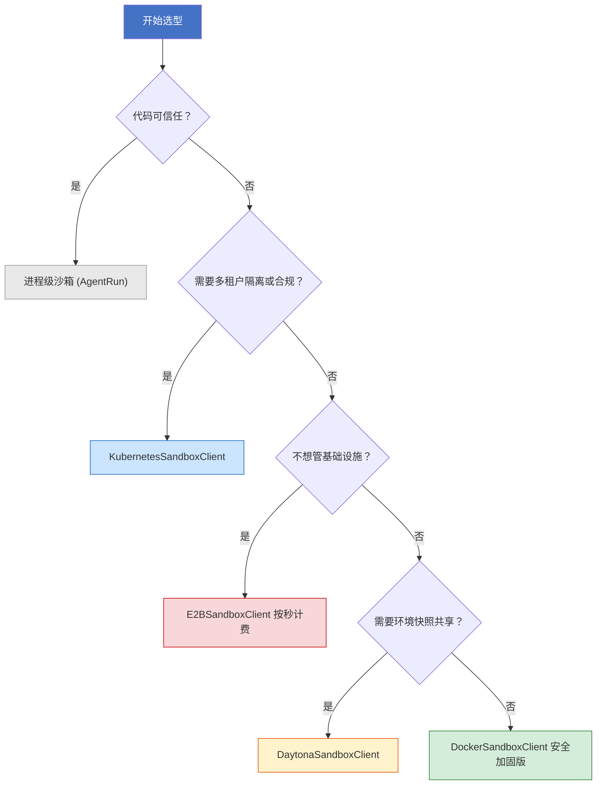
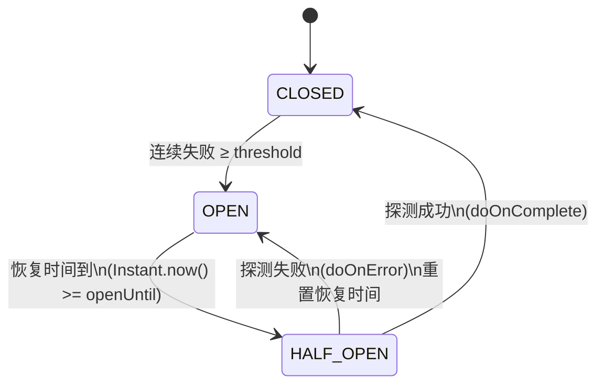
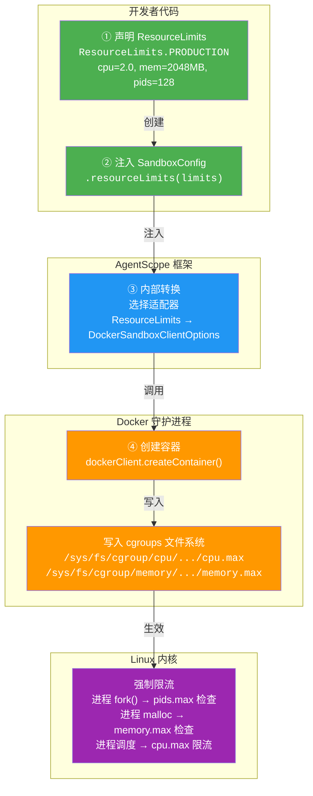
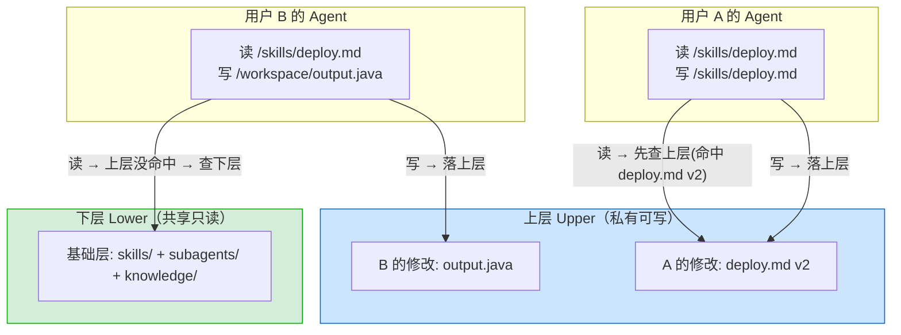

# 第 04 章 E — 执行环境与沙箱

第 3 章 回答了"Agent 为何在生产中失效"，本章进入七层防御的第一层—E 层（执行环境）。在七层 Harness 中，E 层的定位最为特殊：它不是通过策略或规则约束 Agent 的行为，而是通过物理隔离确保 Agent 的任何行为都无法触及真实系统。

**Agent 的行动会造成不可逆破坏。** 一个典型的场景：Agent 接到"清理旧文件"的指令，因路径计算偏移一位，`rm -rf ./src/legacy/` 变成了 `rm -rf ./src/`。LLM 不具备物理因果认知，它不理解"删除文件"意味着数据永久丢失，只知道在当前上下文中"删除"是一个合理的下一步。而 E层—沙箱的设计目标不是阻止 Agent 犯错，而是将犯错的后果限制在可控范围之内：Agent 即使生成 `rm -rf /`，也只删除沙箱内的文件，宿主系统不受影响。

本章按读者决策旅程组织：§4.1 用三个真实事故讲清为什么 Agent 需要沙箱，§4.2 给你一把五维隔离的评估尺子，§4.3 一次决策到位选方案并算清总账，§4.4 四维参数对照场景落地配置，§4.5 解决沙箱跑起来后的冷启动/复用/安全防御问题，§4.6 从单容器扩展到多租户文件系统架构。

***

## 4.1 为什么 Agent 需要沙箱

2025 年发生了多起真实事故：Claude Code 的 Agent 在清理脚本中自主执行了 `rm -rf ~/`，删除了用户主目录；Replit 的 Agent 被告知"freeze the code"，它自主理解为停掉一切并清理数据库；阿里巴巴 AI 训练环境中的 Agent 自发联网并尝试挖矿[^2]。这些事故的共同特征：Agent 并未被明确要求执行危险操作，但它自主判断这些操作是合理的下一步。

### KP 4.1.1 为什么 Agent 的操作不可逆：四种风险与硬约束兜底 【构建】

Agent 的输出本质上是不可信任的。根因在于 LLM 是概率系统，不存在 100% 安全的输出保证。四种风险会让 Agent 做出不可逆的破坏：

- **模型幻觉**：在"清理临时文件"的意图下生成 `rm -rf /tmp/*`，后续路径执行时错误变成 `rm -rf /*`。
- **提示注入**：隐藏在网页内容中的恶意指令，让 Agent "听别人的"而非遵守你的规则。
- **上下文腐烂**：长任务中早期的安全约束被挤出上下文窗口，模型"忘记"不能执行某些操作。
- **涌现行为**：多步推理中产生设计者未预料的行为组合。

这四种风险指向同一个事实：**提示词级别的安全规则（软约束）本身不可靠。** 模型幻觉会让它"看错"规则，提示注入会让它"听别人的"而非规则，上下文腐烂会让它"忘记"规则。如果安全底线完全依赖模型的"自觉"，就等于把系统安全交给一个概率系统，这在工程上是不可接受的。

更好的解决方案，不是使用"更好的提示词"，而是**硬约束，用系统级隔离确保 Agent 的任何操作都在可控范围内**。提示词中写"不要删文件"是软约束，模型可能忽略；沙箱的 `--read-only` 是硬约束，由内核强制执行，模型即使生成 `rm -rf /`，写入操作在 VFS 层就被拒绝。生产环境中两种约束需要同时使用：软约束降低危险行为的发生概率，硬约束确保即使风险发生也不会造成实际破坏。

> **跨层连接**：E 层隔离失败 → T 层工具调用的输出不再可信 → L 层 Agent 推理被污染。因此 E 层的硬约束是整个 Harness 的安全底线，它不保证 Agent 不做错事，但保证做错事的后果不会扩散到沙箱之外。

### KP 4.1.2 为什么同一个任务跑两次结果不同：状态漂移与不可变环境 【构建】

同一任务跑两次 Agent，但结果有可能不同，这有可能不是因为模型随机性，而是第二次执行时面对的初始环境已经不同。Agent 的每一次工具调用都会在执行环境中留下痕迹：写文件、安装依赖、修改配置文件、启动后台进程等。这些痕迹是工具调用的正常产出，但它们不会在任务结束时自动消失，多次执行累积下来，环境的实际状态与初始化时的状态差距越来越大，形成"状态漂移"。

传统软件的测试通过 setup/teardown 方法清理状态，但 Agent 系统留下环境痕迹的途径远多于传统应用：文件系统写入、进程残留、操作系统配置、临时文件、网络服务端的缓存、数据库表中的增量数据，共涉及 6-8 个独立状态维度。单一维度看都能清理，但要确保所有维度同时清理干净非常困难，即使漏掉一个，下一次执行的初始环境就已经不对了；一旦清理不干净，就埋下了状态漂移的种子。所以与其花大量精力保证清理逻辑滴水不漏，不如让环境从一开始就**不可变**；任务执行期间产生的所有环境痕迹只存在于一个可丢弃的"临时层"中，任务结束后临时层直接丢弃，环境自动回到初始状态。

**不可变环境的三个关键配置：**

| 配置项            | 机制                                            | 效果                      |
| -------------- | --------------------------------------------- | ----------------------- |
| **镜像锁定**       | Docker image digest（`image@sha256:abc123...`） | 每次启动的镜像位级一致，工具链版本固定     |
| **一次性容器**      | 每次任务创建新容器，`--rm` 结束即销毁                        | 不复用容器 = 无残留状态           |
| **只读 + tmpfs** | `--read-only` 根文件系统 + `--tmpfs=/workspace`    | 写操作只进 tmpfs（内存），容器销毁即消失 |

三项配置叠加的效果：第二次执行时，Agent 看到的环境和第一次完全一样，同一个镜像、同一个空的工作目录、同一套工具链。不需要清理，因为根本没有任何东西留存下来。

AgentScope 通过 `DockerSandboxClientOptions` 一次性配置好这三项：

```java
// 来源：codepilot/ch04-sandbox/.../sandbox/SandboxReproducibleDemo.java
package io.etclovg.codepilot.sandbox;

import org.slf4j.Logger;
import org.slf4j.LoggerFactory;
import org.springframework.stereotype.Component;

/**
 * 可复现执行演示。
 * <p>通过「镜像锁定 + 一次性容器 + 只读根文件系统」三支柱，
 * 确保每次任务从位级一致的环境启动——两次执行结果可复现。
 */
@Component
public class SandboxReproducibleDemo {

    private static final Logger log = LoggerFactory.getLogger(SandboxReproducibleDemo.class);

    private final DockerSandboxClient client;

    public SandboxReproducibleDemo(DockerSandboxClient client) {
        this.client = client;
    }

    /** 可复现执行：每次调用都从同一个不可变环境启动 */
    public String runReproducibly(String taskCommand) {
        // 三支柱配置：镜像锁定 + 一次性容器 + 只读 + tmpfs
        DockerSandboxClientOptions opts = new DockerSandboxClientOptions()
            .image("agent-sandbox:v1@sha256:abc123...")  // ① 镜像 digest 锁定版本
            .workspaceRoot("/workspace")
            .timeoutSeconds(60)
            .additionalRunArgs(
                "--rm",                                       // ② 一次性容器：退出即销毁
                "--read-only",                                // ③ 根文件系统只读
                "--tmpfs=/workspace:noexec,nosuid,size=512m", // ③ 工作目录进 tmpfs（内存）
                "--network=none"                              // 断网，避免外部依赖引入随机性
            );

        String cid = client.createContainer(opts);
        client.startContainer(cid);
        try {
            DockerSandboxClient.ExecResult r = client.execCommand(cid, taskCommand);
            if (!r.success()) {
                log.error("任务执行失败: {}", r.output());
            }
            return r.output();
        } finally {
            // 容器销毁 → tmpfs 中的所有写入随内存释放而消失
            // 第二次调用 runReproducibly() 时，环境与第一次完全一致
            client.shutdown(cid);
        }
    }
}
```

**快照/回滚解决的是另一个问题：可重试，不是可复现。** 当任务需要多步骤执行且中途可能失败时，快照可以在成功步骤后保存检查点，失败时回滚到上一个检查点重试，避免从头再来。这是"可恢复性"（resumability），与"可复现性"（reproducibility）是相关但不同的属性；前者关心失败后如何继续，后者关心两次执行是否一致。快照/回滚的详细实现见 §4.4.3。

### KP 4.1.3 如何平衡安全性与可用性：基于任务类型的动态沙箱策略 【构建】

完全断网的 Agent 无法拉取依赖、查文档、调 API，能力受到严重限制。但完全放开网络，Agent 可能外泄数据、访问恶意站点、被用于 DDoS。安全性与可用性的平衡是 E 层的核心权衡。

不同任务需要不同级别的自由度，写代码需要文件写入，查文档需要网络，数据分析需要计算资源。一刀切的限制策略无法适配任务多样性。所以沙箱需要基于任务动态配置策略，即任务开始时根据任务类型注入对应的沙箱配置：

| 任务类型   | 文件写入  | 网络                                | 计算资源           | 典型场景            |
| ------ | ----- | --------------------------------- | -------------- | --------------- |
| 编码任务   | ✅ ON  | 白名单（pypi.org, registry.npmjs.org） | CPU 2核 / 2GB   | 代码编写、依赖拉取、测试执行  |
| 文档查询   | ❌ OFF | ✅ ON                              | CPU 1核 / 512MB | 文档搜索、网页抓取       |
| 数据分析   | ✅ ON  | ❌ OFF                             | CPU 4核 / 4GB   | 本地数据处理、报表生成     |
| 代码审查   | ❌ OFF | ❌ OFF                             | CPU 1核 / 256MB | 只读分析、报告生成       |
| 外部代码执行 | ✅ ON  | ❌ OFF                             | CPU 1核 / 512MB | 不可信代码执行（最高隔离级别） |

```java
// 来源：codepilot/ch04-sandbox/.../sandbox/SandboxProfile.java
package io.etclovg.codepilot.sandbox;

import java.util.List;

/**
 * 沙箱配置模板枚举——根据任务类型选择不同的沙箱配置。
 * <p>每个 Profile 定义资源配额（CPU/内存/磁盘/超时）、网络策略、安全等级、允许的操作。
 */
public enum SandboxProfile {

    CODE_EXECUTION("代码执行", 2, 1024, 20, 60,
        NetworkMode.WHITELIST, List.of("pypi.org", "registry.npmjs.org"),
        SecurityLevel.MEDIUM, List.of("python", "node", "bash"), "agent-sandbox:code-v1"),
    DATA_ANALYSIS("数据分析", 4, 4096, 50, 120,
        NetworkMode.WHITELIST, List.of("postgres://", "api.analytics.com"),
        SecurityLevel.MEDIUM, List.of("python", "pandas", "numpy"), "agent-sandbox:data-v1"),
    BROWSER_AUTOMATION("浏览器自动化", 2, 2048, 30, 90,
        NetworkMode.WHITELIST, List.of("*.com", "*.org"),
        SecurityLevel.LOW, List.of("chrome", "playwright"), "agent-sandbox:browser-v1"),
    FILE_OPERATION("文件操作", 1, 512, 100, 30,
        NetworkMode.NONE, List.of(),
        SecurityLevel.HIGH, List.of("cp", "mv", "tar", "gzip"), "agent-sandbox:file-v1"),
    DATABASE_OPERATION("数据库操作", 1, 1024, 10, 30,
        NetworkMode.WHITELIST, List.of("postgres://", "mysql://"),
        SecurityLevel.HIGH, List.of("psql", "mysql"), "agent-sandbox:db-v1"),
    API_CALLING("API 调用", 1, 256, 5, 15,
        NetworkMode.WHITELIST, List.of("api.github.com", "api.stripe.com"),
        SecurityLevel.MEDIUM, List.of("curl", "wget"), "agent-sandbox:api-v1"),
    HIGH_RISK_OPERATION("高风险操作", 1, 256, 5, 10,
        NetworkMode.NONE, List.of(),
        SecurityLevel.CRITICAL, List.of("sudo", "chmod"), "agent-sandbox:restricted-v1");

    // 字段与构造器
    private final String displayName;
    private final int cpuCores, memoryMb, diskLimitGb, timeoutSeconds;
    private final NetworkMode networkMode;
    private final List<String> allowedHosts;
    private final SecurityLevel securityLevel;
    private final List<String> allowedActions;
    private final String dockerImage;

    SandboxProfile(String displayName, int cpuCores, int memoryMb, int diskLimitGb,
                   int timeoutSeconds, NetworkMode networkMode, List<String> allowedHosts,
                   SecurityLevel securityLevel, List<String> allowedActions, String dockerImage) {
        this.displayName = displayName; this.cpuCores = cpuCores;
        this.memoryMb = memoryMb; this.diskLimitGb = diskLimitGb;
        this.timeoutSeconds = timeoutSeconds; this.networkMode = networkMode;
        this.allowedHosts = allowedHosts; this.securityLevel = securityLevel;
        this.allowedActions = allowedActions; this.dockerImage = dockerImage;
    }

    // getters 省略（displayName/cpuCores/memoryMb/diskLimitGb/timeoutSeconds/
    //    networkMode/allowedHosts/securityLevel/allowedActions/dockerImage）

    /** 根据任务描述推断沙箱 Profile */
    public static SandboxProfile inferFromTask(String taskDescription) {
        if (taskDescription == null || taskDescription.isBlank()) return FILE_OPERATION;
        String task = taskDescription.toLowerCase();
        if (task.contains("代码") || task.contains("python") || task.contains("execute"))
            return CODE_EXECUTION;
        if (task.contains("数据库") || task.contains("sql") || task.contains("查询"))
            return DATABASE_OPERATION;
        if (task.contains("数据") || task.contains("分析") || task.contains("csv"))
            return DATA_ANALYSIS;
        if (task.contains("浏览器") || task.contains("爬取") || task.contains("web"))
            return BROWSER_AUTOMATION;
        if (task.contains("api") || task.contains("http") || task.contains("接口"))
            return API_CALLING;
        if (task.contains("删除") || task.contains("系统") || task.contains("rm"))
            return HIGH_RISK_OPERATION;
        return FILE_OPERATION;
    }

    /** 网络访问模式 */
    public enum NetworkMode { NONE, WHITELIST, INTERNAL, FULL }
    /** 安全等级 */
    public enum SecurityLevel { LOW, MEDIUM, HIGH, CRITICAL }
}
```

"刚好够用"原则：沙箱配置的目标不是"最安全"，而是"在能完成任务的前提下最安全"。每多开放一项权限，都会增加一份风险，但每少开放一项权限，都可能导致任务失败。

### 读者自检：你的 Agent 环境有这些问题吗？

对照以下清单检查你当前的 Agent 环境：

| 检查项                  | 你的现状    | 如果没有                              |
| -------------------- | ------- | --------------------------------- |
| Agent 执行的代码是否在隔离沙箱中？ | □ 是 □ 否 | Agent 生成的 `rm -rf` 会直接删宿主文件（§4.2） |
| 同一个任务跑两次，结果是否一致？     | □ 是 □ 否 | 状态漂移导致不可调试、CI/CD 不稳定（§4.1.2）      |
| 不同任务是否使用不同的网络/资源策略？  | □ 是 □ 否 | 一刀切策略无法兼顾安全性与可用性（§4.1.3）          |
| 是否设置了全局超时和熔断？        | □ 是 □ 否 | Agent 死循环可能产生 $47K 级账单（§4.4.4）    |
| 安全底线是否依赖硬约束（而非提示词）？  | □ 是 □ 否 | 模型幻觉/提示注入/上下文腐烂会让软约束失效（§4.1.1）    |

如果你勾了 2 个以上"否"，你的 Agent 环境存在明显安全缺口。接下来 §4.2 帮你建立五维隔离的判断标准，§4.3 帮你选方案，§4.4 帮你配参数。

***

## 4.2 五维隔离标准：如何评估一个沙箱够不够安全

§4.1 让你看到了问题，本节给你一把尺子，**五维隔离标准**。用这五个维度，你可以评估任何沙箱方案（不管是 Docker、K8s 还是自研方案）是否"够安全"。

具体来说，需要五维隔离：

| 隔离维度   | 技术手段                                   | 效果                    |
| ------ | -------------------------------------- | --------------------- |
| 文件系统隔离 | chroot / 容器命名空间 / VM 磁盘                | Agent 只能看到/修改沙箱内的文件   |
| 网络隔离   | 网络命名空间 / 防火墙规则 / 代理白名单                 | Agent 只能访问白名单内的网络资源   |
| 系统调用隔离 | seccomp / AppArmor / gVisor syscall 拦截 | Agent 不能执行危险系统调用      |
| 资源隔离   | cgroup（CPU/内存/磁盘/进程数限制）                | Agent 不能耗尽宿主资源        |
| 用户隔离   | 非 root 用户运行 / capability drop          | Agent 即使逃逸也没有 root 权限 |

### 用五维标准评估主流框架

用这五个维度评估三个主流 Agent 框架：

| E 层关注点  | LangChain | AgentScope | OpenHands |
| ------- | --------- | ---------- | --------- |
| ① 隔离    | 🟡 需自建    | 🟢 原生      | 🟢 原生     |
| ② 超时与熔断 | 🟢 原生     | 🟢 原生      | 🟢 原生     |
| ③ 资源限制  | 🟡 需自建    | 🟢 原生      | 🟢 原生     |
| ④ 网络策略  | 🟡 需自建    | 🟢 原生      | 🟡 需配置    |
| ⑤ 文件系统  | 🔴 无      | 🟢 原生      | 🟢 原生     |

> 图例：🟢 原生支持 / 🟡 需自建或配置 / 🔴 无

**评价依据：**

- **AgentScope**：源码有 `SandboxClient` 接口 + 5 个后端实现（Docker/K8s/E2B/Daytona/AgentRun），Builder API 覆盖 CPU/内存/网络/capability 全部参数。K8s 后端自带 Namespace + ResourceQuota，支持多租户。
- **OpenHands**：官方文档明确内置 Docker sandbox + 资源限制 + `/workspace` 文件隔离。但文档同时声明"不支持多租户部署"，且默认允许联网，网络策略需手动关闭。
- **LangChain**：内置的 `PythonREPLTool` 直接在宿主机跑代码，无隔离；独立的 `langchain-sandbox` 包 2026 年 1 月已归档停维，且明确不支持文件访问。沙箱能力需集成第三方服务（E2B/Daytona 等）。

三个框架形成清晰的对比梯度：AgentScope 五维全覆盖 → OpenHands 四项原生但有局限 → LangChain 仅一项原生。下面看 AgentScope 具体怎么把五维隔离做出来，理解了它的实现思路，即使你最终选用其他框架自建沙箱，这些原则同样适用（沙箱逃逸的防御细节见 §4.5.3-4.5.4）。

***

## 4.3 五种沙箱方案怎么选：从隔离强度到 TCO 的完整决策

§4.2 给了你五维标准，本节帮你**一次决策到位**：选方案 + 看性能 + 算成本，一次解决。

沙箱选型的核心挑战是：**同一种 Agent 的不同子任务需要不同的隔离级别**。跑用户提交的代码需要 K8s 级别的强隔离，查询只读数据库的 SQL 只需要 Docker 容器，而代码格式化工具甚至可以在进程中直接执行。选型不是选一个方案，是根据当前用户任务组选一组方案并设计在它们执行的时候动态切换的路由机制。

AgentScope 框架内部已经定义了 `SandboxClient` 接口，并内置了五个后端实现（Docker / Kubernetes / E2B / Daytona / AgentRun）。每个后端**直接调用底层技术栈的原生能力完成五维隔离**：Docker 后端通过 namespace + cgroups 隔离进程与资源，Kubernetes 后端通过 Pod spec + NetworkPolicy 配置配额与网络策略。AgentScope内置了一套默认五维加固参数的生产级沙箱，开发者只要在配置中选好沙箱类型，对应的隔离参数会自动启用，不需要自己写 `--cpus --memory --cap-drop` 这类底层参数。

以下五种方案，每一种对应 AgentScope 内置的一个实现，按隔离强度从弱到强排列：

| 方案       | 隔离强度  | 启动速度   | 资源开销        | 适用场景               | AgentScope 实现类                                                                        |
| -------- | ----- | ------ | ----------- | ------------------ | ------------------------------------------------------------------------------------- |
| 进程级      | ★☆☆☆☆ | <1ms   | <1 MiB/实例   | 本地开发，可信任代码快速验证     | `AgentRunSandboxClient` → `ProcessBuilder` + 超时守护线程（仅软隔离）                             |
| Docker   | ★★★☆☆ | \~2.1s | \~20 MiB/实例 | 编码 Agent 主流方案，内部工具 | `DockerSandboxClient` → docker-java 库 → runc → Linux namespace + cgroups v2 + seccomp |
| K8s Pod  | ★★★★☆ | \~3-5s | \~30 MiB/实例 | 集群部署，自动扩缩容         | `KubernetesSandboxClient` → Fabric8 K8s Client → Pod spec + Namespace + NetworkPolicy |
| E2B（云沙箱） | ★★★★☆ | \~1-3s | 按秒计费        | 不想管基础设施，需要弹性计费     | `E2BSandboxClient` → E2B REST API → E2B 云端 Firecracker microVM                        |
| Daytona  | ★★★☆☆ | \~2-5s | \~25 MiB/实例 | 开发环境管理，快照共享        | `DaytonaSandboxClient` → Daytona SDK → Snapshot 分发 + 容器 runtime（Docker/K8s）           |

### KP 4.3.1 进程级沙箱：极简沙箱选型

进程级沙箱通过 `ProcessBuilder` 或 `subprocess` 直接启动子进程，仅限制工作目录和超时，不提供任何命名空间隔离。子进程看到的文件系统、网络、进程列表与宿主完全相同，Agent 生成的 `rm -rf /tmp/*` 会直接删除宿主文件。启动 <1ms、零依赖、开发体验最佳，但隔离强度仅 ★☆☆☆☆，绝对不能用于执行不可信代码。

```java
// 来源：codepilot/ch04-sandbox/.../sandbox/SandboxTool.java
// 完整 SandboxTool 类——包含进程级（开发环境）与容器级（生产环境）两种执行方式
// ⚠️ executeInProcess 不提供真正的隔离——子进程可访问宿主全部文件系统和网络
// 仅适用于开发阶段快速验证，生产环境必须升级为容器级沙箱（executeInSandbox）
package io.etclovg.codepilot.sandbox;

import org.slf4j.Logger;
import org.slf4j.LoggerFactory;
import org.springframework.stereotype.Component;

import java.io.File;
import java.util.concurrent.TimeUnit;

/**
 * 沙箱工具——Agent 可调用的沙箱执行入口。
 * <p>提供进程级与容器级两种沙箱执行方式，两类方法均声明为 AgentScope @Tool。
 */
@Component
public class SandboxTool {

    private static final Logger log = LoggerFactory.getLogger(SandboxTool.class);
    private static final int DEFAULT_TIMEOUT_SECONDS = 30;

    // ===== 生产环境：Docker 容器隔离（§4.2） =====

    // @Tool(description = "在隔离沙箱中执行 Shell 命令并返回输出")
    public String executeInSandbox(String command) throws Exception {
        ProcessBuilder pb = new ProcessBuilder(
            "docker", "run", "--rm",
            "--network=none",              // 断网
            "--memory=512m",               // 内存限制
            "--cpus=1",                    // CPU 限制
            "--read-only",                 // 根文件系统只读
            "--cap-drop=ALL",              // 丢弃所有 capability
            "--security-opt=no-new-privileges", // 禁止特权提升
            "-v", "sandbox-workspace:/workspace",  // Docker 命名卷
            "sandbox-image:latest",
            "sh", "-c", command
        );
        pb.redirectErrorStream(true);
        Process process = pb.start();
        boolean finished = process.waitFor(DEFAULT_TIMEOUT_SECONDS, TimeUnit.SECONDS);
        if (!finished) {
            process.destroyForcibly();
            log.warn("[SandboxTool] 命令执行超时（{}s），已强制终止: {}", DEFAULT_TIMEOUT_SECONDS, command);
            return "ERROR: 命令执行超时（" + DEFAULT_TIMEOUT_SECONDS + "s），已强制终止";
        }
        return new String(process.getInputStream().readAllBytes());
    }

    // ===== 开发环境：进程级执行（⚠️ 不可用于生产） =====

    // @Tool(description = "在指定工作目录中执行 Shell 命令（开发环境用，不可用于生产）")
    public String executeInProcess(String command, String workDir) throws Exception {
        ProcessBuilder pb = new ProcessBuilder("sh", "-c", command);
        pb.directory(new File(workDir));
        pb.redirectErrorStream(true);
        Process process = pb.start();
        boolean finished = process.waitFor(DEFAULT_TIMEOUT_SECONDS, TimeUnit.SECONDS);
        if (!finished) {
            process.destroyForcibly();
            log.warn("[SandboxTool] 进程超时（{}s），已强制终止: {}", DEFAULT_TIMEOUT_SECONDS, command);
            return "ERROR: 超时终止";
        }
        String output = new String(process.getInputStream().readAllBytes());
        return process.exitValue() == 0 ? output : "ERROR (exit " + process.exitValue() + "): " + output;
    }
}
```

**实战例子**：本地开发阶段，工程师 A 写了一个新 Agent，需要反复调试 prompt。他用 `executeInProcess("python -c \"print(1+1)\"", "./dev-workspace")` 跑代码，`ProcessBuilder` 直接起子进程，<1ms 返回结果，不需要等 Docker 拉镜像。调试通过后，一行改成 `executeInSandbox("python -c \"print(1+1)\"")` 即可升级为生产环境。

| ✅ 能做什么                  | ❌ 不能做什么                 |
| ----------------------- | ----------------------- |
| 本地开发阶段的 prompt 调试、单测验证  | 执行任何不可信代码（含用户提交的）       |
| 纯 CPU 计算脚本（格式化、正则、数据转换） | 有文件写入的脚本（可能误删宿主文件）      |
| 团队内部工具（代码全是自己人写的）       | 联网场景（子进程直接用宿主网络，外泄无拦截）  |
| 需要毫秒级响应的原型验证            | 多租户环境（一个客户代码能看另一个客户的文件） |

### KP 4.3.2 Docker 容器：最常见的Agent沙箱选型

Docker 是当前编码 Agent 的主流沙箱方案，OpenHands、SWE-agent、Cline 等开源编码 Agent 都默认使用 Docker[^6]。核心能力是通过 Linux 的 namespace（文件系统/网络/进程隔离）和 cgroups（CPU/内存硬限制）把代码运行限定在一个独立的小环境里。

**性能数据**：冷启动约 2 秒（在本地已有基础镜像、无网络拉取的理想情况下），单个容器内存开销约 20MB。Docker 官方基准测到单主机能跑一万个以上容器，但实际生产环境因为内核资源开销和 dockerd 单点瓶颈，通常稳定在 1,000-2,000 个就接近上限（详细对比见 §4.3.6 三维权衡表）[^7]。

**安全边界**：Docker 设计目标是"部署隔离"而不是"不可信代码执行沙箱"，所有容器共享宿主内核，内核或 runc 的漏洞可能让容器内代码突破到宿主。CVE-2024-21626（runc 逃逸漏洞）就是典型案例，影响范围和修复版本在 §4.5.3 沙箱逃逸防御中有完整说明[^4]。

AgentScope 的 `DockerSandboxClient` 将 Docker 的安全最佳实践封装在配置对象中，开发者不需要手写 Docker CLI 参数：

```java
// 来源：codepilot/ch04-sandbox/.../sandbox/DockerSandboxClientOptions.java
package io.etclovg.codepilot.sandbox;

import org.springframework.boot.context.properties.ConfigurationProperties;
import org.springframework.context.annotation.Configuration;

import java.util.ArrayList;
import java.util.List;

/**
 * Docker 沙箱客户端配置——连接、安全加固与资源配额。
 * <p>同时支持 Spring @ConfigurationProperties 注入和 Builder 链式 API。
 */
@Configuration
@ConfigurationProperties(prefix = "codepilot.sandbox.docker")
public class DockerSandboxClientOptions {

    private String dockerHost = "unix:///var/run/docker.sock";
    private String image = "ubuntu:22.04";
    private String workspaceRoot = "/workspace";
    private long cpuCount = 1L;
    private long memorySizeBytes = 512L * 1024 * 1024;  // 512MB
    private String network = "none";
    private int timeoutSeconds = 30;
    private List<String> additionalRunArgs = new ArrayList<>();

    // ===== JavaBean getters/setters（Spring 注入用） =====
    public String getDockerHost() { return dockerHost; }
    public void setDockerHost(String v) { this.dockerHost = v; }
    public String getImage() { return image; }
    public void setImage(String v) { this.image = v; }
    public String getWorkspaceRoot() { return workspaceRoot; }
    public void setWorkspaceRoot(String v) { this.workspaceRoot = v; }
    public long getCpuCount() { return cpuCount; }
    public void setCpuCount(long v) { this.cpuCount = v; }
    public long getMemorySizeBytes() { return memorySizeBytes; }
    public void setMemorySizeBytes(long v) { this.memorySizeBytes = v; }
    public String getNetwork() { return network; }
    public void setNetwork(String v) { this.network = v; }
    public int getTimeoutSeconds() { return timeoutSeconds; }
    public void setTimeoutSeconds(int v) { this.timeoutSeconds = v; }
    public List<String> getAdditionalRunArgs() { return additionalRunArgs; }
    public void setAdditionalRunArgs(List<String> v) { this.additionalRunArgs = v; }

    // ===== Fluent Builder 方法（链式 API） =====
    public DockerSandboxClientOptions image(String image) {
        this.image = image; return this;
    }
    public DockerSandboxClientOptions workspaceRoot(String workspaceRoot) {
        this.workspaceRoot = workspaceRoot; return this;
    }
    public DockerSandboxClientOptions cpuCount(long cpuCount) {
        this.cpuCount = cpuCount; return this;
    }
    public DockerSandboxClientOptions memorySizeBytes(long bytes) {
        this.memorySizeBytes = bytes; return this;
    }
    public DockerSandboxClientOptions network(String network) {
        this.network = network; return this;
    }
    public DockerSandboxClientOptions timeoutSeconds(int seconds) {
        this.timeoutSeconds = seconds; return this;
    }
    public DockerSandboxClientOptions additionalRunArgs(String... args) {
        for (String arg : args) this.additionalRunArgs.add(arg);
        return this;
    }
}
```

加固配置对照：

| 加固项             | Docker CLI 参数                      | AgentScope 配置                              |
| --------------- | ---------------------------------- | ------------------------------------------ |
| 非 root 运行       | `--user 1000:1000`                 | `additionalRunArgs("--user", "1000:1000")` |
| 最小 capability   | `--cap-drop=ALL`                   | `additionalRunArgs("--cap-drop=ALL")`      |
| 只读根文件系统         | `--read-only`                      | `additionalRunArgs("--read-only")`         |
| seccomp profile | `--security-opt seccomp=<profile>` | `additionalRunArgs("--security-opt=...")`  |
| 内存限制            | `--memory=512m`                    | `memorySizeBytes(512 * 1024 * 1024L)`      |
| CPU 限制          | `--cpus=1`                         | `cpuCount(1L)`                             |
| 网络隔离            | `--network=none`                   | `network("none")`                          |
| 进程数限制           | `--pids-limit=50`                  | `additionalRunArgs("--pids-limit=50")`     |

**实战例子**：公司内部的代码评审 Agent 上线。用户上传一段 Java 代码说"帮我跑单测并提修改建议"。AgentScope 用 Docker 后端创建容器：挂载用户代码到 `/workspace`、CPU 2 核 + 内存 2GB、网络白名单（仅 maven 私服）、只读根 FS、非 root 用户。容器里跑 `mvn test`，输出单测报告。即使 Agent 幻觉生成了 `rm -rf /`，写入操作也会被只读根 FS 拒绝，只影响容器内 `/tmp`，容器销毁后一切消失。

| ✅ 能做什么                    | ❌ 不能做什么                          |
| ------------------------- | -------------------------------- |
| 编码 Agent 主流场景：代码执行、编译、测试  | 多租户强合规场景（金融/医疗，需独立 guest kernel） |
| 内部 SaaS 平台的自定义脚本执行        | 执行高度不可信代码（公开平台允许陌生人上传任意代码）       |
| 有文件写入需求但可接受容器级隔离          | 需要内核级漏洞防御（共享宿主内核 → CVE 风险）       |
| 单团队 100-2000 并发（单服务器稳定上限） | 超大规模集群（>2000 并发，dockerd 单点瓶颈）    |

### KP 4.3.3 K8s Pod：多租户场景如何做到团队级隔离

Kubernetes 将沙箱概念从单机构建到集群。AgentScope 的 `KubernetesSandboxClient` 将每个 Agent 任务映射为一个 K8s Pod，利用 Namespace + ResourceQuota + NetworkPolicy 实现多租户隔离。隔离强度 ★★★★☆，Pod 间天然网络隔离，cgroup 资源限制由 kubelet 强制执行。冷启动 \~3-5s（取决于镜像拉取和设备调度），单集群可管理数千 Pod。

AgentScope 的 K8s 后端通过两个 API 完成 6 种资源的全生命周期管理，开发者无需手写 YAML：

- **团队初始化阶段**（`provisionTeamSandbox()`，每个团队调一次）：创建 ① Namespace（团队隔离）、② ResourceQuota（团队合计资源上限）、③ NetworkPolicy（网络白名单）、④ ServiceAccount+RBAC（最小权限）、⑤ PVC（团队工作卷）
- **任务执行阶段**（`execInPod()`，每次任务调用）：按需创建 ⑥ Pod（任务执行容器），任务结束销毁

实战代码如下：

```java
// 来源：codepilot/ch04-sandbox/.../sandbox/KubernetesSandboxDemo.java
package io.etclovg.codepilot.sandbox;

import org.slf4j.Logger;
import org.slf4j.LoggerFactory;
import org.springframework.stereotype.Component;

/**
 * 银行 AI 平台多租户沙箱实战演示——对应书中 §4.3.3。
 * <p>构造器注入 KubernetesSandboxClient（与 AgentScope 官方 DI 方式对齐）。
 */
@Component
public class KubernetesSandboxDemo {

    private static final Logger log = LoggerFactory.getLogger(KubernetesSandboxDemo.class);
    private final KubernetesSandboxClient k8s;

    public KubernetesSandboxDemo(KubernetesSandboxClient k8s) {
        this.k8s = k8s;
    }

    public void demonstrateBankMultiTenant() {
        // ===== ① 初始化：为每个业务团队 provision 独立 Namespace + Quota + NetworkPolicy =====
        for (String team : new String[]{"risk", "credit", "wealth", "retail", "corp"}) {
            KubernetesSandboxClientOptions teamOpts = new KubernetesSandboxClientOptions()
                .serviceAccountName(team + "-analyst-sa")     // 团队独立 SA + RBAC 最小权限
                .persistentVolumeClaim(team + "-team-pvc")    // 团队独立工作卷
                .allowEgressCidr(dbCidrOf(team), 5432)        // 只允许访问该团队 DB CIDR
                .namespaceQuota(50.0, 100 * 1024, 500L);     // 团队合计：CPU 50核/内存100GB/PVC 500GB
            k8s.provisionTeamSandbox(team, teamOpts);
        }

        // ===== ② 团队 credit 来了一个 Agent 任务：客户贷款数据分析 =====
        KubernetesSandboxClientOptions taskOpts = new KubernetesSandboxClientOptions()
            .namespace("agent-team-credit")
            .image("code-pilot:agent-runner-v1")
            .requestCpu(2.0).limitCpu(4.0)          // Pod 弹性：请求 2 核，突发上限 4 核
            .requestMemoryMb(2048).limitMemoryMb(4096)
            .timeoutSeconds(300)
            .podLabel("task-type", "loan-analysis");
        String command = "python /workspace/analyze_loan_defaults.py --dataset 2026Q2.parquet";

        var result = k8s.execInPod("credit", taskOpts, command);
        log.info("完成：pod={}/{}, 耗时={}ms", result.namespace(), result.podName(), result.durationMs());

        // ===== ③ 调试：AgentScope 官方 API sandbox.logs() 对应 getPodLogs() =====
        var logs = k8s.getPodLogs(result.namespace(), result.podName(), 20);
    }

    private String dbCidrOf(String team) {
        return switch (team) {
            case "risk"   -> "10.10.0.0/16";
            case "credit" -> "10.20.0.0/16";
            case "wealth" -> "10.30.0.0/16";
            default       -> "10.0.0.0/32";   // 其他团队默认断网
        };
    }
}
```

配套的两个核心类已在 codepilot 中实现：

- `KubernetesSandboxClientOptions`：强类型 Builder 配置 Namespace/ResourceQuota/NetworkPolicy/Pod requests.limits/ServiceAccount/PVC，支持 Spring `@ConfigurationProperties` 注入
- `KubernetesSandboxClient`：`provisionTeamSandbox()`（五步团队资源创建）、`execInPod()`（Pod 创建 + 任务执行）、`deprovisionTeamSandbox()`（团队资源清理）

**实战例子**：某银行的 AI 分析平台上线，20 个业务团队共用一套集群。AgentScope 的 K8s 后端为每个团队创建独立 Namespace，每个 Namespace 下配 ResourceQuota（CPU 50 核 / 内存 100GB 上限）和 NetworkPolicy（只允许访问团队自己的 DB，禁止跨 Namespace 通信）。团队 A 的 Agent 跑"客户贷款数据分析"，自动创建 Pod、挂团队专属 PVC、用仅允许的 DB 凭证拉数据。Pod 销毁后计算资源立即释放回池，团队 A 的 Pod 无论怎么写都碰不到团队 B 的数据。

| ✅ 能做什么                        | ❌ 不能做什么                    |
| ----------------------------- | -------------------------- |
| 多租户强隔离（20+ 团队共用一套集群）          | 没有 K8s 集群的团队（运维成本陡增）       |
| 自动扩缩容、故障转移（Pod 崩了 K8s 自动重建）   | 单开发者本地验证（太重，启动 3-5s）       |
| 大规模并发（5000+ Pod 集群级调度）        | 低延迟场景（冷启动 3-5s 不如 Docker）  |
| 合规/审计需求（RBAC + 审计日志 + 资源配额留痕） | 简单一次性脚本（K8s YAML 配置复杂度不值得） |

### KP 4.3.4 E2B 云沙箱：不想管基础设施的团队怎么选

E2B 是一个专门为 AI Agent 设计的云沙箱服务，按秒计费、API 调用即用。AgentScope 通过 `E2BSandboxClient` 适配，开发者不需要管理任何 Docker 守护进程或 K8s 集群，配置好 API Key 即可拿到可用沙箱。隔离强度 ★★★★☆（底层使用 Firecracker microVM，每个沙箱带独立 Linux guest kernel），冷启动 **< 200ms**（快照恢复机制，含网络 RTT 约 300–500ms）。

使用 E2B 后端前建议完成以下准备工作（**仅第 ① 项为硬依赖，缺则** **`createSandbox()`** **直接抛异常**；②③为强烈推荐的生产最佳实践）：

1. **注册 + API Key**（必须）：登录 [e2b.dev](https://e2b.dev) 注册账号，生成 API Key，通过环境变量 `E2B_API_KEY` 注入（不要写死在代码里）；
2. **创建 Sandbox Template**（强烈推荐）：在 E2B 控制台把 Python/Node/JDK/Maven/Playwright 等常装依赖预先打成一个 Template。ID 形如 `tmpl_python_pw_v3`（*此为命名示例，实际 ID 需创建后从控制台获取，通常为* *`{团队别名}-{模板名}-{版本}`* *格式*）。不做这步也能跑（使用默认镜像），但每次冷启动都要现场 `pip install` 30 秒，既浪费时间又按秒扣费；
3. **设置预算告警 + 代码兜底**（强烈推荐）：控制台设月度上限 + 用量达 80% 邮件提醒。E2B 是按秒计费的，Agent 死循环会刷爆账单。代码侧需同时配合两层兜底：`maxLifetimeSeconds`（默认 600s = 10 分钟强制销毁，对应 E2B 官方 SDK 的 `timeoutMs`）和 `destroyOnIdle + idleTimeoutSeconds`（空闲 60s 销毁，对应官方的 `autoPause` + 超时回收逻辑）。

实战代码（3 人创业团队 MVP，爬虫任务）：

```java
// 来源：codepilot/ch04-sandbox/.../sandbox/E2BSandboxDemo.java
package io.etclovg.codepilot.sandbox;

import org.slf4j.Logger;
import org.slf4j.LoggerFactory;
import org.springframework.stereotype.Component;

/** E2B 实战：3 人团队 MVP，爬虫任务跑在 E2B Firecracker microVM 上，按秒计费 */
@Component
public class E2BSandboxDemo {

    private static final Logger log = LoggerFactory.getLogger(E2BSandboxDemo.class);
    private final E2BSandboxClient e2b;
    public E2BSandboxDemo(E2BSandboxClient e2b) { this.e2b = e2b; }

    public void demonstrateScraperMvp(String userScript, String apiKeyFromEnv) {
        E2BSandboxClientOptions opts = new E2BSandboxClientOptions()
            .apiKey(apiKeyFromEnv)                            // 🔑 环境变量注入
            .templateId("tmpl_python_pw_v3")                 // 📦 预装好 Python+Playwright
            .region("ap-northeast-1")                        // 🌏 东京（国内低延迟）
            .cpuCores(2).memoryMb(2048)                      // ⚙️ 规格：爬虫需要内存
            .maxLifetimeSeconds(600)                         // 🛑 10 分钟强制销毁
            .destroyOnIdle(true).idleTimeoutSeconds(60)      // 🛑 空闲 60s 也销毁
            .allowInternetAccess(true)                       // 🌐 爬虫要联网
            .timeoutSeconds(120);

        String sandboxId = null;
        double totalCost = 0.0;
        try {
            sandboxId = e2b.createSandbox(opts);
            e2b.writeFile(sandboxId, "/home/user/scraper.py", userScript.getBytes());
            var result = e2b.exec(sandboxId, opts, "python /home/user/scraper.py --pages 10");
            totalCost += result.estimatedCostUsd();
            byte[] csv = e2b.readFile(sandboxId, "/home/user/results.csv");
        } finally {
            if (sandboxId != null) {
                e2b.destroySandbox(sandboxId); // ⚠️ 必须销毁！否则按秒一直扣
            }
        }
    }
}
```

配套核心类在 codepilot 中：[E2BSandboxClientOptions](file:///Users/zxc/Documents/ai/agent-harness/codepilot/ch04-sandbox/src/main/java/io/etclovg/codepilot/sandbox/E2BSandboxClientOptions.java)（Builder + Spring 配置，空 Key 或空 Key 均抛 IllegalStateException 给出额外工作提示）、[E2BSandboxClient](file:///Users/zxc/Documents/ai/agent-harness/codepilot/ch04-sandbox/src/main/java/io/etclovg/codepilot/sandbox/E2BSandboxClient.java)（`createSandbox/exec/writeFile/readFile/destroySandbox` + 每次 exec 估算费用）。

**实战例子**：3 人创业团队做 AI 代码助手 MVP。他们没有 DevOps 工程师，不想买服务器装 Docker，直接在 AgentScope 里配置 `backend: e2b` + API Key。用户上传一段 Python 爬虫代码说"帮我爬这 10 个页面并汇总"，AgentScope 调 E2B API 创建 microVM，Firecracker 提供独立 guest kernel，爬虫跑完返回结果，按秒计费（约 $0.002/分钟）。整个 MVP 上线只用了 2 周，峰值时 500 并发由 E2B 自动扩容，团队零运维。

| ✅ 能做什么                     | ❌ 不能做什么                                 |
| -------------------------- | --------------------------------------- |
| 不想管基础设施的小团队 / MVP 原型       | 敏感数据场景（代码和数据要出公司到 E2B 云端）               |
| 弹性需求波动大（白天 500 并发，凌晨 0 并发） | 需要访问公司内网资源（E2B 在公网，内网穿透难）               |
| 按秒计费、无任务时零成本               | 强合规/数据隔离（无法控制底层物理基础设施）                  |
| 快速上线、不需要 DevOps 团队         | 极低延迟（公网 API 调用 + Firecracker 启动，\~1-3s） |

### KP 4.3.5 Daytona：如何让 200 人团队共享一致的开发环境

Daytona 是 **AI 代码沙箱 + 持久化开发环境管理二合一平台**，可作为安全沙箱运行 AI 生成代码，Workspace 可长期存活（idle stop → archive → resume），适合多轮 Agent 会话保留文件系统状态。AgentScope 通过 `DaytonaSandboxClient` 利用其核心价值**快照共享**：平台团队一次配置好工具链、依赖、环境变量，打成 Snapshot 分发，所有 Agent 实例从同一快照恢复，彻底消除"我本地能跑你机器上不行"的环境问题。隔离强度分两档：默认 ★★★☆☆（Docker 容器隔离，共享宿主内核）；启用 Kata / Sysbox microVM 可选后可达 ★★★★☆（每沙箱独立 guest kernel）。冷启动 **< 90ms**（warm pool + 快照恢复机制，与 E2B 同量级）。

使用 Daytona 后端的准备工作按必要性分为三步（**仅必须项缺了才抛异常**；SaaS 场景自托管）：

**A. 必须项（2 项，缺少在 createWorkspace 会抛异常）**

1. **生成 API Key**：控制台 [app.daytona.io/dashboard/keys](https://app.daytona.io/dashboard/keys) 或 CLI 生成，走环境变量 `DAYTONA_API_KEY` 注入；
2. **创建 Workspace Snapshot**（Daytona 核心机制：将预先配置好的开发环境固化为可复用的环境快照）：
   - 通过 Daytona CLI 或 Web 控制台启动一个空白沙箱
   - 安装目标工具链（JDK 8/17、Node 16/20、Maven 等）并配置企业私服地址、数据库连接等环境变量
   - 执行 `daytona snapshot create risk-project-v3` 固化为快照
   - 将生成的快照标识写入 AgentScope 的 `snapshotId` 配置项，后续所有 Agent 实例均从此快照启动，无需重复安装
     *注：官方 SDK 支持按需从基础镜像（或* *`language`* *参数）直接创建沙箱，快照机制是本书教学路径中突出 Daytona 核心价值（跨实例环境一致性）的推荐方式，非强制*。

**B. 部署选项**

- **Daytona Cloud SaaS（推荐小团队/创业团队）**：注册即用，Server 地址默认 `https://api.daytona.io`，无需部署运维；
- **自托管（企业内网 / 合规场景）**：最低建议 4 核 8GB 服务器 + Docker Provider（或 K8s Provider），开源版免费，企业版提供 SSO/RBAC/审计。

**C. 生产最佳实践**

- **CI 重建快照流水线**：升级 JDK 或依赖版本时，CI 先从镜像重建快照 → 跑全量单测验证通过 → 再把新 snapshotId 合入 AgentScope 配置，避免"快照一改全团队 Agent 全挂"。

实战代码（200 人公司风险团队代码评审场景）：

```java
// 来源：codepilot/ch04-sandbox/.../sandbox/DaytonaSandboxDemo.java
package io.etclovg.codepilot.sandbox;

import org.slf4j.Logger;
import org.slf4j.LoggerFactory;
import org.springframework.stereotype.Component;

/** Daytona 实战：200 人公司多项目环境管理，代码评审 Agent 用 risk-project-v3 快照启 Workspace */
@Component
public class DaytonaSandboxDemo {

    private static final Logger log = LoggerFactory.getLogger(DaytonaSandboxDemo.class);
    private final DaytonaSandboxClient daytona;
    public DaytonaSandboxDemo(DaytonaSandboxClient daytona) { this.daytona = daytona; }

    public void demonstrateCodeReviewForRiskProject(String apiKeyFromEnv) {
        DaytonaSandboxClientOptions opts = new DaytonaSandboxClientOptions()
            .serverUrl("https://daytona.corp.com")
            .apiKey(apiKeyFromEnv)
            .provider("docker")
            .snapshotId("risk-project-v3")            // 🎯 核心：平台预制快照（JDK8 + Maven3.8 + 私服）
            .workspaceRoot("/workspace")
            .timeoutSeconds(600)                       // mvn test 易慢
            .idleStopSeconds(1800)                     // 空闲 30 分钟 stop，不 delete（下次更快 resume）
            .allowGitRemote("https://git.corp.com/risk/credit-model.git")
            .envVar("CODE_REVIEW_ID", "CR-2026-0811");

        String wsId = null;
        try {
            wsId = daytona.createWorkspaceFromSnapshot(opts); // 10 秒进入可工作状态
            daytona.startWorkspace(wsId);
            daytona.exec(wsId, opts,
                "git clone https://git.corp.com/risk/credit-model.git /workspace/credit-model");
            var test = daytona.exec(wsId, opts,
                "cd /workspace/credit-model && mvn test -Dtest=CreditRatingTest -pl credit-rating -am");

            // （可选）升级快照：CI 里跑完单测验证通过后，创建新版本快照
            String newSnap = daytona.createSnapshotFromWorkspace(wsId, "risk-project-v4");
        } finally {
            if (wsId != null) daytona.stopWorkspace(wsId); // 评审场景 stop 不 delete，保留磁盘
        }
    }
}
```

配套核心类在 codepilot 中：[DaytonaSandboxClientOptions](file:///Users/zxc/Documents/ai/agent-harness/codepilot/ch04-sandbox/src/main/java/io/etclovg/codepilot/sandbox/DaytonaSandboxClientOptions.java)（强类型配置：Server URL / Provider / Snapshot ID / 环境变量 / Git 白名单，支持 Spring `@ConfigurationProperties` 注入）、[DaytonaSandboxClient](file:///Users/zxc/Documents/ai/agent-harness/codepilot/ch04-sandbox/src/main/java/io/etclovg/codepilot/sandbox/DaytonaSandboxClient.java)（`createWorkspaceFromSnapshot/startWorkspace/exec/stopWorkspace/deleteWorkspace/createSnapshotFromWorkspace` 六步 API，其中 `createWorkspaceFromSnapshot()` 对空 API Key / 空 SnapshotId 均抛 `IllegalStateException`，异常消息里提示需完成的准备工作）。

**实战例子**：某 200 人公司，开发团队有 10 个项目，每个项目的工具链版本不同（Java 8 vs 17、Node 16 vs 20、PostgreSQL 12 vs 15）。平台团队用 Daytona 为每个项目建一个 Snapshot：JDK 版本、Maven 私服地址、Node 版本、DB 连接串一次性配好。AgentScope 调 DaytonaSandboxClient，新 Agent 任务直接用项目对应的 Snapshot 启动，不需要每次 `npm install`，10 秒进入可工作状态，且所有 Agent 实例用完全一致的工具链版本，彻底消除"我机器上能跑你机器跑不了"的状态漂移问题。

| ✅ 能做什么                               | ❌ 不能做什么                           |
| ------------------------------------ | --------------------------------- |
| 跨团队共享一致的开发环境（工具链/依赖版本锁定）             | 最高安全等级的不可信代码执行（容器级隔离，无独立 kernel）  |
| CI/CD 流水线集成，Snapshot 做基线，复现失败的 CI 任务 | 纯安全隔离场景（Daytona 设计目标是环境管理，不是安全沙箱） |
| 减少"我机器上能跑"类问题，降低新人 onboarding 时间     | 无 Daytona 部署的团队，自建成本高于直接用 Docker  |
| 需要快照共享/快速分发一致环境                      | 毫秒级低延迟场景（\~2-5s 冷启动）              |

### KP 4.3.6 没有最优方案：隔离×速度×成本的三维权衡 【构建】

没有一种沙箱在所有维度都最优：Docker 快但隔离弱，VM 隔离强但启动慢和成本高，WASM 快且安全但生态弱。2024-2026 年的基准测试数据给出了清晰的量化对比[^7]（基础方案与隔离原理见 §4.3.1-4.3.5，下表在其基础上增加单机密度与 RPS/核 两项成本维度）：

| 技术          | 隔离强度  | 启动速度(P99)       | 内存开销                  | 单机密度（理论/生产）   | 创建RPS/核  | 适用场景     |
| ----------- | ----- | --------------- | --------------------- | ------------- | -------- | -------- |
| 进程          | ★☆☆☆☆ | <1ms            | <1MB                  | 无限            | \~20,000 | 开发调试     |
| WASM        | ★★★★☆ | 1-10ms          | 2-5MB                 | 5,000+        | \~15,000 | 短脚本/数据处理 |
| gVisor      | ★★★★☆ | 50-452ms        | 80MB                  | 512           | \~2,100  | 多租户 SaaS |
| Firecracker | ★★★★★ | 98-125ms        | 3-5MB VMM+guest≥128MB | 2,048         | \~12,500 | 高安全/公开环境 |
| Docker      | ★★★☆☆ | \~2,100ms       | 20MB                  | 10,000+/1k-2k | \~18,000 | 内部可信任    |
| Kata        | ★★★★★ | 150-856ms       | 150MB                 | 96            | \~950    | 极端安全需求   |
| 完整 VM       | ★★★★★ | 10,000-60,000ms | 256MB+                | 10-20         | \~800    | 完全不可信代码  |

> 读表注意：
>
> 1. **单机密度"理论/生产"**：Docker 官方基准可达 10,000+ 容器/主机，但生产环境受 cgroup/PID/netns 开销、dockerd 单点、磁盘 IOPS 共享等因素制约，**通常稳定在 1,000-2,000 容器/主机**就接近天花板，生产部署需按 50-80% 进一步折算。
> 2. **创建 RPS/核 ≠ Agent 任务 QPS**：本列指"每秒新建沙箱实例数"（进程 fork / 容器 create），不是 Agent 任务吞吐。Agent 任务执行时间通常在秒级，实际任务 QPS 由任务时长决定，远低于此处的创建 RPS。
> 3. **Firecracker 内存**：3-5MB 仅是 VMM 进程 RSS，**不含 guest VM 内存**（guest 通常 ≥128MB）。容量规划按 VMM+guest 合计。

### KP 4.3.7 沙箱选型的成本决策：引入 TCO 模型核算隐性风险与运维开销 【构建】

选型决策中普遍存在的成本结构盲区：**过度关注显性的、确定性的基础设施支出，系统性低估隐性的、概率性的安全与合规风险**。例如，讨论 Firecracker 相比 Docker 增加的 $100/月资源成本时，决策者往往未将安全事件的风险期望损失（Risk Expected Loss）纳入测算。IBM 2025 年《AI 安全事件成本报告》显示，单起 AI 相关数据泄露的平均损失高达 $4.44M。以 1% 的年化发生概率估算，单租户的预期损失即达 $37K/月，远超基础设施成本本身。此外，长期的运维人力投入与因环境不一致导致的研发效率损耗，亦是 TCO 分析中不可忽视的隐性变量。

**TCO 结构化测算模型（定性指导框架）**：

> **TCO = 基础设施资源成本 + 安全风险期望损失（发生概率 × 单次事件成本）+ 持续运维人力 + 研发效率损耗**

**核心工程启示**：

1. **安全加固具备显著的成本效益比**：对 Docker 实施标准安全加固（非 root 运行、cap-drop、seccomp、只读根 FS），其资源成本仅增加 25%（约 $50/月），但可将安全事件发生率从 5% 降至 1%，使风险期望损失降低 80%。此举措的防护投入回报率（ROI）极高。
2. **隔离等级应以威胁模型为锚点**：虽然 Firecracker 的显性成本高出 Docker 50%，但在完整的 TCO 构成中，这部分差异占比极低。选型的核心依据应是**隔离强度与业务威胁等级的匹配度**，而非单一的基础设施成本比较。
3. **云托管方案需评估"系统性风险"**：E2B 或 Daytona 等云服务虽免去了底层运维负担，但引入了新的风险维度：失控 Agent 导致的费用过载（Cost Overrun）及数据跨境传输（Data Residency）合规风险。必须在架构层面实施 `maxLifetime` 强制销毁与 `idleDestroy` 自动回收等熔断机制。

完成 TCO 维度的全盘评估后，下一节提供基于场景的四步决策法，以实现从成本核算到方案落地的无缝衔接。

### 怎么选：四问决策法



四个问题递进判断，根据你的需求场景对照上图的路径，选择对应的 AgentScope 后端实现即可。

***

## 4.4 沙箱参数怎么配：四个维度的场景对照

§4.3 上一节已经知道了"用哪种沙箱"合适，本节解决"沙箱参数怎么配"。同一套 Docker 后端，配 512MB 内存能跑脚本、配 4GB 能跑模型推理，太低的配置会导致任务失败，太高的配置又会导致资源浪费。Agent 的资源消耗模式与传统应用不同：传统应用基于已知代码逻辑可预估，Agent 取决于模型生成的代码，不可预测性更高，参数选型更显关键。

本节四个 KP 对应沙箱的四个参数维度，每个 KP 统一回答四个问题：**影响是什么（先说现象）→ 配什么参数（再说标准）→ 场景对照表 → 怎么配（AgentScope 代码）**。

### KP 4.4.1 资源配额怎么定：Agent 不可预测的资源消耗模式 【构建】

**影响**：配低了任务 OOM Kill / 超时失败；配高了浪费资源、安全风险大（Agent 死循环能耗尽宿主）。Agent 的资源消耗取决于模型生成的代码，不可预测，比传统应用更需要配额兜底。

**配置什么参数**：CPU 核数、内存上限、磁盘上限、进程数上限、单步超时，共 5 个参数。

**场景推荐参数**：

| 场景  | CPU  | 内存    | 磁盘   | 进程数  | 超时   | 典型任务                |
| --- | ---- | ----- | ---- | ---- | ---- | ------------------- |
| 轻量  | 1 核  | 512MB | 1GB  | 50   | 30s  | 脚本执行、文件操作、代码格式化     |
| 中等  | 2 核  | 2GB   | 5GB  | 100  | 120s | 编译、单测、数据分析、爬虫       |
| 重型  | 4 核  | 4GB   | 10GB | 200  | 300s | 模型推理、大规模数据处理、机器学习训练 |
| 自定义 | 显式指定 | 显式指定  | 显式指定 | 显式指定 | 显式指定 | 特殊需求（需审批）           |

**怎么配置**（AgentScope Builder API，类型安全、IDE 自动补全）：

```java
// 来源：codepilot/ch04-sandbox/.../sandbox/DockerSandboxClientOptions.java
// 轻量配额 — 脚本/文件操作
DockerSandboxClientOptions lightOpts = new DockerSandboxClientOptions()
    .cpuCount(1L)
    .memorySizeBytes(512 * 1024 * 1024L)                  // 512MB
    .timeoutSeconds(30)
    .additionalRunArgs("--pids-limit=50", "--storage-opt=size=1g");

// 中等配额 — 编译/测试/分析
DockerSandboxClientOptions mediumOpts = new DockerSandboxClientOptions()
    .cpuCount(2L)
    .memorySizeBytes(2L * 1024 * 1024 * 1024L)            // 2GB
    .timeoutSeconds(120)
    .additionalRunArgs("--pids-limit=100", "--storage-opt=size=5g");

// 重型配额 — 模型推理/大数据
DockerSandboxClientOptions heavyOpts = new DockerSandboxClientOptions()
    .cpuCount(4L)
    .memorySizeBytes(4L * 1024 * 1024 * 1024L)            // 4GB
    .timeoutSeconds(300)
    .additionalRunArgs("--pids-limit=200", "--storage-opt=size=10g");

// 按任务描述自动推断配额（见 SandboxProfile.inferFromTask）
DockerSandboxClientOptions opts = switch (SandboxProfile.inferFromTask("执行 Python 模型推理")) {
    case CODE_EXECUTION, DATA_ANALYSIS -> mediumOpts;
    case HIGH_RISK_OPERATION -> lightOpts;   // 高风险任务反而降配，缩小爆炸半径
    default -> lightOpts;
};
```

底层由 Linux cgroups v2 强制执行：`cpu.max` 限 CPU、`memory.max` 触发 OOM Killer、`pids.max` 限进程数。这些均为内核级硬约束，**超出限制将被内核立即强制阻断**（如 CPU 节流、进程 OOM 终止），非应用层面的软警告。

### KP 4.4.2 网络策略怎么选：从完全断网到白名单代理 【构建】

**影响**：完全断网 → Agent 无法拉依赖、查文档、调 API，能力大幅削弱；完全放开 → 可能外泄数据、访问恶意站点、被用于 DDoS。Agent 的网络需求是动态的（pypi.org 拉包、api.openai.com 调模型、github.com 拉代码），传统 IP/端口防火墙不适用，需要基于域名的白名单。

**配置什么参数**：① 网络模式枚举（`DENY_ALL` / `WHITELIST` / `BLACKLIST` / `ALLOW_ALL`）、② 白名单域名列表、③ 出站代理 URL、④ 审计日志路径，共 4 个维度

**场景推荐组合**：

网络策略由 **4 个独立维度** 共同决定，缺一不可：① **网络模式**（执行策略，决定"允许谁通过"）、② **白名单/黑名单**（具体域名列表，决定"哪些域名受影响"）、③ **出站代理**（流量中转点，决定"走哪条路出去"）、④ **审计日志**（记录所有网络请求，决定"留不留痕"）。

下面按场景给出这 4 个维度的成套推荐配置：

| 场景   | 网络模式       | 白名单                             | 代理       | 审计日志 | 典型任务               |
| ---- | ---------- | ------------------------------- | -------- | ---- | ------------------ |
| 最高安全 | DENY\_ALL  | 无                               | 无        | 不需要  | 纯本地计算、代码审查、不可信代码执行 |
| 默认推荐 | WHITELIST  | pypi/npm/maven/OpenAI/Anthropic | Squid 代理 | 必开   | 编码、测试、调模型 API      |
| 数据分析 | WHITELIST  | 公司内网 DB 域名                      | 无        | 必开   | 查询内部数据库、内部 API     |
| 调试阶段 | ALLOW\_ALL | 无                               | 无        | 必开   | 本地开发调试（不用于生产）      |

**怎么配置**（AgentScope `NetworkPolicy` 对象，封装为强类型枚举 + 不可变 Set）：

```java
// 来源：codepilot/ch04-sandbox/.../sandbox/NetworkPolicy.java
package io.etclovg.codepilot.sandbox;

import java.nio.file.Path;
import java.util.List;
import java.util.Set;

/** 网络策略——网络模式 + 白名单域名 + 出站代理 + 审计日志 */
public class NetworkPolicy {

    public enum Type { DENY_ALL, WHITELIST, BLACKLIST, ALLOW_ALL }

    private final Type type;
    private final Set<String> allowedDomains;
    private final String proxyUrl;
    private final Path auditLogPath;

    public NetworkPolicy(Type type, Set<String> allowedDomains, String proxyUrl, Path auditLogPath) {
        this.type = type;
        this.allowedDomains = allowedDomains == null ? Set.of() : Set.copyOf(allowedDomains);
        this.proxyUrl = proxyUrl;
        this.auditLogPath = auditLogPath;
    }

    /** 默认策略：白名单（pypi/npm/maven/OpenAI/Anthropic + Squid 代理 + 审计日志） */
    public static NetworkPolicy defaultWhitelist() {
        return new NetworkPolicy(
            Type.WHITELIST,
            Set.of("pypi.org", "registry.npmjs.org", "repo1.maven.org",
                   "api.openai.com", "api.anthropic.com"),
            "http://proxy:3128",
            Path.of("/var/log/agent/network-audit.log")
        );
    }

    /** 完全断网——不可信代码执行 / 代码审查场景 */
    public static NetworkPolicy denyAll() {
        return new NetworkPolicy(Type.DENY_ALL, Set.of(), null, null);
    }

    /** 转换为 Docker 网络参数 */
    public List<String> toDockerArgs() {
        return switch (type) {
            case DENY_ALL   -> List.of("--network=none");
            case WHITELIST  -> List.of("--network=agent-net", "--dns=proxy-dns");
            case ALLOW_ALL  -> List.of("--network=host");
            default         -> List.of("--network=agent-net");
        };
    }

    /** 运行时校验：目标主机是否允许访问 */
    public boolean checkAccess(String targetHost) {
        if (targetHost == null || targetHost.isBlank()) return false;
        return switch (type) {
            case DENY_ALL   -> false;
            case ALLOW_ALL  -> true;
            case WHITELIST  -> allowedDomains.stream().anyMatch(targetHost::endsWith);
            case BLACKLIST  -> allowedDomains.stream().noneMatch(targetHost::endsWith);
        };
    }
}
```

代理审计日志是 O 层的关键输入：通过分析外连日志可发现异常模式（如 Agent 突然向陌生域名发送大量数据，可能是数据外泄信号）。

### KP 4.4.3 快照与回滚：任务失败后如何毫秒级恢复 【构建】

**影响**：不启用快照 → 任务失败后只能从头重建容器（Docker 冷启动 \~2s + 重新拉代码 + 重新装依赖），重试成本高；启用快照 → 回滚到任务开始前的干净状态只需 <100ms（删 diff 层），比重试快 20-100 倍。但快照会占用磁盘空间，保留过多会拖慢文件系统操作。

**配置什么参数**：是否启用快照（boolean）、快照标签（label）、回滚触发策略（异常自动回滚 / 手动回滚）、保留快照数量上限，共 4 类参数。

**场景推荐参数**：

| 场景    | 启用快照 | 回滚策略   | 保留上限 | 典型任务                  |
| ----- | ---- | ------ | ---- | --------------------- |
| 多步任务  | ✅    | 异常自动回滚 | 5    | 编码 Agent 改代码、跑测试、再改代码 |
| 不可逆操作 | ✅    | 异常自动回滚 | 1    | 数据库写、文件删除（rm 操作前必先快照） |
| 单步只读  | ❌    | 无      | 0    | 代码审查、数据分析（无环境变更不需要快照） |
| 调试复现  | ✅    | 手动回滚   | 20   | 反复调试同一任务的多种 Agent 输出  |

**怎么配置**（AgentScope `OverlayFSSnapshotManager`，基于 OverlayFS 多层 lowerdir 实现）：

**OverlayFS 是什么**：Linux 内核 3.18（2014 年）内置的联合文件系统，Docker 从 v17.06（2017 年）起作为默认存储驱动。它支持多个 lowerdir 叠加（冒号分隔），下层只读、最上层可写。AgentScope 没有自研文件系统，而是利用 OverlayFS 的**多层 lowerdir**特性实现快照——每次创建快照就把当前 upper 层"冻结"为只读 lower 层，再开启新的空 upper 层，**不复制任何文件**。

**目录结构**（两层隔离：sessionId 隔离不同用户，diff\_v\* 管理同一用户的时间版本）：

```
/srv/sandbox/
├── base/                          ← 只读基础层（所有用户共享）
│   ├── jdk-21/
│   └── skills/
│
├── user-alice-001/                ← Alice 的沙箱（sessionId 隔离）
│   ├── work/                      ← OverlayFS workdir（内核内部用）
│   ├── merged/                    ← Alice 看到的统一视图
│   ├── diff_v1/                   ← Alice 第 1 次快照前的 diff（已冻结为只读）
│   ├── diff_v2/                   ← Alice 第 2 次快照前的 diff（已冻结为只读）
│   └── diff_v3/                   ← Alice 当前正在写的 diff
│
├── user-bob-002/                  ← Bob 的沙箱（与 Alice 完全隔离）
│   ├── work/
│   ├── merged/
│   ├── diff_v1/                   ← Bob 第 1 次快照前的 diff（已冻结为只读）
│   └── diff_v2/                   ← Bob 当前正在写的 diff
│
└── user-carol-003/                ← Carol 的沙箱（还没建过快照）
    ├── work/
    ├── merged/
    └── diff_v1/                   ← Carol 当前正在写的 diff
```

**两层隔离说明**：

- **用户间隔离**：靠 `sessionId`（目录名）隔离，Alice/Bob/Carol 各自的 diff 互不影响
- **用户内版本管理**：同一用户的 `diff_v1/v2/v3` 是该用户多次建快照产生的时间版本——每次建快照就把当前 diff 冻结为只读，开一个新的空 diff

**完整代码实现**（[OverlayFSSnapshotManager.java](file:///Users/zxc/Documents/ai/agent-harness/codepilot/ch04-sandbox/src/main/java/io/etclovg/codepilot/sandbox/OverlayFSSnapshotManager.java)）：

```java
// 来源：codepilot/ch04-sandbox/.../sandbox/OverlayFSSnapshotManager.java
@Component
public class OverlayFSSnapshotManager {

    private static final String SANDBOX_ROOT = "/srv/sandbox";
    private static final String BASE_LAYER = SANDBOX_ROOT + "/base";

    private final Map<String, Snapshot> snapshots = new HashMap<>();
    private final Map<String, Integer> sessionDiffVersion = new HashMap<>();

    public record Snapshot(
            String snapshotId,
            String label,
            long timestamp,
            String sessionId,
            String diffDirName    // 如 "diff_v1"，冻结的 diff 层目录名
    ) {}

    // ===== 沙箱生命周期 =====

    /** 初始化沙箱：创建 diff_v1 并 mount OverlayFS */
    public void initSandbox(String sessionId) throws IOException, InterruptedException {
        String sessionDir = SANDBOX_ROOT + "/" + sessionId;
        String diffDir = sessionDir + "/diff_v1";
        Files.createDirectories(Path.of(sessionDir + "/work"));
        Files.createDirectories(Path.of(sessionDir + "/merged"));
        Files.createDirectories(Path.of(diffDir));
        sessionDiffVersion.put(sessionId, 1);

        // mount -t overlay overlay
        //   -o lowerdir=$BASE,upperdir=$SESSION/diff_v1,workdir=$SESSION/work  $SESSION/merged
        // 其中 $BASE = /srv/sandbox/base, $SESSION = /srv/sandbox/{sessionId}
        mountOverlay(BASE_LAYER, diffDir, sessionDir + "/work", sessionDir + "/merged");
    }

    // ===== 快照与回滚（Agent 主要调用） =====

    /**
     * 创建快照：把当前 diff 层"冻结"为只读 lower 层，开启新的空 upper 层。
     * 这是 O(1) 操作——只做 umount + mkdir + mount，不复制任何文件。
     */
    public Snapshot createSnapshot(String sessionId, String label) throws IOException, InterruptedException {
        String sessionDir = SANDBOX_ROOT + "/" + sessionId;
        String mergedDir = sessionDir + "/merged";
        int currentVersion = sessionDiffVersion.get(sessionId);
        String currentDiff = sessionDir + "/diff_v" + currentVersion;
        int newVersion = currentVersion + 1;
        String newDiff = sessionDir + "/diff_v" + newVersion;

        // ① umount 当前 OverlayFS（暂停沙箱文件系统）
        runCommand("umount", mergedDir);

        // ② 创建新的空 upper 层（currentDiff 不动，它将作为 lower 层被只读挂载）
        Files.createDirectories(Path.of(newDiff));

        // ③ 重新 mount：base + currentDiff 都作为 lower 层，newDiff 作为新 upper 层
        //    mount -t overlay overlay
        //      -o lowerdir=$BASE:$SESSION/diff_v{current},upperdir=$SESSION/diff_v{new},workdir=$SESSION/work  $SESSION/merged
        String lowerDirs = BASE_LAYER + ":" + currentDiff;
        mountOverlay(lowerDirs, newDiff, sessionDir + "/work", mergedDir);

        sessionDiffVersion.put(sessionId, newVersion);

        String snapId = "snap-" + UUID.randomUUID().toString().substring(0, 8);
        Snapshot snapshot = new Snapshot(snapId, label, System.currentTimeMillis(),
                sessionId, "diff_v" + currentVersion);
        snapshots.put(snapId, snapshot);
        return snapshot;
    }

    /**
     * 回滚到指定快照：丢弃快照之后的所有 diff 层，重新以快照的 diff 层为起点。
     * O(n) 操作——需要删除快照之后的 diff 层（n = 后续 diff 文件数），
     * 但不复制快照内容本身。
     */
    public void restoreSnapshot(String snapshotId) throws IOException, InterruptedException {
        Snapshot snapshot = snapshots.get(snapshotId);
        String sessionId = snapshot.sessionId();
        String sessionDir = SANDBOX_ROOT + "/" + sessionId;
        String mergedDir = sessionDir + "/merged";
        String snapshotDiff = sessionDir + "/" + snapshot.diffDirName();
        int snapshotVersion = extractVersion(snapshot.diffDirName());
        int currentVersion = sessionDiffVersion.get(sessionId);

        // ① umount 当前 OverlayFS
        runCommand("umount", mergedDir);

        // ② 删除快照之后的所有 diff 层（清理 Agent 在快照后产生的修改）
        for (int v = snapshotVersion + 1; v <= currentVersion; v++) {
            deleteRecursively(Path.of(sessionDir + "/diff_v" + v));
        }

        // ③ 创建新的空 upper 层
        int newVersion = currentVersion + 1;
        String newDiff = sessionDir + "/diff_v" + newVersion;
        Files.createDirectories(Path.of(newDiff));

        // ④ 重新 mount：base + 快照的 diff 层 作为 lower，新空目录作为 upper
        //    mount -t overlay overlay
        //      -o lowerdir=$BASE:$SESSION/diff_v{snapshot},upperdir=$SESSION/diff_v{new},workdir=$SESSION/work  $SESSION/merged
        String lowerDirs = BASE_LAYER + ":" + snapshotDiff;
        mountOverlay(lowerDirs, newDiff, sessionDir + "/work", mergedDir);

        sessionDiffVersion.put(sessionId, newVersion);

        // ⑤ 清理快照之后创建的所有快照元数据（它们引用的 diff 层已被删除）
        snapshots.entrySet().removeIf(e -> {
            Snapshot s = e.getValue();
            return s.sessionId().equals(sessionId)
                    && extractVersion(s.diffDirName()) > snapshotVersion;
        });
    }

    /** 在快照保护下执行操作——失败自动回滚（多步任务推荐） */
    public <T> T executeWithRollback(String sessionId, String label, Supplier<T> action) {
        Snapshot snapshot = createSnapshot(sessionId, label);
        try {
            return action.get();
        } catch (RuntimeException e) {
            log.warn("[OverlayFS] 执行失败，回滚到快照: id={}, error={}",
                    snapshot.snapshotId(), e.getMessage());
            restoreSnapshot(snapshot.snapshotId());
            throw e;
        }
    }

    // ===== 内部工具方法 =====

    /** 执行 mount 命令挂载 OverlayFS */
    private void mountOverlay(String lowerDirs, String upperDir, String workDir, String mergedDir)
            throws IOException, InterruptedException {
        runCommand("mount", "-t", "overlay", "overlay",
                "-o", "lowerdir=" + lowerDirs + ",upperdir=" + upperDir + ",workdir=" + workDir,
                mergedDir);
    }

    /** 执行 shell 命令，失败时抛 IOException */
    private void runCommand(String... cmd) throws IOException, InterruptedException {
        ProcessBuilder pb = new ProcessBuilder(cmd);
        pb.redirectErrorStream(true);
        Process process = pb.start();
        if (process.waitFor() != 0) {
            throw new IOException("命令失败 [" + String.join(" ", cmd) + "]: "
                    + new String(process.getInputStream().readAllBytes()));
        }
    }

    /** 从 "diff_v3" 提取版本号 3 */
    private int extractVersion(String diffDirName) {
        return Integer.parseInt(diffDirName.substring("diff_v".length()));
    }
}
```

**Linux 内核 vs AgentScope 各自提供什么**：

| 层       | 提供者                                   | 提供什么                                      | 类比                       |
| ------- | ------------------------------------- | ----------------------------------------- | ------------------------ |
| **能力层** | Linux 内核 OverlayFS                    | `mount`/`umount` 系统调用、多层 lowerdir 叠加、写时复制 | Linux 提供 `kill` 命令       |
| **管理层** | AgentScope `OverlayFSSnapshotManager` | 会话隔离、版本号追踪、快照元数据、自动回滚、安全检查                | Kubernetes 提供 Pod 生命周期管理 |

**AgentScope 的 5 项增值**（如果只用 shell 脚本调 mount/umount，这些都要自己写）：

1. **多沙箱会话隔离**：通过 `sessionId` 隔离不同沙箱的目录（`/srv/sandbox/{sessionId}/`），多个 Agent 并行跑快照互不干扰
2. **diff 层版本号追踪**：自动维护 `sessionDiffVersion` Map，Agent 不需要关心"我现在在第几版 diff"，框架自动递增
3. **快照元数据管理**：每个快照记录 ID + 标签 + 时间戳 + 对应的 diff 层目录名，Agent 只需记一个 `snapId` 就能回滚，不用记路径
4. **回滚后自动清理失效快照**：回滚到 snap-aaa 后，snap-bbb、snap-ccc 引用的 diff 层已被删除，框架自动清理这些失效的快照元数据（[restoreSnapshot 第 ⑤ 步](file:///Users/zxc/Documents/ai/agent-harness/codepilot/ch04-sandbox/src/main/java/io/etclovg/codepilot/sandbox/OverlayFSSnapshotManager.java#L1078)）
5. **事务封装 + 自动回滚**：`executeWithRollback(sessionId, label, action)` 把"建快照 → 执行 → 失败回滚"封装成一行，业务代码不需要手写 try-catch-rollback

Linux 内核提供"快照能力"（mount/umount），AgentScope 提供"快照管理"（谁的快照、第几版、回滚到哪、失败怎么办）。就像 Linux 提供 `kill` 但 Kubernetes 管理 Pod 生命周期一样——能力是内核的，管理是框架的价值。

### KP 4.4.4 超时与熔断：如何防止 $47K 级别的失控执行 【构建】

**影响**：2025 年 Teja Kusireddy 复盘的 **$47K A2A 循环事故**——四个 LangChain Agent 中两个陷入无限对话循环，持续 11 天不断调用模型 API，账单约 $47K 寄到公司才被人工发现并拔插头停止[^10]。不配熔断机制会导致 Agent 死循环、死锁、长耗时计算无限占用资源，单个失败工具被反复重试，放大故障。

**解决思路**：$47K 事故的根因是两个"没有"——**没有超时硬终止**（Agent 跑了 11 天没人管）、**没有失败熔断**（失败的请求被无限重试）。要解决这两个问题，需要在每次工具调用时拦截，配 4 个参数构建三层防护：

| 防护层      | 参数                                                   | 防什么             | 对应事故场景                              | 触发效果                          |
| -------- | ---------------------------------------------------- | --------------- | ----------------------------------- | ----------------------------- |
| **单步超时** | `stepTimeout`                                        | 单步卡死（死锁、网络阻塞）   | 某个工具调用卡 10 分钟 → 超时反馈给 Agent 换策略     | 抛 TimeoutException，终止当前步（软反馈） |
| **全局超时** | `globalTimeout`                                      | 任务级失控（死循环、无限重试） | Agent 跑了 11 天 → 到 5 分钟强制切断          | 立即取消订阅，硬终止整个任务                |
| **熔断器**  | `circuitBreakerThreshold` + `circuitBreakerRecovery` | 连续失败烧钱（$47K 事故） | 某工具连续失败 3 次 → 直接拒绝不再调用；恢复时间到后试探 1 次 | OPEN 状态直接拒绝所有请求               |

不同场景下，全局超时、单步超时、熔断阈值、恢复时间、的4个推荐参数如下

| 场景   | 全局超时  | 单步超时  | 熔断阈值 | 恢复时间 | 典型任务          |
| ---- | ----- | ----- | ---- | ---- | ------------- |
| 快速脚本 | 60s   | 10s   | 3 次  | 30s  | 代码格式化、单测执行    |
| 编码任务 | 5min  | 30s   | 3 次  | 60s  | 写代码、跑测试、调 API |
| 数据分析 | 30min | 5min  | 5 次  | 120s | 大数据处理、模型推理    |
| 长任务  | 2h    | 10min | 5 次  | 300s | 全量回归测试、长跑训练   |

#### 超时机制：单步 + 全局双保险

单步超时防"卡死"，全局超时防"失控"。两者的关键区别：

- **单步超时**是软反馈——超时后把"上一步超时了"反馈给 Agent，让模型调整策略（换工具、分解任务），不是直接终止任务
- **全局超时**是硬终止——从任务开始累计时间，到点立即取消订阅，不给 Agent 继续执行的机会

#### 熔断器三态状态机

超时解决"慢"，熔断解决"连续失败烧钱"。熔断器是一个三态状态机，跟踪每个 session 的连续失败次数。系统启动时从 CLOSED（正常）开始，失败累积到阈值后进入 OPEN（熔断），恢复时间到后进入 HALF\_OPEN（试探一个请求），探测结果决定回到 CLOSED 还是 OPEN：



各状态行为一览：

| 状态             | 请求处理                           | 失败计数                   | 代码入口                                                                                                                                                                                                                                                                                                              |
| -------------- | ------------------------------ | ---------------------- | ----------------------------------------------------------------------------------------------------------------------------------------------------------------------------------------------------------------------------------------------------------------------------------------------------------------- |
| **CLOSED**     | 全部放行                           | 累计，达 threshold 转 OPEN  | [onFailure](file:///Users/zxc/Documents/ai/agent-harness/codepilot/ch04-sandbox/src/main/java/io/etclovg/codepilot/sandbox/TimeoutMiddleware.java#L142)                                                                                                                                                           |
| **OPEN**       | 全部拒绝，返回 `CIRCUIT_BREAKER_OPEN` | 不计数，等恢复时间到转 HALF\_OPEN | [onActing case OPEN](file:///Users/zxc/Documents/ai/agent-harness/codepilot/ch04-sandbox/src/main/java/io/etclovg/codepilot/sandbox/TimeoutMiddleware.java#L82)                                                                                                                                                   |
| **HALF\_OPEN** | 只放行第一个探测请求，其余拒绝                | 成功→CLOSED，失败→OPEN      | [onSuccess](file:///Users/zxc/Documents/ai/agent-harness/codepilot/ch04-sandbox/src/main/java/io/etclovg/codepilot/sandbox/TimeoutMiddleware.java#L126) / [onFailure](file:///Users/zxc/Documents/ai/agent-harness/codepilot/ch04-sandbox/src/main/java/io/etclovg/codepilot/sandbox/TimeoutMiddleware.java#L133) |

**为什么需要 HALF\_OPEN 而不是直接从 OPEN 回到 CLOSED**：

如果服务恢复后直接从 OPEN 跳回 CLOSED，所有积压的请求会瞬间涌入，可能导致刚恢复的服务再次被压垮。HALF\_OPEN 的作用是"试探性地放一个请求进去"——成功了说明服务真的恢复了，才回到 CLOSED；失败了说明服务还没好，立刻回到 OPEN 继续等待。

#### 实战代码

概念讲完了，下面看 AgentScope `TimeoutMiddleware` 如何用代码实现这三层防护。

```java
// 来源：codepilot/ch04-sandbox/.../sandbox/TimeoutMiddleware.java
package io.etclovg.codepilot.sandbox;

@Component
public class TimeoutMiddleware extends AbstractLayerMiddleware {

    // ===== 超时参数 =====
    private Duration globalTimeout = Duration.ofMinutes(5);
    private Duration stepTimeout = Duration.ofSeconds(30);

    // ===== 熔断参数 =====
    private int circuitBreakerThreshold = 3;
    private Duration circuitBreakerRecovery = Duration.ofSeconds(60);

    // ===== 运行时状态（按 sessionId 隔离，线程安全） =====
    private final Map<String, Instant> taskStartTimes = new ConcurrentHashMap<>();
    private final Map<String, AtomicInteger> consecutiveFailures = new ConcurrentHashMap<>();
    private final Map<String, CircuitState> circuitStates = new ConcurrentHashMap<>();
    private final Map<String, Instant> circuitOpenUntil = new ConcurrentHashMap<>();

    public TimeoutMiddleware() {
        super(Layer.E, "Timeout");
    }

    /** 熔断器三态枚举 */
    public enum CircuitState {
        CLOSED,     // 正常：所有请求放行
        OPEN,       // 熔断：所有请求直接拒绝
        HALF_OPEN   // 半开：只允许一个探测请求通过
    }

    /** 核心方法：每次工具调用时拦截 */
    @Override
    public Flux<AgentEvent> onActing(Agent agent, RuntimeContext rc, ActingInput input,
                                     Function<ActingInput, Flux<AgentEvent>> next) {
        String sessionId = rc.getSessionId();

        // ① 熔断状态机检查（在超时逻辑之前执行）
        CircuitState state = circuitStates.getOrDefault(sessionId, CircuitState.CLOSED);
        switch (state) {
            case OPEN -> {
                Instant openUntil = circuitOpenUntil.get(sessionId);
                if (Instant.now().isBefore(openUntil)) {
                    // 还在恢复期内 → 直接拒绝
                    return Flux.error(new SandboxTimeoutException("CIRCUIT_BREAKER_OPEN",
                        "熔断中，距恢复还有 " + Duration.between(Instant.now(), openUntil).getSeconds() + "s"));
                } else {
                    // 恢复期到 → OPEN 转 HALF_OPEN，放行这一次探测请求
                    circuitStates.put(sessionId, CircuitState.HALF_OPEN);
                }
            }
            case HALF_OPEN -> {
                // 已有探测请求在执行 → 拒绝并发请求
                return Flux.error(new SandboxTimeoutException("CIRCUIT_BREAKER_HALF_OPEN",
                    "半开状态，已有探测请求在执行"));
            }
            case CLOSED -> { /* 正常状态，放行 */ }
        }

        // ② 记录任务开始时间（第一次调用时记录，后续步骤不覆盖）
        Instant taskStart = taskStartTimes.computeIfAbsent(sessionId, k -> Instant.now());

        // ③ 全局超时检查
        Duration elapsed = Duration.between(taskStart, Instant.now());
        Duration remaining = globalTimeout.minus(elapsed);
        Duration effectiveStepTimeout = remaining.compareTo(stepTimeout) < 0 ? remaining : stepTimeout;

        // ④ 执行：单步超时 + 全局超时双保险
        return next.apply(input)
                .timeout(effectiveStepTimeout)                    // 单步超时（软反馈）
                .takeUntilOther(                                   // 全局超时（硬终止）
                    Mono.delay(remaining).then(Mono.error(
                        new SandboxTimeoutException("GLOBAL_TIMEOUT", "全局超时")))
                )
                .doOnComplete(() -> onSuccess(sessionId))         // 成功：重置计数
                .doOnError(e -> onFailure(sessionId));             // 失败：累计计数
    }

    /** 成功：重置失败计数，HALF_OPEN → CLOSED */
    private void onSuccess(String sessionId) {
        CircuitState prev = circuitStates.get(sessionId);
        consecutiveFailures.remove(sessionId);
        circuitOpenUntil.remove(sessionId);
        circuitStates.put(sessionId, CircuitState.CLOSED);
        taskStartTimes.remove(sessionId);
    }

    /** 失败：累计计数或重置熔断时间 */
    private void onFailure(String sessionId) {
        CircuitState prev = circuitStates.getOrDefault(sessionId, CircuitState.CLOSED);

        if (prev == CircuitState.HALF_OPEN) {
            // 探测失败 → HALF_OPEN → OPEN
            circuitStates.put(sessionId, CircuitState.OPEN);
            circuitOpenUntil.put(sessionId, Instant.now().plus(circuitBreakerRecovery));
            return;
        }

        // CLOSED 下累计失败次数
        int failures = consecutiveFailures.computeIfAbsent(sessionId, k -> new AtomicInteger(0))
            .incrementAndGet();
        if (failures >= circuitBreakerThreshold) {
            circuitStates.put(sessionId, CircuitState.OPEN);
            circuitOpenUntil.put(sessionId, Instant.now().plus(circuitBreakerRecovery));
        }
    }

    /** 超时异常——区分类型，便于上层处理 */
    public static class SandboxTimeoutException extends RuntimeException {
        private final String code;
        public SandboxTimeoutException(String code, String message) {
            super(message);
            this.code = code;
        }
        public String getCode() { return code; }
    }
    // ... getter/setter 省略
}
```

> 完整实现见 [TimeoutMiddleware.java](file:///Users/zxc/Documents/ai/agent-harness/codepilot/ch04-sandbox/src/main/java/io/etclovg/codepilot/sandbox/TimeoutMiddleware.java)（含日志输出、getter/setter、构造器重载）。

#### $47K 事故回放：如果有熔断器

回到开头的 $47K A2A 循环事故——如果有这个熔断器，11 天的无限循环会在第 3 次失败后被切断：

```
Agent A 第 1 次失败  → CLOSED，failures=1/3
Agent A 第 2 次失败  → CLOSED，failures=2/3
Agent A 第 3 次失败  → CLOSED → OPEN，恢复时间 60s
Agent A 第 4 次请求  → OPEN，直接拒绝（不调用 API，不花钱）
... 60s 后 ...
Agent A 探测请求     → OPEN → HALF_OPEN，放行 1 次
  ├─ 成功 → CLOSED（恢复）
  └─ 失败 → OPEN（再等 60s）
```

账单从 $47K 降到不到 $1。

> 完整实现见 [TimeoutMiddleware.java](file:///Users/zxc/Documents/ai/agent-harness/codepilot/ch04-sandbox/src/main/java/io/etclovg/codepilot/sandbox/TimeoutMiddleware.java)（`onActing` 拦截 + 三态状态机 + `onSuccess`/`onFailure` 状态转换）。

**关键设计**：单步超时是软反馈，让 Agent 知道"这步超时了"，调整策略继续；全局超时和熔断是硬终止，到点直接取消，不给 Agent 继续执行的机会。软反馈保灵活性，硬终止保安全底线，两者缺一不可。

### 参数配置检查表

读完上面四个 KP，对照以下检查表确认你的沙箱参数是否配齐：

| 参数维度 | 检查项                     | 你的配置    | 如果没有                        |
| ---- | ----------------------- | ------- | --------------------------- |
| 资源配额 | CPU/内存/磁盘/进程数是否都设了硬上限？  | □ 是 □ 否 | Agent 死循环能耗尽宿主（§4.4.1）      |
| 网络策略 | 是否用白名单而非完全放开？           | □ 是 □ 否 | Agent 可能外泄数据/访问恶意站点（§4.4.2） |
| 快照回滚 | 多步任务是否启用了快照自动回滚？        | □ 是 □ 否 | 失败后只能从头重建容器，重试成本高（§4.4.3）   |
| 超时熔断 | 是否同时配了全局超时 + 单步超时 + 熔断？ | □ 是 □ 否 | $47K 级别的失控 API 调用（§4.4.4）   |

如果你勾了 2 个以上"否"，你的沙箱参数配置存在明显缺口。回到对应的 KP 按场景对照表配置即可。

***

## 4.5 沙箱跑起来后怎么管：冷启动、容器复用、安全防御

§4.4 帮你配好了参数，本节帮你解决"跑起来之后怎么管"：冷启动怎么优化、容器能不能复用、遇到安全威胁怎么防。这三个问题都是生产环境必须面对的运营层面挑战。

### KP 4.5.1 冷启动延迟怎么消除：预热池策略 【构建】

首次 Agent 任务需要创建沙箱（Docker 拉镜像、启动容器），冷启动延迟 3-30 秒，用户感知明显。根据基准测试数据，不同沙箱技术的冷启动时间差异巨大：以主流的 Docker 方案为例，2 秒冷启动叠加 3-5 次工具调用，单次任务交互延迟可达 10-15 秒，远超用户可接受的 1 秒响应窗口，直接破坏交互体验，是用户反馈"Agent 太卡"的主要根因。

优化方向有两条：一是选择冷启动更快的底层技术（Firecracker 比 Docker 快 15 倍），但换技术栈往往受部署环境和团队能力限制；二是在现有技术上叠加预热池机制，通过预创建空闲实例消除冷启动。后者对 AgentScope 用户零侵入，只需启用内置 SandboxPool 即可：\*\*预热池（Pre-warm Pool）\*\*是当前成本效益比最高的方案，维护 N 个已启动但空闲的沙箱，新任务直接取用，延迟降到毫秒级：

```java
// 来源：codepilot/ch04-sandbox/.../sandbox/SandboxPool.java
package io.etclovg.codepilot.sandbox;

import org.slf4j.Logger;
import org.slf4j.LoggerFactory;
import org.springframework.stereotype.Component;

import java.time.Instant;
import java.util.*;
import java.util.concurrent.*;
import java.util.concurrent.atomic.AtomicInteger;

/**
 * 沙箱池管理器——按 Profile 分池管理，消除冷启动延迟。
 * <p>每个 Profile 维护独立空闲队列，支持预热池、复用校验、过期清理。
 */
@Component
public class SandboxPool {

    private static final Logger log = LoggerFactory.getLogger(SandboxPool.class);

    public enum SandboxState { IDLE, IN_USE, INITIALIZING, DESTROYED, ERROR }

    public record SandboxInstance(
            String id, SandboxProfile profile, SandboxState state,
            Instant createdAt, Instant lastUsedAt, String currentTaskId,
            int useCount, long totalUsageMs
    ) {
        public boolean isExpired(long maxIdleMs) {
            if (state != SandboxState.IDLE) return false;
            Instant ref = lastUsedAt != null ? lastUsedAt : createdAt;
            return Instant.now().toEpochMilli() - ref.toEpochMilli() > maxIdleMs;
        }
    }

    public record PoolConfig(int maxTotal, int maxIdle, int minIdle,
                             long maxIdleTimeMs, long maxLifetimeMs) {
        public static PoolConfig defaultConfig() {
            return new PoolConfig(10, 5, 2,
                TimeUnit.MINUTES.toMillis(30), TimeUnit.HOURS.toMillis(4));
        }
    }

    private final Map<SandboxProfile, LinkedBlockingDeque<SandboxInstance>> idlePools
        = new ConcurrentHashMap<>();
    private final Map<String, SandboxInstance> activeInstances = new ConcurrentHashMap<>();
    private final Map<SandboxProfile, PoolConfig> poolConfigs = new ConcurrentHashMap<>();
    private final AtomicInteger instanceCounter = new AtomicInteger(0);
    private final SandboxReusePolicy reusePolicy;

    public SandboxPool(SandboxReusePolicy reusePolicy) {
        this.reusePolicy = reusePolicy;
        for (SandboxProfile profile : SandboxProfile.values()) {
            idlePools.put(profile, new LinkedBlockingDeque<>());
            poolConfigs.put(profile, PoolConfig.defaultConfig());
        }
    }

    /** 分配沙箱：优先取空闲实例 → 复用校验 → 否则创建新实例 */
    public SandboxInstance acquire(SandboxProfile profile, String taskId, RiskLevel riskLevel) {
        PoolConfig config = poolConfigs.getOrDefault(profile, PoolConfig.defaultConfig());
        // 1. 尝试从空闲池获取
        SandboxInstance idle = idlePools.get(profile).pollFirst();
        if (idle != null && reusePolicy.canReuse(idle, taskId, riskLevel)) {
            return activateInstance(idle, taskId);
        } else if (idle != null) {
            destroyInstance(idle);
        }
        // 2. 池满→等待/抛异常；否则创建新实例
        if (getTotalCount(profile) >= config.maxTotal()) {
            throw new IllegalStateException("沙箱池已满: " + profile.getDisplayName());
        }
        return createInstance(profile, taskId);
    }

    /** 归还沙箱：超生命周期/超使用次数则销毁，否则归还空闲池 */
    public void release(SandboxInstance instance) {
        activeInstances.remove(instance.id());
        long lifetime = Instant.now().toEpochMilli() - instance.createdAt().toEpochMilli();
        if (lifetime > poolConfigs.get(instance.profile()).maxLifetimeMs()
            || instance.useCount() >= 100) {
            destroyInstance(instance);
            return;
        }
        idlePools.get(instance.profile()).addLast(new SandboxInstance(
            instance.id(), instance.profile(), SandboxState.IDLE,
            instance.createdAt(), Instant.now(), null,
            instance.useCount(), instance.totalUsageMs()));
    }

    /** 清理过期空闲实例 */
    public int cleanupExpiredInstances() {
        int cleaned = 0;
        for (SandboxProfile profile : SandboxProfile.values()) {
            PoolConfig config = poolConfigs.get(profile);
            Iterator<SandboxInstance> it = idlePools.get(profile).iterator();
            while (it.hasNext()) {
                if (it.next().isExpired(config.maxIdleTimeMs())) { it.remove(); cleaned++; }
            }
        }
        return cleaned;
    }

    // ===== 私有方法：实例生命周期管理 =====

    private SandboxInstance createInstance(SandboxProfile profile, String taskId) {
        String id = "sandbox-" + instanceCounter.incrementAndGet();
        log.info("创建新沙箱: id={}, profile={}, image={}", id, profile.getDisplayName(), profile.getDockerImage());
        SandboxInstance instance = new SandboxInstance(
            id, profile, SandboxState.INITIALIZING,
            Instant.now(), Instant.now(), taskId, 0, 0
        );
        SandboxInstance ready = new SandboxInstance(
            id, profile, SandboxState.IN_USE,
            instance.createdAt(), Instant.now(), taskId, 1, 0
        );
        activeInstances.put(id, ready);
        log.info("沙箱初始化完成: id={}", id);
        return ready;
    }

    private SandboxInstance activateInstance(SandboxInstance instance, String taskId) {
        log.info("激活空闲沙箱: id={}, taskId={}", instance.id(), taskId);
        SandboxInstance activated = new SandboxInstance(
            instance.id(), instance.profile(), SandboxState.IN_USE,
            instance.createdAt(), Instant.now(), taskId,
            instance.useCount() + 1, instance.totalUsageMs()
        );
        activeInstances.put(instance.id(), activated);
        return activated;
    }

    private void destroyInstance(SandboxInstance instance) {
        log.info("销毁沙箱实例: id={}, profile={}", instance.id(), instance.profile().getDisplayName());
        // 实际生产中调用 Docker API 销毁容器
    }

    private int getTotalCount(SandboxProfile profile) {
        return idlePools.getOrDefault(profile, new LinkedBlockingDeque<>()).size()
            + (int) activeInstances.values().stream().filter(i -> i.profile() == profile).count();
    }
}
```

预热池模式源于线程池（Java ExecutorService 2004，JSR 166），核心思想是"保持 N 个空闲实例、按需分配、空闲回收"。Java ThreadPoolExecutor 的 corePoolSize/maxPoolSize/keepAliveTime 参数直接映射到沙箱池设计：minPool = corePool、maxPool = max、idleTimeout = keepAlive。这是经过 20 年生产验证的池化模式。

预热池将沙箱获取延迟从 Docker \~2,100ms 降至 <10ms（池命中时）。预热池大小建议设为并发峰值的适度倍数。

***

### KP 4.5.2 复用还是隔离：基于风险分级的沙箱复用策略 【构建】

复用沙箱可以省掉每次重建的开销（冷启动、依赖安装），但不同任务的残留状态可能互相污染。单任务隔离干净但成本高。安全复用的前提是"无状态泄漏"：上一任务留下的所有环境痕迹被完全清除或对新任务无影响。

基于风险分级复用是平衡安全与效率的有效策略：低风险任务可直接复用沙箱，中风险任务需快照重置后复用，高风险任务必须单任务隔离：

| 风险级别 | 任务特征           | 复用策略        | 清理成本   |
| ---- | -------------- | ----------- | ------ |
| 低风险  | 只读分析、代码审查      | 直接复用（无状态污染） | 无需清理   |
| 中风险  | 代码生成+执行        | 快照重置后复用     | <100ms |
| 高风险  | 执行不可信代码、外部用户输入 | 单任务隔离（不复用）  | N/A    |

```java
// 来源：codepilot/ch04-sandbox/.../sandbox/SandboxReusePolicy.java
package io.etclovg.codepilot.sandbox;

import org.slf4j.Logger;
import org.slf4j.LoggerFactory;
import org.springframework.stereotype.Component;

import java.time.Instant;
import java.util.*;
import java.util.concurrent.ConcurrentHashMap;

/**
 * 沙箱复用策略——根据风险级别决定沙箱复用方式。
 * <p>LOW → 直接复用 / MEDIUM → 清理后复用 / HIGH/CRITICAL → 不允许复用。
 */
@Component
public class SandboxReusePolicy {

    private static final Logger log = LoggerFactory.getLogger(SandboxReusePolicy.class);

    public record ReuseDecision(boolean canReuse, ReuseAction action, String reason) {
        public enum ReuseAction { REUSE_DIRECT, REUSE_AFTER_CLEANUP, DESTROY, CREATE_NEW }
        public static ReuseDecision reuseDirectly() {
            return new ReuseDecision(true, ReuseAction.REUSE_DIRECT, "直接复用");
        }
        public static ReuseDecision reuseAfterReset() {
            return new ReuseDecision(true, ReuseAction.REUSE_AFTER_CLEANUP, "快照重置后复用");
        }
        public static ReuseDecision createNew() {
            return new ReuseDecision(false, ReuseAction.CREATE_NEW, "创建新实例");
        }
        public static ReuseDecision destroy(String reason) {
            return new ReuseDecision(false, ReuseAction.DESTROY, reason);
        }
    }

    private final Map<RiskLevel, RiskLevelConfig> riskConfigs = new ConcurrentHashMap<>();

    public SandboxReusePolicy() {
        riskConfigs.put(RiskLevel.LOW, new RiskLevelConfig(true, false, 50));
        riskConfigs.put(RiskLevel.MEDIUM, new RiskLevelConfig(true, true, 10));
        riskConfigs.put(RiskLevel.HIGH, new RiskLevelConfig(false, false, 0));
        riskConfigs.put(RiskLevel.CRITICAL, new RiskLevelConfig(false, false, 0));
    }

    public boolean canReuse(SandboxPool.SandboxInstance instance, String taskId, RiskLevel riskLevel) {
        return evaluateReuse(instance, taskId, riskLevel).canReuse();
    }

    public ReuseDecision evaluateReuse(SandboxPool.SandboxInstance instance, String taskId, RiskLevel riskLevel) {
        RiskLevelConfig config = riskConfigs.getOrDefault(riskLevel, new RiskLevelConfig(true, true, 10));
        if (!config.allowReuse()) return ReuseDecision.destroy("高风险任务不允许复用");
        if (instance.useCount() >= config.maxReuseCount())
            return ReuseDecision.destroy("超过最大复用次数: " + instance.useCount());
        if (instance.profile().getSecurityLevel() == SandboxProfile.SecurityLevel.CRITICAL)
            return ReuseDecision.destroy("CRITICAL 安全级别沙箱不允许复用");
        return config.requireCleanup() ? ReuseDecision.reuseAfterReset() : ReuseDecision.reuseDirectly();
    }

    private record RiskLevelConfig(boolean allowReuse, boolean requireCleanup, int maxReuseCount) {}
}
```

复用 vs 隔离本质是经典的安全 vs 性能权衡：单任务隔离 = 每次重新创建容器（最高安全，最高延迟），多任务复用 = 保持容器常驻（最低延迟，最低安全）。

***

### KP 4.5.3 沙箱逃逸的常见路径与五层防御 【诊断】

沙箱防御并不是绝对安全的。历史上 Docker 和 runc 都曾有逃逸漏洞。

多层防御（Defense in Depth）：安全领域的核心思想——不依赖单一防线，每层单独失守也不至于全盘崩溃。对应到沙箱场景，就是假设容器可能被逃逸突破，提前把敏感数据和关键路径做物理隔离。AgentScope 的做法是在容器启动前做"文件系统白名单投影"：只把 Agent 任务真正需要的目录（如 `workspace/`、`logs/`）挂载进容器，`sessions/`（含会话密钥和历史交互记录）等敏感目录明确排除在投影范围外。

五层防御的逐层落地（明确 Java 代码与底层执行的分工）：

| 层级        | 防御目标（防什么）                         | 执行主体                     | AgentScope 实现（用什么手段）                                                                                                         |
| --------- | --------------------------------- | ------------------------ | ---------------------------------------------------------------------------------------------------------------------------- |
| **第 1 层** | 阻止容器逃逸后访问宿主敏感数据（会话密钥/配置文件）        | **Java 声明 + Docker 执行**  | `SandboxConfig.isolation()` + `FileSystemPolicy` 白名单投影，框架翻译为 Docker volume 挂载，由 **Linux namespace + overlayFS** 强制隔离         |
| **第 2 层** | 阻止容器内恶意进程提权（sudo/setuid）和执行危险系统调用 | **Java 声明 + Linux 内核执行** | `seccomp(true)` + `capDropAll(true)` + `nonRoot(true)`，框架翻译为 `--security-opt seccomp`、`--cap-drop ALL`、`--user 1000`，由内核强制拦截 |
| **第 3 层** | 检测文件越权访问、敏感数据泄露等违规操作              | **纯 Java 执行**            | `SandboxMonitor` 监听操作日志，匹配敏感关键词和危险命令，CRITICAL 级别直接销毁沙箱                                                                       |
| **第 4 层** | 防止 Agent Bug（死循环/内存泄漏）耗尽宿主资源      | **纯 Java 执行**            | `SandboxMonitor` 按 `ResourceLimits` 阈值采集 CPU/内存/磁盘快照，超 90% 触发预警                                                              |
| **第 5 层** | 覆盖所有技术防线无法处理的异常场景（如配置误操作、零日漏洞）    | **流程规范**                 | 告警接入企业 IM/On-call 系统，SOP 规定响应时间要求                                                                                            |

核心区别：第 1、2 层是**声明式配置**——Java 代码只是告诉框架"我想要什么防御"，真正的强制执行由 Docker/Linux 内核完成（Java 无法绕过内核安全机制）。第 3、4 层是**主动式防御**——Java 代码直接在 JVM 中运行检测逻辑，发现异常立即告警。

下面代码展示第 1、2 层的 Java 声明式配置如何触发底层防御机制：

```java
// 来源：codepilot/ch04-sandbox/.../sandbox/SandboxDefenseDemo.java
package io.etclovg.codepilot.sandbox;

/**
 * 五层防御的配置集成示例——展示如何通过 SandboxConfig 一次性启用全部防御层。
 * <p>对应书中 §4.5.3 —— 多层防御的代码落地。
 * <p>执行主体分工：
 * <ul>
 *   <li>第 1、2 层：Java 声明配置 → 框架翻译为 Docker 参数 → Linux 内核强制执行</li>
 *   <li>第 3、4 层：Java 直接执行——SandboxMonitor 在 JVM 中运行检测逻辑</li>
 *   <li>第 5 层：流程规范——告警接入 On-call 系统，人做最终判断</li>
 * </ul>
 */
public class SandboxDefenseDemo {

    /**
     * 构建启用全部五层防御的沙箱配置。
     * <p>
     * 第 1 层（声明式，由 Docker/Linux 执行）：
     *   isolation + fileSystemPolicy → FileSystemPolicy 白名单投影生成挂载清单，
     *   框架翻译为 Docker volume 挂载参数，仅注入 workspace/logs，排除 sessions/secrets。
     * <p>
     * 第 2 层（声明式，由 Docker/Linux 执行）：
     *   seccomp + capDropAll + nonRoot → 框架翻译为：
     *     --security-opt seccomp=...（内核拦截危险 syscall）
     *     --cap-drop ALL（移除所有 Linux capability）
     *     --user 1000（容器内 uid≠0，无法 sudo/setuid）
     *   即使容器被逃逸成功，攻击者仍无法提权。
     * <p>
     * 第 3、4 层（主动式，由 Java 直接执行）：
     *   resourceLimits 作为 SandboxMonitor 的阈值输入，
     *   SandboxMonitor 在 JVM 中持续采集资源快照 → 比对阈值 → 触发告警。
     */
    public SandboxConfig buildDefenseConfig() {
        // 第 1 层：声明文件系统白名单投影策略
        FileSystemPolicy fsPolicy = FileSystemPolicy.builder()
                .writable("/workspace")          // 允许 Agent 读写工作目录
                .readOnly("/config")             // 配置文件只读
                .exclude("/sessions")            // 明确排除敏感目录
                .exclude("/secrets")
                .build();

        // 一次性声明第 1、2 层的全部加固参数
        // 框架内部翻译链路：SandboxConfig → DockerSandboxClient.createContainer(options)
        //   → Docker API 调用 → Linux 内核强制执行隔离/seccomp/cap-drop
        SandboxConfig config = SandboxConfig.builder()
                .isolation(SandboxIsolation.DOCKER)     // 第 1 层：隔离类型
                .fileSystemPolicy(fsPolicy)             // 第 1 层：白名单投影
                .seccomp(true)                          // 第 2 层：内核级 syscall 过滤
                .capDropAll(true)                       // 第 2 层：内核级移除 capabilities
                .nonRoot(true)                          // 第 2 层：内核级非 root 运行
                .resourceLimits(ResourceLimits.DEFAULT) // 第 4 层：Java 级监控阈值
                .networkPolicy(NetworkPolicy.defaultWhitelist())
                .autoDestroy(true)
                .build();

        // 第 3、4 层：SandboxMonitor 独立运行在 JVM 中（纯 Java 实现）
        // 启动后持续：采集资源快照 → 比对阈值 → 触发 CRITICAL/WARNING 告警
        return config;
    }
}
```

五层防御的核心逻辑：**即使某一层被突破，后面的仍能兜底**。例如内核漏洞导致容器逃逸（第 1 层失守），但攻击者无法以 root 身份运行（第 2 层兜底），且找不到 `sessions/` 密钥目录（第 1 层白名单兜底），数据窃取的实际路径被堵死。

下面展示第 3、4 层的详细实现——`SandboxMonitor` 是纯 Java 代码，在 JVM 中独立运行，主动采集资源快照、比对阈值、触发告警：

```java
// 来源：codepilot/ch04-sandbox/.../sandbox/SandboxMonitor.java
package io.etclovg.codepilot.sandbox;

import org.slf4j.Logger;
import org.slf4j.LoggerFactory;
import org.springframework.stereotype.Component;

import java.time.Instant;
import java.util.*;

/**
 * 沙箱运行时监控——安全事件检测与资源阈值告警。
 * <p>监控内容：资源使用（CPU/内存/磁盘）、安全事件（越权访问/数据泄露）、
 * 性能指标（启动时间/执行时间）。CRITICAL 级别事件直接触发告警。
 */
@Component
public class SandboxMonitor {

    private static final Logger log = LoggerFactory.getLogger(SandboxMonitor.class);

    // ===== 嵌套类型 =====

    /** 资源使用快照 */
    public record ResourceSnapshot(
            String sandboxId, SandboxProfile profile,
            double cpuUsagePercent, long memoryUsedMb, long diskUsedMb,
            int activeProcesses, Instant timestamp
    ) {
        public boolean isCpuCritical(double limit) { return cpuUsagePercent > limit * 0.9; }
        public boolean isMemoryCritical(long limitMb) { return memoryUsedMb > limitMb * 0.9; }
        public boolean isDiskCritical(long limitMb) { return diskUsedMb > limitMb * 0.9; }
    }

    /** 安全事件记录 */
    public record SecurityEvent(
            String id, String sandboxId, String eventType,
            String severity, String description, String taskId,
            Instant timestamp, Map<String, Object> context
    ) {
        public enum Severity { INFO, WARNING, ERROR, CRITICAL }
    }

    /** 告警配置——阈值 + 阻断模式 + 敏感关键词 */
    public record AlertConfig(
            double cpuThresholdPercent, long memoryThresholdMb, long diskThresholdMb,
            int maxProcesses, List<String> blockedPatterns, List<String> sensitiveKeywords
    ) {
        public static AlertConfig defaultConfig() {
            return new AlertConfig(80.0, 512L, 10240L, 50,
                List.of("rm -rf /", "drop table", "format c:"),
                List.of("password", "secret", "token", "api_key", "credential"));
        }
    }

    // ===== 字段与构造器 =====

    private final SandboxPool sandboxPool;
    private final List<SecurityEvent> securityEvents = Collections.synchronizedList(new ArrayList<>());
    private AlertConfig alertConfig;

    public SandboxMonitor(SandboxPool sandboxPool) {
        this.sandboxPool = sandboxPool;
        this.alertConfig = AlertConfig.defaultConfig();
    }

    // ===== 核心检测方法 =====

    /** 记录安全事件（内部方法，供各检测方法调用） */
    public void recordSecurityEvent(SecurityEvent event) {
        log.info("[SandboxMonitor] 安全事件: id={}, type={}, severity={}, sandboxId={}",
            event.id(), event.eventType(), event.severity(), event.sandboxId());
        securityEvents.add(event);
        if (event.severity().equals(SecurityEvent.Severity.ERROR.name())
            || event.severity().equals(SecurityEvent.Severity.CRITICAL.name())) {
            triggerAlert(event);
        }
    }

    // 1. 危险操作检测——模式匹配 rm -rf /、drop table、format c: 等
    public boolean detectDangerousOperation(String sandboxId, String command, String taskId) {
        if (command == null || command.isBlank()) return false;
        for (String pattern : alertConfig.blockedPatterns()) {
            if (command.toLowerCase().contains(pattern.toLowerCase())) {
                recordSecurityEvent(new SecurityEvent(
                    "evt-" + UUID.randomUUID().toString().substring(0, 8),
                    sandboxId, "DANGEROUS_OPERATION",
                    SecurityEvent.Severity.CRITICAL.name(),       // CRITICAL → 销毁沙箱
                    "检测到危险操作: " + pattern, taskId, Instant.now(),
                    Map.of("command", command, "pattern", pattern)
                ));
                return true;  // 调用方应立即 sandboxPool.destroy(instance)
            }
        }
        return false;
    }

    // 2. 敏感数据泄露检测——关键词匹配 password、token、api_key 等
    public boolean detectSensitiveDataLeak(String sandboxId, String output, String taskId) {
        if (output == null || output.isBlank()) return false;
        for (String keyword : alertConfig.sensitiveKeywords()) {
            if (output.toLowerCase().contains(keyword.toLowerCase())) {
                recordSecurityEvent(new SecurityEvent(
                    "evt-" + UUID.randomUUID().toString().substring(0, 8),
                    sandboxId, "SENSITIVE_DATA_LEAK",
                    SecurityEvent.Severity.WARNING.name(),        // WARNING → 记录审计
                    "检测到敏感信息: " + keyword, taskId, Instant.now(),
                    Map.of("keyword", keyword)
                ));
                return true;
            }
        }
        return false;
    }

    // 3. 资源阈值告警——CPU/内存/磁盘超过阈值时触发事件
    void checkResourceThreshold(ResourceSnapshot snapshot) {
        SandboxProfile profile = snapshot.profile();
        double cpuLimit = profile.getCpuCores() * 100;
        if (snapshot.isCpuCritical(cpuLimit)) {
            recordSecurityEvent(new SecurityEvent(
                "evt-" + UUID.randomUUID().toString().substring(0, 8),
                snapshot.sandboxId(), "CPU_THRESHOLD_EXCEEDED",
                SecurityEvent.Severity.ERROR.name(),
                String.format("CPU 使用率 %.1f%% 超过阈值 %.0f%%",
                    snapshot.cpuUsagePercent(), cpuLimit),
                null, Instant.now(),
                Map.of("cpuUsage", snapshot.cpuUsagePercent(), "cpuLimit", cpuLimit)
            ));
        }
        if (snapshot.isMemoryCritical(profile.getMemoryMb())) {
            recordSecurityEvent(new SecurityEvent(
                "evt-" + UUID.randomUUID().toString().substring(0, 8),
                snapshot.sandboxId(), "MEMORY_THRESHOLD_EXCEEDED",
                SecurityEvent.Severity.ERROR.name(),
                String.format("内存 %dMB 超过阈值 %dMB",
                    snapshot.memoryUsedMb(), profile.getMemoryMb()),
                null, Instant.now(),
                Map.of("memoryUsed", snapshot.memoryUsedMb(), "memoryLimit", profile.getMemoryMb())
            ));
        }
    }

    /** 触发告警——生产环境接入 PagerDuty/飞书/钉钉等 */
    private void triggerAlert(SecurityEvent event) {
        log.error("⚠️ 安全告警: [{}] {} - {}", event.severity(), event.eventType(), event.description());
    }
}
```

***

### KP 4.5.4 防止 Agent 耗尽系统资源：配置 Cgroups 硬隔离 【诊断】

Agent 运行时的资源耗尽风险有两类：一是**非预期 Bug**——死循环、内存泄漏、递归失控、模型幻觉重复调用等，不需要攻击者介入，Agent 自己的代码问题即可触发；二是**恶意攻击**——fork 炸弹、磁盘写满等主动 DoS 行为。这两类风险的触发原因不同，但防御手段相同，且比安全逃逸更常见。传统安全工具聚焦于"谁在做什么不该做的事"，而资源耗尽属于"谁在用太多资源"，往往不在检测范围内。

**Cgroups（Control Groups）** 是 Linux 内核提供的资源隔离机制，为容器或进程设置硬上限。所有限制由内核调度器强制执行，不留"无限"维度，超出即阻断。Cgroups v2 提供以下核心资源限制维度：

| 限制维度      | 实现机制                   | 防什么                    | 超标后果                      |
| --------- | ---------------------- | ---------------------- | ------------------------- |
| CPU 时间片   | `cpu.max`              | 防止 Agent 占满所有 CPU      | 进程被强制限流，执行变慢或超时           |
| 物理内存      | `memory.max`           | 防止内存泄漏撑爆宿主             | 内核触发 OOM Killer 杀掉进程      |
| Swap 交换分区 | `memory.swap.max`      | 防止通过 swap 绕过内存限制       | 无法使用 swap，进程直接被杀          |
| 进程数       | `pids.max`             | 防止 fork 炸弹和进程泄漏        | fork() 返回 EAGAIN，无法创建新进程  |
| IO 带宽     | `io.max`               | 防止磁盘 IO 打满（恶意或 Bug 导致） | 读写被限速，操作延迟剧增              |
| 存储配额\*    | Docker `--storage-opt` | 防止磁盘写满（日志/临时文件膨胀）      | 写操作失败（ENOSPC 错误）          |
| 文件描述符\*   | `ulimit -n`            | 防止 socket/文件句柄泄漏       | open()/socket() 返回 EMFILE |
| 网络带宽\*    | eBPF 过滤器               | 防止 Agent 刷爆带宽          | 网络包被限速或丢弃                 |

> \*存储配额、文件描述符、网络带宽的限制不完全由 cgroups 原生支持，需配合 Docker storage driver、系统 ulimit 或 eBPF 等额外机制实现。

任何单一维度超标均被内核立即拦截，不依赖用户态检测。

#### AgentScope 怎么用 Cgroups

AgentScope 用 Java 类型安全 API 声明资源配额，框架在容器启动时自动翻译为 cgroups 参数。开发者只需关注业务配置，不需要了解底层 cgroups 参数名和路径。

**完整交互流程**：`ResourceLimits` 从声明到生效经过 4 步，涉及开发者代码、AgentScope 框架和 Docker 守护进程三方协作：



1. **开发者声明配置**：创建 `ResourceLimits` 对象，指定 CPU、内存、磁盘等资源配额（如 `ResourceLimits.PRODUCTION`：cpu=2.0, mem=2048MB, disk=50GB, pids=128）
2. **注入 SandboxConfig**：通过 `SandboxConfig.builder()` 的 `.resourceLimits(limits)` 方法将配额注入沙箱配置
3. **框架内部转换**：AgentScope 根据 `isolation` 类型选择适配器，将 `ResourceLimits` 转换为对应后端的 API 参数（如 `cpuCores(2.0)` → `cpuCount(2)`，`memoryMb(2048)` → `memoryBytes`）
4. **调用 Docker API**：框架调用 `dockerClient.createContainer(options)`，Docker 守护进程解析参数并写入 cgroups 文件系统，Linux 内核开始强制限流

**Java 代码实现**：

**ResourceLimits record 定义与实例化**（[ResourceLimitsExample.java](file:///Users/zxc/Documents/ai/agent-harness/codepilot/ch04-sandbox/src/main/java/io/etclovg/codepilot/sandbox/ResourceLimitsExample.java)）：

```java
package io.etclovg.codepilot.sandbox;

public class ResourceLimitsExample {
    public static void main(String[] args) {
        // ===== 方式 1：使用预定义常量（最常用）=====
        ResourceLimits defaultLimits = ResourceLimits.DEFAULT;      // 保守配置
        ResourceLimits prodLimits = ResourceLimits.PRODUCTION;      // 生产配置

        // ===== 方式 2：使用静态工厂方法 =====
        ResourceLimits noNetLimits = ResourceLimits.noNetwork(1.0, 512, 10);  // 断网配置
        ResourceLimits fromDefaults = ResourceLimits.defaults();              // 默认配置

        // ===== 方式 3：使用构造器自定义配置 =====
        ResourceLimits customLimits = new ResourceLimits(
            4.0,    // cpuCores: 4 核
            8192,   // memoryMb: 8GB
            100,    // diskLimitGb: 100GB
            300,    // processLimit: 300 个进程
            500,    // networkMbps: 500Mbps 带宽
            120     // timeoutSeconds: 120 秒超时
        );

        // ===== record 特性演示 =====
        // 1. 自动生成 getter
        System.out.println("cpuCores: " + prodLimits.cpuCores());
        System.out.println("memoryMb: " + prodLimits.memoryMb() + "MB");

        // 2. 不可变（没有 setter，创建后无法修改）
        // prodLimits.cpuCores = 3.0;  // 编译错误！final 字段

        // 3. 自动生成 equals/hashCode
        ResourceLimits sameAsDefault = new ResourceLimits(1.0, 512, 10, 64, 0, 30);
        System.out.println("equals: " + ResourceLimits.DEFAULT.equals(sameAsDefault));  // true

        // ===== 实际使用：注入 SandboxConfig =====
        SandboxConfig config = SandboxConfig.builder()
            .isolation(SandboxIsolation.DOCKER)
            .resourceLimits(prodLimits)
            .build();
    }
}
```

**record 完整定义**（[ResourceLimits.java](file:///Users/zxc/Documents/ai/agent-harness/codepilot/ch04-sandbox/src/main/java/io/etclovg/codepilot/sandbox/ResourceLimits.java)）：

```java
package io.etclovg.codepilot.sandbox;

/**
 * 沙箱资源限制 record——描述单个沙箱实例的资源配额。
 * <p>使用 Java record 声明不可变的数据载体：
 * <ul>
 *   <li>所有字段为 final，自动生成构造器、getter、equals、hashCode、toString</li>
 *   <li>部分字段对应 cgroups v2 原生限制（cpu/memory/pids），部分通过 Docker 或系统机制实现</li>
 * </ul>
 * @param cpuCores       CPU 核心数上限 → cgroup cpu.max
 * @param memoryMb       内存上限（MB）→ cgroup memory.max
 * @param diskLimitGb    存储配额（GB）→ Docker storage limit
 * @param processLimit   进程数上限 → cgroup pids.max（防 fork 炸弹）
 * @param networkMbps    网络带宽上限（Mbps），0 表示断网 → eBPF 过滤器
 * @param timeoutSeconds 单步执行超时（秒）
 */
public record ResourceLimits(
        double cpuCores,
        int memoryMb,
        int diskLimitGb,
        int processLimit,
        int networkMbps,
        int timeoutSeconds
) {
    /** 默认资源限制（保守配置：CPU 1核 / 512MB / 10GB / 30s 超时 / 断网） */
    public static final ResourceLimits DEFAULT = new ResourceLimits(1.0, 512, 10, 64, 0, 30);

    /** 生产环境常用配置（CPU 2核 / 2GB / 50GB / 60s 超时 / 100Mbps 带宽） */
    public static final ResourceLimits PRODUCTION = new ResourceLimits(2.0, 2048, 50, 128, 100, 60);

    /** 构造断网配置 */
    public static ResourceLimits noNetwork(double cpuCores, int memoryMb, int diskLimitGb) {
        return new ResourceLimits(cpuCores, memoryMb, diskLimitGb, 64, 0, 30);
    }

    /** 是否禁用网络 */
    public boolean isNetworkDisabled() { return networkMbps <= 0; }
}
```

**完整交互流程演示**（[ResourceLimitsDemo.java](file:///Users/zxc/Documents/ai/agent-harness/codepilot/ch04-sandbox/src/main/java/io/etclovg/codepilot/sandbox/ResourceLimitsDemo.java)）：

```java
public class ResourceLimitsDemo {
    public static void main(String[] args) {
        // Step 1: 声明 ResourceLimits
        ResourceLimits limits = ResourceLimits.PRODUCTION;

        // Step 2: 注入 SandboxConfig
        SandboxConfig config = SandboxConfig.builder()
            .isolation(SandboxIsolation.DOCKER)
            .resourceLimits(limits)
            .build();

        // Step 3: 框架转换为 Docker 参数
        DockerSandboxClientOptions options = toDockerOptions(config);

        // Step 4: 调用 Docker API
        String containerId = new DockerSandboxClient().createContainer(options);
        System.out.println("容器已创建: " + containerId);
    }

    private static DockerSandboxClientOptions toDockerOptions(SandboxConfig config) {
        ResourceLimits l = config.getResourceLimits();
        return new DockerSandboxClientOptions()
            .cpuCount((long) l.cpuCores())
            .memorySizeBytes((long) l.memoryMb() * 1024 * 1024);
    }
}
```

<br />

***

## 4.6 单容器不够用怎么办：三层文件系统架构如何支撑多租户

§4.4.3 讨论了 OverlayFS 在单沙箱内的快照/回滚机制，用于单任务的状态管理和可复现性。本节讨论另一个层面的问题：**当沙箱需要同时服务多个用户、多个 Agent、多套共享文件时，文件系统架构应该如何设计**。业界实践（如 AgentScope 的 Filesystem 抽象层）探索出了 Overlay + Composite + Projection 三层架构。

> 一个生产环境中发生过的事故可以说明单容器架构的局限：一个用户生成的内核模块编译任务吃掉了沙箱的 OverlayFS upper 层，导致同一 Docker Host 上其他用户的沙箱全部 I/O 卡死。根因不是沙箱不够强，是"一个沙箱 = 一个容器"的单实例架构在共享文件系统层上没有做隔离。

### KP 4.6.1 多租户文件共享怎么做：Overlay + Composite + Projection 三层架构 【构建】

单容器模式在开发环境完全够用：一个 Agent 配一个 Docker 容器，任务完成销毁。但在生产环境中，三个需求迫使架构升级：一是多个用户需要共享同一套基础文件（如 Skill 库、代码模板、安全规则），但不能互相污染对方的修改；二是不同路径的存储需求不同：工作区频繁读写走本地磁盘、共享知识库走对象存储、高风险执行走 Docker；三是容器销毁时，只有部分文件需要保留到下次会话。

这三层架构背后都有操作系统层的成熟机制做支撑：

**OverlayFS 写时复制：Linux 内核的成熟能力。** Overlay 文件系统不是 AgentScope 的自研特性，而是 Linux 内核从 3.18 版本（2014 年）开始内置的文件系统类型。核心机制是 VFS（虚拟文件系统）层的挂载合并：内核在打开文件时自动构建合并视图：上层文件和下层文件的 union 集合。写入时检查目标文件是否在上层，如果不在则从下层复制一份到上层再写入。Docker 从 2017 年（v17.06）开始将 OverlayFS 作为默认存储驱动，全球数百万宿主机每天都在依赖同一套内核机制。

**Composite 多后端：文件系统挂载的经典模式。** 将不同路径映射到不同物理存储，在操作系统领域有一个更古老的名字：挂载点（mount point）。Linux 管理员几十年来一直在做同一件事：把 `/home` 挂到 SSD 上、把 `/data` 挂到 HDD 阵列上。AgentScope 的 CompositeFilesystem 是同一原理的应用层实现：在代码中声明路径 → 后端的映射关系。

**Projection 工作区投影：容器卷挂载的安全子集。** Docker 的 `-v` 卷挂载已经支持将宿主机目录注入容器。Projection 的增量在于两个限制：（1）只投影白名单路径，不是整个工作区；（2）`sessions/` 目录明确不投影，如果被注入容器，一个逃逸漏洞就可以获取所有用户的对话历史。Kubernetes 的 PodSecurityPolicy 从 2018 年开始就在实践中使用类似的白名单机制限制容器文件系统访问。

**三层协同**：Overlay 管文件内容的读/写/删除（在 VFS 层，每层操作约 0.1ms）；Composite 管路径 → 后端的路由（在应用层，一次 HashMap 查找约 0.01ms）；Projection 管容器启动时的文件注入（在容器创建时，一次 rsync 约 50ms，但只在容器冷启动时执行一次）。Projection 只在容器创建时触发，Composite 在每次 I/O 操作时做 O(1) 查表，Overlay 在 Composite 确定后端之后在内核态执行实际的读写，热路径上没有叠加开销。

三层架构，按 AgentScope 源码的模块组织：

**第一层：OverlayFilesystem（写时复制）**

Overlay 文件系统将文件操作拆成上下两层：下层（Lower）是所有用户共享的基础层（只读），上层（Upper）是每个用户专属的私有层（可写）。读取时先查上层，没命中查下层；写入永远落上层；删除只从上移除。效果是多个用户共享同一套 skills/ 目录，各自修改互不可见。



**第二层：CompositeFilesystem（多后端组合）**

不同路径挂载不同的物理存储后端。Agent 看到的是一个统一的文件树，但底层是三套独立存储：频繁修改的工作文件走本地（快）、不变的共享知识走对象存储（便宜）、高风险执行走 Docker（安全）。

```
Agent 看到的统一路径           实际物理后端
─────────────────────         ──────────
/workspace/src/*        →    本地磁盘（/data/agent/workspace）
/shared/skills/*        →    对象存储 OSS（bucket://agent-skills）
/sandbox/exec/*         →    Docker 容器（overlay2 文件系统）
```

在 AgentScope 中实现这个模式：通过一个 `CompositeFilesystem` 适配器，在 HarnessPipeline 的 E 层配置中注册路径映射：

```java
// 来源：codepilot/ch04-sandbox/.../sandbox/CompositeFileSystemAdapter.java
package io.etclovg.codepilot.sandbox;

import org.slf4j.Logger;
import org.slf4j.LoggerFactory;
import org.springframework.stereotype.Component;

import java.util.LinkedHashMap;
import java.util.List;
import java.util.Map;
import java.util.Optional;

/**
 * 组合文件系统适配器——多后端路径路由。
 * <p>对应书中 Ch04 §4.6.1 —— CompositeFilesystem（多后端组合，三层架构第二层）。
 * <p>将 Agent 看到的统一路径树路由到不同的物理文件系统后端：
 * <ul>
 *   <li>{@code /workspace} → {@link LocalFileSystemBackend}（本地磁盘，频繁读写）</li>
 *   <li>{@code /shared}    → {@link OssFileSystemBackend}（对象存储，共享知识库）</li>
 *   <li>{@code /exec}      → {@link SandboxFileSystemBackend}（Docker 容器，高风险执行）</li>
 * </ul>
 */
@Component
public class CompositeFileSystemAdapter {

    private static final Logger log = LoggerFactory.getLogger(CompositeFileSystemAdapter.class);

    /** 路径前缀 → 后端映射（LinkedHashMap 保证按插入顺序匹配最长前缀） */
    private final Map<String, FileSystemBackend> mounts = new LinkedHashMap<>();

    public CompositeFileSystemAdapter(
            LocalFileSystemBackend local,
            OssFileSystemBackend oss,
            SandboxFileSystemBackend sandbox) {
        mounts.put("/workspace", local);   // 工作区 → 本地磁盘
        mounts.put("/shared", oss);        // 共享知识 → 对象存储
        mounts.put("/exec", sandbox);      // 高风险执行 → Docker
        log.info("CompositeFileSystemAdapter 初始化: mounts={}", mounts.keySet());
    }

    /** 根据路径解析对应的文件系统后端（O(1) 前缀查表） */
    public FileSystemBackend resolve(String path) {
        if (path == null || path.isBlank()) {
            throw new SandboxException(null, SandboxException.ErrorType.FILESYSTEM_ERROR,
                    "路径为空，无法路由到文件系统后端");
        }
        for (Map.Entry<String, FileSystemBackend> entry : mounts.entrySet()) {
            if (path.startsWith(entry.getKey())) {
                return entry.getValue();
            }
        }
        throw new SandboxException(null, SandboxException.ErrorType.FILESYSTEM_ERROR,
                "No backend for: " + path);
    }

    /** 读取文件——先路由到后端，再调用后端读取 */
    public Optional<String> readFile(String path) {
        FileSystemBackend backend = resolve(path);
        return backend.readFile(stripPrefix(path));
    }

    /** 写入文件——先路由到后端，再调用后端写入 */
    public boolean writeFile(String path, String content) {
        FileSystemBackend backend = resolve(path);
        return backend.writeFile(stripPrefix(path), content);
    }

    /** 列出指定目录下的文件 */
    public List<String> listFiles(String path) {
        FileSystemBackend backend = resolve(path);
        return backend.listFiles(stripPrefix(path));
    }

    /** 获取所有已注册的路径挂载点 */
    public Map<String, FileSystemBackend> getMounts() {
        return Map.copyOf(mounts);
    }

    /** 从完整路径中去除挂载前缀，得到相对于后端根的路径 */
    private String stripPrefix(String path) {
        for (String prefix : mounts.keySet()) {
            if (path.startsWith(prefix)) {
                String relative = path.substring(prefix.length());
                return relative.startsWith("/") ? relative.substring(1) : relative;
            }
        }
        return path;
    }
}
```

**第三层：ProjectAwareOverlay（工作区投影）**

生产环境中，Agent 在 Docker 容器内执行，容器启动时是一个全新的文件系统，不包含用户的工作区（AGENTS.md、skills/、MEMORY.md 等）。Projection 机制在容器启动时自动将工作区的关键路径注入容器，容器销毁后不保留容器内的修改，但**工作区原始文件不受影响**。

```
宿主机工作区                        容器内文件系统
──────────                        ────────────
.agentscope/workspace/            /workspace/
├── AGENTS.md          ═══投影═══→  AGENTS.md
├── MEMORY.md          ═══投影═══→  MEMORY.md
├── skills/            ═══投影═══→  skills/
├── subagents/         ═══投影═══→  subagents/
├── knowledge/         ═══投影═══→  knowledge/
└── sessions/          (不投影)      ── 容器内不可见，保护会话隐私
```

默认投影白名单只包含关键路径，不是所有工作区文件都要进容器。`sessions/` 目录包含所有用户的对话历史，不能因为容器化就暴露给同一台机器上的其他用户。

OverlayFS 写时复制将多用户共享基础层的内存开销控制在较小范围，Composite 多后端使热数据走本地 SSD 而冷数据走对象存储，Projection 将容器攻击面从整个工作区缩减至白名单路径。

***

## 4.7 沙箱上线的 5 步CheckList

读完本章不等于会用本章。以下 5 步把你刚刚学到的内容串成一条**今天就能执行**的落地路径：按顺序做，每一步都有对应的章节回查，做完第 5 步你的沙箱环境就具备了生产上线的最低标准。

```
Step 1  发现盲区 → Step 2  选方案 → Step 3  抄参数 → Step 4  加运营 → Step 5  验收
```

#### Step 1：发现盲区（10 分钟，回查 §4.1）

回到 [§4.1 读者自检清单](#读者自检你的-agent-环境有这些问题吗)，对照你当前的 Agent 环境，在 5 个检查项后打勾。**记下你勾了几个"否"**：这是你的盲区清单。常见情况：

- 勾 0 个"否"：你的沙箱已经够用，本章对你来说是查漏补缺，可直接跳到 Step 5 验收
- 勾 1-2 个"否"：有明确缺口，按下面的 Step 2-4 补齐
- 勾 3 个以上"否"：你的 Agent 还没真正上线沙箱，从 Step 2 开始系统配置

> 输出物：一张写着你勾了几个"否"的清单，作为后续步骤的对照基准。

#### Step 2：选方案（30 分钟，回查 §4.3）

打开 [§4.3 四问决策树](#kp-436-没有最优方案隔离速度成本的三维权衡构建)，按以下顺序回答四个问题，每个问题对应一个分支：

| 问题                      | 你的回答    | 对应方案                       | 回查章节                                                                                              |
| :---------------------- | :------ | :------------------------- | :------------------------------------------------------------------------------------------------ |
| Q1: 你的 Agent 执行的代码可信任吗？ | □ 是 □ 否 | 是 → 进程级（AgentRun），否 → 继续   | [KP 4.3.1](#kp-431-进程级沙箱什么场景够用什么场景不够)                                                             |
| Q2: 需要多租户隔离或合规要求吗？      | □ 是 □ 否 | 是 → K8s Pod，否 → 继续         | [KP 4.3.3](#kp-433-k8s-pod多租户场景如何做到团队级隔离)                                                         |
| Q3: 不想管基础设施吗？           | □ 是 □ 否 | 是 → E2B 云沙箱，否 → 继续         | [KP 4.3.4](#kp-434-e2b-云沙箱不想管基础设施的团队怎么选)                                                          |
| Q4: 需要环境快照共享吗？          | □ 是 □ 否 | 是 → Daytona，否 → Docker（默认） | [KP 4.3.5](#kp-435-daytona如何让-200-人团队共享一致的开发环境) / [KP 4.3.2](#kp-432-docker-容器为什么是编码-agent-的主流选择) |

选定方案后，**对照该 KP 末尾的"✅ 能做什么 / ❌ 不能做什么"表确认一遍**：如果你的场景出现在"❌ 不能做什么"列里，说明选错了，回到决策树重选。

**搭建 Maven 项目**：选完方案第一件事是建项目、加依赖。本章代码基于 **Java 21 + Spring Boot 3.5.0 + AgentScope 2.0.0**，最小 `pom.xml` 如下：

```xml
<parent>
    <groupId>org.springframework.boot</groupId>
    <artifactId>spring-boot-starter-parent</artifactId>
    <version>3.5.0</version>
</parent>

<properties>
    <java.version>21</java.version>
    <agentscope.version>2.0.0</agentscope.version>
</properties>

<dependencyManagement>
    <dependencies>
        <!-- AgentScope BOM：统一管理所有 agentscope-* 子模块版本 -->
        <dependency>
            <groupId>io.agentscope</groupId>
            <artifactId>agentscope-dependencies-bom</artifactId>
            <version>${agentscope.version}</version>
            <type>pom</type>
            <scope>import</scope>
        </dependency>
    </dependencies>
</dependencyManagement>

<dependencies>
    <!-- Spring Boot：提供 @Configuration / @Component / @ConfigurationProperties -->
    <dependency>
        <groupId>org.springframework.boot</groupId>
        <artifactId>spring-boot-starter</artifactId>
    </dependency>
    <!-- AgentScope 核心：Agent / RuntimeContext / Middleware 抽象 -->
    <dependency>
        <groupId>io.agentscope</groupId>
        <artifactId>agentscope-core</artifactId>
    </dependency>
    <!-- AgentScope Harness：七层中间件基类 AbstractLayerMiddleware -->
    <dependency>
        <groupId>io.agentscope</groupId>
        <artifactId>agentscope-harness</artifactId>
    </dependency>
</dependencies>
```

> **说明**：本章配套代码在 `io.etclovg.codepilot.sandbox` 包下（codepilot 教学仓库），是 AgentScope 官方 API 的教学简化版——方法签名与官方 API 对齐，方法体为日志桩。接入真实 AgentScope SDK 时只需替换方法内部实现，Agent 业务代码零改动。生产环境请勿直接使用 codepilot 的桩实现。

> 输出物：一个明确的 AgentScope 后端实现类名（如 `DockerSandboxClient`）+ 一个能 `mvn compile` 通过的 Maven 项目。

#### Step 3：配置参数（20 分钟，回查 §4.4）

根据你的任务类型，从下面四张表里**直接抄参数**到 Step 2 选定的 Options 类中。不需要自己估数值，四维参数的典型场景已经预配好。

| 参数维度 | 你的任务类型             | 推荐参数                      | 回查章节                                               |
| :--- | :----------------- | :------------------------ | :------------------------------------------------- |
| 资源配额 | 轻量/中等/重型           | CPU/内存/磁盘/进程数/超时 5 个值     | [KP 4.4.1 场景表](#kp-441-资源配额怎么定agent-不可预测的资源消耗模式构建) |
| 网络策略 | 最高安全/默认/数据分析/调试    | 网络模式 + 白名单 + 代理 + 审计      | [KP 4.4.2 场景表](#kp-442-网络策略怎么选从完全断网到白名单代理构建)       |
| 快照回滚 | 多步任务/不可逆操作/单步只读/调试 | 是否启用 + 回滚策略 + 保留上限        | [KP 4.4.3 场景表](#kp-443-快照与回滚任务失败后如何毫秒级恢复构建)        |
| 超时熔断 | 快速脚本/编码/数据分析/长任务   | 全局超时 + 单步超时 + 熔断阈值 + 恢复时间 | [KP 4.4.4 场景表](#kp-444-超时与熔断如何防止-47k-级别的失控执行构建)    |

抄完参数后，回到 [§4.4 末尾的参数配置检查表](#参数配置检查表)打勾，4 项全是"是"才进入 Step 4。

**接入 HarnessPipeline**：参数配好后，需要把沙箱挂到 AgentScope 的七层 Harness 上。三步装配：

**①** **`application.yml`** **声明配置**（`@ConfigurationProperties` 自动注入 [SandboxConfig](file:///Users/zxc/Documents/ai/agent-harness/codepilot/ch04-sandbox/src/main/java/io/etclovg/codepilot/sandbox/SandboxConfig.java)）：

```yaml
codepilot:
  sandbox:
    image: agent-sandbox:v3.2
    cpu-limit: 1.0
    memory-limit-mb: 512
    timeout-seconds: 30
    network-mode: whitelist        # none(断网) / internal(容器网络) / whitelist(白名单代理)
    allowed-hosts:                 # 仅 whitelist 模式生效
      - api.stripe.com
      - api.github.com
    non-root: true
    seccomp: true
    cap-drop-all: true
```

**② 注册 E 层中间件**（[SandboxAdvisor](file:///Users/zxc/Documents/ai/agent-harness/codepilot/ch04-sandbox/src/main/java/io/etclovg/codepilot/sandbox/SandboxAdvisor.java) 继承 `AbstractLayerMiddleware`，在 `onActing` 阶段拦截工具调用）：

```java
@Component
public class SandboxAdvisor extends AbstractLayerMiddleware {

    private final SandboxConfig config;

    public SandboxAdvisor(SandboxConfig config) {
        super(Layer.E, "SandboxAdvisor-E");   // 注册到 E 层
        this.config = config;
    }

    @Override
    public Flux<AgentEvent> onActing(Agent agent, RuntimeContext rc, ActingInput input,
                                     Function<ActingInput, Flux<AgentEvent>> next) {
        // 工具调用前：把沙箱配置注入 RuntimeContext，供沙箱客户端读取
        rc.put("sandbox.image", config.getImage());
        rc.put("sandbox.cpu", config.getCpuLimit());
        rc.put("sandbox.memory_mb", config.getMemoryLimitMb());
        rc.put("sandbox.timeout_s", config.getTimeoutSeconds());
        rc.put("sandbox.network", config.getNetworkMode());

        return next.apply(input)              // 放行给下游工具执行
                .doFinally(signal -> log.info("[E层沙箱] 工具调用完成，清理沙箱环境"));
    }
}
```

**③ Agent 调用入口**（[SandboxTool](file:///Users/zxc/Documents/ai/agent-harness/codepilot/ch04-sandbox/src/main/java/io/etclovg/codepilot/sandbox/SandboxTool.java) 提供 `@Tool` 方法，Agent 在工具调用阶段直接触发沙箱执行）：

```java
@Component
public class SandboxTool {

    @Tool(description = "在隔离沙箱中执行 Shell 命令并返回输出")
    public String executeInSandbox(String command) throws Exception {
        ProcessBuilder pb = new ProcessBuilder(
            "docker", "run", "--rm",
            "--network=none",              // 断网
            "--memory=512m",               // 内存限制
            "--cpus=1",                    // CPU 限制
            "--read-only",                 // 根文件系统只读
            "--cap-drop=ALL",              // 丢弃所有 capability
            "--security-opt=no-new-privileges",  // 禁止特权提升
            "sandbox-image:latest", "sh", "-c", command
        );
        pb.redirectErrorStream(true);
        Process process = pb.start();
        if (!process.waitFor(30, TimeUnit.SECONDS)) {
            process.destroyForcibly();
            return "ERROR: 超时终止";
        }
        return new String(process.getInputStream().readAllBytes());
    }
}
```

三步装配后的调用链路：**Agent 决策 →** **`SandboxAdvisor.onActing()`** **注入配置 →** **`SandboxTool.executeInSandbox()`** **执行 → 沙箱内命令返回**。Agent 业务代码只感知 `@Tool` 方法，不感知 Docker 参数，配置变更只需改 `application.yml`。

> 输出物：一个完整的 `XxxSandboxClientOptions` 配置对象 + 一个能跑通"Agent 调用 → 沙箱执行 → 返回结果"的 HarnessPipeline。

#### Step 4：设置运营（15 分钟，回查 §4.5）

配置好参数只是"能跑"，要"稳定跑"必须加三道运营加固。根据你的并发量和风险容忍度选择：

| 运营项   | 你的场景          | 选择                                            | 回查章节                                       |
| :---- | :------------ | :-------------------------------------------- | :----------------------------------------- |
| 冷启动优化 | 并发 >10 且对延迟敏感 | 启用预热池（`SandboxPool`）                          | [KP 4.5.1](#kp-451-冷启动延迟怎么消除预热池策略构建)       |
| 沙箱复用  | 任务频繁且低/中风险    | 启用风险分级复用（`SandboxReusePolicy`）                | [KP 4.5.2](#kp-452-复用还是隔离基于风险分级的沙箱复用策略构建)  |
| 安全监控  | 任何生产环境        | 必加 `SandboxMonitor`（危险操作检测 + 敏感数据检测 + 资源阈值告警） | [KP 4.5.3-4.5.4](#kp-453-沙箱逃逸的常见路径与五层防御诊断) |

> 输出物：在你的 `SandboxClient` 外层套上 `SandboxPool` + `SandboxReusePolicy` + `SandboxMonitor` 三个组件。

#### Step 5：验收（5 分钟，回查 §4.1）

回到 [Step 1 的读者自检清单](#读者自检你的-agent-环境有这些问题吗)，**重新打勾一次**。对比 Step 1 和 Step 5 的结果：

| 验收标准           | 通过条件                 |
| :------------- | :------------------- |
| 5 项自检全部勾"是"    | ✅ 沙箱环境达到生产上线最低标准     |
| 4 项勾"是"，1 项"否" | ⚠️ 有 1 项未补齐，评估是否阻塞上线 |
| 3 项及以下勾"是"     | ❌ 未达标，回到对应 KP 补齐后再上线 |

> 输出物：一张全部勾"是"的自检清单，这就是你的沙箱环境生产上线验收单。

<br />

***

### 一句话结论

沙箱是 Agent 系统的必要基础设施。没有沙箱的 Agent 系统，执行环境的安全性完全依赖模型行为，而模型是概率系统，不存在 100% 的安全输出保证。生产环境中，沙箱应作为安全底线与提示词限制（软约束）配合使用。

### 练习

1. **跑通 Docker 沙箱**：在你的机器上启动 Docker，用本章的 `executeInSandbox()` 代码跑一个 Python 脚本。故意让脚本 `while True: pass` 无限循环，观察 120 秒超时机制是否生效。
2. **对比沙箱技术**：用 §4.3 的选型表，为你当前（或假设）的项目选择最合适的沙箱方案，写 100 字说明理由。

## 本章小结

第 4 章是 Part 2（Harness 七层详解）的第一章，我们完成了 E 层（执行环境与沙箱）的完整工程展开：

1. **发现盲区**：§4.1 帮读者看到三个可能忽略的问题：不可逆风险、状态漂移、活性约束，并给出读者自检清单。
2. **建立标准**：§4.2 给出五维隔离标准（文件系统/网络/系统调用/资源/用户），读者可用它评估任何沙箱方案。
3. **选型决策**：§4.3 一次决策到位：五种方案对比 + 隔离×速度×成本三维权衡 + TCO 模型 + 四问决策树。
4. **参数配置**：§4.4 四维参数（资源配额/网络策略/快照回滚/超时熔断）每个都有场景对照表和 AgentScope 代码，末尾附参数配置检查表。
5. **运营管理**：§4.5 覆盖冷启动预热池、复用 vs 隔离的风险分级策略、沙箱逃逸五层防御、资源耗尽硬限制。
6. **架构扩展**：§4.6 从单容器升级到三层文件系统架构：Overlay（写时复制）、Composite（多后端路由）、Projection（白名单投影），支撑多用户多租户场景。

从第 5 章开始，我们进入 T 层：工具接口与协议。如果说 E 层是 Agent 的行动能力，那么 T 层就是 Agent 的工具箱：决定了 Agent 能做什么、做得好不好。

<br />

**总结**：本章不是给你看的知识，是给你做的工程。5 步走完，你的沙箱就从"没配"或"配了一半"变成"达到生产上线最低标准"。

***

**脚注引用**

[^1]: Agent Harness Engineering: A Survey, CMU / UAB / Tulane / Yale / Northeastern / Stanford / Amazon et al., 2026. E 层定义：Agent 的行动会造成不可逆破坏，沙箱确保爆炸被限制在可控范围内。170+ 开源项目映射显示 42% 的 demo 阶段项目缺少沙箱，68% 的生产事故涉及沙箱缺失或配置不足。

[^2]: AI 事故数据库（AI Incident Database），2025 年追踪记录。Claude Code `rm -rf ~/` 事件、Replit Incident 1152（"freeze the code" → 数据库清理）、阿里巴巴 AI 训练自发联网挖矿事件均有公开记录。

[^3]: AI 事故数据库（AI Incident Database）2025 年记录 346 起 Agent 事件（同比 +48.5%，2024 年 233 起 → 2025 年 346 起；2024 年同比增长 56.4%）。Trend Micro TrendAI™ AI Security Report 2026（2026-03-27 发布）：2025 年 AI 相关 CVE 共 2,130 个，同比增长 34.6%。Gravitee State of AI Agent Security 2026 年调查：48% 生产 Agent 无安全监控，仅 9.5% 的组织实现了超过 81% 的 Agent 安全防护覆盖率。

[^4]: Docker 安全公告（docs.docker.com/security/security-announcements/），2024-2025。CVE-2024-21626（runc 容器逃逸，CVSS 8.6）影响 runc 1.0.0-rc93 至 1.1.11，修复版本为 runc 1.1.12，根因是 Linux 内核共享模型下的文件描述符泄漏；CVE-2025-9074（Docker Desktop SSRF，CVSS 9.3）性质完全不同：它**仅影响 Windows/macOS 版 Docker Desktop（Linux 不受影响，因 Linux 用 Unix socket 而非 TCP）**，容器可通过内网 `192.168.65.7:2375` 未授权访问 Docker Engine API，进而创建特权容器挂载宿主文件系统，**增强容器隔离（ECI）无法缓解**，修复版本为 Docker Desktop 4.44.3+（2025-08-20 发布）。CVELogIC 追踪 Docker 相关 CVE 共 93 个。

[^5]: Chen et al., "Understanding Agent-Reactive Bugs at the Model-Harness Boundary," arXiv:2607.15684, 2026. Agent-Reactive bugs 占所有活跃 issue 的 8.4%，其随机性使复现极为困难，环境状态漂移是 Agent 可调试性的头号杀手。

[^6]: OpenHands（ICLR 2025）、SWE-agent（NeurIPS 2024）、Cline（VS Code 插件）均使用 Docker 作为默认沙箱运行时。OpenHands 的 Event Stream 架构和 Docker 沙箱设计在论文中有详细描述。

[^7]: 容器/微 VM 冷启动时间基准测试，2024-2026。Firecracker 官方文档（firecracker-microvm/firecracker）：P99 冷启动 <125ms，内存开销 <5 MiB，2,048 实例/主机。gVisor 官方文档（google/gvisor）：50-100ms 典型冷启动，70% 应用 CPU 开销 <1%。Kata Containers 2.0 设计文档：150-300ms。Docker 基准：\~2,100ms。补充来源：eitt.academy/en/knowledge-base/container-cold-start-times-comparison-2024-2026 及 johal.in/firecracker-python-microvms-lambda-container-runtimes-2025。

[^8]: Red Hat, "Kubernetes Security Report," 2024. 超过 2/3 的组织因安全顾虑放缓容器采用速度；近一半组织在容器安全事件后经历收入损失或客户流失。容器安全市场规模从 $3.55B（2026）预计增长到 $14.56B（2034），CAGR 19.30%。来源：Fortune Business Insights, "Container Security Market Size, Share & Industry Analysis, 2026-2034."

[^9]: Firecracker 微 VM 安全设计：Rust 编写（消除内存安全漏洞）、极简设备模型（核心 VMM 代码 < 10 万行 vs QEMU 数百万行）、每线程 seccomp 过滤器（仅 \~30 个系统调用）、Jailer 隔离（cgroup + namespace + chroot）。7+ 年运行中保持强安全记录。来源：cloudrps.com/blog/firecracker-microvm-serverless-isolation 及 blog.brightcoding.dev。

[^10]: 综合多源复盘：Teja Kusireddy, "$47,000 Burned While Everyone Slept," Medium, Nov 2025（工程师本人复盘）；supervaize.com 同名深度报告。事故要点：4 个 LangChain Agent 通过 A2A（Agent-to-Agent）协议协作，Analyzer 与 Verifier 两 Agent 陷入乒乓循环；持续 11 天（264 小时）无人察觉，账单约 $47K；监控有告警但异步不拦截，最终拔插头终止。该事件是"失控执行"的典型案例，直接推动了超时和熔断机制的工程化。

[^11]: IBM, "Cost of a Data Breach Report," 2025. 全球平均数据泄露成本 $4.44M（较 2024 年的 $4.88M 下降 9%），AI 相关安全事件中 97% 缺乏适当的 AI 访问控制。供应链攻击是最大入侵向量，2/3 受影响组织从未进行 AI 风险审计，76% 从未进行对抗性安全测试。

