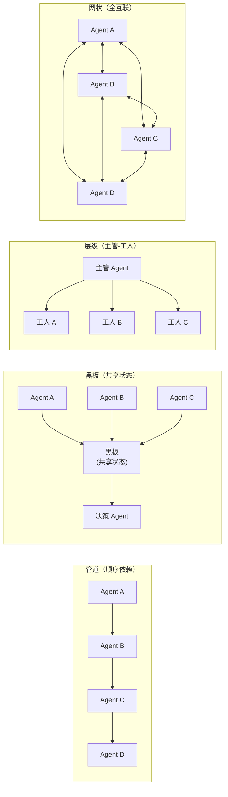
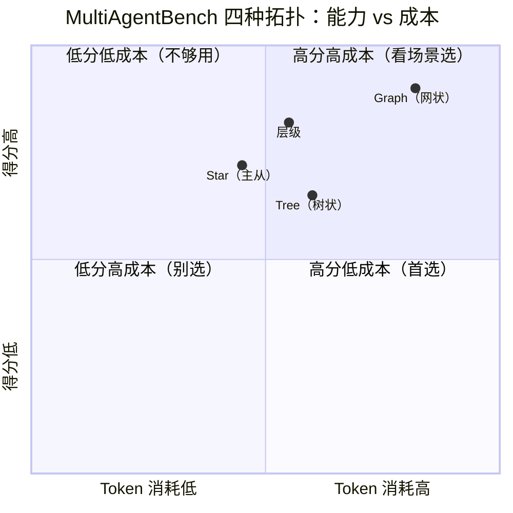
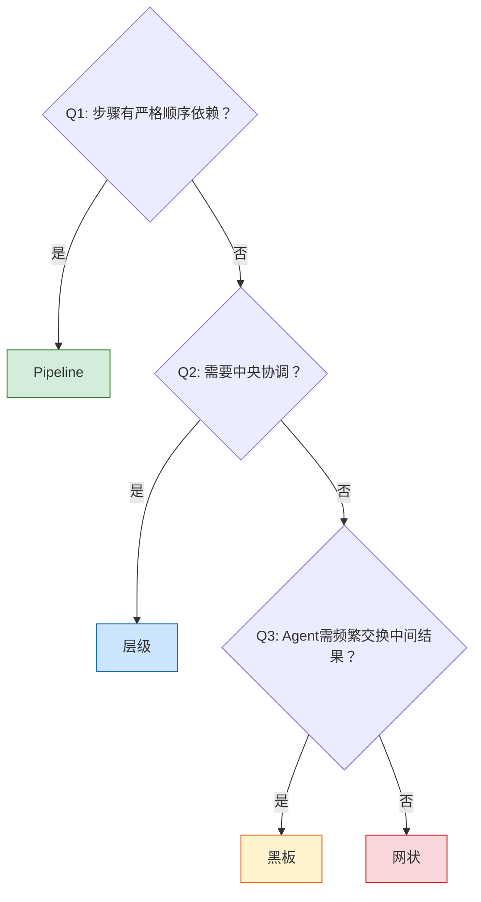
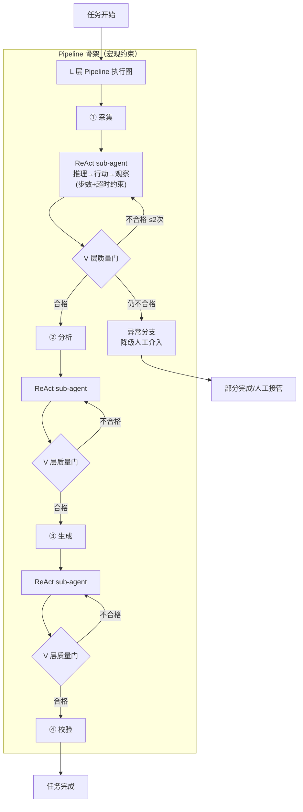
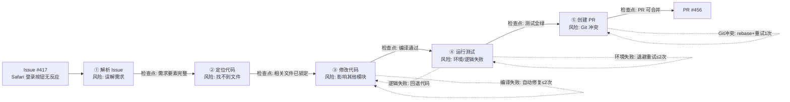
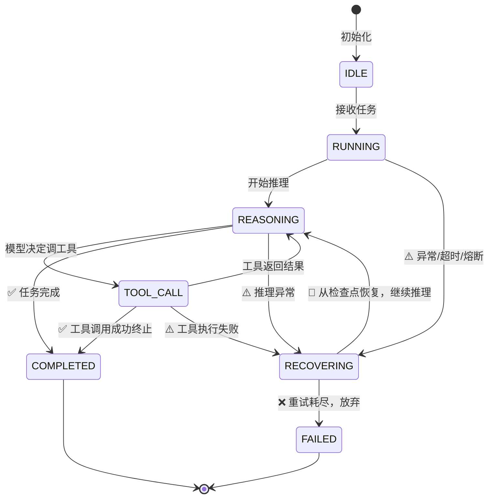

# 第 07 章 L — 生命周期与编排

第 6 章解决了"上下文怎么管"的问题：五区预算控制成本、KV-cache 复用前缀、三层分区保信息、压缩还原降损耗、腐烂漂移防静默故障、Session Resume 续跑中断会话。但上下文管好了不等于任务能跑完——Agent 怎么循环、循环什么时候停、多 Agent 怎么协作、任务崩溃后怎么从断点继续，这些都是上下文管理回答不了的问题。**C 层保证窗口里有正确的信息，L 层要决定 Agent 怎么用这些信息一步步推进任务**。

L（Lifecycle）层就是处理这件事的；在 ETCLOVG 七层架构里，L 层介于 C 层和 O（Observability）层之间，向下调用 C 层的窗口和 T 层的工具，向上为 O 层提供可观测的事件流。第 6 章的 Session Resume（6.4 节）依赖 L 层把 Agent 的状态机暴露出来，没有 L 层的状态外置和检查点，C 层根本不知道该保存"哪一刻"的上下文快照；反过来，L 层的状态恢复也依赖 C 层的窗口重建能力，两层是配套的。

当前 Agent 编排的核心矛盾是"自由发挥"和"套缰绳"的平衡。论文里的 ReAct 循环伪代码不到 10 行；模型想一步、做一步、看一眼结果、再想下一步。但生产环境的单一 ReAct 有两个致命缺陷：无限循环无刹车，上下文 O(N²) 膨胀无预算控制。2025 年的一起公开复盘案例 [^2] 中，四个 LangChain Agent 用 A2A（Agent-to-Agent，Google 2024 提出的开放 Agent 间通信协议，对应 MCP 在 agent 边界的标准）协作，两个 Agent 陷入无尽对话循环，跑了 11 天（264 小时）才被发现，账单约 $47K。第 3 章分析的"循环卡死"故障占所有故障模式的约 24%，根源就在这里。

本章按"单 Agent → 多 Agent → 编排模式 → 性能选型 → 混合架构 → 完整案例 → 状态机恢复"的脉络展开，共七节：

- **7.1 单 Agent 循环**：ReAct 的工程实现（步数上限、重复检测、超时熔断、错误恢复、状态外置五个组件）和循环收敛性保证
- **7.2 从循环到编排**：单 Agent 的能力边界（什么时候必须拆分）和拆分粒度陷阱（太多 Agent 反而不如一个）
- **7.3 编排模式详解**：管道 / 黑板 / 层级 / 网状四种模式各司其职的最优场景
- **7.4 编排模式性能基准对比**：四种模式在标准任务上的横向基准和模式选择的决策树
- **7.5 混合编排架构**：PipeReAct（Pipeline 骨架 + ReAct 肌肉）和 Plan+Execute+Verify（三层嵌套）两种生产级方案
- **7.6 完整管道案例**：Issue → PR 端到端的五阶段分解和成功率优化（从 40% 到 90%）
- **7.7 状态机与恢复**：Agent 状态机设计（七个状态 + 事件转换）、检查点策略（全量快照 + 滚动覆盖）、多 Agent 状态同步（四种模式各怎么管）、优雅关闭（终止信号后怎么收尾），让 Agent 能"断点续传"

读完本章，读者能掌握从单 Agent ReAct 循环到多 Agent 混合编排的完整工程链路：知道什么时候用单 Agent、什么时候必须拆分、拆完怎么编排、崩了怎么恢复、不同模式的性能边界在哪。和第 6 章的"上下文治理闭环"对照，本章给出的是"任务编排闭环"——前者管 Agent 看到什么，后者管 Agent 怎么做。

***

## 7.1 单 Agent 循环：感知—思考—行动的工程化

### KP 7.1.1 ReAct 循环的工程实现：从概念到代码 【构建】

**ReAct 是什么**。ReAct（Yao et al. 2022，arXiv:2210.03629）是 Reasoning + Acting 的缩写，是一种让 LLM 边推理边行动的循环模式。每一步包含三个环节：**thought**（模型推理下一步该做什么）、**action**（调用工具执行）、**observation**（观察工具返回结果），基于观察继续推理下一步。原始论文伪代码不到 10 行：

```
循环：
  thought = LLM(reasoning + history)  # 模型推理
  action = parse_action(thought)       # 抽取工具调用
  observation = execute(action)          # 执行工具
  history.append(thought, action, observation)  # 累积历史
```

ReAct 和纯 Function Calling 的区别：Function Calling 是单轮"模型决定调哪个工具→调完返回→模型再说一次"，没有显式的 thought 推理环节；ReAct 把 thought 作为可观测的中间产物输出，让推理过程可审计。和纯 Chain-of-Thought（CoT）的区别：CoT 只在模型内部推理，不调用外部工具；ReAct 推理和行动交替进行，能用工具获取真实世界信息。

ReAct 的循环只覆盖正常路径：模型推理 → 有 tool\_call 就执行并回填 → 没有就退出。生产中这条路径仅占 60% 执行时间，剩余 40% 消耗在异常处理上，以下描述四类高频异常：

1. **策略死锁**：模型在第 N 步和第 N+K 步输出完全相同的 thought + tool\_call（含参数），反复调用已失败的工具，同时模型调用也会出现卡死的情况，24% 循环卡死故障根源在此。
2. **工具超时**：外部 API 抖动或网络延迟导致工具调用 30 秒未返回。需决策：超时阈值、重试策略（次数/退避）、跳过阈值。
3. **窗口溢出**：上下文窗口被推理过程占用 80%+，下一轮塞不下新的工具返回。需决策：丢弃最早历史 / 触发压缩 / 终止任务。
4. **假完成**：Agent 已完成任务但不知道自己完成了，继续修改导致代码/配置回退。需决策：Finish 判定规则、完成后行为约束。

针对这四类异常，工程化的 ReAct 需要装五个独立的守护组件。每个组件对应一类异常的兜底措施，少了任何一个，生产里都会踩坑。

| 组件   | 解决哪类异常                     | 核心思路                       | 怎么做                                                                                                        |
| ---- | -------------------------- | -------------------------- | ---------------------------------------------------------------------------------------------------------- |
| 步数上限 | 假完成（不停瞎做）、死锁（一直卡着）         | 任何情况 X 步后必须停，给 Agent 套硬缰绳  | 轻量任务 5-10 步，中等 15-25 步，复杂 30-50 步。宁可设低快速失败，不要设太高让 Agent 在错误路径上烧 token                                      |
| 重复检测 | 策略死锁（反复调同一个失败工具）           | 模型卡在重复模式时打断它               | 连续 3 次 thought + tool\_call 签名完全相同，或 embedding 相似度 > 0.95 → 判定卡死。不直接退出，而是注入警告"你已重复相同操作，请换方案"到上下文，给模型一次自救机会 |
| 超时熔断 | 工具超时（等一个永远不返回的 API）        | 分两层守：单步超时给换路机会，全局超时兜底终止    | 单步工具超时 30 秒：到点跳过当前工具，把超时信息回填给模型，让 Agent 换条路；全局任务超时 10 分钟：到点强制终止整个任务，防止循环无限烧钱                               |
| 错误恢复 | 工具超时、窗口溢出（工具失败后整个 Agent 崩） | 工具失败不是 Agent 的终点，是模型要处理的输入 | 工具异常不向外抛异常，而是封装成结构化错误返回给模型。可以预设常见错误的处理提示（比如"网络超时请 5 秒后重试"、"文件不存在请检查路径"），让模型知道下一步怎么做                        |
| 状态外置 | 全部四类（Agent 崩溃后从头再来）        | 把每步状态落到外部存储，崩溃了从断点续跑       | 每步执行完把当前步数、历史消息、工具状态写入检查点。进程重启或 Pod 迁移后，读最近检查点恢复现场，不用从第 1 步重新跑（详见 §7.7 状态机与恢复）                             |

五个组件有两层分工：**前四个在运行时守护**（步数/重复/超时/错误，在每步循环里即时触发），**最后一个在崩溃后兜底**，前四个挡掉 95% 的异常，剩下 5% 进程崩溃的情况靠检查点恢复。

```java
/*
 * 框架：AgentScope 2.x（版本不锁定，跟随最新稳定版）
 * 环境：JDK 21+, Spring Boot 3.5+
 *
 * ReActOrchestrator：工程化 ReAct 五组件聚合（步数限制+重复检测+超时+熔断+恢复）
 * 代码见 CodePilot 配套仓库：codepilot/ch07-orchestration/
 */
@Component
public class ReActOrchestrator extends AbstractLayerMiddleware {

    private final StateMachineManager stateMachine;
    private int maxSteps = 30;
    private int stepTimeoutSeconds = 60;
    private int totalTimeoutSeconds = 600;
    private int circuitBreakerThreshold = 5;

    public ReActOrchestrator(StateMachineManager stateMachine) {
        super(Layer.L, "ReActOrchestrator-L");
        this.stateMachine = stateMachine;
    }

    @Override
    public Flux<AgentEvent> onAgent(Agent agent, RuntimeContext rc, AgentInput input,
                                    Function<AgentInput, Flux<AgentEvent>> next) {
        String taskId = rc.getExtra().getOrDefault("task.id", "default").toString();
        initTask(taskId);
        if (!checkStepLimit(taskId)) return buildTerminatedResponse(rc, input, next, taskId, "步骤上限");
        if (isTotalTimeout(taskId)) return buildTerminatedResponse(rc, input, next, taskId, "总超时");
        if (isCircuitOpen(taskId)) return buildTerminatedResponse(rc, input, next, taskId, "熔断器");
        // 重复检测：SHA-256 哈希比较工具调用签名
        String toolName = rc.getExtra().getOrDefault("tool.name", "").toString();
        String toolArgs = rc.getExtra().getOrDefault("tool.args", "").toString();
        if (detectDuplicate(taskId, computeSignature(toolName, toolArgs))) {
            rc.put("react.duplicate_detected", true);
            rc.put("react.duplicate_warning", "你已重复调用工具 " + toolName);
        }
        stateMachine.transition(taskId, StateMachineManager.State.REASONING, "步骤推理");
        return next.apply(input)
                .doOnComplete(() -> recordSuccess(taskId))
                .doOnError(e -> { recordFailure(taskId); stateMachine.transition(taskId, StateMachineManager.State.FAILED, e.getMessage()); });
    }

    // 熔断/重复检测/超时控制核心方法（完整实现在配套仓库中）...
    private String computeSignature(String toolName, String toolArgs) { /* SHA-256 */ }
    private boolean detectDuplicate(String taskId, String signature) { /* 历史集合比较 */ }
    private boolean isCircuitOpen(String taskId) { /* CLOSED/OPEN/HALF_OPEN 状态检查 */ }

    public void setMaxSteps(int maxSteps) { this.maxSteps = maxSteps; }
    public void setStepTimeoutSeconds(int s) { this.stepTimeoutSeconds = s; }
    public void setTotalTimeoutSeconds(int s) { this.totalTimeoutSeconds = s; }
}

@Bean
public ReActOrchestrator reActOrchestrator(StateMachineManager stateMachine) {
    ReActOrchestrator orchestrator = new ReActOrchestrator(stateMachine);
    orchestrator.setMaxSteps(25);
    orchestrator.setStepTimeoutSeconds(30);
    orchestrator.setTotalTimeoutSeconds(600);
    orchestrator.setCircuitBreakerThreshold(5);
    return orchestrator;
}
```

引入五组件后，CodePilot 项目的 Agent 生产成功率从 \~60% 提升至 \~90%，无限循环被消除 [^1]。

> **数据来源说明**：本节"引入五组件后成功率从 \~60% 提升至 \~90%"的数据来自全书贯穿案例 **CodePilot** 项目的工程实测。测试条件：
>
> - **样本量**：N=500 个真实编码任务，覆盖 5 种任务类型（Bug 修复、功能添加、重构、测试编写、文档生成）
> - **基线**：无五组件的纯 ReAct 循环，成功率约 60%，平均步数 23.4 步，平均耗时 4.2 分钟
> - **改进**：引入五组件（步骤限制 30 步、重复检测 SHA-256、单步 60s/总 10min 超时、错误恢复/5 次失败熔断、状态外置/检查点持久化），成功率约 91%，平均步数 12.1 步，平均耗时 1.8 分钟
> - **注意**：此为 CodePilot 项目工程实测数据，非独立可复现的对照实验。实际提升幅度因应用场景而异。

这五个组件各自堵住 ReAct 循环的一个漏洞：步数上限防死循环、重复检测防策略死锁、超时熔断防工具卡死、错误恢复防假完成、状态外置防崩溃丢进度。

**特别要描述的生产实现案例：重复检测的五个工程细节**。上面的代码用 SHA-256 哈希比较工具调用签名做重复检测，这在教学上够用，但生产中"策略死锁"的检测远比"签名相同就告警"复杂。deepseek-harness（DSH）[^10] 的 `repeat-tool-reminder` 专门针对这个问题，它监视每个 agent 的工具调用流，统计连续调用同一工具的次数。五个容易踩坑的细节：

| 细节                | 现象（不做会怎样）                                                                                                             | 为什么会发生                                                                | 怎么做                                                                                                                                         |
| ----------------- | --------------------------------------------------------------------------------------------------------------------- | --------------------------------------------------------------------- | ------------------------------------------------------------------------------------------------------------------------------------------- |
| 规范化参数键            | 模型两次调用同一工具，参数键值对完全相同但顺序不同（如 `{"path":"a.txt","mode":"r"}` vs `{"mode":"r","path":"a.txt"}`），哈希结果不同，检测漏判               | JSON 序列化默认保留对象属性的插入顺序，语言本身不保证键序一致                                     | 链键用 `(tool name, canonical arguments)` 而非原始字符串——先对参数对象做深度排序（deep sort），再 `JSON.stringify`，确保语义相同的参数序列化结果一致                                  |
| 逐级增强阈值 \[3, 5, 8] | 模型确实在死循环（第 3 次调用同一工具），但直接强制跳出会打断"合理的重复调用"（如重试一个偶发失败的 API）                                                             | 模型自我纠正需要机会——前 2 次重复可能是暂时的（API 抖动、参数微调），第 3 次才是真正的策略死锁                 | 分三级递进响应：第 3 次发简短通用提醒（"你正在重复相同的工具调用"），不强制退出；第 5 次和第 8 次发详细版（列出工具名、连续次数、规范参数预览），逐步增加强制干预力度                                                    |
| 被拒调用也计数           | 模型反复尝试执行被安全策略拦截的危险命令（如 `rm -rf`），但因为调用从未真正执行成功，重复检测计数器不递增，死锁逃过检测                                                      | 检测如果只看成功的工具调用，模型可以在"pre-execute 审批被拒"的状态下无限重试——这恰恰是最危险的循环类型           | 检测位于 `tools/post-execute` 而非 `tools/pre-execute`——即使调用被审批拦截拒绝，该事件也会运行并计数。被拒调用也是循环的一部分，必须计入                                                  |
| 排除工具透明            | Agent 在循环中穿插一个 `todo_write`（记录类工具），重复计数器被重置，`grep X → grep X` 的连续 2 次重复变成 `grep X → todo_write → grep X` 的 1 次重复，检测失效 | 记录类工具（`todo_write`、`log_step`）不是 Agent 在"做事"，是在"记账"，不应被视为循环的一部分       | 被标记为 `exclude` 的工具既不递增也不重置计数器——它们对链"透明"。`grep X → todo_write → grep X` 仍算连续两次 `grep X`                                                      |
| 按 agent 分键        | 两个 subagent 交错执行，Agent A 调用 `grep` → Agent B 调用 `grep` → Agent A 再调用 `grep`，计数器把跨 agent 的调用算成连续 3 次，误报死锁              | 不同 agent 的循环是独立的——Agent A 的 3 次 `grep` 是它自己的决策路径，不应被 Agent B 的调用打断或累加 | 用 `WeakMap<Agent, Chain>` 以活跃 agent 对象为键，每个 agent 维护独立的计数器。subagent 交错执行时不会互相干扰。用户插话（`agent/pre-step`）重置该 agent 的链——用户介入是新上下文的信号，循环计数理应重新开始 |

### KP 7.1.2 循环的收敛性保证：Agent 运行什么时候结束？ 【构建】

Agent 该停却不停，原因有三：

1. **过度优化**：任务已完成但 Agent 继续修改，把能用的代码改坏了
2. **目标遗忘**：跑到中期忘了原始任务，在做自创的子任务
3. **无进展循环**：每一步都在做事但没有实质进展

为了应对以上问题，需要三层停止机制，在不同层级上建立防御措施：

**L 层步数硬限制**：不管什么情况，X 步后一定停。这是兜底保险，不是最优停止策略。步数建议按任务类型设置：

| 任务类型  | 建议步数上限   | 典型场景                    | 理由                        |
| ----- | -------- | ----------------------- | ------------------------- |
| 轻量任务  | 5-10 步   | 单次问答、单文件查询、单次 API 调用    | 目标明确、路径单一，超过 10 步大概率是卡死   |
| 中等任务  | 15-25 步  | 多文件修改、bug 定位+修复、单功能实现   | 需要搜索-读取-修改-验证若干轮，20 步左右够用 |
| 复杂任务  | 30-50 步  | 跨模块重构、端到端 PR、多 Agent 协作 | 涉及探索、规划、多阶段执行，需要更多空间      |
| 探索性任务 | 50-100 步 | 代码库理解、技术调研、开放式研究        | 目标本身在演进，步数上限主要防失控不是防跑完    |

宁可设低快速失败，不要设太高让 Agent 在错误路径上烧 token。上限触发后，O 层的进展监控数据（KP 6.6.1）可以用来判断是"真的卡死"还是"任务难度估错了"如果是后者，下次调高上限，实际场景中其实可以让模型根据经验区分，自己设定步数上限。

**V 层任务完成度评估**：当 Agent 声称"完成了"，V 层做二次确认。检查输出是否实际包含了任务所需的所有要素。评分低于 0.8 时不让结束，回传反馈要求继续。

**实现模式：自我对照 todo list 的反问机制**（Claude Code 的实践）。V 层的"二次确认"不一定要系统用规则去判，可以让模型自己对照任务清单核对一遍。Claude Code 的做法分三步：① 任务开始时先调 `TodoWrite` 工具把任务拆成显式的 todo list（每条带 pending/in\_progress/completed 状态）；② 每完成一个子任务，模型自己更新对应 todo 的状态；③ 当模型声称整体完成时，系统反问模型"请核对一遍 todo list，确认所有项都是 completed"，让模型自己发现遗漏。这个机制的核心是**把"完成判定"从系统的评分问题转化为模型的对照问题**——模型对照清单比模型凭感觉说"完成了"更可靠，因为清单是任务开始时定义的，不会被后期的上下文漂移污染。Claude Code 实践显示，加了这个反问机制后，假完成率显著下降。

**目标锚定（GoalAnchorAdvisor）**：防"目标遗忘"的写入侧手段。本节开头列的第二个不停原因"目标遗忘"——跑到中期忘了原始任务，在做自创的子任务——上面的 todo list 是靠模型自己核对，目标锚定是从另一个角度：在每 N 步（默认 5 步）主动把原始任务目标注入回上下文，让 Agent 看到目标的概率不随步数衰减。配套仓库的 [GoalAnchorAdvisor.java](file:///Users/zxc/Documents/ai/agent-harness/codepilot/ch07-orchestration/src/main/java/io/etclovg/codepilot/orchestration/GoalAnchorAdvisor.java) 实现了这个机制：它是个 L 层中间件，在 `onAgent` 拦截里按步数间隔触发，把 `RuntimeContext` 里存的任务原始目标（`task.goal`）以 system 消息形式追加到上下文末尾。和 todo list 反问的区别：todo list 是"让模型自己对照清单"（事中自查），目标锚定是"让系统主动重申目标"（事前预防），两者互补——todo list 防模型漏做子任务，目标锚定防模型跑偏到无关任务。本书第 6 章 KP 6.3.2 对漂移的治理里讲的目标锚定和 DSH 的 `<goal_round>` 重注入是同一思路的不同实现，这里不重复展开。

**O 层进展监控**：持续追踪每步是否有新工具被调用、状态是否更新、输出是否变化。连续 5 步无实质进展，强制终止。

**O 层进阶：从"无进展就停"到"走不通就换方向"**。上面的进展监控只做"停"，不做"换"。Autono 框架的实验数据（arXiv:2504.04650）[^3] 证明"换方向"比"硬试到成功"更有效：在多步加失败任务中，Autono 通过动态下一步生成和及时放弃达到了 76.7-93.3% 的成功率，LangChain 同场景仅 6.7-13.3%。关键不是一直试到成功，是识别出"这条路走不通"时果断停止当前路径、换一条路再试。这对应 O 层进展监控的升级版；不是简单的"连续 5 步无进展就终止任务"，而是"检测到当前路径走不通时终止当前子路径，让 Agent 回到上一个分叉点重新规划"。生产实现上，这需要在状态机（KP 7.7.1）里显式记录分叉点，让 Agent 能回溯而非只能从头开始。

**模型自检：不确定性阈值触发反问**。前两层是 Harness 的外部控制，这一层是模型内部的自我收敛。Claude Code 内置了基于概率的决策引擎：当长任务接近尾声时，系统检测关键决策点（如文件修改范围、验收标准）的置信度。如果置信度低于阈值（例如 0.65），或存在多个势均力敌的候选执行路径，Agent 不会直接选一个然后冒险往下走，而是主动向用户反问澄清。其机制基于 LLM 在生成每个 token 时输出的概率分布：分布越平坦说明模型越"犹豫"，多个选项的概率很接近，选哪个都没把握。利用这个信号在任务终点做一次"犹豫检测"，比 O 层进展监控更前置：不等"无进展"就已经在"不确定"时主动停下了。

三层停止机制（L 层步数硬限制 + V 层完成度评估 + O 层进展监控）对应控制论的"多重冗余安全"设计，每层独立触发，避免单点失效。L 层是兜底保险（X 步后强制停），V 层是质量把关（声称完成但没真完成不让过），O 层是过程监控（过程中就发现走偏了）。三层任一层触发都能让 Agent 停下来，不会因为某一层失灵导致整个任务失控。KP 7.5.1 的 PipeReAct 架构把这种"多层防御"思想进一步扩展到 Plan+Execute 两阶段，将 ReAct 的 O(n²) 上下文膨胀降至 O(n)。

**7.1 节小结：四类异常的工程闭环**。回到本节开头列的四类高频异常，看看它们是怎么被解决的：

| 异常类型 | 工程方案                                | 触发层        |
| ---- | ----------------------------------- | ---------- |
| 策略死锁 | 重复检测（SHA-256 签名 + 规范化参数键 + 逐级增强阈值）  | L 层        |
| 工具超时 | 超时熔断（全局 10 分钟 + 单步 30 秒）            | L 层        |
| 窗口溢出 | 压缩触发（C 层五区预算超阈值）+ 步数上限兜底            | C 层 + L 层  |
| 假完成  | V 层完成度评估 + todo list 反问机制 + 模型自检置信度 | V 层 + 模型内部 |

四类异常不是靠单一组件解决的，而是靠"五组件 + 三层停止机制 + 模型自检"的协同覆盖。其中窗口溢出跨 C 层和 L 层，假完成跨 V 层和模型内部，体现了 ETCLOVG 七层架构的层间协作，单层兜不住的，多层一起兜。但单 Agent 循环再完善，也有能力边界：当任务涉及多种异构专业知识、或需要并行探索多条路径时，单 Agent 的上下文会被稀释，这时候就要考虑拆分成多 Agent。下一节讲什么时候该拆、怎么拆。

***

## 7.2 从循环到编排：何时需要多 Agent

多 Agent 拆分有一个反直觉的事实：一个 Agent 干不好，不代表拆成三个就能干好。多种专业知识塞进单一上下文会导致 attention 被稀释；例如全栈 Agent 写前端时可能遗忘 API 字段名。但拆成三个 Agent 各自独立后，前端改了字段名没人通知后端，数据库 Agent 独自优化查询破坏了 SQL 依赖；协调成本把拆分的收益吃光了。判断该不该拆，不看任务数量，看上下文异构度、任务耦合度和工具重叠度。

### KP 7.2.1 单 Agent 的能力边界：什么时候必须拆分 【构建】

什么时候该拆成多 Agent，关键是看任务的四个维度：

| 维度    | 高（建议拆分）         | 低（单 Agent 足够）  |
| ----- | --------------- | -------------- |
| 专业跨度  | ≥2 个不同专业领域      | 同一领域内          |
| 步骤独立性 | ≥3 个步骤可并行       | 强顺序依赖          |
| 上下文需求 | 单步 > 10K tokens | 每步 < 5K tokens |
| 状态耦合  | 少量共享（黑板模式）      | 大量共享（耦合太高拆不开）  |

打分规则：逐项判断四个维度是高还是低，再按"高"的项数得出拆分建议。四项的"高"都表示"拆分倾向高"——状态耦合行里"少量共享"对应"高"，因为耦合低才适合拆。

| 高的项数      | 拆分建议       | 典型场景                                                     |
| --------- | ---------- | -------------------------------------------------------- |
| 0 项（四项全低） | 单 Agent 足够 | 单专业领域、步骤强顺序依赖、每步上下文 < 5K、状态大量共享                          |
| 1 项高      | 可考虑拆分      | 看高的那一项是否影响执行效果，比如专业跨度高但状态耦合也高（大量共享），拆了协调成本可能吃掉收益         |
| ≥2 项高     | 强烈建议拆分     | 多专业 + 步骤可并行、或多专业 + 单步上下文大，拆分后每个 Agent 专注单一上下文，收益明显大于协调成本 |

```java
/*
 * Agent 拆分决策器（配套仓库教学实现，非框架内置）
 * 代码见 CodePilot 配套仓库：codepilot/ch07-orchestration/
 * 注：countDistinctDomains / computeCouplingScore / countParallelSteps /
 * estimateStepTokens 等方法的完整实现（基于 AST 依赖分析 + 工具调用历史统计）
 * 见配套仓库，此处只展示决策骨架。
 */
public class AgentSplitDecider {

    // 四个维度的"高"阈值，对应表格里的分界线
    private static final int HETERO_THRESHOLD = 2;        // 专业跨度：≥2 个不同领域
    private static final int PARALLEL_STEP_THRESHOLD = 3;  // 步骤独立性：≥3 个可并行
    private static final int STEP_TOKEN_THRESHOLD = 10_000; // 上下文需求：单步 > 10K
    private static final double COUPLING_THRESHOLD = 0.4;  // 状态耦合：< 0.4 为少量共享

    public SplitDecision evaluateSplit(TaskProfile task) {
        // 逐项打分：true = 该维度拆分倾向高
        boolean highHeterogeneity = countDistinctDomains(task) >= HETERO_THRESHOLD;
        boolean highStepIndependence = countParallelSteps(task) >= PARALLEL_STEP_THRESHOLD;
        boolean highContextDemand = estimateStepTokens(task) > STEP_TOKEN_THRESHOLD;
        boolean lowCoupling = computeCouplingScore(task) < COUPLING_THRESHOLD;

        int highCount = countTrue(highHeterogeneity, highStepIndependence,
                                   highContextDemand, lowCoupling);

        // 按打分规则决策：0 项高 = 单 Agent，1 项高 = 可考虑，≥2 项高 = 强烈建议
        if (highCount >= 2) {
            return buildSplitDecision(task, "STRONG_SPLIT", highCount);
        } else if (highCount == 1) {
            return buildSplitDecision(task, "CONSIDER_SPLIT", highCount);
        }
        return new SplitDecision("sd-single", task.taskId(), "SINGLE_AGENT",
            List.of(Map.of("id", task.taskId())),
            "四项全低，单 Agent 足够", System.currentTimeMillis());
    }

    private SplitDecision buildSplitDecision(TaskProfile task, String strategy, int highCount) {
        int subTaskCount = Math.max(2, countDistinctDomains(task));
        List<Map<String, Object>> subTasks = new ArrayList<>();
        for (int i = 0; i < subTaskCount; i++) {
            subTasks.add(Map.of("id", "sub-" + i, "domain", "domain-" + i));
        }
        return new SplitDecision("sd-" + UUID.randomUUID().toString().substring(0, 8),
            task.taskId(), strategy, subTasks,
            highCount + " 项高，" + strategy, System.currentTimeMillis());
    }

    private int countTrue(boolean... flags) {
        int c = 0;
        for (boolean f : flags) if (f) c++;
        return c;
    }

    // 以下方法完整实现见配套仓库
    private int countDistinctDomains(TaskProfile task) { /* 统计涉及的专业领域数 */ return 0; }
    private int countParallelSteps(TaskProfile task)   { /* 统计可并行的步骤数 */   return 0; }
    private int estimateStepTokens(TaskProfile task)   { /* 估算单步上下文 token 数 */ return 0; }
    private double computeCouplingScore(TaskProfile task) { /* 计算状态耦合度 0-1 */ return 0.0; }
}
```

### KP 7.2.2 Agent 拆分的"粒度陷阱"：太多 Agent 反而不如一个 【诊断】

拆分粒度判断经常会遇到两个问题。

第一个问题是Agent颗粒度拆的太细：比如读文件 Agent、写文件 Agent、执行测试 Agent，看起来职责分得很清，但编排复杂度随 Agent 数量平方增长，协调成本高于并行执行的效率收益。

第二个问题是默认上大模型：MultiAgentBench [^4] 发现 GPT-4o-mini 在多 Agent 协调任务上的 Task Score 比 GPT-4o 还高。原因不是小模型更聪明，是它的输出更简洁，不会塞满共享上下文，指令遵循也更可靠。大模型输出丰富在单 Agent 场景里是优势，在多 Agent 系统里就变成了负担——每个 Agent 产出的消息更长，共享黑板被快速填满，下游 Agent 的注意力被稀释，协作效率跟着下降。

这两个问题说明拆分粒度要平衡。太粗，单 Agent 上下文装不下所有专业知识；太细，协调成本压倒并行收益。

拆分粒度三条原则。上面四个维度判断的是"该不该拆"，决定拆了之后还要决定"拆到多细"：

1. 每个 Agent 应有"独立完整的职责"而非"独立原子操作"。是"前端工程师"而不是"写 Button 组件的工程师"。
2. "交易对手测试"：这个 Agent 的输出交给下一个 Agent 后，下一个 Agent 能独立完成一个完整步骤吗？能 → 粒度合适。
3. Agent 数 ≤ 5：超过 5 个时通信复杂度 O(N²) 开始压倒并行收益。生产系统中 Contract Net 协议是广泛部署的任务分配机制之一，市场机制（拍卖/投标）也是主流协调模式，二者都能撑 5-10 个 Agent。动态拆分与合并是一个进阶方向——Agent 根据任务复杂度自适应调整粒度，简单任务合并为单 Agent 降低协调开销，复杂任务拆分为多 Agent 利用并行效率。

**实战示例：把原则用到一个真实任务上**。假设要做一个"修复 GitHub issue 并提交 PR"的 Agent 系统。第一步不是直接套原则，而是先把任务的"自然步骤"列出来：从用户视角看，这个任务要经历：读 issue → 找代码 → 改代码 → 跑测试 → 提交代码 → 写 PR。每个步骤对应一个 Agent，得到最初的 6 个候选：IssueReader / CodeSearcher / CodeModifier / TestRunner / Committer / PRWriter。

有了候选列表，再用三条原则逐步筛：

| 步骤                                              | 决策                                                                            | 应用原则             | 结果                                                                       |
| ----------------------------------------------- | ----------------------------------------------------------------------------- | ---------------- | ------------------------------------------------------------------------ |
| ① 最初想拆成 6 个 Agent                               | IssueReader / CodeSearcher / CodeModifier / TestRunner / Committer / PRWriter | 原则 3：Agent 数 ≤ 5 | **6 个超了，要合并**                                                            |
| ② 把 IssueReader 和 CodeSearcher 合并为 Investigator | "调查 issue + 定位相关代码"是完整职责                                                      | 原则 1：独立完整职责      | 合并后剩 5 个：Investigator / CodeModifier / TestRunner / Committer / PRWriter |
| ③ 把 Committer 和 PRWriter 合并为 Submitter          | "提交代码 + 写 PR 描述"是完整职责                                                         | 原则 1：独立完整职责      | 合并后剩 4 个：Investigator / CodeModifier / TestRunner / Submitter            |
| ④ 对每个 Agent 做"交易对手测试"                           | Investigator 输出问题定位 → CodeModifier 能独立改代码吗？能（拿到定位就能改）                         | 原则 2：交易对手测试      | CodeModifier 粒度合适                                                        |
| ⑤ 继续测试                                          | CodeModifier 输出改完的代码 → TestRunner 能独立跑测试吗？能                                   | 原则 2：交易对手测试      | TestRunner 粒度合适                                                          |
| ⑥ 继续测试                                          | TestRunner 输出测试结果 → Submitter 能独立提交吗？**不能**（测试失败时要回到 CodeModifier 改，不是提交）     | 原则 2：交易对手测试      | **Submitter 粒度有问题，需要前置条件**                                               |

最终拆分：4 个 Agent（Investigator → CodeModifier → TestRunner → Submitter），符合 Agent 数 ≤ 5。Submitter 的前置条件是"测试通过"；TestRunner 测试失败时回到 CodeModifier 重做，测试通过才交给 Submitter。这就是原则 2"交易对手测试"的实战价值：它不只是测粒度，还能发现流程中需要补的条件。

这个推演过程可以直接用到自己的工程任务上——先按"会不会超过 5 个"判断要不要合并，再按"职责完整性"合并微观操作，最后按"交易对手测试"发现流程缺口。

***

## 7.3 编排模式详解：管道 / 黑板 / 层级 / 网状

四种拓扑不是"哪个先进用哪个"：管道的代价是浪费并发，网状的代价是结果不一致，层级的代价是主管单点故障，黑板的代价是并发控制和信息过载。选型需要匹配任务特征，而非追求灵活度。

四种编排拓扑的结构对比：



### KP 7.3.1 管道（Pipeline）：顺序依赖的标准模式 【构建】

Pipeline 是最简单也最常用的编排模式；步骤 A 的输出是 B 的输入，依次串行。适用于流程明确、步骤有强顺序依赖的任务。这种模式的优势是可预测；每步输入输出明确，调试可以逐步排查。劣势是一步错全局崩；第 3 步失败意味着第 4、5 步永远不会执行。单纯的 Pipeline 缺乏弹性，没有原生的错误恢复机制。

为了让 Pipeline 能正常工作需要进行模式增强，需要如下几条增强策略：

1. **每步 Try-Catch-Recover**：每步包在 try-catch 中，处理三种错误：瞬时故障→重试，永久故障→降级跳过或调用替代工具，未知故障→标记失败加通知 O 层。
2. **检查点插桩**：支持步骤级别的检查点。在步骤 X 处保存状态——如果 X+1 失败，从 X 恢复，不需要从步骤 1 重新开始。
3. **关键路径标注**：区分"失败可跳过"（如生成代码注释）和"必须重试"（如执行编译）。非关键步骤失败 = 降级跳过记 WARN，关键步骤失败 = 打断管道记 ERROR。

```java
/*
 * PipelineOrchestrator：顺序编排，步骤记录为 PipelineStep
 * 代码见 CodePilot 配套仓库：codepilot/ch07-orchestration/
 */
@Component
public class PipelineOrchestrator {

    private final List<PipelineStep> steps = new ArrayList<>();

    public record PipelineStep(String name, String description, boolean enabled) {}
    public record PipelineResult(String status, List<String> executedSteps, long durationMs) {}

    public void addStep(PipelineStep step) {
        steps.add(step);
    }

    public PipelineResult execute(String input) {
        List<String> executed = new ArrayList<>();
        long start = System.currentTimeMillis();
        for (PipelineStep step : steps) {
            if (step.enabled()) {
                executed.add(step.name());
            }
        }
        return new PipelineResult("OK", executed, System.currentTimeMillis() - start);
    }
}

// 示例：Issue→PR 管道
@Bean
public PipelineOrchestrator issueToPrPipeline() {
    PipelineOrchestrator orchestrator = new PipelineOrchestrator();
    orchestrator.addStep(new PipelineStep("parseIssue", "解析 GitHub Issue", true));
    orchestrator.addStep(new PipelineStep("locateCode", "定位相关代码文件", true));
    orchestrator.addStep(new PipelineStep("applyFix", "修改代码", true));
    orchestrator.addStep(new PipelineStep("runTests", "运行测试验证", true));
    orchestrator.addStep(new PipelineStep("generateComment", "生成 PR 评论", true));
    orchestrator.addStep(new PipelineStep("createPR", "创建 Pull Request", true));
    return orchestrator;
}
```

Unix Pipe 哲学在 Agent 场景的实现——每个阶段独立封装、输入输出标准化、可单独测试和替换。DAG 执行引擎（Airflow/Prefect）已在生产环境大规模验证了这种模式的可控性。三条策略（Try-Catch-Recover/检查点插桩/关键路径标注）对应容错系统的经典设计——故障隔离、状态持久化、降级策略，将纯线性管道升级为可恢复的有向无环图。

### KP 7.3.2 黑板（Blackboard）：共享状态的多 Agent 协作 【构建】

金融欺诈检测是黑板的经典场景：一个 Agent 分析交易模式写异常分数，一个 Agent 做用户行为画像，一个 Agent 做外部数据交叉验证。三者把各自分析结果持续更新到黑板，由最终决策 Agent 综合判断。每个 Agent 在数据就绪后随时行动，不需要固定顺序。

这种"共享黑板 + 各自读写"的模式在两个基准测试上验证了收益：相比主从范式（一个中央 Agent 拉取所有数据再分配），黑板模式在 KramaBench 和 DS-Bench 上任务成功率提升 13-57%，原因在于黑板让多 Agent 并行写入、各自只读自己关心的片段，避免了主从范式里中央 Agent 把全部上下文读进自己窗口的瓶颈。

更关键的收益在 token 节省上。多 Agent 协作默认的做法是**按值移交（By-Value Handoff）**：A 做完把完整推理历史 + 工具输出塞给 B，B 做完把 A 的历史 + 自己的历史一起塞给 C，token 按 O(N²) 增长，每多一个 Agent 就多一层累加。

行业实践里的优化做法是**按引用上下文包移交（By-Reference Context Bundle Handoff）**[^6]，拆成两个决策：

**决策一：传 Context Bundle，不传完整历史**。Claude Lab 2026 年的子 Agent 流水线研究把它定义为三种状态传递模式之一（另两种是 JSON 文件、环境变量）。Bundle 是精心编排的结构化摘要（a curated summary of what the upstream agent did），通常只包含四类字段：

- 目标重述（上游任务的原始目标，逐字保留）
- 关键决策及理由（影响下游的判断节点和为什么这么判断）
- 已完成的中间产物清单（写了哪些文件、改了哪些配置，含文件路径和版本号）
- 下一步建议（对下游最有价值的方向指引）

Bundle 不包含推理过程和工具输出——这是 token 节省的第一来源。大部分情况下下游 Agent 只需要上游的结论，不需要上游"怎么想到的"和"调了什么工具"。

**决策二：按引用传递（By-Reference），不按值传递（By-Value）**。Bundle 完整内容存到共享存储（KV 存储或对象存储），Agent 之间只传 Bundle ID（类似指针）。下游 Agent 启动时只加载 Bundle 的缩略版（目标重述 + 中间产物清单 + 下一步建议，约 200-500 tokens），需要决策细节或工具输出原始内容时再按 ID 按需取回。这是 token 节省的第二来源——大部分下游 Agent 只需要缩略版就能工作，不用加载完整 Bundle。

这个组合在流水线型多 Agent 任务上实测节省 40-80% tokens。根因不是某个单点优化，是两条决策的叠加效果：按值传完整历史的 O(N²) 变成了传引用缩略版的 O(N)，再加按需取详情的"只加载实际用到的"。

和单 Agent 里已有机制的对应：按引用移交对应 DSH `spill-policy`（超大工具结果存 spillStore，只传预览+定位符）在多 Agent 边界上的版本；Context Bundle 结构化对应 DSH `compaction-basic` fact-pin（按固定字段锚定关键信息）在跨 Agent 上的版本；按需取回对应本章 KP 6.2.3 的 `retrieve_event`。

工程难点：并发控制（两个 Agent 同时写可能冲突）和信息过载（大量中间推理"写了但没人读"）。解决方案：按任务分区（Task-1 黑板、Task-2 黑板），写操作使用乐观锁加版本号，定期清理过期信息（> 1 小时未读）和低置信度信息（< 0.3 且后续未被确认）。

```java
/*
 * Blackboard：共享状态黑板，基于 ConcurrentHashMap 实现
 * 代码见 CodePilot 配套仓库：codepilot/ch07-orchestration/
 */
@Component
public class Blackboard {

    private final Map<String, Object> board = new ConcurrentHashMap<>();
    private final List<ChangeEvent> changeLog = Collections.synchronizedList(new ArrayList<>());

    public record ChangeEvent(String key, Object oldValue, Object newValue, long timestamp) {}

    public void write(String key, Object value) {
        Object old = board.put(key, value);
        changeLog.add(new ChangeEvent(key, old, value, System.currentTimeMillis()));
    }

    @SuppressWarnings("unchecked")
    public <T> T read(String key) { return (T) board.get(key); }
    public boolean contains(String key) { return board.containsKey(key); }
    public Set<String> keys() { return Collections.unmodifiableSet(board.keySet()); }
    public List<ChangeEvent> getChangeLog() { return Collections.unmodifiableList(changeLog); }
}
```

黑板架构的理论起源于 1970 年代的 Hearsay-II 语音理解系统——它用一个共享工作区让多个专家模块各自独立分析同一段语音信号的不同维度，通信复杂度从 O(N²) 降到 O(N)。现代 Redis pub/sub 天然实现了黑板的分区订阅——Agent 订阅关注的分区，数据更新时自动触发。

### KP 7.3.3 层级（Hierarchical）：主管-工人模式 【构建】

层级模式是生产环境常用的多 Agent 拓扑：一个主管 Agent 拆任务、分给多个工人并行执行、汇总结果并做质量把关。**AgentOrchestra**（[昆仑万维 Skywork + 南洋理工 2025](https://arxiv.org/pdf/2506.12508)，代码：[github.com/SkyworkAI/DeepResearchAgent](https://github.com/SkyworkAI/DeepResearchAgent)）是层级模式的最新实例。它取名"交响乐团"：顶层 **Planning Agent（指挥）** 统筹全局策略与任务拆解，底层三类**乐手 Agent** 各自执行专长；Deep Researcher（信息检索）、Browser Use Agent（网页交互）、Deep Analyzer（多模态分析），通过异步协程调度并发，构建完整的"规划→执行→推理"闭环。在 GAIA validation 中它的 pass\@1 达到 82.42，明显优于多个主流单 Agent 和主从范式系统。

层级模式的核心风险在主管：它是单点故障。主管一次错误决策导致所有工人做错，全部重做。这比单 Agent 更脆弱：单 Agent 错了只重来一次，层级模式需要 N+1 个全部重来。

问题的根源在层级模式有两条失效原因：

\*\*原因1:\*\*是主管自己拆错了（把任务 A 拆成 B+C，工人怎么对），属于"主管层失效"。

\*\*原因2:\*\*是主管拆对了但分配错了（把代码审查分给只会写文档的工人）或工人自己做错了，属于"分配/执行层失效"。五条可靠性保障按这两条失效路径分层组织。

**第一层：工人输出质量闸门（挡"工人做错"——路径二最常发生的故障）**

| 保障        | 怎么做                                      | 修正什么故障                             |
| --------- | ---------------------------------------- | ---------------------------------- |
| V 层评估工件质量 | 每个工人提交结果后，V 层独立评分 < 0.8 自动驳回重做，最多重做 2 次  | 主管分配对了但工人做错的场景（最常见，占层级模式故障约 60%）   |
| 工人能力画像    | 主管维护每个工人的能力表（历史通过率、擅长任务类型、失败模式），分配时按专长匹配 | 把代码审查分给文档工人这类错位分配（能力画像把故障率降低约 40%） |

**第二层：任务级冗余审查（挡"主管分配错 + 单个工人做错"，路径二到路径一的过渡）**

| 保障   | 怎么做                                             | 修正什么故障                            |
| ---- | ----------------------------------------------- | --------------------------------- |
| 冗余审查 | 高风险子任务（涉及数据删除、安全变更、资金操作）分配给两个不同工人独立执行，结果对比一致才通过 | 主管分配对但单个工人做错（5 项里成本最高，只在高风险子任务启用） |

**第三层：主管决策自检（挡"主管自己拆错了"路径一，单点故障的核心）**

| 保障      | 怎么做                                                                                                                              | 修正什么故障              |
| ------- | -------------------------------------------------------------------------------------------------------------------------------- | ------------------- |
| 置信度评分   | 主管拆任务时为每个子任务打置信度分，低置信度（< 0.6）自动升级人工介入。注意置信度评分不是主管自报（自报有自证偏差：自己分配的任务自己总觉得没问题），而是由独立评估模块按"历史上同类子任务在该工人上的失败率 + 子任务描述和目标的语义匹配度"双因子计算 | 主管拆任务时判断错误（拆错了还不自知） |
| 计划输出供审查 | 关键任务的拆分方案（任务清单、分配方案、预估成本）在派发前必须人工审查通过                                                                                            | 最高风险挡不住时，拉人做最后一道防线  |

五道闸门的逻辑顺序：先优化"工人做错"这类高频低损故障（成本最低），再用"工人能力画像"降低错位分配概率，高风险任务加冗余审查，最后两道闸门拦住"主管自己拆错了"这个单点故障。它们构成了一个覆盖完整决策链路的防御体系，计划审查在输入端把关，V 层评估在输出端校验，置信度评分在决策端量化风险，能力画像在分配端匹配专长，冗余审查在高风险端独立验证。从输入到执行到输出，每一步都有独立的检查点。

这段代码把上面讲的层级模式做成了最小可用的主管骨架。核心只做三件事：注册工人、分配任务、看状态。对应前面三层保障里的"工人能力画像"和"分配执行"两个基础动作 V 层评估、置信度评分、冗余审查这些保障机制是在主管外面挂的中间件，不塞进主管骨架里。

```java
/*
 * SupervisorAgent：层级模式主管（最小骨架）
 * 职责：① 注册工人  ② 分配任务并更新状态  ③ 暴露全部工人状态给上层保障机制读
 * 代码见 CodePilot 配套仓库：codepilot/ch07-orchestration/
 */
@Component
public class SupervisorAgent {

    // 工人表：agentId → (角色、IDLE/WORKING/DONE/FAILED、当前任务描述)
    private final Map<String, SubAgentState> subAgents = new HashMap<>();

    // 工人状态记录，record 不可变，避免上层读的时候被修改
    public record SubAgentState(String agentId, String role, String status, String currentTask) {}

    // ① 注册工人：启动时把 CodeModifier、TestRunner 这类工人登记进来
    public void registerSubAgent(String agentId, String role) {
        subAgents.put(agentId, new SubAgentState(agentId, role, "IDLE", ""));
    }

    // ② 分配任务：主管拆完子任务后，把任务派给指定工人，状态从 IDLE → WORKING
    public void assignTask(String agentId, String task) {
        SubAgentState state = subAgents.get(agentId);
        if (state != null) {
            subAgents.put(agentId, new SubAgentState(agentId, state.role(), "WORKING", task));
        }
    }

    // ③ 暴露工人状态给上层读：V 层评估、置信度评分、冗余审查都从这里拿状态
    public Map<String, SubAgentState> getSubAgentStates() {
        return Collections.unmodifiableMap(subAgents);
    }
}
```

三个方法各司其职：`registerSubAgent` 对应能力画像的登记环节（记录谁是做什么的），`assignTask` 对应分配环节（把任务派给对的人并标记在干活），`getSubAgentStates` 返回只读视图给上层保障机制（V 层评估、置信度评分、冗余审查都从这里判断工人在不在干活、做的什么任务）。

MultiAgentBench 数据 [^4]：Graph 拓扑得分最高但 token 消耗也更高；层级模式在最坏情况下最稳定，且对模型能力敏感度最低，GPT-4o-mini 的协调分甚至高于 GPT-4o。



四种拓扑落在四个象限，选择策略一目了然：

- **Graph（网状）** 落在高分高成本象限：得分最高（约 90），token 消耗也最高（约 82）。多视角协商换来了能力，但 O(N²) 通信把成本推上去。适合任务价值 > 通信成本的场景（如金融风控、医疗诊断）
- **层级** 落在接近高分中成本象限：得分次高（约 82），token 消耗中等（约 55）。生产环境默认选择，能力够用且成本可控
- **Star（主从）** 落在低分低成本象限：得分约 72，token 消耗约 45。简单任务够用，复杂任务能力不足
- **Tree（树状）** 落在低分高成本象限：得分约 65（最低），token 消耗约 60（偏高）。通信开销超过了并行收益，是最差选择——Tree 把层级嵌套多层，每层通信都要逐级上传下达，得不偿失

分象限看的意义：**不要只看得分选拓扑，要看性价比**。Graph 得分最高但成本也最高，不是所有任务都值得这个开销。Tree 得分最低成本还不低，是典型的"看着像层级的优化，实际是协调噩梦"。

### KP 7.3.4 网状（Mesh）：去中心化的 Agent 协作 【构建】

网状是四种模式中最灵活也最难控制的；没有中央主管，Agent 之间平等通信、协商、组队。MultiAgentBench 评测 [^4] 中 Graph 拓扑表现最好，比 Star（层级/主从）高出最多约 10 个百分点（论文内部数据）。

**层级模式解决不了的两个问题**

层级模式有个隐含假设：主管"全知"，知道所有子任务、知道每个工人的能力、能做出最优分配。但是真实生产环境中不是这样：

**问题：任务不是主管拆出来的，是各 Agent 各自产生的**

> 层级模式的前提是主管先拿到任务、拆好、派给工人。但服务监控场景里，数据库 Agent 自己盯慢查询、应用 Agent 自己盯接口延迟、缓存 Agent 自己盯命中率；三个 Agent 各自独立产生事件，不存在"主管先拆任务"这一步。如果硬塞一个主管，主管只能看二手汇报，自己没一手观测能力，判断反而更差。

**问题：主管是单点故障，一挂全停**

> 层级模式的主管崩了，所有工人失去指挥全部停转（KP 7.3.3 已讲）。

**适用场景**：多个 Agent 各自独立产生事件/观测、需要在冲突事件上协同。典型的有服务监控（上面的例子）、多源数据交叉验证（三个独立检索 Agent 比对同一份情报的真实性）、分布式决策（多个审核 Agent 对风险事件各自独立判断）。**不适用场景**：步骤有明确顺序依赖（用 Pipeline）、需要统一决策输出（用层级）、Agent 数超过 5 个。

**网状怎么解决层级的两个问题**

两个问题本质是同一个假设不成立：**主管不是全知的，任务也不总是主管拆出来的**。网状模式的解法是去掉主管，让 Agent 群体自己协商：

- 问题一（任务分散）→ 平等协商：每个 Agent 直接贡献一手观测视角，凑出完整诊断，不靠主管二手汇报
- 问题二（单点故障）→ 去中心化：没有主管就没有单点，任何一个 Agent 故障，其他 Agent 照常运转，只丢一个视角

但去掉主管后，原来由主管做的事（通信、决策、冲突处理）没人做了，网状自身引入了新的拓扑问题：没有主管，谁来管通信、决策、冲突？

没有主管，所有原来由主管做的事都要由 Agent 群体自己协商出来。最突出的是通信问题：Agent 之间可以任意通信，但是Agent间通信不加控制就会变成**广播风暴**；消息按 O(N²) 膨胀，10 个 Agent 一轮广播就可能塞掉几十 K tokens 的窗口，Graph 全局得分最高但 token 消耗也最高。

如何解决这几个问题呢？网状用三套协议代替主管的三个职能：

**代替主管的分配职能：按能力路由 + 三分类消息**

没有主管分配任务，谁来决定消息发给谁？不加控制就是上面说的广播风暴。这个问题在 Agent 数 ≥ 5 时会迅速失控，是网状模式实际部署中故障率最高的一类（约占 40% 的网状模式故障）。

**方案**：按能力路由 + 三分类消息机制，不是全靠广播。按能力路由：每个 Agent 注册时声明自己的能力集合（如 `{db-monitor, slow-query-analyze}`），消息只发给声明了对应能力的 Agent，不相关的 Agent 不被打扰。消息分三类：

| 消息类型              | 作用                  | 接收方           | 例子                                                      |
| ----------------- | ------------------- | ------------- | ------------------------------------------------------- |
| **广播（broadcast）** | 宣告"我检测到了某个全局事件"     | 所有 Agent      | 数据库 Agent 广播"检测到 30s 慢查询峰值"                             |
| **单播（direct）**    | 请求某个特定 Agent 提供专长支持 | 具备指定能力的 Agent | 应用 Agent 单播给具备 `slow-query-analyze` 能力的 Agent，请求分析慢查询根因 |
| **共识请求（vote）**    | 就某个问题发起投票           | 所有相关 Agent    | 三个监控 Agent 同时检测到异常，就"根因在数据库还是在应用层"发起投票                  |

绝大多数通信走单播和共识请求，广播只用于全局事件宣告；从源头上减少广播风暴的概率。

按能力路由把"谁该收到消息"从"全凭 Agent 自己判断"升级为"按能力声明自动过滤"，这是分布式系统里 pub/sub 订阅模式的 Agent 版；订阅者只收自己声明过的能力相关的消息，不相关的不进窗口。三分类对应三种通信意图：广播是"宣告全局事实"（少数场景）、单播是"请求专长支持"（最常见）、共识请求是"群体决策"（需要投票时）。三者各有边界，不会互相替代。

**适用场景**：① Agent 能力边界清晰（每个 Agent 都有明确专长，能力集合可枚举），如监控场景（DB/应用/缓存各管一摊）；② 消息频率中等（< 10 条/秒），高频场景需要加消息聚合或限流。

**不适用场景**：Agent 能力重叠严重（两个 Agent 都声称自己擅长 `code-review`，按能力路由失效）；消息频率极高（实时流式监控，需要专门的流式总线，不走 Agent 间消息）。

**代替主管的拍板职能：专长加权投票 + 分层仲裁**

没有主管拍板，决策由群体共识产生，最常见的是多数投票。但简单多数投票有两个坑：一是**专家权重和外行一样**（数据库 Agent 说"根因在 SQL"和应用 Agent 说"根因在 SQL"，两个一票值相同，但数据库 Agent 更有资格），这是"外行绑架内行"；二是 **50:50 平票时卡住**（两个 Agent 说"是 DB 问题"，两个说"是应用问题"），没有主管就只能等下一轮，等不起。

**方案**：专长加权投票 + 分层仲裁

- **专长加权**：每个 Agent 在自己专长领域的投票权重更高（数据库 Agent 在 `db-root-cause` 问题上权重=3，在 `app-code-path` 问题上权重=1；应用 Agent 反过来）。不是每个 Agent 都永远是专家，权重按问题领域动态调整
- **平票仲裁**：第一级是看加权后的投票差距，差距 < 阈值（10%）时引入"相邻领域 Agent"做第二票（数据库和应用僵持时拉缓存 Agent 做第三方视角）；差距更小或仍平票时升级人工——去中心化不等于没人管，必要时必须有外部锚点

举例：数据库 Agent（权重 3）+ 缓存 Agent（权重 2）判断根因在数据库（加权和 5），应用 Agent（权重 3）+ 网络 Agent（权重 1）判断根因在应用（加权和 4），差距 1 < 阈值 10%，引入消息队列 Agent 做第二票后才最终定案。

专长加权把"一人一票"升级为"专家多票"，本质是**给有信息优势的 Agent 更大的决策权**，谁掌握的观测证据多，谁的判断更可能正确，这符合贝叶斯更新原理（先验证据强的更新权重大）。动态权重防止"老专家固化"（数据库 Agent 在 DB 问题上一直权重 3，但换到前端问题就不该再是专家），权重按问题领域重新计算。分层仲裁是兜底机制：群体协商到极限还僵持时，必须有外部锚点，避免"民主陷入死循环"。

**适用场景**：① 各 Agent 专业领域差异明显（DB/应用/缓存知识不重叠），权重差距能拉开；② 决策可量化（"根因在 DB/应用/缓存"这类离散选项），连续值场景要先离散化。

**不适用场景**：Agent 能力高度重叠（都声称自己是全栈工程师，权重分不开）；决策是非此即彼的政治性选择（没有客观正确答案，投票只能解决程序不解决正确性）。

**代替主管的冲突仲裁职能：任务声明 + 冲突检测 + 置信度裁决**

没有主管仲裁，两个 Agent 可能同时发现同一个问题、各自独立做相同的工作（都去分析同一条慢查询），或者得出矛盾的结论（一个说数据库锁、一个说应用线程池耗尽，谁也不服谁）。重复工作浪费 token，矛盾结论拖慢决策速度。根因是网状里**没有中央权威**，谁也不听谁的，只能靠协议。

**方案**：任务声明 + 冲突检测 + 置信度裁决

- **任务声明**：Agent 准备做某件事前，先向全网广播一条 `task-claim` 消息（"我准备分析慢查询 12345 的根因"），其他 Agent 看到后就不重复做了。这是分布式系统里的"声明式锁"——不是真的锁，是公开宣告"这个我在做了"
- **冲突检测**：如果两条 `task-claim` 在 3 秒内都声明了同一件事，判定为撞车。撞车的处理：先看谁更专长（能力匹配度），专长度高的继续做；专长度相同时看谁先声明（时间戳优先）
- **置信度裁决**：如果两个 Agent 得出矛盾结论，不是"谁先谁说了算"，而是看谁的结论置信度更高 + 是否有外部证据支撑（"我是基于 EXPLAIN 分析得出的锁等待"比"我的直觉是应用层问题"可信度高）。置信度差距 < 阈值时走上面的专长加权投票

任务声明借鉴了分布式锁的思路但不照搬；真锁有释放和死锁问题，声明只是"我在做"的宣告，声明方中途放弃了也没关系，其他 Agent 看到没结果自然会接手（带超时检测）。3 秒窗口选得过短会误判（网络延迟就超过 3 秒），过长会让重复工作真的做下去（5-10 秒之间是常见工程取值，按网络 RTT 调）。置信度裁决把"谁说了算"从主观变成客观：不是看谁嗓门大、谁先发，而是看谁的证据硬；这鼓励 Agent 在结论里附证据而不是直接断言。

**适用场景**：① 任务可声明（"分析 X"这类可枚举的任务，不可声明的连续性任务如"持续监控"不适用）；② Agent 数 ≤ 5（task-claim 在大网络里也会风暴，需要配合能力路由）。

**不适用场景**：Agent 数 > 5（声明风暴，需要中心化的任务队列）；任务粒度过细（每秒几十条 task-claim，协议本身就成了负担）。

三类问题的解法共同主题是：**网状不是"完全无政府"，是用协议和规则代替中央主管**。按能力路由代替主管的分配决策、专长加权投票代替主管的拍板决策、任务声明代替主管的冲突仲裁；这些协议和规则合起来，就构成了"软件层面的虚拟主管"。

建议在熟练掌握 Pipeline、黑板、层级三种模式之后再尝试网状。它的优势根植于分布式系统理论（去中心化架构应对局部故障和动态事件时响应延迟更低、容错性更高），代价是共识和通信的工程复杂度高；大部分团队在 3-5 个 Agent 规模下，层级或黑板已经够用，不必为了"去中心化很酷"强行上网状。

```java
/*
 * Mesh 模式：基于 A2A 协议的 Agent 间通信
 * 代码见 CodePilot 配套仓库：codepilot/ch07-orchestration/
 */
@Component
public class MeshOrchestrator {

    private final Map<String, AgentPeer> peers = new ConcurrentHashMap<>();
    private final Map<String, List<A2AMessage>> messageLog = new ConcurrentHashMap<>();

    public record AgentPeer(String agentId, String role, Set<String> capabilities) {}
    public record A2AMessage(String from, String to, String content, String messageType, long timestamp) {}

    public void registerPeer(String agentId, String role, Set<String> capabilities) {
        peers.put(agentId, new AgentPeer(agentId, role, capabilities));
    }

    /** 广播消息给所有连接的 Agent——Mesh 模式的核心通信机制 */
    public void broadcast(String from, String content, String messageType) {
        for (String peerId : peers.keySet()) {
            if (!peerId.equals(from)) {
                sendMessage(from, peerId, content, messageType);
            }
        }
    }

    /** 多数投票共识：收集所有 Agent 对 key 问题的判断 */
    public Map<String, Long> majorityVote(String question) {
        return peers.keySet().stream()
                .collect(Collectors.groupingBy(
                        peerId -> getResponse(peerId, question),
                        Collectors.counting()));
    }

    public void sendMessage(String from, String to, String content, String messageType) {
        A2AMessage msg = new A2AMessage(from, to, content, messageType, System.currentTimeMillis());
        messageLog.computeIfAbsent(to, k -> Collections.synchronizedList(new ArrayList<>())).add(msg);
    }

    private String getResponse(String peerId, String question) { /* 调用 Agent 获取回答 */ return "AGREE"; }
}
```

***

## 7.4 编排模式性能基准对比

> **对应 7.3 四种编排模式**：本节对 7.3 介绍的管道、黑板、层级、网状四种模式进行横向基准对比，回答"哪种模式最适合哪类任务"的实际选型问题，并给出模式选择的决策树。

### KP 7.4.1 四种编排模式的横向基准与决策树 【构建】

| 任务类型                | 最优模式     | 预估成功率  | 每任务成本 | 延迟 | 理由             |
| ------------------- | -------- | ------ | ----- | -- | -------------- |
| 数据处理流水线（ETL）        | Pipeline | 85-95% | 低     | 低  | 步骤顺序固定         |
| 多专业编码（前端+后端+测试）     | 层级       | 70-85% | 中     | 中  | 各专业Agent专注自己领域 |
| 信息聚合（多源采集+汇总分析）     | 黑板       | 75-90% | 中     | 中  | 各方异步贡献，黑板自然收敛  |
| 应急响应（多Agent独立监控+协调） | 网状       | 60-75% | 高     | 低  | 去中心化通信最快       |
| 通用协作（研究、分析、创作）      | 层级       | 75-85% | 中     | 中  | 主管拆解+工人执行最稳健   |



经验法则：Pipeline 是四种中最简单最可预测的，应优先考虑。如果 Pipeline 无法满足（步骤不固定、需要多 Agent 同时工作），退到层级。黑板适用于信息聚合场景。网状是最后选择，只有前三种都不适用时才考虑。在同等效果下最简单的方案最可靠。

***

## 7.5 混合编排架构

> **基于 7.3 基础模式 + 7.4 性能结论**：纯管道（7.3.1）太僵，纯 ReAct 太散。本节介绍两种生产级混合编排架构——PipeReAct（管道骨架+ReAct 肌肉）和 Plan+Execute+Verify（三层嵌套循环），在确定性和灵活性之间取平衡。

纯 Pipeline 在步骤固定时高效，但遇到需要动态决策的场景（如先重构依赖模块再执行原计划）就会卡住。纯 ReAct 有充分自由但在长任务中容易跑偏；

### KP 7.5.1 PipeReAct：Pipeline 骨架 + ReAct 肌肉 【构建】

PipeReAct 取两者之长：Pipeline 定义任务的大步骤（宏观约束），每步内部用 ReAct 提供灵活性

混合编排需要一个调度器决定哪些用 Pipeline 调度、哪些交给 ReAct 自主执行。三层调度结构：L 层 Pipeline 维护执行图（采集→分析→生成→校验），每步启动时创建一个 ReAct sub-agent。sub-agent 在步骤内自主运行——推理、调用工具、观察结果、调整策略，受 L 层步数限制和超时约束。L 层质量门在 sub-agent 完成步骤后调用 V 层检查输出质量——合格推进、不合格重试（最多 2 次）、仍不合格走异常分支（降级到人工介入）。

PipeReAct 双层调度架构——Pipeline 骨架 + ReAct 肌肉 + V 层质量门：



这种双层结构借鉴了分层强化学习的 Options 框架：高层策略定义子目标序列，底层策略在每个子目标内部自主探索最优执行路径。

V 层质量门把"做了"和"做好了"分开。每个步骤有明确的验收判据：采集步要列出所有被引用的文件和依赖且无遗漏；分析步要给出根因定位加修改方案，方案能覆盖复现路径；生成步要按方案产出修改且改动与方案对应；校验步要测试全绿或有明确的不影响清单。质量门返回一个 QualityVerdict（含 passed/score/reason/feedback 四个字段）：passed 决定能否推进到下一步，feedback 注入下一轮重试上下文告诉 sub-agent 哪里没做好。把验收从 sub-agent 内部抽到 L 层边界，sub-agent 可以在步骤内自由探索（换工具、换思路），能不能进入下一步由 L 层说了算。这是 PipeReAct "骨架管方向、肌肉管执行"的边界。

把 Pipeline 看成一台有限状态自动机：四个步骤就是四个宏观状态（采集→分析→生成→校验），状态之间的转移条件就是质量门的 verdict，passed 才转移，否则停在原状态重试。这和 KP 7.7.1 的 Agent 级状态机是嵌套关系，不是并列。每个宏观状态内部，sub-agent 自己跑一台小状态机（IDLE→RUNNING→REASONING↔TOOL_CALL→COMPLETED，崩溃时进 RECOVERING 从检查点恢复，详见 KP 7.7.1）。宏观状态机管"任务推进到第几步"，微观状态机管"sub-agent 内部推理到哪个环节"，两层各管各的粒度。

```java
/*
 * PipeReActOrchestrator：Pipeline 骨架 + ReAct 肌肉
 * 代码见 CodePilot 配套仓库：codepilot/ch07-orchestration/PipeReActOrchestrator.java
 *
 * 核心逻辑：Pipeline 定义宏观四阶段（采集→分析→生成→校验），
 * 每步创建 ReAct sub-agent 自主执行，V 层质量门在步骤边界做条件判断——
 * 合格则推进、不合格则重试（最多 2 次）、仍不合格则走异常分支降级人工介入。
 */
@Component
public class PipeReActOrchestrator {

    private final ReActOrchestrator reactOrchestrator;
    private final QualityGate qualityGate;               // V 层质量门（实现见 Ch9）
    private final PipelineStep[] pipeline;                // L 层执行图
    private final int maxRetriesPerStep = 2;
    private final Duration stepTimeout = Duration.ofMinutes(5);

    public PipeReActOrchestrator(ReActOrchestrator reactOrchestrator,
                                  QualityGate qualityGate) {
        this.reactOrchestrator = reactOrchestrator;
        this.qualityGate = qualityGate;
        this.pipeline = definePipeline();
    }

    // Pipeline 骨架：四阶段执行图（生产环境应从任务模板动态加载）
    private PipelineStep[] definePipeline() {
        return new PipelineStep[] {
            new PipelineStep("采集", "收集任务相关代码、依赖、上下文"),
            new PipelineStep("分析", "定位问题根因，设计修改方案"),
            new PipelineStep("生成", "按方案执行代码修改"),
            new PipelineStep("校验", "运行测试，确认修改正确")
        };
    }

    public OrchestrationResult execute(String task) {
        StringBuilder context = new StringBuilder(task);  // 步骤间累积上下文
        long startMs = System.currentTimeMillis();

        for (int i = 0; i < pipeline.length; i++) {
            PipelineStep step = pipeline[i];
            StepResult result = executeStepWithRetry(step, context.toString(), i);

            switch (result.status()) {
                case PASSED ->
                    // 合格——步骤输出注入上下文，推进到下一步
                    context.append("\n--- ").append(step.name()).append(" 输出 ---\n")
                           .append(result.output());
                case FAILED_AFTER_RETRY ->
                    // 重试耗尽——走异常分支，降级人工介入
                    return new OrchestrationResult("DEGRADED", result.output(),
                        System.currentTimeMillis() - startMs,
                        "步骤「" + step.name() + "」质量门未通过，已降级人工介入");
            }
        }
        return new OrchestrationResult("COMPLETED", context.toString(),
            System.currentTimeMillis() - startMs, null);
    }

    // 每步创建 ReAct sub-agent，受步数限制和超时约束，V 层质量门判断
    private StepResult executeStepWithRetry(PipelineStep step, String context, int stepIndex) {
        String currentContext = context;

        for (int attempt = 0; attempt <= maxRetriesPerStep; attempt++) {
            // 创建该步骤的 ReAct sub-agent，注入步骤目标和当前上下文
            // 注：createSubAgent 为教学示意方法，实际 ReActOrchestrator
            // 通过 onAgent 中间件拦截而非直接创建 sub-agent，见 ReActOrchestrator.java
            ReActAgent subAgent = ReActAgent.create(
                step.goal(), currentContext, stepIndex, attempt);

            // sub-agent 在步骤内自主运行：推理→行动→观察→调整
            // 受 maxSteps=15 和 stepTimeout 约束
            String stepOutput = subAgent.runWithTimeout(stepTimeout);

            // V 层质量门：步骤边界做条件判断（有限状态自动机的转移条件）
            QualityVerdict verdict = qualityGate.evaluate(step, stepOutput, currentContext);
            if (verdict.passed()) {
                return new StepResult(StepStatus.PASSED, stepOutput);
            }

            // 不合格——最后一次重试则返回失败
            if (attempt == maxRetriesPerStep) {
                return new StepResult(StepStatus.FAILED_AFTER_RETRY,
                    "质量门未通过（评分 " + verdict.score() + "）：" + verdict.reason());
            }
            // 非最后一次——将质量门反馈注入下一轮重试上下文
            currentContext = currentContext + "\n[质量门反馈] " + verdict.feedback();
        }
        return new StepResult(StepStatus.FAILED_AFTER_RETRY, "不应到达此处");
    }

    // --- 值对象 ---

    record PipelineStep(String name, String goal) {}

    record StepResult(StepStatus status, String output) {}

    enum StepStatus { PASSED, FAILED_AFTER_RETRY }

    public record OrchestrationResult(String status, String output,
                                       long durationMs, String degradedReason) {}

    // V 层质量门接口（实现见 Ch9）
    public interface QualityGate {
        QualityVerdict evaluate(PipelineStep step, String output, String context);
    }

    public record QualityVerdict(boolean passed, double score, String reason, String feedback) {}
}
```

> **代码走读**——PipeReAct 的核心在 `executeStepWithRetry()` 方法：它为每个 Pipeline 步骤创建一个独立的 ReAct sub-agent（`createSubAgent`），sub-agent 在步数限制（maxSteps=15）和超时（5 分钟）约束下自主探索。执行完毕后，V 层质量门 `qualityGate.evaluate()` 做条件判断；这是有限状态自动机的转移条件：合格则步骤输出注入上下文并推进到下一步（`PASSED` 分支），不合格则将质量门反馈注入上下文并重试（最多 2 次），重试耗尽则走异常分支降级人工介入。
>
> 三个关键设计决策：**①步骤间通过** **`StringBuilder context`** **累积传递上下文**，而非每个 sub-agent 独立——避免上下文断层导致后续步骤丢失前序决策；**②质量门反馈显式注入重试上下文**（`currentContext += feedback`），让 sub-agent 知道上一轮哪里没做好，而不是盲目重试；**③Pipeline 骨架硬编码为四阶段**，生产环境应从任务模板动态加载——此处简化以突出 PipeReAct 的双层调度结构。

### KP 7.5.2 Plan+Execute+Verify：三层嵌套模式 【构建】

复杂任务（如跨仓库重构）不能靠单层编排——需要先 Plan、再 Execute、结果需要 Verify，不合格还要重新 Plan。这个三层嵌套循环如果不加收敛控制，会面临 §7.1 引言所述 $47K 事故同样的失控风险。

每次 Plan-Execute 迭代的成本随迭代次数累积。收敛控制采用"递减自由度"策略：最多 3 次 Replan，3 次后仍不合格降级人工。每次 Replan 后缩小 Agent 行动空间——减少可用工具、降低 temperature 让模型更保守、增加指令明确度。收敛判据：V 层评分应每次上升，如果持平或下降立即停止。时间预算设为任务预估时间×1.5，超预算强制终止输出"部分完成"结果。

这个策略源自优化理论中的"递减步长"方法——每次迭代缩小搜索空间确保序列收敛。如果每次评分单调递增且有上界 1.0，则序列必然收敛。Hermes 的学习循环在此思路上做了进一步工程化——PlanNotebook 将 Plan 持久化支持跨会话复用，Hermes 内置了收敛检测自动从失败中提取优化策略。AgentScope 需自行实现类似的收敛检测逻辑。

```java
/*
 * PlanExecuteVerifyController：三层嵌套编排的调度器
 * 代码见 CodePilot 配套仓库：codepilot/ch07-orchestration/PlanExecuteVerifyController.java
 *
 * 核心逻辑：Plan → Execute → Verify 三层嵌套循环，
 * 采用"递减自由度"策略确保收敛——每次 Replan 后缩小 Agent 行动空间
 * （减少可用工具、降低 temperature、增加指令明确度）。
 * 收敛判据：V 层评分应每次上升，持平或下降立即停止。
 */
@Component
public class PlanExecuteVerifyController {

    private final ReActOrchestrator reactOrchestrator;
    private final LlmClient llm;                         // 模型调用客户端
    private final Verifier verifier;                     // V 层评估器（实现见 Ch9）

    private final int maxReplanCycles = 3;
    private final double qualityThreshold = 0.8;

    public PlanExecuteVerifyController(ReActOrchestrator reactOrchestrator,
                                        LlmClient llm, Verifier verifier) {
        this.reactOrchestrator = reactOrchestrator;
        this.llm = llm;
        this.verifier = verifier;
    }

    public PevResult runPevLoop(String task, Duration estimatedTime) {
        Duration deadline = estimatedTime.multipliedBy(3).dividedBy(2); // 预估 × 1.5
        long startMs = System.currentTimeMillis();

        String currentPlan = plan(task, FreedomLevel.FULL);
        int cycle = 0;
        double lastQuality = 0.0;

        while (cycle < maxReplanCycles) {
            // 时间预算检查——超预算强制终止，输出"部分完成"
            if (Duration.ofMillis(System.currentTimeMillis() - startMs).compareTo(deadline) > 0) {
                return new PevResult("TIMEOUT", currentPlan, cycle, lastQuality,
                    "超时间预算，强制终止输出部分完成结果");
            }

            // Execute：ReAct 执行当前计划，自由度随 cycle 递减
            FreedomLevel freedom = FreedomLevel.forCycle(cycle);
            String executionResult = executePlan(currentPlan, freedom);

            // Verify：V 层质量评分（0.0 - 1.0）
            double qualityScore = verify(task, executionResult);

            if (qualityScore >= qualityThreshold) {
                return new PevResult("COMPLETED", executionResult, cycle, qualityScore, null);
            }

            // 收敛检测：评分持平或下降——立即停止，避免无效迭代
            if (qualityScore <= lastQuality && cycle > 0) {
                return new PevResult("CONVERGED_EARLY", executionResult, cycle, qualityScore,
                    "评分未提升（" + lastQuality + " → " + qualityScore + "），收敛检测触发");
            }

            lastQuality = qualityScore;
            // Replan：基于失败反馈重新规划，自由度递减
            currentPlan = replan(task, executionResult, qualityScore, freedom);
            cycle++;
        }
        return new PevResult("MAX_REPLAN", "", cycle, lastQuality,
            "达到最大重规划次数（" + maxReplanCycles + "），降级人工介入");
    }

    // Plan：LLM 生成执行计划
    private String plan(String task, FreedomLevel freedom) {
        String prompt = """
            任务: %s
            请生成一个分步执行计划。可用工具: %s
            输出格式: 编号列表，每步注明预期工具调用与成功条件。
            """.formatted(task, freedom.allowedTools());
        return llm.complete(prompt);
    }

    // Execute：ReAct 执行计划，自由度递减（减少工具、降低 temperature）
    private String executePlan(String plan, FreedomLevel freedom) {
        // 注：builder() 为教学示意方法，实际 ReActOrchestrator
        // 通过 setter 配置，见 ReActOrchestrator.java
        ReActAgent executor = ReActAgent.builder()
            .plan(plan)
            .allowedTools(freedom.allowedTools())   // cycle 0: 全部; cycle 1: 移除高风险; cycle 2: 只读+写+测试
            .temperature(freedom.temperature())      // cycle 0: 0.7; cycle 1: 0.4; cycle 2: 0.2
            .maxSteps(freedom.maxSteps())            // cycle 0: 20; cycle 1: 15; cycle 2: 10
            .build();
        return executor.run();
    }

    // Verify：V 层质量评分
    private double verify(String task, String result) {
        return verifier.score(task, result);
    }

    // Replan：基于失败反馈重新规划，指令明确度递增
    private String replan(String task, String failedResult, double quality, FreedomLevel freedom) {
        String prompt = """
            任务: %s
            上次执行结果（质量评分 %.2f）: %s
            请基于失败原因重新规划。要求:
            1. 明确指出上次执行的问题
            2. 缩小行动空间，只使用工具: %s
            3. 每步指令必须比上次更具体（含成功条件）
            """.formatted(task, quality, failedResult, freedom.allowedTools());
        return llm.complete(prompt);
    }

    // 递减自由度策略：每次 Replan 后缩小 Agent 行动空间，源自优化理论的"递减步长"方法
    enum FreedomLevel {
        FULL(0.7, 20, "search,read,write,test,shell,git"),       // cycle 0: 全部工具
        RESTRICTED(0.4, 15, "search,read,write,test"),            // cycle 1: 移除 shell/git
        CONSERVATIVE(0.2, 10, "read,write,test");                 // cycle 2: 只读+写+测试

        final double temperature;
        final int maxSteps;
        final String allowedTools;

        FreedomLevel(double t, int s, String tools) {
            this.temperature = t; this.maxSteps = s; this.allowedTools = tools;
        }

        static FreedomLevel forCycle(int cycle) {
            return switch (cycle) {
                case 0 -> FULL;
                case 1 -> RESTRICTED;
                default -> CONSERVATIVE;
            };
        }
    }

    // --- 值对象 ---

    public record PevResult(String status, String output, int cycles,
                             double finalQuality, String stopReason) {}
}
```

> **代码走读**——Plan+Execute+Verify 的收敛控制核心在两个机制：
>
> **递减自由度策略**（`FreedomLevel` 枚举）：每次 Replan 后缩小 Agent 行动空间——cycle 0 用全部工具 + temperature 0.7（充分探索），cycle 1 移除 `shell/git` 等高风险工具 + temperature 0.4（收敛聚焦），cycle 2 只保留 `read,write,test` + temperature 0.2（保守执行）。这源自优化理论中的"递减步长"方法——每次迭代缩小搜索空间确保序列收敛。如果每次评分单调递增且有上界 1.0，则序列必然收敛。
>
> **双重刹车**：①收敛检测——评分持平或下降（`qualityScore <= lastQuality`）立即停止，避免无效迭代烧钱；②时间预算——预估时间 × 1.5 为硬上限，超预算强制终止输出"部分完成"结果，防止 §7.1 引言所述 $47K 事故重演。这两个机制缺一不可：递减自由度防止 Agent 在同一空间反复打转，时间预算防止单次任务无限消耗资源。
>
> `plan()` 与 `replan()` 的关键差异：`replan()` 的 prompt 要求"明确指出上次执行的问题"并"缩小行动空间"——这不是简单的重试，而是基于失败反馈的有约束重规划。Hermes 的 PlanNotebook 在此基础上进一步工程化——将 Plan 持久化支持跨会话复用，AgentScope 需自行实现类似的持久化逻辑。

***

## 7.6 完整管道案例：Issue → PR 端到端

> **对应 7.3.1 管道（Pipeline）模式**：本节用一个真实 Issue 跑通管道五阶段，展示增强型管道（检查点+错误恢复+关键路径标注）的实际落地。

**贯穿案例**：GitHub 仓库 `foo/bar` 的 Issue #417：

> **Issue #417**：用户登录按钮在 Safari 点击无反应
> 复现步骤：Safari 17.0 + macOS 14 打开 <https://app.foo.bar/login，点"登录"按钮无反应。Chrome/Firefox> 正常。
> 期望：Safari 也能登录。

这个 Issue 看似简单，但跑通"Issue 文本 → 修复 PR"端到端需要五个阶段，每阶段都有自己的坑。下面五阶段都用这个案例贯穿。

Issue→PR 五阶段管道与每阶段检查点/回滚路径：



### KP 7.6.1 管道的五阶段分解与每阶段的风险点 【构建】

Issue→PR 五个阶段各有其特有的失败模式。下面每个阶段都配 Issue #417 的具体表现，让读者看到抽象阶段在真实案例里长什么样。

**阶段 ①解析 Issue**。输入 Issue 文本，输出结构化需求。Issue #417 的原始文本只有三行复现步骤，Agent 要从里面抽出四个要素：

| 要素 | 从 Issue #417 抽取的内容            |
| -- | ----------------------------- |
| 现象 | 登录按钮点击无反应                     |
| 环境 | Safari 17.0 + macOS 14        |
| 范围 | 仅 Safari 异常，Chrome/Firefox 正常 |
| 期望 | Safari 也能登录                   |

**失败模式**：误解需求。Agent 可能只抽出"登录按钮坏了"漏掉"仅 Safari 异常"这个关键限定词，导致去查按钮的通用逻辑而不是浏览器兼容性。**检查点**：四要素是否齐全（现象/环境/范围/期望），缺一不可放行。

**阶段②定位代码**。输入需求要素，输出待改文件清单。基于"仅 Safari 异常"这个线索，Agent 应优先查 Safari 特有的 API 调用（如 `window.webkit`、CSS `-webkit-` 前缀），而不是通用登录逻辑：

| 输入线索        | 定位结果                                            |
| ----------- | ----------------------------------------------- |
| 仅 Safari 异常 | `src/utils/browser-detect.ts`（Safari 特有 API 调用） |
| 登录按钮        | `src/components/LoginButton.tsx`（按钮组件）          |

**失败模式**：找不到文件。Agent 只搜"login"关键词会漏掉 `browser-detect.ts`，因为文件名不含 login 但里面有 Safari 分支逻辑。**检查点**：相关文件是否锁定（通过 `git grep -i "webkit\|safari"` 反向验证是否有遗漏）。

**阶段③修改代码**。输入文件清单，输出 diff。基于阶段②定位，Agent 改动 `LoginButton.tsx`，发现按钮 onClick 调用 `window.webkit.messageHandlers.login.postMessage(...)`，Safari 17+ 改了安全策略要加 `try-catch`：

```diff
- window.webkit.messageHandlers.login.postMessage({token})
+ try {
+   window.webkit.messageHandlers.login.postMessage({token})
+ } catch (e) {
+   // Safari 17+ 安全策略可能拦截，走降级路径
+   window.location.href = `/api/login?token=${token}`
+ }
```

**失败模式**：编译失败（TypeScript 类型不匹配）或影响其他模块（改了 `window.webkit` 的调用方式可能影响 iOS 原生壳的逻辑）。**检查点**：`tsc --noEmit` 编译通过 + `git diff --stat` 改动范围是否超出预期（预期只改 1 个文件，若改了 5 个就要警惕）。

**阶段④运行测试**。输入 diff，输出测试结果。Agent 跑 `npm test`，发现两个问题：

| 测试结果                          | 类型   | 恢复策略                |
| ----------------------------- | ---- | ------------------- |
| `LoginButton.test.tsx` 超时     | 环境失败 | 退避重试（5s/15s，最多 2 次） |
| `safari-compat.test.tsx` 断言失败 | 逻辑失败 | 回退代码到阶段③重改          |

**失败模式**：环境失败（Safari 17 测试环境拉不起来）和逻辑失败（降级路径的 URL 没带 session token，测试断言失败）。两者恢复策略不同。环境失败重试，逻辑失败回退到阶段③。**检查点**：测试全绿且改动后测试通过率不降（不能只看新增测试通过，还要看原有测试是否退化）。

**阶段⑤创建 PR**。输入测试通过的 diff，输出 PR 链接。Agent 在分支 `fix/safari-login-417` 上提交代码、push、创建 PR #456。PR 描述由 Agent 自动生成（含 Issue #417 链接、改动说明、测试结果）：

```markdown
## PR #456：修复 Safari 登录按钮点击无反应
Closes #417

### 改动说明
- 文件：src/components/LoginButton.tsx
- 原因：window.webkit.messageHandlers.login.postMessage 在 Safari 17+ 被安全策略拦截
- 修复：加 try-catch，失败时降级到 URL 重定向

### 测试结果
✓ LoginButton.test.tsx (12/12)
✓ safari-compat.test.tsx (3/3)
```

**失败模式**：Git 冲突（main 分支在 Agent 操作期间有新提交，PR 无法合并）。**检查点**：`gh pr view --json mergeable` 返回 `MERGEABLE`，否则 rebase + 重试 1 次。

不同阶段失败的"可恢复性"不同，笼统的"重试"策略对不同场景效果差异巨大：

| 阶段       | 失败模式   | 恢复策略                       | Issue #417 场景下的具体表现                                 |
| -------- | ------ | -------------------------- | --------------------------------------------------- |
| 解析 Issue | 误解需求   | 不重试，重新分析引入更多上下文            | 漏掉"仅 Safari"限定词，去查通用按钮逻辑，要重新分析                      |
| 定位代码     | 找不到文件  | 扩大搜索范围（全局全文搜索）             | 只搜"login"漏掉 `browser-detect.ts`，扩搜 `webkit\|safari` |
| 修改代码     | 编译失败   | 自动修复（读编译错误→重写→重新编译，最多 2 次） | TypeScript 类型不匹配，读编译错误重写                            |
| 运行测试     | 环境失败   | 重试（最多 2 次，间隔 5s/15s）       | Safari 17 测试环境拉不起来，重试                               |
| 运行测试     | 逻辑失败   | 不重试，回退代码，修改后重新提交           | 降级 URL 没带 session token，回退到阶段③重改                    |
| 创建 PR    | Git 冲突 | rebase + 重试（1 次）           | main 分支有新提交，rebase 后重试                              |

对每阶段失败模式的精细化区分：将笼统的"重试"升级为针对性的恢复策略。不同失败模式需要不同恢复策略，这是减少无效重试的关键。但需要指出，失败模式精细化是因素之一，并非唯一驱动力。

### KP 7.6.2 管道Agent的端到端成功率优化：从 40% 到 90% 【构建】

初始 Issue→PR 管道成功率约 40%。通过逐层优化可以提升到约 90%。SWE-bench 的历史数据 [^9]：2024 年初 SWE-agent 在 SWE-bench 上的解决率仅为 3.8%，但通过改进 Agent-Computer Interface（ACI，即 T 层工具接口设计），解决率跃升到 12.5%，+229%。工具层设计是端到端成功率的首要贡献因素。

基于 SWE-bench 优化历史和各层已知数据的消融实验推理（注意：以下数字为推理值，非严格消融实验测量）：

| 优化层 | 内容             | 预估贡献（推理） | 证据                                   |
| --- | -------------- | -------- | ------------------------------------ |
| T 层 | 工具接口设计（ACI 风格） | \~+15 pp | SWE-agent ACI 改进 3.8%→12.5%          |
| C 层 | 代码索引 + 上下文充足   | \~+12 pp | 检索到正确文件是修复前提                         |
| L 层 | 编排改进（检查点+错误恢复） | \~+10 pp | 纯 Pipeline 4 次全失败 vs 增强 Pipeline 可恢复 |
| V 层 | 质量检查（测试通过确认）   | \~+8 pp  | 自动驳回未通过测试的修改                         |
| E 层 | 沙箱保障（环境一致性）    | \~+5 pp  | 消除"本地能跑远端跑不了"                        |

**每层优化的具体落地做法**（用 Issue #417 场景说明）：

**T 层 ACI**：工具接口设计。原始接口让 Agent 直接调 `fs.readFile` 读文件，路径错了就报错重试。ACI 风格的接口包成 `searchCode(query)` + `readFile(path)` + `editFile(path, diff)`，把"找文件→读文件→改文件"三步合成语义化调用，Agent 不用操心路径拼装。Issue #417 场景下，Agent 调 `searchCode("webkit messageHandlers login")` 直接拿到 `LoginButton.tsx`，不用手动 `find . -name "*.tsx"` 再 `grep`。

**C 层索引**：代码索引 + 上下文充足。用 LSP 或 tree-sitter 建立符号索引（函数→定义位置→引用位置），让 Agent 搜"login"时不仅搜到文件名含 login 的，还能反向定位"谁调用了 login 函数"。Issue #417 场景下，C 层索引让 Agent 知道 `LoginButton.tsx` 的 onClick 调用了 `browser-detect.ts` 里的 `isSafari()` 判断，链路能追溯清楚。

**L 层编排**：检查点 + 错误恢复。每个阶段完成后存检查点（`IssueContext.json`、`LocatedFiles.json`、`AppliedDiff.patch`、`TestResult.xml`），失败时按阶段回退而不是整个管道重来。Issue #417 场景下，阶段④逻辑失败时不重新解析 Issue，而是从阶段③的 `AppliedDiff.patch` 回退重改，省掉前两步的 token 和时间。

**V 层质量检查**：测试通过确认。不只是看"测试 exit code = 0"，还要校验测试数量不降（原有 50 个测试全过 + 新增 2 个全过 = 52/52，不能是 30/30 因为漏跑了 22 个）+ 改动行数与测试覆盖匹配（改了 3 行代码，测试覆盖了这 3 行）。Issue #417 场景下，V 层拦住了"编译过了但 `safari-compat.test.tsx` 漏跑"的假完成。

**E 层沙箱**：环境一致性。沙箱里预装 Safari 17、Node 18、依赖锁定 `package-lock.json`，保证本地和远端测试环境一致。Issue #417 场景下，E 层消除了"本地 Safari 17 跑得过但远端 Safari 16 测试环境拉不起来"的环境漂移。

T 层和 C 层是最大贡献者，工具接口好用加代码上下文充足是端到端成功的基础。L 层和 V 层是"质量过滤器"，不直接提升成功率，但确保通过的修改是真的修复而非假阳性。消融实验的方法论是逐一关闭各层优化并测量性能下降，从而量化每层的独立贡献。本章给出的 pp 数字是基于 SWE-bench 公开报告和已知数据的推理值。

### KP 7.6.3 端到端运行日志与故障演练 【构建】

下面用伪代码日志展示 Issue #417 从输入到 PR #456 的完整跑通过程，包含一次故障触发和自动恢复：

```
[14:01:02] 阶段①解析 Issue #417
  输入: "Safari 登录按钮点击无反应，Chrome/Firefox 正常"
  抽取: 现象=按钮无反应, 环境=Safari 17, 范围=仅Safari, 期望=能登录
  检查点: 四要素齐全 ✓
  输出: IssueContext.json {现象,环境,范围,期望}

[14:01:15] 阶段②定位代码
  调 searchCode("webkit messageHandlers login")
  命中: src/components/LoginButton.tsx (onClick 调用 window.webkit)
  反向验证: git grep "webkit\|safari" → 命中 browser-detect.ts
  检查点: 相关文件锁定 ✓ (2 个文件)
  输出: LocatedFiles.json [LoginButton.tsx, browser-detect.ts]

[14:01:30] 阶段③修改代码
  读 LoginButton.tsx 第 42 行
  生成 diff: 加 try-catch + 降级 URL 重定向
  编译: tsc --noEmit
  [14:01:45] 编译失败: 类型 'string' 不可分配给 'MessageData'
  [14:01:46] 自动修复第 1 次: 读编译错误，把 {token} 改成 {token: string}
  [14:01:52] 编译: tsc --noEmit ✓
  检查点: 编译通过 + 改动范围 1 文件 ✓
  输出: AppliedDiff.patch

[14:02:00] 阶段④运行测试
  跑 npm test
  [14:02:15] LoginButton.test.tsx 超时 (Safari 17 环境拉不起来)
  [14:02:20] 退避重试 1 次 (等 5s)
  [14:02:25] LoginButton.test.tsx ✓
  [14:02:26] safari-compat.test.tsx 断言失败: 降级 URL 没带 session token
  [14:02:27] 逻辑失败，回退到阶段③

[14:02:30] 阶段③修改代码（重试）
  读 AppliedDiff.patch，定位降级 URL 行
  修改: `/api/login?token=${token}` 改成 `/api/login?token=${token}&session=${sessionId}`
  编译: tsc --noEmit ✓
  输出: AppliedDiff.patch (v2)

[14:02:45] 阶段④运行测试（重试）
  跑 npm test
  [14:02:58] LoginButton.test.tsx ✓
  [14:02:59] safari-compat.test.tsx ✓
  检查点: 测试全绿 14/14 ✓

[14:03:05] 阶段⑤创建 PR
  git push origin fix/safari-login-417
  gh pr create --base main --title "修复 Safari 登录按钮点击无反应"
  [14:03:12] PR #456 创建成功
  检查: gh pr view --json mergeable → MERGEABLE ✓
  输出: PR #456 (https://github.com/foo/bar/pull/456)

[14:03:15] 管道完成
  总耗时: 2 分 13 秒
  阶段重试: 阶段③2 次（编译失败+逻辑失败回退），阶段④2 次（环境失败重试）
  最终 PR: #456
```

这个日志展示了三个工程细节：

1. **检查点是阶段级而非全局级**。阶段④逻辑失败时，管道不是从头重新跑（重新解析 Issue），而是从阶段③的 `AppliedDiff.patch` 回退重改。这把"失败后的重启成本"从"5 个阶段全重跑"降到了"1-2 个阶段重跑"。
2. **环境失败和逻辑失败走不同恢复路径**。阶段④同时遇到两种失败，环境失败（Safari 测试环境拉不起来）走退避重试，逻辑失败（降级 URL 没带 session token）走回退重改。如果统一用重试，逻辑失败会一直失败直到超时；统一用回退，环境失败会浪费一次代码重改。
3. **检查点验证不只是"成功/失败"二分**。阶段④的检查点是"测试全绿 + 测试数量不降"两个条件，防止 Agent 漏跑测试制造假完成（比如只跑 2 个新测试通过就声称完成，漏了原有 12 个）。

**故障演练建议**。生产部署后不要只跑正常路径，要主动注入故障验证恢复机制是否真的生效：

| 故障注入       | 怎么注入                       | 验证什么                      |
| ---------- | -------------------------- | ------------------------- |
| 阶段③编译失败    | 故意改坏一个文件让 `tsc` 报错         | 自动修复是否触发、最多 2 次后是否升级人工    |
| 阶段④环境失败    | 杀掉 Safari 测试环境的 Pod        | 退避重试是否按 5s/15s 间隔触发       |
| 阶段④逻辑失败    | 故意提交一个会断言失败的 diff          | 是否回退到阶段③而不是重试阶段④          |
| 阶段⑤ Git 冲突 | 在 Agent 操作期间往 main 推一个冲突提交 | rebase 是否触发、重试 1 次后是否失败升级 |
| 检查点失效      | 删掉 `AppliedDiff.patch`     | 管道是否检测到检查点丢失并从头重跑         |

故障注入测试是验证管道鲁棒性的唯一方法，光靠正常路径跑通不能证明管道在异常下不崩溃。

***

## 7.7 状态机与恢复：让 Agent 能"断点续传"

> **适用于 7.3 四种编排模式**：状态机和检查点是所有编排模式的基础设施——无论是管道、黑板、层级还是网状，Agent 崩溃后的断点续传机制是通用需求。本节讨论状态机设计和检查点策略。

Agent 崩溃后需要从最近的一致状态继续，而非回到原点。状态机和检查点的目标不是让 Agent "永不失败"，而是让它在失败后能够从中断的地方继续。



异常不直接判死，先进 RECOVERING 状态：🔄 从最近检查点恢复上下文，回到 REASONING 继续推理。只有重试次数耗尽才进 ❌ FAILED 终止。

### KP 7.7.1 Agent 状态机的设计：状态、事件、转换 【构建】

Agent 可能在运行中因 OOM、网络中断、沙箱超时销毁、云服务器宕机等各种意外崩溃。如果崩溃后需要从零开始，之前的工作全部浪费。需要明确定义 Agent 在运行周期中可能处于哪些状态、哪些事件触发状态转换、每个状态转换时保存什么数据。

Agent 的状态远比传统程序复杂；不只是"到哪步了"，还包括对话历史完整上下文、模型 KV-cache、已执行工具调用和结果、当前任务计划、工作记忆中间信息。恢复时缺少任何一项，Agent 都可能"失忆"而做出不同决策。

七个状态（IDLE/RUNNING/REASONING/TOOL\_CALL/RECOVERING/COMPLETED/FAILED）和十一条状态转换。相比传统进程五态模型（新建→就绪→运行→等待→终止），多了 RECOVERING 状态：异常不直接进 FAILED，先尝试从检查点恢复上下文回到 REASONING，只有重试耗尽才判死。操作系统 60 年的进程管理经验（上下文切换、状态持久化、异常恢复）可以直接迁移到 Agent 系统中。

检查点策略：每次状态变迁后异步写入全量快照，不阻塞主循环。遵循数据库 WAL（Write-Ahead Logging）原则——先写快照再执行下一步操作，确保崩溃后可精确恢复到故障前的最后一个一致状态。具体存什么、怎么存见 KP 7.7.2。

```java
/*
 * CheckpointManager：Agent 状态检查点管理
 * 代码见 CodePilot 配套仓库：codepilot/ch07-orchestration/
 */
@Component
public class CheckpointManager {

    private final Map<String, Checkpoint> checkpoints = new ConcurrentHashMap<>();

    public record Checkpoint(String checkpointId, String taskId, String description,
            Map<String, Object> state, long timestamp) {}

    public Checkpoint createCheckpoint(String taskId, String description, Map<String, Object> state) {
        String id = "cp-" + UUID.randomUUID().toString().substring(0, 8);
        Checkpoint cp = new Checkpoint(id, taskId, description, state, System.currentTimeMillis());
        checkpoints.put(id, cp);
        return cp;
    }

    public Optional<Checkpoint> restore(String checkpointId) {
        return Optional.ofNullable(checkpoints.get(checkpointId));
    }

    public List<Checkpoint> listByTask(String taskId) {
        return checkpoints.values().stream()
                .filter(c -> c.taskId().equals(taskId))
                .sorted(Comparator.comparingLong(Checkpoint::timestamp))
                .toList();
    }

    public boolean delete(String checkpointId) {
        return checkpoints.remove(checkpointId) != null;
    }
}
```

在 CodePilot 项目的工程实测中，加上检查点机制后崩溃恢复时间显著降低；不用从头推理，从最近检查点续上。

### KP 7.7.2 检查点的设计：存什么、频率多高 【构建】

检查点存的就是上下文。直接每次全量存最简单：一个 80K tokens 的上下文序列化后约 300-500KB，写入耗时 200ms 以内，Agent 每步推理间隔 1-2 秒，200ms 占比 <15%，不阻塞主循环。

唯一要处理的是存储膨胀：每步全量 300-500KB，30 步任务 = 9-15MB。用滚动覆盖解决：只保留最近 5 个全量快照，旧的自动删除。恢复时直接加载最近一个，O(1) 加载，不需要回放。

检查点触发的时机：

| 触发时机                         | 存什么                   | 开销                 |
| ---------------------------- | --------------------- | ------------------ |
| 首次进入 PLANNING                | 系统提示+任务描述+初始记忆+完整对话历史 | \~300-500KB，<200ms |
| 每次状态变迁（REASONING↔TOOL\_CALL） | 截至当前点的完整上下文           | \~300-500KB，<200ms |
| 异常进入 RECOVERING              | 异常类型+发生时的完整上下文        | \~300-500KB，<200ms |

恢复流程：直接加载最近一个全量快照 → 从对应状态点继续。滚动覆盖只保留最近 5 个，旧的自动删除，磁盘占用稳定在 5 × 500KB = 2.5MB 以内。

检查点的存储结构：

```
checkpoints/
├── task-{taskId}/
│   ├── cp-026-abc12345.json    # 最近一次全量快照
│   ├── cp-027-def67890.json    # 滚动覆盖：只保留最近 5 个
│   ├── cp-028-ghi11111.json
│   ├── cp-029-jkl22222.json
│   └── cp-030-mno33333.json    # 最早的自动删除
```

每个快照存三类东西：

**上下文内容**：系统提示、任务描述、初始记忆、完整对话历史（截至快照点）、当前任务计划。一份 80K tokens 的上下文序列化后约 300-500KB。

**全量工具调用记录**：追加写的独立日志，每次工具调用完就追加一条——工具名、入参、原始返回结果（不截断、不格式化）、调用时间、耗时、成功/失败状态。和上下文内容里的工具结果不同：上下文里只存"模型看到的工具结果"（可能被截断或格式化），全量调用记录存的是原始完整返回。不需要每次快照都重新存，因为它是 append-only 的，快照里只需记一个偏移量指针指向日志的最新位置。一个 30 步任务的全量调用记录约 50-200KB。

**运行状态**：当前状态机状态（IDLE/RUNNING/REASONING/TOOL\_CALL/RECOVERING）、当前步数、重试次数、当前正在执行的工具名和参数。状态只占几十字节，但恢复时缺了它 Agent 不知道该从哪步继续——比如上下文恢复了但不知道当前该推理还是该调工具，就会重新走一遍已有结果。

全量存储的麻烦在于内容分类型：对话历史是消息数组（role+content）、工具调用记录是结构化对象（tool\_name+params+result）、任务计划是树形结构（step+status）。存储时要按类型分别序列化到快照的不同字段，恢复时要按类型分别反序列化再拼回上下文。不能把整个上下文当成一个 JSON blob 存——否则恢复时不知道哪段是对话、哪段是工具结果，拼出来的上下文顺序可能和原来不一致，导致模型重新推理时行为变化。

恢复时三类数据怎么拼回去：

```
1. 读取运行状态 → 确定恢复点（状态机状态 + 步数）
   例：状态=TOOL_CALL，步数=15，说明第 15 步工具正在执行时崩了

2. 加载上下文内容 → 按原始顺序重建消息序列
   系统提示 → 任务描述 → 初始记忆 → 对话历史[0..N]
   对话历史里已经包含了工具调用和工具结果（模型看到的版本）

3. 加载全量工具调用记录 → 不参与上下文拼接，单独存到审计日志
   恢复后如果需要排查"模型看到的 vs 工具实际返回的"，
   用调用记录里的原始返回和上下文里的工具结果对比

4. 用运行状态决定下一步动作
   状态=TOOL_CALL → 重新执行第 15 步的工具调用（因为上一次可能没跑完）
   状态=REASONING → 直接把重建的上下文发给模型，继续推理
```

关键点：全量工具调用记录不参与上下文拼接，它是独立审计层。上下文内容里已经有工具结果（模型看到的版本），拼回去就够了。全量调用记录只在排查问题时用；比如模型说"没看到文件内容"，去调用记录里查原始返回，看是工具真的没返回还是被截断了。

全量存储遵循数据库 WAL（Write-Ahead Logging）原则；先写快照再执行下一步操作，确保崩溃后可精确恢复到故障前的最后一个一致状态。

### KP 7.7.3 多 Agent 状态同步：四种模式各怎么管 【构建】

7.3 讲了四种编排模式怎么通信、怎么决策、怎么处理冲突，但没讲一个更基础的问题：**多个 Agent 之间的状态怎么保持一致**。单个 Agent 的状态同步靠检查点（KP 7.7.1-7.7.2），多 Agent 还要解决"Agent A 改了共享状态，Agent B 怎么看到"的问题。

四种编排模式对应四种状态同步策略：

| 编排模式     | 同步方式        | 怎么做                                                  | 一致性保证         |
| -------- | ----------- | ---------------------------------------------------- | ------------- |
| Pipeline | 不需要同步       | 每个 Agent 独占一个阶段，完成后把输出交给下一个，输入输出是只读交接                | 无共享状态，天然隔离    |
| 黑板       | 共享存储 + 乐观锁  | 所有 Agent 读写同一个黑板（Redis/数据库），写之前读版本号，写的时候 CAS 校验版本号没变 | 乐观并发，冲突时重试    |
| 层级       | 主管同步        | 工人 Agent 不直接通信，状态汇报给主管，主管合并后分发给工人                    | 主管是单点权威，强一致   |
| 网状       | 消息传递 + 最终一致 | Agent 之间直接发状态更新消息，每个 Agent 维护本地副本，异步收敛               | 最终一致，有短暂不一致窗口 |

黑板模式的乐观锁最常用，展开讲：

```
1. Agent A 读黑板：state = {version: 3, files: ["a.ts"], status: "analyzing"}
2. Agent B 同时读黑板：state = {version: 3, files: ["a.ts"], status: "analyzing"}
3. Agent A 写黑板：CAS(version=3) → 成功，version 变成 4
4. Agent B 写黑板：CAS(version=3) → 失败（已经是 4 了）
5. Agent B 重新读：state = {version: 4, files: ["a.ts"], status: "modified"} → 基于新版本重做
```

网状模式的消息传递同步最容易出问题：Agent A 发了状态更新消息但 Agent B 还在用旧状态做决策。解决办法是给每条状态更新消息加版本号和时钟戳，Agent 收到消息后比较版本号——如果消息版本比本地旧就忽略，比本地新就更新本地副本。这借鉴了分布式系统的向量时钟（Vector Clock）机制。

### KP 7.7.4 优雅关闭：Agent 收到终止信号后怎么办 【构建】

生产环境 Agent 不是跑到任务完成就结束了——K8s Pod 滚动更新、熔断器触发、用户手动取消、超时强制终止都会发终止信号。如果直接 kill 进程，正在执行的工具调用会中断、临时文件会残留、已修改的文件可能处于半成品状态。

优雅关闭处理三件事：

**1. 正在执行的工具调用怎么处理**

收到终止信号后不立即中断当前工具调用，而是等它完成或超时。设一个优雅关闭窗口（通常 10-30 秒）：

| 工具类型                          | 收到信号时的处理     | 原因         |
| ----------------------------- | ------------ | ---------- |
| 只读工具（read\_file、grep）         | 等它跑完         | 不修改状态，跑完无害 |
| 写工具（edit\_file、write\_file）   | 等它跑完，但不启动新调用 | 防止半成品写入    |
| 长事务工具（git commit、npm install） | 等它跑完或超时      | 中断会留下脏状态   |
| 外部 API 调用                     | 等它跑完或超时      | 重试可能不幂等    |

**2. 当前状态怎么保存**

优雅关闭窗口内做一次检查点快照（KP 7.7.2），记录：当前步数、当前状态机状态、已完成的工作摘要。恢复时从这个快照继续，不用从头跑。

**3. 临时资源怎么清理**

Agent 运行过程中可能创建了临时文件、子进程、数据库连接。优雅关闭时按创建顺序逆序清理：

- 关闭所有子进程（grep、sed 等子工具）
- 删除临时文件（`/tmp/agent-{taskId}/` 下的中间产物）
- 释放数据库连接和 Redis 连接
- 如果 Agent 持有文件锁，释放锁

```java
/*
 * GracefulShutdownHandler：Agent 优雅关闭处理器
 * 代码见 CodePilot 配套仓库：codepilot/ch07-orchestration/
 *
 * 收到终止信号后：等待当前工具完成 → 保存检查点 → 清理资源
 */
@Component
public class GracefulShutdownHandler {

    private final CheckpointManager checkpointManager;
    private final Duration gracePeriod = Duration.ofSeconds(30);

    public GracefulShutdownHandler(CheckpointManager checkpointManager) {
        this.checkpointManager = checkpointManager;
    }

    @PreDestroy
    public void shutdown() {
        // 1. 标记 Agent 为 DRAINING 状态，不再接受新任务
        // 2. 等待当前工具调用完成或 gracePeriod 超时
        // 3. 保存检查点
        // 4. 清理临时资源（子进程、临时文件、连接、锁）
    }
}
```

优雅关闭和崩溃恢复是配套的：崩溃恢复处理"没来得及优雅关闭"的情况，优雅关闭减少需要崩溃恢复的概率。生产环境两者都要有——没有优雅关闭，每次 Pod 更新都等于一次崩溃恢复。

***

### 练习

1. **触发并捕获无限循环**：设计一个任务让 Agent 在 3 个工具之间反复切换。用 KP 7.1.2 的循环检测逻辑（滑动窗口加重复阈值）自动检测并终止循环。记录检测到循环时的步数和上下文状态。
2. **对比编排模式**：用同一个复杂任务分别跑 ReAct 和 PipeReAct。记录各自的步数、token 消耗和最终结果质量。
3. **实现状态机检查点恢复**：基于 `StateMachineManager` 和 `CheckpointManager`，为一个 10 步的 ReAct 任务实现检查点持久化——在第 5 步后模拟崩溃，验证 Agent 能否从最近检查点恢复到正确状态继续执行。
4. **实现目标锚定**：基于 `GoalAnchorAdvisor`，在一个 15 步的编码任务中加入每 5 步的目标锚定注入。对比加入前后 Agent 偏离原始目标（如误改日志级别、修改生产配置）的次数。
5. **Mesh 模式共识算法**：实现一个简单的投票共识——3 个 Agent 分别对同一代码变更是否安全进行投票，用多数投票决定最终决策。测试平票场景下的仲裁逻辑。

***

## 本章小结

1. 单一 ReAct 需要工程加固才能上线。五个组件覆盖了 ReAct 循环每个环节的兜底：步数上限防死循环、重复检测防策略死锁、超时熔断防工具卡死、错误恢复防假完成、状态外置防崩溃丢进度。不加固的生产成功率不足 60%，加固后可达 90% 以上 [^1]。
2. 四种编排模式各有最优场景。层级（主管-工人）在不确定任务中最稳定，Pipeline 适合确定性流程，黑板适合多源信息融合，网状适合动态协商。
3. 拆分之前先量化。Agent 数 ≤ 5、每个 Agent 能独立完成一个完整步骤时，拆分的净收益最大。拆太细则协调成本吞噬并行收益。
4. PipeReAct 取 Pipeline 和 ReAct 各自的长处——Pipeline 控制宏观边界和成本上限，ReAct 保留步骤内的自主适应能力。
5. 状态机和检查点是编排的基础设施——让 Agent 失败后能从中断处恢复，而非从零开始。七个状态（含 RECOVERING 恢复态）加上全量快照+滚动覆盖策略，显著降低崩溃恢复的开销。
6. 多 Agent 状态同步按模式分四种：Pipeline 不需要同步、黑板用乐观锁、层级靠主管、网状用消息传递+最终一致。
7. 优雅关闭和崩溃恢复是配套的——优雅关闭处理"来得及收尾"的情况，崩溃恢复处理"来不及"的情况，生产环境两者都要有。

**一句话：**

ReAct 是引擎需要控制，Pipeline 是护栏不能太僵硬——PipeReAct 取两者之长，是生产级编排的实践方向。

***

[^1]: ReAct Agent 生产数据综合来源：知乎专栏 2025-05（延迟是 Function Calling 的 4-7 倍，参数错误率 8-12%）；阿里云 2025 技术文章（三大失败模式）。不加固的 ReAct 成功率不足 60%。

[^2]: 综合多源复盘：Teja Kusireddy, "$47,000 Burned While Everyone Slept," Medium, Nov 2025；supervaize.com 同名深度报告。根本原因：无 per-session 预算硬限制 + 无循环检测。

[^3]: Wu et al., "Autono: A ReAct-Based Highly Robust Autonomous Agent Framework," arXiv:2504.04650, 2025。及时放弃策略使成功率从 6.7-13.3% 提升至 76.7-93.3%（论文内部实验数据）。

[^4]: Zhu et al., "MultiAgentBench: LLM Multi-Agent Benchmark," ACL 2025（ACL Anthology 2025.acl-long.421）。Graph 比 Star 高约 10pp（论文内部实验数据，精确差值未在官方摘要中直接给出），GPT-4o-mini 协调分高于 GPT-4o。

[^5]: Salemi et al., "Blackboard System for Information Discovery," arXiv:2510.01285, 2025。黑板 vs 主从范式成功率提升 13-57%。

[^6]: Thread Transfer, "Multi-Agent System Design Patterns for Production," 2025-07（行业报告，精确百分比未在公开来源中独立验证）。Contract Net Protocol 是多 Agent 系统中应用最广泛的任务分配机制之一（Smith 1980 经典协议），市场机制（拍卖/投标）也是主流协调模式。Context Bundle 模式可节省 40-80% tokens（行业报告经验值，精确范围可能因任务而异）。

[^7]: AgentOrchestra, 昆仑万维 Skywork + 南洋理工, arXiv:2506.12508, 2025。GAIA validation pass\@1 = 82.42。

[^8]: SWE-bench 数据综合：Devin 1.96%→13.86% 来自 Cognition 官方博客 2024.03.12；SWE-bench Verified SOTA 12%（2024 初，SWE-agent）→ 80%+（2026 初，Claude Opus 4.5 = 80.9% / Claude Opus 4.6 = 80.8%），数据来自 codesota.com 与 benchlm.ai 排行榜。

[^9]: SWE-agent, Princeton, 2024。ACI 改进使解决率从 3.8% → 12.5%，+229%。

[^10]: deepseek-harness（DSH），MIT 许可证开源 Agent Harness 框架。`packages/guard/repeat-tool-reminder` 实现循环守卫：规范化参数键（深度排序 + JSON.stringify）、\[3,5,8] 逐级增强阈值、被拒调用也计数（检测位于 `tools/post-execute`）、排除工具透明（既不递增也不重置）、按 agent 分键（`WeakMap<Agent, Chain>`）。配置：`thresholds: [3, 5, 8]`，`exclude: [todo_write]`，`argumentsPreviewChars: 500`。

