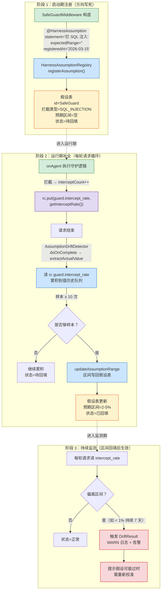
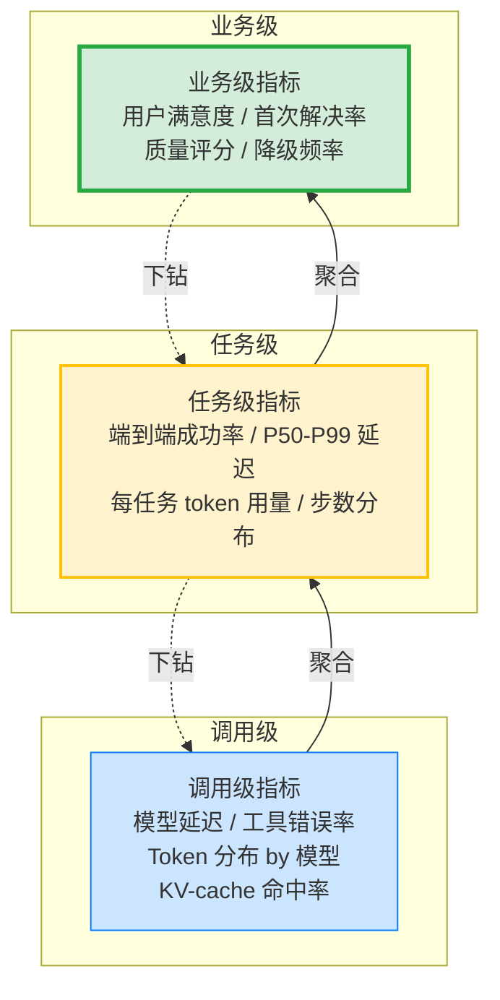
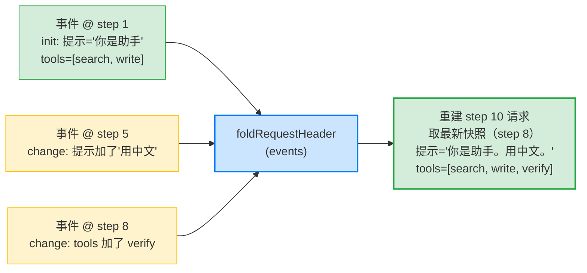
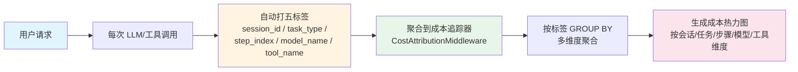
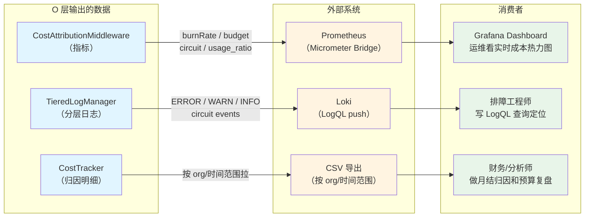
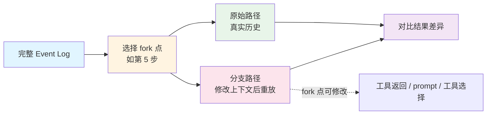
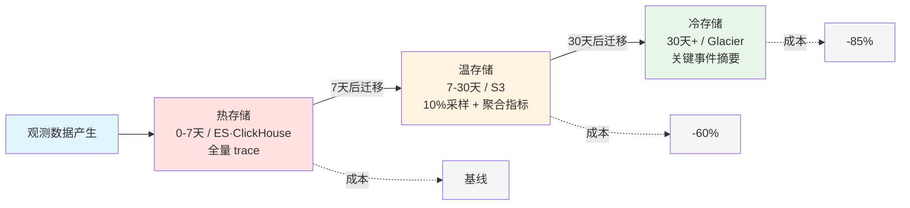

# 第 08 章 O — 可观测性

Agent 工程中，Harness 组件的叠加并不自动带来可靠性提升；沙箱、工具校验、Middleware 各自贡献了多少可靠性？彼此叠加时是否有互相抵消？没有观测数据支撑的优化无法验证各组件的独立贡献，也无法确认整体效果来自哪个具体改进。

本章对应 ETCLOVG 综述论文中的 O (Observability) 层；解决的核心问题是：如何让 Agent 的内部运行状态对外部可见，使故障在发生前被感知、发生后被定位、修复后被验证。前置知识包括 Agent 系统解剖图、七层根本问题定义、工程化 ReAct 五组件和 Agent 状态机（见第 1 章）。五标签成本归因（用户/会话/任务/模型/工具）和全链路事件日志，使得类似循环调用导致的成本异常（案例详见 §8.6 故障复盘）能在第一时间被燃烧率熔断拦截（见 Ch3 §3.1）。

***

## 8.1 为什么观测是核心而非附属

Agent 系统里每加一层守护组件（Middleware、沙箱、评估器、拦截器），都是基于一个假设加的：假设"模型会越界所以要拦"、"Agent 会死循环所以要限步数"。这个假设在上线时成立，但时间一长就可能失效，失效有两个方向。

\*\*防护衰减：\*\*模型升级后不再产生 SQL 注入了，SafeGuardMiddleware 的拦截率从上线的 2-5% 衰减到接近 0，但组件仍在运行、仍占 CPU、仍给每条请求叠加延迟。

\*\*覆盖盲区：\*\*模型行为模式漂移，产生上线时未预设的危险操作类型，现有 Middleware 的规则集未覆盖这一类。两种失效都不会自己报警，系统看起来一切正常。

O 层就是来持续验证这些假设还在不在的机制，没有它，每一层 Middleware 都是一个没人复查的假设。

### KP 8.1.1 "Harness "的工程含义 【构建】

Harness 组件不只执行守护逻辑（拦 SQL、限步数、压上下文），还要把支撑这些动作的假设显式声明出来，让 O 层有基准做对比。下面把这套机制拆成三个角色和三个阶段讲清。

三个角色推进：

**被观测方**（如 SafeGuardMiddleware）：任意一层 Harness 组件都是被观测方（G 层拦 SQL 的、C 层压上下文的、V 层评估输出的都算）。它干两件事：一是照常执行本职逻辑，二是为 O 层做两件额外动作。第一件，声明"我预期拦什么"（假设）；第二件，每轮把"实际拦了多少"（实测值）写进 `RuntimeContext` 交给 O 层。

举例：SafeGuardMiddleware 处理一条用户输入 `"1 OR 1=1 --"`（典型 SQL 注入模式）。它照常执行拦截逻辑，识别到 `OR 1=1` 模式，把这条请求拦下来（本职活）。

同时它做两件额外动作：

1、启动时通过 `@HarnessAssumption` 注解声明"我预期拦的是 SQL 注入类型"（假设，区间留空待回填）；

2、这一轮拦截后把当前拦截率（比如 1/1=100%）写进 `rc.put("guard.intercept_rate", ...)`（实测值）。

O 层的检测器之后会读这个值累积、对比。

**假设注册表**（HarnessAssumptionRegistry）：是 O 层的存储，存所有 Middleware 的假设声明。四类 API 对应日志的读写需求：

| API                         | 动作       | 调用方           | 时机                               |
| --------------------------- | -------- | ------------- | -------------------------------- |
| `registerAssumption()`      | 写（注册）    | Middleware 自身 | 启动期，写方向和注册时间，区间留空                |
| `getAllActiveAssumptions()` | 读（批量取）   | 漂移检测器         | 每轮请求，取所有活跃假设做验证                  |
| `updateAssumptionRange()`   | 写（回填区间）  | 漂移检测器         | 够样本后，把实测区间写回，旧值留 `baselineRange` |
| `recordValidation()`        | 写（记一条验证） | 漂移检测器         | 每轮请求，记一条 actualValue + 是否偏离      |
| `getValidationHistory()`    | 读（查历史）   | 报告/告警模块       | 阶段 3 生成漂移报告时                     |

整个三阶段流转的数据都存在这里，漂移检测器只算和比、不存数据。

**漂移检测器**（AssumptionDriftDetector）：是 O 层的计算。每轮请求结束从 RuntimeContext 读实测值（被观测方写进去的），累积够样本（默认 10 次）就把实测区间算出来回填给注册表；回填后每轮把实测值和声明区间对比，偏离（如拦截率跌破下界持续 7 天）就触发漂移告警。它不存数据，只算和比。

三个阶段按时间推进：

**阶段 1 启动期注册**：Middleware 构造时通过 `@HarnessAssumption` 注解声明方向（拦什么风险）和注册时间，区间留空，不写死。

**阶段 2 运行期补全**：每轮请求里被观测方把实测拦截率写进 rc，检测器读 rc 累积到值历史，够样本（默认 10 次）后把实测区间写回注册表。

**阶段 3 持续监测**：区间回填后成为对比基准，此后每轮实测偏离基准（如拦截率跌破下界持续 7 天）即触发漂移告警。三阶段不是并列，是按时间推进的流转，下图把数据流画出来。



按图里三个角色看代码。第一段是被观测方 SafeGuardMiddleware；它在启动期注册假设（`@HarnessAssumption` 的 `expectedRange = ""` 对应图里"预期区间=空"），在运行期把实测拦截率写进 RuntimeContext（`rc.put("guard.intercept_rate", ...)` 对应图里 R2 节点），供检测器读。

```java
/*
 * 框架：AgentScope 2.x（版本不锁定，跟随最新稳定版）
 * 环境：JDK 21+, Spring Boot 3.5+
 *
 * 使用组件说明：
 * - SafeGuardMiddleware extends AbstractLayerMiddleware（配套仓库教学实现，非框架内置）：
 *   G 层安全守护总入口，三检查点覆盖输入防注入 / 输出过滤 SQL+PII / 工具白名单。
 *   本类是"被观测方"，O 层观测它的假设是否还成立。
 * - HarnessAssumptionRegistry（配套仓库教学实现，非框架内置，O 层假设管理）：存所有
 *   Middleware 的假设声明，提供注册/读取/回填/查历史 API，对应图的 REG 和假设表。
 * - AssumptionDriftDetector（配套仓库教学实现，非框架内置，O 层假设漂移检测）：
 *   每轮请求结束从 rc 读实测值，够样本回填区间，回填后偏离区间告警，对应图的 R4-R7 和 M2-M5。
 * - @HarnessAssumption（自定义注解）：用于标注 Middleware/沙箱/评估器组件的假设声明。
 */
// 阶段 1（启动注册）：@HarnessAssumption 标在类上，声明整个组件的假设
// 注解只声明元数据（方向 + 注册时间 + 待回填区间），不参与运行期执行
// Spring 启动时扫描到类上的注解，调 HarnessAssumptionRegistry.registerAssumption() 存进来
@Component
@HarnessAssumption(
    statement = "G 层总入口：输入防注入 + 输出过滤 SQL/PII + 工具白名单",
    expectedRange = "",
    registeredAt = "2026-03-15"
)
public class SafeGuardMiddleware extends AbstractLayerMiddleware {

    private int interceptCount = 0;
    private int totalCalls = 0;

    public SafeGuardMiddleware() {
        super(Layer.G, "SafeGuard");
    }

    // onAgent（推理前拦截）
    // onAgent 是运行期执行逻辑，每轮请求都走一遍
    // 注解声明的是"SafeGuard 这个组件的假设"，不是"这一次 onAgent 调用的假设"，所以注解标在类上
    @Override
    public Flux<AgentEvent> onAgent(Agent agent, RuntimeContext rc, AgentInput input,
                                    Function<AgentInput, Flux<AgentEvent>> next) {
        totalCalls++;
        return next.apply(input)
            .doOnNext(event -> {
                String content = extractContent(event);
                if (content != null && containsSqlInjection(content)) {
                    interceptCount++;
                    log.warn("[SafeGuard] 检测到 SQL 注入模式，已拦截");
                    rc.put("guard.blocked", true);
                    rc.put("guard.reason", "SQL_INJECTION");
                }
                // 阶段 2 铺路：把实测拦截率写进 rc，检测器 doOnComplete 时读
                rc.put("guard.intercept_rate", getInterceptRate());
            });
    }

    // onActing（工具调用前拦截）
    // 工具白名单检查——工具名从 RuntimeContext 取，不从 ActingInput 取
    @Override
    public Flux<AgentEvent> onActing(Agent agent, RuntimeContext rc, ActingInput input,
                                     Function<ActingInput, Flux<AgentEvent>> next) {
        String toolName = rc.getExtra().getOrDefault("loop.tool.name", "").toString();
        if (!toolName.isBlank() && !TOOL_WHITELIST.contains(toolName)) {
            interceptCount++;
            log.warn("[SafeGuard] 工具白名单拦截：工具 {} 未注册", toolName);
            rc.put("guard.blocked", true);
            rc.put("guard.reason", "TOOL_NOT_IN_WHITELIST");
            return Flux.empty();
        }
        return next.apply(input);
    }

    private static final Set<String> TOOL_WHITELIST = Set.of(
        "search", "calculate", "fetch", "write", "verify");

    private boolean containsSqlInjection(String content) {
        String lower = content.toLowerCase();
        return lower.contains("drop table") || lower.contains("delete from") ||
               lower.contains("insert into") || lower.contains("update set") ||
               (lower.contains("--") && lower.contains(" or "));
    }

    private String extractContent(AgentEvent event) {
        return event != null ? event.toString() : null;
    }

    public double getInterceptRate() {
        return totalCalls > 0 ? (double) interceptCount / totalCalls : 0.0;
    }
}
```

第二段是 O 层的存储：HarnessAssumptionRegistry，承载三阶段流转。三个 Map 是存储结构，六个 API 是对它们的操作，对应关系如下：

| 存储结构                 | 类型                                        | 写入方                                                              | 读取方                                                                |
| -------------------- | ----------------------------------------- | ---------------------------------------------------------------- | ------------------------------------------------------------------ |
| `assumptionRegistry` | `Map<String, Assumption>`                 | 阶段 1 `registerAssumption()` 写入，阶段 2 `updateAssumptionRange()` 更新 | 阶段 2 `getAllActiveAssumptions()` 批量取、`getAssumptionsByType()` 按类型查 |
| `advisorAssumptions` | `Map<String, Set<Assumption>>`            | 阶段 1 `registerAssumption()` 按组件名分组写入                             | `getAssumptionsByAdvisor()` 按组件名查该组件所有假设                           |
| `validationHistory`  | `Map<String, List<AssumptionValidation>>` | 阶段 2 `recordValidation()` 每轮追加一条                                 | 阶段 3 `getValidationHistory()` 查历史生成报告                              |

关键点是 `Assumption` record 用 `range + baselineRange` 双字段：回填时新值写 `range`，原值留 `baselineRange`，这样后续漂移告警能算出"偏离了多远"而不丢历史基准。

```java
/*
 * HarnessAssumptionRegistry：O 层假设注册表（配套仓库教学实现，非框架内置）
 * 代码见 CodePilot 配套仓库：codepilot/ch08-observability/HarnessAssumptionRegistry.java
 *
 * 三个 Map 对应三阶段：
 * - assumptionRegistry：阶段 1 注册时写入，阶段 2 回填时更新，阶段 2 也读它批量取
 * - advisorAssumptions：阶段 1 注册时按组件名分组写入，按组件名查时读
 * - validationHistory：阶段 2 每轮验证追加，阶段 3 生成报告时读
 */
@Component
public class HarnessAssumptionRegistry {

    private final Map<String, Assumption> assumptionRegistry = new ConcurrentHashMap<>();
    private final Map<String, Set<Assumption>> advisorAssumptions = new ConcurrentHashMap<>();
    private final Map<String, List<AssumptionValidation>> validationHistory = new ConcurrentHashMap<>();

    // 阶段 1：注册——方向（type + description）必填，区间（range）可空
    public Assumption registerAssumption(String advisorName, String assumptionId,
                                         String description, 
                                         AssumptionType type,
                                         String range) {
        Assumption assumption = new Assumption(assumptionId, advisorName, description, type,
            range, null, Instant.now(), true);
        assumptionRegistry.put(assumptionId, assumption);
        advisorAssumptions.computeIfAbsent(advisorName, k -> ConcurrentHashMap.newKeySet()).add(assumption);
        return assumption;
    }

    // 阶段 2 读取：Detector 每轮取所有活跃假设做验证
    public List<Assumption> getAllActiveAssumptions() {
        return assumptionRegistry.values().stream().filter(Assumption::active).toList();
    }

    // 按组件名查：取指定 Advisor 的所有假设
    public Set<Assumption> getAssumptionsByAdvisor(String advisorName) {
        return Collections.unmodifiableSet(
            advisorAssumptions.getOrDefault(advisorName, Collections.emptySet()));
    }

    // 按类型查：取指定类型的所有假设
    public List<Assumption> getAssumptionsByType(AssumptionType type) {
        return assumptionRegistry.values().stream()
            .filter(a -> a.type() == type).toList();
    }

    // 阶段 2 回填：样本够后把实测区间写回，同时留 baselineRange 保历史基准
    public void updateAssumptionRange(String assumptionId, String newRange) {
        Assumption a = assumptionRegistry.get(assumptionId);
        if (a == null) return;
        assumptionRegistry.put(assumptionId, new Assumption(
            a.id(), a.advisorName(), a.description(), a.type(),
            newRange, a.range(), a.registeredAt(), a.active()));
    }

    // 阶段 2 记录：每轮验证追加一条，expectedRange 取当前声明（注册时为 null，回填后才有值）
    public void recordValidation(String assumptionId, double actualValue, boolean valid) {
        Assumption a = assumptionRegistry.get(assumptionId);
        if (a == null) return;
        validationHistory.computeIfAbsent(assumptionId,
            k -> Collections.synchronizedList(new ArrayList<>()))
            .add(new AssumptionValidation(assumptionId, actualValue, a.range(), valid, Instant.now()));
    }

    // 阶段 3 报告：取某假设的验证历史
    public List<AssumptionValidation> getValidationHistory(String assumptionId) {
        return validationHistory.getOrDefault(assumptionId, Collections.emptyList());
    }

    // 假设类型——按 Middleware 的守护职责分四类，SafeGuard 注册的是 SECURITY
    public enum AssumptionType { SECURITY, PERFORMANCE, RELIABILITY, COST }

    // range：注册时可空（待回填），baselineRange：回填前的原值，用于对比漂移幅度
    public record Assumption(String id, String advisorName, String description, AssumptionType type,
                             String range, String baselineRange, Instant registeredAt, boolean active) {}
    public record AssumptionValidation(String assumptionId, double actualValue,
                                       String expectedRange, boolean valid, Instant timestamp) {}
}
```

检测器 `AssumptionDriftDetector` 的代码省略，但它的逻辑要讲清。它本身也是个 Middleware（继承 `AbstractLayerMiddleware`，Layer.O），在 `onAgent` 方法里通过 `doOnComplete` 钩子挂在每轮请求结束时执行。阶段 1（启动期注册）由被观测方和注册表完成，检测器不参与，它只在阶段 2 和阶段 3 干活：

**阶段 1（回填前）：每轮记一笔 + 累积样本**

- 取活跃假设：调 `assumptionRegistry.getAllActiveAssumptions()` 拿到所有 `active=true` 的假设（比如 SafeGuard 注册的那条）
- 读实测值：对每个假设，根据它的类型从 `rc.getExtra()` 读对应的 key。SafeGuard 注册的是 SECURITY 类，检测器读 `guard.intercept_rate` 这种 key（真实代码见 [AssumptionDriftDetector.java#L161-202](file:///Users/zxc/Documents/ai/agent-harness/codepilot/ch08-observability/src/main/java/io/etclovg/codepilot/observability/AssumptionDriftDetector.java#L161-L202) 的 `extractActualValue` 方法，按类型 switch 分发到不同 key）
- 记一笔验证：调 `assumptionRegistry.recordValidation(assumptionId, actualValue, valid)` 把这一轮的实测值和是否偏离记进 `validationHistory`
- 累积到自己的值历史队列（保留最近 100 个）
- 够 10 个样本（见 [AssumptionDriftDetector.java#L68](file:///Users/zxc/Documents/ai/agent-harness/codepilot/ch08-observability/src/main/java/io/etclovg/codepilot/observability/AssumptionDriftDetector.java#L68) 的 `gradualDriftMinSamples`）就调 `assumptionRegistry.updateAssumptionRange()` 把实测区间写回声明，阶段 2 结束

**阶段 2（回填后）：每轮对比 + 偏离告警**

- 取活跃假设和读实测值：同阶段 2 的前两步
- 跑漂移检测算法：把实测值和声明区间对比
- 偏离基准就调 `handleDrift()` 发 WARN 日志和告警（真实代码见 [AssumptionDriftDetector.java#L93-128](file:///Users/zxc/Documents/ai/agent-harness/codepilot/ch08-observability/src/main/java/io/etclovg/codepilot/observability/AssumptionDriftDetector.java#L93-L128) 的 `onAgent` 方法）

三个角色通过 `RuntimeContext` 这个共享黑板串起来：被观测方（SafeGuard）在 `onAgent` 里把 `guard.intercept_rate` 写进 rc，检测器在 `doOnComplete` 钩子里从 rc 读同一个 key，再调注册表的 API 存和更新。被观测方写、检测器读、注册表存，三方各管一件，rc 是它们的中转站。

O 层将每一个 Harness 假设从代码注释中拉到运维仪表盘上，使假设像代码一样具有可测试、可版本化、可废弃的生命周期。

### KP 8.1.2 可观测性从"附加功能"到"核心层"的范式转变 【构建】

多数 Agent 系统把观测当作事后加的东西：开发阶段先跑通功能，上线前才匆匆加上几个 log 语句。结果是系统出问题时没有数据回溯，定位故障全靠猜。VentureBeat 2026 年的报告显示只有 21% 的组织对 Agent 的运行时行为有可见性，88% 的组织在过去 12 个月中发生过 Agent 安全事件[^1]。这些代码在测试阶段"看起来正确"，在生产中却暴露出静默故障。

根源很明确：Agent 运行中产生的大量中间状态，模型的推理轨迹（Thought）、工具调用的完整上下文、Middleware 的拦截与否决策、评估判断的中间分数；如果不实时采集就永远丢掉了。模型 API 不会帮你存推理日志，它只返回最终的响应文本。Agent 的思考过程是一个瞬时状态，必须在它发生的时刻记录。

传统 APM 面对 Agent 有四种特有的静默故障[^3]：

- 幻觉漂移：模型编造事实，输出看似合理，用户投诉前无信号
- 工具调用漂移：选错工具或参数错，任务失败才发现
- 成本尖峰：prompt 变更或检索回归导致 token 翻 10 倍，月度账单前不可见
- 延迟异常：P99 被重试和推理循环支配，P50 仪表盘掩盖了 P99.5 长等待（示意值）

解决方案是将观测作为 L 层编排的一部分嵌入，Agent 的第一步就启动 trace，最后一步才关闭它。三个原则：

- 观测内建于编排：在 L 层的 Pipeline/ReAct 启动时创建 span（分布式追踪中的基本操作单元，代表一次有起止时间的操作），每个步骤的子 Agent 继承该 span，所有步骤完成后 span 关闭
- 关键点全覆盖：P0 观测点（模型调用、工具调用、请求入站/离站）必须 100% 采集，这是故障回溯的最低数据量
- 观测代码旁路化：观测失败不能导致业务失败，所有观测代码包在 try-catch 中，异常只记自身日志并吞掉

分布式追踪的起点是 Google Dapper 论文（2010）的核心洞察；基础设施指标（CPU/内存）无法解释用户感知的延迟，需要 traceId + spanId + parentSpanId 的三元组来重构调用链的因果树。Agent 的四类静默故障同样是传统 APM 的观测盲区：它们不触发任何阈值告警，但用户已感知到质量下降。观测必须从基础设施层上移到应用语义层。

在业内实践中，AgentScope 提供了 OpenTelemetry（CNCF 旗下的可观测性标准框架，统一采集 traces、metrics、logs）+ Higress 的 A/B 流量对比集成，可实现企业级全链路追踪与新旧版本行为对比，但配置复杂度较高。Hermes 采用 SQLite 单机会话存储，适合单机 Agent 调试，但不支持分布式。Arize Phoenix 提供专为 LLM Agent 设计的轨迹可视化，开源且交互性强。

***

## 8.2 生命周期钩子：注入点全景与插桩

Agent 的执行链路完全不是传统微服务的 RPC 链形态，它是五个环节交错的循环序列：

- 模型推理（决定下一步做什么）
- 工具调用（执行决定的动作）
- 结果注入（把工具返回塞回上下文）
- 再推理（基于新上下文决定下一步）
- 再调工具（可能换一个工具或换参数）

每一步都在改变后续方向。如果观测注入点只埋在服务边界，看到的是一个黑箱的输入和输出，中间所有决策全部丢失。必须在生命周期的关键节点插入追踪逻辑，确保每一步推理、每一次工具选择都被记录，让 Agent 的思考过程成为可观测资产而非瞬时消失的黑箱状态。

### KP 8.2.1 Agent 生命周期的关键注入点：三级分级 【诊断】

Agent 流程中有 10 多个关键节点可以插桩——请求入站、任务规划、模型推理、工具选择、工具调用、工具返回、评估判断、响应离站、循环转折……如果全量采集每个节点的完整数据，一个中等复杂度的 Agent 任务可能产生数百条 span 和数 MB 日志，在工程上不可行——存储和网络开销过高。

问题在于：哪些点是必须观测的？哪些是可选的？如何在信息充分和性能开销之间找到平衡？观测开销 = 数据采集开销（序列化 + 传输）+ 存储开销（磁盘/内存）+ 查询开销（检索）。在 Agent 场景中，每个 span 的采集开销约在毫秒级（取决于 SDK 实现和采样配置，示意值），如果每个 Agent 任务有 50 个步骤、10 个观测点/步骤 = 500 个 span，总采集开销可达数百毫秒。对于一个数秒级别的任务来说，这是不可忽视的性能损耗。不是每个点都需要观测——需要按重要性分级。

解决方案是三级观测点分级（P0/P1/P2）：

| 级别     | 含义   | 观测点                                 | 采集率      | 示例                             |
| ------ | ---- | ----------------------------------- | -------- | ------------------------------ |
| **P0** | 必须采集 | 请求入站、模型调用前后、工具调用前后、响应离站             | 100%     | 每次 LLM 调用的 token 数、延迟、错误码      |
| **P1** | 建议采集 | 上下文压缩触发、记忆检索、评估触发、状态变迁              | 100%     | 压缩前后的 context token 数、检索命中的记忆数 |
| **P2** | 按需采集 | 中间推理步骤详情、KV-cache 命中详情、每步完整上下文 dump | 采样 5-10% | 完整推理链路的文本内容（含脱敏）               |

AgentScope 内置的 Tracer（AgentScope 的追踪采集门面，统一对接 Prometheus、OTel 等后端）集成自动覆盖 P0 观测点（模型调用、工具调用）。P1 和 P2 需要自定义 Middleware（通过继承 MiddlewareBase 基类，代码见 CodePilot 配套仓库）扩展。

### KP 8.2.2 Middleware 链的观测注入模式 【诊断】

AgentScope 的 Middleware 链天然适合做观测注入——每个 Middleware 的 `onAgent()` 方法是天然的 hook 点。但观测代码如果抛异常（如网络超时导致遥测数据发送失败），不应导致业务请求失败。

核心问题是如何让观测"旁路化"——不影响业务但采集完整。观测是辅助，业务是主线。一条 Agent 请求经过 5 个 Middleware——如果第 3 个是观测 Middleware，而它因为遥测后端不可用抛了异常，整个 Agent 请求就会失败。观测 Middleware 必须设计为"失败了不影响业务"的旁路模式。这种设计借鉴了熔断器（Bulkhead）模式——辅助电路失败不应导致主电路中断。

实现需要遵循三条原则：所有观测代码包裹 try-catch，异常只记自身 WARN 日志，不传递到主流程；观测 Middleware 放最外层——在 Middleware 链的最外端（先于其他 Middleware 的 onAgent，后于其他 Middleware 的结果处理），确保覆盖所有内层 Middleware 的执行；数据异步批量发送——观测数据不阻塞主线程，写入内存缓冲区，后台线程批量发送。AgentScope Tracer 的 BatchSpanProcessor 提供此能力。

```java
/*
 * TracerMiddleware：追踪器中间件，为每次调用分配追踪 ID
 * 代码见 CodePilot 配套仓库：codepilot/ch08-observability/
 */
@Component
public class TracerMiddleware extends AbstractLayerMiddleware {

    public TracerMiddleware() {
        super(Layer.O, "Tracer");
    }

    @Override
    public Flux<AgentEvent> onAgent(Agent agent, RuntimeContext rc, AgentInput input,
                                    Function<AgentInput, Flux<AgentEvent>> next) {
        String traceId = "trace-" + java.util.UUID.randomUUID().toString().substring(0, 8);
        log.info("[Tracer] 开始追踪: traceId={}", traceId);

        rc.put("trace.id", traceId);
        // 将 traceId 注入 SLF4J MDC，使所有日志自动携带 trace 上下文
        MDC.put("trace.id", traceId);

        return next.apply(input)
            .doOnComplete(signalType -> MDC.remove("trace.id"))
            .doOnError(err -> MDC.remove("trace.id"));
    }
}
```

**跨调用 traceId 传播**：当 Agent 调用子 Agent 或发起外部 HTTP/gRPC 调用时，traceId 需要沿调用链传递。以下是子 Agent 继承父 traceId 的实现：

```java
/*
 * 跨调用 traceId 传播器——确保 trace 链在跨 Agent 调用和跨线程场景下不断裂
 * 代码见 CodePilot 配套仓库：codepilot/ch08-observability/
 */
@Component
public class TracePropagator {

    // Agent 内部传递：将当前 traceId 注入子 Agent 的上下文 Map
    // 子 Agent 在启动时从上下文 Map 中读取 traceId 并注入 RuntimeContext
    public Map<String, Object> prepareSubAgentContext(RuntimeContext parentRc, Agent subAgent) {
        String traceId = (String) parentRc.get("trace.id");
        Map<String, Object> subContext = new HashMap<>();
        if (traceId != null) {
            subContext.put("trace.id", traceId);
            subContext.put("trace.parent", subAgent.getClass().getSimpleName());
        }
        return subContext;
    }

    // 将上下文 Map 中的 trace 信息注入 RuntimeContext
    // 子 Agent 在 onAgent 方法开始时调用此方法
    public void injectTraceFromMap(RuntimeContext rc, Map<String, Object> contextMap) {
        if (contextMap.containsKey("trace.id")) {
            String traceId = (String) contextMap.get("trace.id");
            rc.put("trace.id", traceId);
            MDC.put("trace.id", traceId);
        }
        if (contextMap.containsKey("trace.parent")) {
            rc.put("trace.parent", contextMap.get("trace.parent"));
        }
    }

    // 外部 HTTP 调用：生成 W3C Trace Context 标准的 traceparent header 值
    // 使用时通过 headers.set("traceparent", generateTraceParent(traceId)) 注入
    public String generateTraceParent(String traceId) {
        String spanId = UUID.randomUUID().toString().substring(0, 16);
        return String.format("00-%s-%s-01", traceId, spanId);
    }

    // 异步回调：确保回调线程能恢复 traceId
    public Runnable wrapWithContext(String traceId, Runnable task) {
        return () -> {
            String originalTraceId = MDC.get("trace.id");
            try {
                MDC.put("trace.id", traceId);
                task.run();
            } finally {
                if (originalTraceId != null) {
                    MDC.put("trace.id", originalTraceId);
                } else {
                    MDC.remove("trace.id");
                }
            }
        };
    }
}
```

```java
/*
 * 框架：AgentScope 2.x + Spring Boot 3.5
 *
 * 使用组件说明：
 * - ObservabilityMiddleware（extends AbstractLayerMiddleware，代码见 CodePilot 配套仓库）：
 *   完整实现"旁路观测"模式——try-catch 包裹所有观测代码，异常只记自身 WARN，不传递主流程。
 *   通过 getOrder() 设为最高优先级，确保放在 Middleware 链最外层。
 * - MetricBuffer（内存缓冲队列）：观测数据先写入内存缓冲区，后台单线程批量发送，
 *   避免观测阻塞业务主线程。缓冲区满时丢弃最旧数据（保留最新观测）。
 * - TracerRegistry：AgentScope 内置，创建和管理 Observation。OtelTracingMiddleware 自动覆盖 P0。
 */
@Component
public class ObservabilityMiddleware extends AbstractLayerMiddleware {

    private final CostAttributionMiddleware costService;
    private final EventLogRecorder eventLog;
    private final BlockingQueue<ObservationRecord> metricBuffer;
    private final ScheduledExecutorService flushExecutor;

    public ObservabilityMiddleware(CostAttributionMiddleware costService,
                                   EventLogRecorder eventLog) {
        super(Layer.O, "Observability");
        this.costService = costService;
        this.eventLog = eventLog;
        this.metricBuffer = new ArrayBlockingQueue<>(10000);
        this.flushExecutor = Executors.newSingleThreadScheduledExecutor(r -> {
            Thread t = new Thread(r, "observability-flush");
            t.setDaemon(true);
            return t;
        });
        this.flushExecutor.scheduleAtFixedRate(this::flushMetrics, 5, 5, TimeUnit.SECONDS);
    }

    @Override
    public Flux<AgentEvent> onAgent(Agent agent, RuntimeContext rc, AgentInput input,
                                    Function<AgentInput, Flux<AgentEvent>> next) {
        String traceId = (String) rc.get("trace.id");
        long start = System.currentTimeMillis();
        String taskId = rc.get("task.id") != null ? (String) rc.get("task.id") : "unknown";
        String agentName = agent.getClass().getSimpleName();

        // 旁路保护：整个观测逻辑包裹在 try-catch 中
        try {
            log.info("[Observability] 开始: traceId={}, taskId={}", traceId, taskId);
        } catch (Exception e) {
            // 观测异常只记自身日志，不影响业务
            log.warn("[Observability] 初始化失败: {}", e.getMessage());
        }

        return next.apply(input)
            .doOnComplete(() -> {
                try {
                    long elapsed = System.currentTimeMillis() - start;
                    // 异步写入缓冲区，不阻塞业务
                    metricBuffer.offer(new ObservationRecord(
                        traceId, taskId, agentName, elapsed, System.currentTimeMillis()
                    ));
                    log.info("[Observability] 完成: traceId={}, elapsed={}ms", traceId, elapsed);
                } catch (Exception e) {
                    log.warn("[Observability] 记录指标失败: {}", e.getMessage());
                }
            })
            .doOnError(err -> {
                try {
                    long elapsed = System.currentTimeMillis() - start;
                    metricBuffer.offer(new ObservationRecord(
                        traceId, taskId, agentName, elapsed, System.currentTimeMillis(), err.getMessage()
                    ));
                } catch (Exception e) {
                    log.warn("[Observability] 错误记录失败: {}", e.getMessage());
                }
            });
    }

    private void flushMetrics() {
        List<ObservationRecord> batch = new ArrayList<>();
        metricBuffer.drainTo(batch, 500);
        if (!batch.isEmpty()) {
            try {
                // 批量写入事件日志 + 成本追踪
                for (ObservationRecord rec : batch) {
                    eventLog.recordEvent(rec.traceId(), toAgentEvent(rec));
                }
                log.debug("[Observability] 批量刷新 {} 条指标", batch.size());
            } catch (Exception e) {
                log.warn("[Observability] 批量刷新失败: {}", e.getMessage());
            }
        }
    }

    private AgentEvent toAgentEvent(ObservationRecord rec) {
        return new AgentEvent() {
            @Override public AgentEventType getType() { return AgentEventType.CUSTOM; }
            @Override public String toString() {
                return String.format("task=%s, agent=%s, elapsed=%dms",
                    rec.taskId(), rec.agentName(), rec.elapsedMs());
            }
        };
    }

    public record ObservationRecord(
        String traceId, String taskId, String agentName,
        long elapsedMs, long timestamp, String errorMessage
    ) {
        public ObservationRecord(String traceId, String taskId, String agentName,
                                 long elapsedMs, long timestamp) {
            this(traceId, taskId, agentName, elapsedMs, timestamp, null);
        }
    }
}
```

**PII 脱敏：观测数据中的隐私保护**：观测日志天然包含用户输入、模型输出、工具参数（如"给用户 <zhangsan@company.com> 发送邮件"）。未经脱敏的观测数据直接存入日志系统是合规红线。以下 `PiiMaskingFilter` 在日志写入前自动脱敏：

```java
/*
 * PII 脱敏过滤器——观测数据写入前自动脱敏
 * 支持：手机号、邮箱、身份证号、银行卡号、密钥/Token
 */
@Component
public class PiiMaskingFilter {

    private static final Pattern PHONE = Pattern.compile("1[3-9]\\d{9}");
    private static final Pattern EMAIL = Pattern.compile("[\\w.+-]+@[\\w-]+\\.[\\w.-]+");
    private static final Pattern ID_CARD = Pattern.compile("\\d{17}[\\dXx]");
    private static final Pattern CARD_NO = Pattern.compile("\\d{16,19}");
    private static final Pattern API_KEY = Pattern.compile(
        "(api[_-]?key|secret|token|password)\\s*[:=]\\s*[\\w-]{10,}", Pattern.CASE_INSENSITIVE);

    public String mask(String input) {
        if (input == null) return null;
        String masked = PHONE.matcher(input).replaceAll("1xx****xxxx");
        masked = EMAIL.matcher(masked).replaceAll(m -> {
            String[] parts = m.group().split("@");
            return parts[0].substring(0, Math.min(3, parts[0].length())) + "***@" + parts[1];
        });
        masked = ID_CARD.matcher(masked).replaceAll("xxxxxxxxxxxxxxxx");
        masked = CARD_NO.matcher(masked).replaceAll("****-****-****-****");
        masked = API_KEY.matcher(masked).replaceAll("$1: ****");
        return masked;
    }

    // 批量脱敏：对观测记录的 content 和 metadata 同时脱敏
    public EventLogRecorder.EventRecord maskRecord(EventLogRecorder.EventRecord record) {
        return new EventLogRecorder.EventRecord(
            record.eventId(),
            record.eventType(),
            record.timestamp(),
            mask(record.content()),
            record.metadata().entrySet().stream()
                .collect(Collectors.toMap(Map.Entry::getKey, e -> mask(e.getValue())))
        );
    }
}
```

***

## 8.3 链路追踪、指标、日志：Agent 版三件套

平均值会骗人。100 个任务里 99 个 0.5 秒、1 个 55 秒，平均算下来 1.2 秒，看起来正常。但那个 55 秒是 Agent 在第 12 步陷入"清理→失败→重试"死循环跑出来的，P50 仪表盘只看中位数，完全看不到这个长尾。

要看清 Agent 的真实状况，得回答两个不同粒度的问题：

- 整体好不好：任务级指标，包括成功率、成本、步数分布
- 哪里不好：调用级指标，包括单次延迟、token 消耗、工具选择

### KP 8.3.1 Agent 特有的追踪需求：推理轨迹可视化 【构建】

传统微服务的链路追踪是线性的：服务 A 调 B，B 调 C，一条 span 链到底。每个 span 代表一次 RPC 调用，有进有出有时间戳，OpenTelemetry 原生就是为这种场景设计的。

Agent 的执行轨迹不是线性的。一轮 ReAct 循环里有五个动作：思考（模型推理决定下一步做什么）、选工具、调用工具、接收结果、把结果塞回上下文（可能触发压缩），然后回到思考。下一轮可能换一个工具，也可能因为上一步失败而回退重试。整条轨迹是有分支、有回退、有循环的有向图，不是一条直线。

问题出在：OpenTelemetry 标准的 span 类型（HTTP、gRPC、DB 查询）面向传统微服务，表达不了 Agent 执行链里的动作。思考（模型推理）不是一次外部调用，评估（V 层打分）也不是一次 RPC，但它们都是 Agent 执行链中真实发生、需要被追踪的环节。标准 OTel 把它们当成普通 span 记录，语义对不上，事后回看 trace 时分不清哪一步是模型在想、哪一步是工具在跑。

所以需要扩展 OTel 的 GenAI 语义约定（2026 年仍为 experimental，但已被 Datadog、Red Hat、Arize Phoenix 等广泛采用），给 Agent 执行链的每种动作各定义一种专属 span 类型。这套 span 类型本质是 **Agent 执行链动作的追踪分类标准**：告诉可观测性平台"这条 span 记的是模型动作（思考、评估）还是非模型动作（工具调用、上下文整理）"，让追踪数据有统一语义。具体分五种：

| Span 类型              | 语义                | 关键属性                                                                          |
| -------------------- | ----------------- | ----------------------------------------------------------------------------- |
| `agent.reason`       | 模型推理步骤（Thought）   | `agent.thought.text`（脱敏）、`agent.step_index`                                   |
| `agent.tool.call`    | 工具调用              | `tool.name`、`tool.arguments`（脱敏）、`tool.attempt`                               |
| `agent.tool.result`  | 工具返回              | `tool.result.status`、`tool.result.truncated`、`tool.duration_ms`               |
| `agent.memory.write` | 上下文整理（把工具返回塞回上下文） | `memory.operation`（add/update/compact）、`memory.size_delta`、`memory.truncated` |
| `agent.evaluate`     | V 层评估             | `eval.score`、`eval.pass`、`eval.criteria`                                      |

`agent.memory.write` 对应 ReAct 循环里"接收工具返回 → 塞回上下文"这一步。它看起来不起眼，但这一步改变下一步推理的输入：工具返回了 5000 字的结果，塞进上下文后可能触发压缩（C 层 `ContextCompactionMiddleware`），压缩后上下文变了，下一步 `agent.reason` 的推理依据就变了。不追踪这一步，事后看 trace 会发现"同样的工具调用，下一轮推理结果不一样"，但找不到中间发生了什么。OTel 官方的 Agent Telemetry 语义约定提案（OTEP 4959，2026-03-17 提议，见 [opentelemetry-specification#4959](https://github.com/open-telemetry/opentelemetry-specification/blob/5bf9b784197293eea22c89c9703ae6c13d0b5035/oteps/4959-agent-telemetry-semantic-conventions.md)）已把 `memory.write` 列为 21 种标准 span kind 之一。

用这套 span 类型记录后，整个 Agent 会话在 trace 视图（如 Jaeger、Arize Phoenix）里长成一棵缩进树。假设 Agent 跑了一个"查天气然后给建议"的任务，中间工具失败重试了一次，trace 视图长这样：

```
agent.request（整个会话，根 span）
├── agent.reason（第 1 轮：模型决定调天气工具）
├── agent.tool.call（调天气 API，第 1 次尝试）
├── agent.tool.result（工具返回失败，超时）
├── agent.tool.call（重试，第 2 次尝试）← 回退重试：同一层多个兄弟 span
├── agent.tool.result（工具返回成功，25°C）
├── agent.memory.write（把 25°C 塞回上下文）
├── agent.reason（第 2 轮：基于 25°C 决定给穿衣建议）
└── agent.evaluate（V 层评估：建议质量 0.8 分）
```

几个关键现象：

- **嵌套关系**：`agent.request` 是根（整个会话），下面的子 span 按 `agent.reason` → `agent.tool.call` → `agent.tool.result` → `agent.memory.write` → `agent.reason` 循环往下排。子 span 的"父"是谁，靠 `makeCurrent()` 在 try-with-Scope 期间自动确定（见前面代码块的关键点说明）。
- **回退和重试**：上例里 `agent.tool.call` 出现了两次，是同一层的兄弟 span（都挂在 `agent.request` 下）。第一次失败、第二次成功，这就是回退重试在 trace 里的样子，不是把第一次删掉，而是并排记两条，事后能看到"试了两次"。
- **分支**：如果 `agent.reason` 模型推理出两个候选工具要并行试，`agent.reason` 这个 span 下面会挂两个 `agent.tool.call` 子 span，这就是分支。
- **`agent.memory.write`** **的位置**：夹在 `agent.tool.result`（工具返回）和下一轮 `agent.reason`（模型再推理）之间，记录"工具返回的结果怎么塞进上下文的、有没有触发压缩"。

构建观测树的实战分四步：拿 Tracer、建根 span、循环里建子 span、靠 `makeCurrent()` 自动形成嵌套。下面用一棵完整的"查天气给建议"观测树做例子，覆盖根 span + 一轮 ReAct 五种子 span（AgentScope 框架内置 OTel 依赖，非配套仓库教学实现）：

```java
import io.opentelemetry.api.GlobalOpenTelemetry;
import io.opentelemetry.api.trace.Span;
import io.opentelemetry.api.trace.Tracer;
import io.opentelemetry.context.Scope;

// 第一步：拿全局 Tracer。从 GlobalOpenTelemetry 取，不虚构 TracerRegistry。
// 整个会话只用一个 Tracer，建 span 都靠它。
Tracer tracer = GlobalOpenTelemetry.getTracer("io.etclovg.codepilot.observability");

// 第二步：建根 span（agent.request）。整个会话的根，try-with-Scope 期间
// 所有子 span 都自动认它做父。会话跑完调 end() 关闭。
Span rootSpan = tracer.spanBuilder("agent.request").startSpan();
try (Scope rootScope = rootSpan.makeCurrent()) {
    rootSpan.setAttribute("agent.task_id", taskId);
    rootSpan.setAttribute("agent.user_query", maskPii(userQuery)); // 脱敏

    // 第三步：ReAct 循环里建子 span。每轮建五种，按 reason → tool.call → tool.result → memory.write 顺序。
    // 每个子 span 也用 makeCurrent() 压栈，期间再建的子 span 自动嵌套。
    while (!taskDone) {
        // 3.1 agent.reason：模型推理这一步
        Span reasonSpan = tracer.spanBuilder("agent.reason").startSpan();
        try (Scope rs = reasonSpan.makeCurrent()) {
            reasonSpan.setAttribute("agent.step_index", stepIndex);
            String thought = callModel(context); // 执行模型推理
            reasonSpan.setAttribute("agent.thought.text", maskPii(thought)); // 脱敏

            // 3.2 agent.tool.call：工具调用这一步。工具名从 RuntimeContext 取，不从 ActingInput 取。
            String toolName = rc.getExtra().getOrDefault("loop.tool.name", "unknown").toString();
            Span toolCallSpan = tracer.spanBuilder("agent.tool.call").startSpan();
            try (Scope ts = toolCallSpan.makeCurrent()) {
                toolCallSpan.setAttribute("tool.name", toolName);
                toolCallSpan.setAttribute("tool.arguments", maskPii(arguments)); // 脱敏
                toolCallSpan.setAttribute("tool.attempt", attempt);
                String toolResult = invokeTool(toolName, arguments); // 执行工具调用

                // 3.3 agent.tool.result：工具返回这一步。建在 tool.call 的 Scope 内，自动成为它的子节点。
                Span toolResultSpan = tracer.spanBuilder("agent.tool.result").startSpan();
                try (Scope trs = toolResultSpan.makeCurrent()) {
                    toolResultSpan.setAttribute("tool.result.status", "SUCCESS");
                    toolResultSpan.setAttribute("tool.result.truncated", toolResult.length() > 1000);
                    toolResultSpan.setAttribute("tool.duration_ms", elapsedMs);
                    // 工具返回结果写入 toolResultSpan（脱敏后存）

                    // 3.4 agent.memory.write：上下文整理这一步。夹在 tool.result 和下一轮 reason 之间。
                    Span memorySpan = tracer.spanBuilder("agent.memory.write").startSpan();
                    try (Scope ms = memorySpan.makeCurrent()) {
                        memorySpan.setAttribute("memory.operation", "add"); // add/update/compact
                        memorySpan.setAttribute("memory.size_delta", toolResult.length());
                        memorySpan.setAttribute("memory.truncated", contextCompactionTriggered);
                        // 把工具返回塞回上下文，可能触发 C 层压缩
                        context = appendToContext(context, toolResult);
                    } finally {
                        memorySpan.end();
                    }
                } finally {
                    toolResultSpan.end();
                }
            } finally {
                toolCallSpan.end();
            }
            stepIndex++;
        } finally {
            reasonSpan.end();
        }
    }

    // 第四步（可选）：V 层评估，整轮跑完后建，挂在 rootSpan 下
    Span evalSpan = tracer.spanBuilder("agent.evaluate").startSpan();
    try (Scope es = evalSpan.makeCurrent()) {
        evalSpan.setAttribute("eval.score", 0.8);
        evalSpan.setAttribute("eval.pass", true);
        evalSpan.setAttribute("eval.criteria", "relevance,accuracy");
    } finally {
        evalSpan.end();
    }
} finally {
    rootSpan.end(); // 根 span 最后关，整棵树落盘
}
```

构建观测树的关键机制是 **`makeCurrent()`** **的栈式压栈**。每调一次 `makeCurrent()`，当前 span 压进线程上下文的栈顶；try-with-Scope 结束时弹栈，恢复上一个 span 为当前。期间用 `tracer.spanBuilder(...).startSpan()` 建的任何新 span，parentSpanId 自动取栈顶那个 span，嵌套关系就这样形成：

- `rootSpan.makeCurrent()` 期间建的 `reasonSpan`，parent 是 rootSpan
- `reasonSpan.makeCurrent()` 期间建的 `toolCallSpan`，parent 是 reasonSpan
- `toolCallSpan.makeCurrent()` 期间建的 `toolResultSpan`，parent 是 toolCallSpan
- `toolResultSpan.makeCurrent()` 期间建的 `memorySpan`，parent 是 toolResultSpan

只要按 ReAct 的执行顺序嵌套 `makeCurrent()`，嵌套树自动长对，不用手动指定 parentSpanId。每个 span 建完必须调 `end()`，否则这条记录不会落盘，trace 视图里看不到。`setAttribute()` 写关键属性（步骤号、工具名、脱敏后的推理文本、token 数等），属性越全事后诊断越准。工具名从 `rc.getExtra().getOrDefault("loop.tool.name", "unknown")` 取，与 KP 8.2 的插桩点一致。

> **AgentScope 生产级实现映射**：AgentScope 通过 `OtelTracingMiddleware` 自动在每个 ReAct 循环的关键节点注入 span 建立代码，工程师只需在配置里开启追踪并指定服务名，框架自动建上述观测树，不用手写。上面的手动写法适用于自定义 Pipeline 步骤或 V 层评估器等框架未覆盖的节点。该方案支持与 Higress 网关联动进行 A/B 流量对比，通过对比新旧版本的 trace 差异评估 Agent 行为变化（`agentscope-harness/.../middleware/OtelTracingMiddleware.java`）。

观测树建好后，每个 span 记的是调用级原始数据（一次模型推理、一次工具调用）。但光看调用级会被平均值骗人（§8.3 开头讲过这个例子），要往上聚合出任务级和业务级才有完整图景。KP 8.3.2 展开讲三层维度怎么算、谁来看。

### KP 8.3.2 三层指标体系：业务级、任务级、调用级 【构建】

一个 Agent 请求可能产生 20-50 次模型调用和工具调用。如果用"调用级"指标来看，平均响应时间 200ms 看起来没问题。但用户实际感受到的是"任务级"延迟；从提交问题到得到答案的总时间，可能是 15-30 秒。这两层指标服务于不同的角色和不同的诊断目的[^5]。

不同角色关注不同层级：SRE/运维关注任务级——"用户觉得这个 Agent 快还是慢？成功率多少？"；Agent 开发者关注调用级——"第 3 步的工具调用为什么超时了？哪个模型调用的 token 消耗最大？"；产品经理关注业务级——"客服 Agent 的一键解决率是多少？用户满意度趋势如何？"

解决方案是三层指标设计。每个维度的指标不是凭空给的，上层维度由下层维度聚合算出：业务级指标无法从单次任务直接测得，要从任务级聚合；任务级指标无法从单次调用测得，要从调用级聚合。下表把三层的核心指标、告警阈值、聚合来源和方式列在一起：

| 维度  | 关注者    | 核心指标                                         | 告警阈值示例            | 聚合来源           | 聚合方式（含举例）                                          |
| --- | ------ | -------------------------------------------- | ----------------- | -------------- | -------------------------------------------------- |
| 调用级 | 开发者    | 模型调用延迟、工具调用错误率、token 分布 by 模型、KV-cache 命中率   | 工具错误率 > 1-3%      | 单次模型/工具调用的原始记录 | 直接采集，不聚合（一次模型调用耗时 200ms → 模型延迟 200ms）              |
| 任务级 | SRE/运维 | 端到端成功率、P50/P95/P99 延迟、每任务 token 用量、每任务工具调用次数 | 成功率 24h 下降 > 2-5% | 调用级指标          | 同一 traceId 下所有调用汇总（30 次调用 token 相加 → 每任务 token 用量） |
| 业务级 | 产品     | 任务完成质量评分、用户点赞/踩比例、首答解决率、降级/回退频率              | 质量评分连续下降 > 0.2    | 任务级指标          | 时间窗口内统计（1000 个任务 950 个点赞 → 首次解决率 95%）              |

聚合方向是自下而上：调用级是最底层的原始记录（单次调用的延迟、token、错误），任务级把同一 traceId 下的所有调用级记录汇总成一次任务的端到端表现，业务级再把时间窗口内的所有任务级记录统计成业务整体表现。诊断方向反过来：业务指标坏了 → 下钻到哪个任务 → 再下钻到哪次调用，对应下图里的"聚合 → 下钻"双向箭头。



DoorDash 是量化观测回报的典型案例：通过 Resolve AI 的多 Agent 观测系统，根因定位时间降低了 87%（注：此为厂商发布的数据，未经过第三方独立验证，实际提升幅度可能因场景而异）；同时，Deductive AI 的调试自动化为 DoorDash 广告平台每年节省约 1,000 工程小时（注：此为基于厂商数据的二手报道，实际节省幅度受广告平台业务特征影响）[^6]。

### KP 8.3.3 日志设计：结构化与非结构化信息的平衡 【构建】

Agent 的日志容易变成两万行的文本 dump：模型的推理输出、工具返回的完整 JSON、数千字的上下文摘要。运维看一眼就晕，机器解析也困难。但过度结构化又会丢失关键上下文，把推理文本拆成几十个 JSON 字段，人类无法直观理解 Agent 的思路。

问题在于日志要服务两类截然不同的消费者，需求相反：

- 机器（日志查询系统、告警引擎）要结构化字段（timestamp、error\_code、tool\_name）做过滤和聚合
- 人（开发者排障）要可读的文本描述，比如"Agent 在第 5 步选择了 searchFiles 工具来定位 ApiConfig.java，因为用户提到了 API 配置"

单层日志同时满足两方不可能：纯结构化对人不可读，纯文本对机器不可查。

#### 存储结构：双层日志

把日志拆两层存：结构化元数据给机器查，非结构化描述给人看，两层用同一个 traceId 串起来。

以一次 Agent 执行"查 ApiConfig.java 然后改配置"为例，日志在存储层长这样：

```
# 结构化层（写入 Elasticsearch，按 trace_id 建索引）
{
  "trace_id": "trace-abc-001",
  "session_id": "sess-xyz",
  "step": 5,
  "tool_name": "searchFiles",
  "duration_ms": 120,
  "token_count": {"input": 850, "output": 200},
  "error_code": null,
  "timestamp": "2026-08-20T14:30:00Z"
}

# 非结构化层（写入 Loki/对象存储，按 trace_id 关联结构化层）
[2026-08-20T14:30:00Z] [trace-abc-001] [step 5]
Agent 在第 5 步选择了 searchFiles 工具来定位 ApiConfig.java，
因为用户提到了 API 配置。工具返回 3 个匹配文件，耗时 120ms。
下一步将读取第一个匹配文件的内容。
```

两层日志通过 `trace_id` 关联。查排障时先在结构化层按 `tool_name = searchFiles AND duration_ms > 100` 过滤定位到哪条 trace 有问题，拿到 `trace_id` 后去非结构化层拉同 `trace_id` 的人可读描述，看 Agent 当时为什么这么决策。

日志级别约定：关键决策和错误 = INFO 以上（必须保留），中间推理详情 = DEBUG（按需开启）。一个易犯的错误是把中间推理全部打成 INFO，日积月累几 TB，真正重要的 ERROR 被淹没。

#### 可重建性不变量：Model-visible ⟺ logged

双层日志解决了"怎么记"，但还有更底层的原则要明确；**凡进入模型请求的内容，必须能从会话日志中精确重建**。这不只是"记了就行"，要求日志能作为模型请求的完整投影：给定日志 + 代码，可以重建每一次发给 LLM 的确切输入。

deepseek-harness（DSH）[^8] 用 `request/header` 事件实现这个不变量：每次请求信封（调用配置 + 适配器默认值 + 渲染后的系统提示词 + 已组装的工具 schema）作为会话状态写入日志。请求发生变化时（如系统提示被插件修改、工具集变更），以 reason `'change'` 记录新的完整快照。`foldRequestHeader(events)` 通过选择最新快照重建请求头。

举个例子。一次会话经历多个步骤，中间在第 5 步插件改了系统提示词，第 8 步新增了一个工具。日志里会留下三条 `request/header` 事件（trace\_id 串起同一次会话，step 标顺序）：

```
# 会话日志（append-only，只追加不修改）

事件 @ step 1
  trace_id:  "trace-abc-001"
  step:      1
  type:      "request/header"
  reason:    "init"
  envelope:  {
    system_prompt: "你是一个助手",
    tools: ["search", "write"],
    model: "gpt-4o",
    temperature: 0.2
  }

事件 @ step 5
  trace_id:  "trace-abc-001"
  step:      5
  type:      "request/header"
  reason:    "change"
  envelope:  {
    system_prompt: "你是一个助手。回复必须用中文。",
    tools: ["search", "write"],
    model: "gpt-4o",
    temperature: 0.2
  }

事件 @ step 8
  trace_id:  "trace-abc-001"
  step:      8
  type:      "request/header"
  reason:    "change"
  envelope:  {
    system_prompt: "你是一个助手。回复必须用中文。",
    tools: ["search", "write", "verify"],   ← 新增 verify 工具
    model: "gpt-4o",
    temperature: 0.2
  }
```

上面的 step 是顺序执行（一条主线往下走）。如果第 7 步模型推理出两个候选工具要并行试，日志会出现分支，用 `parent_step` 标分支来源：

```
事件 @ step 7-A
  trace_id:     "trace-abc-001"
  step:         "7-A"
  parent_step:  7
  type:         "request/header"
  reason:       "branch"
  envelope:  { tools: ["search"], ... }

事件 @ step 7-B
  trace_id:     "trace-abc-001"
  step:         "7-B"
  parent_step:  7
  type:         "request/header"
  reason:       "branch"
  envelope:  { tools: ["write"], ... }
```

`step` 字段说明这条事件属于执行链的哪一步。顺序执行用数字（1、5、8），分支用"父步骤-分支号"（7-A、7-B），`parent_step` 标分支从哪步分出来。

要重建 step 10（step 8 之后的任意时刻）的请求，调 `foldRequestHeader(events)`：

```
输入：[事件 @ step 1, 事件 @ step 5, 事件 @ step 8]
处理：按 step 排序，遍历，保留最新的 envelope 覆盖之前的
输出：事件 @ step 8 的 envelope
  → system_prompt = "你是一个助手。回复必须用中文。"
  → tools         = ["search", "write", "verify"]
  → model         = "gpt-4o"
```

`fold` 是"折叠"的意思：把一串事件折叠成一个最终状态。关键点是 step 10 的请求不靠"运行时记一份当前状态"，而是从日志算出来。给同一份日志，任意时刻算出的请求都一样，所以叫"日志的纯函数"。模型在 step 10 看到的系统提示和工具集，就是 step 8 事件里的那份，没有隐藏状态。

下面这张图展示 step 1 → step 5 → step 8 三条事件流入 fold 函数、输出 step 10 请求快照的完整数据流：



为什么这个不变量重要？因为 Agent 的故障排查经常需要回答"模型当时到底看到了什么"。三个典型问题和对应排查逻辑：

```
# 伪代码：故障排查的标准流程（输入 trace_id + step，输出根因）

function diagnose(trace_id, problem_step):
    events = getEventsByTrace(trace_id)             # 拉同次会话所有事件
    sorted = events.sortBy("step")                  # 按步骤排序

    # 问题 1：step 7 选错工具——查系统提示有没有被改
    if 问题 == "选错工具":
        change_events = filter(sorted, reason == "change")
        last_prompt_change = change_events
            .filter(e => e.step <= 7 and "system_prompt" in e.changedFields)
            .last()
        if last_prompt_change:
            return "step 7 用的系统提示是 step " + last_prompt_change.step + " 改的"
                  + "改前：" + last_prompt_change.prevEnvelope.system_prompt
                  + "改后：" + last_prompt_change.envelope.system_prompt
        else:
            return "系统提示从 step 1 起没变过，根因不在系统提示"

    # 问题 2：step 12 模型没看到工具结果——查压缩操作
    if 问题 == "工具结果丢失":
        compact_events = filter(sorted, type == "memory/compact" and step <= 12)
        if compact_events:
            return "step " + compact_events.last().step + " 触发了压缩，可能遮蔽了工具结果"
        else:
            return "无压缩记录，根因不在上下文压缩"

    # 问题 3：step 15 输出质量下降——查模型版本有没有变
    if 问题 == "质量下降":
        model_changes = filter(sorted, reason == "change"
                               and "model" in e.changedFields
                               and e.step <= 15)
        if model_changes:
            last = model_changes.last()
            return "step " + last.step + " 把模型从 " + last.prevEnvelope.model
                  + " 改成了 " + last.envelope.model + "（质量下降可能是模型升级导致）"
        else:
            return "模型从 step 1 起没变过，根因不在模型升级"

    return "请求信封可重建范围内查不出根因，需结合调用级 span 进一步排查"
```

三个分支对应三个典型问题：选错工具（查 system\_prompt 的 change）、工具结果丢失（查 memory/compact 事件）、质量下降（查 envelope.model 的 change）。每条分支都能从日志精确重建"问题发生那一刻模型看到了什么"，不靠"重新跑一遍看能不能复现"。

第 6 章的事件溯源会话模型（KP 6.3）是这个不变量的架构基础：消息从日志派生而非独立存储，压缩通过遮蔽而非删除，使得日志是唯一的真源。

***

## 8.4 成本观测与优化：Token 经济学

Agent 的 API 账单只会显示一行：模型 API 调用总费用。看不到哪个 Agent 花了最多钱、哪个任务类型最烧 token、哪个模型是在用高成本模型处理低价值任务。根本原因在于每一分钱的成本都没有"身份证"：看不到它属于哪个用户、哪次会话、哪种任务、哪个模型、哪个工具。没有这张身份证，降本只能靠全局砍预算（把所有人每日 token 上限砍半），结果是某一个在第 8 步循环了 200 次的 Agent 照样浪费，其他正常 Agent 反而因为预算不够反复压缩上下文。五标签成本归因（用户/会话/任务/模型/工具）把每个 token 追溯到具体的调用链，决策天差地别：

| <br /> | 无标签（黑盒账单）             | 有标签（可归因）                        |
| ------ | --------------------- | ------------------------------- |
| 看到的信息  | "$5000 总费用，没了"        | "修复 Bug 用 Opus：$2000，占 40%"     |
| 降本动作   | 全局砍半所有 Agent token 上限 | 把修复 Bug 的 Opus 改 Sonnet，省 $1200 |
| 副作用    | 正常 Agent 上下文反复压缩、质量下降 | 循环 Agent 被定位并修掉，其他 Agent 无影响    |
| 能回答的问题 | "花了多少？"               | "谁花的？花在哪？是不是该花？"                |

五标签成本归因把每个 token 追溯到具体的调用链。具体五标签是什么、怎么打、数据怎么聚合，详见下面 KP 8.4.1。

### KP 8.4.1 token 成本的实时归因：谁烧了钱 【构建】

月度账单 $5,000；但不知道哪个 Agent、哪个任务、哪个步骤烧得最多。手动拆分几乎不可能，一个月内成千上万的 Agent 任务，每个任务有多次模型调用。"降成本"没有方向。没有成本归因的 Agent 系统就是黑盒支出；不知道哪条链路的性价比最低、哪个工具产生了最大的 token 浪费、哪种类型的任务应该用便宜的模型。

核心问题是如何建立精细化的成本归因，在几个关键维度上追溯 token 消耗。Agent 成本是复合的；不同模型（如 Anthropic 的 Opus vs Sonnet vs Haiku 三档模型，算力成本依次递减）、不同任务类型（编码 vs 文档 vs 分析）、不同步数（5 步 vs 50 步）；不加标签就无法拆分。

解决方案是成本归因五标签：每次模型调用记录 `{session_id, task_type, step_index, model_name, tool_name}`。五个标签各自的作用：

| 标签           | 是什么                 | 举例                                                    | 回答什么问题                         |
| ------------ | ------------------- | ----------------------------------------------------- | ------------------------------ |
| `session_id` | 会话 ID（一次端到端任务的唯一标识） | `trace-abc-001`                                       | "这次任务总共花了多少？哪一步烧得最多？"          |
| `task_type`  | 任务类型（业务分类）          | `bug_fix` / `new_feature` / `code_review` / `doc_gen` | "哪类任务平均成本最高？哪类应该改用便宜模型？"       |
| `step_index` | ReAct 循环中的步骤序号      | `1`（初始检索）/ `15`（循环重试）                                 | "成本集中在哪一步？是合理开销还是循环浪费？"        |
| `model_name` | 模型版本                | `claude-opus` / `claude-sonnet` / `claude-haiku`      | "用 Opus 多花的钱值不值？换 Sonnet 行不行？" |
| `tool_name`  | 工具名（调用了哪个外部工具）      | `search` / `write` / `verify`                         | "哪个工具的调用最贵？是 volume 高还是单价高？"   |

AgentScope 的 `Usage` 对象自动返回每次调用的 input/output token 数，结合模型定价即可计算实时成本。五个标签的端到端数据链路：每次调用 → 自动打五标签 → CostAttributionMiddleware 聚合 → 多维度 GROUP BY → 生成热力图。



建议输出到 Time-Series DB（如 Prometheus/PG），生成按各维度交叉的成本热力图。下面是一个 task\_type × model\_name 维度的热力图示例（单位 $/百次调用）：

| <br /> | claude-haiku ($0.25/1M) | claude-sonnet ($3/1M)   | claude-opus ($15/1M)  |
| -----: | ----------------------- | ----------------------- | --------------------- |
|   文档生成 | $42 ████░░░░            | $180 ████████░░         | **$870 ████████████** |
|   代码审查 | $18 ██░░░░░░            | $95 ████░░░░░░          | $410 █████████░░░░    |
| 修复 Bug | $65 ██████░░░░          | **$320 ██████████████** | $980 ██████████████░  |
|  新功能开发 | $88 ████████░░          | $210 ██████████░░░░     | $650 ████████████░░   |

读这张热力图要抓两个信号：

第一，深颜色的格子（颜色块 █ 越多 = 越烧钱）直接点出降本目标：文档生成用 Opus 的 $870 和修复 Bug 用 Sonnet 的 $320 是两个最高格，先查是不是必须用这么贵的模型。

第二，同一任务类型跨行的价差：文档生成从 Haiku 到 Opus 翻了 20 倍（$42→$870），但代码审查只翻了 23 倍（$18→$410），修复 Bug 翻了 15 倍（$65→$980）

翻倍数低的任务类型说明 Haiku/Sonnet 的输出质量就够，Opus 的超额性价比不高。step\_index × tool\_name 维度的热力图同理：step 15 以后持续高烧钱是循环浪费的信号，某工具单格占全局 20% 以上是工具 schema 或 prompt 的优化点。

**企业级扩展标签**：在多租户 SaaS 或多环境部署场景下，五标签基础上建议补充 3 个维度：

- `tenant_id`/`org_id`：多租户场景必备，按租户独立核算成本
- `environment`：dev/staging/prod 环境成本差异大，便于区分测试流量与生产流量
- `agent_version`：Agent 迭代频繁，便于新旧版本的成本对比和回归分析
- `prompt_hash`：识别 prompt 变更导致的成本尖峰（hash 相同 = prompt 未变，hash 突变 = 需排查）

完整标签体系 = 5 核心标签 + 3 扩展标签，覆盖从单任务到跨租户的全粒度成本追溯。

```java
/*
 * 框架：AgentScope 2.x（版本不锁定，跟随最新稳定版）
 * 环境：JDK 21+, Spring Boot 3.5+
 *
 * 使用组件说明：
 * - CostAttributionMiddleware（代码见 CodePilot 配套仓库，自定义组件，O 层成本归因）：在每次 LLM 调用后从 AgentScope 的
 *   Usage 对象获取实际 input/output token 数，乘以模型定价算出成本（$）。
 *   通过五标签区分：taskId, agentId, toolName, inputTokens, outputTokens。
 * - CostTracker：AgentScope 的成本追踪器。配合 Micrometer（Spring Boot 3 默认集成）
 *   可将成本指标导出到 Prometheus/Grafana 做成本热力图和趋势告警。
 */
@Component
public class CostAttributionMiddleware {

    private final Map<String, CostBreakdown> costByTask = new ConcurrentHashMap<>();
    private final Map<String, CostBreakdown> costByAgent = new ConcurrentHashMap<>();
    private final Map<String, CostBreakdown> costByTool = new ConcurrentHashMap<>();

    private final BigDecimal inputCostPerToken;
    private final BigDecimal outputCostPerToken;

    public CostAttributionMiddleware(BigDecimal inputCostPerToken, BigDecimal outputCostPerToken) {
        this.inputCostPerToken = inputCostPerToken;
        this.outputCostPerToken = outputCostPerToken;
    }

    public CostAttributionRecord record(
            String taskId, String agentId, String toolName,
            long inputTokens, long outputTokens, long durationMs
    ) {
        BigDecimal inputCost = inputCostPerToken
                .multiply(BigDecimal.valueOf(inputTokens))
                .divide(BigDecimal.valueOf(1_000_000), 8, RoundingMode.HALF_UP);
        BigDecimal outputCost = outputCostPerToken
                .multiply(BigDecimal.valueOf(outputTokens))
                .divide(BigDecimal.valueOf(1_000_000), 8, RoundingMode.HALF_UP);
        BigDecimal totalCost = inputCost.add(outputCost);

        CostAttributionRecord record = new CostAttributionRecord(
                UUID.randomUUID().toString().substring(0, 8),
                taskId, agentId, toolName,
                inputTokens, outputTokens, totalCost, durationMs,
                Instant.now()
        );

        accumulate(costByTask, taskId, totalCost);
        accumulate(costByAgent, agentId, totalCost);
        accumulate(costByTool, toolName, totalCost);

        return record;
    }

    public record CostAttributionRecord(
            String id, String taskId, String agentId,
            String toolName, long inputTokens, long outputTokens,
            BigDecimal cost, long durationMs, Instant timestamp
    ) {}

    public record CostBreakdown(String key, BigDecimal totalCost, int callCount) {}
}

@Bean
public CostAttributionMiddleware costMiddleware() {
    return new CostAttributionMiddleware(
        BigDecimal.valueOf(0.005),  // 输入 token 单价（$/M）
        BigDecimal.valueOf(0.015)   // 输出 token 单价（$/M）
    );
}
```

成本归因五标签可快速识别成本异常增长。异常检测发现问题后的分级响应策略用 burnRate（燃烧速率，衡量预算消耗速度；burnRate = 实际消耗 / 预期消耗，超过 1.2 意味着正在以 1.2 倍于预期的速度烧钱）作为触发器：

```
预算消耗速度（burnRate）分级响应
  0 ──── 0.5 ──── 1.0 ─────┼─ 1.2 ──────────────┼─ 1.5 ───→
       │       │       │       │                       │
       ▼       ▼       ▼       ▼                       ▼
    低消耗     正常    观察   降级：切弱模型+减步数    熔断：停止所有LLM调用
                                 (改Opus→Sonnet，       (防止预算完全耗尽)
                                  步数上限从50→20)
```

对应关系：

| burnRate 区间 | 状态 | 动作            | 对应前文异常检测             |
| ----------- | -- | ------------- | -------------------- |
| < 1.0       | 正常 | 无             | —                    |
| 1.0 \~ 1.2  | 观察 | 加日志、不触发动作     | P95 连续超阈值，预警         |
| 1.2 \~ 1.5  | 降级 | 切便宜模型 + 减步数上限 | P99 单任务超，立即告警 + 自动降级 |
| ≥ 1.5       | 熔断 | 停止所有 LLM 调用   | P99 连续超，异常不收敛        |

降级不把系统关死，只是用降低成本的方式把 burnRate 拉回 1.0 附近：例如把修复 Bug 任务的 claude-opus 改 claude-sonnet（成本降 5×），把步骤上限从 50 步减到 20 步（防循环）。熔断只在 burnRate 失控时触发，是最后一道防线。完整分级响应策略详见第 17 章 §17.2.1。

### KP 8.4.2 成本异常检测：什么算"异常贵" 【诊断】

某次任务花了 $50 而通常同类型的任务只要 $5。如果没有成本异常检测，这个异常可能持续几小时甚至几天无人发现；因为 Agent 没有崩溃、用户没有投诉、所有技术指标都正常。只有当月度账单出来时，才知道上个月有一个 Agent 在某个周末跑飞了。

问题在于如何定义"成本异常"。Agent 任务成本是长尾分布——大部分任务集中在低端，少数复杂任务天然在尾部，固定阈值把合法的复杂任务也误报成异常。下面用一组真实分布对比两种判定方法：

```
修复 Bug 任务的成本分布（100 次样本）
  $0-5     ██████████████████   62 次（常规修复，P50=$4）
  $5-10    ██████████           25 次（稍复杂，P95=$10）
  $10-20   ████                 10 次（多文件改动，P99=$22）
  $20-50   ██                    2 次（跨仓库重构，合法高价值）
  $50+     ▏                     1 次（$50，真异常：某步循环了）
```

对比两种判定：

| 判定方法       | $10 阈值画在哪    | $45 跨仓库重构    | $50 真异常       |
| ---------- | ------------ | ------------ | ------------- |
| 固定阈值 $10   | 一刀切在 $10 横线  | ❌ 误告（合法任务）   | ✅ 识别          |
| 历史 P99=$22 | 画在分布第 99 百分位 | ✅ 放行（低于 P99） | ✅ 识别（远高于 P99） |

固定阈值的误报率是 3/100（3 次合法任务被错告），P99 的误报率是 0/100。P99 的判定思路不是"超过某个数就异常"，而是"超过同一类型任务历史上 99% 的值才异常"。

解决方案是基于历史分布的异常检测。按 task\_type 分组维护滚动分布——每种任务类型维护过去 30 天的成本分位数（P50、P95、P99）。

异常判定分两级：单次任务成本超过同类型 P99 = 异常（立即告警）；连续超过 P95 出现趋势 = 预警。

告警动作：异常触发时实时推送告警并自动生成成本报告（哪个步骤最贵、哪个工具调用占了大头），而非让运维逐行排查。

OpenAI 和 Anthropic 的 API 都支持设置 per-request max\_tokens 和 per-key spending limits 这是最后一道防线：即使 O 层的异常检测未触发（或未覆盖），API 层面的硬限制也能阻止成本跑飞。

### 与主流监控系统集成示例

之前讲了怎么判异常，这套检测机制要持续运转，需要把 O 层的数据导出到外部系统做可视化、查询、离线分析。O 层有三个组件各输出一类数据：`CostAttributionMiddleware` 输出实时指标（burnRate、预算使用率、熔断事件计数）给运维看大盘，`TieredLogManager` 输出分层日志（ERROR/WARN/熔断事件）给排障工程师写 LogQL 定位，`CostTracker` 输出按 org/时间范围聚合的归因明细给财务做月结。三个组件、三类数据、三条集成路径，下图为总览：



#### 燃烧率 → Prometheus → Grafana

燃烧率（burnRate）回答的是"现在烧钱烧得多快"。举例：预算每小时烧 $50，实际烧了 $80，burnRate = 80/50 = 1.6，说明烧钱速度是预期的 1.6 倍。P99 看"这次任务是不是比同类任务贵太多"（单次任务离群）；是两个不同视角。burnRate 看"整体预算是不是快被烧光了"（速率失控）。P99 算一次就够（离线算分位数），burnRate 要持续盯着（每 5 分钟算一次），所以导出到 Prometheus 这种时序数据库存历史曲线，再用 Grafana 画实时大盘：

**Grafana Dashboard 关键面板**：

| 面板      | PromQL 查询                                        | 说明           |
| ------- | ------------------------------------------------ | ------------ |
| 实时燃烧率   | `rate(agent_burn_rate_usd_total[5m])`            | 5 分钟滑动窗口消费速率 |
| 按任务类型分布 | `sum by (task_type) (agent_burn_rate_usd_total)` | 不同任务类型的成本对比  |
| 熔断事件    | `increase(agent_circuit_events_total[1h])`       | 每小时触发的熔断次数   |
| 预算使用率   | `agent_budget_usage_ratio`                       | 各层级预算使用百分比   |

#### 分层日志 → Loki 查询示例

TieredLogManager 输出的分层日志可直接对接 Loki：

```logql
// 查询最近 1 小时所有 ERROR 级别的 Agent 事件
{level="error", component="tiered-log"} |= ``

// 按 Agent ID 聚合成本
{agent_id="agent-001"} | sum_over_time(1h) by (task_type)

// 熔断事件时间线
{event_type="CIRCUIT_OPEN"} |= ``
```

#### 成本归因 → 导出 CSV

```java
// 导出成本归因记录（List<CostAttributionRecord>）供离线分析
List<CostAttributionRecord> attribution = costTracker.getAttributionReport(
    "org-001", "2026-08-01", "2026-08-05"
);
csvExporter.export(attribution, "agent-cost-aug-2026.csv");
```

***

## 8.5 行为回放与调试：重建一次失败的运行

传统日志是"结果驱动"的，看到的是错误发生后系统的最终状态，而不是错误发生那一刻 Agent 眼中的世界。Agent 的决策链是时序的；第 1 步的推理错误 → 第 2 步的工具选错 → 第 3 步拿到错误结果 → 第 5 步基于错误结果做了错误决策 → 第 15 步终于意识到走不下去了。要理解这个因果链，需要完整的时序轨迹对完整的 trace 重建，回放Agent 的每一步决策、每一次推理、每一个工具返回，让故障的完整因果链可逐帧回看。

下图为分支式回放调试的概念示意，展示从 Event Log 选定 fork 点后并行对比原始路径与分支路径的过程。



### KP 8.5.1 "时间旅行"调试：从 Trace 重建运行 【构建】

对完整事件日志（Event Log）加回放器。Event Log 每次 Agent 运行记录所有关键事件；模型 I/O（脱敏后）、工具调用/返回、Middleware 决策（拦截/放行/修改）、评估结果；形成按时间排序的事件流，存储格式推荐为时间序列的 JSONL（JSON Lines，每行一条独立 JSON 记录的文本格式，适合流式追加和逐行解析）。回放器按时间轴重放事件流，支持步进（前进/后退一步）、断点（在某步骤暂停）、条件过滤（只看工具调用或只看模型推理）。

```java
/*
 * 框架：AgentScope 2.x（版本不锁定，跟随最新稳定版）
 * 环境：JDK 21+, Spring Boot 3.5+
 *
 * 使用组件说明：
 * - EventLogRecorder（代码见 CodePilot 配套仓库，O 层事件日志记录）：
 *   将 Agent 运行时的每一步关键事件以 JSONL 格式写入文件。
 *   实现 "旁路观测"——日志写入异常不影响业务主流程。
 * - 存储格式：JSONL（每行一条独立 JSON，适合流式追加和逐行解析）
 *
 * 注意：AgentEvent 接口未暴露 id()/type()/timestamp() 方法，
 * 实际实现通过 UUID、getClass().getSimpleName()、System.currentTimeMillis() 替代。
 */
@Component
public class EventLogRecorder {

    private final Path logDir;
    private final ObjectMapper mapper = new ObjectMapper();

    public EventLogRecorder() {
        this.logDir = Paths.get("logs/events");
        try {
            Files.createDirectories(logDir);
        } catch (Exception e) {
            // 旁路：目录创建失败不影响业务，仅记自身日志
        }
    }

    public void recordEvent(String sessionId, AgentEvent event) {
        try {
            EventRecord record = new EventRecord(
                java.util.UUID.randomUUID().toString().substring(0, 8),
                event.getClass().getSimpleName(),
                System.currentTimeMillis(),
                extractContent(event),
                Map.of("sessionId", sessionId)
            );
            Path logFile = logDir.resolve(sessionId + ".jsonl");
            try (FileWriter writer = new FileWriter(logFile.toFile(), true)) {
                writer.write(mapper.writeValueAsString(record) + "\n");
            }
        } catch (Exception e) {
            // 旁路：日志写入失败不影响业务，静默吞掉
            log.warn("[EventLogRecorder] 事件写入失败: {}", e.getMessage());
        }
    }

    public List<EventRecord> replaySession(String sessionId) {
        try {
            Path logFile = logDir.resolve(sessionId + ".jsonl");
            if (!Files.exists(logFile)) return List.of();
            return Files.lines(logFile)
                .map(line -> {
                    try {
                        return mapper.readValue(line, EventRecord.class);
                    } catch (Exception e) {
                        return null;
                    }
                })
                .filter(r -> r != null)
                .collect(Collectors.toList());
        } catch (Exception e) {
            return List.of();
        }
    }

    private String extractContent(AgentEvent event) {
        return event != null ? event.toString() : "";
    }

    public record EventRecord(
        String eventId, String eventType, long timestamp,
        String content, Map<String, String> metadata
    ) {}
}
```

在生产环境中经过实践验证的方案是：保留最近 7 天的全量 Event Log（用于近期故障诊断），7-30 天的采样存储（10% 采样率），30 天以上的仅保留聚合统计和关键事件摘要。Append-only JSONL 的设计利用了文件系统顺序写的性能优势——每次追加操作无需寻道，与数据库 WAL（Write-Ahead Logging，先写日志再执行——确保崩溃后可精确恢复到故障前的最后一个一致状态）同构。

**事件溯源：让回放成为自然结果而非附加功能**。上面的 Event Log + 回放器方案是"额外建设的观测能力"——在业务逻辑旁边并行记录事件。但还有一种更彻底的做法：让事件日志**就是**会话本身的存储，而不是额外的观测旁路。这就是第 6 章 KP 6.3 介绍的事件溯源（Event Sourcing）模式。

DSH[^8] 的会话是一份由类型化 `SessionEvent` 组成的仅追加日志；`turn/start`、`user/message`、`assistant/chunk`（token 级原始流块）、`tool/call`、`tool/result`、`turn/end` 等事件。消息历史从日志派生（`deriveMessages()`），而非独立存储。这意味着回放调试不需要"额外记录"：会话日志本身就是完整的可回放轨迹。`assistant/chunk` 事件保存 token 级流块，回放时可以重建流式输出的完整体验（包括模型"说到一半改主意"的中间状态）。

两种方案的对比：

| 维度    | 旁路 Event Log（额外记录） | 事件溯源（日志即存储）   |
| ----- | ------------------ | ------------- |
| 回放精度  | 取决于记录了什么（可能遗漏）     | 完整（日志 = 会话真源） |
| 存储成本  | 业务存储 + 日志存储（双份）    | 单份（日志即存储）     |
| 实现复杂度 | 低（旁路追加，不影响主流程）     | 高（需事件溯源架构改造）  |
| 一致性   | 可能不一致（业务状态与日志不同步）  | 天然一致（日志是唯一真源） |
| 适用场景  | 已有系统增量添加观测         | 新系统从架构层面设计    |

对于已有系统，旁路 Event Log 是务实的选择：不侵入业务逻辑，增量添加。对于新系统或大规模重构，事件溯源是更彻底的方案：它让可观测性成为架构的自然结果，而非事后补丁。

### KP 8.5.2 交互式调试：分支式回放验证修复假设 【构建】

看到 Agent 在错误决策后失败，自然会浮现一个假设："如果当时给了更明确的提示 / 如果工具的返回结果更准确 / 如果 Agent 选了工具 B 而不是工具 A，会不会避免这个失败？"传统调试做不到这个——只能看固定的历史记录，不能"如果当初"地探索其他可能性。

问题是如何支持反事实调试，验证修复假设的有效性而不需要重新运行整个任务。Agent 的可调试性需要支撑假设检验"，我认为问题出在第 5 步的工具选择，如果我手动改成工具 B，后续步骤会怎样？"这种能力在传统软件调试中不存在，因为传统程序的执行路径是确定的，而 Agent 的执行路径取决于模型推理，在不同条件下会走不同的分支。

解决方案是分支式回放（Branching Replay）。从任意检查点 fork；在 Event Log 中选择一个时间点作为 fork 点（如第 5 步工具调用前）；修改该时间点的上下文；如"将工具 A 的返回结果替换为 Y 而非真实的 X"；"修改系统提示增加一条约束"；重放后续步骤。从 fork 点开始，用修改后的上下文重新运行模型，但其他条件保持不变（同一模型、同一 temperature、同一工具集）；最后对比结果；原始路径（发生了什么）vs 分支路径（如果改了会怎样）。这种交互式调试将"发现问题→验证假设→确认修复"的循环从"猜+部署+等故障复现"（数小时到数天）变为"fork+重放+观察"（数分钟）。

分支式回放的思路来自数据库的时间点恢复（PITR，Point-In-Time Recovery）——在任意历史时刻创建快照并从此点恢复——与反事实推理的结合：fork 事件日志相当于创建数据库快照，修改上下文相当于注入假设条件，重放后续步骤验证"如果当初"的因果推断。

**ReplayEngine 实现要点**：以下代码展示分支式回放的核心骨架——从 EventLog 读取、fork 点修改、重放执行、结果对比：

```java
/*
 * ReplayEngine：分支式回放引擎（骨架实现）
 * 代码见 CodePilot 配套仓库：codepilot/ch08-observability/
 *
 * 核心流程：
 * 1. 从 EventLogRecorder 读取完整事件流
 * 2. 选定 fork 点（按事件序号或时间戳）
 * 3. 在 fork 点注入修改（如替换工具返回、修改系统提示）
 * 4. 从 fork 点开始重放，使用原始模型+原始 temperature
 * 5. 对比原始路径与分支路径的结果差异
 *
 * 注意：完整实现需要与 Agent 执行引擎深度集成，此处展示核心 API 设计。
 */
@Component
public class ReplayEngine {

    private static final Logger log = LoggerFactory.getLogger(ReplayEngine.class);

    private final EventLogRecorder eventLog;
    private final Agent agent;

    public ReplayEngine(EventLogRecorder eventLog, Agent agent) {
        this.eventLog = eventLog;
        this.agent = agent;
    }

    // 反事实回放：在 forkEventId 处注入 modifications，重放后续步骤
    public ReplayResult replayWithFork(String sessionId, String forkEventId,
                                       Map<String, String> modifications) {
        List<EventLogRecorder.EventRecord> events = eventLog.replaySession(sessionId);
        int forkIndex = findEventIndex(events, forkEventId);

        if (forkIndex < 0) {
            return new ReplayResult(false, "Fork point not found: " + forkEventId, List.of());
        }

        List<EventLogRecorder.EventRecord> prefix = events.subList(0, forkIndex);
        List<EventLogRecorder.EventRecord> suffix = events.subList(forkIndex, events.size());

        // Step 1: 用 Map 重建 fork 点的上下文（避免直接构造 RuntimeContext）
        Map<String, Object> forkContext = reconstructContextMap(prefix);

        // Step 2: 注入修改（反事实假设）
        applyModifications(forkContext, modifications);

        // Step 3: 从 fork 点重放
        List<EventLogRecorder.EventRecord> replayedEvents = new ArrayList<>(prefix);
        try {
            replayFromContext(forkContext, suffix, replayedEvents);
        } catch (Exception e) {
            log.error("[ReplayEngine] Replay failed: {}", e.getMessage());
            return new ReplayResult(false, "Replay failed: " + e.getMessage(), replayedEvents);
        }

        // Step 4: 对比原始路径与分支路径
        DiffResult diff = comparePaths(events, replayedEvents, forkIndex);
        log.info("[ReplayEngine] Replay completed: diffs={}", diff.diffCount());
        return new ReplayResult(true, "Replay completed", replayedEvents, diff);
    }

    private int findEventIndex(List<EventLogRecorder.EventRecord> events, String eventId) {
        for (int i = 0; i < events.size(); i++) {
            if (events.get(i).eventId().equals(eventId)) return i;
        }
        return -1;
    }

    private Map<String, Object> reconstructContextMap(List<EventLogRecorder.EventRecord> prefix) {
        Map<String, Object> ctx = new LinkedHashMap<>();
        for (EventLogRecorder.EventRecord record : prefix) {
            ctx.put("replayed.step." + record.eventId(), record.content());
        }
        return ctx;
    }

    private void applyModifications(Map<String, Object> ctx, Map<String, String> modifications) {
        ctx.putAll(modifications);
        log.info("[ReplayEngine] 注入 {} 项修改到 fork 点", modifications.size());
    }

    private void replayFromContext(Map<String, Object> ctx,
                                   List<EventLogRecorder.EventRecord> remaining,
                                   List<EventLogRecorder.EventRecord> output) throws Exception {
        for (EventLogRecorder.EventRecord originalEvent : remaining) {
            // 骨架实现：实际应调用 Agent 执行引擎重放
            output.add(originalEvent);
        }
    }

    private DiffResult comparePaths(List<EventLogRecorder.EventRecord> original,
                                    List<EventLogRecorder.EventRecord> replayed,
                                    int forkIndex) {
        // 逐事件对比 fork 点之后的差异
        List<String> diffs = new ArrayList<>();
        int compareLen = Math.min(original.size(), replayed.size());
        for (int i = forkIndex; i < compareLen; i++) {
            String origContent = original.get(i).content();
            String replayContent = replayed.get(i).content();
            if (origContent == null && replayContent == null) continue;
            if (origContent != null && !origContent.equals(replayContent)) {
                diffs.add(String.format("Step %d: [%s] vs [%s]",
                    i, truncate(origContent, 50), truncate(replayContent, 50)));
            }
        }
        return new DiffResult(diffs.size(), diffs);
    }

    private String truncate(String s, int maxLen) {
        if (s == null) return "null";
        return s.length() > maxLen ? s.substring(0, maxLen) + "..." : s;
    }

    public record ReplayResult(
        boolean success, String message,
        List<EventLogRecorder.EventRecord> replayedEvents,
        DiffResult diff
    ) {
        public ReplayResult(boolean success, String message,
                           List<EventLogRecorder.EventRecord> replayedEvents) {
            this(success, message, replayedEvents, new DiffResult(0, List.of()));
        }
    }

    public record DiffResult(int diffCount, List<String> diffDetails) {}
}
```

***

## 8.6 可观测性数据的存储与查询架构

一个中等规模的 Agent 系统每天产生数万次调用（示意值，具体量级因系统规模而异），一个月下来是 TB 级的观测数据。全量存热存储，月费可能达到数千美元（示意值），仅存储成本就接近 API 调用费。删掉数据意味着放弃回溯能力，全量存意味着不可持续的账单。根本原因在于所有观测数据被"平等"对待；1 年前的错误日志和 1 分钟前的错误日志占据同样昂贵的存储，但前者被查询的概率趋近于零。分层存储策略应该做到，热/温/冷三层按时间衰减降级。加上"用 AI 运维 AI"的自然语言查询，无需手写 PromQL（Prometheus 的查询语言）即可探查 Agent 的行为模式。

下图为观测数据的三层分级存储生命周期，展示数据随时间从热存储逐级降级到冷存储的过程。



### KP 8.6.1 观测数据的体量与分层存储策略 【构建】

中等规模的 Agent 系统（每天数万次 Agent 调用为示意量级，每次 20-50 个 span），每周产生数 GB 的 trace 和日志数据。全量存储在热存储中月费可能达到数千美元（示意值，取决于所选存储方案和数据量）；仅存储成本就接近 Agent 调用的 API 费用。删掉又无法回溯历史故障。

问题在于观测数据的保留策略：存什么、存多久、怎么存？如何平衡可回溯性和存储成本？不同观测数据的价值衰减速度不同：实时告警需要秒级访问（热），性能分析和趋势对比需要周级访问（温），安全审计和合规追溯需要年级访问（冷）。全量热存储意味着为 1 年前的日志付了和 1 小时前的日志一样的存储费，而1 年前的日志被查询的概率几乎是 0。

解决方案是三层分级存储策略：

| 层     | 时间窗口   | 存储内容                         | 存储方案                  | 成本 vs 全量热存储 |
| ----- | ------ | ---------------------------- | --------------------- | ----------- |
| **热** | 近 7 天  | 全量 trace + 指标 + 关键日志         | ES/ClickHouse/Datadog | 基线          |
| **温** | 7-30 天 | 10% 采样 trace + 聚合指标 + 错误事件日志 | S3/对象存储 + Parquet 列存  | 显著降低        |
| **冷** | 30 天+  | 关键事件摘要 + 审计日志 + 聚合统计         | Glacier/Archive 存储    | 大幅降低        |

存储成本的下降幅度取决于数据压缩率和保留策略。7 天内任意时间点的全量回溯能力和 30 天内主要故障的历史参考得以保留[^4]。ClickHouse（开源列式数据库，专为时序分析和大规模聚合设计）是热层存储的常用选型，其列式存储和向量化查询引擎在大规模 trace 数据聚合场景下表现优异。

### KP 8.6.2 "用 AI 运维 AI"：自然语言观测查询 【构建】

传统监控是"看仪表盘"——预设的图表和固定的维度。Agent 的复杂度让看仪表盘远远不够——需要"问数据问题"。"昨晚 8 点到 10 点之间，哪个 Agent 的 token 消耗最高？""对比本周和上周，工具调用的错误率变化了多少？""列出所有超过 20 步的 Agent 会话及其最终结果。"这些问题用仪表盘很难回答——因为维度太多、组合太复杂。但如果能像对话一样"问"观测数据，排查效率会极大提升。

Elastic 2026 年调研显示：97% 的组织经历了意外的观测成本或超支；其中 67% 表示这种情况经常发生；67% 的 IT 负责人表示可能在 1-2 年内更换观测供应商（远短于传统的 5-7 年周期）[^7]。（注：此为 Elastic 官方发布的调研数据，样本选择可能存在偏向性，实际行业比例可能有所不同。）这反映了厂商锁定和"仪表盘不够用"的双重困境。

问题是如何让观测数据支持自然语言查询，让工程师不用写 SQL 或 PromQL 就能探查 Agent 行为。Agent 工程师不是数据分析师——写 SQL 或 PromQL 的门槛高。而且 Agent 故障排查的提问方式天然是自然语言式的——"为什么昨晚 10 点那批任务失败了？"——而非 `SELECT count(*) FROM traces WHERE status='error' AND timestamp BETWEEN ...`。

解决方案是自然语言观测查询 = Text-to-SQL 应用于观测数据。数据层将 trace/log 数据存入 ClickHouse（支持 SQL 查询和列式聚合，适合大量时序数据）；转换层将自然语言问题通过 LLM 转换为 ClickHouse SQL——"对比本周和上周的工具调用成功率" → SQL；查询层执行 SQL，返回结果（表格、图表、自然语言摘要）；纠偏层让用户对结果有疑问可以追问——"只看错误码为 TIMEOUT 的"→ 修改 SQL → 重新查询。这是"用 AI 运维 AI"的完整闭环——Agent 的观测数据被另一个 AI（查询 Agent）理解和分析，输出人类可读的结论。

### 故障复盘：一次循环调用的成本失控

以下贯穿式故障复盘展示 O 层如何在故障的每个阶段发挥作用（此案例在 Ch03 §3.1 和 Ch07 §7.1.2 中也有引用，此处从 O 层能力视角重构全流程）：

**场景**：凌晨 2:17，告警触发——客服 Agent 的 burnRate 在 3 分钟内飙升 12 倍。

| 阶段       | O 层能力          | 具体动作                                                                                                                                    | 耗时    |
| -------- | -------------- | --------------------------------------------------------------------------------------------------------------------------------------- | ----- |
| **发现**   | P0 观测点 + 燃烧率熔断 | `CostAttributionMiddleware` 检测到 `task_type=customer_service` 的 $/min 突破 1.5 阈值，自动触发硬熔断                                                  | < 30s |
| **定位**   | 事件日志 + 成本热力图   | 按 `tenant_id=org-001` + `agent_version=v2.3` 过滤，发现单一会话 `sess-8821` 在第 8-15 步循环调用 `codeSearch` 工具，每次消耗 20K tokens                        | 2min  |
| **分析**   | 时间旅行调试 + 分支式回放 | `EventLogRecorder.replaySession("sess-8821")` 重建完整事件流；`ReplayEngine.replayWithFork()` 在第 8 步 fork，修改 `codeSearch` 返回为空，重放后 Agent 不再进入循环 | 5min  |
| **假设验证** | 分支回放结果对比       | DiffResult 显示：原始路径在第 15 步因循环触发熔断，分支路径在第 9 步正常完成。根因确认：`codeSearch` 返回空结果时 Agent 未正确处理空响应                                                 | 3min  |
| **修复验证** | 假设漂移检测         | `AssumptionDriftDetector` 验证修复后 SafeGuardMiddleware 拦截率恢复到 2-5% 预期范围，`CostAttributionMiddleware` 确认 `codeSearch` 调用成本回归正常               | 1min  |
| **收益量化** | 成本归因报告         | 本次故障浪费约 $47K；修复后同类场景成本降至约 $3K/次                                                                                                         | 实时    |

**关键观察**：如果没有 O 层，这次故障的排查路径是"看日志 → 猜根因 → 部署修复 → 等复现"，整个周期至少 4-8 小时。O 层将其压缩到 12 分钟以内，且每一步都有数据支撑而非猜测。注：修复后成本数字和年化节省为基于本案例的推算，实际节省因系统规模和故障频率而异。

***

### 练习

1. **实现成本归因**：为你的 Agent 加入五标签成本追踪（用户/会话/任务/模型/工具）。跑 10 个不同类型的任务，生成一张成本热力图——哪个任务类型最烧钱？哪个模型贡献了最多成本？
2. **设置燃烧率告警**：用滑动窗口计算你 Agent 的 burnRate。设置分级响应规则：超过 1.2 触发降级（切弱模型 + 减步数），超过 1.5 触发硬熔断（停止所有 LLM 调用），用模拟数据验证告警是否能在 5 分钟内触发（分级响应策略详见第 17 章 §17.2.1）。

## 本章小结

1. **"Harness 即假设"**——每一条规则、每个限制、每个质量门都是一个假设，O 层是唯一能验证假设是否仍然成立的机制。没有 O 层的 Agent 系统无法感知组件假设的漂移。
2. **Guides vs Sensors 二分框架**——前置引导（Guides）增加首次准确率，后置感知（Sensors）捕获偏差并驱动修正。计算性检查（规则/测试）优先于推理性检查（LLM-as-Judge）。
3. **三级观测指标**——调用级（面向开发者）、任务级（面向 SRE）、业务级（面向产品），每层指标和告警阈值完全不同。
4. **旁路观测 + 异步批量**——观测代码必须 try-catch 包裹，缓冲区满时丢弃最旧数据保留最新观测，确保观测异常不影响业务。
5. **五标签成本归因 + 扩展**——核心 5 标签（用户/会话/任务/模型/工具）+ 企业级扩展（租户/环境/版本），实现全粒度成本追溯。
6. **事件日志 + 分支式回放**——JSONL 格式完整记录 Agent 运行轨迹，ReplayEngine 支持在任意检查点 fork 并注入修改，验证修复假设。
7. **PII 脱敏**——观测数据写入前必须经过脱敏过滤（手机号/邮箱/身份证/密钥），这是合规红线。

Agent 在生产中的可靠性不是靠设计保证的，是靠持续观测来维护的——观测数据让组件的假设漂移、成本异常和静默故障从不可见变为可治理。

***

[^1]: VentureBeat Research, "AI Agent Security Maturity Audit: 88% of Enterprises Reported AI Agent Security Incidents — Only 21% Have Runtime Visibility," 2026-05-21。基于 108 家企业调查。Lightrun, "State of AI-Powered Engineering 2026," 2026。43% 的 AI 生成代码在通过 QA 和 Staging 后仍需生产环境手动调试（200 名资深 SRE 和 DevOps 负责人）。DROP DATABASE 案例为行业典型案例，展示传统 APM 在 Agent 静默故障面前的盲区。

[^2]: Birgitta Böckeler (Thoughtworks), "Harness engineering for coding agent users," Martin Fowler blog, April 2026。Guides (feedforward controls) 与 Sensors (feedback controls) 二分框架，Computational 与 Inferential 二分。三类 Regulation categories：Maintainability / Architecture Fitness / Behaviour harness。Ashby's Law of Requisite Variety。详见 martinfowler.com/articles/harness-engineering.html。

[^3]: Wolyra.ai, "AI Observability: Monitoring Agent Failures in Production," 2026。四类静默故障：幻觉漂移、工具调用漂移、成本尖峰、延迟长尾异常。每类故障的检测方法和 Instrumentation 模式。

[^4]: agentmarketcap.ai, "Agent Observability in 2026," April 2026。OpenTelemetry GenAI 语义约定——gen\_ai.client spans 已 stable，gen\_ai.agent spans 仍 experimental。Datadog、Red Hat、Arize Phoenix 已采用。

[^5]: apframework.com, "构建 AI 智能体应用（五）：生产监控与可观测性实战," 2026-02-21。三层指标体系——基础设施与稳定性层/执行质量层/用户体验与语义层。每层指标的定义、采集方式、推荐标签、告警阈值和典型根因。

[^6]: Resolve AI, "Resolve AI Expands Platform with Always-on Agents and New Investigation Architecture," PRNewswire, 2026-05-21。DoorDash 使用 Resolve AI 将根因定位时间降低 87%。Deductive AI / VentureBeat, "How Deductive AI Saved DoorDash 1,000 Engineering Hours," 2025-11。DoorDash 广告平台集成 Deductive AI，每年节省约 1,000 工程小时。

[^7]: Elastic, "2026 Global Observability Report," May 2026。97% 的组织经历过意外观测成本超支（67% 表示经常发生）。中位企业观测年支出 $1.95M。67% 可能在 1-2 年内更换观测供应商。84% 组织考虑集成或评估集成观测栈。OpenTelemetry 是切换供应商的关键使能因素。

[^8]: deepseek-harness（DSH），MIT 许可证开源 Agent Harness 框架。`request/header` 事件（`packages/core/session/src/types.ts`）记录完整请求信封（调用配置 + 系统提示词 + 工具 schema），`foldRequestHeader(events)` 重建请求头，使每个请求为日志的纯函数。事件溯源模式（`SessionEvent` 仅追加日志 + `deriveMessages()` 投影）使回放调试成为架构的自然结果。`assistant/chunk` 事件保存 token 级流块，支持流式输出保真回放。

