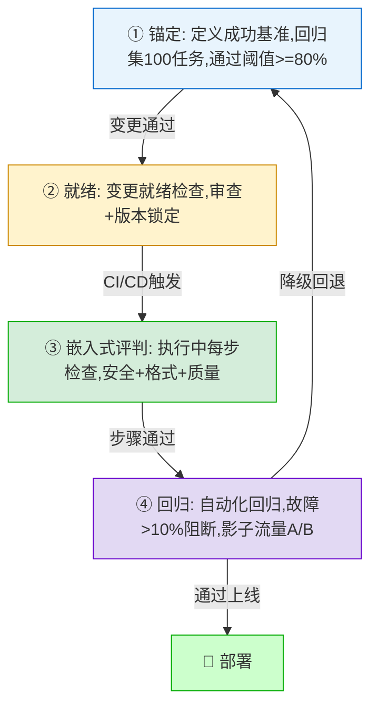
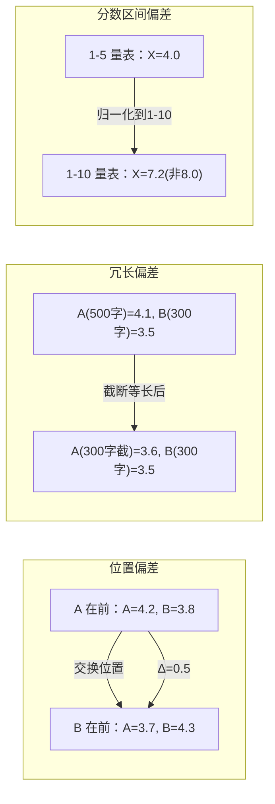
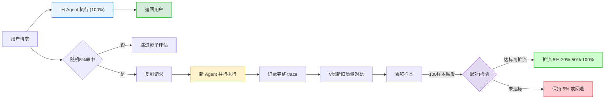
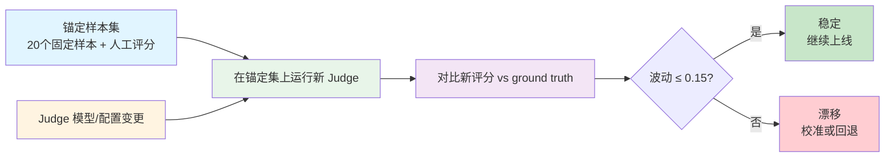

# 第 09 章 V — 验证与评估

第 7 章解决了"Agent 怎么循环、多 Agent 怎么编排、崩溃后怎么恢复"的问题，第 8 章解决了"Agent 内部状态怎么对外可见"的问题。但这两层都回答不了一个问题：Agent 的输出到底好不好？L 层保证 Agent 跑完了任务，O 层保证跑的过程看得见，V 层要判断跑出来的结果值不值得信赖。

V（Verification/Evaluation）层对应 ETCLOVG 综述论文中的 V 层，在七层架构里是最后一道质量关卡。它向下接收 O 层采集的运行数据（trace、metrics、event log）作为评估输入，向上为 G 层的安全门禁和 L 层的编排决策提供"通过/阻断"信号。第 8 章的 AssumptionDriftDetector 验证的是"Middleware 的假设还成立吗"（组件级），V 层验证的是"Agent 的输出质量达标吗"（任务级），两层验证的对象和粒度不同。前置知识来自第 1 章的「EDD — 评估驱动开发」「非单调性」「层级模式的 V 层质量控制」「双层指标体系」。

当前 Agent 评估的核心矛盾是"确定性测试"和"概率性输出"之间的冲突。传统软件测试中输入确定、预期输出确定，pass/fail 一目了然。但 Agent 的输出是非确定性的：同一份财报分析跑两次，可能得到两份都合理但不同的结果。更危险的是，一份"看起来专业"的分析里可能藏着一个关键计算错误（把 QoQ 增长率当成了 YoY 增长率），流畅的论述包裹着难以察觉的错误。Agent 的行为还是非单调的：修改 prompt 让某些 case 变好但让另一些变差，单次测试通过不代表整体质量提升。V 层通过全量回归测试（≥100 个用例，检出故障后自动 Block）和 LLM-as-Judge 多轮投票，为 prompt 迭代提供可量化的反馈信号而非直觉判断。

本章按"为什么难 → 怎么管 → 用什么评 → 拿什么测 → 线上怎么验 → 评估自身准不准"的脉络展开，共六节：

- **9.1 为什么 Agent 评估特别难**：四重困难和评估驱动开发（EDD）循环
- **9.2 怎么管 Agent 质量**：四阶段质量控制循环（锚定 → 就绪 → 嵌入式评判 → 回归）
- **9.3 用什么评估**：人工、自动与 LLM-as-Judge 的偏差治理和度量陷阱
- **9.4 拿什么测**：评估数据集与基准选择，自建评估集五步法
- **9.5 线上怎么验**：影子流量与 A/B 测试的统计陷阱
- **9.6 评估自身准不准**：Judge 漂移检测和评估覆盖率分析

读完本章，读者能掌握从评估困难分析到质量控制循环、从 LLM-as-Judge 偏差治理到影子流量在线评估、从基准选择到评估系统自身监控的完整验证闭环：知道 Agent 的非确定性输出怎么测、prompt 迭代有没有真实改进、线上质量怎么持续守护、评估系统自身准不准怎么发现。

***

## 9.1 为什么 Agent 评估特别难：四重困难与 EDD

传统软件测试中，单元测试有明确的 pass/fail 标准；输入确定，预期输出确定。Agent 评估面对的是完全不同的世界：一份财报分析，连续运行两次可能得到"营收增长 12%，现金流健康"和"营收增长 12%，但应收账款周转天数从 45 天恶化到 67 天；建议关注现金流风险"两份合理但不同的输出。更危险的是，一份"看起来专业"的分析里藏着一个关键计算错误（把 QoQ 增长率当成了 YoY 增长率），流畅的论述和专业术语包裹着难以察觉的错误。

Agent 的输出不是"对/错"的二元问题——它是概率性的、多维度的、开放式的。传统 pass/fail 的测试范式需要转变：不是测一次对不对，而是测它"在多大概率上、在哪些维度上、在多大不确定的区间内"是可靠的。

### KP 9.1.1 Agent 评估难在哪：四重困难 【诊断】

Agent 评估面对的核心挑战可以归纳为四个维度：

1. **非确定性**（Non-determinism）：同一输入多次运行，在中等 temperature（0.3-0.7）下模型输出有 5-10% 的评分波动[^2]。这是 LLM 的概率性本质，评估必须从"单点判断"升级为"统计判断"。
2. **多维性**（Multi-dimensionality）：一个 Agent 输出需要从正确性、效率、优雅度、安全性等维度评价。在某个维度上优秀在另一个维度上可能糟糕；"综合分"需要明确的加权方案。
3. **开放性**（Open-endedness）：很多任务没有标准答案；"写一份重构建议"、什么是"好"的建议？主观性极强。
4. **过程与结果的分裂**：只看最终结果不够——Agent 可能"碰巧"生成了正确的输出但中间步骤完全错误（"虚高"）。相反，中间推理都是正确的但最终拼写错误导致失败（"虚低"）。过程质量是结果质量的重要补充。

对这个四重困难的应对是三个原则。

第一，**概率性评估**：同输入运行 5 次，报告均值和标准差，不是"这个 Agent 有 72% 的成功率"，而是"成功率 72% ± 4%（95% CI）"。

第二，**多维评分**：不只"成功/失败"，增加 token 效率（token/任务）、步骤经济性（步/任务）、安全合规（是否触发安全拦截）三个辅助维度，最终报告是一个雷达图而非单一数字。

第三，**过程评分**：在关键中间步骤（工具选择、工具调用参数、推理逻辑）上进行采样式人工评分，补充只看最终结果的盲区。

在四重困难中，非确定性是最根本的，它迫使评估从"通过/失败"的二值判断升级为"均值 + 置信区间"的统计推断。Agent 的非单调性（同输入不同输出）源自 LLM 的 temperature 采样：temperature > 0 引入随机性，统计检验（非单次分数）是唯一可靠的评估方法。

### KP 9.1.2 怎么让评估驱动开发：EDD 四阶段 【构建】

评估驱动的开发（Eval-Driven Development, EDD）将评估从"发布前最后检查"变为开发循环的内建环节；每次修改（prompt 调整、模型更换、工具更新）自动触发评估流水线，结果作为 merge 门禁。部分企业部署评估系统后报告，编码 Agent 的 PR 人工审查量减少了约 30%[^3]；因为评估自动过滤了大部分劣质输出，只有高质量候选进入人工审查。

EDD 的实现是四阶段循环：

1. **开发 + 变更**：Agent 的 prompt、工具、模型、Middleware 配置等任何变更。
2. **自动触发评估流水线**（CI 集成）：变更 push → 自动在评估数据集上运行 Agent → 对比基线分数。
3. **门禁判定**：任何维度评分下降 > 10% → 标记 regressed，阻断 merge。所有维度持平或提升 → 通过。
4. **反馈闭环**：成功 case 自动进入回归集（永不故障），失败 case 自动进入调试队列，经根因分析后固化为新的测试用例。

EDD 的核心思想借鉴自 TDD（Test-Driven Development）。TDD 的做法是先写测试用例再写实现代码，确保"正确"有明确的检查标准。EDD 把同样的逻辑搬到 Agent 场景：先建好评估数据集和评分标准（见 KP 9.2.1 锚定），再做 prompt 调整或模型更换。这样每次变更 push 后自动跑评估流水线，对比新旧分数就能判断改动是改进还是退化，不用等人肉 review 再发现问题。上一段提到的 PR 审查量减少约 30% 就是这个机制的效果：评估自动过滤了劣质输出，人工只审高质量候选。

业内可参考 AgentScope OpenJudge（50+ 评分器，三级评估体系）、TrueFoundry 评估平台（托管式，按量付费）、LlamaGuard（开源模型级安全评估）和 DeepEval（开源 LLM 评测框架，支持合成数据生成）。

***

## 9.2 怎么管 Agent 质量：四阶段质量控制循环

> **说明**：四阶段是概念模型（锚定→就绪→嵌入式评判→回归）。在代码实现中（`EvaluationAdvisor`），整个质量控制循环被拆分为五个可独立调度的状态（ANCHOR/READY/EXECUTE/JUDGE/REGRESS），其中 EXECUTE 和 JUDGE 对应于概念模型中"嵌入式评判"阶段的内部实现细节。这一拆分使两个子阶段可以独立监控和配置。



### KP 9.2.1 怎么定义"好"：锚定量表与示例 【构建】

锚定的目的是为每类任务定义**可操作的质量维度和评分量表**，让"好"从一个主观感受变为可测量的标准。锚定需要同时满足三个要求：维度全面（覆盖质量的所有重要方面）、标准明确（每个分数段有锚定示例）、实用性（精简而非学术化的 20 页规范）。

以编码 Agent 为例的锚定量表：

| 维度        | 1 分              | 3 分             | 5 分                 |
| --------- | ---------------- | --------------- | ------------------- |
| **编译通过**  | 不通过（0 分）         | —               | 通过（1 分，二元）          |
| **测试通过**  | 0/10 测试通过        | 8/10 测试通过       | 10/10 测试通过 + 未引入新失败 |
| **代码风格**  | 严重违反规范（命名混乱、无注释） | 基本符合，有个别风格问题    | 完全符合团队规范，可读性好       |
| **方案正确性** | 修复方向完全错误         | 修复了问题但引入了新的边缘问题 | 完美修复，考虑了所有边缘情况      |
| **安全性**   | 引入了已知漏洞          | 无明显漏洞           | 主动加固（添加输入校验等）       |

每个维度 1-5 分需要附带**锚定示例**，一段代码输出示例，标注"这是 3 分"，让评分者（人或 LLM）有具体的参照物。这种做法利用了认知心理学中的锚定效应（Anchoring Effect）；通过提供具体的评分示例（1/3/5 分），将评判者的主观尺度校准到统一参照系，降低评分者间差异。五维度锚定量表使人工与 LLM 评分一致度提升约 30-50%（取决于任务类型和评分器经验）。

可探索的方向包括动态锚定示例自动更新（基于最新生产数据）、多粒度锚定（任务级 + 子任务级 + 步骤级），以及引入并排对比锚定让评分者同时看到 1/3/5 分示例。业内参考包括 MT-Bench（多轮对话评估基准）和 AlpacaEval（自动化 LLM 评估，2.0 版本支持长度控制）。

### KP 9.2.2 输入质量够不够：就绪检查与可解性预估 【构建】

如果输入质量太差，Agent 执行就是在浪费资源。就绪检查器在 Agent 执行前运行两个判断：

1. **三维度就绪评分**：基于启发式规则对输入的三个维度各打 0-5 分（总分 0-15 分）。评估维度：清晰度（词汇多样性+明确性指示词-歧义词检测）、完整性（任务动词覆盖率+长度+结构化元素）、可解性（历史相似任务成功率预估）。总分 < 3.0 → 返回用户要求补充信息，不启动 Agent。
2. **可解性预估**：基于历史相似任务的成功率，给用户一个"该类任务的预期表现"提示——如果预估成功率偏低，让用户做知情决策。

```java
/*
 * 框架：Java SE 21+ + AgentScope 2.x
 * 环境：JDK 21+, AgentScope 2.x
 *
 * 组件说明（就绪检查的 AgentScope 实现，代码位于 codepilot/ch09-evaluation/）：
 * - ReadinessCheckAdvisor（V 层，继承 AbstractLayerMiddleware）：在 onAgent 阶段执行三维度评分。
 *   三个维度：清晰度（词汇多样性+明确性指示词+歧义词检测）、完整性（任务动词覆盖率+长度+结构化元素）、
 *   可解性（基于历史相似任务成功率的启发式预估）。总分 0-15 分，低于阈值 3.0 拦截并返回补充提示。
 * - 门禁逻辑：评分不足 → populateRefusalContext 注入结构化补充信息到上下文 → Flux.empty() 终止执行。
 *   评分通过 → 将就绪信息（score/solvability/features）注入上下文供后续阶段使用。
 */
@Component
public class ReadinessCheckAdvisor extends AbstractLayerMiddleware {

    private static final double MIN_READINESS_SCORE = 3.0;
    private final ConcurrentHashMap<String, TaskStatistics> taskHistory = new ConcurrentHashMap<>();

    @Override
    public Flux<AgentEvent> onAgent(Agent agent, RuntimeContext rc, AgentInput input,
                                    Function<AgentInput, Flux<AgentEvent>> next) {
        String sessionId = rc.getExtra().getOrDefault("session.id", UUID.randomUUID()).toString();
        String userInput = extractUserInput(rc);

        if (userInput == null || userInput.isBlank()) {
            return next.apply(input);  // 空输入跳过检查
        }

        // 三维度就绪评估
        ReadinessResult result = assessReadiness(userInput, sessionId);

        // 门禁判断：总分 < 3.0 拦截，返回结构化补充提示
        if (result.totalScore() < MIN_READINESS_SCORE) {
            populateRefusalContext(rc, result);  // 注入补充信息到上下文
            return Flux.empty();                   // 终止执行
        }

        // 通过检查，将评分信息注入上下文供后续阶段使用
        rc.put("readiness.score", result.totalScore());
        rc.put("readiness.solvability", result.solvabilityScore());
        rc.put("readiness.features", result.taskFeatures());
        return next.apply(input);
    }

    /** 三维度评分：清晰度 + 完整性 + 可解性，总分 0-15 */
    private ReadinessResult assessReadiness(String input, String sessionId) {
        double clarity = assessClarity(input);        // 词汇多样性 + 明确指示词 - 歧义词
        double completeness = assessCompleteness(input); // 任务动词覆盖 + 长度 + 结构化元素
        TaskFeatures features = extractTaskFeatures(input);
        double solvability = assessSolvability(features); // 历史成功率或启发式预估
        double total = clarity + completeness + solvability;
        return new ReadinessResult(sessionId, Instant.now(), input,
                clarity, completeness, solvability, total, features, total >= MIN_READINESS_SCORE);
    }

    /** 拦截时生成结构化补充提示（告诉用户需要补充什么） */
    private void populateRefusalContext(RuntimeContext rc, ReadinessResult result) {
        rc.put("readiness.blocked", true);
        rc.put("readiness.score", result.totalScore());
        rc.put("readiness.guidance", generateGuidance(result));
    }
}
```

就绪检查是对 Agent 执行前的输入分诊，借鉴了急诊医学的"分诊"（Triage）概念，根据信息完备性和可解性分配执行资源。5 分制完备性评分 + 历史成功率预估，构成一套低成本的输入质量把关机制——模糊输入让 Agent "猜"意味着 token 浪费和错误方向，而小模型的启发式前置判断能提前拦截不可完成任务。

可探索的方向包括自适应就绪阈值（基于任务类型和用户历史动态调整）和多模态输入检查（代码 + 文档 + 截图联动评估）。业内相关的有 Ragas（开源 RAG 评估框架，含输入质量评分）。

#### SolvabilityEstimator 代码实现

KP 9.2.2 的就绪检查有两个功能：三维度评分和可解性预估。上面的 `ReadinessCheckAdvisor` 代码展示了三维度评分的整体流程，其中 `assessSolvability()` 方法，调用的就是这里展开的 `SolvabilityEstimator`。它是一个独立的可解性预估组件，单独拆出来是因为它的逻辑自成一格：需要维护历史任务记录、做相似度匹配、加权计算，和三维度评分的启发式规则是两套机制。

而`SolvabilityEstimator` 要回答的问题是：当前用户输入的任务，历史上类似任务跑成功过多少？核心流程分三步。第一步把任务分类（编码/文档/分析/通用），缩小历史匹配范围。第二步在同类历史任务里用 Jaccard 相似度（两个输入的词集交集÷并集）找相似任务，阈值 0.3 以上才算匹配。第三步对匹配到的历史任务做加权平均，权重是相似度乘以时间衰减（越近的任务权重越大），算出一个 0-5 分的可解性评分。冷启动阶段（历史样本不足 10 个）直接给默认 3.0 分，等样本攒够再切到历史模式。

代码见 CodePilot 配套仓库：codepilot/ch09-evaluation/ — SolvabilityEstimator

```java
/*
 * 组件说明（可解性预估器）：
 * - SolvabilityEstimator：基于历史任务相似度预估当前任务的成功率。
 * - 核心逻辑：任务分类 → 历史匹配 → Jaccard 相似度 → 加权成功率计算。
 * - 冷启动：无历史数据时默认 3.0 分，积累 10+ 样本后切换到历史模式。
 */
@Component
public class SolvabilityEstimator {

    private static final double DEFAULT_SOLVABILITY = 3.0;  // 冷启动默认分
    private static final int MIN_HISTORY_SAMPLES = 10;
    private static final double SIMILARITY_THRESHOLD = 0.3;

    private final List<TaskRecord> history = new ArrayList<>();

    /** 预估任务可解性（0-5 分） */
    public double estimate(String taskInput, TaskFeatures features) {
        if (history.size() < MIN_HISTORY_SAMPLES) {
            return DEFAULT_SOLVABILITY;  // 冷启动：启发式默认值
        }

        // Step 1: 任务分类
        String category = classifyTask(features);

        // Step 2: 历史匹配 + 相似度计算
        List<TaskRecord> matches = findSimilarTasks(taskInput, category);
        if (matches.isEmpty()) {
            return DEFAULT_SOLVABILITY;
        }

        // Step 3: 加权成功率计算
        double weightedScore = calculateWeightedScore(matches);
        return Math.min(5.0, Math.max(0.0, weightedScore));
    }

    private String classifyTask(TaskFeatures features) {
        if (features.hasCodeKeywords()) return "coding";
        if (features.hasDocumentKeywords()) return "documentation";
        if (features.hasAnalysisKeywords()) return "analysis";
        return "general";
    }

    private List<TaskRecord> findSimilarTasks(String input, String category) {
        List<TaskRecord> result = new ArrayList<>();
        for (TaskRecord record : history) {
            if (!record.category().equals(category)) continue;
            double similarity = jaccardSimilarity(input, record.input());
            if (similarity >= SIMILARITY_THRESHOLD) {
                result.add(record);
            }
        }
        result.sort(Comparator.comparingDouble(
                (TaskRecord r) -> jaccardSimilarity(input, r.input())).reversed());
        return result;
    }

    // Jaccard 相似度：两个输入的 token 集合交集/并集
    private double jaccardSimilarity(String a, String b) {
        Set<String> tokensA = Set.of(a.toLowerCase().split("\\s+"));
        Set<String> tokensB = Set.of(b.toLowerCase().split("\\s+"));

        Set<String> intersection = new HashSet<>(tokensA);
        intersection.retainAll(tokensB);

        Set<String> union = new HashSet<>(tokensA);
        union.addAll(tokensB);

        return union.isEmpty() ? 0 : (double) intersection.size() / union.size();
    }

    private double calculateWeightedScore(List<TaskRecord> matches) {
        double totalWeight = 0;
        double weightedSum = 0;

        for (TaskRecord record : matches) {
            double recencyWeight = 1.0 / (1.0 + daysSince(record.timestamp()));
            double weight = record.similarity() * recencyWeight;
            weightedSum += record.successScore() * weight;
            totalWeight += weight;
        }

        return totalWeight > 0 ? weightedSum / totalWeight : DEFAULT_SOLVABILITY;
    }

    public void recordOutcome(String input, String category, double successScore) {
        history.add(new TaskRecord(input, category, successScore, System.currentTimeMillis()));
        if (history.size() > 1000) history.remove(0);
    }

    private double daysSince(long timestamp) {
        return (System.currentTimeMillis() - timestamp) / 86_400_000.0;
    }

    public record TaskRecord(String input, String category, double successScore, long timestamp) {}
    public record TaskFeatures(boolean hasCodeKeywords, boolean hasDocumentKeywords, boolean hasAnalysisKeywords) {}
}
```

### KP 9.2.3 执行中怎么实时检查：嵌入式评判 【构建】

事后评判无法阻止已发生的错误；Agent 输出的危险代码已经提交，包含 PII（Personally Identifiable Information，个人身份信息）的文本已经返回给用户。V 层如果只在流程终点运行，就只能"记录问题"而不能"阻止问题"。

Agent 的决策链中，每个步骤都有出错可能：第 3 步选错了工具、第 5 步的工具返回了异常数据、第 8 步的输出包含了不该包含的敏感信息。V 层需要在**每个关键步骤后**实时检查，在错误被传播到下一步之前拦截。

嵌入式评判：L 层编排中每个关键步骤后触发 V 层检查：

1. **安全检查**（每个工具调用后）：调用的工具是否在白名单中？参数是否在允许范围内？工具返回是否包含 PII？
2. **格式检查**（每个输出生成后）：输出是否符合预期的 JSON/Markdown/Diff 格式？结构完整性是否合格？
3. **质量检查**（关键步骤完成后）：代码修改是否通过了语法检查？编译是否通过？测试是否在本地运行？

检查不通过 → V 层输出结构化的"问题反馈"（问题类型 + 具体描述 + 修正建议）→ Agent 接收反馈并修正 → 修正后重新通过 V 层检查 → 继续下一步。

```java
/*
 * 框架：Java SE 21+ + AgentScope 2.x
 * 环境：JDK 21+, AgentScope 2.x
 *
 * 组件说明（嵌入式评判的 AgentScope 实现，代码位于 codepilot/ch09-evaluation/）：
 * - EmbeddedValidationAdvisor（V 层，继承 AbstractLayerMiddleware）：在 onAgent 的 doOnComplete 后置钩子中
 *   执行三重检查（安全+格式+质量），发现问题立即中断并触发修正机制。
 *   安全检查（PII正则+有害内容+Jailbreak）→ 格式检查（JSON/代码/Markdown验证器）→ 质量检查（完整性+准确性+相关性启发式）。
 * - 三级修正策略：L1 重试（格式问题，最多3次）→ L2 提示修正（质量问题，注入改进提示）→ L3 降级（安全问题，直接拒绝）。
 * - 通过检查 → 注入 validation.passed/safetyScore/formatScore/qualityScore 到上下文。
 */
@Component
public class EmbeddedValidationAdvisor extends AbstractLayerMiddleware {

    private static final int MAX_RETRIES = 3;
    private static final double QUALITY_THRESHOLD = 60.0;

    // PII模式库 + 有害内容关键词 + 格式验证器注册省略
    // 完整实现见 codepilot/ch09-evaluation/EmbeddedValidationAdvisor.java

    @Override
    public Flux<AgentEvent> onAgent(Agent agent, RuntimeContext rc, AgentInput input,
                                    Function<AgentInput, Flux<AgentEvent>> next) {
        return next.apply(input).doOnComplete(() -> {
            String output = extractOutput(rc);
            if (output == null || output.isBlank()) return;

            // 三重检查：安全→格式→质量
            ValidationResult result = performTripleCheck(output, sessionId, checkpoint);
            recordCheckpoint(sessionId, checkpoint, result);

            if (!result.passed()) {
                handleValidationFailure(rc, result, sessionId);  // 三级修正
                return;
            }

            // 通过检查，注入验证元数据
            rc.put("validation.passed", true);
            rc.put("validation.safetyScore", result.safetyScore());
            rc.put("validation.formatScore", result.formatScore());
            rc.put("validation.qualityScore", result.qualityScore());
        });
    }

    /** 三重检查核心：安全（PII/有害/Jailbreak）→ 格式（验证器）→ 质量（启发式评分） */
    private ValidationResult performTripleCheck(String output, String sessionId, String checkpoint) {
        SafetyCheckResult safety = checkSafety(output);
        FormatCheckResult format = checkFormat(output, checkpoint);
        QualityCheckResult quality = checkQuality(output);

        boolean passed = safety.safe() && format.valid() && quality.score() >= QUALITY_THRESHOLD;
        double overallScore = (safety.score() + format.score() + quality.score()) / 3.0;
        return new ValidationResult(passed, safety, format, quality, overallScore,
                sessionId, checkpoint, startTime, endTime, durationMs);
    }

    /** 三级修正策略：重试 → 提示 → 降级 */
    private void handleValidationFailure(RuntimeContext rc, ValidationResult result, String sessionId) {
        if (!result.safety().safe()) {
            populateRejectionContext(rc, result, "SECURITY_VIOLATION");   // L3 降级
            return;
        }
        int retries = retryCounters.getOrDefault(sessionId, 0);
        if (retries >= MAX_RETRIES) {
            populateRejectionContext(rc, result, "MAX_RETRIES_EXCEEDED");
            return;
        }
        if (!result.format().valid()) {
            populateRetryContext(rc, result.format().issues());             // L1 重试
            return;
        }
        if (result.quality().score() < QUALITY_THRESHOLD) {
            populateCorrectionContext(rc, result);                          // L2 提示修正
        }
    }
}
```

嵌入式评判将 V 层的检查点从"终点"前移到"每一步之后"，使质量保障从"事后记录"升级为"实时阻断"，安全/格式/质量三重检查构成递进式防线。一个错误决策可能引发后续多步的级联错误，越早拦截浪费越少。

业内可参考 Guardrails AI（开源，支持流式实时验证）。

### KP 9.2.4 改了会不会退化：回归测试与门禁 【构建】

Agent 变更的影响不直观，改了 prompt 可能让某些 case 变好另一些变差。需要一套机制来量化"综合变化"并防止已知 case 故障。

回归测试集 + 质量门禁：

1. **回归集构建**：50+ 典型 case（从生产日志真实场景中采样，覆盖简单/中等/困难 = 3:5:2 分布）。每个 case 有"基线分数"（当前版本在该 case 上的表现）。
2. **自动运行**：每次变更（PR）→ CI 自动在所有回归 case 上运行 Agent → 对比基线分数。
3. **故障告警**：任何 case 分数下降 > 10%（相对于其基线）→ CI 标记 fail，阻断 merge。多个 case 同时下降 → 强烈告警。
4. **自我进化**：生产中发现的新失败 case → 根因分析后加入回归集。回归集会随着系统运营"自我成长"，越是容易出问题的场景，越会被加入回归集。

回归集的 100 个任务数量来自统计显著性要求——p < 0.05 + Cohen's d（效应量指标，衡量差异的实际大小，d > 0.2 表示差异有实际意义）+ N ≥ 100 是心理学领域 50 年验证的最小样本标准。Agent 评分方差大（5-10%），少于 100 个 case 时效应量可能被噪声淹没。50+ 典型 case + 3:5:2 难度分布，确保回归集既有统计说服力，又覆盖简单/中等/困难三个能力区间。

回归集在每次变更时自动运行全量对比，任何 case 分数下降 > 10% 自动阻断合并，生产新失败自动加入回归集实现自我进化。业内参考包括 SWE-bench 评估框架（开源，编码 Agent 标准基准）。

#### RegressionRunner 代码实现

代码见 CodePilot 配套仓库：codepilot/ch09-evaluation/ — RegressionRunner

```java
/*
 * 组件说明（回归测试执行器）：
 * - RegressionRunner：运行 100 case 全量回归套件，对比基线分数。
 * - 统计判据：Welch's t 检验 p < 0.05 + 退化率 > 10% 触发阻断。
 * - 门禁输出：PASS（通过）/ WARN（警告）/ BLOCK（阻断）。
 */
@Component
public class RegressionRunner extends AbstractLayerMiddleware {

    private static final int SUITE_SIZE = 100;
    private static final double DEGRADATION_THRESHOLD = 0.10;  // 10% 退化阻断
    private static final double SIGNIFICANCE_LEVEL = 0.05;      // p < 0.05 统计显著
    private static final int CONCURRENCY = 4;

    private final List<BaselineRecord> baselineHistory = new ArrayList<>();
    private final ExecutorService executor = Executors.newFixedThreadPool(CONCURRENCY);

    // 触发回归测试：在 CI/CD 的 PR 流程中调用
    public RegressionReport runSuite(String suiteId) {
        List<RegressionTask> tasks = generateSuiteTasks(suiteId);
        List<Future<TaskResult>> futures = new ArrayList<>();

        // 并发执行所有任务
        for (RegressionTask task : tasks) {
            futures.add(executor.submit(() ->
                // 注：教学版使用随机模拟评分，生产版接入真实 Agent 调用
                new TaskResult(task.taskId(), task.expectedScore() * (0.9 + Math.random() * 0.2), true, null)
            ));
        }

        // 收集结果
        List<TaskResult> results = new ArrayList<>();
        for (Future<TaskResult> f : futures) {
            results.add(f.get(5, TimeUnit.MINUTES));
        }

        // Welch's t 检验 + 门禁判定
        return analyzeResults(suiteId, results, 0, Instant.now());
    }

    private RegressionReport analyzeResults(String suiteId, List<TaskResult> results,
                                             int errors, Instant startTime) {
        double[] currentScores = results.stream()
                .mapToDouble(TaskResult::score).toArray();
        double currentMean = Arrays.stream(currentScores).average().orElse(0);

        double[] baselineScores = getBaselineScores(suiteId);
        double baselineMean = baselineScores.length > 0
                ? Arrays.stream(baselineScores).average().orElse(currentMean) : currentMean;

        double degradation = baselineMean > 0
                ? (baselineMean - currentMean) / baselineMean : 0;

        // Welch's t 检验
        double pValue = welchTTest(baselineScores, currentScores);

        String verdict;
        if (degradation > DEGRADATION_THRESHOLD && pValue < SIGNIFICANCE_LEVEL) {
            verdict = "BLOCK";  // 严重退化 → 阻断合并
        } else if (degradation > 0.05 || pValue < 0.10) {
            verdict = "WARN";   // 轻度退化 → 警告
        } else {
            verdict = "PASS";   // 正常
        }

        return new RegressionReport(suiteId, verdict, currentMean, baselineMean,
                degradation, pValue, 0, errors, Duration.between(startTime, Instant.now()));
    }

    // Welch's t 检验实现（不等方差双样本 t 检验）
    private double welchTTest(double[] sample1, double[] sample2) {
        double mean1 = Arrays.stream(sample1).average().orElse(0);
        double mean2 = Arrays.stream(sample2).average().orElse(0);
        double var1 = variance(sample1, mean1), var2 = variance(sample2, mean2);
        double se = Math.sqrt(var1 / sample1.length + var2 / sample2.length);
        if (se == 0) return 1.0;

        double t = (mean1 - mean2) / se;
        double dfNum = Math.pow(var1 / sample1.length + var2 / sample2.length, 2);
        double dfDen = Math.pow(var1 / sample1.length, 2) / (sample1.length - 1)
                     + Math.pow(var2 / sample2.length, 2) / (sample2.length - 1);
        double df = dfDen > 0 ? dfNum / dfDen : sample1.length + sample2.length - 2;

        TDistribution tDist = new TDistribution(Math.max(1, Math.min(df, 1000)));
        return 1.0 - tDist.cumulativeProbability(Math.abs(t));
    }

    public record RegressionReport(
            String suiteId, String verdict, double currentMean, double baselineMean,
            double degradationRate, double pValue, int passedTasks,
            int errors, Duration duration
    ) {
        public boolean gatePassed() { return "PASS".equals(verdict); }
        public boolean isSignificant() { return pValue < SIGNIFICANCE_LEVEL; }
    }
}
```

#### EvaluationAdvisor 代码实现：五阶段状态机引擎

代码见 CodePilot 配套仓库：codepilot/ch09-evaluation/ — EvaluationAdvisor

**组件关系说明**：`EvaluationAdvisor` 是 V 层的核心调度引擎，实现 AREJR 五阶段状态机。`ReadinessCheckAdvisor`、`EmbeddedValidationAdvisor`、`RegressionRunner` 是独立组件，在 ETCLOVG Middleware 链中各自挂载——`EvaluationAdvisor` 负责评估流程的编排水态转换和管理评分数据（ANCHOR→READY→EXECUTE→JUDGE→REGRESS），而其他 V 层组件在 Agent 执行的不同阶段（`onAgent` / `doOnComplete`）执行具体检查逻辑。它们通过 `RuntimeContext` 共享评估上下文数据（如 `eval.sessionId`、`readiness.score`、`validation.*` 等）。

`EvaluationAdvisor` 将四阶段质量控制循环（锚定→就绪→嵌入式评判→回归）实现为五阶段状态机（ANCHOR/READY/EXECUTE/JUDGE/REGRESS）。每个阶段有明确的输入、输出和状态转换条件，通过 `eval.stage` 上下文参数驱动阶段切换。

```java
/*
 * 组件说明（五阶段评估引擎）：
 * - EvaluationAdvisor：V 层核心调度引擎，实现 AREJR 五阶段状态机。
 * - 阶段转换：通过 eval.stage 上下文参数驱动，每个阶段处理完毕后进入下一阶段。
 * - 评分聚合：EXECUTE 收集各维度评分 → JUDGE 加权聚合为最终分数 → REGRESS 对比基线检测退化。
 */
@Component
public class EvaluationAdvisor extends AbstractLayerMiddleware {

    // 五阶段枚举：锚定 → 就绪 → 执行 → 判决 → 回归
    public enum Stage { ANCHOR, READY, EXECUTE, JUDGE, REGRESS }

    private final Map<String, EvaluationSession> activeSessions = new ConcurrentHashMap<>();
    private final List<CompletedEvaluation> evaluationHistory = new ArrayList<>();

    public EvaluationAdvisor() {
        super(Layer.V, "EvaluationAdvisor-V");
    }

    // ========== 状态机入口：根据 eval.stage 分发到对应阶段处理 ==========

    @Override
    public Flux<AgentEvent> onAgent(Agent agent, RuntimeContext rc, AgentInput input,
                                    Function<AgentInput, Flux<AgentEvent>> next) {
        Map<String, Object> context = rc.getExtra();
        String sessionId = context.getOrDefault("eval.sessionId", UUID.randomUUID().toString()).toString();

        // 阶段检测：从上下文读取当前阶段（默认 ANCHOR）
        Stage stage = detectStage(context);

        // 状态机分发
        switch (stage) {
            case ANCHOR  -> handleAnchor(sessionId, context);   // ① 锚定：加载评分标准
            case READY   -> handleReady(sessionId, context);    // ② 就绪：准备待评估数据
            case EXECUTE -> handleExecute(sessionId, context);  // ③ 执行：收集各维度评分
            case JUDGE   -> handleJudge(sessionId, context);    // ④ 判决：加权聚合最终分数
            case REGRESS -> handleRegress(sessionId, context);  // ⑤ 回归：对比基线检测退化
        }

        return next.apply(input);
    }

    // ========== ① ANCHOR：锚定评分标准 ==========

    private void handleAnchor(String sessionId, Map<String, Object> context) {
        log.info("[V层-ANCHOR] 会话 {} 开始锚定评估基准", sessionId);

        EvaluationSession session = new EvaluationSession(sessionId, Instant.now());

        // 从上下文加载评分标准（rubric），未提供则使用默认五维度标准
        @SuppressWarnings("unchecked")
        Map<String, Object> rubric = (Map<String, Object>) context.getOrDefault(
                "eval.rubric", buildDefaultRubric());

        session.rubric = rubric;
        session.metrics = new ArrayList<>();
        session.currentStage = Stage.ANCHOR;

        activeSessions.put(sessionId, session);
        log.debug("[V层-ANCHOR] 会话 {} 基准已锚定: {}", sessionId, rubric.keySet());
    }

    // 默认五维度评分标准：准确性(35%) + 完整性(20%) + 相关性(20%) + 格式(10%) + 安全(15%)
    private Map<String, Object> buildDefaultRubric() {
        Map<String, Object> rubric = new LinkedHashMap<>();
        rubric.put("accuracy", Map.of("weight", 0.35, "passThreshold", 0.7));
        rubric.put("completeness", Map.of("weight", 0.20, "passThreshold", 0.7));
        rubric.put("relevance", Map.of("weight", 0.20, "passThreshold", 0.7));
        rubric.put("formatting", Map.of("weight", 0.10, "passThreshold", 0.6));
        rubric.put("safety", Map.of("weight", 0.15, "passThreshold", 0.8));
        rubric.put("globalPassThreshold", 0.70);  // 全局通过阈值
        return rubric;
    }

    // ========== ② READY：准备待评估数据 ==========

    private void handleReady(String sessionId, Map<String, Object> context) {
        EvaluationSession session = activeSessions.get(sessionId);
        if (session == null) {
            log.warn("[V层-READY] 会话 {} 未找到——请先执行 ANCHOR", sessionId);
            return;
        }

        // 收集待评估的三元组：候选响应 + 参考答案 + 任务描述
        session.candidateResponse = context.getOrDefault("eval.candidate", "").toString();
        session.referenceAnswer = context.getOrDefault("eval.reference", "").toString();
        session.taskDescription = context.getOrDefault("eval.task", "").toString();
        session.currentStage = Stage.READY;

        log.info("[V层-READY] 会话 {} 待评估数据已就绪", sessionId);
    }

    // ========== ③ EXECUTE：收集各维度评分 ==========

    private void handleExecute(String sessionId, Map<String, Object> context) {
        EvaluationSession session = activeSessions.get(sessionId);
        if (session == null) { log.warn("[V层-EXECUTE] 会话 {} 未找到", sessionId); return; }

        session.currentStage = Stage.EXECUTE;

        // 遍历 rubric 中的每个维度，逐个评分
        @SuppressWarnings("unchecked")
        Map<String, Object> rubric = session.rubric;
        for (Map.Entry<String, Object> entry : rubric.entrySet()) {
            String dimension = entry.getKey();
            if ("globalPassThreshold".equals(dimension)) continue;
            @SuppressWarnings("unchecked")
            Map<String, Object> dimConfig = (Map<String, Object>) entry.getValue();
            double score = scoreDimension(dimension, dimConfig, session);
            session.metrics.add(new DimensionScore(dimension, score, dimConfig));
        }

        log.info("[V层-EXECUTE] 会话 {} 评分完成，共 {} 个维度", sessionId, session.metrics.size());
    }

    // 维度评分分发：accuracy/completeness/relevance/formatting/safety
    private double scoreDimension(String dimension, Map<String, Object> config,
                                  EvaluationSession session) {
        return switch (dimension) {
            case "accuracy"     -> scoreAccuracy(session);      // 参考答案词集交集
            case "completeness" -> scoreCompleteness(session);   // 长度+结构化启发式
            case "relevance"    -> scoreRelevance(session);      // 任务词覆盖率
            case "formatting"   -> scoreFormatting(session);     // 格式规范性
            case "safety"       -> scoreSafety(session);         // 危险关键词检测
            default -> 0.5;
        };
    }

    // ========== ④ JUDGE：加权聚合最终分数 ==========

    private void handleJudge(String sessionId, Map<String, Object> context) {
        EvaluationSession session = activeSessions.get(sessionId);
        if (session == null) { log.warn("[V层-JUDGE] 会话 {} 未找到", sessionId); return; }

        // 加权平均：Σ(维度分数 × 权重) / Σ权重
        double totalWeight = 0;
        double weightedSum = 0;
        for (DimensionScore dim : session.metrics) {
            double weight = getDimensionWeight(dim.config());
            weightedSum += dim.score() * weight;
            totalWeight += weight;
        }

        double finalScore = totalWeight > 0 ? weightedSum / totalWeight : 0;
        session.finalScore = finalScore;
        session.passThreshold = parseThreshold(session.rubric);
        session.passed = finalScore >= session.passThreshold;
        session.currentStage = Stage.JUDGE;

        log.info("[V层-JUDGE] 会话 {} 判决完成: 分数={:.4f} 门禁={:.4f} 通过={}",
                sessionId, finalScore, session.passThreshold, session.passed);
    }

    // ========== ⑤ REGRESS：对比基线检测退化 ==========

    private void handleRegress(String sessionId, Map<String, Object> context) {
        EvaluationSession session = activeSessions.get(sessionId);
        if (session == null) { log.warn("[V层-REGRESS] 会话 {} 未找到", sessionId); return; }

        // 计算滑动窗口基线（最近 20 次评估的均值）
        double baseline = computeBaseline(20);
        double delta = session.finalScore - baseline;
        boolean degraded = delta < -0.05;  // 下降超过 5% 视为退化

        session.baseline = baseline;
        session.delta = delta;
        session.degraded = degraded;
        session.currentStage = Stage.REGRESS;

        // 归档到历史记录
        CompletedEvaluation completed = new CompletedEvaluation(
                sessionId, session.finalScore, baseline, delta,
                degraded, Instant.now(), session.metrics
        );
        synchronized (evaluationHistory) {
            evaluationHistory.add(completed);
            if (evaluationHistory.size() > 1000) {
                evaluationHistory.subList(0, 100).clear();
            }
        }

        if (degraded) {
            log.warn("[V层-REGRESS] 会话 {} 检测到退化: 当前={:.4f} 基线={:.4f} Δ={:+.4f}",
                    sessionId, session.finalScore, baseline, delta);
        } else {
            log.info("[V层-REGRESS] 会话 {} 无退化", sessionId);
        }

        activeSessions.remove(sessionId);  // 会话结束
    }

    // ========== 退化趋势分析 ==========

    public DegradationTrend trend() {
        List<CompletedEvaluation> recent = recentHistory(30);
        if (recent.size() < 5) return new DegradationTrend("INSUFFICIENT_DATA", 0, 0);
        long degradedCount = recent.stream().filter(CompletedEvaluation::degraded).count();
        double rate = (double) degradedCount / recent.size();
        if (rate > 0.3) return new DegradationTrend("DEGRADING", rate, degradedCount);
        if (rate > 0.1) return new DegradationTrend("WARN", rate, degradedCount);
        return new DegradationTrend("STABLE", rate, degradedCount);
    }

    // ========== 数据记录 ==========

    public static class EvaluationSession {
        public final String sessionId;
        public final Instant createdAt;
        public Stage currentStage;
        public Map<String, Object> rubric;
        public String candidateResponse;
        public String referenceAnswer;
        public String taskDescription;
        public List<DimensionScore> metrics;
        public double finalScore;
        public double passThreshold;
        public boolean passed;
        public double baseline;
        public double delta;
        public boolean degraded;

        public EvaluationSession(String sessionId, Instant createdAt) {
            this.sessionId = sessionId;
            this.createdAt = createdAt;
            this.currentStage = Stage.ANCHOR;
        }
    }

    public record DimensionScore(String dimension, double score, Map<String, Object> config) {}
    public record CompletedEvaluation(
            String sessionId, double score, double baseline, double delta,
            boolean degraded, Instant evaluatedAt, List<DimensionScore> dimensions
    ) {}
    public record DegradationTrend(String status, double rate, long degradedCount) {}
}
```

**五阶段状态机的工作流程**：

```mermaid
graph LR
    A["① ANCHOR<br/>加载评分标准<br/>rubric"] -->|"eval.stage=READY"| B["② READY<br/>收集候选响应<br/>+参考答案+任务"]
    B -->|"eval.stage=EXECUTE"| C["③ EXECUTE<br/>逐维度评分<br/>accuracy/completeness/..."]
    C -->|"eval.stage=JUDGE"| D["④ JUDGE<br/>加权聚合<br/>finalScore vs passThreshold"]
    D -->|"eval.stage=REGRESS"| E["⑤ REGRESS<br/>对比基线<br/>delta < -0.05 → 退化"]
    E -->|"归档历史"| F["CompletedEvaluation<br/>趋势分析"]

    style A fill:#e8f4fd,stroke:#0066cc
    style B fill:#fff3cd,stroke:#cc8800
    style C fill:#d4edda,stroke:#00aa00
    style D fill:#e2d9f3,stroke:#6600cc
    style E fill:#f8d7da,stroke:#cc0000
    style F fill:#ccffcc,stroke:#00aa00
```



**阶段转换的关键设计**：

1. **上下文驱动**：每个阶段通过 `eval.stage` 参数触发，允许外部灵活编排（如 CI 先跑 ANCHOR+READY，再批量跑 EXECUTE）
2. **会话隔离**：`activeSessions` 按 `sessionId` 隔离，支持并发评估多个 case
3. **状态累积**：`EvaluationSession` 贯穿五个阶段，逐步累积评分数据
4. **退化检测**：REGRESS 阶段对比最近 20 次评估的滑动窗口均值，Δ < -0.05 触发退化告警
5. **趋势分析**：`trend()` 方法分析最近 30 次评估的退化率，输出 STABLE/WARN/DEGRADING 三级趋势

***

## 9.3 用什么评估：人工、自动与 LLM-as-Judge

四阶段质量控制循环的核心是每一步都有评判，而评判需要评判者。人工评判成本高（每人每小时约 $50-100）、效率低（每人每天最多评 200-300 个 case），难以覆盖 Agent 的海量评估需求。LLM-as-Judge 是当前主流的自动化评判方案，但它本身有偏差，本章讨论其优势、局限与治理方法。

LLM-as-Judge 的典型问题：用 GPT-4 评估 GPT-4 的输出。Agent 输出 A 被打了 4.2 分，输出 B 被打了 3.8 分。但把 A 和 B 的顺序交换后，同一份输出，同一位 Judge——A 被打了 3.7 分，B 被打了 4.3 分。仅交换顺序就让评分翻转了 0.5 分。这不是评判标准变了，是 Judge 被位置影响了。

更深的陷阱在更高的抽象层：基准分数从 58% 涨到 72%，但用户满意度没有变化。基准分高了，用户不觉得更好，因为在过拟合基准，优化方向对准了测试集而非真实场景。

### KP 9.3.1 LLM 当评委靠谱吗：偏差与三步治理 【诊断】

LLM 不是中立的评判者。研究表明 LLM 评判存在至少 12 种偏差[^4]，其中对生产影响最大的三种：

1. **位置偏差**（Position Bias）：LLM 倾向于偏好列表中先出现的答案。在代码评判中，仅交换两个候选答案的展示顺序，正确率就可能浮动超过 10%[^4]。
2. **冗长偏差**（Length Bias）：LLM 倾向于给更长、更正式、更流畅的输出高分——即使内容质量不高。RLHF 训练让模型偏好"看起来专业"的文本，与内容实质质量并不完全对应。
3. **分数区间偏差**（Score Range Bias）：LLM 对预设的评分区间高度敏感——同一个输出，在 1-5 量表和 1-10 量表下的归一化分数不同。Contrastive Decoding（对比解码，通过对比两个模型的输出分布来减少偏差的生成策略）可实现最高 11.7% 的相对改进（v2 版本，2026 年 4 月更新）[^5]，但无法根除。

三种偏差的效应可视化如下——同一对输出在不同条件下的评分变化：



在最好的情况下，GPT-4 Turbo 和 Llama-3.1 70B 等顶级 LLM judge 与人工评分的 Scott's π（衡量评分者间一致性的统计量，值越高表示越一致，1.0 为完全一致）约 80，但比人与人之间的一致度低 5-7 个百分点[^6]。对于大部分模型，Scott's π 低于 50——基本上不可靠。

偏差治理三板斧：

1. **位置校准**：AB/BA 交换后取平均；评分时随机交换候选答案的位置，对每个候选在 A/B 两个位置各评一次，取平均分。消除位置偏差的净影响。
2. **长度截断**：在评分前截断所有候选到相同长度。如果候选 A 有 500 字，候选 B 有 300 字；截断 A 到 300 字再评分。消除"越长越好"偏差。
3. **多次投票**：同一输入运行 5 次（不同 temperature），取中位数作为最终评分。5 次采样的标准差作为置信度的参考。

多 Agent 评判（Multi-Agent Judge）可进一步提升可靠性；多个 judge 从不同角度（正确性、优雅度、安全性）独立评分，一个 meta-judge 汇总。在代码评判任务中，相比单一 judge，Spearman ρ（衡量排名相关性的统计量，ρ > 0 表示正相关，1.0 为完全一致排名）从 0.15-0.36 提升到 0.47[^4]。但成本也提升了；多个 judge = 多倍 LLM 调用。

**Pearson r > 0.8 验证**：将 LLM judge 的评分与人工评分（至少 50 个样本）做 Pearson 相关性分析（衡量两组连续数值之间线性关系强度的统计量，r = 1.0 表示完全正相关）。如果 r < 0.8，judge 不可靠，需要重新校准或换 judge 模型。这是最低准入门槛。

#### LLMJudgeAdvisor 代码实现

代码见 CodePilot 配套仓库：codepilot/ch09-evaluation/ — LLMJudgeAdvisor

```java
/*
 * 组件说明（LLM-as-Judge 偏差治理）：
 * - LLMJudgeAdvisor：内建三种偏差缓解机制的评判器。
 * - 机制 1：长度截断 → 消除冗长偏差。
 * - 机制 2：AB/BA 位置交换 → 消除位置偏差。
 * - 机制 3：多轮投票 → 降低单模型偏见。
 */
@Component
public class LLMJudgeAdvisor extends AbstractLayerMiddleware {

    private static final int DEFAULT_TRUNCATION_LENGTH = 2048;
    private static final int DEFAULT_VOTE_COUNT = 3;

    private final ReActAgent judgeAgent;

    public LLMJudgeAdvisor() {
        super(Layer.V, "LLMJudgeAdvisor-V");
        this.judgeAgent = ReActAgent.builder()
                .name("judge")
                .sysPrompt("You are an impartial evaluation judge.")
                .model("dashscope:qwen-plus")
                .build();
    }

    // 核心评判流程：三板斧联合治理
    public JudgeFinalResult evaluate(String candidateA, String candidateB, String rubric) {
        // 机制 1: 长度截断 → 消除冗长偏差
        String truncatedA = truncateLength(candidateA);
        String truncatedB = truncateLength(candidateB);

        // 机制 2: AB/BA 位置交换 → 消除位置偏差
        JudgeResult abResult = judgePair(truncatedA, truncatedB, rubric, "AB");
        JudgeResult baResult = judgePair(truncatedB, truncatedA, rubric, "BA");

        // 机制 3: 多轮投票 → 降低单模型偏见
        return multiVote(truncatedA, truncatedB, rubric);
    }

    // 机制 1：长度截断
    String truncateLength(String text) {
        if (text == null || text.length() <= DEFAULT_TRUNCATION_LENGTH) return text;
        return text.substring(0, DEFAULT_TRUNCATION_LENGTH) + "... [truncated]";
    }

    // 机制 2：AB/BA 交换评判
    private JudgeResult judgePair(String responseA, String responseB, String rubric, String order) {
        String prompt = """
            You are an impartial evaluation judge. Compare the two candidate responses below.
            ## Judging Criteria
            %s
            ## Candidate A
            %s
            ## Candidate B
            %s
            Output your judgment in JSON: { "winner": "A" | "B" | "TIE", "confidence": 0.0-1.0 }
            """.formatted(rubric.isBlank() ? "Accuracy, completeness, relevance, safety." : rubric,
                    responseA, responseB);

        RuntimeContext judgeRc = RuntimeContext.builder()
                .sessionId("judge-" + order).build();
        Msg response = judgeAgent.call(prompt, judgeRc).block();
        return parseJudgeResult(response != null ? response.getTextContent() : "", order);
    }

    // 机制 3：多轮投票
    private JudgeFinalResult multiVote(String responseA, String responseB, String rubric) {
        List<JudgeResult> rounds = new ArrayList<>();
        for (int i = 0; i < DEFAULT_VOTE_COUNT; i++) {
            String order = (i % 2 == 0) ? "AB" : "BA";
            JudgeResult round = judgePair(responseA, responseB, rubric, order);
            rounds.add(round);
        }

        // 多数票决定胜者
        int votesA = 0, votesB = 0;
        for (JudgeResult r : rounds) {
            if ("A".equals(r.winner())) votesA++;
            else if ("B".equals(r.winner())) votesB++;
        }

        String winner = votesA > votesB ? "A" : (votesB > votesA ? "B" : "TIE");
        return new JudgeFinalResult(winner, 0.0, votesA, votesB, rounds.size() - votesA - votesB, rounds);
    }

    public record JudgeResult(String order, String winner, double confidence, Map<String, Double> scores) {}
    public record JudgeFinalResult(
            String majorityWinner, double averageConfidence,
            int votesA, int votesB, int votesTie, List<JudgeResult> roundDetails
    ) {}
}
```

#### 人工评判 SOP：LLM 不可用时的黄金标准

当 LLM-as-Judge 无法覆盖某些场景（如代码重构的"优雅度"评判、产品文案的"品牌调性"判断），或需要对 LLM 的评分做 ground truth 校准时，人工评判是不可替代的。以下是标准化的人工评判流程：

**1. 评估者准备**

- **选拔**：至少 2 名熟悉 Agent 业务场景的工程师 + 1 名产品/质量负责人
- **培训**：对评估者进行 30 分钟的评分标准校准，使用 10 个锚定样本（与 KP 9.6.1 同一套）做预校准
- **校准检验**：评估者两两评分的 Cohen's κ（衡量评分者间一致性的统计量）需 ≥ 0.8 方可独立评判

**2. 评分流程**

- **双人盲评**：每个 case 由 2 名评估者独立评分，评分者不知道对方是谁
- **分歧仲裁**：两人评分差异 > 1.0 分时，由第三名评估者仲裁
- **评分记录**：每个评分必须附带文字理由——"为什么给这个分"比分数本身更重要

**3. 质量控制**

- **Cronbach's α 检验**：每轮评估结束后计算评分者内部一致性（α ≥ 0.8 为合格）
- **抽样复核**：随机抽取 10% 的 case 由首席评估者复核
- **时间监控**：每人每天评估不超过 30 个 case——疲劳会显著降低评分一致性

**4. 产出**

- 人工评分的中位数作为 ground truth
- 每个 case 的评分理由汇总为改进建议

### KP 9.3.2 为什么基准分高不等于用着好：度量陷阱 【诊断】

SWE-bench Verified 的分数持续上升，2024 年初约 12%，2025 年底突破 70%，2026 年初达到 80%+（Claude Opus 4.5/4.6）。但实际使用 Agent 写代码的体验没有等比例提升。高分没有转化为好体验，原因是什么？

**原因是基准污染**（Benchmark Contamination）。SWE-bench 的题库来自 Django、Flask、SymPy 等知名开源项目，而当前 LLM 在预训练阶段已经"见过"这些仓库的代码。等于考题提前泄给学生了，分数自然高。

验证方法是用 SWE-bench Pro（防污染版本）。它换用 copyleft 许可证仓库和私有创业公司仓库出题，确保模型预训练时没见过。结果很直接：GPT-5 在 SWE-bench Verified 上约 80% 通过率，到 SWE-bench Pro 首发时骤降到 23.3%[^7]。前后差了 57 个百分点，这个差距就是污染造成的虚高部分。

（注：截至 2026 年中，SWE-bench Pro 上的最佳成绩已提升至 80%+，但该提升可能来自模型针对性优化或基准信息泄露，不代表通用编码能力的等比例提升。）

**根本原因是古德哈特定律**（Goodhart's Law）：当一个指标被选作目标，它就不再是好的指标。团队会优化指标本身（刷 benchmark 分），而不是优化它本该度量的东西（真实编码能力）。Benchmark 是静态的、可复制的，团队就有动力针对它做定向优化。而真实场景里的需求描述不完整、上下文模糊、信息缺失，这些"脏"条件永远不会出现在标准基准中，分数自然虚高。

应对方案是双评估体系：

1. **标准基准**：SWE-bench Pro、MultiAgentBench 等——用于学术/行业比较，了解 Agent 在受控环境下的能力边界。
2. **自有评估集**：从自己团队的实际生产日志抽样构建（见 KP 9.4.2）。**关键**：自有集中必须保留最"丑陋"的 case——需求描述不完整的、上下文模糊的、需要额外信息才能解决的。这些"脏 case"是 Agent 在生产中 80% 时间面对的真实场景，但永远不会出现在标准基准中。
3. **相关性验证**：自有集的分数与用户满意度（NPS、点赞率、任务放弃率）做相关性分析。自有集的分数升降应该能预测用户满意度的升降——如果不能，说明自有集没有选择正确的 case。

双评估体系的核心思想是：公共基准用于横向对标，自有"脏 case"集用于纵向追踪真实场景表现，两者不等价、不替代。

***

## 9.4 拿什么测：评估数据集与基准选择

KP 9.3.2 讲了基准污染导致分数虚高。但即使选了防污染的基准（如 SWE-bench Pro），还有另一个问题：基准测的任务类型可能和你实际用 Agent 做的事不一样。SWE-bench 测的是"给一个 Git Issue，Agent 自动修代码"，但如果你的 Agent 实际在做的是"重构代码"和"写文档"，基准上拿高分不代表实际用着好。

这一节解决的问题是：怎么选对基准，以及没有合适基准时怎么自建评估集。选对基准的关键原则是，基准的任务分布应该近似 Agent 在生产中的真实任务分布。

### KP 9.4.1 该选哪个基准：主流基准的能力边界 【构建】

当前主流基准的适用矩阵：

| Agent 类型   | 推荐基准                   | 评测维度              | 污染风险             | SOTA（2026 中）     |
| ---------- | ---------------------- | ----------------- | ---------------- | ---------------- |
| 编码 Agent   | SWE-bench Pro          | 真实 Issue 解决、多文件修改 | 低（copyleft+私有仓库） | GPT-5 23.3%（首发时） |
| 编码 Agent   | SWE-bench++            | 多语言（11 种）、高难度     | 低（自动化构建）         | GPT-5 26.8%      |
| 通用 Agent   | AgentBench             | 8 种环境下的自主任务       | 中                | —                |
| 工具型 Agent  | τ-bench                | 工具使用准确率           | 低                | —                |
| 多 Agent 系统 | MultiAgentBench        | 协作/竞争/协调质量        | 低                | GPT-4o-mini 最优   |
| 长任务 Agent  | AppWorld / OfficeBench | 长时间多步骤任务          | 低                | —                |

SWE-bench Pro 的数据值得深思[^7]：共 1,865 个任务（731 个公开任务来自 11 个 GPL 许可证仓库），Patches 平均 100+ 行代码修改，多文件修改；这是真实场景的特征。Frontier 模型 ≤ 23% 的解决率表明：编码 Agent 在"没见过的问题"上的真实能力远低于从"熟悉的基准"上看到的分数。

### KP 9.4.2 没有合适基准怎么办：自建评估集五步法 【构建】

公共基准只能覆盖一部分。更多评估需自建数据集。好评估集的核心要求是**代表性**和**区分度**。代表性 = 评估集的任务分布反映生产环境分布。区分度 = case 不能太简单（大家都 90%+ 正确率 → 无法区分好坏）。

五步骤构建法：

1. **从生产日志抽样**：收集 100+ 个真实用户任务（从 O 层的 Event Log 中提取）。保留"坏"case；用户表示不满的、Agent 失败的、任务被中途放弃的。这些才是最需要保障的。
2. **人工标注质量维度**：为每个 case 标注任务类型（编码/文档/分析）、难度（简/中/难）、期望输出的关键要素。"好"的输出不应该只通过测试——它还应该符合代码风格、使用正确的 API、没有安全隐患。
   - **标注工作量估算**：100 case × 3 维度 × 3 标注员 ≈ 15-20 人天（每标注员每天处理 30-40 case）
   - **标注质量控制**：双人盲评 + 分歧仲裁（参照 KP 9.3.1 人工评判 SOP）+ Cronbach's α ≥ 0.8 一致性检验
3. **切分难度比例**：简:中:难 = 3:5:2。中等难度的 case 最有区分度——太简单大家都对（天花板效应），太难大家都错（地板效应）。
4. **写质量锚定**：为每个 case 写 1 个"3 分锚定示例"和 1 个"5 分锚定示例"。这是评分校准的参照物——降低评分的主观波动。
5. **版本化管理**：每个 case 有 version tag。基线版本每月更新——新增上月发现的典型失败 case，退役长期 100% 通过的 case（不再有区分度）。

3:5:2 这个比例不是拍脑袋定的，而是有统计学依据。教育测量学里有个概念叫项目反应理论（Item Response Theory, IRT），研究的是"什么样的题目最能区分能力高低"。结论是中等难度的题目区分度最大：太简单所有人都做对，分不出好坏；太难所有人都做错，也分不出。这个结论直接适用于 Agent 评估集的设计。

业内可参考 Ragas（开源 RAG 评估框架，含覆盖率分析）。

***

## 9.5 线上怎么验：影子流量与 A/B 测试

离线评估集有两个天然局限：一是无法覆盖生产中的长尾真实场景（用户提问方式、术语、上下文动态变化），二是无法评估 Agent 在真实用户交互中的表现（用户追问、澄清、多轮上下文等）。影子流量填补了这个空白——在不暴露于真实用户的前提下，让新版本在真实流量中验证表现。

离线评估集是静态的，生产流量是活的——用户的提问方式、术语、代码片段模式在变化。离线评估与真实用户之间存在分布偏移（Distribution Shift），一旦直接替换线上版本，用户就暴露在未经验证的风险中。以下讲影子流量——真实请求同时发给新旧 Agent，新 Agent 并行处理但结果不返回给用户；以及 A/B 测试的统计陷阱——小样本上的提升可能是随机噪声而非真正的质量改善。

### KP 9.5.1 怎么在不打扰用户的前提下测试：影子流量 【构建】

影子流量（Shadow Traffic）评估的核心是：复制一小部分生产流量到新版本，新版本并行处理但不返回结果给用户，只对比新旧版本的输出质量差异。

影子流量评估流程：



1. **流量复制**：随机复制 5% 生产流量到新版本。新版本并行处理；独立的沙箱、独立的模型调用、独立的工具调用。
2. **并行执行 + 对比**：旧版本返回用户（主线），新版本在后台执行并记录完整 trace。V 层对两个版本的输出做质量评分。
3. **统计检验**：收集到足够样本后（≥ 100），运行配对 t 检验（比较同一批样本在两个条件下表现差异的统计方法，适用于同一输入的新旧版本对比）。p < 0.05 且效应量（Cohen's d）> 0.2 → 判定为"有显著差异"。新版本显著优于旧版本 → 逐步扩大流量（5% → 20% → 50% → 100%）。
4. **成本对比**：同时对比两个版本的 token 消耗、步数、工具调用次数。质量提升 5% 但成本提升 50% → 需要价值判断——是"质量优先"还是"性价比优先"。

影子流量 A/B 测试源于 Google SRE 标准实践——5% 流量走新版本，不影响用户，积累统计样本至显著。核心思想是"最小化风险暴露"，渐进扩流策略（5% → 20% → 50% → 100%）形成逐步放大的安全网，任何阶段发现质量或成本故障都可立即回滚，影响面始终可控。

#### 自适应采样策略：高风险全采、低风险降采

固定的 5% 均匀采样有一个问题——低风险任务（如"今天天气怎样"）被大量复制，而高风险任务（如"删除这个生产数据库的旧备份"）可能因为占比小而在 5% 采样下几乎不会被影子复制。

**自适应采样**根据任务风险等级动态调整采样率：

| 风险等级   | 采样率          | 识别特征                                    | 理由                 |
| ------ | ------------ | --------------------------------------- | ------------------ |
| 🔴 高风险 | **100%（全采）** | 含删除/修改生产数据、执行 shell 命令、调用付费工具、涉及 PII 数据 | 故障代价极高，必须全量验证      |
| 🟡 中风险 | **20%**      | 代码重构、多步骤推理、跨文件修改、调用外部 API               | 故障可恢复但影响面较大，需要足够样本 |
| 🟢 低风险 | **2%**       | 简单查询、单文件小改动、文档生成、格式转换                   | 故障代价低，少量采样即可统计显著   |

**风险分级的核心逻辑**：

1. **关键词匹配**：检测输入中的高风险动词（删除、修改、部署、执行）和敏感对象（生产、数据库、密钥、用户数据）
2. **工具调用模式**：调用了 `executeCommand`、`deleteFile`、`deployToProd` 等高危工具 → 自动升级为高风险
3. **历史故障率**：该类任务历史上故障率 > 10% → 自动升级风险等级
4. **步骤数预估**：预估执行步数 > 15 步 → 中风险起步（步数越多，级联错误概率越高）

**自适应采样的统计平衡**：

- 高风险任务全采确保"最危险的操作 100% 被验证"
- 低风险任务降采释放影子通道的并发容量
- 整体采样率通过加权平均维持在 \~5-8%，与固定 5% 采样的总成本相当，但信号质量显著提升

影子流量的 AgentScope 实现核心——通过多实例并行 + 上下文复制 + 异步对比实现：

> 代码见 CodePilot 配套仓库：codepilot/ch09-evaluation/ — ShadowTrafficRouter

```java
/*
 * 组件说明（影子流量实现）：
 * - ShadowTrafficRouter：拦截生产请求，按比例（默认 5%）复制到影子通道。
 * - 新旧 Agent 双实例：共享同一 Toolkit，独立 RuntimeContext。
 * - 异步对比：新旧 Agent 的输出通过启发式评分后做配对 t 检验。
 */
@Service
public class ShadowTrafficRouter {

    private static final double INITIAL_RATIO = 0.05;
    private static final int MIN_SAMPLES = 100;

    private final ReActAgent productionAgent;
    private final ReActAgent shadowAgent;
    private final EvaluationAdvisor evaluator;

    private double shadowRatio = INITIAL_RATIO;
    private final List<ComparisonRecord> comparisons = new CopyOnWriteArrayList<>();

    /** 处理生产请求，同时按比例影子复制 */
    public ShadowResult route(String userInput, RuntimeContext productionRc) {
        String sessionId = UUID.randomUUID().toString();
        productionRc.put("session.id", sessionId);

        // 主线：生产 Agent 执行
        Msg productionResult = productionAgent.call(userInput, productionRc).block();

        // 按比例复制到影子通道
        boolean shadowed = false;
        if (ThreadLocalRandom.current().nextDouble() < shadowRatio) {
            copyToShadow(userInput, sessionId, productionRc, productionResult);
            shadowed = true;
        }

        return new ShadowResult(sessionId, productionResult, shadowed);
    }

    /** 影子对比：独立 RuntimeContext + 异步评分 */
    private void copyToShadow(String userInput, String sessionId,
                               RuntimeContext productionRc, Msg productionResult) {
        try {
            RuntimeContext shadowRc = RuntimeContext.builder()
                    .sessionId("shadow-" + sessionId).build();
            shadowRc.put("shadow.of", sessionId);

            Msg shadowResult = shadowAgent.call(userInput, shadowRc).block();

            double prodScore = scoreOutput(productionResult.getTextContent());
            double shadowScore = scoreOutput(shadowResult.getTextContent());

            comparisons.add(new ComparisonRecord(
                    sessionId, prodScore, shadowScore,
                    productionResult.getTextContent().length(),
                    shadowResult.getTextContent().length(),
                    System.currentTimeMillis()
            ));

            if (comparisons.size() >= MIN_SAMPLES) {
                runPairedTTestAndDecide();
            }
        } catch (Exception e) {
            log.error("影子流量执行异常: {}", e.getMessage());
        }
    }

    /** 配对 t 检验 + 渐进扩流决策 */
    private void runPairedTTestAndDecide() {
        List<Double> diffs = comparisons.stream()
                .map(c -> c.shadowScore() - c.prodScore())
                .toList();

        double meanDiff = calculateMean(diffs);
        double stdDiff = calculateStdDev(diffs);

        if (stdDiff == 0) return;

        double tStatistic = meanDiff / (stdDiff / Math.sqrt(diffs.size()));
        double cohensD = meanDiff / stdDiff;

        TDistribution tDist = new TDistribution(diffs.size() - 1);
        double pValue = 1.0 - tDist.cumulativeProbability(Math.abs(tStatistic));

        if (pValue < 0.05 && cohensD > 0.2) {
            shadowRatio = Math.min(shadowRatio * 4, 1.0);
            log.info("新版本显著优于旧版本 → 扩流: {}% → {}%",
                    (shadowRatio / 4) * 100, shadowRatio * 100);
        } else {
            log.info("差异不显著 (p={}, d={})，保持 {}%", pValue, cohensD, shadowRatio * 100);
        }
    }

    public record ShadowResult(String sessionId, Msg productionResult, boolean shadowed) {}
    public record ComparisonRecord(
            String sessionId, double prodScore, double shadowScore,
            int prodLength, int shadowLength, long timestamp
    ) {}
}
```

### KP 9.5.2 A/B 测试的小幅提升可信吗：统计陷阱 【诊断】

Agent 输出的方差大——同一输入同一 Agent 的评分有 5-10% 的波动[^2]。在 50 个 case 上发现新版比旧版好 3% 就宣布"显著提升"——但 50 个 case 远不足以支撑这个结论。3% 的差距很可能只是随机波动，下一次测试结果可能完全相反。

Agent A/B 测试的统计标准：

1. **配对设计**：每个 case 同时在新旧版本上运行（同一输入），使用配对 t 检验。配对设计的统计效力高于独立样本设计——因为 case 间的方差被抵消了，只比较同一 case 上的版本差异。
2. **最小样本量**：至少 100 个 case。如果效应量（Cohen's d）预估很小（< 0.3），需要更大的样本量（200-500）。
3. **双重判据**：
   - p < 0.05（统计显著性——差异不太可能是偶然）
   - Cohen's d > 0.2（实际意义——差异足够大，值得切换）
     效应量 < 0.2 时即使 p < 0.05 也建议不合并——提升太小，不值得承担切换风险。
4. **分段分析**：不要只看"平均提升"——按 task\_type 分段分析。可能新版在编码任务上提升了 8%，但在文档任务上降低了 3%。分任务决策——编码用新版，文档暂留旧版。

**Cohen's d 计算公式**：

```
d = (μ_diff) / σ_diff

其中：
- μ_diff = mean(new_score - old_score)，配对差异的均值
- σ_diff = std(new_score - old_score)，配对差异的标准差

判定标准：
- d ≈ 0.2：小效应（可察觉但影响有限）
- d ≈ 0.5：中等效应（明显可察）
- d ≈ 0.8：大效应（显著影响）
```

Agent 的 A/B 测试需要大样本量是因为双重方差——单任务内的非确定性（LLM 采样的 5-10% 波动）加上跨任务的性能差异。配对设计通过同一 case 新旧对比抵消跨任务方差。双重判据（p < 0.05 + Cohen's d > 0.2）防止两类错误：统计显著但无实际意义（大样本下的 p 值欺诈），以及有实际效果但统计不显著（样本不足）。

A/B 测试的统计检验实现：

> 代码见 CodePilot 配套仓库：codepilot/ch09-evaluation/ — ABTestRunner

```java
/*
 * 组件说明（A/B 测试统计检验，代码位于 codepilot/ch09-evaluation/）：
 * - ABTestRunner：收集配对样本、运行配对 t 检验、计算效应量、给出扩流/回退建议。
 * - 统计判据：p < 0.05 + Cohen's d > 0.2 双阈值防止两类错误。
 */
@Component
public class ABTestRunner {

    private static final int MIN_SAMPLES = 100;
    private static final double P_VALUE_THRESHOLD = 0.05;
    private static final double COHENS_D_THRESHOLD = 0.2;

    /** 运行配对 t 检验并返回决策建议 */
    public ABTestDecision evaluate(List<PairedSample> samples) {
        if (samples.size() < MIN_SAMPLES) {
            return ABTestDecision.inconclusive("样本量不足：需要 ≥ 100，当前 " + samples.size());
        }

        // 计算配对差异
        List<Double> diffs = new ArrayList<>();
        for (PairedSample s : samples) {
            diffs.add(s.newScore() - s.oldScore());
        }

        // 配对 t 检验：H0: μ_diff = 0, H1: μ_diff > 0
        double meanDiff = calculateMean(diffs);
        double stdDiff = calculateStdDev(diffs);

        if (stdDiff == 0) {
            return ABTestDecision.inconclusive("标准差为 0，所有样本差异相同");
        }

        double tStatistic = meanDiff / (stdDiff / Math.sqrt(diffs.size()));

        // 使用 Apache Commons Math 计算 p 值
        TDistribution tDist = new TDistribution(diffs.size() - 1);
        double pValue = 1.0 - tDist.cumulativeProbability(Math.abs(tStatistic));

        // 计算 Cohen's d（效应量）
        double cohensD = meanDiff / stdDiff;

        // 双重判据
        boolean significant = pValue < P_VALUE_THRESHOLD;
        boolean meaningful = Math.abs(cohensD) > COHENS_D_THRESHOLD;

        if (significant && cohensD > COHENS_D_THRESHOLD) {
            return ABTestDecision.mergeNew(
                    String.format("新版本显著优于旧版本 (p=%.4f, d=%.4f)", pValue, cohensD),
                    pValue, cohensD, meanDiff);
        } else if (significant && cohensD < -COHENS_D_THRESHOLD) {
            return ABTestDecision.revertOld(
                    String.format("新版本显著差于旧版本 (p=%.4f, d=%.4f)", pValue, cohensD),
                    pValue, cohensD, meanDiff);
        } else {
            return ABTestDecision.noDecision(
                    String.format("差异不显著 (p=%.4f, d=%.4f)", pValue, cohensD),
                    pValue, cohensD, meanDiff);
        }
    }

    // 分段分析：按 task_type 分组
    public Map<String, ABTestDecision> evaluateByTaskType() {
        Map<String, List<PairedSample>> byType = new HashMap<>();
        for (PairedSample s : samples) {
            byType.computeIfAbsent(s.taskType(), k -> new ArrayList<>()).add(s);
        }
        Map<String, ABTestDecision> results = new LinkedHashMap<>();
        byType.forEach((type, ss) -> results.put(type, evaluate(ss)));
        return results;
    }

    // 预估所需样本量
    public int estimateRequiredSamples(double expectedCohensD) {
        if (Math.abs(expectedCohensD) < 0.1) return 500;
        int n = (int) Math.ceil(8.0 / (expectedCohensD * expectedCohensD));
        return Math.max(n, MIN_SAMPLES);
    }
}
```

***

## 9.6 评估自身准不准：Judge 漂移与覆盖盲区

评估系统本身也需要被校准，它假设自己是稳定参照系，但 Judge 的评分行为会漂移，评估集的样本分布可能偏离生产分布。

下图为 Judge 漂移检测流程，展示通过锚定样本集对比新旧 Judge 评分、按波动阈值判定稳定或漂移的闭环。



### KP 9.6.1 评判者自身会漂移吗：Judge 漂移检测 【诊断】

Judge 漂移（Judge Drift）是评估系统的结构性风险：评判者的评分行为发生了变化，但使用评估结果的团队把"Judge 变了"误判为"Agent 故障"，向错误方向投入排查时间。Judge 漂移可能由模型升级、参数调整、prompt 变更或 API 后端静默更新等多种原因触发。

锚定样本集 + 漂移检测：

1. **锚定样本集**：20 个固定样本，Agent 的输出 + 人工标注的共识评分（由 3 个独立人工评委评分的中位数作为 ground truth）。这些样本永久不变。
2. **漂移检测流程**：每次 Judge 模型/配置变更 → 在锚定样本集上运行新 Judge → 对比新评分与 ground truth。
3. **稳定性判据**：分数波动 ≤ 0.15（在 1-5 量表中）→ Judge 稳定，可以继续使用。波动 > 0.15 → Judge 漂移，需要校准（recalibrate）或回退（revert）到旧版本 Judge。
4. **定期运行**：即使 Judge 没有变更，也建议每周在锚定样本集上运行一次，检测是否存在"未察觉的变更"。

Judge 漂移检测利用固定参照物（人工共识标注的锚定样本）分离"Agent 变了"和"尺子变了"。这是计量科学中校准原理的直接应用：没有锚定参照的评估系统等同于没有校准的测量仪器。

#### JudgeDriftDetector 代码实现

代码见 CodePilot 配套仓库：codepilot/ch09-evaluation/ — JudgeDriftDetector

```java
/*
 * 组件说明（Judge 漂移检测器）：
 * - JudgeDriftDetector：滑动窗口统计 + 0.15 波动阈值的漂移检测。
 * - 工作模式：累积 50 个评分后开始检测，超过 0.15 阈值触发漂移告警。
 * - 校准机制：检测到漂移后调用 recalibrate() 重置基线。
 */
@Component
public class JudgeDriftDetector {

    private static final int WINDOW_SIZE = 50;
    private static final double DRIFT_THRESHOLD = 0.15;  // 0-5 分制的 15% 波动阈值

    private final Deque<Double> history = new ArrayDeque<>(WINDOW_SIZE);
    private double baselineMean = Double.NaN;

    /** 记录一次 Judge 评分并检测漂移 */
    public DriftResult record(double score) {
        history.addLast(score);
        if (history.size() > WINDOW_SIZE) history.removeFirst();

        // 样本不足 → 无法检测
        if (history.size() < WINDOW_SIZE) {
            return DriftResult.insufficient(history.size(), WINDOW_SIZE);
        }

        double[] stats = computeStats();
        double mean = stats[0];

        // 首次运行：初始化基线
        if (Double.isNaN(baselineMean)) {
            baselineMean = mean;
            return DriftResult.stable(mean, stats[1]);
        }

        // 基线对比：偏移量超过阈值 → 检测到漂移
        double shift = Math.abs(mean - baselineMean);
        if (shift > DRIFT_THRESHOLD) {
            log.warn("检测到 Judge 漂移: shift={:.4f}, baseline={:.4f}, current={:.4f}",
                    shift, baselineMean, mean);
            return DriftResult.drifted(baselineMean, mean, shift);
        }

        return DriftResult.stable(mean, stats[1]);
    }

    /** 重置基线为当前窗口统计值（漂移校准） */
    public void recalibrate() {
        double[] stats = computeStats();
        baselineMean = stats[0];
        log.info("重置 Judge 基线: mean={:.4f}", baselineMean);
    }

    private double[] computeStats() {
        double sum = 0;
        for (double v : history) sum += v;
        double mean = sum / history.size();

        double variance = 0;
        for (double v : history) variance += (v - mean) * (v - mean);
        variance /= history.size();

        return new double[]{mean, Math.sqrt(variance)};
    }

    public record DriftResult(
            boolean drifted, double baselineMean, double currentMean,
            double shift, int samples, int required, Instant detectedAt
    ) {
        public static DriftResult stable(double mean, double std) {
            return new DriftResult(false, mean, mean, 0.0, 0, 0, Instant.now());
        }
        public static DriftResult drifted(double baseline, double current, double shift) {
            return new DriftResult(true, baseline, current, shift, 0, 0, Instant.now());
        }
        public static DriftResult insufficient(int samples, int required) {
            return new DriftResult(false, Double.NaN, Double.NaN, 0.0, samples, required, Instant.now());
        }
    }
}
```

### KP 9.6.2 评估集有没有覆盖盲区：覆盖率分析 【构建】

评估集往往偏向"容易构造"的任务类型；编码 Agent 的评估集中 80% 是"修 Bug"的场景，但生产中用户有 40% 的任务是"重构代码"、"写文档"、"解释现有代码"；这些在评估集中几乎不存在。

这就是**覆盖盲区**，已经测试了 100 个 case，但它们只能代表 60% 的真实使用场景。剩下的 40% 场景中 Agent 的表现是完全未知的，上线前的评估看不出来。

聚类对比法：

1. **生产日志聚类**：收集最近 30 天的生产 Agent 调用，按任务特征做聚类——输出"生产中的 N 个典型任务群"。
2. **评估集聚类**：对评估集做同样的聚类——输出"评估集中的 M 个任务群"。
3. **对比盲区**：生产中有但评估集中缺失（或严重不足）的聚类 = 覆盖盲区。按缺失程度的严重性排序。

**聚类算法选择**：

| 维度   | 选择                                         | 理由                         |
| ---- | ------------------------------------------ | -------------------------- |
| 算法   | DBSCAN（密度聚类）                               | 无须预设簇数，自动发现任意形状的聚类         |
| 特征向量 | case 输入 embedding + Agent 工具调用序列 embedding | 同时捕捉语义相似度和行为模式相似度          |
| 距离度量 | cosine similarity（余弦相似度）                   | 对向量长度不敏感，适合高维 embedding 空间 |
| 聚类参数 | ε=0.3（邻域半径），minPts=5（最小邻居数）                | 经验值，根据实际数据调优               |

DBSCAN 相比 K-means 的优势：不需要预先指定聚类数量（生产中的任务类型数未知），能发现任意形状的聚类（非球形的任务群），且对噪声点不敏感。

例如：聚类输出——"生产中有 25% 的调用是重构类任务，但评估集中只有 3 个重构 case（< 5%）"→ 覆盖盲区 → 优先从生产日志中抽取 20 个重构 case 加入评估集。

覆盖盲区分析的本质是分布差异检测——评估集应该是生产总体的代表性抽样。当评估集的任务分布与生产分布出现系统性偏离，评估集的分数就不再能预测生产表现。聚类的优点是无须预定义类别，让数据自己说话：25% 的生产调用是重构任务但评估集不到 5%，这种数量级差异只有聚类对比才能暴露。

聚类对比法自动发现覆盖盲区，按生产频率优先补充盲区 case。业内可参考 Ragas（开源 RAG 评估框架，含覆盖率分析）。

### 补充：评估成本分析与版本化机制

#### LLM-as-Judge 成本估算

LLM-as-Judge 的核心成本是 LLM 调用次数。以下是 100 个 case 的成本估算：

| 评估场景               | Judge 调用次数 | 估算成本（GPT-4 级别） | 估算成本（qwen-plus 级别） |
| ------------------ | ---------- | -------------- | ------------------ |
| 单 Judge 评判         | 100        | \~$0.50-1.00   | \~$0.10-0.20       |
| 3 次投票              | 300        | \~$1.50-3.00   | \~$0.30-0.60       |
| AB/BA 交换 + 3 次投票   | 600        | \~$3.00-6.00   | \~$0.60-1.20       |
| 100 case × 5 次（冗余） | 500        | \~$0.50-1.00   | \~$0.10-0.20       |

**成本优化建议**：

- **分级评判**：简单 case（事实性问答）用低成本 Judge，复杂 case（代码重构评判）用高质量 Judge
- **缓存结果**：同一 case 的 Judge 评分缓存 7 天，避免重复调用
- **自适应采样**：稳定运行期仅对 20% case 跑完整评判，其余用简化评分
- **批量调用**：将多个 case 的评判请求打包成一次 LLM 调用（需要 Judge prompt 支持多 case 输入）

#### 评估集版本化机制

评估集不是一成不变的——随着 Agent 能力提升和业务场景变化，评估集需要持续更新。版本化管理的核心目标是：**每个 case 可追溯，每个版本有基线**。

```
评估集版本化流程：
1. 版本标签：每个评估集快照标记 version tag（如 v1.2.0-202608）
2. Case 版本：每个 case 有 version 字段，记录加入时间和最后修改
3. 基线冻结：每个评估集版本创建时，冻结当前所有 case 的基线分数
4. 自动识别：
   - 连续 3 次评估中 case 标准差 < 0.05 → 标记为"稳定 case"
   - case 分数方差持续为 0 → 可能已失去区分度，考虑移除
   - 新增 case 超过 30% → 创建新版本，旧版本归档
5. 版本对比：任意两个版本的评估分数可比，用于判断 Agent 改进是否真实
```

#### 在线→离线评估闭环

影子流量的在线评估数据如何回流到离线评估集，形成完整闭环：

```
闭环流程：
1. 影子流量数据：
   - 5% 影子流量的 Agent 输出 + 人工评分（每周抽样 50 个）
   - 标注为"真实生产 case"，优先级高于合成 case

2. 定期回流（每周）：
   - 影子流量中表现差的 case（评分 < 3.0）→ 加入回归集
   - 影子流量中表现好的 case（评分 > 4.5）→ 作为正向基线
   - 新增 case 标记来源 = "shadow_traffic"

3. 闭环验证：
   - 新加入 case 在下一个 CI 周期自动触发回归测试
   - 评估集每月重新计算"覆盖盲区"，影子流量数据作为主要输入

4. 数据治理：
   - 影子流量数据保留 30 天，异常 case 永久归档
   - 每季度清理评估集：移除连续 3 个月无区分度的 case
```

通过这个闭环，评估集持续吸收真实生产场景的 case，避免"评估集与生产脱节"的经典问题。

***

### 练习

1. **建立你的第一个回归测试集**：为你的 Agent 准备 10 个测试用例（包含输入和期望输出）。跑 3 次取中位数评分。改一行 prompt，重新跑全量回归——有没有故障？
2. **体验 LLM-as-Judge 的偏差**：用同一个 LLM 评估自己的输出 10 次，再用另一个不同架构的 LLM 评估同样的输出。对比两组的评分分布，观察是否存在系统性偏差。

## 本章小结

1. EDD（评估驱动开发）是 V 层的核心——在编码之前先写好评估集，每次变更自动触发全量回归。部分企业报告 PR 审查量减少约 30% 的行业实践[^3]为 EDD 提供了验证。
2. 四阶段质量控制循环——锚定 → 就绪 → 嵌入式评判 → 回归——构成了 V 层的完整工作流。每个阶段有明确的输入、输出和门禁条件。
3. LLM-as-Judge 有三种必须治理的偏差——位置偏差（AB/BA 交换）、冗长偏差（长度截断）、分数区间偏差（多次投票）。治理方法有清晰的代码实现和效果数据。
4. Agent 的非单调性（同一输入多次运行分数波动 5-10%）意味着评估必须走统计检验——单次分数不可靠，p < 0.05 + Cohen's d > 0.2 + N ≥ 100 才构成"真实改进"。

***

[^1]: Garg et al., "SWE-Bench+: Mutation-Based Task Realism," 2025。Mutation operators 将规范化 GitHub issue 改写为接近真实开发者用语，在 SWE-Bench Verified 上最高 54% 相对高估，38.5% 绝对下降。Python/TypeScript/C# 三个语言的 drop 在 10-54% 之间。

[^2]: SWE-bench Pro + Agent 非确定性数据。Run-to-run 评分波动 5-10% 是多个基准和社区报告中的共识范围，非单一研究。

[^3]: 行业案例报告，2026。多家企业在部署评估驱动的质量控制后报告 PR 人工审查量减少约 30%。

[^4]: Ye et al., "12 Biases in LLM-as-a-Judge," 2024 + Shi et al., "Position Bias in LLM Judges," 2024 + Jiang et al., "Code Judging Position Effects," 2025。位置偏差：顺序交换 → 准确率浮动 > 10%。冗长偏差：长输出系统性获得更高分。Multi-Agent Judge 可将 Spearman ρ 从 0.15-0.36 提升至 0.47。

[^5]: Fujinuma, "Contrastive Decoding Mitigates Score Range Bias in LLM-as-a-Judge," arXiv:2510.18196, Oct 2025（v1: 11.3%）；v2 版本（Apr 2026）更新为最高 11.7% 相对改进。在 Llama-3 和 Qwen-2.5 上验证。

[^6]: "Judging the Judges: Evaluating Alignment and Vulnerabilities in LLMs-as-Judges," 2024。13 个 judge 模型的评测。GPT-4 Turbo, Llama-3.1 70B, Llama-3 70B 的 Scott's π 约 80——比人与人之间一致度低 5-7 个百分点。大部分模型的 Scott's π < 50。LLM judge 对模型**排序**的 Spearman ρ 可达 > 0.98（即使绝对分不准，相对排序可靠）。

[^7]: Deng & Da et al., "SWE-Bench Pro," Scale AI, arXiv:2509.16941, Sep 2025。1,865 个任务，41 个仓库。防污染设计（copyleft + 私有创业公司仓库）。首发时 Frontier 模型解决率 ≤ 23%（GPT-5 23.3%, Opus 4.1 22.7%）。SWE-bench++ 上 GPT-5 26.8%, Sonnet 4.5 26%。注：截至 2026 年中，SWE-bench Pro 上最佳成绩已大幅提升至 80%+，但该数字的快速提升可能来自模型针对性优化或基准信息泄露等因素，不代表通用编码能力的等比例提升；首发时的数据仍能反映"开卷考试 vs 闭卷考试"的能力差异。

