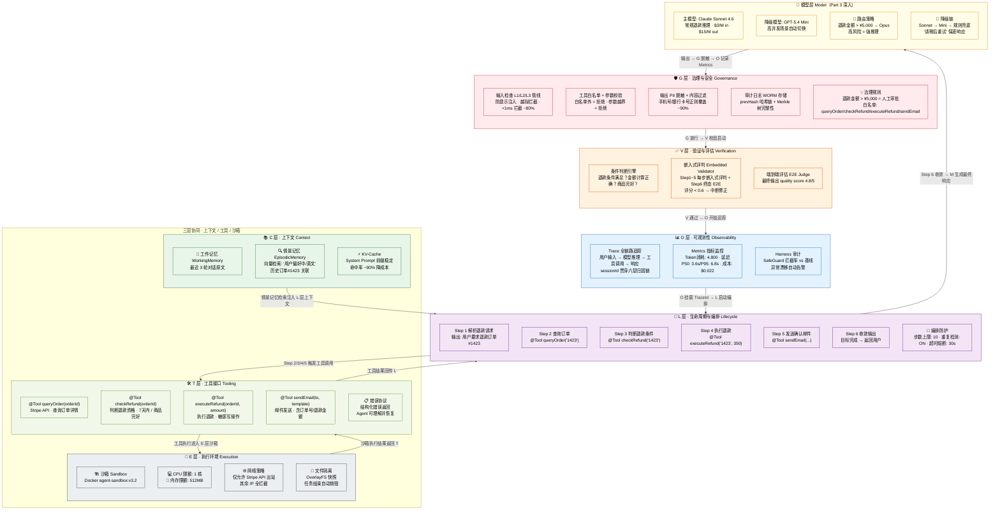
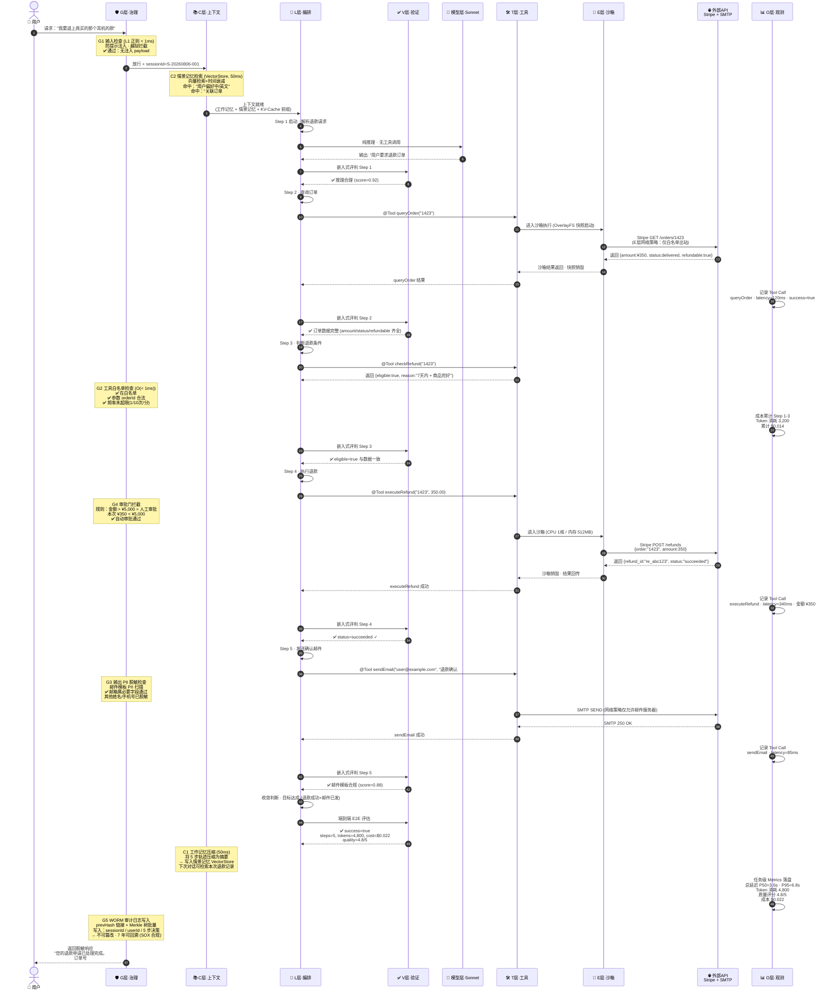
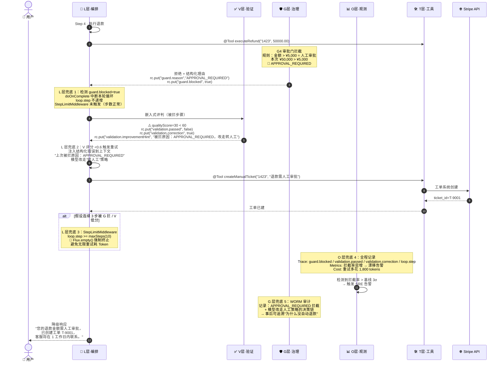

# 第 11 章 全景组装 — ETCLOVG 七层如何协同运转

Part 2 花七章的篇幅把 ETCLOVG 的每一层拆开——G 层治理（Ch10）、V 层验证（Ch9）、O 层可观测性（Ch8）、L 层编排（Ch7）、C 层上下文（Ch6）、T 层工具（Ch5）、E 层执行环境（Ch4）——逐层讲透各自的设计原理和工程决策。拆开容易看清细节，但拆完之后还需要一次"合体"：把这些层装回一台完整的机器，看它们在一次真实的 Agent 任务中如何流转、如何互锁、又如何各自兜底。

本章的理论锚点同样是 J. Li et al., "Agent Harness Engineering: A Survey," CMU / UAB / Tulane / Yale / Northeastern / Stanford / Amazon et al., 2026[^1] 中的 **ETCLOVG 七层协同模式与 harness coupling problem（七层耦合问题——过度耦合导致任意一层改动影响全局）**。本章的核心问题正是：**怎么把七个独立的层组合成一个整体，又不产生耦合病。**

如果你读过 Ch1 的"Harness 即假设"或 Ch3 §3.7 中"五层协同工作的调用时序"，你会知道 Agent 系统的关键难点从来不是某一层单独的能力——而是层与层之间的调用顺序、数据契约和故障兜底边界。本章的答案不是"再发明一个新框架"，而是给出一个退款实例的完整端到端路径、一张七层交互矩阵、一套 AgentScope 组件到四类团队角色的映射，最后落地到一行 ReActAgent `.middleware(List.of(...))` 可运行配置。接下来的全部内容围绕一个具体场景展开：用户要求退款，Agent 从接收指令到完成退款并发送确认邮件，每一步落在 ETCLOVG 的哪一层、由哪个 Middleware 接管、出问题时谁兜底。

***

## 11.1 七层分工：一张退款请求的全景地图

**"用户申请退款，Agent 需要查询订单、判断是否符合退款条件、执行退款、发送确认邮件。"**

这是一个典型的 Agent 工作流——涉及工具调用、上下文管理、安全审批和结果验证。它覆盖了 ETCLOVG 全部七层的交互：G 层审批 ¥350 < ¥5,000 → 自动放行（G 层白名单覆盖 4 个 @Tool + 审批门放行），V 层每步嵌入式评判 + 终态 E2E 评估，O 层 Trace 贯穿 sessionId，L 层 6 步编排熔断，C 层情景记忆检索订单 #1423，T 层 4 个 @Tool 声明签名并调用分发，E 层 Docker 沙箱网络白名单。下面以它为主线，先展示七层在实例中的角色分配，再用端到端时序图走完整条请求路径。

### KP 11.1.1 七层在实例中的角色分配 【构建】



### KP 11.1.2 端到端调用流程：一次退款请求的完整路径 【诊断】



上面的时序图只画了 happy path。但"七层如何各自兜底"才是 Harness 的真正价值——下面这张图展示 Step 4 执行退款失败时，G/L/V/O 四层如何分别兜底，避免"一次失败 → 整条链崩溃"。



这张故障时序图揭示了四层兜底边界：**G 层**拦红线（审批门）、**L 层**管重试与步数熔断（不无限耗 token）、**V 层**给重试提供质量信号（score<0.6 触发）、**O 层**全程记录并基于拦截率漂移告警、**G 层 WORM**保证事后可追溯。任何一层单独失效，其他层仍能兜住——比如 G 层误放了 ¥50,000，V 层 score 仍会低、L 层仍会重试转人工、O 层仍会告警。这就是"harness coupling problem 的反面"：层间松耦合 = 单层失效不传染。

## 11.2 七层协作：交互矩阵、团队分工、组件清单

KP 11.1 把单个请求的流转路径跑通了一次。但要落地到真实团队，还需要回答三个问题：层与层之间的契约是什么？谁负责配置哪一层？每一层在 AgentScope 框架中的对应组件叫什么？本节用一张交互矩阵、一张四类角色×七层组件映射图，以及一份完整的组件速查清单给出答案。

### KP 11.2.1 七层交互矩阵：谁给谁什么，缺了会怎样 【构建】

| 层的交互      | 谁给谁什么                             | 如果没有这一层                      |
| --------- | --------------------------------- | ---------------------------- |
| **E → T** | E 层提供沙箱环境给 T 层的工具调用执行             | executeRefund 直接在宿主机运行——安全灾难 |
| **T → L** | T 层返回工具结果给 L 层，L 层决定下一步           | 工具返回了结果但 Agent 不知道该做什么       |
| **L → C** | L 层触发 C 层的上下文压缩和记忆写入              | 5 步累积上下文溢出窗口                 |
| **C → T** | C 层提供情景记忆（历史订单偏好）给 T 层 queryOrder | 每次对话都是"第一次见面"                |
| **L → V** | L 层每步后触发 V 层的嵌入式评判                | 退错款了才发现                      |
| **V → O** | V 层提供质量评分给 O 层 Metrics            | 不知道 Agent 做得好不好              |
| **O → G** | O 层提供成本异常信号给 G 层的审批门              | ¥50,000 退款也自动通过了             |
| **G → L** | G 层阻止 L 层的某步操作（高风险 → 人工审批）        | Agent 自主撤销了生产服务器             |

这张矩阵的工程落点是 **RuntimeContext 单向数据流契约**——每层只写自己负责的 key、只读上游已写好的 key，禁止跨层直接调用内部方法。这是 harness coupling problem 的解。对齐 codepilot 中各层 Advisor 的真实 key 约定：

```java
/*
 * RuntimeContext 契约：每层只写自己的 key、只读上游 key，层间零直接调用。
 * 代码对齐 ch10 InputGuardAdvisor / ch06 EpisodicMemoryMiddleware / ch09 EmbeddedValidationAdvisor
 * 的真实 rc.put(...) / rc.getExtra().getOrDefault(...) 用法。
 */
// ── G 层写：拦截结果与风险信号（供 L/O 层读） ──
rc.put("guard.blocked", true);                     // G → L：L 层 doOnComplete 检测到则中断循环
rc.put("guard.reason", "L1_JAILBREAK");            // G → L/O：结构化拒绝理由，写审计日志
rc.put("guard.riskScore", 0.72);                   // G → O：累计风险分，O 层 Metrics 聚合

// ── C 层写：记忆检索结果（供 L 层注入 prompt） ──
rc.put("episodic.hit", "用户偏好中/英文;订单#1423"); // C → L：L 层把它拼入推理上下文
rc.put("memory.compacted", true);                  // C → O：是否触发压缩，O 层记 Metrics

// ── L 层写：编排状态（供 V/O 层读） ──
rc.put("loop.step", 4);                            // L → V/O：当前步数，V 层评判带步号
rc.put("loop.tool.name", "executeRefund");         // L → G/O：当前工具，G 层 onActing 做工具检查

// ── V 层写：评分与重试/拒绝信号（供 L/O 层读） ──
//   真实 key 对齐 ch09 EmbeddedValidationAdvisor.handleValidationFailure 的三档策略
rc.put("validation.passed", true);                 // V → L/O：本步是否通过三重检查
rc.put("validation.qualityScore", 88.0);           // V → L/O：质量分（满分 100，<60 触发修正）
rc.put("validation.retry", true);                  // V → L：格式问题→请求重试（最多 3 次）
rc.put("validation.retryHint", "JSON 必须以 { 开头"); // V → L：注入到下一轮上下文的修正提示
rc.put("validation.correction", true);             // V → L：质量问题→注入改进提示
rc.put("validation.improvementHint", "请提供更详细完整的回答");
rc.put("validation.blocked", true);                // V → L：安全问题→直接终止循环
rc.put("validation.reason", "SECURITY_VIOLATION"); // V → L/O：结构化拒绝理由
rc.put("validation.e2e", "success=4.8/5");         // V → O：终态 E2E 评分写 Metrics

// ── O 层只读：聚合所有 key 写 Trace/Metrics，不产出业务 key ──
// TracerMiddleware 读 sessionId/guard.*/loop.*/validation.* → 串联成六层归因链
```

这个契约的纪律性体现在两点：① 任一层升级自己的 key 命名/结构，只要保持向后兼容，其他层无需改代码；② 新增一层（如未来加 R 层风险自适应）只需声明自己读/写哪些 key，不必修改既有层——这就是"逐层可升级"的工程基础。

### KP 11.2.2 角色分工与 AgentScope 组件映射 【构建】

```mermaid
graph TB
    %% ========== 上半部分：四类角色 ==========
    subgraph ROLE["👥 四类角色分工 — 谁负责什么"]
        direction TB
        subgraph R1["🧑‍💻 Harness 工程师<br/><i>七层架构的总设计者</i>"]
            R1_1["✅ 设计和调优七层 Middleware 配置<br/>每层组件选型与顺序编排"]
            R1_2["✅ 监控 Middleware 漂移<br/>G 层拦截率 / C 层命中率 / L 层步数"]
            R1_3["✅ 响应七层告警<br/>成本超限 / 熔断触发 / 性能劣化"]
        end
        subgraph R2["👨‍💻 Agent 开发者<br/><i>Agent 能力的构建者</i>"]
            R2_1["✅ 编写 @Tool 实现<br/>T 层 queryOrder / executeRefund 等"]
            R2_2["✅ 配置 System Prompt<br/>角色定义 + 风格约束 + 禁止项"]
            R2_3["✅ 评估 Agent 输出质量<br/>V 层评测集构建与准确率跟踪"]
        end
        subgraph R3["👷 SRE / 运维<br/><i>生产稳定性的守护者</i>"]
            R3_1["✅ 监控 SLO 服务等级目标<br/>可用性 > 99% · P95 延迟 < 30s · 质量 > 3.5/5"]
            R3_2["✅ 处理 L 层熔断告警<br/>连续失败 N 次自动中断并通知"]
            R3_3["✅ 执行版本回滚操作<br/>模型 / Middleware / @Tool 发布故障回退"]
        end
        subgraph R4["🛡️ 安全 / 合规团队<br/><i>红线与合规的把关人</i>"]
            R4_1["✅ 维护 G 层 YAML 策略文件<br/>constitution.yml 规则 + 审批门阈值"]
            R4_2["✅ 审查 G 层审计日志<br/>WORM 存储 · 定期合规抽查 · 异常溯源"]
            R4_3["✅ 产出行业合规报告<br/>SOX（金融）/ HIPAA（医疗）/ GDPR（欧盟）"]
        end
        R1 ---|"日常协作"| R2 ---|"发布&值班"| R3 ---|"合规审查"| R4
    end

    %% ========== 中间分隔 ==========
    ROLE -->|"四层角色负责配置，对应到以下七层组件"| ETCLOVG

    %% ========== 下半部分：七层 + 组件来源 ==========
    subgraph ETCLOVG["🧩 七层组件速查 — 三类来源：内置 / 扩展 / 示例 ★"]
        direction TB

        subgraph L_G["🛡️ G 层 · 治理与安全"]
            direction LR
            G_A["InputGuardMiddleware ★<br/><i>输入提示注入检测（ch10）</i>"]
            G_B["OutputGuardMiddleware ★<br/><i>输出 PII 脱敏（ch10）</i>"]
            G_C["ToolPolicyMiddleware ★<br/><i>工具白名单+审批门（ch10）</i>"]
            G_D["SafeGuardMiddleware ★<br/><i>G 层总入口·三检查点（ch08）</i>"]
        end

        subgraph L_V["✅ V 层 · 验证与评估"]
            direction LR
            V_A["ReadinessCheckAdvisor ★<br/><i>前置就绪检查（ch09）</i>"]
            V_B["EmbeddedValidationAdvisor ★<br/><i>每步嵌入式评判（ch09）</i>"]
            V_C["RegressionEvaluator ★<br/><i>离线回归评测（ch11）</i>"]
        end

        subgraph L_O["📊 O 层 · 可观测性"]
            direction LR
            O_A["TracerMiddleware ★<br/><i>链路追踪（ch08）</i>"]
            O_B["TracePropagator ★<br/><i>跨进程 Trace 传播（ch08）</i>"]
            O_C["CostAttributionMiddleware ★<br/><i>Token 成本归因（ch08）</i>"]
            O_D["EventLogRecorder ★<br/><i>事件日志（ch08）</i>"]
        end

        subgraph L_L["🔄 L 层 · 生命周期与编排"]
            direction LR
            L_A["ReActOrchestrator ★<br/><i>ReAct 循环控制（ch07）</i>"]
            L_B["PipeReActOrchestrator ★<br/><i>Pipeline ReAct 编排（ch07）</i>"]
            L_C["StepLimitMiddleware ★<br/><i>步数熔断（ch01）</i>"]
        end

        subgraph L_CTE["📚🛠️🐳 C / T / E 三层并列"]
            direction LR
            subgraph L_C["📚 C 层 · 上下文"]
                direction TB
                C_A["MessageChatMemoryMiddleware ★<br/><i>工作记忆（ch02/ch05）</i>"]
                C_B["VectorStoreChatMemoryMiddleware ★<br/><i>情景记忆（ch06）</i>"]
                C_C["ContextCompactor ★<br/><i>上下文压缩（ch06）</i>"]
                C_D["WorkingMemoryManager ★<br/><i>记忆刷新+衰减维护（ch06）</i>"]
            end
            subgraph L_T["🛠️ T 层 · 工具"]
                direction TB
                T_A["@Tool 注解 ✦<br/><i>声明工具签名</i>"]
                T_B["ToolCallingMiddleware ★<br/><i>调用分发执行（ch02）</i>"]
                T_C["DynamicToolRegistry ★<br/><i>动态工具/MCP 注册（ch05）</i>"]
                T_D["SkillCuratorMiddleware ✦<br/><i>Skill 动态加载</i>"]
            end
            subgraph L_E["🐳 E 层 · 执行"]
                direction TB
                E_A["DockerSandboxClient ✦<br/><i>Docker 沙箱客户端（ch04）</i>"]
                E_B["SandboxAdvisor ★<br/><i>执行前权限检查（ch04）</i>"]
                E_C["CompositeFileSystemAdapter ★<br/><i>工作区挂载（ch04）</i>"]
                E_D["SandboxPool ★<br/><i>沙箱创建+销毁池（ch04）</i>"]
                E_E["CheckpointManager ★<br/><i>快照回滚</i>"]
            end
        end
    end

    %% ========== 角色 → 七层 对应关系 ==========
    R1 -->|"主负责：配置顺序 / 漂移监控"| L_L & L_C & L_O
    R2 -->|"主负责：工具 + Prompt + 评测"| L_T & L_V & L_CTE
    R3 -->|"主负责：SLO / 熔断 / 回滚"| L_L & L_O
    R4 -->|"主负责：策略 YAML / 审计 / 合规"| L_G

    %% ========== 图例 ==========
    subgraph LEGEND["📖 组件来源图例"]
        direction LR
        LG["★ = CodePilot 示例组件<br/>本书配套仓库，<b>未随 AgentScope 发布</b><br/>实际项目需按同样模式自行实现"]
        LE["✦ = AgentScope 框架真实提供<br/>✦ 普通 = Core 内置<br/>✦ harness = agentscope-harness 扩展模块"]
    end

    %% ========== 样式 ==========
    classDef role1 fill:#e3f2fd,stroke:#1565c0,color:#000
    classDef role2 fill:#e8f5e9,stroke:#2e7d32,color:#000
    classDef role3 fill:#fff3e0,stroke:#e65100,color:#000
    classDef role4 fill:#ffebee,stroke:#c62828,color:#000
    classDef g fill:#ffebee,stroke:#c62828
    classDef v fill:#fff3e0,stroke:#e65100
    classDef o fill:#e3f2fd,stroke:#1565c0
    classDef l fill:#f3e5f5,stroke:#6a1b9a
    classDef c fill:#e8f5e9,stroke:#2e7d32
    classDef t fill:#f1f8e9,stroke:#558b2f
    classDef e fill:#eceff1,stroke:#37474f

    class R1,R1_1,R1_2,R1_3 role1
    class R2,R2_1,R2_2,R2_3 role2
    class R3,R3_1,R3_2,R3_3 role3
    class R4,R4_1,R4_2,R4_3 role4
    class L_G,G_A,G_B,G_C,G_D g
    class L_V,V_A,V_B,V_C v
    class L_O,O_A,O_B,O_C,O_D o
    class L_L,L_A,L_B,L_C l
    class L_C,C_A,C_B,C_C,C_D c
    class L_T,T_A,T_B,T_C,T_D t
    class L_E,E_A,E_B,E_C,E_D,E_E e
```



七层组件速查：

> **重要说明**：以下组件分为三类——
> (1) AgentScope Core 真实内置的组件：`ReActAgent`、`Toolkit`、`Model`、`MiddlewareBase`、`@Tool`、`@ToolParam`、`TaskReminderMiddleware`、`GracefulShutdownMiddleware`、`DynamicSkillMiddleware` 等；
> (2) `agentscope-harness` 扩展模块提供的组件：`PlanModeMiddleware`、`InboxMiddleware`、`SubagentsMiddleware`、`SkillCuratorMiddleware`、`WorkspaceContextMiddleware`、`HarnessRuntimeMiddleware`、`AsyncToolMiddleware`、`ToolResultEvictionMiddleware`、`DockerSandboxClient` 等；
> (3) CodePilot 示例组件（本书配套仓库 ch01-ch18 中用于演示 ETCLOVG 架构的设计模式，**未随 AgentScope 发布**）：`SafeGuardMiddleware`、`InputGuardMiddleware`、`OutputGuardMiddleware`、`ToolPolicyMiddleware`、`ToolCallingMiddleware`、`ReActOrchestrator`、`StepLimitMiddleware`、`CostAttributionMiddleware`、`TracerMiddleware`、`MessageChatMemoryMiddleware`、`VectorStoreChatMemoryMiddleware`、`ContextCompactor`、`EmbeddedValidationAdvisor`、`RegressionEvaluator` 等。
> 文中涉及 (3) 的代码均对齐 codepilot 配套仓库真实实现，实际项目中需按同样模式自行实现。

- **G 层**（ch08 总入口 + ch10 检查点 + ch05 工具策略）：SafeGuardMiddleware ★（ch08）、InputGuardMiddleware ★（ch10）、OutputGuardMiddleware ★（ch10）、ToolPolicyMiddleware ★（ch05）
- **V 层**（ch09/ch11）：ReadinessCheckAdvisor ★、EmbeddedValidationAdvisor ★、RegressionEvaluator ★
- **O 层**（ch08）：TracerMiddleware ★、TracePropagator ★、CostAttributionMiddleware ★、EventLogRecorder ★
- **L 层**（ch07/ch01）：ReActOrchestrator ★、PipeReActOrchestrator ★、StepLimitMiddleware ★
- **C 层**（ch06/ch02/ch05）：MessageChatMemoryMiddleware ★、VectorStoreChatMemoryMiddleware ★、ContextCompactor ★、WorkingMemoryManager ★
- **T 层**（ch02/ch05）：@Tool ✦ + ToolCallingMiddleware ★ + DynamicToolRegistry ★ + SkillCuratorMiddleware ✦
- **E 层**（ch04）：DockerSandboxClient ✦ + SandboxAdvisor ★ + CompositeFileSystemAdapter ★ + SandboxPool ★ + CheckpointManager ★

> ★ = CodePilot 示例组件（非 AgentScope 内置）
> ✦ = AgentScope 或 agentscope-harness 真实提供

把上面的角色分工与七层组件落到代码上，组装方式如下：

```java
// 七层 Middleware 组装——把"角色分工"落到一行 ReActAgent 配置（KP 11.3.1 的速览版）
// 顺序即执行语义：入站正向、出站逆向；G 层用单一 SafeGuard 总入口（内部覆盖 Input/Output/ToolPolicy）
// 真实 API：.middlewares()（复数）；E 层 SandboxAdvisor 用 onActing 钩子包裹工具执行（注册在 T 前）
ReActAgent harnessAgent = ReActAgent.builder()
    .model(modelRef)
    .toolkit(toolkit)
    .middlewares(List.of(
        new SafeGuardMiddleware(),                  // G 层：总入口（输入/输出/工具三检查点）
        new MessageChatMemoryMiddleware(mem),       // C 层：工作记忆
        new VectorStoreChatMemoryMiddleware(vs),    // C 层：情景记忆
        new ContextCompactor(),                     // C 层：上下文压缩
        new SandboxAdvisor(sandboxConfig),          // E 层：沙箱隔离（onActing 注入 sandbox.* 配置）
        new ToolCallingMiddleware(tools),           // T 层：工具调用分发
        new ReActOrchestrator(),                    // L 层：ReAct 编排循环
        new StepLimitMiddleware().maxSteps(25),     // L 层：步数熔断
        new EmbeddedValidationAdvisor(),            // V 层：嵌入式评判（运行时，每步打分）
        // 注：RegressionEvaluator 是离线批量回归评测（@Component，非 MiddlewareBase），
        //     由 CI/定时任务调用，不进每请求链——见 KP 11.3.1 末说明。
        new TracerMiddleware(),                     // O 层：链路追踪
        new CostAttributionMiddleware()             // O 层：成本归因
    ))
    .build();
```

> 成本 $0.022 基于 Claude Sonnet 4.6 标准定价[^2]（$3/M input, $15/M output），输入约 4,200 tokens（$3/M × 4,200 = $0.0126）+ 输出约 600 tokens（$15/M × 600 = $0.009），合计 $0.0216 ≈ $0.022。实际费用因 KV-cache 命中率和 Prompt 压缩策略而异。

***

## 11.3 七层合体：一次性搭建完整 Harness

前面用退款场景展示了"为什么需要七层"，用交互矩阵理清了"谁和谁交互"，用组件映射对齐了"每个层由谁负责"。现在落实到工程上，本节给出完整的 AgentScope ReActAgent 配置，一次性注册全部七层 Middleware。

### KP 11.3.1 完整配置：七层 Middlewares 一次性注册 【构建】

代码对齐 [codepilot/ch11-etcclovg/HarnessAssemblyConfig.java](file:///Users/zxc/Documents/ai/agent-harness/codepilot/ch11-etcclovg/src/main/java/io/etclovg/codepilot/etcclovg/HarnessAssemblyConfig.java) 与 [FullHarnessConfig.java](file:///Users/zxc/Documents/ai/agent-harness/codepilot/ch11-etcclovg/src/main/java/io/etclovg/codepilot/etcclovg/FullHarnessConfig.java)。两者分工：`FullHarnessConfig` 是 `@ConfigurationProperties` 属性持有者（七层开关 + 各层参数），`HarnessAssemblyConfig` 是 `@Configuration` 装配入口（把七层 Middleware Bean 按 G→C→E→T→L→V→O 注册到 ReActAgent）。

```java
/*
 * 框架：Java SE 21+ + AgentScope 2.x
 * 环境：JDK 21+, Spring Boot 3.5+
 *
 * 三层代码（与 Ch10 锚点块格式对齐）：
 *   ① 类声明 @Configuration + 装配入口（构造注入 FullHarnessConfig 属性）
 *   ② 核心方法 harnessAgent(...) 显式列出 11 个 Middleware（七层全开时）
 *   ③ 按 FullHarnessConfig 开关动态裁剪（关闭某层 = 跳过该层 Middleware）
 *
 * 装配顺序的执行语义（入站正向、出站逆向）：
 *   SafeGuard(G) → MessageChatMemory(C) → VectorStoreChatMemory(C) → ContextCompactor(C)
 *     → SandboxAdvisor(E) → ToolCalling(T) → ReActOrchestrator(L) → StepLimit(L)
 *     → EmbeddedValidation(V)
 *     → Tracer(O) → CostAttribution(O)
 * E 层 SandboxAdvisor 用 onActing 钩子包裹工具执行——注册在 T 层之前，使每次工具调用前
 * 先注入 sandbox.* 隔离配置（镜像/CPU/内存/网络白名单），工具执行完 doFinally 清理沙箱。
 *
 * V 层拆分：运行时只有 EmbeddedValidationAdvisor 进链（每步打分）；
 *   RegressionEvaluator 是离线批量回归评测（@Component，非 MiddlewareBase），
 *   由 CI/定时任务调用 evaluate(suiteId)，不进每请求链——否则每请求跑百例套件不可接受。
 *
 * 跨模块依赖：各层具体 Middleware 实现位于 ch01-ch10：
 *   G(ch08 SafeGuard 总入口 + ch10 检查点) / C(ch06) / E(ch04 SandboxAdvisor) / T(ch02,ch05) / L(ch07,ch01) / V(ch09) / O(ch08)
 * 本类以 MiddlewareBase（agentscope-core 接口）+ @Qualifier 注入具体 Bean，
 * 编译期仅需 agentscope-core；ch11-etcclovg 在 pom 中声明 ch01-ch10 依赖以提供运行期实现 Bean，
 * 层间仍通过接口 + Qualifier 松耦合（不直接 import 各层实现类）。
 *
 * 真实 API：ReActAgent.builder().model(...).toolkit(...).middlewares(List.of(...)).build()
 *   注意是 .middlewares()（复数），非 .middleware()（单数）。
 * G 层用单一 SafeGuard 总入口（内部组合 Input/Output/ToolPolicy 三检查点），
 * 注册在首位：入站最先做输入检查、出站最后做输出检查（出站逆向 = 链尾先触发）。
 */
@Configuration
public class HarnessAssemblyConfig {                       // ── ① 类声明：@Configuration 装配入口 ──

    private final FullHarnessConfig config;                // @ConfigurationProperties 属性持有者

    public HarnessAssemblyConfig(FullHarnessConfig config) {
        this.config = config;
    }

    // ── ② 核心方法：七层 Middleware 装配，每个 @Qualifier 指向 ch01-ch10 的具体 Bean ──
    @Bean
    public ReActAgent harnessAgent(
            @Qualifier("modelRef") String modelRef,
            Toolkit toolkit,
            @Qualifier("safeGuard")       MiddlewareBase safeGuard,       // G  ch08 SafeGuardMiddleware（总入口，内部委托 ch10 检查点）
            @Qualifier("workingMemory")   MiddlewareBase workingMemory,   // C  MessageChatMemoryMiddleware
            @Qualifier("episodicMemory")  MiddlewareBase episodicMemory,  // C  VectorStoreChatMemoryMiddleware
            @Qualifier("compactor")       MiddlewareBase compactor,       // C  ContextCompactor
            @Qualifier("sandboxAdvisor")  MiddlewareBase sandboxAdvisor,  // E  ch04 SandboxAdvisor（onActing 注入 sandbox.* 隔离配置）
            @Qualifier("toolCalling")     MiddlewareBase toolCalling,     // T  ToolCallingMiddleware
            @Qualifier("orchestrator")    MiddlewareBase orchestrator,    // L  ReActOrchestrator
            @Qualifier("stepLimit")       MiddlewareBase stepLimit,       // L  StepLimitMiddleware
            @Qualifier("validator")       MiddlewareBase validator,       // V  EmbeddedValidationAdvisor（运行时嵌入式评判）
            @Qualifier("tracer")          MiddlewareBase tracer,          // O  TracerMiddleware
            @Qualifier("costTracker")     MiddlewareBase costTracker) {   // O  CostAttributionMiddleware

        List<MiddlewareBase> chain = new ArrayList<>();    // ── ③ 按开关动态裁剪 ──

        // ═══════ G 层：第一道防线（总入口，内部含 Input/Output/ToolPolicy） ═══════
        if (config.isGovernanceEnabled()) {
            chain.add(safeGuard);
        }
        // ═══════ C 层：为模型准备背景 ═══════
        if (config.isContextEnabled()) {
            chain.add(workingMemory);     // 工作记忆——最近 N 轮对话原文
            chain.add(episodicMemory);    // 情景记忆——向量检索历史相关任务
            chain.add(compactor);         // 上下文压缩——窗口溢出时自动摘要
        }

        // ═══════ E 层：执行环境（沙箱，注册在 T 前——onActing 先于工具分发注入隔离配置） ═══════
        if (config.isExecutionEnabled()) {
            chain.add(sandboxAdvisor);    // 沙箱隔离——onActing 注入 sandbox.* 配置，doFinally 清理
        }

        // ═══════ T 层：声明可调用能力 ═══════
        if (config.isToolingEnabled()) {
            chain.add(toolCalling);       // 注册所有 @Tool Bean，处理工具调用请求
        }
        // ═══════ L 层：控制执行流程 ═══════
        if (config.isLifecycleEnabled()) {
            chain.add(orchestrator);      // ReAct——规划→执行→观察→收敛循环
            chain.add(stepLimit);         // 步数熔断——超出 maxSteps 自动中断
        }
        // ═══════ V 层：事后验证（运行时仅嵌入式评判） ═══════
        if (config.isVerificationEnabled()) {
            chain.add(validator);         // 嵌入式验证——每步输出质量评分，<阈值触发重试/中断
            // RegressionEvaluator 不进链：它是 @Component 离线评测器（非 MiddlewareBase），
            // 由 CI/定时任务调用 evaluate("eval-v1.json") 跑回归套件，对比基线检测劣化信号。
        }
        // ═══════ O 层：全程可观测 ═══════
        if (config.isObservabilityEnabled()) {
            chain.add(tracer);            // 链路追踪——sessionId 贯穿全链路
            chain.add(costTracker);       // 成本归因——追踪 Token 消耗和费用累计
        }

        return ReActAgent.builder()
                .name("codepilot-full-harness")
                .model(modelRef)
                .toolkit(toolkit)
                .middlewares(List.copyOf(chain))   // 注册顺序 = 执行语义：入站正向、出站逆向
                .build();
    }
}
```

> **为什么用单一** **`SafeGuard`** **而不是拆 Input/Output/ToolPolicy 三个 Middleware？** 因为 AgentScope 的 Middleware 链是"入站正向、出站逆向"——若把 InputGuard 放链首、OutputGuard 放链尾，两者虽然各得其所，但 ToolPolicyGuard 该放哪？放 T 层前后都会打破"G 层集中治理"的语义。真实代码库的解法是 [SafeGuardMiddleware](file:///Users/zxc/Documents/ai/agent-harness/codepilot/ch08-observability/src/main/java/io/etclovg/codepilot/observability/SafeGuardMiddleware.java) 作为 G 层总入口，在 `onAgent` 入站做输入检查（防提示注入，`next.apply` 之前）、`doOnNext` 出站做输出检查（SQL 注入 + PII，`next.apply` 之后）、`onActing` 做工具白名单检查——一个 Middleware 内部覆盖三检查点，注册在链首即可同时满足"输入最先拦、输出最后拦"。（KP 11.2.2 末尾列出了 11 个 Middleware 各自一行，KP 11.3.2 解释了 G 层使用单一 SafeGuard 而非拆三个 Middleware 的原因——两者描述的是同一条链，统一为 `SafeGuard(G) → C → E → T → L → V → O`。）

> **为什么 V 层只注册** **`EmbeddedValidationAdvisor`，不注册** **`RegressionEvaluator`？** 二者职责不同：`EmbeddedValidationAdvisor` 是**运行时**嵌入式评判——继承 `AbstractLayerMiddleware`，挂在每步 `doOnComplete` 后对单步输出打分（< 0.6 触发重试/中断），延迟可控（毫秒级），适合进每请求链；`RegressionEvaluator` 是**离线**批量回归评测——普通 `@Component`，`evaluate(suiteId)` 要跑整套基线用例（如 100 例），耗时分钟级，**不可能**在每次用户请求里执行。把 `RegressionEvaluator` 塞进 `.middlewares()` 既是类型错误（它不实现 `MiddlewareBase`），也是语义错误（每请求跑百例套件，延迟与成本不可接受）。正确做法：运行时链只放 `EmbeddedValidationAdvisor`，`RegressionEvaluator` 由 CI/定时任务在发版前调用——这与 Ch8 的结论一致（"`Middleware` 链应只放 `AbstractLayerMiddleware` 子类，独立 Service Bean 单独注入"）。

### KP 11.3.2 执行顺序解读：为什么是 G → C → E → T → L → V → O 【构建】

这个注册顺序每一步都有明确的工程理由。

**G 层必须第一个**。输入进入 Harness 做的第一件事不是让模型思考，而是检查这段输入是否安全。提示注入、越狱尝试、恶意 payload——这些必须在模型看到输入之前拦截。如果 G 层不是第一位，一个 `ignore previous instructions` 攻击就可能在 G 层生效前已经影响了 C 层的记忆加载结果。

**C 层紧随 G 层之后**。输入安全后，第二步是加载上下文——工作记忆（最近对话）、情景记忆（历史相关任务）、上下文压缩（防止窗口溢出）。模型在"看到"用户输入之前，需要先被喂饱背景信息。记忆加载的顺序也重要：先加载工作记忆（快，< 5ms），再检索情景记忆（需要向量搜索，50-200ms），最后决定是否需要压缩。

**E 层在 C 和 T 之间**。E 层（`SandboxAdvisor`）不参与入站 `onAgent` 阶段——它用的是 `onActing` 钩子，只在工具实际执行时触发。注册在 T 层之前，是为了保证 `onActing` 钩子的触发顺序：E 层先注入 `sandbox.image`/`sandbox.cpu`/`sandbox.memory_mb`/`sandbox.network` 等隔离配置到 RuntimeContext，T 层的 `ToolCallingMiddleware` 再分发工具调用——工具执行时沙箱配置已就绪。若 E 层在 T 层之后注册，工具分发时沙箱配置尚未注入，`executeRefund` 可能在未隔离的环境中运行。E 层的 `doFinally` 在工具执行后清理沙箱（销毁容器/释放资源），是 E 层自己的收尾兜底。

**T 层在 E 层之后**。这里要区分两个时刻：**工具注册**（T 层 Middleware 在入站时把 @Tool 的 schema 注入 `Toolkit`/系统提示）发生在模型第一次推理**之前**；**工具执行**（L 层循环中模型选了某工具后实际调用）发生在推理**之中**。T 层必须排在 L 层之前，是因为 L 层的第一次推理就需要"模型能看到哪些工具"——若 T 层在 L 层之后注册，第一轮推理时模型看到空工具列表，要么拒绝调用、要么 hallucinate 一个不存在的工具。所以顺序是：T 层先注册工具 schema → L 层 orchestrator 启动循环 → 循环内模型基于可见工具做选择。T 层不需要 C 层的记忆信息，所以放在 C 层之后即可。

**L 层控制循环**。ReAct 编排（`ReActOrchestrator`/`PipeReActOrchestrator`）和步数熔断（`StepLimitMiddleware`）本质上是"过程控制"——它们不参与单次推理，而是管理"推理→工具调用→观察→再推理"这个循环。放在 T 层之后，因为循环中包含了工具调用；放在 V 层之前，因为每一步的循环决策在验证之前做出。`StepLimitMiddleware` 在入站时设置 `maxSteps` 上限，循环每走一步 `loop.step++`，超出即 `Flux.empty()` 终止——这是 L 层自己的兜底，不依赖 V/O。

**V 层在模型输出后**。嵌入式验证和回归评估检查的是"模型产出了什么"——它们不需要在模型推理之前运行。放在 L 层之后，确保每次循环迭代的输出都经过质量检查。如果 V 层评分低于阈值，可以触发重新推理或中断循环。

**V → L 重试契约：评分 <0.6 时如何让 L 层"再来一次"而不无限循环。** 这就是 KP 11.1.2 故障时序图里"L 层兜底 2：V 评分 <0.6 触发重试"的工程落点。V 层 [`EmbeddedValidationAdvisor`](file:///Users/zxc/Documents/ai/agent-harness/codepilot/ch09-evaluation/src/main/java/io/etclovg/codepilot/evaluation/EmbeddedValidationAdvisor.java) 在 `onAgent` 的 `doOnComplete` 钩子（每步输出后）跑三重检查（安全/格式/质量），综合分 < 60（即归一化 < 0.6）时按问题性质写三组不同的 `validation.*` key 到 `RuntimeContext`，L 层 [`ReActOrchestrator`](file:///Users/zxc/Documents/ai/agent-harness/codepilot/ch07-orchestration/src/main/java/io/etclovg/codepilot/orchestration/ReActOrchestrator.java) 在**下一轮** **`onAgent`** **入口**读这些 key 决定怎么走：

| V 层判定（写 key）                                                       | L 层下一轮入口的行为                                         | 兜底                                                                 |
| ------------------------------------------------------------------ | --------------------------------------------------- | ------------------------------------------------------------------ |
| `validation.blocked=true` + `validation.reason=SECURITY_VIOLATION` | 安全问题——`buildTerminatedResponse` 终止循环，不再重试           | G 层 WORM 审计 + O 层告警                                                |
| `validation.retry=true` + `validation.retryHint="..."`             | 格式问题——把 `retryHint` 作为结构化错误注入推理上下文，模型基于 hint 重新生成   | `retryCounters` 计数，超过 `MAX_RETRIES=3` 转为 `MAX_RETRIES_EXCEEDED` 拒绝 |
| `validation.correction=true` + `validation.improvementHint="..."`  | 质量问题——把 `improvementHint` 注入下一轮 prompt，模型基于 hint 改进 | 重试步数仍计入 `loop.step`，超出 `maxSteps` 由 `StepLimitMiddleware` 兜底       |

这套契约的关键纪律是**单向数据流**：V 层只写 `validation.*`、L 层只读 `validation.*`——V 层不直接调 L 层的 `retry()` 方法，L 层也不感知 V 层内部的三重检查实现。这意味着：① 把 `EmbeddedValidationAdvisor` 换成另一个 V 层实现（如 LLM-as-Judge），只要仍写 `validation.retry/correction/blocked` 三个 key，L 层零改动；② 把 `ReActOrchestrator` 换成 `PipeReActOrchestrator`，只要仍读这三个 key，V 层零改动。这就是"harness coupling problem 的反面"在 V↔L 之间的具体兑现。

> **为什么不让 V 层自己重试，而要把信号交给 L 层？** 因为 V 层是"评判者"不是"编排者"——它没有循环控制权，不知道当前是第几步、是否已超 `maxSteps`、是否已经连续失败到该熔断。重试步数计入 `loop.step`、与 `StepLimitMiddleware`/熔断器联动，这些是 L 层的职责。V 层只负责"这步合格吗"的判定，把判定结果写成结构化 key 交给 L 层决策——这是 KP 11.2.1 RuntimeContext 单向数据流契约的纪律性体现。

**O 层贯穿全链路**。日志和成本追踪需要记录一切——从输入到输出、从 G 层拦截到 V 层评分。但在 AgentScope 的 Middleware 链中，入站顺序和出站顺序相反——O 层注册在最后，意味着它的 `before` 钩子在最后执行（此时前面各层的准备工作已完成），但它的 `after` 钩子最先执行（可以捕获后面所有层的返回结果）。这使得 O 层成为全链路事件的末尾观测者——入站靠后"看到"前面各层已完成准备工作，出站靠前"捕获"后面各层的返回结果。

### KP 11.3.3 配完就跑：七层最小配置速查 【构建】

写完上面的 ReActAgent Bean，你需要为每个 Middleware 设置最小可运行值。以下是一张"配完就能跑"的检查清单：

| 层     | Middleware      | 最小配置项                 | 建议值                                     | 不配的后果                    |
| ----- | --------------- | --------------------- | --------------------------------------- | ------------------------ |
| **G** | inputGuard      | `rejectionPatterns`   | `["ignore.*instruction", "DAN.*mode"]`  | 提示注入直接命中模型               |
| **G** | outputGuard     | `piiPatterns`         | `["\\b\\d{11}\\b", "\\b\\d{16,19}\\b"]` | 用户手机号/银行卡号泄露             |
| **G** | toolPolicyGuard | `blockedTools`        | `["DROP", "DELETE", "rm "]`             | Agent 删库只需一次成功的工具调用      |
| **C** | workingMemory   | `maxMessages`         | `20`                                    | 上下文无限膨胀，第 10 轮后行为故障      |
| **C** | episodicMemory  | `similarityThreshold` | `0.75`                                  | 检索过多噪音，情景记忆失效            |
| **C** | compaction      | `triggerTokenCount`   | `8000`                                  | 超出上下文窗口，模型"忘记"角色         |
| **T** | toolCalling     | `maxToolCalls`        | `15`                                    | Agent 无限循环调用工具，成本失控      |
| **L** | orchestrator    | `maxSteps`            | `10`                                    | 一个任务跑 100 步不停，Token 账单爆炸 |
| **L** | orchestrator·熔断 | `failureThreshold`    | `3`                                     | 连续失败不中断，资源空耗             |
| **V** | validator       | `minScore`            | `0.6`                                   | 不检查输出质量，劣化无声蔓延           |
| **V** | evaluator（离线）   | `baselineDataset`     | `eval-v1.json`                          | 不知道改好了还是改坏了（CI/定时跑，非每请求） |
| **O** | logger          | `logLevel`            | `INFO`                                  | 出问题时零信息——只能靠猜测排错         |
| **O** | costTracker     | `maxCostPerTask`      | `$0.50`                                 | 一觉醒来 API 账单多 $200        |

> 每一项的深层原理和调优策略，见 Part 2 对应章节：G 层 → Ch10、C 层 → Ch6、T 层 → Ch5、L 层 → Ch7、V 层 → Ch9、O 层 → Ch8。

完成这张清单后，Agent 就有一个可运行的七层 Harness。它不能保证单层做到极致，但确保每一层都有明确的配置控制点，且层间通过 RuntimeContext 单向数据流解耦。

### KP 11.3.4 这个配置是 Part 3 各章的起点 【构建】

以上完整配置建立了全栈 Harness 的骨架。但从"能跑"到"跑得好"，还有大量工程深度可以挖掘——这就是 Part 3 的任务。

**接下来四章分别深入四个维度，每一项都可以单独升级而不影响其他层：**

- **Ch12 模型层**：模型路由（简单任务用轻量模型、复杂任务用强模型）、模型降级链（主模型不可用时自动切换）、KV-cache 优化（Key-Value Cache——LLM 推理时缓存已计算的注意力键值对，复用前缀可大幅减少重复计算）。System Prompt 前缀缓存可降低 90% 输入成本。不需要改任何 Middleware 代码——只换 `Model` 的实现类。
- **Ch13 数据/知识/工具制造**：构建高质量的 @Tool 实现——不只是写 `@Tool(description="...")`，而是设计工具的降级策略、重试机制、幂等性保证。T 层从"能调用"到"调不坏"。
- **Ch14 推理与规划**：在 L 层的 PipeReAct 基础上升级到 Plan-and-Solve、Tree-of-Thought、自我反思等高级策略。L 层从"单循环"到"策略可选"。
- **Ch15 多 Agent 协作**：从单个 ReActAgent 扩展到多 Agent 系统——角色分工、消息传递、共享记忆、冲突仲裁。G-C-T-L-V-O 六层不变，但每层都要适配多 Agent 的协作场景。

不需要一次把所有维度都做到极致。Harness 工程的核心性质是**逐层可升级**——今天只优化模型路由，其他层照常运行；下周只升级工具制造，模型层不受影响。这个配置是起点——它不替你做决策，但确保每一层的决策都有一个清晰、隔离的落点。

***

## 11.4 全景延伸：行业实现、扩展点、工程最佳实践

KP 11.3 已经把一行 ReActAgent 配置落到可运行状态。本节覆盖真实生产中的三个问题：行业标杆的实现方式、社区概念（subAgent/Skill/AGENTS.md）在七层上的对应位置、以及两个来自 Claude Code 的进阶工程化实践（assemble/model/execute 三段注入和工具池五步流水线）。这些内容不在 ETCLOVG 七层骨架中，但来自两个有公开文档的生产级实现，对落地有参考价值。

### KP 11.4.1 行业实现：三个生产级 Harness 实践 【诊断】

截至 2026 年中，三个有代表性的 Harness 实现：

**Claude Code（Anthropic）**——其 CLAUDE.md（C 层）、Hooks（O 层）、Skills（T+C 组合）、Subagents（L 层）、Permission Rules（G 层）恰好覆盖全部七层。它将每次 LLM 调用拆成三个独立注入点（assemble/model/execute），把 Harness 纵深防御具体化为每次 LLM 调用的三个独立步骤。

**AgentScope Java 2.0（阿里云）**——核心抽象直接叫 `HarnessAgent`，在 ReAct 循环之上封装了 Workspace（AGENTS.md/MEMORY.md/skills/subagents）、可插拔文件系统（本地/Docker/远端 KV）、权限三态决策（允许/审批/拒绝）。2026 年 6 月 v2.0 GA，Apache 2.0 许可。

**Hermes Agent（Nous Research）**——三层记忆 + 闭环学习循环——每次成功执行后自动生成 Skill 文件。47 条危险命令检测规则从 v0.8 的 33 条涨到 v0.11 的 47 条，是 G 层持续演化的现实案例。

另外，**TrueFoundry** 将自家产品直接映射到 ETCLOVG 七层，**LangChain** 的 AgentExecutor/Callback/Memory/Tool 体系本质上是同一组概念的不同命名。[^4]

### KP 11.4.2 Harness 扩展点：社区概念的七层归位 【构建】

subAgent、Skill、AGENTS.md、Hook 这些社区常用概念，在七层上的精确位置和调用注意事项（详见 Ch3 KP 3.7.1）：

| 概念                        | 层   | 调用时机    | 注意事项                                         |
| ------------------------- | --- | ------- | -------------------------------------------- |
| **AGENTS.md / CLAUDE.md** | C+G | 会话启动时注入 | 控制在 100 行以内。C 层注入上下文，G 层注册规则                 |
| **Skill**                 | T+C | 意图匹配时加载 | 会过时，需要版本标记。不是代码，是"学会的东西"的持久化                 |
| **subAgent**              | L   | 任务委派时创建 | 独立上下文+独立预算。Leader 路由通信，禁止直接对话                |
| **Hook**                  | O   | 生命周期事件  | 同步钩子 ≤5ms。执行顺序=注册顺序，失败不中断请求                  |
| **Rule**                  | G   | 三检查点触发  | L1 正则(微秒)排前，L3 LLM(百毫秒)排后。每条必须带 reason 防僵尸规则 |
| **MCP Tool**              | T   | 工具池组装时  | 动态注册，schema 变化致 KV-cache 失效——按名称排序保稳定        |

这些概念是七层上的扩展点。换 C 层的 AGENTS.md = 换 Agent 的知识背景。换 L 层的 Orchestrator = 换 Agent 的思考方式。换 G 层的 Rule = 换 Agent 的安全边界。Agent 的个性化不来自模型微调——来自 Harness 扩展点的不同配置。

### KP 11.4.3 三个注入点：assemble → model → execute 【诊断】

在大多数 Agent 框架中，每次 LLM 调用时模型能看到的工具列表、能调用的工具、被允许执行的工具是同一集合——工具全量暴露，G 层在模型选完工具后才拦截。

Claude Code 把每次调用拆成三层：

```
① assemble() — "世界是什么样的"
  加载 CLAUDE.md、Skill 描述、MCP 资源。
  模型理解任务背景和约束规则。

② model() — "你可以用什么武器"
  按当前任务模式裁剪工具列表。
  Simple 模式？只给 3 个。Plan 模式？不给写操作。
  模型看不到被裁掉的工具——省 Token，也省选择困难。

③ execute() — "这一枪能不能开"
  模型已选完工具、填好参数。权限规则做最后检查。
  PreToolUse Hook 在命令执行前介入——
  "DROP TABLE 需要人工审批，拒绝执行。"
```

**为什么需要三层**：你的 MCP Server 注册了 30 个工具。在 model() 阶段，系统判断当前任务是"查订单"而非"数据库迁移"，危险工具就不进入模型可见列表。模型连这个工具的存在都不知道，就不会在推理时假设"我可以直接用原始 SQL"。G 层的拦截是最后防线——model() 层的隐藏是更高效的第一防线。

### KP 11.4.4 工具池组装：五步流水线 【构建】

生产环境的 T 层有一个实际问题：50+ 个工具全量暴露 → Prompt 膨胀（每个工具约 200 tokens 描述，共 10K 固定开销）+ 选择困难（BFCL 基准测试——Berkeley Function Calling Leaderboard，衡量模型在大量工具中正确选择调用的能力——显示：前沿模型在 5+ 工具时准确率 85-92%，到 20+ 工具时降至 65-78%，降约 7-27 个百分点）[^5]+ 缓存失效（MCP 工具 schema 一变，KV-cache 全作废）。

Claude Code 的 assembleToolPool() 用五步流水线解决：

```
内置工具(43) + MCP 工具(动态)
  → ① 枚举全部
  → ② 模式过滤（Simple 模式只留 Bash/Read/Edit）
  → ③ 拒绝规则预过滤（移除被禁工具，模型看不到）
  → ④ 合并并按名称排序（保证 Prompt Cache 稳定性）
  → ⑤ 去重——内置优先于 MCP
```

**第五步"内置优先于 MCP"本质上是性能决策：** 内置工具 schema 稳定（KV-cache 友好），MCP 工具随时可能变。同名工具保留内置版本 = 少一次 Cache 失效。

**Profile + Bundle：运行时分层组合系统**

上面四个 KP 讨论的是"七层怎么协作"，但还有一个工程问题没回答：**七层的配置本身怎么组合、怎么覆盖、怎么分发？** 在 AgentScope 中，这通过 `List.of(middleware1, middleware2, ...)` 的手动注册完成——开发者按顺序列出 Middleware。但在更大的生产系统中（一个产品有 Web 版、Headless CLI 版、CI 批处理版），手动注册变成了"每个版本都复制粘贴一份配置"，修改一层要在多处同步修改。

DSH 用一种 **Profile + Bundle 分层组合**系统解决了这个问题[^6]。核心思路是：一个运行中的 Harness 实例不是一份配置文件，而是**有序插件层的叠加结果**。

- **Bundle** 是分发格式——一个 Bundle 声明了一组 Cordis 配置行及其挂载的代码。`dsh-base` 是所有 Profile 的第一层（包含模型适配器、工具注册表、会话日志、沙箱、审批策略、凭证、遥测等基础能力），`dsh-web-app` 在其上叠加浏览器应用层，`dsh-headless` 在其上叠加一次性 CLI 运行层。每个 Bundle 在自己的 `package.json` 中通过 `dsh.bundle` 字段声明其 patch 文件。
- **Profile** 是命名组合——一个 Profile 列出它叠加的 Bundle 序列，持有该 Profile 独有的插件和用户自己的 `cordis.patch.yml`。`web` 和 `headless` 是两个内置模板。
- **Patch 机制**——层按顺序应用到空的注册列表上：Profile 中列出的 Bundle 按序加载，然后是 Profile 的 `cordis.patch.yml`，然后是 home 级别的 patch，最后是命令行 `--patch` 覆盖。Patch 通过 id 定位一行配置并整体替换，或插入新行。**上层可以覆盖下层的任何配置**——但只覆盖，不删除，因此卸载上层后下层配置自动恢复。

这个系统的关键特征是 **"没有特权核心"（no privileged core）**——产品的每个部分（包括模型适配器、工具注册表、会话日志、Agent 循环本身）都是一个插件。扩展 DSH 不是修改核心代码，而是在其他插件旁边挂载一个新插件。注册是可逆 effect——插件卸载时，其注册自动回滚。

这与 ETCLOVG 的 **"逐层可升级"** 原则完全一致：KP 11.2.1 的 RuntimeContext 单向数据流契约解决了"层间怎么通信"的问题，Profile + Bundle 解决了"层间怎么组合和覆盖"的问题。AgentScope 的 `List.of(...)` 是命令式组合——开发者手动指定顺序；DSH 的 Profile + Bundle 是声明式组合——开发者声明"用哪些 Bundle"，系统按序叠加并应用 patch。两者解决的是同一个问题，只是抽象层级不同。

Profile + Bundle 还引出了一个对 G 层治理有直接意义的模式：**Capability Seams（能力接缝）**。每一个可替换能力被设计为三个角色——**Service Definition**（服务定义，声明接口）、**Service Provider**（服务提供者，实现接口）、**Service Consumer**（服务消费者，使用接口，通常是模型可见的工具）。一个包可以同时承担多个角色，但只有一个角色不构成 Seam——添加一个能力意味着设计全部三个角色。这个模式确保了"换掉一个能力"时，消费方不需要修改代码——因为消费方依赖的是 Service Definition（接口），而非具体的 Provider（实现）。在七层架构中，这对应于"T 层工具接口与实现分离"——Agent 调用的是 `@Tool` 声明的接口，实际执行的是 IoC 容器注入的实现，换实现不动接口。

***

## 本章小结

1. **ETCLOVG 七层不是七张独立卡片，是一条流水线**。执行顺序 G→C→E→T→L→V→O 有严格因果关系：G 层先拦截再让模型看到输入、C 层先把上下文准备好才开始推理、E 层先注入沙箱配置 T 层工具执行才在隔离环境中运行、T 层先注册完工具 L 层才有东西可编排、V 层必须在每步输出后做评判、O 层在 Middleware 链的尾部，入站靠后"看到"前面各层已完成准备工作，出站靠前"捕获"后面各层的返回结果，作为全链路事件的末尾观测者。
2. **退款流程中涉及**：G 层 5 个检查点（输入/白名单/审批门/PII/WORM）、V 层 5 次嵌入式评判 + 1 次 E2E、O 层 4 次 ToolCall 记录 + 成本累计、L 层 5 步编排 + 收敛判断、C 层情景记忆检索 + 工作记忆压缩回写、T 层 4 个 @Tool、E 层 2 次沙箱创建/销毁。任一层缺失的后果不同：缺少 G 层则无安全检查，缺少 O 层则不可追溯，缺少 L 层熔断则无限循环无法终止。
3. **harness coupling problem 的解是"Middlewares 独立注册 + 单向数据流契约"**。每一层通过 RuntimeContext rc.getExtra() / rc.put() 传数据，不直接调用其他层的内部方法。G 层不知道 V 层怎么评分，只负责把 guard.reason 写入上下文；C 层不知道 L 层怎么编排，只负责把 episodic\_hit 注入上下文——这样 G/C 升级互不影响，逐层可升级落地。
4. **四层角色分工是组织层面的解耦方案**：Harness 工程师管七层顺序与漂移（L/C/O）、Agent 开发者管工具+Prompt+评测（T/V）、SRE 管 SLO 与熔断回滚（L/O）、安全合规管 YAML 策略 + WORM 审计（G）。四个角色各管一层到两层不交叉，没有"中台团队一个人写七层"的反模式。
5. **KP 11.3.3 的最小配置速查建议的起步值**：SafeGuard 规则条数 ≥5、WorkingMemory 窗口 ≥10、Orchestrator 熔断连续失败 ≤3、Validator 阈值 ≥0.6、Logger 级别 INFO。这些值不是性能最优配置，而是建议的最低安全基准。
6. **七层配置的组合需要分层覆盖机制**。AgentScope 的 `List.of(...)` 命令式注册适合单一产品；多版本（Web/Headless/CI）场景需要 DSH 的 Profile + Bundle 声明式组合——Bundle 分发能力层，Profile 声明组合，Patch 覆盖配置，上层覆盖不删除下层。"没有特权核心"原则确保每个能力都是可替换插件，Capability Seams 三角色模式保证换实现不动接口。

***

[^1]: J. Li, X. Xiao, Y. Zhang, C. Liu et al., "Agent Harness Engineering: A Survey," CMU / UAB / Tulane / Yale / Northeastern / Stanford / Amazon et al., 2026。ETCLOVG 七层分类法的原始来源。三大声明：Harness 是绑定约束、七层分类框架、三个跨层模式（cost-quality-speed trilemma / capability-control tradeoff / harness coupling problem）。**本书作者未参与该综述论文；截至本稿校订时该论文 arXiv 编号尚未公开发布，读者可通过论文标题和作者机构独立检索验证。**

[^2]: Anthropic, "Claude Model Pricing," 2026。Sonnet 4.6 标准定价 $3/M input, $15/M output。Prompt Caching 折扣：写入 $3.75/M, 读取 $0.30/M——KV-cache 命中可将 input 成本降低 90%。

[^3]: LangChain, "State of Agent Engineering 2025," n=1,340（fieldwork November 18 – December 2, 2025）。89% 团队有可观测性工具但仅 52% 运行离线评估、37% 运行在线评估。客服 Agent 是第一大生产应用场景（26.5%），其次是研究/数据分析（24.4%）。质量（32%）是上线的最大拦路虎，超过成本担忧。

[^4]: KP 11.4.1 行业实现来源（截至 2026 年中，均可在官方仓库/文档独立核验）：① Claude Code——Anthropic, "Claude Code" 官方文档, <https://docs.anthropic.com/en/docs/claude-code（CLAUDE.md/Hooks/Skills/Subagents/Permission> Rules 的七层映射基于其公开文档描述）。② AgentScope——阿里云, "AgentScope," GitHub 仓库, <https://github.com/alibaba/agentscope>, Apache 2.0 许可；v2.0 GA 时间与 `HarnessAgent` 抽象以其 Releases/CHANGELOG 为准。③ Hermes Agent——Nous Research 自进化 Harness，三层记忆 + 闭环 Skill 生成；危险命令规则数（v0.8 33 条 → v0.11 47 条）以其发布说明为准。④ TrueFoundry / LangChain 的七层映射为本书基于其公开产品文档的概念对照，非官方声明。

[^5]: BFCL（Berkeley Function Calling Leaderboard）——UC Berkeley gorilla-llm 团队, <https://gorilla.cs.berkeley.edu/leaderboard.html>。"5+> 工具时准确率 85-92%、20+ 工具时降至 65-78%" 为 2025-2026 年前沿模型（GPT-5 / Claude Sonnet 4.x / Gemini 2.x 等）在该榜单的典型区间观测，具体数值随榜单版本与模型更新而波动，读者可至官网按模型/工具数筛选核验。

[^6]: Profile + Bundle 分层组合系统来源：deepseek-harness (DSH) 项目 `docs/architecture.md`（MIT 许可证）。Cordis 框架的插件机制、Profile（命名组合）和 Bundle（分发格式）的完整设计文档见 `docs/architecture.md` 的 "Profiles and bundles" 节。Capability Seams 三角色模式（Service Definition + Provider + Consumer）见同文件的 "Capability seams" 节。`dsh-base` / `dsh-web-app` / `dsh-headless` 的源码分别位于 `packages/bundle/base`、`packages/bundle/web-app`、`packages/bundle/headless`。

