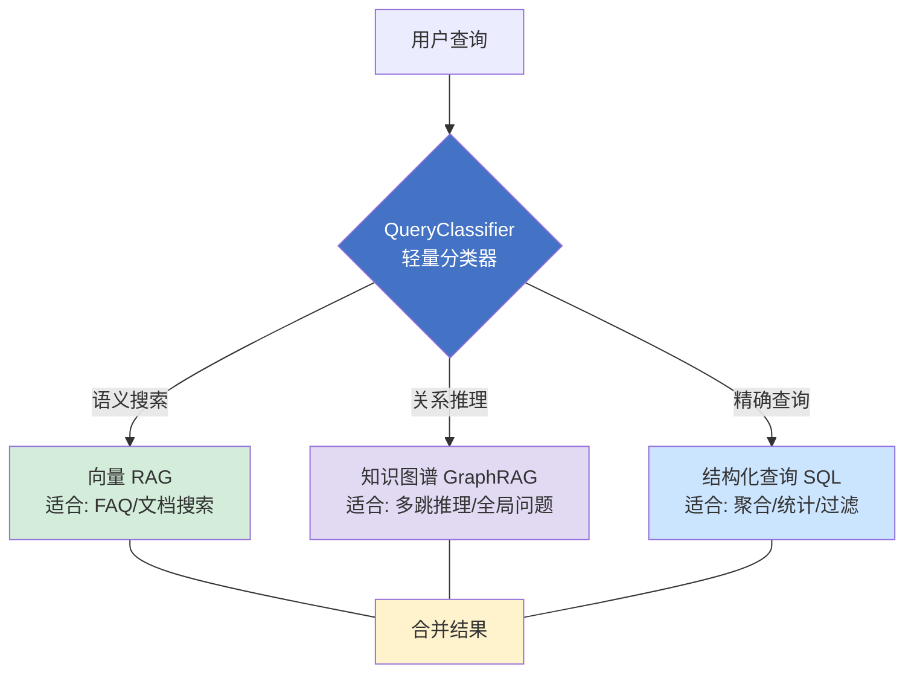
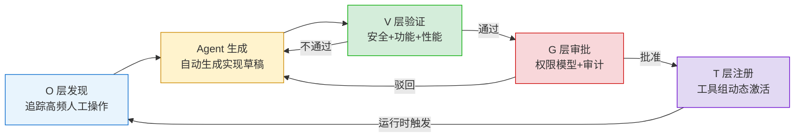
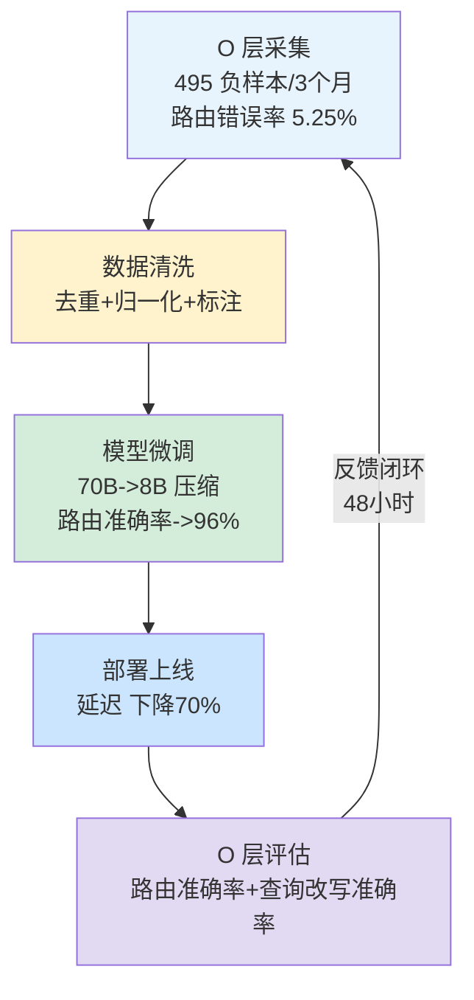

# 第 13 章 — 数据、知识与工具制造

知识不是一种东西：它有三种完全不同的存在形式——非结构化的文档知识（适合向量 RAG）、结构化的关系型知识（适合 SQL 查询）、半结构化的实体关联知识（适合知识图谱）。试图用一种检索策略通吃所有知识类型，结果是"查到了内容但查不到答案"。

本章处于 Part 3 "Agent 系统全栈工程"的位置，是 Agent 系统"原材料"层的展开。RAG 注入的检索结果、知识图谱中的关系推理、结构化数据库中的精确查询——这三种知识形态如何高效表示和检索，构成第一部分。在此基础上，Agent 运行中产生的数据如何被结构化捕获并反向改善知识注入——数据飞轮——是第二部分。最后，高频操作模式如何被固化为可复用的工具——工具制造——形成自我增强的正反馈循环，是第三部分。前置依赖包括语义记忆、内部 RAG、工具的本质、工具选择的两级路由（见第 1 章）。

***

## 13.1 知识的三种表示与多层路由

### KP 13.1.1 三层知识路由：RAG、知识图谱、SQL 的协同 【构建】

<!-- FIGURE: 13.1 三层知识路由架构 — RAG / GraphRAG / SQL -->



Microsoft 研究显示 GraphRAG 在全局完整性上的得分达到 72–83%，Lettria 跨四个行业的评测中总体准确率为 80%，而传统 RAG 仅为 51%；在航空规范场景中差距更大——90.63% 对 46.88%[^1]。但反过来看，GraphRAG 在简单问答上比传统 RAG 低 13.4%，实时查询低 16.6%[^1]。没有一种知识表示能在所有场景下都是最优的。

三种知识表示对应三种检索需求。语义检索（向量 RAG）：在高维嵌入空间中通过余弦相似度查找语义相近的文档，天然适合模糊匹配和语义相似度查询。关系推理（知识图谱）：通过实体关系路径做多跳分析，适合"A 和 B 通过什么路径关联"这类问题。精确查询（SQL）：对结构化数据做聚合和过滤，适合"上个月退货率是多少"这类统计问题。三种需求完全不同，不存在哪个"通吃"。

三层知识路由架构的做法是在检索入口放置一个轻量分类器 QueryClassifier，用单次 LLM 推理（延迟 < 50ms）判断查询意图，输出三类标签：SEMANTIC（语义搜索→向量 RAG）、RELATIONAL（关系推理→知识图谱）、STRUCTURED（精确过滤→SQL），然后自动路由到对应的检索引擎。在知识图谱这一路上，有两种进一步的优化：SOG（Structure of Graph）将图拓扑映射为单个 LLM token，大幅压缩 token 消耗[^2]；LazyGraphRAG 将索引成本降至全量 GraphRAG 的 0.1%[^2]。

三种路由背后是三种经典检索算法。向量检索基于 ANN（Approximate Nearest Neighbor，近似最近邻搜索）——在高维嵌入空间中做余弦相似度查找，基于 HNSW 等图索引算法时时间复杂度约 O(log n)（暴力检索为 O(n)，IVF 聚类为 O(n/k)，生产环境几乎都用 HNSW）。图检索基于邻接表遍历——沿实体关系路径做多跳推理，复杂度 O(d^h)，其中 d 为平均度、h 为跳数。SQL 查询基于 B-tree 索引——对结构化数据做精确范围查询，复杂度 O(log n)。由于 No Free Lunch 定理，不存在在所有数据分布下都最优的方案。

从效果上看：GraphRAG 全局完整性达 72–83%，在航空规范场景中多跳推理准确率比纯向量 RAG 高约 46%（从 46.88% 提升至 90.63%）；TERAG 将 token 消耗降至朴素 GraphRAG 的 3–11%，且保持 80% 以上的准确率；NVIDIA 的数据飞轮实验通过 495 个负样本将 70B 模型压缩到 8B，路由准确率提升至 96%[^4]（注：该数据来自单行业实验，跨行业的一般化结论需更多验证）。

在业界，Microsoft GraphRAG 提供了企业级的全局摘要能力（Azure 独占但成本较高），Neo4j 配合 LangChain 在关系密集型场景中灵活组合，达梦图数据库的 GDMBASE HyperRAG 在 10 亿规模的点边混合检索中延迟低于 500ms，3 跳推理实现 4 倍性能提升[^7]（注：此为厂商自报告数据，未经第三方独立验证）。

AgentScope 的 `ReActAgent` 可承载本章的三层知识路由——结构化数据走 `MemorySearchTool`（基于 SQLite FTS5 全文检索，对应 SQL 路由）、非结构化文档走外部 RAG 工具注册（对应向量 RAG 路由）、实体关系查询走代理式图查询（对应 GraphRAG 路由）。三种路由通过 `@Tool` 注解统一注册为 Agent 可调用的工具，Agent 在运行时根据查询意图自动选择路由策略（概念性映射，工程落地见 CodePilot 配套仓库的 `MultiBackendRouter`）。源码路径：`agentscope-harness/.../agent/tools/`。

```java
/*
 * 框架：AgentScope 2.x（版本不锁定，跟随最新稳定版）
 * 环境：JDK 21+, Spring Boot 3.5+
 *
 * 使用组件说明：
 * - QueryClassifier（代码见 CodePilot 配套仓库，自定义组件）：轻量查询分类器，
 *   在检索入口分析查询意图，输出三类标签——SEMANTIC（语义搜索 → 向量RAG）、
 *   RELATIONAL（关系推理 → GraphRAG）、STRUCTURED（精确过滤 → SQL）。
 *   基于 LLM 单次推理完成分类，延迟 < 50ms。
 * - MultiBackendRouter（代码见 CodePilot 配套仓库，自定义组件）：根据分类结果
 *   动态选择检索引擎——VectorStore（语义）、GraphStore（关系）、JdbcTemplate（结构化），
 *   支持结果合并与去重。
 */
@Bean
public MultiBackendRouter knowledgeRouter(
        QueryClassifier classifier,
        VectorStore vectorStore,
        GraphStore graphStore,
        JdbcTemplate jdbcTemplate) {

    return MultiBackendRouter.builder()
        .classifier(classifier)               // 轻量分类器：SEMANTIC / RELATIONAL / STRUCTURED
        .backend("SEMANTIC", query ->         // 语义搜索 → 向量 RAG
            vectorStore.similaritySearch(query.embedding(), 10))
        .backend("RELATIONAL", query ->        // 关系推理 → GraphRAG
            graphStore.traverse(query.entities(), query.hops()))  // hops≤3，控制复杂度
        .backend("STRUCTURED", query ->        // 精确过滤 → SQL
            jdbcTemplate.queryForList(query.sqlTemplate(), query.params()))
        .mergeStrategy(MergeStrategy.DEDUP_BY_ID)  // 按文档ID去重合并
        .fallback("SEMANTIC")                  // 分类失败时默认回退到向量 RAG
        .build();
}
```

#### 路由三引擎的落地实现

三层路由的架构图给出了路由入口，每个引擎如何落地需要在选型与实现上做具体决策。以下展开三个引擎的关键点。

##### 向量 RAG 引擎：向量库选型决策

向量库是 RAG 路由的存储底座，选型直接决定召回质量、延迟和运维成本。主流方案的取舍取决于"规模 × 运维能力 × 成本"三角的权衡：

| 方案       | 适用规模      | 延迟（P99）  | 运维复杂度    | 成本模型        | 适用场景                       |
| -------- | --------- | -------- | -------- | ----------- | -------------------------- |
| pgvector | < 100 万向量 | 50-200ms | 低（复用 PG） | 复用现有 DB     | 已有 PostgreSQL，向量量小，避免引入新组件 |
| Pinecone | 千万级       | 20-80ms  | 极低（全托管）  | 按 pod 计费，较贵 | 团队无运维能力，愿为托管付费             |
| Weaviate | 千万级       | 30-100ms | 中（自托管）   | 服务器成本       | 需要混合检索（向量+BM25），数据敏感不能上云   |
| Milvus   | 亿级+       | 10-50ms  | 高（分布式）   | 集群成本        | 超大规模，有专职运维团队               |

一个常见误区是创业团队一上来就选 Milvus——亿级能力对日 1 万查询的系统是过度设计，反而被分布式运维拖累。务实路径：日查询 < 1 万、向量 < 100 万时用 pgvector 起步，随规模增长再迁移；迁移成本主要在重建索引，向量本身可从原始文档重新 embedding 生成，无锁定风险。选型的本质是承认"向量库会换"——把 embedding 生成逻辑与存储解耦，迁移时只需重建索引而非重写检索链路。

##### GraphRAG 引擎：从文档到知识图谱的构建管线

GraphRAG 路由的难点不在查询，而在构建——如何把非结构化文档转化为实体-关系图。完整的构建管线分四步，每步都有工程决策点：

1. **实体抽取（NER，Named Entity Recognition）**：用 LLM 或专用 NER 模型（如 GLiNER）从文档中识别实体并标注类型（人/组织/产品/概念）。关键决策是 LLM 抽取 vs 专用模型——LLM 抽取召回高但成本贵（每千 token 文档约 $0.003，参考 GPT-4o-mini 等低成本模型当前定价），专用模型快但需标注训练数据。日处理文档 > 10 万 token 时优先专用模型，成本可降一个数量级。
2. **关系抽取（RE，Relation Extraction）**：识别实体间关系（如"产品A 集成于 平台B"）。实践中关系抽取的准确率通常比实体抽取低 15-20 个百分点，需人工抽检修正——这是 GraphRAG 构建成本的主要来源。
3. **图 Schema 设计**：定义节点类型、边类型和属性。Schema 太松（全部用 generic edge）会丢失类型约束导致查询歧义，太紧（每个关系一种边类型）导致图稀疏查询命中率低。推荐按业务域定义 5-15 种边类型，用属性而非新边类型承载细节差异。
4. **社区检测与摘要**：用 Leiden/Louvain 算法对图做社区划分，每个社区用 LLM 生成摘要——这正是 GraphRAG 全局性问题准确率高的来源（查询命中社区摘要而非遍历全图，避免了多跳遍历的指数爆炸）。

存储选型上，Neo4j 适合关系密集、需 Cypher 灵活查询的场景；达梦 GDMBASE 适合国产化合规要求；若图规模 < 千万边，用 Apache AGE（PostgreSQL 扩展）可避免引入独立图数据库，与 pgvector 共享一个 PG 实例降低运维负担。

##### SQL 引擎：Text-to-SQL 的三道安全防线

SQL 路由把自然语言转成 SQL 查询，但 Text-to-SQL 是注入攻击的高危入口——用户输入或 LLM 幻觉可能生成 `DROP TABLE` 或泄露敏感字段。三道防线缺一不可，且必须按顺序串联：

1. **Schema 白名单**：LLM 只能看到授权的表和列（通过视图或列级权限屏蔽 `salary`、`password` 等敏感字段），生成的 SQL 只能引用白名单内的对象。这是"最小暴露面"原则——模型连 `salary` 列都看不见，就不可能泄露它。
2. **查询改写检测**：值用参数绑定（`WHERE id = ?`）而非字符串拼接；同时正则检测危险模式——`UNION SELECT`、子查询嵌套、`INTO OUTFILE`、`DROP/DELETE/UPDATE` 等命中即拒绝。参数化防常规注入，模式检测防 LLM 生成越权语句。
3. **只读事务 + 行数限制**：SQL 引擎以只读账号执行，事务强制 `READ ONLY`，结果集设行数上限（如 1000 行）防止全表扫描拖垮数据库。这是兜底防线——即使前两道被绕过，也无法造成破坏性后果。

```java
/*
 * 框架：AgentScope 2.x + Spring Boot 3.5+
 * 组件说明：
 * - SqlSafetyGuard（代码见 CodePilot 配套仓库）：Text-to-SQL 三道防线守护，
 *   串联 Schema 白名单 → 改写检测 → 只读执行。属概念示例，实际部署需配合数据库视图层权限。
 */
@Component
public class SqlSafetyGuard {

    private static final Set<Pattern> DANGEROUS_PATTERNS = Set.of(
        Pattern.compile("UNION\\s+SELECT", Pattern.CASE_INSENSITIVE),
        Pattern.compile("INTO\\s+OUTFILE", Pattern.CASE_INSENSITIVE),
        Pattern.compile("DROP\\s+TABLE", Pattern.CASE_INSENSITIVE),
        Pattern.compile("DELETE\\s+FROM", Pattern.CASE_INSENSITIVE),
        Pattern.compile("UPDATE\\s+\\w+\\s+SET", Pattern.CASE_INSENSITIVE)
    );
    private static final int MAX_ROWS = 1000;

    public SqlResult executeSafely(String sql, List<Object> params, JdbcTemplate jdbc) {
        // 防线 2：查询改写攻击检测（防线 1 的 Schema 白名单已在视图层屏蔽）
        for (Pattern p : DANGEROUS_PATTERNS) {
            if (p.matcher(sql).find()) {
                return SqlResult.blocked("危险模式命中");
            }
        }
        // 防线 3：只读事务 + 行数限制
        String limitedSql = sql + " LIMIT " + MAX_ROWS;
        return jdbc.execute(new ConnectionCallback<SqlResult>() {
            @Override
            public SqlResult doInConnection(Connection con) throws SQLException {
                con.setReadOnly(true);  // 强制只读
                try (PreparedStatement ps = con.prepareStatement(limitedSql)) {
                    for (int i = 0; i < params.size(); i++) {
                        ps.setObject(i + 1, params.get(i));  // 参数绑定防注入
                    }
                    return SqlResult.of(ps.executeQuery());
                }
            }
        });
    }
}
```

##### Java 生态开源框架：正则的升级版——AST 级 SQL 校验

上面的 `SqlSafetyGuard` 用正则做防线 2，是"够快但不够准"的兜底（正则容易被空格/注释/大小写变体绕过）。Java 工程里有两个成熟的开源方案可以把防线 1+2 从"字符匹配"升级为"AST 结构分析"，抗绕过能力直接提升一个数量级：

| 框架                                                        | 定位                                                      | 接入成本                           | 对应防线                                                    | 适用阶段                  |
| --------------------------------------------------------- | ------------------------------------------------------- | ------------------------------ | ------------------------------------------------------- | --------------------- |
| **JSqlParser**（Maven 单 jar，Apache 2.0）                    | 轻量级 SQL AST 解析器，支持 MySQL/PostgreSQL/Oracle/SQLServer 方言 | 极低（引入依赖即可）                     | 防线 2（精确识别 DELETE/UPDATE/DROP 等语句类型；检查 WHERE 条件是否含参数占位符） | 冷启动 / 中小项目，替换正则       |
| **Apache Calcite**（Flink/Drill/Hive 底层 SQL 引擎，Apache 2.0） | 重量级 SQL 解析 + 元数据校验 + 查询优化框架，自带 JDBC Catalog             | 中（需注册 Schema/Table/Column 元数据） | 防线 1（列级白名单校验：不认识的列直接在 validate 阶段报错）+ 防线 2（语句类型枚举判断）    | 上规模 / 多方言 / 多租户权限分级场景 |

**选型建议**：Java 工程起步先上 **JSqlParser**（`CCJSqlParserUtil.parse(sql)` 一行解析，`StatementVisitor` 遍历 AST 拦截危险节点，单 jar 无外部依赖），等需要多租户 Schema 隔离和列级权限精确控制时再升 **Apache Calcite**（自带元数据 catalog，能在 validate 阶段直接拒绝"引用了白名单外的列"的 SQL——这比视图层屏蔽还早一道门）。两者与上文的三道防线是**叠加关系**：它们替换正则做防线 2，防线 1 从"视图权限"升级为"AST 级列白名单"，防线 3（只读事务 + LIMIT）不变，形成"AST 级校验 → 数据库层权限 → 事务兜底"的纵深防御。

```java
/*
 * 框架：AgentScope 2.x + Spring Boot 3.5+ + JSqlParser 4.9
 * 组件说明：
 * - JSqlParserGuard（代码见 CodePilot 配套仓库）：JSqlParser AST 级 SQL 守护，
 *   替换 SqlSafetyGuard 的正则匹配。codebase 已引入 jsqlparser 4.9 依赖，
 *   防线 2 的 AST 解析为可运行实现（CCJSqlParserUtil.parse + instanceof Select）；
 *   防线 3 的 jdbc.execute 段在 codebase 为桩（不实际执行 SQL），章节展示完整生产实现。
 *   升级路径为 Apache Calcite（列级白名单校验）。
 */
@Component
public class JSqlParserGuard {

    public SqlResult executeSafely(String sql, List<Object> params, JdbcTemplate jdbc) {
        try {
            // 防线 2：AST 级语句类型校验（天然抗绕过）
            Statement stmt = CCJSqlParserUtil.parse(sql);
            if (!(stmt instanceof Select)) {
                return SqlResult.blocked("非 SELECT 语句被拦截：" + stmt.getClass().getSimpleName());
            }
            // AST 级：拦截 UNION SELECT、SELECT INTO 等危险结构
            Select select = (Select) stmt;
            // 防线 3：只读事务 + 行数限制（不变）
            String limitedSql = sql + " LIMIT " + 1000;
            return jdbc.execute(con -> {
                con.setReadOnly(true);
                try (PreparedStatement ps = con.prepareStatement(limitedSql)) {
                    for (int i = 0; i < params.size(); i++) ps.setObject(i + 1, params.get(i));
                    return SqlResult.of(ps.executeQuery());
                }
            });
        } catch (JSQLParserException e) {
            return SqlResult.blocked("SQL 语法校验未通过：" + e.getMessage());
        }
    }
}
```

JSqlParser 的核心收益是"正则匹配不到的它都能抓到"——比如 `DROP /* comment */ TABLE users`、`DRoP tAbLe x`、`DELETE+UNION SELECT` 这种加了注释、改了大小写、组合了多语句的变体，在正则下容易被绕过，在 AST 下 `Drop` 语句直接在 `instanceof Select` 处被拦下，解析本身就是语法校验——语法不对的 SQL 连解析都过不了。需要列级白名单时升 Calcite：把授权的表和列注册进 Calcite 的 Schema，调用 `validator.validate(sqlNode)` 即可直接返回 "Column 'salary' not found in any table" 错误，连视图层权限都可以弱化成"双保险"——Calcite 的 validate 在 SQL 到达 JDBC 之前就完成了列级访问审查。

##### 分类器实现与混合查询：路由落地的最后两块拼图

三引擎各自讲清了，但路由能否真正跑起来还卡在两个点上：入口的分类器到底用什么实现，以及"一个查询需要多引擎"的混合场景怎么处理。

**分类器的实现选型**有一条清晰的性价比阶梯，按延迟和准确率分三档：

| 实现                               | 延迟      | 准确率             | 成本              | 适用阶段          |
| -------------------------------- | ------- | --------------- | --------------- | ------------- |
| 关键词规则（正则 + 词表）                   | <5ms    | 60-70%          | 零               | 冷启动，查询量小、模式稳定 |
| Embedding 最近邻（查询向量 vs 三类原型向量）    | 10-30ms | 80-85%          | 低（复用 embedding） | 主流选择，兼顾延迟与准确率 |
| 小模型分类器（蒸馏的 BERT-tiny / FastText） | 20-40ms | 可达 90% 左右        | 中（需训练数据）        | 查询量大、有标注集可蒸馏  |

"延迟 < 50ms"依赖避免用通用大模型做分类——用 GPT-4 做意图分类延迟 300-800ms 且每次都烧 token，这常是路由"上不了线"的根因。务实路径是 Embedding 最近邻起步（查询向量和三类标签的"原型向量"做余弦比较，取最大者），三类原型向量用各引擎的代表性查询初始化、随飞轮迭代更新；当线上查询量 > 日 1 万且有 200+ 标注样本时，蒸馏一个 FastText 分类器把准确率推到 90%+。

**混合查询是单标签分类的盲区**。"上周销量最高的产品A的相关文档"同时包含结构化（销量最高=SQL）和语义（相关文档=RAG）两种意图，硬塞进单标签会丢失一半信息。工程解法是**软路由 + 并行检索**：分类器输出三类的置信度分布而非单标签，对置信度高于阈值（如 0.25）的引擎并行查询，再用 **RRF（Reciprocal Rank Fusion，倒数排名融合）** 合并结果——RRF 的公式是 `score(d) = Σ 1/(k + rank_i(d))`，k 通常取 60，它只依赖每路结果的排名而非原始分数，天然规避了向量相似度（0-1）与 SQL 置信度（无界）的量纲不可比问题。这比 `DEDUP_BY_ID` 更适合混合查询——去重只解决重复，RRF 解决跨引擎排序。

```java
/*
 * 框架：AgentScope 2.x + Spring Boot 3.5+
 * 组件说明：
 * - QueryClassifier（代码见 CodePilot 配套仓库）：predict() 输出三类置信度分布，
 *   供软路由使用（classify() 是其 argmax 快捷方式，供硬路由使用）。属概念示例，
 *   实际实现可替换为 FastText 或 Embedding 最近邻。
 * - 融合策略：置信度 > 阈值的引擎并行查询，结果用 RRF 合并后返回。
 *   rrfFuse 为示意方法名（非代码库方法），Object 占位代表带排名的检索结果。
 */
Map<String, Double> scores = classifier.predict(query);  // {SEMANTIC:0.6, STRUCTURED:0.35, RELATIONAL:0.05}

// 软路由：对高置信度引擎并行检索 + RRF 融合
double THRESHOLD = 0.25;
List<String> active = scores.entrySet().stream()
    .filter(e -> e.getValue() > THRESHOLD)
    .map(Map.Entry::getKey)
    .toList();
// 兜底：全低置信（如三类各 0.20-0.24）时 active 为空，走 argmax 避免空查询
// 这是软路由与硬路由 fallback 叠加的关键场景——分类器异常输出分散分布时，至少保证查一路
if (active.isEmpty()) {
    active = List.of(scores.entrySet().stream()
        .max(Map.Entry.comparingByValue())
        .map(Map.Entry::getKey)
        .orElse("SEMANTIC"));  // argmax 也失败（如 scores 为空）时最终兜底 SEMANTIC
}
// 并行查询各引擎，各自返回带排名的结果
Map<String, List<Object>> perEngine = active.parallelStream()
    .collect(Collectors.toMap(
        engine -> engine,
        engine -> backends.get(engine).apply(query)));
return rrfFuse(perEngine, 60);  // k=60，按 RRF 公式 score(d)=Σ 1/(k+rank_i(d)) 合并排序
```

软路由的代价是延迟——并行查询的延迟由最慢引擎决定（GraphRAG 通常最慢，P99 可达 200ms+）。工程上的折中是**给慢引擎设提前截止（early cutoff）**：GraphRAG 超过 100ms 未返回就用已有结果合并，避免拖垮整体延迟。这种"尽力而为"的融合在混合查询场景下仍优于单标签路由——宁可少一路结果，也不要把多意图查询硬塞进一个引擎。

**硬路由 fallback 与软路由置信度兜底是两层防线，生产环境应叠加使用**。硬路由的 `fallback("SEMANTIC")` 是粗粒度兜底——只在分类器完全无法输出标签时触发（如分类器超时、异常），它的缺陷上文已提：若分类器误判为 RELATIONAL 但真实意图是 STRUCTURED，fallback 不会生效（误判本身就是一个有效标签）。软路由的置信度阈值是细粒度兜底——它不依赖"分类器是否输出"，而看"分类器有多确定"：置信度分散（如三类各 0.3-0.4）说明分类器自身不确定，此时并行查询多引擎比赌一个标签更安全。生产配置建议：分类器正常时走软路由（置信度阈值 0.25），分类器异常时走硬路由 fallback，两者覆盖"不确定"和"故障"两种场景。单用硬路由 fallback 会漏掉"误判但高置信"的案例，单用软路由在分类器宕机时无兜底——叠加才是完整防线。代码示例中的 `if (active.isEmpty())` 兜底覆盖了第三种 case——分类器输出"全低置信"（三类都低于阈值，常见于对抗输入或小众查询），此时走 argmax 至少保证查一路，而非返回空结果。这是三种失效模式各有一层防线的具体落地：硬路由 fallback 管"分类器故障"，软路由置信度阈值管"分类器不确定"，argmax 兜底管"分类器输出全低置信"。

#### 多租户知识隔离：SaaS 场景的必答题

上述路由机制默认单租户，但企业级 SaaS Agent 需服务多租户——不同客户的知识库、数据库、工具集必须隔离，否则 A 客户的查询命中 B 客户的知识就是数据泄露事故。多租户隔离在三层路由的每个引擎上都有落地要求，且必须在路由入口集中管控。

**物理隔离 vs 逻辑隔离的权衡**。物理隔离是每租户独立索引/数据库（如 `tenant_a_vector`、`tenant_b_vector`），隔离最强但资源开销大——每租户独立连接池、独立索引维护、独立 GraphRAG 构建管线，适合租户少且数据量大的场景（如企业私有部署）。逻辑隔离是共享索引但按 `tenant_id` 过滤——向量库用 metadata filter `tenant_id=X`，图库用节点属性过滤，SQL 用 `WHERE tenant_id=X`，资源利用率高但需在每条查询入口强制注入 tenant\_id，漏一处即泄露，适合租户多且单租户数据量小的 SaaS 场景。务实路径：租户数 < 50 且单租户向量 > 100 万时用物理隔离，否则用逻辑隔离起步，随合规要求升级再迁物理。两者的本质差异是"隔离强度 vs 资源效率"的权衡——金融、医疗等强合规场景即使租户多也优先物理隔离。

**三引擎的隔离实现各有要点**。向量库（Milvus/Pinecone）用 metadata filter：入库时每条向量附 `tenant_id` 字段，查询时 `filter={"tenant_id": "tenant_a"}` 强制过滤，P99 延迟增加通常 < 5ms（metadata filter 走倒排索引，不拖慢 ANN 检索）。GraphRAG 在图节点上挂 `tenant_id` 属性，遍历时用 Cypher `WHERE n.tenant_id = $tenant` 过滤——需注意跨租户的关系边必须显式标记为"共享知识"（如公共法规、行业基线），否则多跳推理会因 tenant\_id 过滤而路径断裂。SQL 路由最直接——每张业务表加 `tenant_id` 列，生成的 SQL 强制带 `WHERE tenant_id = ?`，这个参数由网关层注入而非 LLM 生成（LLM 连这个参数的存在都不应知道，避免 prompt 注入绕过）。三引擎的 `tenant_id` 注入必须在 `MultiBackendRouter` 入口处完成——从会话上下文取 tenant\_id，注入到 query 对象，下游引擎查询时带上，这是"入口集中管控、出口各自实现"的标准做法。

**分类器不需要租户数据感知，但可能需要租户领域感知**。QueryClassifier 判的是"查询意图"（SEMANTIC/RELATIONAL/STRUCTURED），与租户无关——不同租户的"上周退货率"都是 STRUCTURED 意图，分类器在所有租户间共享。但有一个例外：若不同租户的知识领域差异大（如医疗租户 vs 法律租户），分类器的原型向量或训练集需按领域分组——此时分类器需先按租户领域路由到对应的分类器实例，再走三层路由。多数 SaaS 场景下租户领域相近（都是电商、都是客服），单分类器即可；跨领域 SaaS 才需要领域感知。

**工具制造层的租户隔离由 §13.2 的工具组机制承载**。工具组（ToolGroupRegistry）天然适合租户隔离——按租户激活对应的工具组（`activate("tenant_a_domain")`），租户 A 只看到自己的工具集，租户 B 的工具对 A 不可见。这与知识隔离是互补的：知识隔离管"查什么数据"，工具隔离管"调什么操作"，两者叠加才构成完整的租户边界。需注意工具调用的副作用也需租户隔离——如"发退款"工具的 `orderId` 参数必须校验属于当前 tenant，否则租户 A 的 Agent 能对租户 B 的订单发起退款，这是工具层而非知识层的越权。

### KP 13.1.2 知识保鲜：时效性与版本管理 【构建】

NVIDIA 的数据飞轮实验给出了一个关键信号：在 3 个月的运行周期内，知识路由错误率达到 5.25%，查询改写错误率为 3.2%，而这些错误的根源是"知识过时"[^4]。更紧迫的现实是，EU AI Act 从 2026 年 8 月起强制要求数据血缘可追溯。知识库不是静态资产——文档更新后，旧索引中的内容仍在被检索和使用，而添加和索引更新之间存在延迟，缺乏自动化的过期检测机制。

解决这个问题的工程方案包含三个部分。第一，Git webhook 触发增量索引更新——代码仓库中文档发生变化时自动触发下游索引的增量刷新，而非全量重建。第二，时效性评分——在检索结果排序中引入时间衰减因子，发布时间越近的文档获得越高的权重。第三，版本绑定——Agent 每次调用使用的知识版本可追溯，满足 EU AI Act 的数据血缘要求。

从原理上看，Git webhook 增量索引机制借鉴了数据库领域的 CDC（Change Data Capture，变更数据捕获）模式——监听源数据变更事件，触发下游索引的增量更新，而非全量重建。时效性评分的核心是 TF-IDF（词频-逆文档频率）与时间衰减函数的结合，常用指数衰减：weight = base\_weight × e^(-λt)，λ 控制衰减速率。版本绑定的核心是让每次检索结果都可追溯到具体的知识快照版本——当 Agent 给出了一个过时的答案，团队能精确知道它参考的是哪个版本的文档。

落地实现时有两个关键决策点常被忽略。第一是时效性评分的衰减系数 λ 需按知识类型差异化设置——产品 API 文档 λ≈0.01（半衰期约 70 天，技术文档更新快），法规条款 λ≈0.001（半衰期约 700 天，法规更新慢），历史案例 λ=0（不衰减，历史经验恒有价值）。统一用单一 λ 会导致法规文档被快速降权或 API 文档长期过期。衰减窗口之外还需硬性过期阈值——超过 180 天未更新的文档标记为"待复核"，检索时附加"⚠️ 此知识可能过时"提示，而非静默降权。第二是版本绑定的工程实现是"检索结果携带版本指纹"——每条知识入库时分配 `docId@commitSha` 的复合版本号，检索结果把版本号透传到 Agent 输出的引用中。当用户质疑"这个答案过时了"，系统能通过版本号回溯到具体的 Git commit，定位是哪次文档变更引入或遗留了该信息。这正是 EU AI Act Article 10（数据治理）要求的"训练与运行数据可追溯"在检索链路的落地。

```java
/*
 * 框架：AgentScope 2.x + Spring Boot 3.5+
 * 组件说明：
 * - KnowledgeFreshnessGuard（代码见 CodePilot 配套仓库）：知识保鲜守护，
 *   实现时效评分 + 版本绑定 + 过期标记。
 */
@Component
public class KnowledgeFreshnessGuard {

    // 按知识类型差异化的衰减系数（半衰期 = ln2/λ）
    private static final Map<String, Double> LAMBDA_BY_TYPE = Map.of(
        "api_doc", 0.01,      // 半衰期 ~70 天
        "regulation", 0.001,  // 半衰期 ~700 天
        "case_history", 0.0   // 不衰减
    );
    private static final int STALE_THRESHOLD_DAYS = 180;

    public ScoredHit score(KnowledgeHit hit, Instant now) {
        double lambda = LAMBDA_BY_TYPE.getOrDefault(hit.type(), 0.005);
        long ageDays = Duration.between(hit.publishedAt(), now).toDays();
        double timeWeight = Math.exp(-lambda * ageDays);  // 指数衰减
        double finalScore = hit.baseScore() * timeWeight;
        boolean stale = ageDays > STALE_THRESHOLD_DAYS;
        return new ScoredHit(hit, finalScore, stale, hit.docId() + "@" + hit.commitSha());
    }
}
```

#### 知识保鲜的三个落地细节

上面的 `KnowledgeFreshnessGuard` 给出了时效评分和版本绑定的骨架，但"增量索引怎么 diff""时效分怎么和相似度融合""过期后谁来复核"三个落地细节决定了保鲜机制能否真正运转。

**增量索引的粒度是 Chunk 级而非文档级**。Git webhook 触发后，朴素做法是对变更文档重新 embedding 全量入库——但一篇 5000 token 的文档改了一个段落就重 embed 全文，既浪费算力又导致未变 chunk 的版本号无谓翻新。正确粒度是 Chunk 级 diff：文档按语义切分为 chunk（如 512 token 滑窗），每个 chunk 计算内容哈希（SHA-256），webhook 触发后比对新旧 chunk 哈希表，只对哈希变化的 chunk 重新 embedding 并更新索引。这借鉴了内容寻址存储（Content-Addressable Storage，以内容哈希作为唯一标识的存储模式）的思想——未变 chunk 的哈希不变，天然跳过，增量成本与实际变更量成正比而非与文档总量成正比。实践中 chunk 级增量能把 webhook 触发的索引刷新成本压到全量重建的 5-15%（绝大多数文档变更只影响局部 chunk）。

**时效分与相似度的融合用乘法而非加权求和**。`finalScore = baseScore × timeWeight` 是乘法融合——它的语义是"时效是相似度的衰减因子"，即再相似的文档只要足够旧也会被压低。若改用加权求和 `finalScore = α·similarity + (1-α)·timeWeight`，会出现"高相似 + 极旧"的文档仍排前列的问题（相似度把时效稀释了）。乘法融合的代价是 `timeWeight → 0` 时分数归零，对"历史案例"这类不该衰减的知识需用 λ=0 豁免（见上文差异化 λ）。这个选择背后的原理是：时效和相似度不是同一维度的可替代属性，而是"相似度是必要条件、时效是调节系数"——乘法恰好表达了这种偏序关系。

**过期知识的复核是半自动的**。标记"待复核"后，全靠人工逐条审查在文档量大时不可持续。工程做法是分两路：(1) **LLM 自动核对**——对过期文档，用 LLM 对比当前文档版本与索引中的旧版本，判断"语义是否发生实质变化"，无实质变化的自动续期（更新时间戳，清除待复核标记），有实质变化的进入人工队列；(2) **人工复核队列**——只审查 LLM 判定"有实质变化"或低置信的文档，把人工工作量压到 10-20%。这套机制需配合 §13.1.3 的 LLM-as-judge 一致性监控——自动核对 judge 的 κ 需定期校准，否则"自动续期"会放过已实质过时的文档。

### KP 13.1.3 路由评估指标：怎么知道路由准不准 【构建】

三层路由上线后，从业者最常被问到的问题是"你的路由准不准"。没有评估指标，路由准确率只能靠用户投诉被动发现——而 NVIDIA 的数据显示：3 个月才通过 495 个负样本发现 5.25% 的路由错误率[^4]。主动评估需要三类指标，缺一类都会留盲区：

1. **路由准确率（Routing Accuracy）**：人工标注一批查询的"正确路由标签"，对比 QueryClassifier 输出。这是分类问题，用 precision/recall/F1 衡量。关键看每类的召回——SEMANTIC 误判为 STRUCTURED 会导致统计查询退化为模糊检索，单类召回低于 90% 即需调优分类器。
2. **误路由成本（Misrouting Cost）**：不同误路由方向的代价不对称。SEMANTIC→STRUCTURED 误判（把文档检索当数据库查）通常返回空结果，代价低；STRUCTURED→SEMANTIC 误判（把统计查询当文档查）会返回近似无关文本，代价高（用户得到错误数字却以为是对的）。评估时需按业务影响加权，而非等权统计——一次"错误数字"的代价远高于十次"查无结果"。
3. **召回质量（Retrieval Quality）**：路由正确不代表结果正确。每条路由的输出需用 nDCG\@10 或召回率@k 评估——RAG 路由看向量召回 top-k 是否包含答案段，GraphRAG 路由看子图是否覆盖推理路径，SQL 路由看查询结果是否匹配预期值。

评估集的构建是隐性成本——初期可用线上查询采样 + 人工标注 200-500 条作为黄金集，每月增量补充。这比"上线后等投诉"能提前数月发现路由退化，也正是 §13.3 数据飞轮 O 层采集的前置基础。

#### 从离线评估到在线监控：让路由退化无所遁形

上述三类指标都是离线评估——拿黄金集跑一遍算分。但路由退化往往是渐进的：分类器训练数据老化导致某类查询逐渐偏移，单次离线评估难以及时捕捉。从业者需要的是**持续在线监控**，而非"每月跑一次评估脚本"。

**滑动窗口准确率监控**是最低成本的第一道防线。做法是对线上每次路由决策，异步用"延迟标注"（用户后续行为反馈或 LLM-as-judge 复核）推断路由是否正确，按 1 小时/1 天滑动窗口统计准确率。退化检测的核心不是看绝对值，而是看**相对基线的偏离**——设定基线准确率（如上线初期 7 天均值 92%），当滑动窗口准确率跌破基线 -3pp 时告警。3pp 阈值的依据是评估集方差——200 条评估集上单次评估的标准差约 ±3pp（二项分布 σ ≈ √(p(1-p)/n)），低于此阈值的波动多为噪声，超过才值得人工介入。

**在线评估的两种生产模式**需按成本/风险权衡选择：

| 模式           | 机制                  | 风险            | 适用场景       |
| ------------ | ------------------- | ------------- | ---------- |
| 影子流量（Shadow） | 新路由并行运行但不返回结果，只记录对比 | 零（不影响用户）      | 路由升级前的安全验证 |
| A/B 测试       | 按比例分流真实流量到新旧路由      | 中（B 组用户可能受影响） | 验证新路由的净收益  |

影子流量是路由迭代的标配——分类器换模型、阈值调整、新增引擎前，先开影子跑 24-48 小时，对比新旧路由的决策分歧率（disagreement rate）。分歧率 > 10% 时需人工审查分歧样本，确认新路由是"改进"而非"漂移"。A/B 测试则需警惕统计陷阱（见第 9 章 KP 9.5.2）——路由准确率提升 1pp 在日 1 万查询下需约 2 周才能达到统计显著，过早下结论会误判噪声为改进。

**评估自动化的最后一公里是 LLM-as-judge 辅助标注**。黄金集的 200-500 条人工标注是冷启动必需，但每月增量补充全靠人工不可持续。工程做法是：用 LLM-as-judge 对线上采样查询打"路由是否正确"的标签，人工只抽审 10% 验证 judge 的一致性（Cohen's κ > 0.7 视为可信）。judge 漂移需同步监控（见第 9 章 KP 9.6.1）——当 judge 与人工抽审的 κ 连续 2 周低于 0.7，说明 judge 模型本身需重新校准。这套半自动化流程能把标注成本压到纯人工的 15-20%，是飞轮能持续运转的前提。

***

## 13.2 工具制造：从手动编写到自动生成

工具制造的关键瓶颈是手动编写的效率与一致性——每个 `@Tool` 方法需要手写 description（供模型理解）、手写参数校验（防止幻觉参数）、手写返回格式化（确保 Agent 能消化）。每次新增一个 API 端点，工程师需要花 1–2 小时把它包装成合格的 Agent 工具。

代码生成管道（扫描 Swagger/OpenAPI 文档 → 自动提取参数类型和约束 → 用模板生成 `@Tool` 注解）可以把工具创建时间从 1–2 小时压缩到 2 分钟。工具制造不是艺术——它是一套可以标准化和自动化的工程流程：声明接口 → 生成 Schema → 注入约束 → 验证可调用性。

### KP 13.2.1 五阶段工具制造安全管线 【构建】

<!-- FIGURE: 13.2 五阶段工具制造安全管线 — O->Agent->V->G->T -->



手动制造速度慢且容易遗漏边界条件，但自动生成又带来安全风险——LLM 能写代码，但不能保证代码的安全性、正确性和性能。

五阶段安全管线的设计思路是在自动化和安全之间建立门禁。O 层发现阶段追踪高频人工操作模式——当某个操作在时间窗口内重复达到阈值，标记为"可工具化候选"。Agent 生成阶段由 LLM 自动生成工具实现草稿。V 层验证阶段执行三合一门禁检查：AST（抽象语法树）注入检测（禁止 `Runtime.exec` 和 `ProcessBuilder` 无参数白名单）、功能断言测试（dry-run 10 组输入验证输出符合 Schema）、性能基准（P50 延迟 < 200ms 且 P99 < 1s）。G 层审批阶段进行权限模型审计和合规检查。T 层注册阶段完成工具组动态激活。验证失败回退到 Agent 生成重试，审批驳回同样回退——不通过就重新生成，不会带着隐患进入下一阶段。

这套流水线将传统 CI/CD 流程映射到 Agent 工具的生命周期：O 层对应需求收集，Agent 生成对应自动化代码生成，V 层对应 CI 中的单测、集成测试和安全扫描（门禁条件是三项全部通过），G 层对应 Code Review 和合规检查，T 层对应 CD 部署。每个阶段的检查是单调的——一旦失败就回退而非继续——确保工具的安全保证只增不减。

AgentScope 的 `SkillCurator` 策展管线是这种工具制造安全审核的生产级参考：新提交的技能经过 `SkillSecurityScanner`（静态扫描 + 沙箱试运行）→ `CanaryFilter`（灰度发布 10%→50%→100%）→ `SkillPromoter`（自动晋升/降级），全链路通过 `SkillAuditLog` 审计。一个 Skill 从提交到全量上线，防护深度覆盖"扫描→审核→灰度→审计"四个阶段。源码路径：`agentscope-harness/.../agent/skill/curator/`。

```java
/*
 * 框架：AgentScope 2.x（版本不锁定，跟随最新稳定版）
 * 环境：JDK 21+, Spring Boot 3.5+
 *
 * 使用组件说明：
 * - ToolManufacturingPipeline（代码见 CodePilot 配套仓库，自定义组件）：五阶段流水线编排器。
 *   串联 O→Agent→V→G→T 五个阶段，每个阶段是单向门禁——通过则进入下一阶段，失败则回退到 Agent 生成重试。
 * - OperationTracker（代码见 CodePilot 配套仓库）：O 层发现——埋点追踪高频人工操作，
 *   当某操作模式在时间窗口内重复 >= 阈值次时，标记为"可工具化候选"。
 * - SafetyValidator（代码见 CodePilot 配套仓库）：V 层验证——对生成的工具代码执行三合一检查：
 *   AST 注入检测（禁止 Runtime.exec / ProcessBuilder 无参数白名单）、
 *   功能断言测试（dry-run 10 组输入验证输出符合 Schema）、
 *   性能基准（P50 延迟 < 200ms 且 P99 < 1s）。
 */
@Component
public class ToolManufacturingPipeline {

    private final OperationTracker tracker;      // O 层：高频操作模式发现
    private final ReActAgent agent;              // Agent 生成：LLM 自动生成实现草稿
    private final SafetyValidator validator;     // V 层：安全+功能+性能三项门禁
    private final ApprovalGateway gateway;       // G 层：权限模型审计+合规检查
    private final ToolRegistry registry;         // T 层：工具组动态注册

    public ToolCandidate discoverAndManufacture(String operationDomain) {
        // O 层：追踪高频人工操作 → 发现可工具化候选
        List<OperationPattern> patterns = tracker.findFrequent(operationDomain, 7, 50);
        for (OperationPattern pattern : patterns) {
            // Agent 生成：LLM 自动生成工具实现草稿
            ToolCandidate candidate = agent.call()
                .user(template -> template.text("""
                    基于以下高频操作模式生成工具实现：
                    模式: {pattern}
                    要求: 参数校验 + 错误处理 + 日志记录
                    """).arg("pattern", pattern))
                .execute().entity(ToolCandidate.class);

            // V 层：三合一验证门禁
            ValidationResult vr = validator.validate(candidate);
            if (!vr.passed()) {
                candidate.setStatus(Stage.REJECTED_AT_V);
                continue;  // 验证失败 → 回退，不进入后续阶段
            }
            // G 层：审批
            if (gateway.approve(candidate)) {
                registry.register(candidate);  // T 层：注册
                candidate.setStatus(Stage.REGISTERED);
            }
        }
        return null;
    }
}
```

#### 工具生成与验证的工程深化

五阶段管线给出了流程骨架，以下展开 Agent 生成和 V 层验证的具体细节。

##### 工具代码生成的 prompt 设计

Agent 生成阶段的核心是一个结构化 prompt，让 LLM 产出可编译的 @Tool 方法而非自由文本。prompt 设计有三个关键约束，违反任一都会导致生成质量崩塌：

1. **Schema 先行**：先让 LLM 输出 JSON Schema（参数名/类型/约束/描述），再基于 Schema 生成方法签名。顺序不能反——直接生成代码容易导致参数描述缺失或类型不一致，而 Schema 作为中间产物便于 V 层校验。
2. **示例锚定**：prompt 中嵌入 1-2 个"好的 @Tool 范例"，明确 description 要包含"做什么 + 何时用 + 返回什么"三要素，参数描述要说清"类型 + 约束 + 单位"。没有范例时 LLM 倾向生成模糊描述（如"查询数据"），导致模型选错工具。
3. **约束注入**：在 prompt 中显式禁止 `Runtime.exec`、`ProcessBuilder`、反射 `Class.forName` 等危险 API，要求所有外部调用走预设的 HTTP/SDK 客户端。这是 prompt 层的第一道防线，V 层 AST 检测是兜底。

```text
你是一个工具代码生成器。基于以下操作模式生成 @Tool 方法：
操作模式: {pattern}
要求:
1. 先输出 JSON Schema（参数名/类型/约束/描述）→ 再输出 @Tool 方法
2. description 包含：做什么 + 何时用 + 返回什么
3. 参数 @ToolParam 描述包含：类型 + 约束 + 单位
4. 禁止: Runtime.exec / ProcessBuilder / 反射 Class.forName
5. 外部调用必须用注入的 httpClient，禁止自建连接
范例:
@Tool(description = "查询订单状态。当用户询问订单进度时使用。返回 {status, updatedAt}。")
public OrderStatus queryOrder(@ToolParam(desc="订单ID，格式 ord_xxx") String orderId) { ... }
```

##### V 层 AST 注入检测的实现

V 层的"AST 注入检测"不能用正则匹配——正则易被 `Runtime.  getRuntime().exec` 这类空白或注释绕过。正确做法是基于抽象语法树的精确分析：Java 生态用 JavaParser 把生成代码解析为 AST，遍历检查是否命中危险节点。AST 检测的抗绕过性来自它解析的是语法结构而非字符序列——无论加多少空白、注释、字符串拼接，AST 都会还原出真实的方法调用链。

```java
/*
 * 框架：AgentScope 2.x + JavaParser 3.x
 * 组件说明：
 * - AstSafetyScanner（代码见 CodePilot 配套仓库）：V 层 AST 检测器，
 *   基于 JavaParser 解析生成代码，精确命中 Runtime.exec / ProcessBuilder / 反射调用等危险节点。
 *   属概念示例，实际部署需扩展禁用 API 清单并覆盖字段访问与构造调用。
 */
@Component
public class AstSafetyScanner {

    private static final Set<String> BANNED_METHODS = Set.of(
        "exec", "start", "forName", "load", "loadLibrary"
    );
    private static final Set<String> BANNED_TYPES = Set.of(
        "Runtime", "ProcessBuilder", "Process", "Class"
    );

    public ValidationResult scan(String sourceCode) {
        try {
            CompilationUnit cu = StaticJavaParser.parse(sourceCode);
            List<String> violations = new ArrayList<>();
            cu.findAll(MethodCallExpr.class).forEach(call -> {
                String method = call.getNameAsString();
                if (BANNED_METHODS.contains(method)) {
                    call.getScope().ifPresent(scope -> {
                        if (BANNED_TYPES.contains(scope.toString())) {
                            violations.add("禁用调用: " + scope + "." + method);
                        }
                    });
                }
            });
            return violations.isEmpty()
                ? ValidationResult.pass()
                : ValidationResult.fail("AST 检测命中: " + violations);
        } catch (ParseProblemException e) {
            return ValidationResult.fail("代码无法解析: " + e.getMessage());
        }
    }
}
```

AST 检测的代价是依赖 JavaParser 解析，对生成代码的语法正确性有要求——但"语法错误导致解析失败"本身也是一种有效过滤：连编译都过不了的代码显然不该进入注册表。dry-run 测试数据则来自 O 层历史操作日志（§13.2.1 的 OperationTracker 采集的真实输入），而非人工编造——用真实输入验证才能覆盖实际分布的边界条件。

#### O 层发现与失败回退：流水线两端最容易被忽视的工程点

五阶段管线的"中间三段"（Agent 生成 / V 层验证 / G 层审批）讲得最多，但两端——O 层怎么发现候选、失败怎么回退——是决定管线能否持续产出高质量工具的关键。

**O 层操作模式发现的两类信号**。`OperationTracker.findFrequent` 看似简单，"高频=可工具化"背后有两种发现策略，适用场景不同：(1) **频率统计**——统计时间窗口内某操作（按操作类型 + 参数模式聚类）的出现次数，超阈值即候选。简单直接，但只能发现"重复的原子操作"，对"多步组合操作"无能为力。(2) **序列模式挖掘**——用 GSP/PrefixSpan 等序列模式算法从操作日志中挖掘频繁子序列（如"查订单→改状态→发通知"三步组合），把一个完整工作流固化为一个工具。序列模式挖掘的产出质量更高（直接覆盖多步工作流），但实现复杂度也高——需定义操作的等价类（参数差异不影响模式匹配）和最小支持度阈值。务实路径是先用频率统计覆盖 80% 的单步工具需求，再对剩余的多步场景引入序列挖掘。两类信号都需设"最小支持度"——低于该阈值的操作即使可工具化也不值得（工具使用频率低于维护成本）。

**Agent 生成失败后的反馈注入重试**。V 层验证失败后，朴素回退是"重新生成一遍"——但 LLM 没有失败原因的上下文，大概率重犯同样的错。正确做法是把 V 层的失败信号结构化注入下一轮 prompt：AST 检测命中 `Runtime.exec` → prompt 追加"上一版在调用 `Runtime.exec` 上失败，必须用注入的 httpClient"；功能断言失败 → prompt 追加"输入 X 预期 Y 实际 Z，参数校验逻辑有误"；性能不达标 → prompt 追加"P99=1.8s 超过 1s 阈值，需避免循环调用外部 API"。这种"失败原因反馈"本质上是把 V 层验证器的输出作为监督信号回传给生成器，与 ReAct 循环中"观察→修正"的机制同构（见第 7 章 KP 7.1.1）。需设最大重试次数（通常 3 次）——超过则标记为"该模式暂不可自动工具化"，转入人工队列，避免无限重试烧 token。

**G 层审批清单不是"点一下批准"**。`ApprovalGateway.approve` 在代码里是个布尔返回，但实际审批需对照一份清单逐项核查，而非凭直觉放行：

| 审批项    | 检查内容                   | 不通过的处置    |
| ------ | ---------------------- | --------- |
| 权限范围   | 工具声明的资源访问是否在最小权限内      | 收缩权限后重审   |
| 数据敏感度  | 工具是否触碰 PII / 财务 / 合规数据 | 加脱敏层或拒绝   |
| 副作用可逆性 | 写操作是否有回滚路径             | 不可逆则降级为只读 |
| 审计完备性  | 调用日志是否含输入/输出/操作人       | 补审计埋点     |
| 跨工具冲突  | 是否与已有工具功能重叠            | 合并或明确边界   |

这份清单是"信任但验证"哲学（见第 10 章 KP 10.1.2）在工具制造层的落地——自动生成的工具默认不信任，必须逐项过清单才能进 T 层注册。清单本身应纳入版本管理，随合规要求演进——这正是 G 层审批不是一次性配置而是持续治理的原因。

### KP 13.2.2 工具复用的工程实践 【构建】

同一类型的工具在不同 Agent 项目中反复被创建，根本原因是工具与 Agent 强耦合，缺少标准化的复用机制。

工程上的解法是工具组（Tool Group）机制——将工具按功能域分组管理，通过 Meta-Tool（元工具，即管理工具体系的工具）在运行时动态激活或停用。共享工具注册中心（ToolRegistry）作为统一的服务发现机制，Agent 通过注册表查找可用工具及其接口 Schema，而非硬编码依赖。

从设计原理上看，工具组和 Meta-Tool 的组合实现了运行时动态组装——这与面向对象编程中的组合模式（Composite Pattern）和策略模式（Strategy Pattern）共享设计思想。ToolRegistry 是一个服务发现机制，体现了依赖倒置原则（DIP，高层模块不应依赖低层模块，两者都应依赖抽象）：高层模块（Agent）不依赖低层模块（具体工具），两者都依赖抽象（Tool 接口）。

落地实现上，工具组和 Meta-Tool 可用 AgentScope 的 Toolkit 组装机制实现。下面的代码展示如何按功能域分组工具，并通过 Meta-Tool 在运行时动态切换激活的工具组——这正是"47 个 @Tool 全挂载导致选错"问题的工程解法：

```java
/*
 * 框架：AgentScope 2.x + Spring Boot 3.5+
 * 组件说明：
 * - ToolGroupRegistry（代码见 CodePilot 配套仓库）：工具组注册中心，
 *   按功能域分组管理工具，运行时通过 Meta-Tool 动态激活/停用工具组。
 */
@Component
public class ToolGroupRegistry {

    private final Map<String, Toolkit> groups = new ConcurrentHashMap<>();
    private final Set<String> activeGroups = ConcurrentHashMap.newKeySet();

    public void registerGroup(String domain, Toolkit toolkit) {
        groups.put(domain, toolkit);
    }

    /** Meta-Tool：运行时激活某功能域的工具组 */
    public void activate(String domain) {
        activeGroups.add(domain);
    }

    public void deactivate(String domain) {
        activeGroups.remove(domain);
    }

    /** 组装当前激活的工具组为一个 Toolkit 供 Agent 使用 */
    public Toolkit activeToolkit() {
        Toolkit merged = new Toolkit();
        for (String domain : activeGroups) {
            Toolkit group = groups.get(domain);
            if (group != null) {
                group.tools().forEach(merged::register);
            }
        }
        return merged;
    }
}
```

工具组机制的关键收益是控制工具可见性——Agent 在某次任务中只看到"订单域"或"知识库域"的工具组，而非全部 47 个工具。这直接缓解了第 5 章讨论的工具崩塌问题（工具数量爆炸导致模型选错率上升）。Meta-Tool 本身也是一个 @Tool（如 `switchToolGroup(domain)`），Agent 可根据任务进展自主切换工具组，实现"按需加载"而非"全量挂载"。

#### 工具的生命周期：版本管理与退役

工具组解决了"复用与可见性"，但工具本身有生命周期——升级和退役若没有机制，会变成新的技术债。

**版本管理用语义化版本（SemVer，Semantic Versioning）**。每个注册工具携带 `MAJOR.MINOR.PATCH` 版本号：参数 Schema 不兼容变更升 MAJOR（调用方必须适配），新增可选参数或增强描述升 MINOR（向后兼容），修复 bug 或优化提示词升 PATCH（行为不变）。`ToolRegistry` 同时保留新旧版本，调用方按需指定版本——这避免了"升级工具导致旧 Agent 调用崩"的问题。版本切换走灰度而非一刀切：新版本先注册为 `canary`，10% 流量验证 24 小时无异常后再切 `stable`，旧版本标记 `deprecated` 保留 30 天过渡期后下线。这套机制与传统微服务的版本治理同构，区别在于 Agent 工具的"调用方"是 LLM 而非其他服务——因此版本切换还需监控 LLM 的工具选择准确率（新版本描述是否导致模型选错率上升），这是 Agent 工具版本管理特有的维度。

**退役机制需显式的废弃信号**。工具不能"悄悄删"——某个工具从注册表消失后，依赖它的 Agent 会拿到空结果却不知原因。退役分三步：(1) 标记 `@Deprecated` 并在 description 中追加"\[已废弃，请改用 X]"提示，引导 LLM 主动迁移；(2) 进入 30 天观察期，期间记录调用次数，调用归零后才能真正下线；(3) 下线后调用记录归档（含输入/输出/调用时间），供事后追溯——某些退役工具的历史调用可能涉及审计需求（见第 10 章 G 层）。退役的判定信号有三类：使用频率持续 30 天低于阈值（功能不再需要）、被新工具完全替代（功能冗余）、安全审计不通过（不可修复的风险）。退役不是失败——它是工具生态新陈代谢的正常环节，没有退役机制的生态会被废弃工具堆积拖垮。

***

## 13.3 数据飞轮：从运行中持续学习

数据飞轮是一个工程循环：Agent 运行 → 记录成功/失败案例 → 提取模式 → 改善知识注入 → Agent 下次表现更好。飞轮一旦转起来，系统的知识基础会随使用而增长——但前提是从一开始就建好了"捕获 → 标注 → 验证 → 注入"的管道。

### KP 13.3.1 五阶段数据飞轮与生产证据 【构建】

<!-- FIGURE: 13.3 数据飞轮闭环 — 48小时反馈迭代 -->



NVIDIA 在一个覆盖 30,000 多名员工的 MoE（Mixture of Experts，混合专家架构）知识助手上验证了这套框架的可复制性：3 个月内通过 495 个负样本的反馈闭环，将路由器从 Llama-3.1-70B 替换为微调过的 8B 变体，路由准确率达到 96%，模型缩小了 10 倍，延迟改善了 70%[^4]。Airbnb 的 AITL 系统在生产环境中展示出 retrieval recall +11.7%、precision +14.8% 的效果[^6]。

这些数据回答了 Agent 系统上线后最根本的问题：如何使系统随时间推移持续变好而不是持续故障？Agent 运行中产生的错误案例包含了最有价值的改进信号，但这些信号通常没有被结构化地收集和利用。五阶段数据飞轮给出的答案是：O 层采集错误案例 → 数据清洗和标注 → 模型微调或路由优化 → 部署上线 → O 层评估效果，48 小时闭环——不等问题累积，持续小步迭代。其中的偏差防护机制专门用于防止"自证预言"——飞轮只优化已有场景，评估集中保留边缘案例（具体比例见后续统计机制）以防止过度拟合高频场景，每次迭代检查边缘准确率，故障超过阈值即触发人工审核。

**偏差防护的统计机制**。20% 的保留比例来自对抗灾难性遗忘（Catastrophic Forgetting，模型在新数据上持续优化导致对旧分布样本的遗忘）的经验下界：若评估集 100% 反映高频场景分布，飞轮优化会陷入"对主流样本过拟合、对长尾样本遗忘"。保留 20% 低频/边缘样本作为"护栏集"（guardrail set），相当于在优化目标中加入了对长尾的约束项。">2pp 触发审核"则对应早期预警阈值——在 200 条边缘样本的评估集上，2 个百分点即约 4 条样本的准确率下降，虽未达严格统计显著（约需 15 条变化才达 p<0.05），但作为"宁可误报不可漏报"的保守预警已足够：等达到统计显著时，退化往往已蔓延到高频场景，修复成本指数上升。这是工程上"早期预警优于精确告警"的典型设计。

**数据标注成本与 human-in-the-loop**是飞轮能否持续运转的隐性约束。NVIDIA 的 495 个负样本并非自动标注——主动学习选出的"高信息量"样本仍需人工确认标签，按行业经验每条复杂样本标注耗时 2-5 分钟。495 条 ≈ 16-41 工时，即一个标注员 2-5 天的工作量。飞轮设计必须把这条成本算进去：若每月迭代一次、每次 500 条样本，需常驻约 0.25 FTE 标注人力。降低标注成本有三条路径——(1) 弱监督（用规则或已有模型生成伪标签，人工只抽检 10%），(2) 主动学习的 uncertainty sampling 优先选"模型最不确定"的样本（信息增益最高，同等标注量下效果更好），(3) 把用户隐式反馈（采纳/拒绝/修改）作为免费标签源，Airbnb AITL 正是走这条路径实现 +11.7% recall 提升[^6]。路径三的边际成本最低，但需要前置埋点捕获用户行为信号——这正是飞轮"捕获"管道的工程前提。

深入到学习原理，NVIDIA 飞轮实验中的 495 个负样本能驱动路由准确率从 70B 模型的基础水准跃升到 96%，背后有两个关键机制。主动学习（Active Learning）：模型主动选择自己最不确定的样本来请求人工标注，标注效率远超随机采样（通常高 2–10 倍）。随机采样下标注效率与样本量成正比，而主动学习下标注效率与信息增益成正比。知识蒸馏（Knowledge Distillation）：用大模型输出的"软标签"分布来训练小模型，软标签中包含了类别间的相似关系，比只有正确/错误信息的硬标签提供更丰富的梯度信号——这解释了模型缩小 10 倍后准确率反而提升的结果。

```java
/*
 * 框架：AgentScope 2.x（版本不锁定，跟随最新稳定版）
 * 环境：JDK 21+, Spring Boot 3.5+
 *
 * 组件说明：
 * - DataFlywheel——五阶段飞轮编排器，48 小时周期执行 Collect→Clean→Train→Deploy→Evaluate。
 * - ErrorCollector：O 层错误采集——拦截 V 层验证失败和用户负面反馈，
 *   结构化存储为 (input, expected, actual, error_type)。
 * - BiasGuard：偏差防护——评估集中保留 20% 边缘案例防止过度拟合高频场景，
 *   每次迭代检查边缘准确率故障 > 2pp 则触发人工审核。
 */
@Component
public class DataFlywheel {

    private final ErrorCollector collector;      // O 层：错误案例采集
    private final DataCleaner cleaner;           // 数据清洗：去重+归一化+标注
    private final ModelTrainer trainer;          // 模型微调：增量训练
    private final DeploymentManager deployer;    // 部署上线：Canary 灰度
    private final MetricsEvaluator evaluator;    // O 层评估：准确率/延迟对比

    @Scheduled(cron = "0 0 2 * * *")  // 每天凌晨 2 点执行飞轮迭代
    public void iterate() {
        // 1. Collect: 采集过去 48 小时的错误案例
        List<ErrorSample> samples = collector.collect(Duration.ofHours(48));
        if (samples.size() < 50) return;  // 样本不足则跳过本轮

        // 2. Clean: 去重+归一化+自动标注，保留 20% 边缘案例
        List<TrainingPair> pairs = cleaner.clean(samples);
        BiasGuard retention = BiasGuard.reserveEdgeCases(pairs, 0.2);

        // 3. Train: 增量微调（仅本轮新样本，非全量重训）
        ModelVersion newVersion = trainer.incrementalFineTune(pairs);

        // 4. Deploy: Canary 10% 流量灰度
        deployer.canaryDeploy(newVersion, 0.1);

        // 5. Evaluate: 24 小时后对比准确率与故障检测
        evaluator.scheduleComparison(newVersion, Duration.ofHours(24),
            result -> {
                if (result.accuracyDelta() > 0) {
                    deployer.rollout(newVersion, 1.0);          // 提升→全量
                } else if (result.edgeDegradation() > 0.02) {
                    deployer.rollback(newVersion);              // 边缘故障>2pp→回滚
                    alert("飞轮边缘案例故障，触发人工审核");
                }
            });
    }
}
```

#### 飞轮转起来的三个工程前提

上面的代码给出了飞轮的稳态运行逻辑，飞轮的运行依赖以下三个工程前提：

**冷启动：第一批错误样本从哪来**。飞轮的输入是错误案例，但系统刚上线时没有错误案例可采——这是典型的冷启动问题（Cold Start）。NVIDIA 的 495 个负样本不是从零冒出来的，工程上有三条冷启动路径：(1) **合成负样本**——用 LLM 对黄金集做对抗改写（把本该走 SQL 的查询改写成模糊表述），生成"已知会误路由"的负样本作为初始训练信号；(2) **历史工单挖掘**——从客服工单、issue tracker 中回溯标注"答错"的历史案例，这部分数据通常是现成的，只是没结构化；(3) **种子规则兜底**——冷启动期用关键词规则做路由（见 §13.1.1 分类器阶梯第一档），把规则路由的失败案例作为飞轮第一批样本。三条路径组合能在 1-2 周内攒够 100-200 条启动样本，让飞轮越过"无数据可学"的初始死锁。

**负反馈检测：错误标注会被飞轮放大**。飞轮最危险的失效模式是"自证预言"——如果错误样本被错误标注（把"本该走 SQL"误标成"本该走 RAG"），飞轮会把这个错误学进分类器，导致该类查询路由越来越偏，且更难被发现（因为分类器越来越"自信"地走错路）。防御机制有三层：(1) **双盲标注**——高价值负样本由两名标注员独立标注，分歧 > 20% 的样本需第三人仲裁，Cohen's κ < 0.6 的标注批次整体重做；(2) **置信度门控**——飞轮只消费"模型低置信 + 标注高一致"的样本（信息增益高且标签可靠），高置信样本（模型已经很确定）不进训练集，避免强化已有偏见；(3) **反向回归测试**——每次飞轮迭代后，用历史已知正确的样本做回归，若正确样本的路由结果翻转 > 5%，说明飞轮学偏了，触发回滚。这套机制把"错误标注被放大"的风险压到可控范围——飞轮不是无监督学习，而是带质量门控的有监督循环。

**PII 脱敏：错误样本是隐私高危区**。错误案例天然包含用户真实输入，而用户输入常含 PII（姓名、手机号、订单号、身份证号）。直接采集进飞轮会违反 GDPR / 个人信息保护法的"数据最小化"原则。脱敏必须在采集时（而非训练前）完成——一旦原始 PII 落盘就难以彻底清除。工程做法是在 ErrorCollector 入口加一层正则 + NER 的双重脱敏：正则匹配已知格式（手机号 `\d{11}`、身份证号、银行卡号），NER 识别姓名/地址等非结构化 PII，两者命中即替换为 `[REDACTED-TYPE]` 占位符。脱敏后保留语义但切断与真实身份的关联。需注意脱敏不是无损的——过激脱敏会破坏查询意图（如订单号被替换后"查订单 ord\_123"变成"查订单 \[REDACTED]"，丢失了"订单查询"这个结构化意图线索），因此脱敏规则需按字段语义分级：标识符类 PII 脱敏但保留类型标签（`[ORDER_ID]`），自由文本中的 PII 完全移除。这种"类型保留 + 值移除"的脱敏在保护隐私的同时保住了路由训练所需的意图信号。

### KP 13.3.2 知识图谱的经济性：Token 成本的量化对比 【构建】

GraphRAG 比传统 RAG 在 token 消耗上低 80%，TERAG 则能将消耗进一步压到朴素 GraphRAG 的 3–11% 而保持 80% 以上的准确率[^2]。在日 10,000 次查询的企业场景中，约 $3,240/月的成本差异（见下文量化）。但知识图谱的初始构建需要投入——搭建实体识别、关系抽取、图存储的链路不是零成本的。决策的关键在于盈亏平衡点：对于日查询量超过 1,000 次的 Agent 系统，GraphRAG 的总拥有成本（TCO）通常低于纯向量 RAG。

这个成本优势来自信息编码密度的差异。向量 RAG 将原始文档片段直接嵌入上下文——每条文档片段可能包含大量与查询无关的冗余信息，信息密度低且 token 消耗与文档长度成正比 O(L)。GraphRAG 仅将命中的实体-关系子图注入上下文——每个 token 携带的是压缩后的结构化关系信息，token 消耗与查询相关实体数成正比 O(|E| + |R|)，而非原始文档长度。从 O(L) 到 O(|E| + |R|) 的降维，在日万次查询的企业场景中直接转化为约 $3,240/月的成本节省。

**用一个量化例子把这个降维算清楚**。假设一篇产品文档片段 800 token，向量 RAG 检索 top-5 片段注入上下文 = 4000 token；同样查询命中的知识图谱子图（3 实体 + 4 关系）序列化后约 400 token。以 2026 年 Q3 某主流模型的 $3/百万 token 输入定价为例，日 10,000 次查询下：向量 RAG 日成本 = 4000 × 10000 × $3/1M = $120，GraphRAG 日成本 = 400 × 10000 × $3/1M = $12，日省 $108，月省约 $3,240。

但这个节省有前置成本——**知识图谱的构建工程量**需 upfront 投入。初始构建需完成 NER 实体抽取 + RE 关系抽取 + 图建模三步管线：10 万篇文档用 LLM 抽取实体约需 $300（10 万篇 × 平均 1 千 token × $3/1M），关系抽取再追加类似量级，加上人工抽检修正（关系抽取准确率比实体低 15-20pp，需 20% 抽检）约 40 工时。初始构建总成本约 $1000-2000 + 1 人周。盈亏平衡点：以日省 $108 计，约 10-20 天回本——这正是首段"日查询量超过 1,000 次时 GraphRAG 的 TCO 通常低于纯向量 RAG"的依据。增量维护成本远低于初始构建（日均新增文档的增量抽取），飞轮的 O 层采集还能自动补充实体关系，进一步摊薄维护成本。

#### GraphRAG 的增量更新：维护成本的控制点

初始构建讲透了，但知识图谱不是"建好就完了"——新文档持续产生，图必须跟着长，否则 GraphRAG 的召回率会随知识库扩张而衰减（新内容不在图里，多跳推理绕不开它）。增量更新是 GraphRAG TCO 里最容易被低估的部分。

**增量更新的难点是社区结构的稳定性**。全量重建时 Leiden 算法对全图重新划分社区，社区摘要全量重生成——成本与初始构建相当，不可接受。增量更新需做"局部社区修补"：新文档抽取的实体/关系并入图后，只对受影响社区（新实体落入的社区及其邻接社区）重新跑社区检测和摘要，未受影响社区保持不动。这借鉴了增量聚类（Incremental Clustering，只对新增点做局部归属判断而非全量重聚类）的思想——把 O(全图) 的重建成本压到 O(受影响子图)。实践中局部修补能覆盖 90%+ 的增量场景，但需定期（如季度）做一次全量重建校正漂移——长期局部修补会让社区结构逐渐偏离最优，全量重建是"重新对齐坐标系"。

**实体融合是增量更新的隐藏成本**。新文档抽取的实体常与图中已有实体指代同一对象（"Acme Corp" vs "Acme 公司" vs "ACME"）——不融合会导致同一实体在图中分裂为多个节点，多跳推理路径断裂。实体融合需做实体消歧（Entity Resolution，识别不同表述指向同一实体的过程），用 embedding 相似度 + 上下文规则判断是否合并。这块的成本常被漏算——日均新增 100 篇文档可能产生 50-100 个需消歧的实体候选，消歧准确率直接决定图谱质量。这是为什么上节说"增量维护成本远低于初始构建"但仍需常设运维——实体消歧是持续性的。

**社区摘要的时效性是容易被遗忘的二级产物**。社区摘要是由文档经 LLM 生成的二级知识——文档更新后，若摘要未同步刷新，会出现"文档已更新但摘要仍引用旧内容"的脏读，Agent 据此回答会给出过时信息。局部社区修补（上文）已覆盖受影响社区的摘要重生成，但需注意摘要本身没有独立的时效评分——它的新鲜度等于其所含文档的最新版本。工程做法是在摘要节点上记录 `sourceDocs` 的版本指纹集合（docId\@commitSha 列表），检索命中摘要时校验指纹是否过期：若集合中任一文档已超过 §13.1.2 的 stale 阈值，摘要标记为"待重生成"并降权。这把知识保鲜机制从文档层延伸到了图谱的二级产物层——否则保鲜只覆盖原始文档，社区摘要仍可能成为过时信息的隐蔽通道。

#### 三部分如何闭环：数据流的全景

至此可以看到本章三部分不是独立的"拼盘"，而是一条数据闭环：**数据飞轮的输出反哺知识路由，工具制造的产物扩展知识表示的边界**。具体的数据流是：

1. **飞轮 → 知识路由**：数据飞轮（§13.3）O 层采集的路由错误案例，经清洗标注后既可用于微调路由分类器（QueryClassifier 准确率提升），也可抽取实体-关系增量更新知识图谱（§13.1 的 GraphRAG 路由召回率提升）。NVIDIA 飞轮的 495 个负样本同时改善了路由准确率和知识召回。
2. **工具制造 → 知识路由**：工具制造（§13.2）O 层发现的高频操作模式，固化为新工具后，这些工具的调用结果本身就是结构化数据源——例如"查询退货率"工具的输出可直接作为 SQL 路由的缓存结果，减少重复 LLM 调用。
3. **知识路由 → 飞轮**：知识路由（§13.1）的误路由案例（KP 13.1.3 的评估指标）是飞轮 O 层采集的高价值信号——"本该走 SQL 却走了 RAG"的案例直接喂回飞轮训练路由分类器。

需要澄清一个架构边界：**工具制造的 `OperationTracker` 与飞轮的 `ErrorCollector` 共享同一个行为埋点底座，但消费视角不同**——前者看"哪些操作高频重复"（可工具化信号），后者看"哪些操作失败或被用户拒绝"（可改进信号）。工程上应落地为一张统一的 `OperationLog` 表，两个组件按各自视角查询：`OperationTracker` 按 operation\_type + 时间窗口做频率聚合，`ErrorCollector` 按 error\_type / user\_reject 过滤。这样避免重复埋点（同一操作只记一次），且两个 O 层能交叉印证——某操作既高频又高失败率，说明它是"值得工具化但当前实现有缺陷"的优先候选，同时触发工具制造和飞轮两条改进路径。锚点代码注释里的"O 层既是工具候选也是飞轮数据源"正指这个共享底座。

这条闭环解释了为什么三者必须合在一章——单独优化任一部分都会遇到天花板：只做知识路由不做飞轮，路由准确率只能靠人工调优停滞不前；只做飞轮不做工具制造，高频操作无法固化为工具，Agent 始终依赖人工干预。三者协同才能实现"随使用持续变好"的自我增强循环。

AgentScope 的 `MemoryConsolidator`（C 层）本身就是一种"知识图谱的经济性"实践——它将多次会话提取的相似摘要整合为一条知识点，避免重复存储。这种去重合并策略与知识图谱的实体融合、知识压缩是同一原理在 Agent 记忆层的应用。源码路径：`agentscope-harness/.../agent/memory/MemoryConsolidator.java`。

***

### 练习

1. **知识路由设计**：你的团队在构建一个"技术支持 Agent"，它需要处理三类查询——(a) "XX 功能怎么配置？"（产品文档类），(b) "为什么我的账户余额显示不对？"（数据库查询类），(c) "XX 产品和 YY 方案之间的关联关系是什么？"（知识图谱类）。请为这三类查询设计一个知识路由策略——给出每类查询的路由标准和对应的检索技术。
2. **工具自动生成练习**：给定以下 API 端点描述，写出一个合格的 @Tool 注解定义（包含完整的 description 和 @ToolParam）——"POST /api/orders/{orderId}/refund，参数：orderId(String, 必填，订单ID)、amount(BigDecimal, 必填，退款金额)、reason(String, 必填，退款原因，最大200字符)。返回：{refundId: String, status: String, processedAt: String}"。重点：description 要足够精确，让模型不会在"猜参数"时犯错。
3. **软路由代码实操**：给定以下三条查询和 `QueryClassifier.predict()` 的输出，写出软路由的引擎选择逻辑（阈值 0.25），并说明每条查询会命中哪些引擎、为什么：(a) "上周销量最高的产品" → {SEMANTIC:0.2, STRUCTURED:0.7, RELATIONAL:0.1}；(b) "Acme 公司和 Beta 方案有什么关联" → {SEMANTIC:0.3, STRUCTURED:0.1, RELATIONAL:0.6}；(c) "产品A的使用文档" → {SEMANTIC:0.8, STRUCTURED:0.15, RELATIONAL:0.05}。进阶：若 (a) 的 GraphRAG 引擎 100ms 未返回，early cutoff 后合并结果会缺哪一路？对答案质量有何影响？

***

## 本章小结

1. 知识表示不是"一种方法统治所有"——语义检索（RAG）、关系推理（知识图谱）、精确查询（SQL）各有最优场景。三层知识路由机制（轻量分类器自动判断查询类型 → 路由到对应引擎）是让三种表示协同工作的关键架构。三引擎落地各有决策点：向量库按"规模×运维×成本"选型，GraphRAG 需完成 NER/RE/Schema/社区检测四步构建管线，Text-to-SQL 需 Schema 白名单 + 改写检测 + 只读事务三道防线。
2. GraphRAG 在全局性/多跳推理问题上比向量 RAG 准确率高约 46%（航空规范场景），但在简单问答上反而低 13.4%。关键决策不是"用不用 GraphRAG"，是"在哪个路口挂哪块路牌"。路由上线后需用路由准确率、误路由成本（不对称代价）、召回质量三类指标主动评估，而非等用户投诉；持续监控需滑动窗口准确率 + 影子流量分歧率，3pp 偏离基线告警，LLM-as-judge 半自动标注把评估成本压到纯人工的 15-20%。
3. 知识保鲜三机制（Git webhook 增量索引 + 时效性评分 + 版本绑定）满足 EU AI Act 2026-08 数据血缘要求；时效评分的衰减系数需按知识类型差异化（API 文档 λ≈0.01、法规 λ≈0.001、历史案例不衰减）。
4. 五阶段工具制造安全管线（O 层发现 → Agent 生成 → V 层验证 → G 层审批 → T 层注册）解决了工具生态的可扩展性和安全性之间的矛盾。工具生成 prompt 需 Schema 先行 + 示例锚定 + 约束注入；V 层 AST 检测用 JavaParser 精确分析而非正则，抗绕过；工具组机制控制工具可见性，缓解工具崩塌。工具生命周期需 SemVer 版本管理（灰度切换 + LLM 工具选择准确率监控）与显式退役机制（@Deprecated 过渡 + 调用归零下线 + 记录归档），否则生态会被废弃工具堆积拖垮。
5. 数据飞轮是 Agent 系统自我进化的引擎——NVIDIA 的飞轮实验在 3 个月内通过 495 个负样本将 70B 模型压缩到 8B 而路由准确率升至 96%。关键机制：将结构化反馈闭环到训练数据中，48 小时闭环。偏差防护保留 20% 边缘案例作为护栏集，>2pp 触发审核是早期预警阈值；标注成本需计入飞轮预算（约 0.25 FTE/月），可通过弱监督、主动学习、用户隐式反馈三条路径降低。飞轮转起来需三个工程前提：冷启动用合成负样本/历史工单/种子规则攒首批样本越过无数据死锁，负反馈检测用双盲标注+置信度门控+反向回归防止错误标注被放大，错误样本采集时做正则+NER 双重 PII 脱敏（类型保留+值移除）保住意图信号。
6. 知识图谱的 Token 经济性——从 O(L) 到 O(|E|+|R|) 的降维在日万次查询下月省约 $3,240，但初始构建需 $1000-2000 + 1 人周，日查询 >1,000 次时 TCO 低于纯向量 RAG。
7. 本章三部分是数据闭环而非独立拼盘——飞轮输出反哺知识路由，工具制造产物扩展知识表示边界，知识路由误路由案例喂回飞轮，三者协同实现"随使用持续变好"的自我增强循环。

***

## 关键锚点代码：数据闭环的 @Configuration 装配

本章三部分（知识路由 / 工具制造 / 数据飞轮）不是孤立组件，而是一条数据闭环。下面的 `@Configuration` 把三部分的核心 Bean 装配在一起，并用注释显式标注三部分的数据流闭环关系——这是"一眼看懂本章工程骨架"的锚点。组件均来自 CodePilot 配套仓库 `ch13-data`，签名与章节示例一致。

```java
/*
 * 框架：AgentScope 2.x + Spring Boot 3.5+
 * 环境：JDK 21+
 *
 * 锚点说明：本章三部分闭环的 @Configuration 装配。
 * - 知识路由（§13.1）：MultiBackendRouter 装配三引擎 + 软路由分类器
 * - 工具制造（§13.2）：ToolManufacturingPipeline 串联五阶段门禁
 * - 数据飞轮（§13.3）：DataFlywheel 48 小时闭环迭代
 * - 闭环注释：显式标注三部分的数据流向，体现"飞轮→路由→工具→飞轮"闭环
 */
@Configuration
@EnableScheduling  // 开启 DataFlywheel 的 @Scheduled
public class Ch13DataClosedLoopConfig {

    // ===== §13.1 知识路由：三引擎 + 软路由 =====
    @Bean
    public MultiBackendRouter knowledgeRouter(
            QueryClassifier classifier,           // @Component，classify 返回 SEMANTIC/RELATIONAL/STRUCTURED
            VectorStore vectorStore,
            GraphStore graphStore,
            JdbcTemplate jdbcTemplate) {
        return MultiBackendRouter.builder()
            .classifier(classifier)
            .backend("SEMANTIC", query -> vectorStore.similaritySearch(query.embedding(), 10))
            .backend("RELATIONAL", query -> graphStore.traverse(query.entities(), query.hops()))
            .backend("STRUCTURED", query -> jdbcTemplate.queryForList(query.sqlTemplate(), query.params()))
            .mergeStrategy(MergeStrategy.DEDUP_BY_ID)
            .fallback("SEMANTIC")
            .build();
    }

    // ===== §13.2 工具制造：五阶段门禁流水线 =====
    @Bean
    public ToolManufacturingPipeline toolPipeline(
            OperationTracker tracker,             // O 层：高频操作发现
            ReActAgent agent,                     // Agent 生成
            SafetyValidator validator,            // V 层：AST + 功能 + 性能
            ApprovalGateway gateway,              // G 层：审批
            ToolRegistry registry) {              // T 层：注册
        return new ToolManufacturingPipeline(tracker, agent, validator, gateway, registry);
    }

    // ===== §13.3 数据飞轮：48 小时闭环 =====
    @Bean
    public DataFlywheel dataFlywheel(
            ErrorCollector collector,             // O 层：错误采集（入口含 PII 脱敏）
            DataCleaner cleaner,                  // 清洗 + 20% 护栏集保留
            ModelTrainer trainer,                 // 增量微调
            DeploymentManager deployer,           // Canary 灰度 + 回滚
            MetricsEvaluator evaluator) {         // 准确率/边缘退化评估
        return new DataFlywheel(collector, cleaner, trainer, deployer, evaluator);
    }

    // ===== 三部分闭环关系（文档性方法，标注数据流向） =====
    // 1. 飞轮 → 知识路由：飞轮 O 层采集的误路由案例，微调 QueryClassifier 提升路由准确率
    // 2. 飞轮 → 知识路由：飞轮抽取的实体-关系增量更新 GraphStore（GraphRAG 召回率提升）
    // 3. 工具制造 → 知识路由：新工具的结构化输出可作为 SQL 路由的缓存结果
    // 4. 知识路由 → 飞轮：§13.1.3 的误路由评估信号喂回 ErrorCollector 作为训练样本
    // 5. 工具制造 → 飞轮：O 层高频操作模式既是工具候选，也是飞轮的行为数据源
    //
    // 这条闭环解释了三者为何合在一章：单点优化遇天花板，三者协同才能"随使用持续变好"。
}
```

这个装配体是本章的工程落点——`knowledgeRouter` 对应 §13.1 的三层路由，`toolPipeline` 对应 §13.2 的五阶段门禁，`dataFlywheel` 对应 §13.3 的 48 小时闭环，配置类末尾的闭环注释把三部分的数据流显式串起来。从业者可直接以此为骨架，按业务场景替换三引擎实现、门禁规则和飞轮周期。

***

[^1]: GraphRAG vs 传统 RAG 数据：Microsoft GraphRAG（全局 comprehensiveness 72-83%）、Lettria AWS ML Blog Dec 2024（总体 80% vs 51%，航空规范 90.63% vs 46.88%）、GraphRAG 多跳准确率 vs 向量 RAG +46%。限制：Natural Questions 低 13.4%，实时查询低 16.6%。详见 zylos.ai 2026-05 和 trantorinc.com 综合评测。

[^2]: SOG (Structure of Graph): 2026-02 论文，将图拓扑映射为单个 LLM token。LazyGraphRAG: Microsoft Research, June 2025，索引成本降至全量 GraphRAG 0.1%。TERAG: 仅消耗朴素 GraphRAG 3-11% Token 而保持 80%+ 准确率。GraphRAG Token 消耗比 RAG 低 80%。EU AI Act 2026-08-02 强制数据血缘。详见 aictrl.dev 2026。

[^3]: Ryan Lopopolo, "Harness engineering: leveraging Codex in an agent-first world," OpenAI Blog, Feb 2026。"From the agent's point of view, anything it can't access in-context while running effectively doesn't exist." 详见 Ch1 \[^18]。

[^4]: Shukla et al., "Adaptive Data Flywheel: Applying MAPE Control Loops to AI Agent Improvement," EACL 2026 Industry Track。NVIDIA NVInfo AI, 30,000+ 员工 MoE 知识助手。3 个月 495 负样本 → 路由准确率 96%（10× 模型缩小 + 70% 延迟改善）、查询改写 +3.7% + 40% 延迟降低。arXiv:2510.27051。

[^5]: Vivek Trivedy, "The Anatomy of an Agent Harness," LangChain Blog, March 2026。文件系统为最基础 Harness 原语，Bash+代码执行为通用工具策略。详见 Ch3 \[^38]。

[^6]: Cen et al. (Airbnb), "Agent-in-the-Loop: A Data Flywheel for Continuous Improvement in LLM-based Customer Support," EMNLP 2025 Industry Track。四类反馈信号嵌入实时客服运营。Retrieval recall\@75 +11.7%, precision\@8 +14.8%, helpfulness +8.4%, adoption rate +4.5%。arXiv:2510.06674。

[^7]: 达梦图数据库 GDMBASE HyperRAG 实验数据，2026。10 亿规模点边向量混合检索 < 500ms，3 跳推理 4× 性能提升，召回率 +30%，幻觉率 -60%。**注：此为厂商自报告数据，未经第三方独立验证。**
