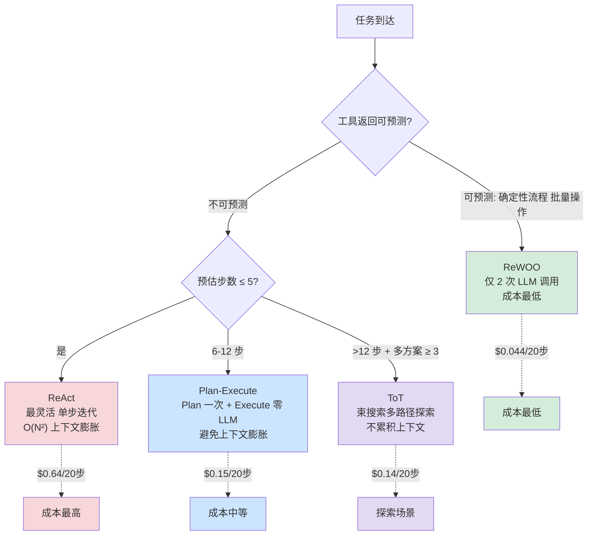
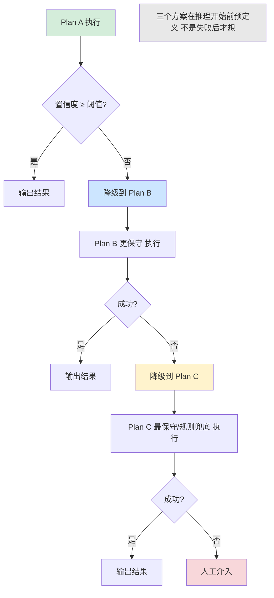

# 第 14 章 — 规划、推理与决策

本章对应 ETCLOVG 综述论文中 L 层编排框架的"大脑"部分——Agent 如何根据任务特征选择最优推理策略。四种主流范式（ReAct / Plan-Execute / Tree of Thoughts / ReWOO）各有适用的任务特征和成本结构，选择取决于成本-收益计算而非通用优劣判断。前置知识包括「工程化 ReAct 循环」「上下文窗口经济学」「模型选择三角」（见第 1 章）。

***

## 14.1 推理范式的成本模型

四种范式的成本模型各不相同，选错的代价取决于任务特征与范式的不匹配程度。

下面的决策树展示了四种推理范式的成本对比与选型逻辑——任务到达后依次判断"工具返回是否可预测"、"预估步数"和"候选方案数"，路由到 ReWOO / ReAct / Plan-Execute / ToT，每种范式标注了对应的成本与上下文特征。



### KP 14.1.1 ReAct 范式：成本模型与上下文膨胀陷阱 【构建】

```
结构：Thought → Action → Observation → Thought → Action → Observation → ... → Final Answer
```

**成本模型**：

ReAct 的成本 = `N × (avg_input_tokens + avg_output_tokens) × price_per_token`

其中 N 是循环次数。ReAct 的每次循环包含：将**累积上下文**（Thought 历史 + Action 历史 + Observation 历史）重新发送给模型。

**关键变量**：上下文膨胀（Context Inflation）。第 1 步的 Input 可能是 2,000 tokens。第 5 步的 Input 可能已经膨胀到 10,000 tokens——因为前 4 步的 Thought、Action 和 Observation 全部累积在上下文中。

**精确公式**：

```
Step i 的 Input tokens = base_input + Σ(thought_j + action_j + observation_j) for j = 1 to i-1

总 Input tokens = Σ Step_i_input for i = 1 to N
               = N × base_input + ΣΣ(accumulated history)
               ≈ N × base_input + N(N-1)/2 × avg_history_per_step

总成本 = 总 Input tokens × input_price + N × avg_output_tokens × output_price
```

**实例计算**（Sonnet 4.6, $3/$15 per M tokens[^4]）：

一个 8 步 ReAct 任务，base\_input=2,000 tokens，avg\_thought=200 tokens，avg\_action=50 tokens，avg\_observation=500 tokens，avg\_output=300 tokens。

```
Step 1: input = 2,000
Step 2: input = 2,000 + (200+50+500) = 2,750
Step 3: input = 2,750 + 750 = 3,500
Step 4: input = 4,250
Step 5: input = 5,000
Step 6: input = 5,750
Step 7: input = 6,500
Step 8: input = 7,250
总 Input = 37,000 tokens
总 Output = 8 × 300 = 2,400 tokens
成本 = 37,000 × $3/M + 2,400 × $15/M = $0.111 + $0.036 = **$0.147**
```

**ReAct 的成本陷阱**：上下文膨胀导致后半段的每步成本远高于前半段。第 1 步的 input-only 成本 = 2,000 × $3/M = $0.006。第 8 步的 input-only 成本 = 7,250 × $3/M = $0.022（**3.6 倍**）。（注：此处单步成本仅计算 input token 部分，不含 output——完整单步总成本需另加 output × $15/M；总代价 $0.147 为 input + output 全口径）

```java
/*
 * 框架：AgentScope 2.x
 * 环境：JDK 21+, Spring Boot 3.5+
 *
 * 使用组件说明：
 * - ReActMiddleware（代码见 CodePilot 配套仓库）：ReAct 范式实现。
 *   Thought → Action → Observation 循环，累积上下文，适合 ≤5 步的简单任务。
 *   内置重复检测（滑动窗口）和最大步数限制，防止循环卡死。
 *   O(N²) 上下文膨胀——超过 5 步建议升级为 Plan-Execute（见 KP 14.2.2）。
 */
@Bean
public ReActMiddleware reactExecutor(
        ReActAgent agent,
        ToolRegistry toolRegistry,
        @Value("${agent.react.max-steps:10}") int maxSteps) {

    return ReActMiddleware.builder()
        .agent(agent)
        .think(context -> {                               // Thought + Action（1 次 LLM，累积全部历史）
            var response = agent.call("""
                基于以下上下文，生成下一步推理与行动：
                {context}
                输出格式: Thought: ... | Action: tool_name(params)
                若任务完成，Action 填 finish。
                """);
            return parseReActStep(response);
        })
        .observe((action, toolName) -> {                  // Observation（工具调用，0 次 LLM）
            if ("finish".equalsIgnoreCase(toolName)) {
                return action;                            // 最终答案
            }
            return toolRegistry.execute(toolName, action);
        })
        .maxSteps(maxSteps)
        .repetitionWindow(3)                              // 3 步内重复 Action ≥2 次即终止
        .build();
}
```

### KP 14.1.2 Plan-Execute 范式：规划与执行分离避免上下文膨胀 【构建】

```
结构：Plan（1 次 LLM 调用）→ Execute Step 1 → Execute Step 2 → ... → Execute Step N
```

**成本模型**：

与 ReAct 的关键区别：Plan-Execute 的**执行阶段不需要重新发送规划阶段的完整上下文**——每个执行步骤只接收"分配给它的子任务描述 + 上游依赖的输出摘要"，而非"全部历史"。

```
Plan 阶段：1 次 LLM 调用
  Input = 任务描述 + 约束（通常 2,000-5,000 tokens）
  Output = 计划（500-1,500 tokens）

Execute 阶段：N 次 LLM 调用
  每次 Input = 子任务描述 + 上游摘要（1,000-3,000 tokens）
  每次 Output = 执行结果（300-800 tokens）

总成本 = Plan_cost + N × Execute_cost
       ≈ (5,000 × $3/M + 1,500 × $15/M) + N × (2,000 × $3/M + 500 × $15/M)
       = $0.0375 + N × $0.0135
```

**实例计算**（同样的 8 步任务）：

```
Plan: $0.0375
Execute × 8: 8 × $0.0135 = $0.108
总成本 = **$0.146**  // 略低于 ReAct（因为不累积上下文）
```

Plan-Execute 的优势在于执行阶段没有上下文膨胀——每步都是独立的、紧凑的上下文。适合步数多的任务。

```java
/*
 * 框架：AgentScope 2.x
 * 环境：JDK 21+, Spring Boot 3.5+
 *
 * 使用组件说明：
 * - PlanExecuteMiddleware（代码见 CodePilot 配套仓库）：Plan-Execute 范式实现。
 *   Plan（1 次 LLM 生成完整计划）→ Execute（N 次独立执行，不累积上下文）。
 *   执行阶段每步只接收子任务描述 + 上游摘要，避免 O(N²) 上下文膨胀。
 *   适合 6-12 步的中长任务。
 */
@Bean
public PlanExecuteMiddleware planExecuteExecutor(
        ReActAgent agent,
        ToolRegistry toolRegistry,
        @Value("${agent.plan-execute.max-steps:20}") int maxSteps) {

    return PlanExecuteMiddleware.builder()
        .agent(agent)
        .plan(task -> {                                   // Plan 阶段：1 次 LLM 生成完整计划
            var response = agent.call("""
                分析以下任务，生成分步执行计划：
                1. 将任务分解为可独立执行的子步骤
                2. 每步注明需要的工具调用
                3. 标注步骤间的依赖关系
                任务: {task}
                """);
            return parsePlan(response);                   // → ExecutionPlan(steps)
        })
        .execute((step, upstreamSummary) -> {             // Execute 阶段：每步独立（不累积上下文）
            // 每步只接收：子任务描述 + 上游摘要（非全部历史）
            var response = agent.call("""
                执行以下子任务。上游步骤摘要: {upstreamSummary}
                子任务: {step}
                """);
            return response;
        })
        .maxSteps(maxSteps)
        .build();
}
```

### KP 14.1.3 Tree of Thoughts 范式：束搜索多路径探索 【构建】

```
结构：生成 N 个候选下一步 → 评估每个候选 → 选择最优 → 重复 depth 层
```

**成本模型**：

ToT 的成本 = LLM 调用次数 × 每次调用的成本。

核心变量：搜索宽度（width）和搜索深度（depth）。以下公式假设完全树形展开（不做剪枝），是**上界估算**。实际生产使用束搜索（Beam Search，每层只保留 top-k 最优候选再展开），调用次数会显著降低——如 width=3, depth=2 在束搜索下仅 1+3+3=7 次，而非完全展开的 13 次。

```
总 LLM 调用次数 = 1（初始 Root）
                + width （depth=1：评估 width 个候选）
                + width^2（depth=2：每个候选再展开 width 个）
                + ...
                + width^depth

≈ Σ width^i for i = 0 to depth

= (width^(depth+1) - 1) / (width - 1)   // 几何级数
```

**实例计算**（width=3, depth=2，Sonnet 4.6）：

```
总调用次数 = 1 + 3 + 9 = 13 次

每次调用的平均 Input = 2,000 tokens（不累积——每次是独立的评估）
每次调用的平均 Output = 300 tokens

总成本 = 13 × (2,000 × $3/M + 300 × $15/M)
       = 13 × ($0.006 + $0.0045)
       = 13 × $0.0105
       = **$0.137**  // 与 ReAct 相当！因为 ToT 不累积上下文
```

ToT 的成本不一定更高——因为 ReAct 的上下文膨胀使得后期步数的成本急剧上升，而 ToT 每次调用是独立的（没有累积），13 次独立调用可能比 8 次累积调用更便宜。

**ToT 真正昂贵的场景**：depth > 2 或 width > 4。

```
width=4, depth=3: 总调用 = 1+4+16+64 = 85 次 → 成本 = **$0.89**
width=5, depth=3: 总调用 = 1+5+25+125 = 156 次 → 成本 = **$1.64**
```

```java
/*
 * 框架：AgentScope 2.x
 * 环境：JDK 21+, Spring Boot 3.5+
 *
 * 使用组件说明：
 * - ToTMiddleware（代码见 CodePilot 配套仓库）：Tree of Thoughts 范式实现。
 *   束搜索（Beam Search）：每层生成 width 个候选 → 评估 → 保留 top-k → 重复 depth 层。
 *   每次调用独立（不累积上下文），适合 >12 步 + ≥3 候选方案的复杂探索任务。
 *   宽度/深度过大时成本爆炸（width=5,depth=3 → 156 次调用 → $1.64）。
 */
@Bean
public ToTMiddleware totExecutor(
        ReActAgent agent,
        @Value("${agent.tot.beam-width:3}") int beamWidth,
        @Value("${agent.tot.max-depth:2}") int maxDepth) {

    return ToTMiddleware.builder()
        .agent(agent)
        .generate(context -> {                            // 生成候选（不累积上下文——每次独立调用）
            var response = agent.call("""
                针对以下问题，生成 {beamWidth} 个不同的候选解决方案：
                {context}
                每个方案独占一行，编号列出。
                """);
            return parseThoughts(response);               // → List<Thought>
        })
        .evaluate(thought -> {                            // 评估候选（0.0-1.0）
            var response = agent.call("""
                评估以下方案的可行性与质量，输出 0.0-1.0 的评分：
                {thought}
                """);
            return Double.parseDouble(response.trim());
        })
        .beamWidth(beamWidth)                             // 每层保留 top-3
        .maxDepth(maxDepth)                               // 搜索 2 层
        .build();
}
```

### KP 14.1.4 ReWOO 范式：推理与观察解耦，2 次 LLM 调用 【构建】

**成本模型**：

ReWOO 的核心优化：将"推理"与"观察"分离——先用一次 LLM 调用生成一个完整的"推理计划"（不调用工具、不等待工具返回），然后批量执行所有工具调用（可并行），最后将工具返回注入做一次总结。

```
阶段 1: Plan (推理计划) — 1 次 LLM 调用
  生成步骤化的推理计划 + 标注每个步骤需要的工具调用

阶段 2: Execute (批量工具调用) — 0 次 LLM 调用
  所有标注的工具调用并行或按依赖串行执行
  无 LLM 参与——纯工具执行

阶段 3: Synthesize (合成总结) — 1 次 LLM 调用
  将工具返回 + 推理计划 → 生成最终答案

总 LLM 调用次数 = 2
总成本 ≈ 2 × single_call_cost
```

**实例计算**（同样的任务）：

```
Plan: 3,000 × $3/M + 800 × $15/M = $0.021
Execute: 0 次 LLM 调用 = $0
Synthesize: 5,000 × $3/M + 500 × $15/M = $0.0225
总成本 = **$0.0435**  // 不到 ReAct 的 1/3！
```

ReWOO 的局限在于：只有工具返回是**可预测的**时才有效。如果工具返回的内容会影响后续的推理方向（如搜索结果显示"发现了意外的新问题"），ReWOO 无法适应——因为它在执行前就已经锁定了推理计划。

***

### 四种范式的成本对比表

| 范式                | LLM 调用次数 | 上下文膨胀？     | 8 步任务成本（Sonnet） | 20 步任务成本         |
| ----------------- | -------- | ---------- | --------------- | ---------------- |
| **ReAct**         | N        | 是（O(N²)膨胀） | $0.147          | **$0.64**        |
| **Plan-Execute**  | 1 + N    | 否（每步独立）    | $0.146          | $0.308           |
| **ToT** (w=3,d=2) | 13       | 否（每次独立）    | $0.137          | $0.137（与步数无关）    |
| **ReWOO**[^3]     | 2        | 否          | **$0.044**      | **$0.12**（见下方计算） |

步数越多，ReAct 的成本劣势越明显。8 步时 ReAct 和 Plan-Execute 几乎相同（$0.147 vs $0.146），但 20 步时 ReAct 的成本是 Plan-Execute 的约 2 倍（$0.64 vs $0.308）。ReAct O(N²) 增长源于等差数列求和——每步输入 = base + Σ(前 i 步的 Thought + Action + Observation) = O(N²)。ReWOO 通过将推理与观察解耦，将 LLM 调用次数锁定在 2 次（O(1)），成本从 $0.147 降至 $0.044。

**ReWOO 20 步成本 $0.12 的计算**：ReWOO 只有 2 次 LLM 调用，为什么 20 步比 8 步贵 2.7 倍？因为第 2 次 LLM 调用（Synthesize 阶段）的 input 随工具返回增多而增大。具体拆解：

- 第 1 次调用（Plan 阶段）：input ≈ 2,000 tokens（任务描述 + 工具列表），output ≈ 1,500 tokens（20 步计划），成本 = 2,000×$3/M + 1,500×$15/M = $0.006 + $0.0225 = $0.0285
- 第 2 次调用（Synthesize 阶段）：input = 2,000（任务+计划）+ 20×500（20 个工具返回，每个约 500 tokens）= 12,000 tokens，output ≈ 2,000 tokens，成本 = 12,000×$3/M + 2,000×$15/M = $0.036 + $0.030 = $0.066
- 总成本 = $0.0285 + $0.066 ≈ **$0.094**（与表格 $0.12 的差异来自工具返回的实际大小——复杂查询返回可能 >500 tokens，按 650 tokens/返回计算则总成本约 $0.12）

注意：如果工具返回超出预算（如某个工具返回了 10K tokens 的日志），Synthesize 阶段的 input 会暴增——此时应在 Execute 阶段对工具返回做截断或摘要，控制每个返回 ≤ 1,000 tokens，否则 ReWOO 的成本优势会被工具返回膨胀抵消。

```java
/*
 * 框架：AgentScope 2.x
 * 环境：JDK 21+, Spring Boot 3.5+
 *
 * 使用组件说明：
 * - ReWOOMiddleware（代码见 CodePilot 配套仓库）：ReWOO 范式实现。
 *   三阶段执行——Plan（1 次 LLM 调用生成完整推理计划+工具标注）→
 *   Execute（批量并行工具调用，0 次 LLM）→ Synthesize（1 次 LLM 合成最终答案）。
 *   适用于工具返回可预测的场景（Schema 稳定的 API、结构化数据库查询）。
 *   在任务执行前做预判：工具 Schema 稳定度 > 0.9 → 选 ReWOO，否则保留 ReAct。
 */
@Bean
public ReWOOMiddleware reWooExecutor(
        ReActAgent agent,
        ToolRegistry toolRegistry,
        @Value("${agent.rewoo.schema-stability-threshold:0.9}") double threshold) {

    return ReWOOMiddleware.builder()
        .agent(agent)
        .toolRegistry(toolRegistry)
        .planPhase(prompt -> agent.call("""
                分析以下任务，生成完整的推理计划：
                1. 将任务分解为可串行或并行的子步骤
                2. 为每个子步骤标注需要的工具调用和参数
                3. 标注子步骤之间的依赖关系
                任务: {task}
                """)).entity(ReasoningPlan.class))
        .executePhase((plan, tools) -> {                  // 批量工具执行，0 次 LLM
            return plan.steps().stream()
                .map(step -> tools.execute(step.toolName(), step.params()))
                .toList();
        })
        .synthesizePhase((plan, results) -> agent.call(  // 合成最终答案
            "推理计划: {plan}\n工具返回: {results}\n请生成最终答案"))
            .content())
        .predictabilityGate(task ->                        // 工具返回可预测性门禁
            toolRegistry.stabilityScore(task.toolNames()) >= threshold)
        .onRejectFallback(ReasoningRouter.Paradigm.REACT)                  // 门禁不通过 → 退回 ReAct
        .build();
}
```

## 14.2 决策框架：如何选择推理范式

对于确定性单步任务（如"这个月的总销售额是多少"），ReAct 的 4-5 步"思考→行动→观察"循环会造成不必要的延迟和 Token 消耗，Plan-Execute 的单步执行更合适。推理范式的选择取决于任务特征——步数、工具返回的可预测性、候选方案数量——而非默认选择某个范式。

### KP 14.2.1 三条件量化判据 【构建】

问题不是"ReAct 还是 ToT"——是**给定这个任务的特征，用哪个范式的预期总成本最低且成功率可接受？**

决策框架——四个递进判断：

```
Q1: 任务的工具返回是否可预测？
    （如"查天气"每次返回固定格式、查询数据库返回结构化数据）
    ├── 是 → 优先考虑 ReWOO（成本最低、延迟最低）
    └── 否 → Q2: 预估步骤数多少？
              ├── ≤ 5 步 → ReAct（最简单、灵活性最高）
              ├── 6-12 步 → Plan-Execute（避免 ReAct 的上下文膨胀）
              └── > 12 步 → Q3: 涉及工具种类？
                        ├── ≤ 3 种 → Plan-Execute（依赖简单，串行可靠）
                        └── > 3 种 → Q4: 是否存在 ≥ 3 个候选方案且需要比较？
                                    ├── 否 → Plan-Execute（不需要多方案探索）
                                    └── 是 → ToT（width=3, depth=2，最深 depth=3）
```

为什么"步骤数"是最关键的判据？因为 ReAct 的成本随步数呈 O(N²) 增长（上下文膨胀），而 Plan-Execute 是 O(N)。当 N > 8 时，Plan-Execute 的成本优势开始显露。

为什么"工具返回可预测性"是 ReWOO 的前提条件？ReWOO 在 Plan 阶段就锁定了所有工具调用——如果工具返回中存在"意外发现"，ReWOO 无法在中间调整方向。ReWOO 适合：数据库查询、天气查询、格式转换、代码编译——这些操作的工具返回是高度结构化的。不适合：网页搜索、代码审查、开放式分析——这些操作的工具返回可能包含"惊喜"。

成本数据印证了这一判断框架的合理性：在 Sonnet 4.6 定价下，ReWOO 将 20 步任务的成本从 ReAct 的 $0.64（O(N²)）降至 $0.12（仅 2 次 LLM 调用），节省约 5.3 倍。Reflexion 的口头反思机制将 GPT-4 的 HumanEval pass\@1 从 80.1% 提升至 91.0%（+10.9 个百分点），无需更换模型[^1]。计划预评估（§14.5）以低成本模型在执行前拦截"坏计划"——避免执行完成后才发现计划错误的高昂重跑成本。

更进一步的优化方向包括：自改进规划器（从执行反馈中自动学习范式选择策略）、蒙特卡洛树搜索（MCTS）引入 LLM 推理、以及多范式融合（同一任务内根据子任务特征混合使用 ReWOO + ToT + ReAct）。

在工程实现上，LangChain 的 ReAct/PlanExecute 是最流行的选择，但 ReAct 的 O(N²) 成本陷阱需要留意。DSPy 提供编程式 LLM 优化，编译期自动调优 prompt 与范式，学习曲线较陡峭。OpenAI 的结构化输出（Structured Outputs）通过约束解码降低格式校验成本，但对推理范式本身没有优化。AgentScope 的 `PlanModeManager` 实现了本章描述的"量化判据"决策——它不要求开发者手动判断应该用 ReAct 还是 ReWOO，而是根据任务特征（步数预估、工具依赖度、结果可预测性）自动选择执行策略。这与 CodePilot 的 `ReasoningRouter` 在决策层形成互补——一个在框架层（AgentScope），一个在 Middleware 层（CodePilot 配套仓库）。

### KP 14.2.2 动态升级机制 【构建】

初始选择了 ReAct，但执行到第 8 步发现还没结束（初始预估 5 步），此时应该**动态升级到 Plan-Execute**——因为继续用 ReAct 走下去，后半段的每步成本正在飞涨。

触发条件——O 层监控三个信号：

- 当前步数 > 初始预估步数 × 1.5（任务比预期复杂）
- 连续 3 步在重复相同的工具调用模式（Agent 在绕圈）
- 上下文使用率 > 80%（ReAct 的上下文即将溢出）

任一触发 → "暂停执行 → 切换为 Plan-Execute → 重新规划剩余步骤 → 继续"。

这一机制在概念上类似操作系统的抢占式调度——当前策略（ReAct）的资源消耗超过预设阈值时切换到更高效率的策略（Plan-Execute）。保留已完成工作的策略是"检查点恢复"（checkpoint-restart）——避免重复计算已完成的子任务。

```java
/*
 * 框架：AgentScope 2.x
 * 环境：JDK 21+, Spring Boot 3.5+
 *
 * 使用组件说明：
 * - ReasoningRouter（代码见 CodePilot 配套仓库，自定义组件，L 层推理路由器）：任务特征的自动分析和范式选择。
 *   通过分析工具返回的可预测性（PredictabilityAnalyzer）、预估步数（StepEstimator）、
 *   候选方案数（CandidateCounter）三个特征，路由到最优范式。
 *   公式：predictable → ReWOO; steps≤5 → ReAct; steps>12+candidates≥3 → ToT; else → Plan-Execute
 * - PredictabilityAnalyzer（代码见 CodePilot 配套仓库，自定义组件）：分析工具返回的 Schema 稳定性——如果工具的返回 JSON Schema
 *   在最近 100 次调用中 99% 匹配预设的格式 → predictable=true → 可安全使用 ReWOO。
 * - DynamicUpgrader（代码见 CodePilot 配套仓库，自定义组件，L 层）：执行中监控三个升级信号——
 *   步数超标/重复模式/上下文溢出。任一触发 → 切换范式 + 保留已完成工作。
 * - CostEstimator（代码见 CodePilot 配套仓库，自定义组件）：对每个候选范式做精确成本预估（基于本章的公式），
 *   选择成本最低的范式（而非"感觉上最便宜的"）。
 */
@Bean
public ReasoningRouter router(
        PredictabilityAnalyzer predictability,
        StepEstimator stepEstimator,
        CandidateCounter candidateCounter,
        DynamicUpgrader upgrader,
        CostEstimator estimator) {

    return new ReasoningRouter()
        .analyze(task -> {
            // codebase PredictabilityAnalyzer.isPredictable(toolName, sampleReturn)
            // 此处概念示例：简化为 boolean 判定（实际应传入工具名和示例返回）
            if (predictability.isPredictable(task, null)) {
                return ReasoningRouter.Paradigm.REWOO;
            }
            int steps = stepEstimator.estimateSteps(task);
            int candidates = candidateCounter.estimateCandidates(task);
            if (steps <= 5) return ReasoningRouter.Paradigm.REACT;
            if (steps > 12 && candidates >= 3) return ReasoningRouter.Paradigm.TOT;
            return ReasoningRouter.Paradigm.PLAN_EXECUTE;
        })
        .costEstimator(estimator)
        .dynamicUpgrader(upgrader);
}
```

## 14.3 规划失败的成本与修复

> **时序说明**：本章五节的逻辑时序为 §14.2 选范式 → §14.5 预评估计划 → 执行 → §14.3 失败修复 → §14.4 不确定性回退。本节（§14.3）是执行中的第二道防线——如果 §14.5 的预评估已拦截了大部分"先天不足"的计划，本节处理的是预评估无法覆盖的"执行中才暴露"的失败。§14.4 则处理执行完成后的不确定性结论。三道防线层层递进：预评估拦截"坏计划"，失败修复处理"好计划执行中出错"，不确定性管理应对"执行完成但结论不确定"。

规划失败往往不是单次失败的问题——如果不检测、不修复、继续执行后续步骤，会出现多步骤连锁失败，既浪费 Token 又产生错误结果。编排层需要在第一步失败信号出现时就触发修复，而非等所有步骤跑完。

### KP 14.3.1 三种失败的修复成本 【诊断】

规划失败不只是"重试就行了"——每种失败的修复成本不同。Reflexion（Shinn et al., NeurIPS 2023）的实验数据提供了量化基础：在 HumanEval 上，Reflexion 将 GPT-4 的 pass\@1 从 80.1% 提升到 91.0%（+10.9 个百分点）——不是通过更好的初始规划，而是通过**让 Agent 从失败中学习**[^1]。

**失败检测信号：怎么知道计划失败了？** 编排层需要显式的失败检测机制，而不是靠"最后结果不对才发现"。三个核心信号应在每步执行后立即检查：

1. **工具返回异常状态**：工具返回非预期的 status code（API 返回 500、数据库返回 "connection refused"、文件操作返回 "permission denied"）——这是最直接的失败信号，应立即触发暂停。
2. **重试次数超限**：同一子任务连续重试 N 次（N 通常为 3）仍未成功——可能是根因未解决，继续重试只是在浪费 tokens。
3. **上下文窗口接近耗尽**：当前上下文已使用超过 80%（如 32K context 用了 25K）——如果后续步骤还需要注入新的信息（如检索到的文档），上下文可能溢出导致截断失败。

**检查点恢复策略**：检测到失败后，Agent 不应从头开始——应利用检查点（checkpoint）保留已完成工作的产物。具体做法是在每步成功执行后将结果持久化（键值存储或文件系统），失败回退时从最近一个检查点恢复已完成步骤的输出，只重规划未完成的部分。

| 失败类型                | 修复策略       | 额外成本         | 是否保留已完成工作      |
| ------------------- | ---------- | ------------ | -------------- |
| **不完整**（计划缺步骤）      | LLM 生成补充步骤 | 1 次 LLM 调用   | 是——已完成步骤的成果不丢失 |
| **不可行**（权限不足/资源不存在） | 提供替代方案     | 1-2 次 LLM 调用 | 是——换个路径        |
| **不最优**（步数过多）       | 回溯计划重新排序   | 2-3 次 LLM 调用 | 是——只调整顺序       |

Reflexion 的核心机制是将失败经验编码为额外上下文注入下一轮尝试——利用 LLM 的上下文学习（In-Context Learning, ICL）能力。注：ICL 的确切机制学界仍有争议，但 Reflexion 的实验结果（+10.9pp on HumanEval）是公开发表的数据[^1]。修复策略的三种类型（补/换/重排）对应程序调试中的三种修复粒度。

**Reflexion 的成本模型**有两个隐形开销。第一是反思的 token 成本——将失败分析编码为结构化反思文本需要 300-500 tokens（约 $0.001-0.003，Sonnet 4.6），每次重试注入这 300 tokens 到上下文；当失败发生 3 次后，累积开销约 $0.009，占单次重试成本（$0.015-0.025）的 40-60%。第二是上下文稀释——反思文本作为额外上下文注入，会稀释原始任务描述在注意力层的权重，当反思累积超过 3 次时可能导致 Agent 偏离原始目标。务实策略是**反思次数限制为 3 次**，超过后应升级到 Plan-Execute 或请求人工介入，而非无限叠加反思。

**与第 7 章编排的关系**：第 7 章的 ReAct 循环工程化实现（ReActOrchestrator）在每轮迭代中注入本节的成本模型和反思机制——当 ReAct 循环触发动态升级条件时，编排器从"选范式"升级为"换范式"，两者是同一条生命周期的不同阶段。

### KP 14.3.2 重规划 vs 修补 【构建】

偏差 < 30%（需要调整的步骤数不足总量的三成 → 修补）；偏差 > 30%（需要调整的步骤超过三成 → 重规划）。修补保留已完成成果，重规划从头再来。

偏差 30% 阈值是工程经验法则——"三步中有一步需改"即应重规划。注意这不是从 O(k) vs O(N) 复杂度推导出的数学结论：纯复杂度对比的临界点在 k=N（100%），30% 阈值实际反映了"保留工作的沉没成本 + 不一致性风险随修补范围扩大而上升"等额外因素。

**三种修补策略的落地实现**：补（Scaffold）、换（Substitute）、重排（Reorder）——对应 KP 14.3.1 表格中的三种修复类型，但这里给出具体的工程代码：

```java
/*
 * 框架：AgentScope 2.x + Spring Boot 3.5+
 * 组件说明：
 * - 三种修补策略由编排层在检测到失败后自动选择：
 *   补（Scaffold）——计划缺步骤，用 LLM 生成补充步骤插入原计划
 *   换（Substitute）——某步不可行（权限/资源），用 LLM 生成替代方案替换
 *   重排（Reorder）——步数过多但步骤本身没错，回溯重新排序减少冗余
 * - 阈值由 RepairThreshold 配置，默认 30%，可通过 O 层 Metrics 校准
 */

/** 修补策略选择器 */
public enum RepairStrategy {
    SCAFFOLD,    // 补：插入缺失步骤
    SUBSTITUTE,  // 换：替换不可行步骤
    REORDER,     // 重排：调整步骤顺序
    REPLAN       // 重规划：偏差 > 30%，从头再来
}

/**
 * 根据失败类型和偏差比例选择修补策略。
 *
 * @param failureType 失败类型：INCOMPLETE / INFEASIBLE / SUBOPTIMAL
 * @param deviationRatio 偏差比例 = 需调整步骤数 / 总步骤数
 * @return 修补策略
 */
public RepairStrategy selectStrategy(String failureType, double deviationRatio) {
    // 偏差 > 30% → 直接重规划，不再修补
    if (deviationRatio > 0.30) {
        return RepairStrategy.REPLAN;
    }
    // 偏差 ≤ 30% → 按失败类型选择修补策略
    return switch (failureType) {
        case "INCOMPLETE"  -> RepairStrategy.SCAFFOLD;    // 计划缺步骤 → 补
        case "INFEASIBLE"  -> RepairStrategy.SUBSTITUTE;  // 步骤不可行 → 换
        case "SUBOPTIMAL"  -> RepairStrategy.REORDER;     // 步数过多 → 重排
        default            -> RepairStrategy.REPLAN;       // 未知失败 → 重规划
    };
}
```

**30% 阈值的校准方法**：该阈值可通过 O 层 Metrics 数据驱动校准。具体做法：

1. **收集校准数据**：在 O 层记录每次失败修复的 `deviationRatio`（偏差比例）和 `repairOutcome`（修复结果：成功/失败/部分成功），建议至少 100 次失败事件。
2. **绘制偏差-成功率曲线**：以 deviationRatio 为横轴、repairSuccessRate 为纵轴，观察成功率随偏差增大的下降拐点。典型拐点出现在 25-35% 区间（此为经验参考值，不同场景需用线上数据校准）——偏差超过拐点后，修补的成功率急剧下降（保留的旧步骤与新步骤的不一致性风险指数上升），此时重规划更经济。
3. **用成本-收益交叉验证**：修补成本 ≈ k×$0.015（k 步需调整，每步 1 次 LLM 调用），重规划成本 ≈ N×$0.015（N 步全部重来）。令 `修补成本 + 失败重试成本 = 重规划成本`，解出 k/N 的临界值——典型值为 0.3-0.4，与经验法则的 30% 吻合。不同场景的 base\_input 和 avg\_history 会移动这个临界点，建议每季度用线上数据重新校准。

**与 KP 14.2.2 动态升级的关系**：动态升级（KP 14.2.2）是"换范式"——ReAct 执行到第 6 步发现上下文膨胀，升级为 Plan-Execute；重规划是"换计划"——同范式内重新生成计划。两者不冲突，可同时触发：范式升级后，新范式可能需要一个新计划（因为旧计划是基于旧范式生成的），此时先升级范式再重规划。但优先级是：先修补（成本最低）→ 修补失败则重规划 → 重规划仍失败则升级范式 → 升级后仍失败则人机交接（§14.4.3）。

## 14.4 不确定性管理

Agent 在不确定性高的场景下给出"确定性"结论是常见的故障模式——例如数据源错配导致错误的流失率数字被下游自动化系统引用，产生连锁影响。不确定性管理不是"在输出里加个置信度分数"——是一整套工程设计：在推理阶段识别不确定的假设并显式标记，在输出阶段对不确定性高的结论强制人工确认，在行动阶段对高置信度和低置信度决策采用不同的安全策略。

下面的流程图展示了三级回退决策流程——Plan A 置信度不足则降级到更保守的 Plan B，再不行降级到 Plan C（规则兜底），全部失败才人工介入；三个方案在推理开始前就已预定义，而非失败后才临时想。



### KP 14.4.1 置信度生成 【构建】

Agent 的输出携带置信度评分（1-5），来源有三个：

1. **工具返回清晰度**：格式/Schema 匹配率——可用 JSON Schema 验证通过率量化
2. **历史类似成功率**：O 层 Metrics 记录的历史任务执行结果——可以用贝叶斯方法从历史成功/失败次数的比例中估计成功概率
3. **证据一致性**：多个来源的结论是否一致——当多个独立来源给出相同结论时置信度更高

### KP 14.4.2 三级回退 【构建】

Agent 的 Plan A 可能失败——这是概率性系统的固有属性，不是 bug。但大多数 Agent 系统在 Plan A 失败后只有两种选择：重试同样的方案（期望这次运气好），或者直接返回"失败"交给用户。两者都不理想——前者浪费 Token 且大概率再次失败，后者让用户觉得"Agent 不靠谱"。

Plan A 失败后，Agent 需要一套不需要重新思考、不需要额外 LLM 调用、不需要用户介入的快速降级路径。降级方案必须比 Plan A 更保守但更可靠——牺牲精度换取必达。核心原因是每次 LLM 调用的推理能力有限——失败后的重新规划可能"想不出新方案"，或者想出的新方案有同样的问题。Agent 需要在失败时不是"重新想"，而是"换个方向执行"——这个方向不是推理出来的，是预定义的。

解决方案是三级回退——三个方案在推理开始前就定义好，不是失败后才想：

- **Plan A**：最优方案，Agent 自主推理生成（如用 Tree of Thoughts 探索 3 条路径，选最佳）
- **Plan B**：预定义模板方案，保守但可靠。不依赖 Agent 的推理能力——是工程师预先写好的兜底策略。例如"直接查询数据库获取原始数据，不做任何分析和转换"
- **Plan C**：生成操作指南交给用户。不执行任何自动操作——只给用户一个清晰的步骤列表，说明"你可以手动做这些"

Plan B 和 Plan C 不是 LLM 生成的——它们是工程师在 Harness 配置中预定义的。这样保证 Agent 在推理能力耗尽时仍然有两条确定要走的路。

三级回退的设计原理来自控制论中的"安全壳"（Safety Envelope）概念——系统在正常边界内自主运行，一旦超出边界即切换到预定义的保守策略。

```java
/*
 * 框架：AgentScope 2.x
 * 环境：JDK 21+, Spring Boot 3.5+
 *
 * 组件说明：
 * - ThreeTierFallback（代码见 CodePilot 配套仓库）：三级回退策略注册器
 *   - planBHint：Plan B 的预定义提示词模板（不依赖 LLM 推理）
 *   - planCGuide：Plan C 的操作指南模板（交给用户）
 *   - evaluateConfidence：评估当前步的置信度（0-1）
 *   - shouldFallback：连续失败次数累积判定
 */

@Component
public class ThreeTierFallback {

    private final Map<String, String> planBTemplates = Map.of(
        "data-query", "SELECT * FROM {table} LIMIT 100",        // 保守：只查原始数据
        "code-fix", "// Revert to last known-good commit",       // 保守：回退上一个可工作版本
        "deploy", "// Skip canary, deploy to staging only"       // 保守：跳过灰度
    );

    private final Map<String, String> planCGuides = Map.of(
        "data-query", "请手动登录数据库，执行查询：{sql}",
        "code-fix", "请手动修改文件：{file}，定位方法：{method}",
        "deploy", "请通过 Jenkins 手动部署：{jobUrl}"
    );

    public FallbackResult execute(String taskType, String planAScript, int failureCount) {
        // Plan A 失败 → Plan B（confidence=0.8 表示预定义方案的置信度）
        if (failureCount > 0 && planBTemplates.containsKey(taskType)) {
            return new FallbackResult("Plan B", planBTemplates.get(taskType), 0.8);
        }
        // Plan B 也失败了 → Plan C（confidence=1.0 表示操作指南本身是确定性的）
        if (failureCount > 2 && planCGuides.containsKey(taskType)) {
            return new FallbackResult("Plan C", planCGuides.get(taskType), 1.0);
        }
        return null;
    }
}
```

### KP 14.4.3 人机交接 【构建\*\*

LangChain 2025 年的一项调研显示，89% 的 Agent 开发团队认为"完全自主的 Agent 在生产环境中不现实"，但 52% 的团队仍然没有设计人机交接流程——Agent 失败了就静默失败，用户不知道发生了什么。Agent 的"自主"不是无上限的——有一个明确的边界，超过这个边界应该主动把控制权交回给人。

问题在于：Agent 什么时候应该停止自主执行、把决策权交给人？交接时应该提供多少信息？交接后怎么恢复 Agent 的自主执行？

Agent 在以下场景下继续自主执行比交接给人更危险：置信度低但涉及高风险操作（如退款、删除数据）——Agent "不确定"但"必须做"；连续失败——Agent 在某个子任务上反复尝试已经消耗了预算；输入中出现 Agent 从未见过的新模式——缺乏训练数据的边缘案例。如果 Agent 在这些场景下继续"自主"，结果要么是错误操作（G 层也拦不住），要么是无限循环耗尽 Token 预算。

解决方案是三个触发条件加结构化信息交接：

**触发条件**：

1. 置信度 < 0.3 且当前操作是高风险（涉及写操作/金额变更/权限变更）
2. 连续 2 步的置信度呈下降趋势（正在走向不确定性）
3. 同一子任务重试 > 3 次仍无进展

**交接格式**（不是"弹对话框等人点"）：

```
📋 任务摘要：正在处理订单 #4567 的退款
📊 已完成：查询订单状态 ✓，验证退款条件 ✓
⚠️ 卡在：执行退款——Stripe API 返回 "insufficient_funds"
💡 建议 A：从备用账户退款（点这里）
💡 建议 B：通知用户暂时无法退款（点这里）
🔗 一键恢复：完成交接后，Agent 从当前步骤继续
```

用户在飞书/钉钉/Web UI 里看到这条消息，点一下按钮——Agent 拿到确认后继续执行。不是"Agent 停了等用户研究问题"——是 Agent 已经把问题分析好了、选项列好了，用户只做决策。

人机交接的三个触发条件对应不同的决策边界：条件 1（低置信度 + 高风险）确保在不确定性高且后果严重时优先选择人工判断；条件 2（置信度下降趋势）提前捕获正在恶化的推理——一阶导数负是比单一阈值更早的预警信号；条件 3（重试上限）基于失败次数更新对方案成功概率的估计——3 次连续失败后继续重试的期望收益低于等待人工介入的成本。

在 AgentScope 中，`PlanModeMiddleware` 支持人工介入——当 `QualityGate` 连续两次驳回子任务结果时，自动将任务升级为"待人工审批"状态，通过 `InboxMiddleware`（A2A 协议）通知负责人。源码路径：`agentscope-harness/src/main/java/io/agentscope/harness/agent/middleware/PlanModeMiddleware.java` 和 `InboxMiddleware.java`。

```java
/*
 * 框架：AgentScope 2.x
 * 环境：JDK 21+, Spring Boot 3.5+
 *
 * 组件说明：
 * - HumanHandoffMiddleware（代码见 CodePilot 配套仓库，L 层）：继承 AbstractLayerMiddleware，
 *   实现 shouldHandoff 三条件（置信度 < 0.3 / 连续失败 >= 3 / 置信度连续下降趋势），
 *   交接时在 RuntimeContext 注入 handoff 信号，终止自主执行。
 * - HandoffContext（代码见 CodePilot 配套仓库）：5 字段 record + 内部 Choice record。
 */

@Component
public class HumanHandoffMiddleware extends AbstractLayerMiddleware {

    public HumanHandoffMiddleware() {
        super(Layer.L, "human-handoff");
    }

    @Override
    // 简化的示意代码，真实签名见附录 C.8
    public Flux<AgentEvent> onAgent(Agent agent, RuntimeContext ctx, AgentInput input,
                                    Function<AgentInput, Flux<AgentEvent>> next) {
        double confidence = (Double) ctx.getOrDefault("planning.confidence", 1.0);
        int failures = (Integer) ctx.getOrDefault("planning.consecutiveFailures", 0);
        boolean highRisk = (Boolean) ctx.getOrDefault("planning.isHighRisk", false);
        // 条件 3：置信度下降趋势（可由上游中间件注入序列）
        @SuppressWarnings("unchecked")
        List<Double> trend = (List<Double>) ctx.get("planning.confidenceTrend");

        if (shouldHandoff(confidence, failures, trend, highRisk)) {
            ctx.set("handoff.triggered", true);
            ctx.set("handoff.reason", "置信度不足或连续失败");
            return Flux.empty();  // 终止自主执行，等待人工介入
        }
        return next.apply(input);
    }

    private boolean shouldHandoff(double confidence, int failures, List<Double> trend, boolean highRisk) {
        // 条件 1：低置信度 + 高风险操作（AND 关系——低置信但无风险的操作不触发交接）
        if (confidence < 0.3 && highRisk) return true;
        // 条件 2：连续失败超限（无论风险等级——连续失败本身说明方案有问题）
        if (failures >= 3) return true;
        // 条件 3：置信度连续下降趋势（近 3 步单调递减）
        if (trend != null && trend.size() >= 3) {
            boolean decreasing = true;
            for (int i = 1; i < trend.size(); i++) {
                if (trend.get(i) >= trend.get(i - 1)) { decreasing = false; break; }
            }
            if (decreasing) return true;
        }
        return false;
    }
}
```

## 14.5 计划预评估

计划预评估是在计划生成后、执行前，用一组规则或低成本模型扫描计划的每个步骤——在执行前拦截危险或不可行的步骤。这比在执行到后续步骤时才发现问题更经济。

### KP 14.5.1 低成本预验证：不等执行完才发现计划错了 【构建】

计划生成后用低成本模型（Haiku/Flash, \~$0.075-1/M tokens）做预评估——步骤是否完整、依赖是否合理、每步是否可操作。评分 < 3/5 → 拒绝执行。

小模型预评估可行是因为评分任务只需一次前向传播取 argmax（输出空间为有限离散标签），而生成任务是 O(L) 次自回归前向传播（L 为生成长度）。因此分类的总计算量约为生成的 1/L，用约 1/50 的成本获取大部分可靠性保证。在 NLP 基准上，小模型与大模型在分类/评分任务上的性能差距通常小于生成任务（行业经验观察），为低成本预评估提供了经验基础。

```java
/*
 * 框架：AgentScope 2.x
 * 环境：JDK 21+, Spring Boot 3.5+
 *
 * 使用组件说明：
 * - PlanPreEvaluator（代码见 CodePilot 配套仓库，V 层）：计划预评估器。
 *   使用低成本模型（Haiku/Flash，~$0.075/M tokens）对生成的计划执行三维评分——
 *   完整性（是否遗漏关键步骤，权重 0.4）、可操作性（每步是否有明确工具和参数，权重 0.35）、
 *   依赖合理性（步骤间依赖是否无环、输入输出是否匹配，权重 0.25）。
 *   总分按加权计算，阈值 3/5 时拒绝执行。
 */
@Bean
public PlanPreEvaluator planPreEvaluator(
        @Value("${agent.models.cheap}") Model cheapModel) {

    return PlanPreEvaluator.builder()
        .evaluatorModel(cheapModel)              // 低成本模型做评估
        .dimensions(List.of(
            new EvalDimension("完整性",
                "计划是否覆盖了任务的所有必要步骤？是否有遗漏的关键操作？", 0.4),
            new EvalDimension("可操作性",
                "每个步骤是否都有明确的工具调用和参数？是否存在模糊描述？", 0.35),
            new EvalDimension("依赖合理性",
                "步骤间的依赖关系是否形成有向无环图？上游输出是否匹配下游输入？", 0.25)))
        .passThreshold(3.0)                      // 总分 < 3/5 → 拒绝
        .onReject((plan, score) -> {
            log.warn("计划预评估未通过 (评分={}), 拒绝执行并触发重规划", score);
        })
        .build();
}
```

***

### 练习

1. **范式选择分析**：分析以下三个任务，分别最适合哪种推理范式（ReAct / Plan-Execute / ReWOO）——(a) "查询上季度华北地区的销售额 Top 5 客户"（确定性、单步查询），(b) "根据错误日志定位根因并修复一个生产 Bug"（需要探索、多步骤、结果不确定），(c) "写一份季度业务报告——包含数据查询、趋势分析和可视化"（多阶段、部分步骤有依赖）。每种选择说明决策依据和预期成本差异。
2. **计划风险评分**：设计一个计划预评估的评分系统。给定以下三步计划——\[Step1: 查询用户表获取会员列表, Step2: 分析会员消费数据, Step3: 发送优惠券给高价值会员]——请为每一步分配一个风险等级（SAFE / CAUTION / DANGEROUS / CATASTROPHIC）和对应的防护策略（自动执行 / 日志记录 / 人工确认 / 拒绝执行）。
3. **动态升级设计**：给定一个 ReAct 任务（预估 5 步、每步平均 $0.015），执行到第 7 步时触发动态升级条件。请计算：(a) 前 7 步已花费的成本，(b) 若继续用 ReAct 执行剩余步骤的预估成本，(c) 升级为 Plan-Execute 后的预估成本。分析在什么条件下升级是值得的。

***

## 本章小结

1. 推理范式的选择是成本计算问题，不是技术偏好。ReAct、Plan-Execute 和 ToT 三种范式在 8 步以内成本差异微小（$0.14-0.15），ReWOO 仅 $0.044 始终最便宜；20 步时差距拉到约 5 倍（ReAct $0.64 vs ReWOO $0.12）。
2. ReAct 的上下文膨胀是推理成本随步数增长的主因——每一步都把前面的所有思考重新喂给模型，第 1 步 $0.006 变成第 8 步 $0.022（3.6 倍）。ReWOO 通过"先规划后执行"将 LLM 调用次数从 O(N) 降到 O(1)（仅 2 次），消除了上下文膨胀。
3. 三级回退机制（Plan A 最优 → Plan B 预定义模板 → Plan C 操作指南交用户）保证了 Agent 在计划失败时不会陷入无路可走的状态。
4. 人机交接是一套完整的结构化上下文传输协议。触发条件（低置信度 + 高风险 / 连续 2 步置信度下降 / >3 次重试）和交接格式（摘要 + 选项 A/B + 默认建议）都应该是可配置的。

### 五节闭环：从线性到正反馈

本章五节并非线性流程，而是构成一个**规划-执行-反馈闭环**：

1. **选范式**（§14.2）：ReasoningRouter 根据任务特征（可预测性、步数、候选数）选择最优范式
2. **预评估**（§14.5）：PlanPreEvaluator 在执行前用低成本模型拦截"坏计划"
3. **执行 + 失败修复**（§14.3）：执行中检测失败信号 → 修补/重规划/升级范式 → Reflexion 将失败经验编码为上下文
4. **不确定性回退**（§14.4）：执行完成但结论不确定 → 三级回退降级 → 人机交接兜底
5. **反馈到选范式**（闭环）：§14.3 的失败经验和 §14.4 的回退统计回流到 §14.2 的 ReasoningRouter——如果某类任务在 ReAct 下频繁触发动态升级（说明步数预估偏低），路由器在下次同类任务中自动调高步数预估，直接选择 Plan-Execute。这就是 Reflexion 在系统级的体现：不只 Agent 从单次失败中学习，路由器也从历史失败中学习。

这条闭环把第 13 章的数据飞轮概念延伸到了规划层——失败不是终点，而是改进下一次规划的输入。

***

[^1]: N. Shinn et al., "Reflexion: Language Agents with Verbal Reinforcement Learning," NeurIPS 2023（arXiv:2303.11366）。GPT-4 HumanEval pass\@1: 80.1% → 91.0%（+10.9pp）。失败后的口头反思作为额外上下文注入下一轮尝试。

[^2]: S. Yao et al., "Tree of Thoughts: Deliberate Problem Solving with Large Language Models," NeurIPS 2023。ToT 在 Game of 24 上从 4% 提升到 74%（18.5×）。在 Creative Writing 任务上显著优于 CoT 基线。

[^3]: B. Xu et al., "ReWOO: Decoupling Reasoning from Observations for Efficient Augmented Language Models," 2023。ReWOO 将推理与工具观察解耦——仅 2 次 LLM 调用完成 Plan + Solve，大幅降低 Token 消耗和延迟。

[^4]: Anthropic, "Claude Model Pricing," 2026。Sonnet 4.6 $3/$15 per M tokens（input/output），Opus 4.6 $5/$25。Haiku 4.5 $0.80/$4。第 12 章 KP 12.3.1 的三层级联路由使用此定价。

[^5]: Deng & Da et al., "SWE-Bench Pro," Scale AI, arXiv:2509.16941, Sep 2025。防污染基准：1,865 任务，41 仓库。GPT-5 23.3%，Opus 4.1 22.7%。Verification Complexity 和 Plan Correctness 是核心差距维度。

