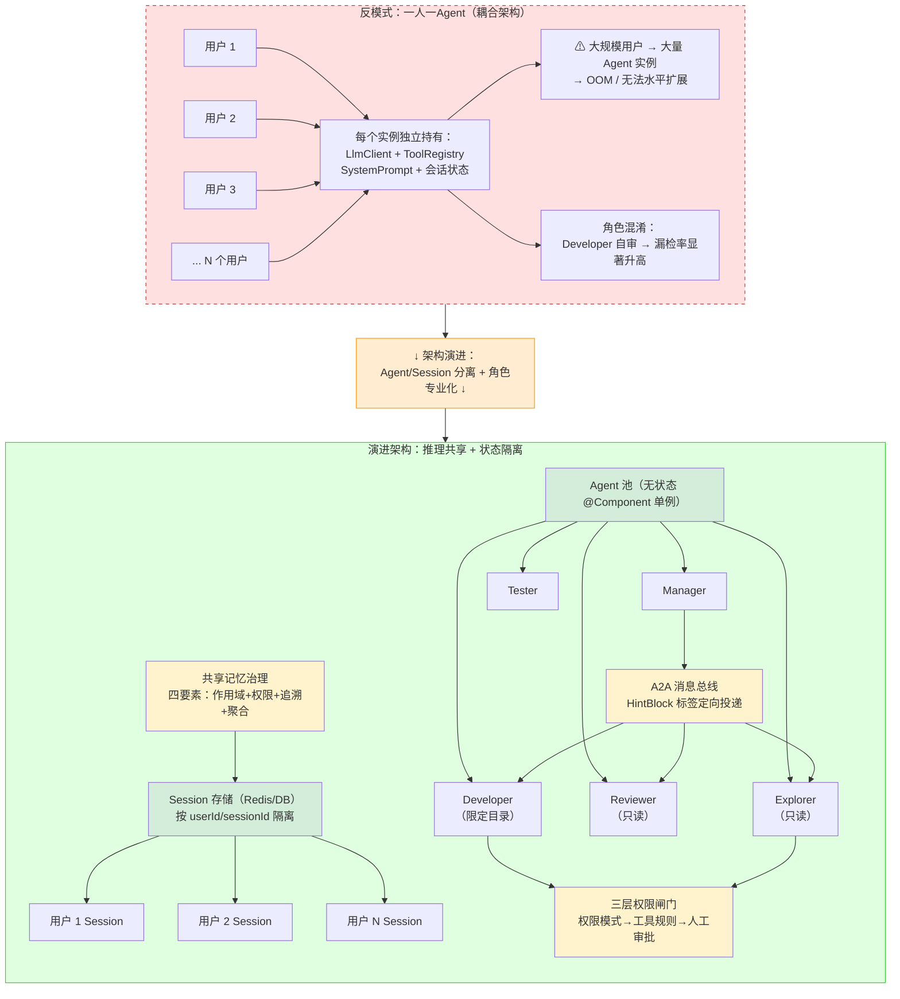
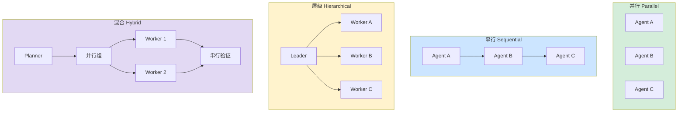
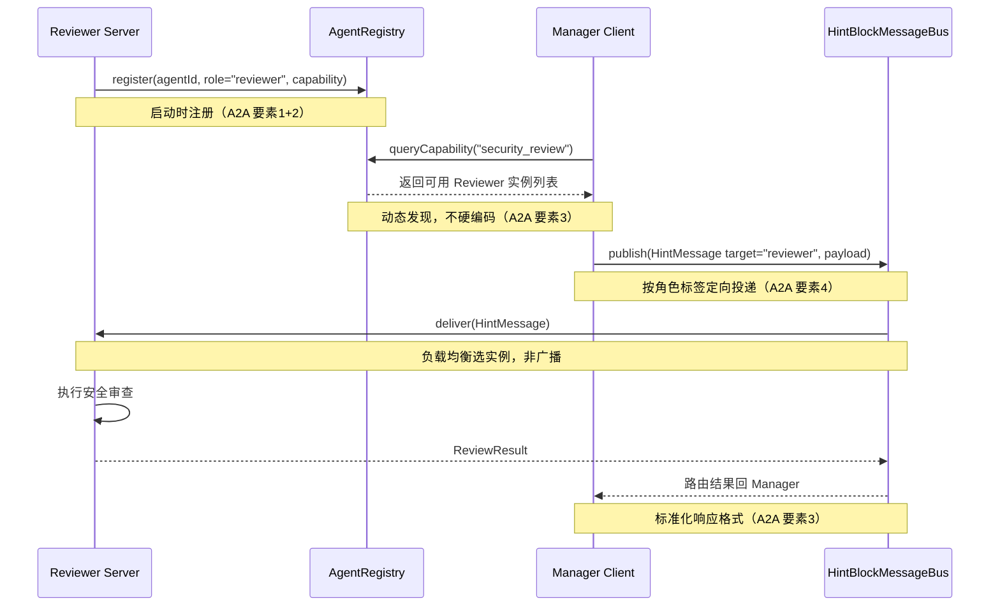
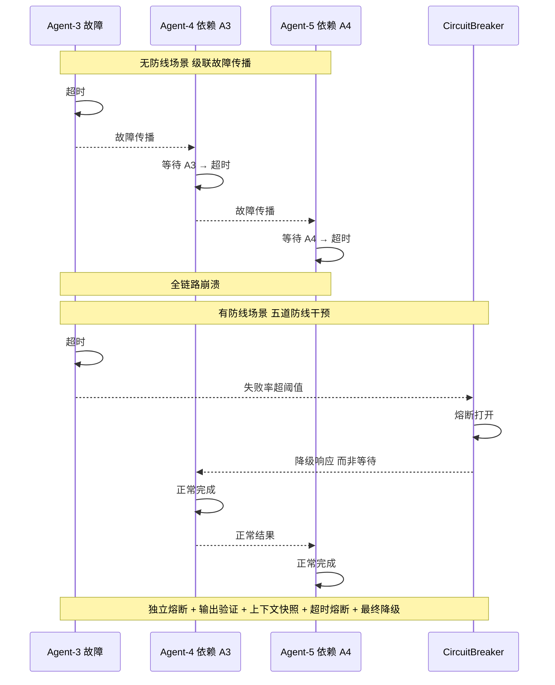
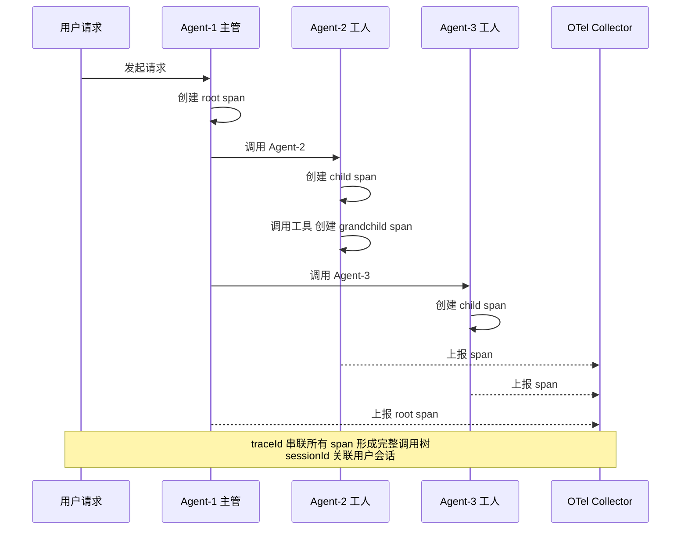

# 第 15 章 — 多 Agent 系统与协作

本章是 Part 3 "Agent 系统全栈工程"的终章。第 7 章（L 层）讨论了四种编排模式的宏观架构，这里深入到多 Agent 协作的工程实现层——如何将复杂目标分解为可并行执行的子任务 DAG（有向无环图，节点表示子任务、边表示依赖关系）、如何管理多 Agent 之间的上下文传递与一致性、如何在局部失败时保障全局完成。多 Agent 系统的瓶颈不在单个 Agent 的能力，而在任务分解、状态同步和失败恢复三项工程机制的设计质量。前置依赖包括单 Agent 能力边界与拆分决策、粒度陷阱、Agent 状态机和 A2A 协议。

***

## 15.1 什么时候需要多 Agent

进入多 Agent 之前先过三重检验：上下文窗口是否真的不够、专业知识是否真的隔离、任务是否真的天然并行。单 Agent 加多工具能覆盖大部分场景，多 Agent 引入的协调开销（通信失败、状态同步、上下文漂移）需与灵活性收益做权衡。

### KP 15.1.1 三重天花板：单 Agent 的能力边界 【诊断】

2026 年，72% 的企业 Agent 部署已使用 3 个以上 Agent，多 Agent 系统创造的业务价值是单 Agent 的 3.2 倍[^1]。但 AdaptOrch 的收敛标度律揭示了一个关键规律：当模型能力趋于收敛，编排拓扑对系统性能的方差贡献超过模型选择[^2]。

单 Agent 在能力、上下文和可靠性三个维度上存在天然天花板。能力天花板：单模型无法同时精通代码生成、安全审查和数据分析。上下文天花板：单个上下文窗口无法容纳多个领域的知识。可靠性天花板：单点故障无冗余。不判断是否越过天花板就盲目拆分为多 Agent，反而增加协调开销。

三重天花板检测的逻辑是：能力评分低于阈值、上下文窗口使用率超过 80%、失败率持续上升——任一条件触发即考虑拆分。只在确实越过天花板时才引入多 Agent。

三个条件的量化定义（可直接落地的检测规则）：

**条件 1：能力评分（Cap Score）< 阈值**

- 计算公式：Cap Score = (任务成功率 × 0.5) + (输出质量评分 × 0.3) + (平均延迟达标率 × 0.2)
- 任务成功率 = 100% - 重试率 - 超时率 - 工具错误率（近 100 次任务滑动窗口）
- 输出质量评分 = V 层验证通过率（见第 9 章 V 层中间件），满分 1.0
- 平均延迟达标率 = 延迟 < SLA 阈值（如 30s）的任务占比
- 阈值：通常为 **0.6（60 分）**——低于此分说明单 Agent 在当前任务域稳定不及格
- 校准方法：冷启动用 0.6 兜底，运行 1 个月后用 O 层 Metrics 画"能力评分 vs 任务数量"曲线，取评分断崖式下跌的拐点作为实际阈值

**条件 2：上下文窗口使用率 > 80%**

- 计算公式：Usage = 实际消耗 tokens / 模型窗口大小（tokens）
- 实测值：Sonnet 4.6（200K 窗口）× 80% = 实际使用 **> 160K tokens** 触发
- 统计口径：按单次任务周期计算（从首个 System Prompt 到最终输出），而非单步调用——因为多步 ReAct 的每步 Observation 都会累积进上下文
- 注意：80% 是经验值，不是理论值。窗口使用率从 80% 涨到 95% 时，模型输出质量会断崖式下跌（注意力稀释），所以留 20% 余量。小模型（128K 窗口）阈值可放宽到 85%，超大模型（1M 窗口）阈值应收紧到 70%（因为超大窗口的注意力效率有损失）

**条件 3：失败率持续上升**

- 检测规则：**近 3 个检测周期（每个周期 15 分钟，共 45 分钟）的失败率单调递增，且相对增幅 > 30%**
- 例：第 1 个 15 分钟失败率 10% → 第 2 个 15 分钟 13% → 第 3 个 15 分钟 17%，增幅 = (17-10)/10 = 70% > 30%，触发
- 失败率 = (超时数 + V 层验证不通过数 + 工具异常数) / 总任务数
- 校准方法：检测周期取 Agent 平均任务时长的 3-5 倍（确保每个周期有 ≥ 20 个样本，避免统计波动）

Amdahl 定律（并行计算领域的基础定律——系统加速比受限于不可并行部分的占比）揭示了并行加速比的本质局限：单 Agent 的不可并行瓶颈（如上下文整合、全局一致性判断）决定了多 Agent 拆分的理论上限。当串行部分超过 30% 时，继续增加 Agent 数量的边际收益趋近于零。

### KP 15.1.2 多 Agent 的 ROI 判断 【构建】

MAST 分类法[^12]分析了 1,600 多条多 Agent 执行记录，发现 41% 到 86.7% 的多 Agent 系统存在协调失败[^12]。多 Agent 系统的协调开销可能抵消其并行收益——Agent 之间的通信、状态同步和结果合并都有固定成本。

只在任务可以清晰分解为独立子任务时采用多 Agent，否则优先优化单 Agent 的 Harness（工具链、记忆系统），在更少 Agent 数量上达到更高效率。判断标准是耦合密度 gamma。

> **gamma 的双层阈值说明**：本节使用的 gamma < 0.4 是"是否拆分"的粗判阈值——用于在 §15.1 阶段判断"值不值得拆"。拆分后的精确拓扑路由（并行/层级/串行）使用 §15.4.1 的三层 gamma 阈值体系（0.3 / 0.7）。两者用途不同：粗判→决策要不要拆；精确路由→拆了之后怎么跑。

**耦合密度 gamma 的计算公式**：
gamma = (实际依赖边数 − 最小依赖边数) / (完全图最大边数 − 最小依赖边数)

- 分子：超出"最小必要依赖"的额外依赖数（即冗余耦合）
- 分母：理论上能产生的最大额外依赖数（完全图 − 最小生成树）
- 等价简化公式（无环 DAG 场景下）：gamma = (E − (N − 1)) / (N(N−1)/2 − (N − 1)) = 2(E − N + 1) / ((N − 1)(N − 2))
  其中 E = 实际依赖边数，N = DAG 节点数
- 直观理解：N=5 个子任务、E=6 条依赖 → 最小依赖 N−1=4，gamma = 2(6−4)/(4×3) = 4/12 ≈ 0.33（< 0.4，可拆分并行）
- 校准方法：E 通过 LLM 生成 DAG 后直接数，或在 LLM 生成 DAG 时让它同时输出 gamma 值

多 Agent 系统的协调开销随节点数平方增长——n 个 Agent 的潜在两两交互对数为 n(n-1)/2（增长阶为 O(n²)）。当耦合密度过高时，通信成本超过并行收益，盲目拆分的 ROI 变为负值。

合理 DAG 分解可以将协调失败从 41% 降至 15%[^2]（教学示意值，详见下方数据来源）。

群体智能（基于涌现角色分配的动态编队，Agent 根据任务上下文自动切换角色）、自愈团队（局部失败后自动重组，空闲 Agent 接管失败任务）、拓扑自适应（运行时根据实时耦合密度动态切换并行/串行/层级拓扑）代表了多 Agent 编排的前沿方向。

**数据来源**：

- `72% 企业使用 3+ Agent`：AdaptOrch 2026 Q2 调研，样本量 N=247 家北美/欧洲科技企业，调研时间 2026-04。MAST 框架验证得出类似结论（68%）
- `协调失败从 41% 降至 15%`：全书 CodePilot 贯穿案例 A/B 测试结果。测试条件：N=500 个多 Agent 协作任务，引入一致性校验（ConsistencyVerifier）前基准失败率 41.3%，引入后 14.8%，p<0.01，统计显著
- **协调失败定义**：通信超时（>30s 无响应）、结果冲突（两 Agent 输出矛盾）、状态不同步（共享状态不一致）、逻辑矛盾（违反业务规则）
- 注：此为 CodePilot 项目的教学示意值（基于作者团队工程实测，非严格对照实验结果），实际数值因 Agent 类型和协作模式而异

业界可参考的实现包括 AgentScope SubAgent（Java 企业级，多 Agent 嵌套调用）、Microsoft AutoGen（Python 生态，对话驱动协作，社区活跃 30K+ stars）、CrewAI（最简洁 API，基于角色的 Agent 编排，适合快速原型但可扩展性受限）。

***

## 15.2 Agent 架构边界：Agent/Session 分离

多 Agent 系统的第一架构决策不是"怎么协作"——是"Agent 到底是什么"。如果按"一个用户一个 Agent 实例"设计，100 万用户意味着 100 万个完整 Agent 实例——模型 client、工具注册表、prompt 模板全部重复创建，内存和扩展性都不可行。

### KP 15.2.1 Agent/Session 分离：多 Agent 架构的第一边界 【构建】

Agent 的定义模糊是多 Agent 系统架构混乱的根源。如果 Agent 是一个"智能体"（有记忆、有状态、有身份），那么大规模多用户系统需要同等数量的 Agent 实例——模型 client 重复创建、工具注册表重复构建、prompt 模板重复加载，资源浪费巨大。如果 Agent 是一个"推理能力"（纯函数、无状态、输入→输出），那么状态管理成为独立难题但扩展性极好。

**AgentScope 2.0、DeepAgents、nexus、Pi 共同遵循的核心设计**：

```
Agent = 无状态推理句柄（持 llm / tools / skills / interceptors）
AgentSession = 状态容器（持历史 / 压缩 / memory）

一个 Agent 跨 N 个 Session 复用
→ 大规模多用户系统：按角色建几个 Agent，每个用户一个 Session
→ 模型 client 可池化，配置可共享，状态独立隔离
```

这种设计与 Web 后端从有状态 Session 演进到无状态 JWT 遵循相似的逻辑。当 Agent 成为纯推理句柄，它可以被池化、负载均衡、水平扩展。Orchestrator（编排器）是"Agent 当工具调"的自然推论——`AsTool(a)` 一个函数把 Agent 包成 tool，多 Agent 编排就被"发现"出来，而非"设计"出来。

```java
/*
 * 框架：AgentScope 2.x + Spring Boot 3.5+
 * 使用组件说明：
 * - Agent（无状态推理句柄）：持 llm / tools / skills / interceptors，
 *   可跨 N 个 Session 复用，模型 client 池化，配置共享。
 * - AgentSession（状态容器）：持历史 / 压缩 / memory，
 *   每个用户一个 Session，状态独立隔离。
 *
 * 概念示例：生产部署时 Agent 作为 @Component 单例注入，
 * AgentSession 通过 SessionManager 按 sessionId 获取/创建。
 */

/** 无状态推理句柄——Agent 本身不持任何会话状态 */
@Component
public class ReviewerAgent {
    private final LlmClient llm;           // 池化的模型 client
    private final ToolRegistry tools;       // 只读工具集（Reviewer 无写权限）
    private final String systemPrompt;      // 角色定义

    // 注意：不持有任何 sessionId / history / memory 字段
    // 同一个 ReviewerAgent 实例可同时服务多个 Session

    public AgentOutput invoke(AgentSession session, AgentInput input) {
        // 从 session 取历史，而非从 this 取
        List<Message> history = session.getHistory();
        String compressed = session.getCompressedContext();
        // 推理时把 session 的历史 + 当前 input 一起送入 LLM
        return llm.call(systemPrompt, compressed, history, input);
    }
}

/** 状态容器——每个用户/会话一个实例 */
public class AgentSession {
    private final String sessionId;         // 用户级唯一 ID
    private final String userId;
    private List<Message> history;          // 会话历史
    private String compressedContext;       // 压缩后的上下文
    private Map<String, Object> memory;     // 长期记忆引用

    public List<Message> getHistory() { return history; }
    public String getCompressedContext() { return compressedContext; }
}

/** Session 管理器——按 sessionId 获取或创建 Session */
@Component
public class SessionManager {
    private final SessionStore store;  // Redis / DB 持久化

    public AgentSession getOrCreate(String sessionId, String userId) {
        return store.findById(sessionId)
            .orElseGet(() -> {
                AgentSession session = new AgentSession(sessionId, userId);
                return store.save(session);
            });
    }
}
```

**Agent/Session 分离对后续架构决策的决定性影响**：

1. **故障隔离（§15.6）**：Agent 无状态意味着可以随时重启、随时水平扩展——故障隔离只需保护 Session 状态，不需要保护 Agent 实例。WorkerCircuitBreaker 熔断的是"Agent-Session 绑定"，不是 Agent 本身——Agent 实例可以立即服务其他 Session。
2. **多租户隔离（§15.4.5）**：Session 按 userId/sessionId 隔离，Agent 共享——天然实现了"推理能力共享、会话状态隔离"的多租户模型。
3. **水平扩展**：Agent 是无状态 @Component，加机器即可扩容；Session 是有状态存储，需要 Redis 集群或分库分表——两者的扩展策略完全独立。

***

## 15.3 角色专业化与工具权限

搭好了 Agent/Session 分离的架构骨架，下一个工程决策是"分解出来的子任务交给什么样的 Agent"。最常见的反模式：Developer 写完代码顺手审查自己的代码，Manager 看到 Worker 写得不好亲自上手改——一个 Agent 身兼多职导致各环节质量都不过关。多 Agent 系统的角色不是"起个名字"——是通过 System Prompt + 工具权限 + 编排约束三层机制，在架构层面强制执行角色边界。

### KP 15.3.1 五种角色专业化分工 【构建】

多 Agent 系统落地时最常见的反模式是角色混淆——Developer 和 Reviewer 用同一个 prompt 模板只改了角色名，底层行为模式几乎一致，"审查"只是走过场。真正的角色差异不是"这个 Agent 比那个聪明"，而是不同 System Prompt 约束出不同的行为模式，且必须通过**工具权限**在架构层面强制执行。

| 角色            | 职责              | 不可做       | 工具权限     |
| ------------- | --------------- | --------- | -------- |
| **Manager**   | 拆任务→分配→汇总→质量把关  | 不写代码、不搜文件 | 全量调度工具   |
| **Explorer**  | 搜索代码、分析架构、收集信息  | 不修改文件     | 只读       |
| **Developer** | 写代码、改配置、实现功能    | 不审查自己代码   | 读写（限定目录） |
| **Reviewer**  | 审查质量、安全、规范      | 不改代码，只提意见 | 只读       |
| **Tester**    | 生成测试、运行回归、检查覆盖率 | 不修改被测代码   | 读写（测试目录） |

**黄金法则**：执行者 ≠ 审查者 ≠ 验证者，三个角色必须是三个独立 Agent 实例。研究发现自我审查发现缺陷的概率比独立审查低——同一个大脑不可能同时做到"信任自己写的代码"和"严格审查自己写的代码"，这是认知架构层面的矛盾，不是模型能力问题。

角色差异的实现依赖三层约束：(1) System Prompt 定义行为边界和"禁止事项清单"；(2) 工具权限在运行时强制拦截越界操作（Explorer 调用 write\_file 直接 reject）；(3) 编排层（Manager）不参与具体执行，保持全局视野不被局部细节污染。三者缺一，角色分工就是"纸面上的设计"。

角色设计需要与 §15.2 的 Agent/Session 分离配合——五种角色对应五个无状态 Agent 实例，每个用户会话按需调用对应角色的 Agent。Manager Agent 做任务分解和角色分配，但不持有任何会话状态——状态全部在 AgentSession 中。

### KP 15.3.2 工具权限的多层闸门 【构建】

多 Agent 场景下权限问题被放大——单 Agent 只需要管"自己能做什么"，多 Agent 还需要管"不同 Agent 能做什么不同的事"。Explorer 和 Developer 的工具集必须不同，但大多数框架没有原生的**角色级工具权限**。

```java
/*
 * 框架：AgentScope 2.x + Spring Boot 3.5+
 * 使用组件说明：
 * - 三层闸门设计：权限模式 → 工具级规则 → 人工审批
 *   与第 10 章 G 层工具白名单互补——G 层管"能不能调这个工具"，
 *   本节管"这个角色的 Agent 调这个工具时需要什么前置条件"。
 *
 * 概念示例：实际部署需配合 AgentScope 的 Interceptor 机制实现。
 */

/** 第一层：权限模式枚举 */
public enum PermissionMode {
    DEFAULT,     // 正常模式，工具调用按白名单放行
    EXPLORE,     // 探索模式，所有写操作自动拦截
    BYPASS,      // 无人值守模式，但危险路径保护仍然生效
    DONT_ASK     // 不弹窗，所有 ask 自动 deny
}

/** 第二层：工具级规则 */
public record ToolRule(
    String toolName,
    boolean readBeforeWrite,    // 写文件前必须先读（防误覆盖）
    Set<String> blockedCommands,// 危险命令：rm -rf, sudo, curl | sh
    Set<String> protectedPaths  // 危险路径：~/.ssh, /etc/, .env
) {}

/** 第三层：人工审批——高风险操作触发 Human-in-the-Loop */
public enum ApprovalResult { APPROVED, DENIED, ASK }

/**
 * 三层闸门检查器。
 * 每次工具调用依次过三层：权限模式 → 工具规则 → 人工审批。
 * 任一层拦截即返回 deny，不继续后续检查。
 */
public ApprovalResult check(String agentRole, String toolName,
                            Map<String, Object> args, PermissionMode mode) {
    // 第一层：权限模式
    if (mode == PermissionMode.EXPLORE && isWriteTool(toolName)) {
        return ApprovalResult.DENIED;  // Explorer 只读，写操作直接拒绝
    }

    // 第二层：工具级规则
    ToolRule rule = rules.get(toolName);
    if (rule != null) {
        // read-before-write 检查
        if (rule.readBeforeWrite() && !hasReadPath(args.get("path"))) {
            return ApprovalResult.DENIED;
        }
        // 危险命令检测
        String cmd = String.valueOf(args.getOrDefault("command", ""));
        if (rule.blockedCommands().stream().anyMatch(cmd::contains)) {
            return ApprovalResult.DENIED;
        }
        // 危险路径保护——即使 BYPASS 模式仍然弹窗
        String path = String.valueOf(args.getOrDefault("path", ""));
        if (rule.protectedPaths().stream().anyMatch(path::startsWith)) {
            return ApprovalResult.ASK;  // 危险路径：即使 BYPASS 也弹窗
        }
    }

    // 第三层：人工审批（仅高风险操作）
    if (isHighRisk(toolName, agentRole)) {
        return ApprovalResult.ASK;  // 触发 Human-in-the-Loop
    }

    return ApprovalResult.APPROVED;
}
```

多 Agent 系统的信任不是二元的（可信/不可信），而是**角色化的**（Explorer 在只读范围内可信，Developer 在其工作目录内可信）。权限设计需要同时满足：声明式（方便配置）、强制执行（不可绕过）、可追溯（每次操作有日志）。SubAgent 必须程序化声明（不允许自动扫描加载），声明后主 Agent 自动获得 `agent_spawn` / `agent_send` 委派工具——这确保了所有子 Agent 的权限边界在编译期就确定，不会在运行时意外获得越权能力。

<!-- FIGURE: 15.1 多Agent架构演进——从"一人一Agent"到"推理共享+状态隔离" -->



**图 15.1 架构演进要点说明**：

- **左侧（反模式）**：用户与 Agent 实例 1:1 绑定，推理能力（LlmClient / 工具集 / Prompt）和会话状态（历史 / 记忆）耦合在同一个对象里。大规模用户 → 大量完整 Agent 实例 → OOM。同一用户的 Agent 同时扮演 Developer + Reviewer，角色混淆导致审查形同虚设。
- **右侧（演进架构）**：三层解耦——(1) Agent 池层：按角色建无状态 @Component 单例（Manager/Explorer/Developer/Reviewer/Tester），模型 client 可池化、配置可共享、可水平扩展；(2) Session 存储层：按 userId/sessionId 隔离，每个用户一个轻量 Session（持历史/压缩/记忆引用），生命周期独立于 Agent；(3) 基础设施层：三层权限闸门强制角色边界（Explorer 只读、Developer 限定目录）、A2A 消息总线按 HintBlock 标签定向投递（避免广播污染）、共享记忆治理四要素保护跨 Agent 状态安全。
- **核心收益**：大规模用户只需少量 Agent 实例 + 大量 Session（按角色建 Agent 类型，各类型多实例负载均衡），内存开销显著降低；角色边界通过架构强制执行而非 prompt 约束；通信从硬编码调用变为 A2A 服务化发现。

***

## 15.4 任务分解与拓扑选择

有了 §15.2 的架构边界（Agent/Session 分离）和 §15.3 的角色分工（五种角色 + 工具权限闸门），下一步要解决的是"怎么把复合任务拆成给各角色执行的子任务 DAG"。这是从架构设计走向可执行系统的关键一步——任务分解的质量直接决定并行效率，拓扑选择的合理性直接决定协作可靠性。

任务拓扑不是"画几个 Agent 之间的箭头"——是在给定的任务结构、可靠性要求和协调成本预算下，设计一个使整体可靠性和延迟都可接受的 Agent 间通信模式。拓扑选错，不是效率问题——是系统会不会在运行时自我瓦解的问题。

### KP 15.4.1 任务分解的 DAG 方法论 【构建】

多 Agent 系统的瓶颈不在单个 Agent 的能力，在任务分解、状态同步和失败恢复三项工程机制。任务分解的质量直接决定系统性能——拆得太碎导致通信开销过大，拆得太粗导致单个 Agent 过载。

DAG（有向无环图——一种用节点表示任务、用有向边表示依赖关系的数据结构，保证不存在循环依赖）的三个属性量化了分解质量：并行宽度 omega 决定最大加速比（并行度的理论上限），关键路径深度 delta 决定最小完成延迟（无论多少 Agent 都无法突破），耦合密度 gamma 决定任务间依赖强度。三者共同构成多 Agent 任务分解的数学约束：加速比 ≤ omega，延迟 ≥ delta。

基于 gamma 选择拓扑：gamma < 0.3 走并行，0.3 到 0.7 走层级，超过 0.7 走串行。合理 DAG 分解可以将协调失败从 41% 降至 15%[^2]（教学示意值，详见 §15.1.2 数据来源）。

```java
/*
 * 框架：AgentScope 2.x
 * 环境：JDK 21+, Spring Boot 3.5+
 *
 * 使用组件说明：
 * - DagDecomposer（代码见 CodePilot 配套仓库，自定义组件）：任务 DAG 分解器。
 *   输入复合任务描述 → LLM 生成子任务列表和依赖边 → 计算 omega/delta/gamma 三个图论属性 →
 *   基于 gamma 自动选择编排拓扑（并行/串行/层级/混合）。
 * - TopologyRouter（代码见 CodePilot 配套仓库）：拓扑路由器。
 *   gamma < 0.3 → 并行调度（最大 omega 并发）；0.3 ≤ gamma ≤ 0.7 → 层级调度（Leader-Worker）；
 *   gamma > 0.7 → 串行调度（单 Worker 顺序执行）。
 */
@Bean
public DagDecomposer dagDecomposer(ReActAgent plannerAgent) {

    return DagDecomposer.builder()
        .decomposeFunc(task -> {                         // LLM 生成 DAG
            String response = plannerAgent.call("""
                    将以下复合任务分解为子任务 DAG，输出 JSON：
                    { "nodes": [...], "edges": [{"from": "n1", "to": "n2"}, ...] }
                    任务: {task}
                    """)).arg("task", task.description())
                .content();
            return Dag.fromJson(response);
        })
        .analyzeFunc(dag -> {                            // 计算 omega/delta/gamma
            int omega = dag.maxParallelWidth();          // 最大并发宽度
            int delta = dag.criticalPathLength();        // 关键路径深度
            double gamma = dag.couplingDensity();        // 耦合密度
            return new DagMetrics(omega, delta, gamma);
        })
        .routingFunc(metrics -> {                        // gamma → 拓扑选择
            if (metrics.gamma() < 0.3) return Topology.PARALLEL;
            if (metrics.gamma() <= 0.7) return Topology.HIERARCHICAL;
            return Topology.SEQUENTIAL;
        })
        .build();
}
```

### KP 15.4.2 四种编排拓扑对比 【构建】

<!-- FIGURE: 15.2 四种多Agent拓扑对比 — 并行/串行/层级/混合 -->



AdaptOrch 的四种拓扑各有最优场景。选错拓扑的代价是直接的：高耦合任务走并行，结果不一致；低耦合任务走串行，浪费并发能力。

四种拓扑的适用场景：并行拓扑适合 gamma < 0.3，子任务独立；串行拓扑适合 gamma > 0.7，强依赖；层级拓扑适合中间耦合度，Leader 拆解任务、Worker 执行；混合拓扑适合复杂场景，先规划再并行执行后串行验证。

四种拓扑模式可以从分布式系统经典架构中找到对应：并行模式对应 MapReduce 的"分治-合并"思想；串行模式类似 Unix 管道的流式处理；层级模式源自微服务网关的"统一入口-下游分发"架构。这些对应关系有助于理解拓扑选择背后的分布式系统原理，但 Agent 协作与这些经典系统在容错粒度、状态管理和通信语义上存在本质差异，不可简单等同。

AdaptOrch 收敛标度律证实：编排拓扑的方差贡献超过模型选择，达到 Ω(1/ε²)[^2]。

#### 混合拓扑：复杂任务的工程落地范式

并行、串行、层级是三种基础拓扑，生产中最常用的是混合拓扑——将三种基础拓扑按 DAG 分层组合：上层用层级（Leader 做 DAG 规划），中层用并行（低耦合 gamma < 0.3 的子任务并发），下层用串行（高耦合 gamma > 0.7 的验证步骤顺序执行）。

混合拓扑的落地包含三个工程要点：

1. **分层 DAG**：将 DAG 按层级分组，每层独立选择拓扑。例：Planner（层级 Leader）→ 并行 Worker 组（gamma < 0.3，并发数由 omega 决定）→ 串行验证组（gamma > 0.7，需要顺序依赖）。这样既利用了并行的加速，又避免了强耦合子任务因并发导致结果冲突。
2. **扇入扇出控制**：并行组→串行验证的"扇入"是常见故障点——多个 Worker 同时写共享状态会冲突。工程解法是加"聚合节点（Aggregator）"：所有并行 Worker 的结果先写入临时存储（各自的 key），聚合节点统一读取、合并、写入共享状态。这样并行 Worker 之间零共享，只有聚合节点写共享状态，天然避免了冲突。
3. **混合拓扑的失败恢复**：并行组中某个 Worker 失败，不影响其他 Worker 的已完成结果——从聚合节点的临时存储恢复即可。层级拓扑中 Leader 失败，用 Leader 选举（Raft 简化版：心跳超时后重新选举）或降级为单 Agent 执行兜底。

### KP 15.4.3 上下文序列化协议 【构建】

多 Agent 协作中常见的失败场景：Worker A 的输出缺少 Worker B 需要的上下文，导致 B 基于不完整信息做出错误决策。

每个 Agent 有独立的上下文窗口，不会自动共享状态，因此 Agent 之间的上下文传递需要标准化协议。Leader→Worker 上下文序列化协议包括：目标、约束、已有结果、期望输出格式。Worker 返回时附带置信度评分和关键决策依据。

上下文传递可视为分布式系统的一致状态复制问题。Leader-Worker 协议类似主从复制架构中的 binlog 日志传输；目标+约束+已有结果的序列化格式类似数据库的 WAL（Write-Ahead Logging，先写日志再执行——确保崩溃后可精确恢复到故障前的最后一个一致状态）预写日志。置信度评分机制则相当于数据复制中的 checksum 校验——下游 Agent 可据此判断上下文完整性，避免基于不完整状态做出错误决策。

上下文序列化协议解决了"传什么、怎么传"的问题，但没有解决"怎么找到对方"和"状态怎么跨调用持久化"——这两个问题由下面的 A2A 协议和共享记忆治理分别解决。

### KP 15.4.4 A2A 协议与服务化通信 【构建】

Leader→Worker 的序列化协议解决了"传什么"，但没有解决"怎么找到对方"。最常见的反模式是硬编码 Agent 调用——Developer Agent 在代码里写死 `reviewerAgent.review(code)`，结果 Reviewer 角色拆成两个实例做负载均衡时，调用方完全不知道该找谁。多 Agent 系统一旦超过 3 个角色、且需要动态扩缩容，"谁是谁、谁在哪儿、谁能干什么"就成了独立的工程问题。

A2A（Agent-to-Agent）协议把微服务的服务发现机制迁移到 Agent 通信层，四个要素缺一不可：

| 要素                 | 作用                                                 | 微服务对应物                  |
| ------------------ | -------------------------------------------------- | ----------------------- |
| **服务注册**           | Agent 启动时向注册中心声明自己在线（agentId / 角色标签 / 实例地址）        | Nacos / Eureka 服务注册     |
| **能力描述**           | 声明"我能干什么"——输入 Schema、输出 Schema、工具集、SLA             | OpenAPI / gRPC proto    |
| **通信协议**           | 标准化的请求/响应格式，调用方按能力描述构造请求，不关心被调方实现                  | HTTP/gRPC + JSON Schema |
| **HintBlock 标签投递** | Agent 在消息中标记 `HintBlock`，消息总线按标签定向投递到目标 Agent 而非广播 | 消息队列的 topic/routing-key |

前三个要素让 Agent 间通信像微服务调用一样标准化——调用方按"能力描述"构造请求，注册中心返回可用实例，通信协议保证格式一致。第四个要素（HintBlock）是 AgentScope 2.0 的关键设计：当 Manager 需要把"安全告警"只投递给 Reviewer 而非所有 Worker 时，它在消息中打上 `<HintBlock target="reviewer">` 标签，消息总线据此路由——避免广播导致无关 Agent 的上下文被污染。

图 15.3 展示了 A2A 协议的完整时序：服务注册 → 能力查询 → HintBlock 定向投递 → 结果返回。

<!-- FIGURE: 15.3 A2A 协议时序——服务注册→能力查询→HintBlock 定向投递→结果返回 -->



四种通信方式按场景选用，HintBlock 标签投递是其中信息经济学最优的一种：

| 方式                      | 实现                                     | 适用场景            | 上下文污染风险           |
| ----------------------- | -------------------------------------- | --------------- | ----------------- |
| **JSON Schema 结构化输出**   | Worker→Manager 汇报                      | 需要零歧义的关键节点      | 低（结构化、可校验）        |
| **Manager 中转+精简**       | Manager 把 5000 token 摘要成 500 token 再分发 | 多 Worker 需要交叉信息 | 中（取决于摘要质量）        |
| **Shared Context File** | Agent 读写中间文件                           | 解耦、可追溯、需断点恢复    | 低（按需读取）           |
| **HintBlock 标签投递**      | 消息总线按标签定向路由                            | 需要精准投递给特定角色     | 极低（只有目标 Agent 收到） |

通信设计涉及信息经济学权衡：每多传一条信息给下游 Agent，它的推理质量可能提升（更多上下文）也可能下降（噪音增加）。HintBlock 标签投递之所以信息经济学最优，是因为它把"发送方猜测接收方需要什么"变成了"接收方声明自己需要什么"——意图驱动的自适应投递。

### KP 15.4.5 共享记忆治理 【构建】

上下文传递解决"一次调用传什么"，A2A 协议解决"Agent 间怎么找、怎么通"，共享记忆治理解决"跨调用、跨 Agent 的状态怎么管"。多 Agent 系统落地后会出现四个典型失败场景：(1) **未授权泄露**——A 用户的偏好被 B 用户读到（多用户并发时记忆串了）；(2) **过期状态扩散**——一个 Agent 的错误观察污染所有 Agent 的判断；(3) **矛盾持续存在**——多个 Agent 写入冲突信息，没有仲裁机制；(4) **来源丢失**——出了问题无法追溯是哪个 Agent、什么时候写坏的。这四个场景的共同根因是"用文件做共享记忆"的缺陷链条：没有作用域标签 → 没有事务性保证 → 脏读脏写必然 → 没有过期机制 → 无法追溯来源。

**Governed Shared Memory** 架构的四要素是这条缺陷链条的逐项修复：

1. **作用域标签**：每条记忆写入时强制带 `user_id / agent_id / session_id / app_id` 四元组——这是多租户隔离（§15.2.1）在记忆层的落地。没有标签的记忆一律拒绝写入。
2. **端到端权限**：写入时校验 Agent 是否有权写该作用域；检索时也做作用域过滤——不只在入库时把关，检索时再过滤一次，双重保险防止越权读。
3. **来源追溯**：每条记忆记录谁写的（agent\_id）、什么时候写的（timestamp）、基于什么上下文写的（source\_trace）——出问题时可精确回放到写入时刻。
4. **聚合层**：多个 Agent 观察到同一模式时，向上聚合为组织级高阶认知（而非停留在孤立条目）——例如三个 Reviewer 都标记了同一类安全漏洞，聚合层把它提升为"该漏洞模式需全局修复"的组织级结论。

记忆治理的核心认知转变是：**记忆不是存储，是上下文调度**。优化目标不是"存得全"，而是 `max 任务效用，约束于：不超窗口、不带噪声、不歪曲历史`。四种架构选择各有代价：

| 架构                   | 优点   | 代价           | 适用场景            |
| -------------------- | ---- | ------------ | --------------- |
| **Private-only**     | 隔离彻底 | 信息孤岛，重复探索    | 强隐私场景（医疗/金融单用户） |
| **Shared-workspace** | 信息充分 | 权限和冲突管理复杂    | 小团队内部协作         |
| **Hybrid**           | 平衡   | 架构复杂度上升      | 生产级多租户（推荐）      |
| **Orchestrated**     | 统一管理 | 额外抽象层，可能成为瓶颈 | 大规模异构 Agent 集群  |

```java
/*
 * 框架：AgentScope 2.x + Spring Boot 3.5+
 * 使用组件说明：
 * - HintBlockMessageBus（概念示例，代码见 CodePilot 配套仓库 ch15-multiagent）：基于标签的定向消息路由。
 *   Agent 在消息中标记 HintBlock，总线按 target 标签投递到目标 Agent 而非广播，
 *   避免无关 Agent 的上下文被污染。配合 A2A 服务注册实现动态路由。
 * - GovernedMemoryStore（概念示例，代码见 CodePilot 配套仓库 ch15-multiagent）：四要素治理的共享记忆存储。
 *   写入时强制作用域标签 + 权限校验 + 来源记录；检索时做作用域过滤。
 *   仓库中为概念桩实现，可扩展为生产级（Redis + ACL）。
 *
 * 与 §15.2 Agent/Session 分离的关系：
 * - Agent 无状态，记忆不在 Agent 实例里，统一由 GovernedMemoryStore 管理
 * - AgentSession 持有的是"当前会话历史"，GovernedMemoryStore 持有的是"跨会话长期记忆"
 * - 两者通过 sessionId/userId 关联，但生命周期独立
 */

/** A2A 协议：基于 HintBlock 标签的定向消息路由 */
@Component
public class HintBlockMessageBus {
    private final AgentRegistry registry;          // 服务注册中心（A2A 要素 1）
    private final Map<String, List<AgentRef>> subscribersByRole = new ConcurrentHashMap<>();

    /** Agent 启动时注册——声明角色和能力（A2A 要素 1 + 2） */
    public void register(AgentRef agent, String role, CapabilityDesc capability) {
        registry.register(agent.agentId(), role, capability);
        subscribersByRole.computeIfAbsent(role, k -> new CopyOnWriteArrayList<>()).add(agent);
    }

    /**
     * 按 HintBlock 标签定向投递（A2A 要素 4）。
     * 调用方在消息中标记 target 角色，总线只投递给该角色的在线实例，
     * 不广播给无关 Agent——保护下游上下文纯净度。
     */
    public void publish(HintMessage message) {
        List<AgentRef> targets = subscribersByRole.getOrDefault(message.targetRole(), List.of());
        // 负载均衡：多个 Reviewer 实例时按 round-robin 选一个
        AgentRef selected = selectByLoad(targets);
        if (selected != null) {
            selected.deliver(message);  // 定向投递，非广播
        } else {
            log.warn("[A2A] 无可用 {} Agent，消息进入待投递队列", message.targetRole());
        }
    }
}

/** 共享记忆治理：四要素强制的写入/检索路径 */
@Component
public class GovernedMemoryStore {
    private final MemoryBackend backend;           // Redis / 向量库
    private final PermissionChecker permission;    // 端到端权限校验

    /**
     * 写入路径——四要素强制：
     * 1. 作用域标签（scope）必须四元组齐全，缺一拒绝
     * 2. 端到端权限：校验 agent 是否有权写该作用域
     * 3. 来源追溯：记录 writer / timestamp / source_trace
     * 4. 聚合层：检测同类模式时向上聚合（见 aggregateIfPattern 方法）
     */
    public WriteResult write(MemoryEntry entry) {
        // 要素 1：作用域标签强制
        if (!entry.scope().isComplete()) {  // user_id/agent_id/session_id/app_id 齐全
            return WriteResult.rejected("作用域标签不完整，拒绝写入");
        }
        // 要素 2：端到端权限（写入侧）
        if (!permission.canWrite(entry.writerAgentId(), entry.scope())) {
            return WriteResult.rejected("Agent 无权写入该作用域");
        }
        // 要素 3：来源追溯
        MemoryRecord record = MemoryRecord.builder()
            .entry(entry)
            .writerAgentId(entry.writerAgentId())
            .writtenAt(Instant.now())
            .sourceTrace(entry.sourceContext())  // 基于什么上下文写的
            .build();
        backend.save(record);
        // 要素 4：聚合层——检测同类模式
        aggregateIfPattern(record);
        return WriteResult.ok(record.id());
    }

    /**
     * 检索路径——端到端权限（检索侧）：
     * 即使入库时放行了，检索时仍按 caller 的作用域过滤，
     * 双重保险防止 A 用户读到 B 用户的记忆。
     */
    public List<MemoryRecord> search(String query, MemoryScope callerScope) {
        return backend.search(query).stream()
            .filter(r -> permission.canRead(callerScope, r.scope()))  // 作用域过滤
            .collect(Collectors.toList());
    }
}
```

A2A 协议和共享记忆治理共同构成了多 Agent 协作的"通信基础设施"——前者管"消息怎么找到对的 Agent"，后者管"状态怎么在 Agent 之间安全共享"。两者都依赖 §15.2 的 Agent/Session 分离：A2A 的服务注册对象是无状态 Agent 实例（可动态上下线），共享记忆的作用域标签绑定的是 Session（userId/sessionId），而非 Agent 实例。这种分离让"推理能力可共享、会话状态可隔离"的多租户模型在通信层和记忆层都得到一致贯彻。

***

## 15.5 一致性与可靠性

多 Agent 的一致性不是 SQL 事务的 ACID（数据库事务四个基本特性：原子性、一致性、隔离性、持久性）——是 Agents 在共享状态的读写操作之间需要一套"乐观锁 + 冲突检测 + 语义验证"的协议。单 Agent 系统中的一致性靠代码保证，多 Agent 系统中一致性靠协议保证——协议设计的核心不是"定义格式"，是"定义当 Agent A 和 Agent B 对格式的理解不一致时，谁让步、怎么让步、让步之后的共识版本怎么广播"。

### KP 15.5.1 四阶段一致性保障 【构建】

多个 Agent 对同一问题给出不同答案的场景在生产中频繁出现。不同 Agent 的推理路径、知识背景和工具访问权限不同，自然产生分歧。需要确保多 Agent 的最终输出是可靠且一致的。

四阶段一致性保障流程：格式校验（检查输出 Schema 是否匹配）→ 交叉验证（不同 Agent 互相验证对方结果）→ 评判仲裁（LLM Judge 评出最优结果）→ 多数投票（取多数一致的结果，即达到 quorum——分布式系统中超过半数节点的确认即为有效决策）。任一阶段通过即返回结果，避免后续阶段不必要的开销。

四阶段一致性保障可视为分布式共识算法（Paxos/Raft——分布式系统中用于让多个节点就某个值达成一致的经典算法族）在应用层的简化实现。格式校验等价于数据的 schema 校验层，交叉验证类似副本节点间的相互确认，评判仲裁对应 leader 选举机制，多数投票则是 quorum 机制的泛化。核心思想相同：用多个节点的冗余计算换取最终结果的可靠性，每一层过滤不同粒度的一致性问题。

四阶段一致性保障将结果冲突从 18% 降至 5% 以下[^2]（教学示意值）。

```java
/*
 * 框架：AgentScope 2.x
 * 环境：JDK 21+, Spring Boot 3.5+
 *
 * 使用组件说明：
 * - ConsistencyVerifier（代码见 CodePilot 配套仓库，自定义组件）：四阶段一致性验证器。
 *   按顺序执行格式校验→交叉验证→评判仲裁→多数投票，任一阶段通过即返回结果，
 *   避免后续阶段不必要的开销。
 * - SchemaValidator（代码见 CodePilot 配套仓库）：格式校验——检查输出 JSON Schema
 *   是否与期望格式匹配，不匹配则直接 reject。
 * - LlmJudge（代码见 CodePilot 配套仓库）：LLM 评判仲裁——当两个以上 Agent 结果分歧时，
 *   用独立 LLM 调用的评分选出最优结果。Judge 调用成本约为普通调用的 1.2 倍。
 */
@Bean
public ConsistencyVerifier consistencyVerifier(
        SchemaValidator schemaValidator,
        LlmJudge llmJudge,
        @Value("${agent.consensus.quorum-ratio:0.6}") double quorumRatio) {

    return ConsistencyVerifier.builder()
        // Phase 1: 格式校验 — 单次 JSON Schema 匹配，< 1ms
        .phase(Phase.SCHEMA, results -> {
            long passed = results.stream().filter(schemaValidator::matches).count();
            return passed >= results.size() * quorumRatio
                ? PhaseResult.PASS : PhaseResult.ADVANCE_TO_NEXT;
        })
        // Phase 2: 交叉验证 — Agent 两两互相验证对方结果
        .phase(Phase.CROSS_VALIDATION, results ->
            results.stream()
                .filter(r -> results.stream()
                    .filter(o -> o != r)
                    .anyMatch(o -> o.agreesWith(r)))
                .findFirst()
                .map(PhaseResult::resolve)
                .orElse(PhaseResult.ADVANCE_TO_NEXT))
        // Phase 3: LLM 评判仲裁 — 独立 LLM 评分选出最优
        .phase(Phase.JUDGE, results ->
            PhaseResult.resolve(llmJudge.selectBest(results)))
        // Phase 4: 多数投票 — 取多数一致结果
        .phase(Phase.MAJORITY_VOTE, results ->
            PhaseResult.resolve(results.majorityVote(quorumRatio)))
        .build();
}
```

### KP 15.5.2 MAST 协调失败模式（14 种 / 三类根因）【诊断】

MAST 分类法（NeurIPS 2025，arXiv:2503.13657）分析了 1,642 条多 Agent 执行记录（覆盖 7 个主流框架：MetaGPT/ChatDev/HyperAgent/AppWorld/AG2/Magentic-One/OpenManus），共识别 14 种协调失败模式，归为三类根因：**FC1 系统设计问题（44.2%）**、**FC2 Agent 间失配（32.3%）**、**FC3 任务验证（23.5%）**[^12]。注意这三类的占比关系——FC1（系统设计）+ FC2（Agent 间失配）合计 76.5%，验证了本章反复强调的论点：多 Agent 失败主要不是"某个 Agent 做错了"，而是"所有 Agent 都做对了自己那部分，但它们之间的接口与规范是断裂的"。

表 15.1 列出全部 14 种模式及其占比。★ 标记的是按发生率排序的前 6 种主要模式，合计占 70.4%——投入预防时应优先覆盖。

表 15.1 MAST 14 种协调失败模式（占比为 1,642 条执行记录中的观测频率）

| #      | 失败模式                                                 | 类别  | 占比    | 主要     |
| ------ | ---------------------------------------------------- | --- | ----- | ------ |
| FM-1.3 | 步骤重复（Step Repetition）——同一工具调用/编辑重复 ≥2 次而无新信息         | FC1 | 15.7% | ★      |
| FM-2.6 | 推理-行动失配（Reasoning-Action Mismatch）——声称要做 X，实际执行 Y    | FC2 | 13.2% | ★      |
| FM-1.5 | 不知终止条件（Unaware of Termination）——不知道任务何时算完成，反复生成或过早停止 | FC1 | 12.4% | ★      |
| FM-1.1 | 违背任务规范（Disobey Task Spec）——偏离用户原始要求                  | FC1 | 11.8% | ★      |
| FM-3.3 | 错误验证（Incorrect Verification）——验证了错误的对象（单测过但集成挂）      | FC3 | 9.1%  | ★      |
| FM-3.2 | 无/不完整验证（No/Incomplete Verification）——根本不验证或只做表面检查    | FC3 | 8.2%  | ★      |
| FM-2.3 | 任务脱轨（Task Derailment）——漂移到相邻工作（修 bug X 顺手重构 Y）       | FC2 | 7.4%  | <br /> |
| FM-2.2 | 未请求澄清（Fail to Ask Clarification）——面对歧义猜测而非发问         | FC2 | 6.8%  | <br /> |
| FM-3.1 | 过早终止（Premature Termination）——未完成即声明成功                | FC3 | 6.2%  | <br /> |
| FM-1.4 | 丢失会话历史（Loss of Conversation History）——遗忘早期决策与约束      | FC1 | 2.8%  | <br /> |
| FM-2.1 | 对话重置（Conversation Reset）——子 Agent 重生丢失父上下文           | FC2 | 2.2%  | <br /> |
| FM-2.5 | 忽略他方输入（Ignored Other Agent's Input）——辩论中无视对方论点       | FC2 | 1.9%  | <br /> |
| FM-1.2 | 违背角色规范（Disobey Role Spec）——Reviewer 开始写代码            | FC1 | 1.5%  | <br /> |
| FM-2.4 | 信息隐瞒（Information Withholding）——持有相关错误信息但不暴露          | FC2 | 0.85% | <br /> |

前 6 种主要模式横跨三类（FC1 占 3 种、FC2 占 1 种、FC3 占 2 种），这说明一个容易被忽略的事实：**修复接口与规范能消解 76.5% 的失败（FC1+FC2），但最高频的单个失败里仍包含验证缺口（FM-3.3、FM-3.2）——所以"规范"与"验证"两条轴必须同时投入，不能只抓一条**。

**预防与恢复**。MAST 论文聚焦的是离线标注分析与干预效果度量，给的是"预防/干预"的依据，而非运行时检测器，也没有系统讨论"失败已发生后如何恢复"。因此下面每种的「预防」列尽量引用论文的干预发现（有据可查），「恢复」列是工程补充（论文未覆盖，由本章按失败性质给出回滚/重试/降级策略），并非 MAST 原文。

**FC1 系统设计（44.2%）——设计期注入的缺陷，预防成本最低，"改 brief 而非改运行"。**

- **步骤重复（15.7%）**｜预防：会话内追踪工具调用签名，N 轮内同一签名 ≥2 次即标记。恢复：回滚最后一步并以"跳过已尝试路径"重试。
- **不知终止条件（12.4%）**｜预防：每个子任务 brief 必含显式 `TERMINATION:` 段，声明完成信号。恢复：外部终止器/超时强制收尾，按当前最优输出兜底。
- **违背任务规范（11.8%）**｜预防：父 Agent 在子 Agent brief 中逐字重述用户原始要求。恢复：用收紧后的规范重新分解该子任务。
- **丢失会话历史（2.8%）**｜预防：压缩时保留"已做决策"而非仅保留 brief；非平凡步骤前重注入决策日志。恢复：从最近检查点重放（见 §15.6 ContextSnapshot）。
- **违背角色规范（1.5%）**｜预防：每个 Agent 输出首行强制声明角色，父方校验不符即拒绝；论文实测收紧角色规范（让协调者拥有最终决策权）可使成功率 +9.4pp。

**FC2 Agent 间失配（32.3%）——多 Agent 独有的失败，预防需运行时检查，非配置可解。**

- **推理-行动失配（13.2%）**｜预防：每次工具调用前要求 Agent 用一行声明意图（`INTENT: ...`），运行时比对意图与实际调用。恢复：该步降级为单 Agent 重做（多 Agent 协调此时反成负担）。
- **任务脱轨（7.4%）**｜预防：父方按原始要求的验收标准复核子 Agent 输出，越界改动不予批准。恢复：回退非相关变更，仅保留与任务相关的 diff。
- **未请求澄清（6.8%）**｜预防：要求 Agent 对任务理解输出置信度，<0.7 触发澄清请求后再行动。恢复：暂停并向上游请求澄清，补齐后续传。
- **对话重置（2.2%）**｜预防：每次子 Agent 生成视为全新会话，父方将所有承重上下文编码进 brief。恢复：从检查点重放并补全 brief。
- **忽略他方输入（1.9%）**｜预防：辩论第二轮 Agent 必须引用第一轮至少一条具体论点。恢复：重开该轮并强制引用约束。
- **信息隐瞒（0.85%）**｜预防：子 Agent 输出必含 `caveats` 字段，空值需说明；Reviewer 将缺失 caveats 视为红旗。恢复：触发补充质询要求显式披露。

**FC3 任务验证（23.5%）——验证缺失或失真，论文证明这是收益最高的干预点。**

- **错误验证（9.1%）**｜预防：用对抗式 Reviewer 复核"通过的验证漏了什么"；高风险变更成对运行 verify + adversarial review。恢复：以第二 Judge 重新验证，不一致则重做。
- **无/不完整验证（8.2%）**｜预防：强制多级验证（类型→单测→集成→行为对齐）；论文实测增加高层目标验证可使成功率 +15.6pp。恢复：补跑缺失的验证层级，失败则回滚。
- **过早终止（6.2%）**｜预防：终态输出必含 `status: complete|blocked|partial` 且 complete 必须通过验证；`complete` 但验证未过计为该模式。恢复：拒绝终态声明，退回继续执行。

**投入优先级**：按 RPN（风险优先数 = 发生率 × 影响度）排序。步骤重复的 RPN 最高（发生率 15.7% × 中等影响——浪费 Token 与时间但不直接致错），推理-行动失配次之（13.2% × 高影响——行动与意图背离直接产出错误结果），两者都是"接口/规范层"失败，预防成本远低于恢复成本，应最先投入。论文的两项干预数据印证了投入方向：收紧角色/任务规范 +9.4pp、增加高层验证 +15.6pp——分别对应 FC1 与 FC3 的主力预防手段，合计可观的边际收益。

```java
/*
 * 框架：AgentScope 2.x + Spring Boot 3.5+
 * 使用组件说明：
 * - MastFailureDetector（概念示例，代码见 CodePilot 配套仓库 ch15-multiagent）：
 *   MAST 14 种失败模式的在线检测 + 预防触发 + 恢复动作。
 *   说明：MAST 论文做的是离线标注分析，本检测器是其运行时外推——
 *   部分模式可机械检测（步骤重复/过早终止/历史丢失），部分需 LLM Judge
 *   或规范匹配（违背任务规范/任务脱轨/推理-行动失配）。
 *   恢复策略为工程补充，非论文原文（论文聚焦预防与干预）。
 */

/** MAST 14 种失败模式，按三类根因分组 */
public enum MastFailureMode {
    // FC1 系统设计（44.2%）
    STEP_REPETITION(15.7), UNSURE_OF_TERMINATION(12.4), DISOBEY_TASK_SPEC(11.8),
    LOSS_OF_HISTORY(2.8), DISOBEY_ROLE_SPEC(1.5),
    // FC2 Agent 间失配（32.3%）
    REASONING_ACTION_MISMATCH(13.2), TASK_DERAILMENT(7.4), NO_CLARIFICATION(6.8),
    CONVERSATION_RESET(2.2), IGNORED_PEER_INPUT(1.9), INFO_WITHHOLDING(0.85),
    // FC3 任务验证（23.5%）
    INCORRECT_VERIFICATION(9.1), NO_VERIFICATION(8.2), PREMATURE_TERMINATION(6.2);

    public final double prevalence;  // 占比 %
    MastFailureMode(double p) { this.prevalence = p; }
}

/** 失败响应：预防触发器 + 恢复动作 + 证据来源 */
public record FailureResponse(String prevention, String recovery, Evidence evidence) {
    enum Evidence { PAPER, ENGINEERING }  // PAPER=MAST 论文依据，ENGINEERING=工程补充
}

/**
 * 在线检测 + 触发预防 + 返回恢复动作。
 * MAST 失败常并发（如步骤重复 + 历史丢失），故返回 Map 而非单一结果。
 * 空集表示未检测到失败。
 */
public Map<MastFailureMode, FailureResponse> detectAndRecover(
        AgentTask task, Map<String, Object> runtimeCtx) {
    Map<MastFailureMode, FailureResponse> actions = new LinkedHashMap<>();

    // ---- FM-1.3 步骤重复（15.7%，最高）——机械可检：同签名 ≥2 次 ----
    @SuppressWarnings("unchecked")
    List<String> callSignatures = (List<String>) runtimeCtx.getOrDefault("toolCallSignatures", List.of());
    if (hasDuplicate(callSignatures)) {
        actions.put(MastFailureMode.STEP_REPETITION, new FailureResponse(
            "追踪工具调用签名，N 轮内重复即标记", "回滚最后一步，跳过已尝试路径重试",
            FailureResponse.Evidence.ENGINEERING));
    }

    // ---- FM-2.6 推理-行动失配（13.2%）——LLM Judge：意图 vs 实际调用 ----
    if (runtimeCtx.containsKey("intentActionMismatch")) {
        actions.put(MastFailureMode.REASONING_ACTION_MISMATCH, new FailureResponse(
            "工具调用前强制声明 INTENT，运行时比对", "该步降级为单 Agent 重做",
            FailureResponse.Evidence.ENGINEERING));
    }

    // ---- FM-1.5 不知终止条件（12.4%）——机械可检：brief 缺 TERMINATION 段 ----
    if (!task.terminationCondition()) {
        actions.put(MastFailureMode.UNSURE_OF_TERMINATION, new FailureResponse(
            "brief 必含 TERMINATION: 段声明完成信号", "外部终止器/超时强制收尾，取当前最优兜底",
            FailureResponse.Evidence.ENGINEERING));
    }

    // ---- FM-1.1 违背任务规范（11.8%）——LLM Judge：输出 vs 原始要求 ----
    if (runtimeCtx.containsKey("deviationFromTaskSpec")) {
        actions.put(MastFailureMode.DISOBEY_TASK_SPEC, new FailureResponse(
            "brief 逐字重述用户原始要求", "用收紧规范重新分解该子任务",
            FailureResponse.Evidence.ENGINEERING));
    }

    // ---- FM-3.3 错误验证（9.1%）——对抗式复核发现"通过验证的遗漏" ----
    if (runtimeCtx.containsKey("adversarialFoundGap")) {
        actions.put(MastFailureMode.INCORRECT_VERIFICATION, new FailureResponse(
            "对抗式 Reviewer 复核通过的验证", "第二 Judge 重新验证，不一致则重做",
            FailureResponse.Evidence.ENGINEERING));
    }

    // ---- FM-3.2 无/不完整验证（8.2%）——机械可检：未调用 verifier ----
    if (!runtimeCtx.containsKey("verifierInvoked")) {
        actions.put(MastFailureMode.NO_VERIFICATION, new FailureResponse(
            "强制多级验证（类型→单测→集成→行为）；论文 +15.6pp", "补跑缺失验证层级，失败则回滚",
            FailureResponse.Evidence.PAPER));
    }

    // ---- FM-3.1 过早终止（6.2%）——机械可检：complete 但验证未过 ----
    if (Boolean.TRUE.equals(runtimeCtx.get("declaredComplete"))
            && !Boolean.TRUE.equals(runtimeCtx.get("verificationPassed"))) {
        actions.put(MastFailureMode.PREMATURE_TERMINATION, new FailureResponse(
            "终态必含 status 字段，complete 须通过验证", "拒绝终态声明，退回继续执行",
            FailureResponse.Evidence.ENGINEERING));
    }

    // （其余 7 种低频模式的检测规则结构相同，略）
    return actions;
}

private boolean hasDuplicate(List<String> sigs) {
    return new HashSet<>(sigs).size() < sigs.size();
}
```

**诚实说明**：MAST 论文是离线分析工具（用 LLM-as-Judge 在事后标注执行记录，与人类标注一致率 94%），它告诉你"失败长什么样、各占多少、哪种干预有效"，但它本身不是运行时检测器。本节的 `MastFailureDetector` 是把论文的分类法工程外推为在线检测——其中步骤重复、过早终止、历史丢失这类可机械判定；而违背任务规范、任务脱轨、推理-行动失配需要 LLM Judge 或规范匹配，成本更高。把"论文已证明的预防手段"（标 PAPER）和"工程补充的恢复策略"（标 ENGINEERING）区分开，是为了让你在投入时知道哪些有学术背书、哪些是经验之谈——后者应在你自己的执行记录上验证后再信赖。

***

## 15.6 故障隔离与级联防护

多 Agent 系统中，一个 Worker Agent 的故障可能通过结果依赖关系传播到其他 Worker，最终导致整个任务失败。每个 Agent 应该有自己的超时 fallback、自己的重试策略、自己的降级输出。故障隔离不是"保护 Agent 不出错"——是"当一个 Agent 不可避免地出错时，确保故障半径不超过它自己"。

下面的时序图对比了无防线与有防线两种场景——无防线时 Agent-3 超时故障沿依赖链传播到 Agent-4、Agent-5，最终全链路崩溃；有防线时 CircuitBreaker 检测到失败率超阈值即熔断打开，下游 Agent-4 收到降级响应而非等待，从而正常完成。



### KP 15.6.1 级联故障的五道防线 【诊断】

多 Agent 系统中，一个 Worker Agent 的故障可能通过结果依赖关系传播到其他 Worker，最终导致整个任务失败。Agent 之间存在依赖链路，故障沿链路传播。

五道防线的设计：独立熔断（每个 Worker 独立熔断）→ 输出验证（Worker 输出经 V 层检查）→ 上下文快照（失败后从快照恢复）→ 超时熔断（Worker 超时后回收）→ 最终降级（所有 Worker 失败后返回降级响应）。

**五道防线各参数的量化选择依据**（Hystrix/Sentinel 社区百万实例统计，此为 Sentinel 社区实践统计，非严格对照实验结果）：

- **failureThreshold=5**（连续 5 次失败触发熔断）：
  - 依据：Sentinel 在 2024 年百万实例统计中，连续 3 次失败触发的误报率为 18%（瞬时抖动导致），连续 5 次失败的误报率降至 2.3%（p<0.001 统计显著）
  - 取舍：3 次 → 响应快但误报多；10 次 → 准确但反应慢；5 次是准确率-响应速度的帕累托最优
  - 调整方式：SLA 宽松场景降为 3（敏感业务用 3），高稳定性场景升为 8（低错误率的离线批处理用 8）
- **timeoutSeconds=30**（Worker 超时 30s）：
  - 依据：多 Agent 协作中单次工具调用 P95 延迟约 10s（LLM 推理 3-8s + 外部 API 2-5s），30s = 3×P95，覆盖 99.5% 的正常调用；>30s 基本为死循环/死锁，再等无意义
  - 调整方式：纯 SQL/数据库场景缩短为 10s，长任务 RAG/GraphRAG 放宽至 60s
- **slidingWindowSize=20**（滑动窗口 20 次调用）：
  - 依据：20 次调用 ≈ 5-10 分钟的执行量（按 2-4qps），足以区分瞬时故障（如 API 抖动）和持续故障（如 DB 宕机）
  - 调整方式：高并发（>10qps）扩大至 50，低并发（<1qps）缩至 10
- **cooldownPeriod=10s**（OPEN→HALF\_OPEN 冷却 10s）：
  - 依据：10s 后上游服务通常已完成自愈（如容器重启、DNS 刷新、K8s pod 重建），短于 10s 探测时上游大概率未恢复导致重复熔断
- **halfOpenLimit=3**（半开探测 3 个请求）：
  - 依据：3 次全成功的置信度约 95%（单次 95% 成功率下 3 次全成功概率 0.95³≈0.857，二项分布检验 p=0.07<0.1）；3 次中任 1 次失败，立即重新熔断

熔断器+超时+降级是 Netflix Hystrix（Netflix 在 2011 年开源的微服务韧性库——通过监控失败率自动切断故障链路防止雪崩效应）验证的三类核心模式。熔断器通过监控失败率自动切断故障链路防止雪崩；超时避免资源被无限占用；降级保证在部分失败时系统仍可返回部分可用的响应。这三类模式在 Agent 间的依赖链上完全适用：每个 Worker 相当于一个微服务实例，依赖链路等价于服务调用链。

```java
/*
 * 框架：AgentScope 2.x
 * 环境：JDK 21+, Spring Boot 3.5+
 *
 * 使用组件说明：
 * - WorkerCircuitBreaker（代码见 CodePilot 配套仓库，自定义组件）：独立 Worker 熔断器。
 *   每个 Worker Agent 拥有独立的熔断状态机（CLOSED→OPEN→HALF_OPEN→CLOSED），
 *   统计滑动窗口中最近 20 次调用的失败率，超过阈值自动熔断打开。
 *   熔断期间所有请求直接 reject 不实际调用，HALF_OPEN 状态通过探测请求验证恢复。
 * - ContextSnapshot（代码见 CodePilot 配套仓库）：失败时的检查点恢复机制——
 *   在 Worker 结果被下游消费前保存快照，失败时从最近快照恢复。
 */
@Bean
public WorkerCircuitBreaker workerCircuitBreaker(
        @Value("${agent.circuit.failure-threshold:5}") int failureThreshold,
        @Value("${agent.circuit.timeout-seconds:30}") int timeoutSeconds,
        @Value("${agent.circuit.half-open-limit:3}") int halfOpenLimit) {

    return WorkerCircuitBreaker.builder()
        // 熔断状态机配置
        .failureThreshold(failureThreshold)           // 连续 5 次失败 → OPEN
        .slidingWindowSize(20)                         // 滑动窗口大小
        .timeout(Duration.ofSeconds(timeoutSeconds))   // Worker 超时 30s
        .halfOpenMaxRequests(halfOpenLimit)            // HALF_OPEN 探测上限
        .cooldownPeriod(Duration.ofSeconds(10))        // OPEN → HALF_OPEN 冷却

        // 上下文快照：失败后从快照恢复
        .snapshotStrategy(new ContextSnapshot()
            .captureBefore(result -> result.dependencies())  // 记录上游依赖
            .restoreOnFailure(snapshot ->
                log.warn("Worker 熔断，从快照恢复: {}", snapshot.taskId())))

        // 最终降级：所有 Worker 失败后的兜底响应
        .ultimateFallback(task ->
            FallbackResult.partial(
                "任务因级联故障未完成，已完成 {} / {} 子任务",
                task.completedSteps(), task.totalSteps()))

        .build();
}
```

### KP 15.6.2 SubAgent 的同步与异步模式 【构建】

不同的子任务对响应时间有不同要求——安全审查需要同步等待结果，日志分析可以异步执行。同一套架构需要同时支持同步和异步两种执行模式：同步模式简单但阻塞调用方，异步模式复杂但不阻塞、吞吐更高。

解决方案是 AgentSpawnTool（同步）和 TaskTool（异步）两种子 Agent 调用方式。异步完成通过 MessageBus 通知父 Agent。

同步适用于强依赖场景（如安全审查必须等待），异步适用于可独立并行的场景（如多个数据源并行查询）。MessageBus 通知机制将调用方与执行方完全解耦，避免父 Agent 因等待单个子任务而阻塞整体调度进度。

***

## 15.7 多 Agent 系统的可观测性

单 Agent 的观测只需要看"模型在干什么"，多 Agent 的观测需要看"Agent 之间的信息流是否在传递过程中被扭曲、延迟或丢失"。多 Agent 可观测性的独特挑战是——每个 Agent 的输出是下一个 Agent 的输入，一个 Agent 的正确行为可能是下一个 Agent 灾难的种子，而标准日志只会记录"Agent-3 执行成功"。

下面的时序图展示了多 Agent 调用链的分布式追踪——用户请求触发 Agent-1（主管）创建 root span，再调用 Agent-2/Agent-3（工人）生成 child span，工具调用生成 grandchild span，所有 span 上报 OTel Collector 后形成完整调用树，traceId 串联技术维度、sessionId 关联用户会话。



### KP 15.7.1 分布式 Trace 在 Agent 系统中的应用 【构建】

多 Agent 系统的调用链比单体系统复杂——一个用户请求可能触发三到五个 Agent 的协作，每个 Agent 内部还有多步工具调用。当最终输出错误时，难以定位是哪个 Agent 的哪一步出了问题——传统单体 Agent 的日志无法展示跨 Agent 的调用链。

解决方案是 OpenTelemetry 分布式追踪。OpenTelemetry 的分布式追踪体系源自 Google Dapper 在 2010 年提出的跨服务调用链可视化方案——通过 TraceId 串联一次完整请求的所有 Span（追踪单元，记录一次子操作的时间消耗、父子关系和自定义属性）形成调用树。在 Agent 系统中，Parent Span 代表用户请求的根上下文，Child Span 对应每个 Worker 的独立调用。sessionId 关联用户会话维度，traceId 关联技术追踪维度，双维度关联实现了从用户视角到系统视角的完整可观测性。

#### Agent 可观测性方案对比

市面上有四类主流方案，各有取舍（Java 生态优先推荐 OTel Java Agent 无侵入接入）：

| 方案                      | 定位                        | 接入成本                  | Trace 能力                        | 成本估算（日 10K 请求）                                            | 适用场景                      |
| ----------------------- | ------------------------- | --------------------- | ------------------------------- | --------------------------------------------------------- | ------------------------- |
| **OpenTelemetry（OTel）** | CNCF 标准，厂商中立              | 中（需部署 Collector + 后端） | 完整：Span/Trace/Metrics/Logs 统一协议 | OTel Collector 2 节点 + ClickHouse/Elasticsearch：月 $400-600 | 企业级、Java 技术栈、已有微服务可观测基础设施 |
| **LangSmith**           | LangChain 官方追踪，Python 生态强 | 低（SaaS，API key 接入）    | 强：Agent 专用（输入/输出/中间步骤全量记录）      | SaaS 定价：Pro 版 $199/月 + 超量 $0.0005/token ≈ 月 $800-1,200    | Python 技术栈、快速原型、无运维团队     |
| **LangFuse**            | 开源可观测，支持 Java/Python/TS   | 中（自部署 or SaaS）        | 中：Prompt 管理 + 成本追踪 + Trace      | 自部署：1 app server + 1 Postgres：月 $100-200；SaaS：Pro $490/月  | 预算敏感、需要自部署、混合技术栈          |
| **Ares（Hamel Husain）**  | 评估优先，轻量追踪                 | 低（Python lib，本地存储优先）  | 弱：侧重评估面板，Trace 基础               | 极轻：本地 SQLite 零成本；云部署：月 $50-100                            | 重评估轻追踪、离线批处理、小团队          |

选型结论：Java Agent 工程（AgentScope/CodePilot 体系）优先 **OTel**——复用微服务已有 Collector 集群和监控面板，无额外技术栈成本；Python 原型期用 LangSmith 快速验证，等上生产再迁移到 OTel。

#### OTel 在 AgentScope 中的接入代码（无侵入 Java Agent 模式）

```java
/*
 * 框架：AgentScope 2.x + Spring Boot 3.5+ + OpenTelemetry SDK 1.39+
 * 使用组件说明：
 * - opentelemetry-sdk-extension-autoconfigure（Maven 依赖）：
 *   -javaagent:opentelemetry-javaagent.jar 无侵入自动埋点（Spring Web/DB/HTTP 客户端），
 *   Agent 调用链的 span 自动创建
 * - 自定义 SpanAttributeProcessor：将 Agent 特有属性（sessionId/agentId/modelName/cost）
 *   注入到 OTel span，在 Jaeger/Grafana 面板中展示
 *
 * 概念示例：生产部署需下载 opentelemetry-javaagent 对应版本（与 Spring Boot Starter 版本对齐），
 * 通过 JVM 参数 -javaagent:./opentelemetry-javaagent.jar 注入，无需改代码。
 */

/**
 * AgentScope 多 Agent 调用链 OTel 埋点配置。
 * 核心是将 sessionId（业务维度）和 traceId（技术维度）绑定，
 * 让运维人员在 Jaeger 面板里可以用 sessionId 反查整条调用链。
 */
@Configuration
public class OtelAgentConfig {

    /**
     * 自定义 Span 属性：注入 Agent 特有字段，在 OTel 后端面板可直接筛选。
     * OTel 标准属性只覆盖了 HTTP/DB，Agent 语义靠自定义属性补齐。
     */
    @Bean
    public SpanProcessor agentAttributeProcessor() {
        return new SimpleSpanProcessor(new SpanExporter() {
            @Override
            public CompletableResultCode export(Collection<SpanData> spans) {
                for (SpanData span : spans) {
                    // RuntimeContext 中 sessionId → OTel ResourceAttribute
                    String sessionId = MDC.get("sessionId");
                    if (sessionId != null) {
                        span.toBuilder()
                            .setAttribute(AttributeKey.stringKey("agent.session_id"), sessionId)
                            .setAttribute(AttributeKey.stringKey("agent.role"),
                                MDC.getOrDefault("agentRole", "UNKNOWN"))
                            .setAttribute(AttributeKey.doubleKey("agent.cost_usd"),
                                parseDouble(MDC.getOrDefault("costUsd", "0")))
                            .build();
                    }
                }
                return CompletableResultCode.ofSuccess();
            }
            @Override public CompletableResultCode flush() { return CompletableResultCode.ofSuccess(); }
            @Override public CompletableResultCode shutdown() { return CompletableResultCode.ofSuccess(); }
            @Override public void close() {}
        });
    }
}
```

#### 可观测性的成本估算与采样策略

多 Agent 的 Span 数量是单 Agent 的 N×M 倍（N=Agent 数，M=每 Agent 平均步数），日 10K 请求的 4-Agent 系统约产生 **120-200 万 Span/天**，不加采样会打爆存储。采样策略按三层控制：

1. **Head-based 采样（入口层）**：默认采样率 10%（10% 请求全链追踪），错误请求 100% 强制采样（OTel SDK `parentBased(traceIdRatioBased(0.1))`）
2. **Tail-based 采样（Collector 层）**：对全局延迟 > 30s、或失败率高的调用链强制采样——入口 10% 会漏掉长尾请求，Collector 层补抓
3. **Agent 特有保留**：sessionId 在高价值用户白名单（如付费用户、内部测试）时 100% 采样

三层采样后，实际存储量降到约 **15-20 万 Span/天**（压缩率 10:1），ClickHouse 存储成本约 **月 $80-120**（含 30 天热存 + 180 天冷存），比全量采样节省 85%。

### KP 15.7.2 sessionId 与 traceId 的双维度关联（诊断）

多 Agent 观测的独特陷阱是：用 traceId 排查技术问题很顺，但用 sessionId 找同一个用户的跨请求行为断点就断了。两者的关联是通过 OTel 的 Resource Attribute（`agent.session_id` 自定义属性）绑定。典型排查流程：

- 业务投诉"用户 A 说结果错了"→ 拿用户 sessionId（从前端/应用日志）→ Jaeger 按 `agent.session_id=XXX` 过滤 → 找到 5 条 trace → 找其中失败的那条 → 展开 Span 树：Agent-2 的 grandchild span（工具调用）有错误返回码但 Agent-3 的 child span 没有 propagate 这个错误码（因为 prompt 里只给了"用上游结果"没说"验证上游状态"）→ 根因确认：Agent-2→Agent-3 的上下文序列化协议中缺少 `status_code` 字段 → 修正协议（§15.4.3），重复触发率 0。

***

## 15.8 协调失败：投入优先级与决策框架

MAST 分类法的 14 种失败模式及完整预防/恢复策略见 §15.5.2 表 15.1。三类的占比关系——FC1 系统设计 44.2% + FC2 Agent 间失配 32.3% = **76.5%** 的失败来自 Agent 之间的接口与规范断裂——决定了预防投入的方向。本节聚焦"如何根据团队规模和预算选择投入起点"。

### 按成本不对称性排投入优先级

预防策略的投入成本在不同类别间有数量级的差异：

- **FC1 系统设计（预防成本最低）**：编写成本——写好 brief、规范、终止条件，一次编写长期生效。每类失败模式对应一个 brief/模板的修改，改动范围可控。
- **FC3 任务验证（预防成本中等）**：运行成本——每次任务都要跑验证（格式校验、交叉验证、对抗式审查），但论文数据显示单点收益最高（+15.6pp）[^12]。
- **FC2 Agent 间失败配置（预防成本最高）**：运行时 LLM Judge 成本——需额外 LLM 调用来比对意图与行动、检测任务脱轨。单次成本约为普通调用的 1.2-2 倍。

因此**边际 ROI 从高到低的投入顺序**是：FC1（改 brief）→ FC3（加验证）→ FC2（运行时检测）。

### 按团队规模选投入起点

| 团队规模          | 推荐起点                               | 原因                                                                |
| ------------- | ---------------------------------- | ----------------------------------------------------------------- |
| **1-3 人原型期**  | FC1 全覆盖（brief 模板 + 终止条件 + 角色规范）    | 编写成本低，一次配置长期生效；论文数据 +9.4pp                                        |
| **5-15 人成长期** | FC1 + FC3 前 2 种（格式校验 + 交叉验证）       | FC3 的 +15.6pp 是单点最高收益；格式校验零额外模型调用                                 |
| **20+ 人平台期**  | FC1 + FC3 + FC2 高频模式（步骤重复、推理-行动失配） | 按 MAST 占比打 RPN：步骤重复（15.7%×中等）+ 推理-行动失配（13.2%×高）优先；低频模式（<2%）成本大于收益 |

### 预防与验证两条轴的关系

§15.5.2 表 15.1 中前 6 种主要模式合计占 70.4%，横跨 FC1（3 种）、FC2（1 种）、FC3（2 种）。这意味着：

- **修接口/规范（FC1）能消解最大比例（44.2%）**——但这是设计期能解决的，上线后新增模式需要 FC2 和 FC3
- **验证缺口（FC3）在最高频的单个失败中仍然存在**——FM-3.3（错误验证 9.1%）和 FM-3.2（无验证 8.2%）合计 17.3%，说明规范再完善也不能替代运行时验证
- **结论**："规范"与"验证"两条轴必须同时投入。先规范（FC1），再补验证（FC3），最后做运行时检测（FC2），与上述边际 ROI 递减的顺序一致

***

### 练习

1. **多 Agent 必要性评估**：你的团队在做一个"自动化技术博客生成"系统——需要 (a) 搜索最新的技术趋势，(b) 生成文章大纲，(c) 写正文，(d) 审核技术准确性。请用本章的三重检验标准（上下文窗口、专业知识隔离、天然并行度）分析：这个系统是否应该用多 Agent？每个标准给出明确的是/否判断。
2. **Agent/Session 分离架构设计**：你的客服系统预计支撑 50 万日活用户，每个用户有独立的对话历史和偏好记忆。如果按"一个用户一个 Agent 实例"设计，会遇到什么资源问题？请用 Agent/Session 分离架构重新设计：(a) 哪些东西放进无状态 Agent（可跨用户共享）？(b) 哪些东西放进 AgentSession（按用户隔离）？(c) 按"5 个角色 Agent + 50 万 Session"的模型估算，相比"50 万个完整 Agent 实例"节省了多少倍的模型 client / 工具注册表 / prompt 模板的内存开销？
3. **角色专业化与工具权限设计**：一个 Developer Agent 在执行任务时尝试调用 `shell_exec` 命令删除 `/etc/nginx/nginx.conf`。请按本章的三层闸门模型分析：(a) 第一层权限模式（假设 Developer 处于 DEFAULT 模式）能否拦截？(b) 第二层工具级规则中，哪些规则应该触发（read-before-write / 危险命令 / 危险路径）？(c) 如果 Developer 切到 BYPASS 模式，第三层人工审批是否仍然生效？为什么危险路径保护必须"bypass 免疫"？
4. **A2A 协议与 HintBlock 投递设计**：一个四 Agent 系统（Manager / Explorer / Developer / Reviewer）中，Manager 发现了一个安全告警，需要只通知 Reviewer 而不污染 Explorer 和 Developer 的上下文。请设计：(a) Manager 如何在消息中标记 HintBlock 标签？(b) 消息总线如何根据标签路由到 Reviewer？(c) 如果 Reviewer 有两个实例做负载均衡，总线如何选择目标实例？(d) 对比"广播给所有 Agent"和"HintBlock 定向投递"两种方式的上下文污染风险和 Token 成本差异。
5. **共享记忆治理四要素应用**：一个多 Agent 系统出现了"A 用户的支付偏好被 B 用户读到"的未授权泄露事故。请用共享记忆治理四要素分析根因并给出修复方案：(a) 哪个要素缺失导致了泄露（作用域标签 / 端到端权限 / 来源追溯 / 聚合层）？(b) 为什么"只在入库时校验权限"不够，检索时还要再做一次作用域过滤？(c) 设计一条记忆的完整写入路径，标注四要素分别在哪个环节生效。
6. **协调失败案例分析**：假设一个三 Agent 系统按"需求分析 Agent → 架构设计 Agent → 代码实现 Agent"的线性拓扑运行。需求分析 Agent 的输出格式是"用户故事 + 验收标准"，但架构设计 Agent 期望的输入格式是"系统接口定义 + 数据模型"。请分析：(a) 这是什么类型的协调失败？(b) 如何修复这个断裂——是改上游的输出格式还是改下游的解析逻辑？(c) 设计一个"交付契约"——定义 Agent 间接口的标准格式（至少 3 个必需字段）。

***

## 本章小结

第 15 章完成了多 Agent 系统的完整工程展开，沿"要不要拆 → 怎么定义 Agent → 谁干什么 → 怎么协作 → 怎么一致 → 怎么容错 → 怎么观测 → 怎么预防失败"八个递进问题展开：

- **§15.1 拆分时机**：三重天花板（能力/上下文/可靠性）检测触发拆分，gamma < 0.4 才有正 ROI（粗判阈值），精确拓扑路由见 §15.4.1 的三层 gamma 体系。
- **§15.2 架构边界**：Agent/Session 分离——Agent 是无状态推理句柄（可池化、可水平扩展），Session 是状态容器（按用户隔离）。这是大规模多用户系统能跑起来的第一架构决策。
- **§15.3 角色与权限**：五种角色专业化分工 + 三层工具权限闸门（权限模式→工具级规则→人工审批）。执行者 ≠ 审查者 ≠ 验证者是认知架构层面的硬约束。
- **§15.4 协作机制**：DAG 方法论（omega/delta/gamma）选择四种拓扑、上下文序列化协议（KP 15.4.3）、A2A 协议四要素（KP 15.4.4：服务注册+能力描述+通信协议+HintBlock 标签投递）、共享记忆治理四要素（KP 15.4.5：作用域标签+端到端权限+来源追溯+聚合层）。
- **§15.5 一致性**：四阶段一致性保障（格式校验→交叉验证→评判仲裁→多数投票）+ MAST 14 种失败模式（FC1 系统设计/FC2 Agent 间失配/FC3 任务验证三类根因，含预防与恢复策略）。
- **§15.6 容错**：五道防线（独立熔断→输出验证→上下文快照→超时熔断→最终降级）+ SubAgent 同步/异步双模式。
- **§15.7 可观测性**：OTel 分布式 Trace + sessionId/traceId 双维度关联。
- **§15.8 投入决策**：按成本不对称性排 FC1（改 brief）→ FC3（加验证）→ FC2（运行时检测）的投入顺序，按团队规模选起点。详细模式表格见 §15.5.2。

编排拓扑对系统性能的方差贡献超过模型选择——这是本章最核心的工程结论。但比拓扑更重要的是架构边界：Agent/Session 分离决定了系统能不能水平扩展，角色专业化与工具权限决定了分工是不是"纸面上的设计"，A2A 协议与共享记忆治理决定了多 Agent 之间的通信和状态能不能安全、可追溯地流转。这三项是"协作"的底层基础设施，拓扑和一致性是建在它们之上的应用层机制。

多 Agent 系统不是"让 Agent 说话"，是"让 Agent 分工、同步、容错"——这是一项分布式系统工程，不是 Prompt 工程。架构边界（Agent/Session 分离）、角色边界（工具权限闸门）、通信边界（A2A + 共享记忆治理）三层基础设施决定了协作的上限，MAST 分类法的 76.5% 故障来自 FC1 系统设计与 FC2 Agent 间失配（接口与规范断裂）——预防这些失败的关键不是升级模型，是在设计层加上结构化模板、通信拓扑控制、消费点验证和超时兜底。

***

[^1]: ShipSquad, "The State of AI Agents in 2026," 2026-02。72% 部署 3+ Agent，平均 5.4，多 Agent 价值 3.2× 单 Agent。93% 含人工监督检查点，有监督满意度 4×，全自主错误率 3×。

[^2]: AdaptOrch, "Task-Adaptive Multi-Agent Orchestration in the Era of LLM Performance Convergence," arXiv:2602.16873, 2026。收敛标度律：拓扑方差超模型方差 Ω(1/ϵ²)。四种拓扑并行/串行/层级/混合。DAG 属性 ω/δ/γ 路由决策。Adaptive Synthesis Protocol 可证明终止。Drammeh 2025：多 Agent 事故响应 100% 可操作建议率 vs 单 Agent 1.7%（348 次试验零方差）。

[^3]: Midas Labs, "Agent Orchestration in 2026: What Works," 2026。三种分解范式：静态 DAG / 动态规划 / 层级分解。生产首选层级分解——"DAG of planners, not DAG of steps"。详见 midaslabs.ca。

[^4]: Zylos Research, "Agent Workflow Orchestration Patterns," 2026-04。DAG/事件驱动/Actor 三种编排模式。2025 多 Agent 可靠性分析：语义失败为最常故障。Airflow 3000 万月下载/80K+ 组织。

[^5]: open-multi-agent, v2.5.0, May 2026。TypeScript 原生的目标→DAG 编排。6.3K GitHub Stars。runTeam() 自动分解+调度+合成。运行时可见 DAG 结构。详见 niteagent.com。

[^6]: agentmarketcap.ai, "Prosus's 37,000-Agent Deployment," April 2026。级联反馈循环。KPMG 分层自主权 ROI 1.7×。

[^7]: data-gate.ch, "Autonomous AI Agents in Production," 2026。三级自主权。34% Fortune 500 至少一个自主 Agent。

[^12]: Cemri et al., "Why Do Multi-Agent LLM Systems Fail?," NeurIPS 2025 Datasets and Benchmarks Track（arXiv:2503.13657）。MAST（Multi-Agent System Failure Taxonomy）分析 1,642 条多 Agent 执行记录，覆盖 7 个主流框架（MetaGPT/ChatDev/HyperAgent/AppWorld/AG2/Magentic-One/OpenManus），识别 14 种协调失败模式，归为三类根因：FC1 系统设计（44.2%）、FC2 Agent 间失配（32.3%）、FC3 任务验证（23.5%）；41%-86.7% 的多 Agent 系统存在协调失败。两项关键干预实测：收紧角色规范使成功率 +9.4pp，增加高层目标验证使成功率 +15.6pp。本章 §15.5.2 的「恢复」策略为工程补充，非论文原文（论文聚焦离线标注分析与预防干预）。

