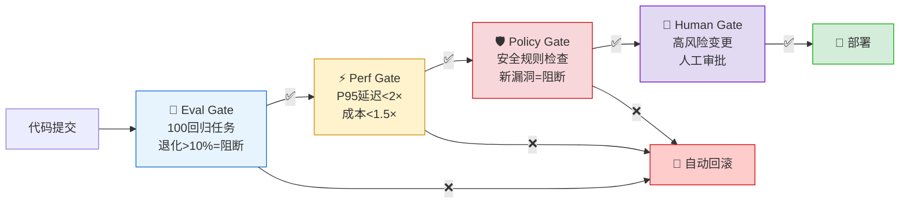
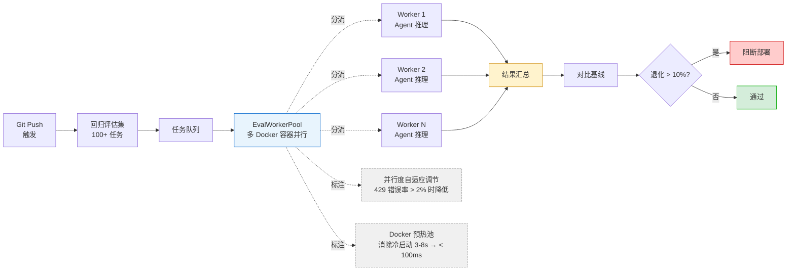
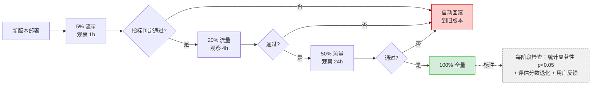
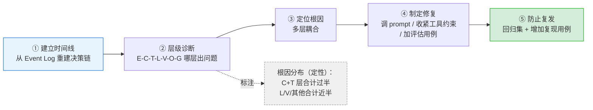
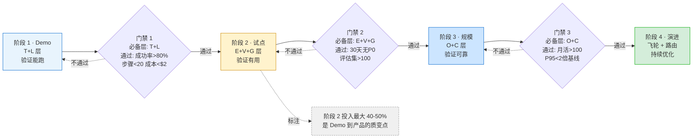

# 第 16 章 — Agent MLOps 与评估流水线

本章是 Part 4"生产化与规模化"的第一章，也是全书的工程集成枢纽——它将 V 层（评估验证）、O 层（可观测性）、G 层（安全治理）整合为一条从代码变更到安全生产部署的完整自动化流水线。Agent MLOps 的核心挑战不是"怎么部署代码"——传统 CI/CD 已经解决了这个问题——而是怎么验证 Agent 的输出质量在部署前后没有退化。

2025-2026 年的行业数据说明了这一点：FutureAGI 调研发现，78% 的 Agent 团队在首次部署后遭遇过"静默故障"——Agent 表面正常运行但输出质量显著下降——而其中仅 31% 能在 1 小时内检测到[^2]。传统 CI/CD 的 Pass/Fail 测试对此完全无效——Agent 的响应格式可以正确、HTTP 状态码是 200，但内容的业务价值已经失去。本章建立的四阶段门禁 + 渐进式 Canary + 48 小时反馈闭环，是一套应对这一挑战的工程方案。

阅读本章前，需要理解以下基础概念（详见第 1 章）：EDD 评估驱动开发、影子流量评估、基准选择与匹配矩阵、成本归因五标签。

***

## 16.1 Agent CI/CD 的特殊挑战

Agent 的 CI/CD 不能照搬传统软件的"一次通过就通过"的二元门禁。同一个输入在不同时刻、不同模型版本甚至同一模型的不同采样下，可能产生完全不同的输出——temperature=0 也无法完全消除这种差异。评估基准的"通过"阈值可能恰好卡在统计波动的边界上，上周通过的变更这周可能仅因采样差异而失败。Agent CI/CD 需要处理结果的统计分布（跑 N 次取中位数和置信区间）、处理模型版本的静默更新导致的漂移、处理评估集自身的老化问题。

### KP 16.1.1 四阶段门禁 【构建】

传统 CI/CD 起源于 2000 年代初的敏捷运动——代码提交 → 编译 → 单元测试 → 集成测试 → 部署。这条流水线假设每个测试的输出是确定性的：同一个输入产生同一个输出（pass 或 fail）。Agent 系统打破了这一假设。

2025-2026 年的行业数据清晰地描绘了这一挑战的严重性：

- Zylos Research 2026 年报告显示：使用传统 CI/CD 流水线部署 Agent 的团队中，67% 在部署后 24 小时内发现了传统测试未能捕获的故障——包括响应质量下降、幻觉率上升、工具调用错误增加等[^1]。
- Airbnb AITL 团队在 EMNLP 2025 的工业报告中披露：他们的第一版 Agent CI/CD 仅复制了传统微服务的流水线（单元测试 + 集成测试 + 部署），导致一次将幻觉率从 8% 推到 23% 的故障被顺利部署到生产环境，影响到 12 万用户后才被发现[^4]。
- FutureAGI 的调查进一步发现：Agent 相关事故中，有 41% 的根因不在代码层面（不是 NullPointerException 或死循环），而是在"行为层面"——Agent 做出了技术上正确但业务上错误的决策[^2]。

传统 CI/CD 测试覆盖功能正确性，Agent 需额外覆盖质量波动、性能退化和安全合规。

传统单元测试验证 `add(1, 2) == 3` 是确定性断言，但 Agent 的 `handleCustomerComplaint("订单延迟")` 没有唯一正确答案——"退款 50 元"和"赠送优惠券"可能都是合理的。传统集成测试验证 API 返回 200 和正确的 JSON 结构，但 Agent 的 API 返回 200 且格式正确时，内容可能已经退化（语气不当、使用了已废弃的政策文案等）。传统性能测试验证 P95 延迟 < 200ms，但 Agent 的延迟分布有长尾——LLM 推理 + 工具调用 + 检索的总延迟分布是非正态的，统一阈值无法有效检测故障。传统安全测试扫描已知漏洞 CVE，但 Agent 特有的安全问题（提示注入、工具滥用、上下文窗口溢出）不在 CVE 数据库中。

根本原因在于 Agent 输出的非确定性使传统 pass/fail 测试失效。即使 temperature=0，模型的行为也可能因基础设施差异（GPU 型号、推理框架版本、量化精度）而产生不同的输出——这不是 bug，是概率系统运行的固有特征。无法写出 `assertEquals(expected, actual)`，因为 "expected" 本身就不唯一。传统软件的质量维度主要是功能正确性——它做了该做的事、没做不该做的事。Agent 的质量维度多了"行为合理性"——它做的决策在业务上下文中是否合理，这需要基于统计的评估（用 100 个回归任务，对分布做显著性检验），而非二值的 Pass/Fail。传统 CI/CD 的反馈是即时的——测试失败，你立即知道。Agent 的故障可能是跨多个任务逐步显现的——今天成功率 92%，明天 91%，后天 89%——需要累积足够样本才能检测出统计显著的退化。

解决方案是四阶段门禁流水线：Eval(退化>10%阻断) -> Perf(P95<2倍基线) -> Policy(安全规则) -> Human(高风险审批)。每条门禁独立判定，任何一个不通过立即阻断部署流水线。这借鉴了汽车制造业的质量门（Quality Gate）理念——将质量检查从最终检验前移到每个工序节点。（10% 退化阈值和 2 倍基线等数值为教学示例值，生产中需按团队历史数据的变异系数校准。）

**Eval Gate（评估门禁）**：

- 运行 100 个回归任务（从评估集中均匀采样，覆盖不同任务类型和难度）
- 对比当前版本 vs 基线版本的成功率、幻觉率、任务完成度三个指标
- 阈值：任一指标相对退化 > 10% 则阻断
- 执行时间：并行评估，目标 < 30 分钟

**Perf Gate（性能门禁）**：

- 统计 P50/P95/P99 延迟，对比基线
- P95 延迟不超过基线的 2 倍
- 单任务成本不超过基线的 1.5 倍
- 执行时间：随评估并行，无额外耗时

**Policy Gate（策略门禁）**：

- 扫描是否有新增的安全规则违规
- 检查工具调用权限是否超出定义范围
- 验证输出是否包含禁止的内容模式（PII 泄露、竞品名称等）
- 新发现的违规 = 立即阻断

**Human Gate（人工门禁）**：

- 仅对高风险变更触发（模型版本升级、核心 Prompt 重构、新工具接入）
- 由值班工程师查看 Eval Gate 的 10 个最差评估案例
- 人工判断退化是否可接受
- 低风险变更（文档更新、日志格式调整等）自动通过

```java
/*
 * 框架：AgentScope 2.x
 * 环境：JDK 21+, Spring Boot 3.5+
 * 使用组件说明：
 * - GatePipelineOrchestrator（代码见 CodePilot 配套仓库，自定义组件）：四阶段门禁编排器，
 *   实现 Eval → Perf → Policy → Human 的顺序执行和短路阻断。
 * - EvalGate：评估门禁，调用 EvalWorkerPool 并行运行 100 个回归任务，对比基线和当前版本的
 *   成功率/错误率/延迟，任一指标退化 > 10% 返回 HARD_FAIL。
 * - PerfGate：性能门禁，从 OTel Span 中提取延迟和 token 消耗数据，对比基线 P95 延迟和成本。
 * - PolicyGate：策略门禁，调用安全规则引擎扫描工具调用和输出内容。
 * - HumanGate：人工门禁，高风险变更时创建审批单，低风险变更直接放行。
 * - GateResult：门禁结果记录，四态判定 GateStatus（PASS/CONDITIONAL_FAIL/HARD_FAIL/PASS_AUTO），
 *   决定流水线继续或阻断；只有 HARD_FAIL 触发短路，CONDITIONAL_FAIL 仅告警。
 * - GatePipelineState：门禁流水线执行状态（教学示意），累积各门禁结果 + 阻断位置；
 *   生产实现见 GatePipelineOrchestrator.PipelineExecution。
 * - GatePipeline 设计模式：每个 Gate 是独立组件，通过链式调用串联，前一个 HARD_FAIL 立即返回（短路阻断）。
 */
@Service
public class GatePipelineOrchestrator {

    private final EvalGate evalGate;
    private final PerfGate perfGate;
    private final PolicyGate policyGate;
    private final HumanGate humanGate;

    public GatePipelineState executeGatePipeline(
            String baselineVersion, String candidateVersion,
            RiskLevel riskLevel) {

        List<GateResult> gates = new ArrayList<>();

        // Gate 1: 评估门禁（最耗时，并行运行 100 个回归任务）
        GateResult eval = evalGate.check(baselineVersion, candidateVersion);
        gates.add(eval);
        if (eval.isFailed()) {
            return GatePipelineState.blocked("Eval", gates); // 短路：评估退化 > 10%
        }

        // Gate 2: 性能门禁（利用评估运行中收集的性能数据）
        GateResult perf = perfGate.check(baselineVersion, candidateVersion);
        gates.add(perf);
        if (perf.isFailed()) {
            return GatePipelineState.blocked("Perf", gates); // 短路：性能退化超标
        }

        // Gate 3: 策略门禁（静态安全规则 + 动态行为扫描）
        GateResult policy = policyGate.check(candidateVersion);
        gates.add(policy);
        if (policy.isFailed()) {
            return GatePipelineState.blocked("Policy", gates); // 短路：发现安全违规
        }
        if (policy.status() == GateStatus.CONDITIONAL_FAIL) {
            notifyHumanReviewer(policy); // 告警但不阻断：策略临界违规
        }

        // Gate 4: 人工门禁（仅高风险变更触发审批；低风险自动放行）
        GateResult human;
        if (riskLevel == RiskLevel.HIGH) {
            String ticket = humanGate.requestApproval(candidateVersion, "高风险变更");
            human = humanGate.isApproved(ticket)
                    ? GateResult.pass("Human", 1.0)
                    : GateResult.fail("Human", "人工审批未通过: " + ticket);
        } else {
            human = GateResult.autoPass("Human"); // 低风险自动放行
        }
        gates.add(human);
        if (human.isFailed()) {
            return GatePipelineState.blocked("Human", gates); // 短路：人工审批不通过
        }

        return GatePipelineState.passed(gates); // 全部通过
    }
}

// 评估门禁的具体实现
@Component
class EvalGate {

    private final EvalWorkerPool workerPool;
    private final EvalResultComparator comparator;

    public GateResult check(String baseline, String candidate) {
        // 从注册表加载 100 个回归任务
        List<EvalTask> tasks = EvalRegistry.loadRegressionSuite(100);

        // 并行运行：基线和候选版本使用相同的任务集
        EvalResult baselineResult = workerPool.runParallel(baseline, tasks, 30, TimeUnit.MINUTES);
        EvalResult candidateResult = workerPool.runParallel(candidate, tasks, 30, TimeUnit.MINUTES);

        // 三指标对比（正值表示退化）
        double successDegradation = comparator.compareSuccessRate(baselineResult, candidateResult);
        double errorIncrease = comparator.compareErrorRate(baselineResult, candidateResult);
        double latencyDegradation = comparator.compareLatency(baselineResult, candidateResult);

        // 阈值判定：任一指标退化 > 10% = 硬阻断
        if (successDegradation > 0.10 || errorIncrease > 0.10 || latencyDegradation > 0.10) {
            return GateResult.fail("Eval",
                String.format("successDeg=%.1f%%, errorInc=%.1f%%, latencyDeg=%.1f%%",
                    successDegradation * 100, errorIncrease * 100, latencyDegradation * 100));
        }
        return GateResult.pass("Eval", 1.0 - successDegradation);
    }
}
```

四阶段门禁（Eval+Perf+Policy+Human）每道独立判定，任一不通过即阻断部署，避免缺陷向下游放大。在工程实践中，配合渐进式 Canary 从 5% 流量分阶段扩至 100%，加上自动回滚机制，四道门禁逐层验证每次部署的安全性。

**基线漂移与黄金基线管理**。EvalGate 的 `check(baseline, candidate)` 依赖一个稳定的 `baseline` 版本作为退化参照——但这个基线本身会随时间漂移。两种漂移模式需要警惕：其一是**基线自身退化**——当生产版本因模型提供方静默更新（见 §16.5）发生轻微退化，而团队把"当前生产版本"当作基线时，基线已被污染，后续候选版本只需"不比退化版更差"即可通过门禁，形成质量下滑的累积效应。其二是**基线轮换失控**——每次发布后把候选版本提升为新基线，若某次发布引入了未检出的细微退化，退化就被"固化"进基线，后续都以退化为起点衡量。

工程对策是建立**黄金基线（Golden Baseline）**机制：维护一个冻结的、经人工确认健康的基准版本（如季度评审通过的版本），定期（如每月）用黄金基线复跑当前生产版本，检测"当前生产 vs 黄金基线"的累计漂移；一旦累计退化超过阈值（如成功率累计下降 3%），触发基线重置流程——重新评审并冻结新的黄金基线，同时把累计退化期间漏检的失败 case 补入回归集。基线轮换规则也应明确：只有通过四阶段门禁且 48 小时 Canary 终验无退化的版本才能成为新基线，且新基线必须同时通过"vs 旧基线"与"vs 黄金基线"双重对比。这把"基线"从一个隐含假设变成了一个被显式治理的资产。

业内相关的工具有 AgentScope CI/CD 框架（Java 企业级 Agent 部署方案）、TrueFoundry MLOps（全托管 Agent 运维平台），以及 Databricks MLflow（通用 MLOps 平台，但缺乏 Agent 特定的评估与策略门禁能力）。

<!-- FIGURE: 16.1 四阶段门禁流水线 -->



### KP 16.1.2 Agent Bundle 构建工件管理 【构建】

Agent 部署包含代码、模型配置、prompt、工具描述、Middleware 链和安全策略。传统软件的部署单元是一个二进制文件（JAR、Docker Image、WASM bundle）——它包含了运行程序所需的一切。Agent 的部署单元需要额外包含那些"非代码但影响行为"的配置：

- **模型选择与配置**：使用哪个模型（GPT-5.4 vs Claude Opus 4.6）、temperature、max_tokens、top_p 等参数。模型版本变化（如 Claude Sonnet 4.5 → 4.6）可能导致行为完全改变。
- **Prompt 模板**：System Prompt、任务 Prompt、工具描述的提示模板。一个 Prompt 中两个词的顺序调整可能带来 10% 的成功率变化。
- **工具描述与配置**：每个工具的 name/description/参数 schema。工具描述的质量直接影响 Agent 的工具选择准确率。
- **Middleware 链配置**：预处理器（上下文预算、安全扫描）、后处理器（输出校验、格式转换）的顺序和参数。
- **安全策略配置**：允许调用的工具白名单、网络访问策略、文件操作限制等。

这些配置在传统 CI/CD 视角下是"环境变量"或"配置文件"——但在这里，它们是"行为参数"，直接影响输出质量。一个配置错误不会导致编译失败——它会导致 Agent 在 30% 的任务中选错工具。

Zylos Research 的报告指出：在 2025-2026 年间调查的 150+ Agent 团队中，41% 的生产事故根因可追溯到"配置不一致"——开发环境的工具描述和 Prompt 与生产环境不同，导致"开发环境表现完美、生产环境行为异常"[^1]。

配置分散带来的问题是缺少统一的版本管理和回滚机制。六组件版本不同步：代码在 Git（版本 v2.2.3），Prompt 在 CMS（手动修改，无版本号），工具描述在数据库（最后修改时间不确定），模型配置在环境变量——没有一个统一的"版本指纹"。回滚时，你回滚了代码到 v2.2.2，但 Prompt 还是新版、工具描述还是新版——Agent 的行为是"混合版本"的，既不是旧版也不是新版。当需要复现一个 3 天前的 bug 时，无法确切知道当时使用的是哪一组配置——每一层都有独立的更新周期。

根本原因是 Agent 构建工件远多于传统软件。一个典型微服务有 3-5 个关键配置项（DB 连接串、Redis 地址、第三方 API Key、日志级别等），一个 Agent 有 20-50+ 个对行为有显著影响的配置项。传统软件的配置错误通常导致启动失败（立即可见），Agent 的配置错误导致的是"行为降级"（可能数天后才发现）。根因分析的难度高出两个数量级——需要检查在事故发生时刻所有 20-50 个配置项是否一致。

解决方案是 Agent Bundle：所有组件打包为单一可部署单元，用版本号关联。

1. **Bundle 结构**：一个 Agent Bundle 是包含以下内容的聚合版本：
   - `agent-core.jar`（含版本号 v2.2.3）
   - `prompts/` 目录（system-prompt-v4.txt, task-prompt-v2.txt）
   - `tools/` 目录（tool-schemas-v7.json）
   - `middlewares/` 目录（middleware-config-v3.yaml）
   - `policies/` 目录（security-policy-v1.json）
   - `model-config.yaml`（model: claude-sonnet-4.6, temp: 0.3）
2. **Bundle 版本指纹**：对 Bundle 的所有内容计算 SHA-256，生成唯一的版本指纹（32 字符十六进制）。这个指纹是整个 Agent 部署的不可变标识。
3. **原子化部署/回滚**：部署时使用 Bundle 指纹一次性加载所有配置；回滚时切换到上一个指纹，所有六组件同时恢复——不存在"部分回滚"的半状态。
4. **Bundle Registry**：每个 Bundle 版本存储在中央注册表中，保留最近 10 个版本（可配置）。生产事故时，可以立即确定当时使用的是哪个 Bundle 指纹，并一键回滚。

```java
/*
 * 框架：AgentScope 2.x
 * 环境：JDK 21+, Spring Boot 3.5+
 * 使用组件说明：
 * - AgentBundle（代码见 CodePilot 配套仓库，自定义组件）：Agent Bundle 的数据结构，
 *   封装代码版本、Prompt、工具 Schema、Middleware 配置、安全策略、模型配置六个组件。
 * - AgentBundleRegistry：Bundle 注册表，维护版本指纹到 Bundle 的映射，
 *   支持存储、查询、回滚操作。保留最近 10 个版本。
 * - AgentBundleBuilder：构建器，从各数据源（Git/DB/文件系统）加载组件，构建完整 Bundle。
 * - 指纹计算：使用 SHA-256 对所有组件内容做哈希，生成不可变的版本标识。
 * - 原子回滚：通过注册表查询目标指纹，一次性替换所有关联配置。
 */
@Component
public class AgentBundleRegistry {

    private final Map<String, AgentBundle> registry = new LinkedHashMap<>() {
        @Override
        protected boolean removeEldestEntry(Map.Entry<String, AgentBundle> eldest) {
            return size() > 10; // 保留最近 10 个版本
        }
    };

    // 注册新 Bundle，生成版本指纹
    public String register(AgentBundle bundle) {
        String fingerprint = bundle.computeFingerprint();
        registry.put(fingerprint, bundle);
        return fingerprint;
    }

    // 部署指定版本的 Bundle（原子操作）
    public void deploy(String fingerprint) {
        AgentBundle bundle = registry.get(fingerprint);
        if (bundle == null) {
            throw new BundleNotFoundException("指纹不存在: " + fingerprint);
        }
        // 原子加载：一次性替换所有配置
        promptStore.setActivePrompts(bundle.getPrompts());
        toolRegistry.activateSchemas(bundle.getToolSchemas());
        middlewareChain.configure(bundle.getMiddlewareConfig());
        policyEngine.loadPolicies(bundle.getSecurityPolicies());
        modelConfigManager.switchTo(bundle.getModelConfig());
        codeDeployer.deployVersion(bundle.getCodeVersion());
    }

    // 回滚到上一个版本
    public String rollback() {
        if (registry.size() < 2) {
            throw new NoRollbackTargetException("注册表中仅有一个版本，无法回滚");
        }
        // 获取倒数第二个版本（当前版本是最新注册的）
        Iterator<String> it = registry.keySet().iterator();
        String current = null;
        String previous = null;
        while (it.hasNext()) {
            previous = current;
            current = it.next();
        }
        deploy(previous);
        return previous;
    }
}
```

Agent Bundle 遵循单一可部署工件的原则——将所有配置与版本绑定，实现一键部署与一键回滚的原子性操作，消除配置漂移（Configuration Drift）风险。所谓配置漂移，就是不同环境之间的配置逐渐偏离，导致"开发环境正常、生产环境异常"的问题。Bundle 通过将代码、模型配置、Prompt、工具描述、Middleware 链和安全策略打包为单一可部署单元，从源头上杜绝了这种漂移。

## 16.2 评估流水线自动化

评估流水线的自动化不是"省时间"——是确保评估不会因为工程师疲劳而被简化或被跳过。一个好的自动化评估流水线需要做到：每次 Git push 自动触发全量回归评估，评估集自动从生产日志中采样更新，评估结果自动对比和告警，退化自动阻断部署。

下图展示了评估流水线的并行调度架构——Git Push 触发后，回归评估集进入任务队列，由 EvalWorkerPool 分发到多个预热 Docker 容器并行执行 Agent 推理，结果汇总后与基线对比，退化超阈值则阻断部署；并行度根据 429 错误率自适应调节，Docker 预热池消除冷启动延迟。

<!-- FIGURE: 16.2 评估流水线并行调度架构 -->



### KP 16.2.1 评估任务并行调度 【构建】

评估流水线的速度直接决定了 Agent 团队的迭代频率。传统 CI 中的测试运行时间通常以秒/分钟计——单元测试 30 秒，集成测试 5 分钟。Agent 的评估截然不同：每个评估任务需要完整运行一次 Agent 推理（可能包含 10-20 轮 LLM 调用 + 工具调用 + 检索），单个任务耗时 30 秒到 3 分钟。

100 个回归任务串行需数小时。一个 100 个任务的回归套件如果串行执行（每个任务平均 90 秒），需要 2.5 小时。Airbnb AITL 团队在其 EMNLP 2025 论文中披露：他们的初始评估流水线（串行、单机）完成一个完整的回归套件需要 4.5 小时，导致团队每天只能跑一次评估，迭代周期被拉长到 2-3 天[^4]。

这与 CI/CD 的核心原则——"快速反馈"——存在冲突。如果评估需要 2 小时以上，开发者不可能在每次 commit 后等待评估结果。评估变成"每日一次"的批量任务，故障在被发现时已经累积了整整一天的工作量。

单机串行运行的另一个问题是资源利用不均衡：Agent 评估的瓶颈通常不是 CPU（评估逻辑很轻），而是 LLM API 的响应时间——大部分时间花在等 API 返回上。串行运行时 CPU 利用率可能只有 5-10%，大量时间空转等待 I/O。

好在评估任务间独立，天然适合并行化。每个评估任务是独立的 Agent 运行——任务间没有依赖关系、没有共享状态、没有顺序要求。这是典型的 embarrassingly parallel 问题——理想并行度等于任务数量。但并行化需要解决三个附加问题：每个 LLM API 都有每分钟请求数限制（如 60 RPM），并行度超过此限制会导致 429 错误；并行运行 100 个任务会瞬间向 LLM API 发送大量请求，费用线性增长但没有时间成本的节约（总 token 数不变）；并行运行中的部分任务可能因临时错误（429、超时）失败，需要重试机制确保结果完整性。

解决方案是 EvalWorkerPool + Docker 预热池，并行度取决于 GPU 配额和 API rate limit。

1. **EvalWorkerPool**：管理一组预热的评估 Worker，每个 Worker 在一个隔离的 Docker 容器中运行。Worker 从任务队列中拉取评估任务、执行、上报结果。
2. **并行度自适应调节**：系统监控 API 的 429 错误率和剩余配额，动态调整并行度——当 429 错误率 > 2% 时降低并行度，当剩余配额充裕时提升并行度。
3. **Docker 预热池**：预先启动一批 Docker 容器（已加载沙箱镜像和评估框架），任务到达时直接分配，消除容器冷启动延迟（3-8 秒 → < 100ms）。
4. **故障隔离**：每个评估任务在独立容器中运行，一个任务的异常（死循环、OOM、死锁）不会影响其他任务。
5. **结果聚合**：所有 Worker 完成或超时后，聚合结果生成评估报告，与基线对比。

```java
/*
 * 框架：AgentScope 2.x
 * 环境：JDK 21+, Spring Boot 3.5+
 * 使用组件说明：
 * - EvalWorkerPool（代码见 CodePilot 配套仓库，自定义组件）：管理 Docker Worker 池，
 *   预热容器、分发任务、汇总结果。并行度根据 API Rate Limit 自适应调节。
 * - EvalWorker：单个评估 Worker，接收任务→运行 Agent→收集指标→返回结果。
 * - RateLimitAwareScheduler：监控 LLM API 的 Rate Limit 剩余配额，
 *   动态计算安全并行度（parallelism = min(可用配额 × 0.8, 最大 Worker 数)）。
 * - DockerWarmPool：预启动 Docker 容器池，通过健康检查确认就绪后放入就绪队列，
 *   分配任务时从就绪队列取，无需等待容器冷启动。
 * - 汇总策略：CountDownLatch 等待所有任务完成或总超时到达，
 *   统计成功/失败/超时数量，与基线做对比检验。
 */
@Service
public class EvalWorkerPool {

    private final ExecutorService executor;
    private final int maxWorkers;
    private final RateLimitAwareScheduler scheduler;
    private final DockerWarmPool warmPool;

    public EvalResult runParallel(
            String configVersion, List<EvalTask> tasks,
            long totalTimeoutMinutes) {

        int parallelism = scheduler.calculateSafeParallelism(maxWorkers);
        ExecutorService pool = Executors.newFixedThreadPool(parallelism);
        CountDownLatch latch = new CountDownLatch(tasks.size());
        List<Future<TaskResult>> futures = new ArrayList<>();

        for (EvalTask task : tasks) {
            Future<TaskResult> future = pool.submit(() -> {
                try {
                    // 从预热池获取就绪的 Docker Worker
                    EvalWorker worker = warmPool.acquire();
                    try {
                        return worker.runTask(configVersion, task);
                    } finally {
                        warmPool.release(worker); // 归还 Worker 到预热池
                    }
                } finally {
                    latch.countDown();
                }
            });
            futures.add(future);
        }

        // 等待全部完成或超时
        boolean allDone = latch.await(totalTimeoutMinutes, TimeUnit.MINUTES);

        // 汇总结果（此时所有任务已完成或超时，直接 get 即可）
        EvalResult summary = new EvalResult();
        for (Future<TaskResult> f : futures) {
            try {
                summary.addResult(f.get()); // latch 归零后阻塞获取结果，此时必然可用
            } catch (ExecutionException e) {
                summary.addFailure(e.getCause());
            }
        }
        return summary;
    }
}
```

评估任务并行调度采用提交-执行-汇总的三阶段并行模式——EvalWorkerPool 将 N 个独立评估任务分发到 M 个工作节点，各节点独立完成评估后汇总。Docker 预热池消除容器冷启动延迟，并行度受 GPU 配额和 API Rate Limit 硬约束，避免资源争抢导致评估结果偏差。

### KP 16.2.2 无密钥快照 CI：record/refresh 双模式 【构建】

KP 16.2.1 解决了评估的并行执行问题，但还有一个工程问题没回答：**CI 环境中不一定有 LLM API Key**——出于安全合规原因，API Key 不能放在公开仓库的 CI Secret 中；即使可以，每次 CI 跑 100 个真实 LLM 调用的成本和延迟也不可接受。但如果 CI 中不跑真实 LLM 调用，怎么保证 Agent 的行为没有因为代码修改而退化？

DSH 项目用一种**无密钥快照测试（Keyless Snapshot Testing）**模式解决了这个矛盾[^5]。核心思路是：把"需要 LLM API Key 才能产生的输出"预先录制为快照（snapshot），CI 中只回放快照、不调用真实 LLM——这样 CI 不需要 API Key（"无密钥"），但仍然能验证代码修改没有破坏 Agent 的行为契约。

快照测试的两种模式——**record** 和 **refresh**——分别处理两种不同的变更场景：

| 模式 | 命令 | 何时使用 | 做了什么 |
| --- | --- | --- | --- |
| **record** | `pnpm run test:snapshot:record` | 模型 transcript 变了（如模型版本更新导致输出变化） | 重新录制模型交互的完整 transcript，生成新的预期输出 |
| **refresh** | `pnpm run test:snapshot:refresh` | 回放输入仍然有效（如代码重构改变了输出格式但未改变语义） | 保持录制的会话输入不变，只更新预期输出 |

这两种模式的区分至关重要——它让团队可以**区分"模型变了"和"代码变了"**两种不同的退化来源。当模型提供方静默更新导致输出变化时，需要 `record`（重新录制 transcript）；当团队重构代码导致输出格式变化时，需要 `refresh`（更新预期输出但保持输入不变）。如果只有一种模式，就无法区分退化是来自外部模型变化还是内部代码变化——而这两种变化的应对策略完全不同（模型变化需要评估是否接受新输出，代码变化需要验证重构是否保持语义）。

**CI 中的只读回放**——CI 环境强制设置 `DSH_SNAPSHOT=replay`（只读模式），永远不会写入预期输出。`record` 和 `refresh` 只在开发者本地运行——每次生成的 diff 都需要人工审查。这确保了快照的变更是有意为之的，而非 CI 环境的意外写入。

**快照覆盖什么**——DSH 的快照测试覆盖两类行为：

1. **外部行为契约**（transport contracts + presentation）：Agent 对外的 JSON-RPC 消息、浏览器渲染输出、CLI 输出格式。这些是用户可见的行为，变化需要显式审查。
2. **后端组装行为**（persisted logs）：Agent 内部的会话日志、事件序列。这些验证内部组装逻辑没有被破坏——即使外部行为看起来一样，内部事件序列的变化可能暗示了潜在问题。

**一个关键细节：pinned header**——DSH 有一个 ACP 场景（`text-turn`）**完整固定**了 system prompt 和 tool schema 的内容——任何对系统提示或工具描述的修改都会导致这个快照测试失败，且失败只影响一行（其他 fixture 用 token 化方式引用 header 内容，使一次修改只波及一行 diff）。这和第 8 章的"Model-visible ⟺ logged"不变量呼应——如果模型能看到的东西变了，快照测试必须感知到。

**无密钥策略的工程意义**——DSH 团队（DeepSeek）的原则是"不吝啬真实 API 测试"——有 Key 的真实 API 测试（`pnpm run test:e2e`）验证"Agent 对真实模型确实工作"，无 Key 的快照测试（`pnpm run test:snapshot`）验证"代码修改没有破坏行为契约"。两者互补：真实 API 测试捕捉模型行为变化（需要 Key，在特定环境运行），快照测试捕捉代码行为变化（不需要 Key，在每次 CI 中运行）。每个需要 Key 的测试套件在缺少 Key 时自动跳过（self-skip），确保无密钥的 CI 和无密钥的贡献者不会被阻断。

这个模式对 Agent CI/CD 的启示是：**评估流水线应该分层——有密钥层验证端到端正确性，无密钥层验证行为契约不变**。KP 16.1.1 的 EvalGate 可以用无密钥快照测试做快速预筛（< 1 分钟），只有快照测试通过后才触发需要 API Key 的完整评估（30 分钟）。这样既保证了 CI 的速度，又保证了评估的深度。

## 16.3 渐进式部署

Agent 的部署不能是"要么全旧要么全新"的二进制切换——它需要渐进式部署（Canary Release）：5% 流量 → 观察 1 小时 → 20% → 观察 4 小时 → 50% → 观察 24 小时 → 全量。但 Agent 的 Canary 比传统服务的 Canary 更难——因为 Agent 的输出是概率性的，判断"新版是否变差"不能用 P99 延迟或错误率，需要用评估分数分布、LLM-as-Judge 的退化检测和用户反馈信号。

下图展示了 Canary 渐进式部署的阶段流程——新版本依次经过 5%、20%、50%、100% 四档流量放量和观察，任一阶段指标判定不通过即自动回滚到旧版本；每阶段检查统计显著性、评估分数退化与用户反馈三重信号。

<!-- FIGURE: 16.3 Canary 渐进式部署流程 -->



### KP 16.3.1 渐进式 Canary 【构建】

在传统微服务中，Canary 部署已经是一个成熟的工程实践——先给 5% 流量上新版本，观察 1 小时，无误则逐步扩大。GitHub、Netflix、Google 等公司在此基础上发展出了更高级的渐进式交付（Progressive Delivery）——包括蓝绿部署、金丝雀分析、自动回滚等。Argo Rollouts 和 Flagger 等工具让这一过程高度自动化。

然而 Agent 的 Canary 部署面临着微服务没有的挑战：

- **统计显著性门槛更高**：Agent 的关键指标（成功率、幻觉率）是比例数据（proportion），样本量需求远大于连续数据（如延迟）。检测 2% 的成功率退化在小样本下几乎不可能——需要足够的流量才能建立统计置信度。
- **退化模式不可预测**：Agent 的退化不一定是"全面变差"——可能只是在特定类型的任务上退化（如涉及多步推理的复杂任务），而在简单任务上表现一样。这意味着 Canary 阶段的流量必须具有代表性——如果 5% 流量恰好全是简单任务，可能会错误地认为新版本没问题。
- **非单调性噪声**：Agent 的成功率有自然波动——同一个版本在不同时刻的评估成功率可能浮动 3-5%（由于 LLM 的非确定性、外部 API 的状态变化等）。这要求 Canary 分析的阈值必须考虑自然波动，否则会频繁误触发回滚。

Agent 的故障可能在特定流量比例下才暴露。ValueStream AI 报告了一个典型案例：一个客服 Agent 的新版本在 5% 流量阶段通过（仅暴露给已完成身份验证的用户——简单场景），到 20% 时暴露给包含密码重置流程的用户时，成功率骤降 18%——新版本在处理需要多步验证的工具调用链时存在 bug[^3]。

根本原因在于 Agent 的非单调性和统计波动使小样本退化检测不敏感。比例数据的统计检验需要足够大的样本量，其判定与样本量预估有明确的统计公式支撑。

**退化判定：双比例 z 检验（Two-proportion z-test）**。Canary 阶段对比稳定版本与候选版本的成功率，原假设 H₀: p₁ = p₂（无退化），备择假设 H₁: p₂ < p₁（候选版本退化）。检验统计量：

```
z = (p̂₂ − p̂₁) / √( p̄·(1−p̄)·(1/n₁ + 1/n₂) )
```

其中 p̂₁、p̂₂ 为两组样本成功率，n₁、n₂ 为样本量，p̄ = (x₁+x₂)/(n₁+n₂) 为合并比例（x 为成功次数）。单侧检验下，z < −1.645（α=0.05）即判定退化统计显著，触发回滚。z 检验要求 n·p̄ ≥ 5 且 n·(1−p̄) ≥ 5（正态近似成立条件），样本不足时应改用 Fisher 精确检验。

**多重检验校正**。阶段 2 按任务类型分组监控时，会对 k 个子类型分别做 z 检验——每个检验在 α=0.05 下误报概率为 5%，k 个独立检验的族系错误率（family-wise error rate, FWER）膨胀至 1−(1−0.05)^k（k=10 时约 40%），即"实际未退化但某个子类型恰好越过临界值触发回滚"的假阳性大幅上升。两种工程对策：其一为 **Bonferroni 校正**——将单检验显著性水平收紧为 α/k（k=10 时 α'=0.005，对应 z_α'≈2.576），实现简单但偏保守，会牺牲检验功效（更难检出真实退化）；其二为 **Benjamini-Hochberg（BH）程序**——控制错误发现率（FDR）而非 FWER，在 k 较大时功效优于 Bonferroni。实践中的推荐策略是：灾难阈值（非统计判定）快速回滚不受多重检验影响；统计检验层面仅对"整体成功率"做单次 z 检验作为回滚触发器，子类型对比仅用于定位归因（"退化集中在哪类任务"）而非触发回滚——这样既避免 FWER 膨胀，又保留子类型的诊断价值。

**样本量预估公式**。在部署前需要回答"检测 δ 个百分点的退化需要多少样本"——这决定了 Canary 阶段的观察时长。每组所需样本量（单侧，假设两组等量）：

```
n = (z_α + z_β)² · 2 · p̄ · (1 − p̄) / δ²
```

其中 z_α=1.645（α=0.05）、z_β=0.842（80% 功效）、p̄=(p₁+p₂)/2 为两组比例均值、δ=p₁−p₂ 为可检测的最小退化幅度。代入基线 p₁=0.85、退化后 p₂=0.80（δ=0.05）：p̄=0.825，n = (1.645+0.842)² × 2 × 0.825 × 0.175 / 0.05² ≈ 714（每组），两组共需约 1,428 个样本（取约 1,400）。若 Canary 仅 5% 流量、日均 200 请求，Canary 组每日仅 10 个样本，需约 71 天——这就是为什么 5% 阶段只能检测"灾难性退化"（δ 大、所需样本少），而检测 3% 的细微退化必须放大流量或拉长观察期。

而且 Agent 的输出质量不是"正确/错误"的二值——它是一个连续的质量分数（如 llm-as-judge 的 0-100 分、语义相似度），其方差远大于二值数据的方差，这意味着需要更大的样本量来建立统计置信度。连续分数场景应改用 **Welch's t 检验**（不假设等方差），其样本量预估需额外代入预期方差 σ²。

**Welch's t 检验**用于连续型评估分数的退化检测——当指标不是"成功/失败"的比例而是 llm-as-judge 打分、BLEU、语义相似度等连续值时，双比例 z 检验不再适用。与经典 Student's t 检验不同，Welch's t 检验不假设两组方差相等（Agent 不同版本的输出方差往往差异显著——新版本可能均值相近但方差放大，表现为"偶发劣化"），更贴合实际。检验统计量：

```
t = (x̄₁ − x̄₂) / √( s₁²/n₁ + s₂²/n₂ ),   自由度 df = (s₁²/n₁ + s₂²/n₂)² / [ (s₁²/n₁)²/(n₁−1) + (s₂²/n₂)²/(n₂−1) ]
```

其中 x̄₁、x̄₂ 为两组样本均值，s₁²、s₂² 为样本方差，n₁、n₂ 为样本量。单侧检验下（检测候选版本分数下降），t < −t_{α,df} 即判定退化统计显著。样本量预估公式为 n = 2·(z_α+z_β)²·σ²/δ²，其中 σ² 为预期方差（需从历史评估数据估计）、δ 为可检测的最小均值差。下方代码桩给出 Welch's t 检验的最小可运行实现（自由度采用 Welch–Satterthwaite 近似，临界值查 t 分布表——生产环境建议使用 `org.apache.commons:commons-math3` 的 `TDistribution` 类获取精确临界值）：

```java
/*
 * 框架：AgentScope 2.x
 * Welch's t 检验：连续型评估分数（llm-as-judge / 语义相似度）的退化检测。
 * 对应书中 Ch16 §16.3.1 —— 与双比例 z 检验互补：比例数据用 z 检验，连续分数用 Welch's t 检验。
 * 组件见 CodePilot 配套仓库 ch16-mlops：ProportionZTest.welchTTest / welchSignificantDegradation。
 */
public final class ProportionZTest {
    // … 双比例 z 检验实现见上文 …

    /** 单侧 α=0.05 在常见自由度下的 t 临界值近似（生产实现应使用 Apache Commons Math TDistribution）。 */
    public static double tCriticalOneSided(double df, double alpha) {
        // 大自由度收敛于正态：df→∞ 时 t_0.05,df → 1.645；df=30 时约 1.697；df=10 时约 1.812
        if (df > 200) return 1.645;
        if (df > 60)  return 1.671;
        if (df > 30)  return 1.697;
        if (df > 10)  return 1.812;
        return 2.228; // df=10 的保守近似
    }

    /** 计算 Welch's t 统计量（负值表示候选版本分数下降）。 */
    public static double welchTTest(double[] baselineScores, double[] candidateScores) {
        if (baselineScores == null || candidateScores == null
                || baselineScores.length < 2 || candidateScores.length < 2) {
            throw new IllegalArgumentException("每组至少需要 2 个样本");
        }
        double m1 = mean(baselineScores), m2 = mean(candidateScores);
        double v1 = variance(baselineScores, m1), v2 = variance(candidateScores, m2);
        int n1 = baselineScores.length, n2 = candidateScores.length;
        double se = Math.sqrt(v1 / n1 + v2 / n2);
        if (se == 0) return 0.0;
        return (m2 - m1) / se; // 负值 = 候选版本分数下降
    }

    /** 判定候选版本连续分数是否统计显著下降（单侧）。 */
    public static boolean welchSignificantDegradation(double[] baselineScores, double[] candidateScores,
                                                      double alpha) {
        double t = welchTTest(baselineScores, candidateScores);
        double v1 = variance(baselineScores, mean(baselineScores));
        double v2 = variance(candidateScores, mean(candidateScores));
        int n1 = baselineScores.length, n2 = candidateScores.length;
        double df = Math.pow(v1 / n1 + v2 / n2, 2)
                / (Math.pow(v1 / n1, 2) / (n1 - 1) + Math.pow(v2 / n2, 2) / (n2 - 1));
        return t < -tCriticalOneSided(df, alpha);
    }

    private static double mean(double[] xs) {
        double s = 0; for (double x : xs) s += x; return s / xs.length;
    }
    private static double variance(double[] xs, double mean) {
        double s = 0; for (double x : xs) s += (x - mean) * (x - mean); return s / (xs.length - 1);
    }
}
```

解决方案是四阶段渐进式部署：5%(1h) -> 20%(4h) -> 50%(24h) -> 100%。任一失败自动回滚。

**阶段 1：5% 流量 × 1 小时观察**

- 目的：快速检测灾难性退化（成功率下降 > 30%、幻觉率翻倍等）
- 流量选择：从所有任务类型中分层采样，确保代表性
- 监控指标：成功率、P95 延迟、错误率、幻觉标记率
- 自动回滚条件：任一指标超过灾难阈值
- 这一阶段的样本量虽不足以做精细统计，但足以检测"系统基本不可用"的灾难性问题

**阶段 2：20% 流量 × 4 小时观察**

- 目的：检测功能级退化（特定任务类型上表现下降）
- 流量选择：扩大覆盖但不包含高价值用户（VIP 用户始终在 80% 的稳定流量中）
- 按任务类型分组监控：投诉处理、订单查询、退款处理等子类型的成功率独立分析
- 自动回滚条件：任一任务类型的成功率下降 > 5 个百分点（统计显著）

**阶段 3：50% 流量 × 24 小时观察**

- 目的：检测低频率退化模式（影响 < 5% 任务的退化）
- 需要至少一个完整的业务周期（24 小时）覆盖所有流量模式
- 成本指标加入监控（确保新版本的成本在可接受范围）
- 自动回滚条件：整体成功率降低 > 3 个百分点，或成本增加 > 20%

**阶段 4：100% 流量（全量部署）**

- 完成 Canary 分析，正式全量上线
- 保留旧版本作为备份，观察 48 小时后确认无退化再下线

```java
/*
 * 框架：AgentScope 2.x
 * 环境：JDK 21+, Spring Boot 3.5+
 * 使用组件说明：
 * - CanaryController（代码见 CodePilot 配套仓库，自定义组件）：渐进式 Canary 部署控制器，
 *   管理四阶段（5%/20%/50%/100%）的自动推进和回滚逻辑。
 * - TrafficRouter：流量路由组件，根据用户 ID 哈希分配流量到 Canary 版本或稳定版本。
 * - CanaryStage：阶段枚举，定义各阶段的流量比例、观察时长和回滚条件。
 * - ProportionZTest：双比例 z 检验工具类，对比 Canary vs Stable 的成功率，
 *   z < −1.645（α=0.05）即判定退化统计显著。对应上文退化判定公式。
 * - SampleSizeCalculator：样本量预估工具类，部署前据基线成功率与可检测退化幅度
 *   计算每阶段所需最小样本量，据此校准观察时长。对应上文样本量预估公式。
 * - CanaryConfig：Canary 配置，通过配置中心动态更新流量比例和各阶段的回滚阈值。
 * - 回滚机制：任一阶段检测到统计显著的退化，立即将 Canary 版本下线，全部流量切回稳定版本。
 *   回滚后触发事故复盘流程（见 KP 16.4.1）。
 */
@Component
public class CanaryController {

    private final TrafficRouter router;
    private final ScheduledExecutorService scheduler = Executors.newSingleThreadScheduledExecutor();

    public void startCanary(CanaryConfig config) {
        // 部署前预估各阶段所需样本量，校准观察时长（避免样本不足导致检验失效）
        int needed = SampleSizeCalculator.samplesPerGroup(
            0.85, 0.80, ProportionZTest.Z_ALPHA_05, 0.842); // ≈714/组
        logger.info("Canary 启动：检测 5pp 退化需 {} 样本/组", needed);

        List<CanaryStage> stages = List.of(
            new CanaryStage(0.05, Duration.ofHours(1),
                metrics -> evaluateStage(metrics, 0.30)),   // 灾难阈值 30pp
            new CanaryStage(0.20, Duration.ofHours(4),
                metrics -> evaluateStage(metrics, 0.05)),   // 功能级 5pp
            new CanaryStage(0.50, Duration.ofHours(24),
                metrics -> evaluateStage(metrics, 0.03))    // 细微 3pp
        );
        executeStagesSequentially(stages, config, 0);
    }

    /**
     * 单阶段退化判定：先过灾难阈值快速回滚，再用双比例 z 检验判定统计显著性。
     * 样本不足（n·p̄ < 5）时降级为阈值告警，避免 z 检验正态近似失效。
     */
    private DegradationResult evaluateStage(CanaryMetrics metrics, double disasterThreshold) {
        // 灾难性退化直接回滚（无需等统计显著）
        if (metrics.errorRate() > disasterThreshold) {
            return DegradationResult.of("rollback", List.of("canary"),
                "错误率 " + metrics.errorRate() + " 超灾难阈值 " + disasterThreshold);
        }
        // 双比例 z 检验：z < -1.645 → 退化统计显著
        boolean significant = ProportionZTest.isSignificantDegradation(
            metrics.successBaseline(), metrics.totalBaseline(),
            metrics.successCandidate(), metrics.totalCandidate(),
            ProportionZTest.Z_ALPHA_05);
        return significant
            ? DegradationResult.of("rollback", List.of("canary"), "z 检验显著退化")
            : DegradationResult.none();
    }

    private void executeStagesSequentially(List<CanaryStage> stages,
                                            CanaryConfig config, int index) {
        if (index >= stages.size()) {
            router.routeAllToCanary(config.getCanaryId());
            scheduleFinalVerification(config, Duration.ofHours(48));
            return;
        }
        CanaryStage stage = stages.get(index);
        router.setCanaryPercentage(stage.getTrafficPercent());

        scheduler.schedule(() -> {
            CanaryMetrics metrics = metricsCollector.collect(stage.getDuration());
            DegradationResult result = stage.getThreshold().evaluate(metrics);

            if (result.isDegraded()) {
                router.routeAllToStable();
                incidentManager.createFromCanary(result);
                alarmService.trigger("Canary 退化检测", result.getDetails());
                logger.error("Canary 回滚：阶段 {} 失败，阈值={}",
                    stage.getTrafficPercent(), result.getDetails());
                return;
            }
            logger.info("Canary 阶段通过：{}% 流量，观察 {} 小时",
                stage.getTrafficPercent() * 100, stage.getDuration().toHours());
            executeStagesSequentially(stages, config, index + 1);
        }, stage.getDuration().toSeconds(), TimeUnit.SECONDS);
    }
}
```

渐进式部署（5%→20%→50%→100%）的统计基础是置信区间随样本量扩大而缩小——n 越大，估计精度越高，风险越小。每个阶段以流量比例控制风险敞口，统计显著性随样本累积逐步提升，确保故障检测的效力在每阶段递增而非跳跃。

### KP 16.3.2 回滚的补偿操作 【构建】

回滚在传统软件中是一个相对简单的操作：把代码版本退回到上一个稳定版本即可。因为传统软件的操作（HTTP 响应、数据库写入、文件存储）通常是无副作用的——代码回滚后，行为立即恢复到旧版本，历史上已执行的操作不需要"撤销"。

Agent 的回滚截然不同。Agent 在部署期间的每一次行动——发送邮件、创建工单、调用支付接口、写入数据库——都可能在外部系统中产生了不可忽视的副作用。简单回滚代码到上一个版本不能撤销这些副作用。

ValueStream AI 报告了一个典型案例：一个数据处理 Agent 的新版本引入了错误的字段映射逻辑，在 2 小时的 Canary 期间，对 300+ 条客户数据执行了错误的字段更新。代码回滚后，Agent 的行为恢复了正常——但 300 条被污染的数据无法自动修复，需要数据团队手动恢复[^3]。

Agent 部署期间可能已执行实际操作。更严重的情况包括：发送了错误的客户通知邮件（用户体验损害）、创建了不应该创建的工单（运维负担）、调用了付费 API 产生无效费用（财务损失）。

简单回滚代码不能撤销已执行操作。已发送的邮件无法撤回、已创建的数据库记录无法自动识别哪些是"错误的"、已调用的付费 API 费用已经产生。有些副作用可能在回滚后数小时甚至数天才被发现（如错误数据被下游系统消费后产生的问题）。更棘手的是，撤销一个操作本身可能产生新的副作用（如退款通知给用户造成了困惑）。

根本原因在于 Agent 操作有副作用。与传统 REST API 不同，Agent 的工具调用是对外部系统的"写操作"——这些写操作在目标系统中产生了持久化状态变更。代码回滚只改变了"未来的行为"，不影响"已产生的状态"。一次操作一旦在外部系统中生效，就需要对应的补偿操作来恢复，而非简单地"忘记"。

解决方案是补偿操作注册表：正向操作 -> 补偿操作映射，回滚时逆序执行。

1. **工具注册时声明补偿操作**：每个有副作用的工具在注册时，同时注册其补偿操作：
   - 正向操作 `sendEmail(to, subject, body)` → 补偿操作 `sendApologyEmail(to, "之前的通知有误，请忽略")`
   - 正向操作 `createTicket(title, assignee)` → 补偿操作 `closeTicket(ticketId, "自动创建错误，已关闭")`
   - 正向操作 `updateDatabase(table, filter, values)` → 补偿操作 `updateDatabase(table, filter, oldValues)`（基于写前日志）
2. **执行日志记录**：每次有副作用的工具调用，记录完整参数和执行结果到"补偿日志"。日志包含：操作时间、操作类型、完整参数、执行结果（如 ticketId、emailId）。
3. **回滚时逆序执行补偿**：从补偿日志中提取最近版本执行的所有有副作用操作，按时间逆序执行对应的补偿操作。
   ```java
   /*
    * 框架：AgentScope 2.x + Spring Boot 3.5+
    * 补偿操作注册表：正向操作 -> 补偿操作映射，回滚时逆序执行。对应书中 Ch16 §16.3.2。
    * 组件见 CodePilot 配套仓库 ch16-mlops：CompensationAction / CompensationRegistry / CompensationExecutor。
    */

   /** 补偿操作：据正向操作的参数与结果执行撤销。必须幂等。 */
   @FunctionalInterface
   public interface CompensationAction {
       void compensate(Map<String, Object> params, Object result);
   }

   /** 补偿操作注册表：工具注册时声明 正向操作 -> 补偿操作 映射。 */
   @Component
   public class CompensationRegistry {
       private final Map<String, CompensationAction> actions = new ConcurrentHashMap<>();

       public void register(String toolName, CompensationAction action) {
           actions.put(toolName, action);
       }

       public CompensationAction get(String toolName) {
           CompensationAction action = actions.get(toolName);
           if (action == null) throw new IllegalStateException("未注册补偿操作: " + toolName);
           return action;
       }
   }

   /** 回滚时逆序执行补偿：从写前日志取部署后所有副作用操作，按时间逆序执行补偿。 */
   @Service
   public class CompensationExecutor {
       private final CompensationRegistry registry;
       private final CompensationLog compensationLog; // 写前日志：记录每次副作用操作的参数 + 结果

       public void rollback(Instant deploymentTime) {
           compensationLog.getSince(deploymentTime).stream()
                   .sorted(Comparator.comparing(CompensableOp::timestamp).reversed()) // 逆序
                   .forEach(op -> {
                       CompensationAction action = registry.get(op.toolName());
                       action.compensate(op.params(), op.result()); // 幂等：重复执行不产生额外损害
                   });
       }
   }
   ```
4. **幂等性保障**：补偿操作必须是幂等的——如果补偿操作被执行两次（如回滚脚本重试），不会造成额外的损害。例如 `closeTicket` 对一个已关闭的工单再次执行，应该是一个 no-op。

补偿操作模式借鉴了分布式事务的 Saga 模式——长事务拆分为多个本地事务，每个正向操作 Tᵢ 对应一个补偿操作 Cᵢ，回滚时逆序执行 C₃→C₂→C₁，保证最终一致性。在 Saga 模式中，每个本地事务独立提交，没有全局锁，补偿操作是这个"松散事务"的撤销机制。Agent 操作有外部副作用（API 调用/文件写入/消息发送），简单代码回滚无法撤销已产生的业务影响——必须有一套对应的补偿操作体系。

**不可补偿操作的处理**。并非所有操作都能写出真正"撤销"语义的补偿——存在一类**不可补偿操作（non-compensable operations）**：操作一旦执行，外部世界状态已被不可逆地改变。典型场景包括：已发送且被用户读过的营销邮件（用户认知已形成，撤回邮件无法消除已造成的印象）、已执行的对外付款/扣款（资金已到账，逆向退款涉及财务对账与合规）、已发布的对外公告/推文（已被转发/截图，删除无法收回传播）、已下单到第三方物流的实物发货（货已出库，拦截成本极高）。对这类操作，补偿操作注册表无法提供"撤销"，只能提供**缓解（mitigation）**——如发道歉邮件而非撤回原邮件、发起退款流程而非"取消扣款"。

工程上对不可补偿操作采用四层防御，而非寄望于事后补偿：

1. **预提交校验（Pre-commit Validation）**——在工具执行前用 Policy Gate（§16.1.1）做硬约束校验：付款工具执行前校验"金额 ≤ 单笔上限且收款方在白名单"、群发邮件工具执行前校验"收件人列表经审批且 ≤ 上限"。把不可逆操作的"门"前移到执行前，是成本最低、效果最好的防线。
2. **人工在环闸门（Human-in-the-loop Gate）**——对高影响不可逆操作（如大额付款、全量群发）设人工审批环节，Agent 只能"提议"不能"执行"。这对应 §15.3 工具权限三层闸门中的"人工审批"层。
3. **围堵与限额（Containment & Quota）**——给不可补偿操作设配额与冷却期：Canary 期间单次部署该类操作总量上限（如最多发 10 封邮件）、操作间最小间隔、单用户去重。即使 Agent 失控，影响被限额围堵在可承受范围。
4. **缓解而非撤销的补偿声明**——工具注册时声明 `CompensationAction` 的语义为"缓解"而非"撤销"：`sendEmail` 的补偿不是 `unsendEmail`（不存在），而是 `sendApologyEmail`；`chargePayment` 的补偿不是 `uncharge`，而是 `initiateRefund`。补偿执行器记录该操作为"已缓解"，并在事故复盘（§16.4）中强制人工确认"缓解是否充分"——未确认不得关闭事故工单。

这四层防御的核心思想是：**不可补偿操作的"安全"靠事前预防与限额围堵，而非事后补偿**。补偿操作注册表对可补偿操作提供自动化撤销，对不可补偿操作则退化为"缓解 + 人工确认"——明确这一边界，才能避免在不可逆操作上误用"自动回滚"造成二次伤害。

## 16.4 事故复盘

Agent 的事故复盘不同于传统软件——你找不到一个有问题的 if-else 语句，你需要重建模型在那个时刻的"推理路径"：什么输入、什么上下文状态、模型产生了什么 Thought → 选择了什么 Action → Action 返回了什么 Observation → 下一个 Thought 是什么。没有完整的决策链路追踪，事故复盘难以有效进行。

下图展示了 Agent 事故五步复盘流程——从 Event Log 重建时间线开始，经层级诊断、根因定位、修复制定，最终防止复发；标注了 Airbnb AITL 事故的根因层级分布，可见 C 层与 T 层合计占比过半。

<!-- FIGURE: 16.4 Agent 事故五步复盘流程 -->



### KP 16.4.1 五步事故复盘模板 【诊断】

传统软件的事故复盘（Postmortem）有一套成熟的流程——Google SRE 定义的无过错复盘（Blameless Postmortem）、美国国家运输安全委员会（NTSB）航空事故调查的五步法、ITIL 的事故管理流程。这些流程的共同核心是：建立时间线→定位根因→制定修复→防止复发。

Agent 事故的独特之处在于——根因不是单点的。一个 Agent 事故可能涉及：

- **上下文管理错误**（C 层）：关键约束被挤出上下文窗口，Agent "忘记"了不能执行某些操作
- **工具配置错误**（T 层）：工具描述的歧义导致 Agent 选择了错误的工具
- **编排逻辑缺陷**（L 层）：循环终止条件不完善，Agent 陷入死循环
- **评估覆盖不足**（V 层）：退化在 CI 中未被检测到
- **模型行为漂移**（底层）：模型提供方的静默更新改变了 Agent 的行为模式

传统的事故复盘流程按"代码 bug → 修复代码 → 回归测试 → 部署"的路径运作——这在 Agent 中是不够的。Agent 事故的根因可能在任何 Harness 层次中，且通常是多层耦合的——不是一个 bug，而是多个层的配置/逻辑相互作用的结果。

Agent 事故涉及多层 Harness 交互。Airbnb AITL 在 EMNLP 2025 工业报告中披露了其 Agent 事故的根因层级分布：上下文管理（C 层）与工具配置（T 层）合计占比过半——前者表现为关键约束被挤出上下文窗口，后者表现为工具描述歧义导致误选工具；编排逻辑（L 层）与评估覆盖（V 层）次之；模型行为漂移等底层因素占其余[^4]。需要说明的是，该报告侧重于反馈周期压缩的工程实践，此处层级占比为作者据其公开的事故分类做的定性归纳，精确百分比因团队和用例而异，不应作为通用基准引用。

根因可能在上下文管理、工具配置或编排逻辑中。Agent 的 Harness 架构是分层的（E-C-T-L-V-O-G），各层之间通过接口耦合，层内的错误会向下游传播。事故的根因往往是"第一层的微小配置偏差 × 第二层的边缘 case × 第三层的调度策略"的交互效应，而非单层内的独立错误。传统的单一根因分析方法在这种多层耦合场景下失效。

解决方案是五步事故复盘：时间线 -> 层定位 -> 缺陷登记 -> 回归覆盖 -> 加固部署。

**Step 1: 时间线还原**

- 输入：事故时间窗口、受影响的用户/会话列表
- 操作：从 OTel traces + 日志 + Agent 执行历史中提取完整的事件序列
- 产出：分钟级时间线（包含每次 LLM 调用、工具调用、上下文状态变更）
- 关键问题：Agent 在哪个具体步骤做出了错误决策？当时它的上下文是什么状态？

**Step 2: 层级定位**

- 输入：完整的时间线和 Agent 执行历史
- 操作：逐个排除 E-C-T-L-V-O-G 各层，定位根因所在的一层或多层
- 方法：从"错误决策点"向上追溯——错误决策使用了哪个工具？工具的配置是否正确？编排器在选择该工具时的上下文是什么？
- 产出：根因层级和具体缺陷描述

**Step 3: 缺陷登记**

- 输入：根因层级和缺陷描述
- 操作：在缺陷管理系统中登记，分类为：Prompt 缺陷 / 工具配置缺陷 / 编排逻辑缺陷 / 上下文管理缺陷 / 评估覆盖缺失
- 登记内容包括：影响范围（用户数、会话数）、严重程度、修复优先级
- 产出：缺陷工单（可追踪、可验证修复效果）

**Step 4: 回归覆盖**

- 输入：时间线中的错误决策案例
- 操作：将本次事故的典型场景（输入、上下文状态、工具调用链）转化为评估用例，加入回归评估集
- 确保：未来任何版本变更都会在新的评估用例上重新验证——本次事故的退化模式不会再次逃逸
- 产出：新增的回归评估用例（附加到 Eval Gate 的回归套件中）

**Step 5: 加固部署**

- 输入：缺陷修复（代码/Prompt/配置修改）和新增的评估用例
- 操作：通过完整的四阶段门禁（Eval → Perf → Policy → Human）验证修复，渐进式 Canary 部署
- 验证：新增的评估用例在 Eval Gate 中通过（确保本次事故不再复现）
- 产出：已部署的加固版本

```java
/*
 * 框架：AgentScope 2.x
 * 环境：JDK 21+, Spring Boot 3.5+
 * 使用组件说明：
 * - IncidentPostmortemTemplate（代码见 CodePilot 配套仓库，自定义组件）：五步事故复盘模板引擎，
 *   引导工程师按固定流程完成事故分析，确保每一步都有产出。
 * - TimelineReconstructor：时间线重建器，从 OTel traces 和 Agent 执行日志中提取事件序列。
 * - HarnessLayerDiagnostic：层级诊断器，按 E→C→T→L→V→O→G 顺序逐个排除。
 * - DefectRegistry：缺陷登记系统接口，支持多种缺陷类型的分类登记。
 * - EvalCaseGenerator：评估用例生成器，将事故场景转化为可重复执行的评估用例。
 * - HardeningDeployer：加固部署器，执行完整的四阶段门禁验证和 Canary 部署。
 * - ActionItem：复盘行动项，关联到具体的缺陷工单、评估用例 ID 和部署版本。
 */
@Service
public class IncidentPostmortemTemplate {

    private final TimelineReconstructor timelineReconstructor;
    private final HarnessLayerDiagnostic layerDiagnostic;
    private final DefectRegistry defectRegistry;
    private final EvalCaseGenerator evalCaseGenerator;
    private final HardeningDeployer hardeningDeployer;
    private final EvalRegistry evalRegistry; // 回归套件：事故产出的评估用例注入此处，进入下次 Eval Gate（48h 反馈闭环的关键一环）

    public PostmortemReport execute(IncidentContext incident) {
        PostmortemReport report = new PostmortemReport(incident);

        // Step 1: 时间线还原
        report.setTimeline(
            timelineReconstructor.reconstruct(
                incident.getTimeWindow(),
                incident.getAffectedSessions()
            )
        );

        // Step 2: 层级定位
        report.setRootCause(
            layerDiagnostic.diagnose(
                report.getTimeline(),
                incident.getErrorDecisionPoint()
            )
        );

        // Step 3: 缺陷登记
        report.setDefectTicket(
            defectRegistry.register(
                report.getRootCause().getLayer(),
                report.getRootCause().getDescription(),
                incident.getImpact()
            )
        );

        // Step 4: 回归覆盖
        List<EvalCase> newCases = evalCaseGenerator.generateFrom(
            report.getTimeline().getErrorScenario(),
            report.getRootCause()
        );
        evalRegistry.addAll(newCases);
        report.setNewEvalCases(newCases);

        // Step 5: 加固部署
        report.setDeploymentResult(
            hardeningDeployer.deploy(
                report.getDefectTicket().getFix(),
                newCases
            )
        );

        return report;
    }
}
```

五步事故复盘（时间线→根因→缺陷登记→回归覆盖→加固部署）参考了航空业 NTSB 事故调查方法——核心原则是将每次事故转化为系统加固的触发点。复盘产出不是报告文档，而是可自动执行的回归测试和防护规则。

### KP 16.4.2 48 小时反馈闭环 【构建】

五步复盘的真正价值不在于"写出报告"，而在于把"这次事故"转化为"下次 CI 能自动拦截的回归用例"——并尽可能压缩这个转化的周期。业界把这一节奏目标称为**48 小时反馈闭环**：从生产故障发生，到根因定位、评估用例补入回归集、CI 门禁验证、加固版本重新部署，全过程在 48 小时内完成。本章开篇引用的 FutureAGI 数据显示，78% 的 Agent 团队遭遇过静默故障，但仅 31% 能在 1 小时内检测到——检测慢、复盘慢、回归慢，会让同一种故障在闭环闭合前重复发生多次。

闭环断裂的典型症状有三种。**检测断裂**——故障已发生但告警未触发（语义退化不被 up/down 探活覆盖），靠用户投诉才被发现，损失持续累积。**复盘断裂**——故障被发现了，但复盘产出是一份文档而非可执行的回归用例，下次类似故障仍会逃逸（文档不会在 CI 中运行）。**回归断裂**——复盘产出了评估用例，但用例没有真正接入 Eval Gate 的回归套件，停留在工单系统里"待办"，下次部署依然不会被拦截。三种断裂的共同点是：闭环中某一环退化为"人工流程"，失去自动化衔接，节奏就被打破。

闭环的工程实现是把五步复盘的产出**自动接线**到 CI/CD 流水线，而非依赖人工搬运：

1. **检测 → 复盘**：Canary 退化检测（§16.3.1 双比例 z 检验）或 48 小时终验触发告警时，自动创建 `IncidentContext`（含时间窗口、受影响会话、错误决策点）并启动 `IncidentPostmortemTemplate.execute`——检测即触发复盘，无需人工立项。
2. **复盘 → 回归集**：复盘 Step 4 产出的 `EvalCase` 列表通过 `evalRegistry.addAll(newCases)` **直接注入**回归套件——这是闭环最关键的一跳，把"这次事故的场景"变成"下次 Eval Gate 必跑的用例"。用例不再停留在工单里，而是成为 CI 的强制检查项。
3. **回归集 → CI 验证**：加固版本（Step 5）部署前必须通过四阶段门禁，且新增的评估用例在 Eval Gate 中全部通过——确保本次事故的退化模式不会再次逃逸。
4. **CI 验证 → 重新部署**：通过门禁的加固版本经渐进式 Canary 重新上线，闭环完成。

闭环的节奏由各环节的预算时长约束（教学性估算，生产中按团队规模与自动化程度校准）：

| 闭环环节         | 预算时长        | 产出                     |
| ------------ | ----------- | ---------------------- |
| 检测（告警触发）     | ≤ 1 小时      | `IncidentContext` 自动创建 |
| 复盘（五步流程）     | ≤ 24 小时     | 根因 + 新增 `EvalCase` 列表  |
| 回归注入 + CI 验证 | ≤ 12 小时     | 加固版本通过 Eval Gate       |
| Canary 重新部署  | ≤ 11 小时     | 加固版本上线                 |
| **合计**       | **≤ 48 小时** | 故障场景沉淀为永久回归用例          |

48 小时是节奏目标而非硬性 SLA——关键不是"卡在 48 小时"，而是"每一环都有自动化衔接与预算时长"，避免闭环在某一环退化为人工流程而无限拉长。当某次闭环实际耗时显著超过预算（如复盘环节超 24 小时），应把"为何超时"本身作为一次元复盘——是可观测性不足导致检测慢？还是评估用例生成未自动化导致复盘慢？元复盘的产出再次回流到闭环本身，让闭环越转越快。这把"事故"从一次性损失转化为系统持续加固的燃料——这也是 §16.6 路线图中阶段 4（演进）"飞轮效应"的具体运转机制。

## 16.5 Agent 特有运维挑战

Agent 运维与传统服务运维的关键区别在于：传统服务检查 CPU/内存/网络/磁盘，Agent 还需要检查评估分数是否在退化、工具调用成功率是否下降、某个模型快照的行为是否与之前的版本存在统计显著差异。其中延迟、Token 消耗等指标可通过 Prometheus/Grafana 的自定义 exporter 采集，但评估分数、模型行为漂移等语义级指标需要 Agent 特有的采集器与告警规则——它们无法用 up/down 二元判断"健康"，需要分布级别的统计监控。本节不全面覆盖 Agent 运维（可观测性的全链路设计见第 08 章 O 层），而是聚焦一个最容易被忽视、且传统运维完全没有对应物的挑战：模型提供方的静默更新。

### KP 16.5.1 模型更新的平滑过渡 【构建】

模型提供方不定期更新版本。这不同于传统软件依赖的第三方库更新——库的更新通常有发布说明、迁移指南、测试周期。模型更新（如 GPT-5.3 → GPT-5.4, Claude Sonnet 4.5 → 4.6）的特点是：

- **静默性**：API 接口完全不变——同样的请求格式、同样的响应结构、同样的错误码。但输出质量可能发生了显著变化。模型提供方通常宣称"改进"（improved reasoning, better coding, reduced hallucinations），但这些改进对你的具体用例可能是退化。
- **突然性**：模型更新通常是突然的——提供方在一个日期宣布"新版本已上线"，你的 API 调用默认就开始使用新版本。虽然有版本固定（pinning）机制，但通常有时间窗口限制（如 90 天后旧版本下线）。
- **评估困难**：对模型的评估需要大量数据和时间，无法在模型上线当天完成。等到你的评估发现退化时，旧版本可能已经被下线了。

FutureAGI 的调查数据显示：64% 的 Agent 团队在模型提供方更新后经历过退化——其中 38% 在 1 周内发现退化（因为使用了版本固定，有时间评估），26% 在版本固定过期后才发现退化[^2]。

模型更新后 Agent 可能静默退化。一个案例来自 FutureAGI 报告：一个法律文档分析 Agent 在模型更新后，输出格式仍然正确，引用条款也准确，但分析深度明显下降——新版本模型在长文档推理上退化，输出从 5 页分析缩减到 1 页摘要。这被最终用户持续投诉了 2 周，团队才追溯到模型更新[^2]。

这个问题尤为棘手。API 格式相同——HTTP 状态码是 200、JSON 结构是正确的，从技术角度看一切正常。退化程度可能轻微——成功率从 88% 降到 84%，不触发告警但累积影响显著。测试环境验证困难——你的 100 个回归评估任务可能恰好不覆盖新模型的退化点（评估集的代表性问题）。用户也无法分辨原因——只知道"最近效果变差了"，但无法告诉你是因为模型更新还是其他原因。

根本原因是 API 格式相同但内容质量不同。模型更新的底层机制——训练数据更新、RLHF 微调、量化精度变化、推理系统优化——可能在保持 API 格式一致的前提下，改变输出质量。这种"接口不变但实现改变"的封装模式，使得传统基于接口契约的测试完全失效。无法通过 assert 返回格式来验证质量——需要语义评估（llm-as-judge + 人工审查）。

解决方案是每次模型更新自动触发回归评估 + 影子流量 A/B，退化则回退。

1. **监听模型更新事件**：通过模型注册表 API 监听模型版本变更通知。检测到新版本时，自动触发验证流水线。
2. **自动触发全量回归评估**：新版本自动运行完整的回归评估套件（100+ 任务），与当前生产版本的基线对比。评估维度包括：成功率、幻觉率、响应质量（llm-as-judge 打分）、工具选择准确率。
3. **影子流量 A/B 测试**：如果回归评估通过，启动影子流量模式——新版本在生产环境的影子分流中接收 100% 生产流量（但结果不返回给用户），对比两个版本的输出差异。影子模式观察 24 小时。
4. **退化自动回退**：影子流量对比发现统计显著的退化（成功率降低 > 3% 或幻觉率增加 > 5%）→ 自动废弃新版本，保持当前版本。退化未发现 → 启动 Canary 部署流程。
5. **版本生命周期管理**：建立模型版本数据库，跟踪每个版本在特定 Agent 用例上的评估分数。当新版本发布时，可以根据历史数据预测可能的退化方向。

```java
/*
 * 框架：AgentScope 2.x
 * 环境：JDK 21+, Spring Boot 3.5+
 * 使用组件说明：
 * - ModelUpdateManager（代码见 CodePilot 配套仓库，自定义组件）：模型更新管理器，
 *   监听模型提供方的版本变更事件，自动触发全量回归评估和影子流量验证。
 * - ModelRegistryClient：模型注册表客户端，轮询/订阅模型版本变更。
 * - ShadowTrafficRouter：影子流量路由器，将生产请求同时发送到当前版本和新版本，
 *   新版本结果不返回用户但记录用于对比。
 * - ShadowComparator：影子流量对比组件，对两个版本的输出做 A/B 对比，
 *   检测成功率、幻觉率、响应质量三个维度的统计显著差异。
 * - FallbackDecider：回退决策器，在退化检测到后自动将模型版本回退到上一个稳定版本。
 */
@Component
public class ModelUpdateManager {

    private final ModelRegistryClient registryClient;
    private final EvalWorkerPool evalPool;
    private final ShadowTrafficRouter shadowRouter;
    private final ShadowComparator comparator;

    @Scheduled(fixedDelay = 300_000) // 每 5 分钟检查一次
    public void checkModelUpdates() {
        List<ModelVersion> updates = registryClient.getNewVersionsSince(lastCheck);

        for (ModelVersion newVersion : updates) {
            logger.info("检测到模型更新: {}", newVersion.getId());

            // Step 1: 全量回归评估
            EvalResult evalResult = evalPool.runParallel(
                newVersion.getConfig(),
                EvalRegistry.loadRegressionSuite(100),
                30, TimeUnit.MINUTES
            );

            if (evalResult.degradation() > 0.03) {
                logger.warn("回归评估发现退化 {}%, 模型 {} 被拒绝",
                    String.format("%.1f", evalResult.degradation() * 100), newVersion.getId());
                alarmService.trigger("模型更新退化", newVersion.getId(), evalResult);
                return; // 退化超过 3%，拒绝更新
            }

            // Step 2: 影子流量 A/B 验证（24 小时）
            shadowRouter.startShadow(newVersion.getId(), Duration.ofHours(24));
            scheduler.schedule(() -> {
                ShadowComparisonResult shadowResult = comparator.compare(
                    currentVersion.getId(), newVersion.getId(),
                    shadowRouter.getShadowDuration()
                );

                if (shadowResult.isSignificantlyDegraded(0.03)) {
                    // 退化：废弃新版本
                    shadowRouter.stopShadow(newVersion.getId());
                    alarmService.trigger("影子流量验证退化", newVersion.getId(), shadowResult);
                } else {
                    // 通过：进入 Canary 流程
                    shadowRouter.stopShadow(newVersion.getId());
                    canaryController.startCanary(new CanaryConfig(newVersion));
                }
            }, 24, TimeUnit.HOURS);

            lastCheck = Instant.now();
        }
    }
}
```

模型更新的平滑过渡采用蓝绿部署（Blue-Green Deployment）思想——旧版本（Blue）持续服务生产流量，新版本（Green）在影子模式下并行运行，接收相同输入但不返回结果给用户。回归评估 + 影子流量 A/B 对比检测静默退化，退化则流量不回切，等价于 Green 环境自动废弃。

## 16.6 从 Demo 到生产的四阶段路线图

Agent 项目从 Demo 到生产，需要经过四道成熟度门禁：PoC 验证（证明概念可行）、MVP 工程化（加沙箱、评估、基本观测）、预生产验证（渐进式部署、A/B 验证、安全审计）、全量生产（持续监控、自动回滚、事故响应）。每个阶段需要不同级别的 Harness 覆盖——PoC 阶段可以最小化，但每过一道门，E+V+G 三层的覆盖度必须至少达到门禁的硬性标准。跳过某个阶段不会让项目更快——只会让 crash 更严重。

下图展示了从 Demo 到生产的四阶段成熟度门禁——每阶段对应不同的必备 Harness 层和量化通过标准，未达标则停留在原阶段继续投入；阶段 2（工程化试点）是投入最大（40-50%）的质变点。

<!-- FIGURE: 16.5 四阶段成熟度门禁路线图 -->



### KP 16.6.1 四阶段路线图全景 【构建】

Agent 项目的生命周期有明显的阶段性特征。这与传统软件开发的单一"开发→测试→部署"线性模型不同。Agent 项目在 Demo 阶段可能只需要 T 层和 L 层（工具调用 + 简单编排），但到了生产阶段需要完整的七层 Harness（E-C-T-L-V-O-G）。每个阶段的工程重心、团队能力、基础设施要求都不同。

行业数据支持这一观察：

- Zylos Research 的调研发现：在 150+ 个 Agent 团队中，Demo→生产的平均周期为 8-14 个月。其中 42% 的项目在 Demo 阶段停滞（能跑但无法上线），28% 在试点阶段发现需要大幅重构，仅 30% 能顺利进入规模化阶段[^1]。
- 科技采纳生命周期理论（Geoffrey Moore 在《Crossing the Chasm》中提出——新技术从早期采用者到主流市场之间有一道"鸿沟"，跨越鸿沟需要不同的工程能力）在此高度适用——每个阶段之间存在类似的鸿沟。
- Airbnb AITL 的经验数据：阶段 2（工程化试点）是所有阶段中投入最大的——占总工程量的 40-50%——因为需要建设完整的评估、监控、安全体系[^4]。

四个阶段不是简单的线性进度条——每个阶段的核心目标和关键瓶颈完全不同：

| 阶段      | 核心目标     | 关键瓶颈    | 必备层       | 团队规模  |
| ------- | -------- | ------- | --------- | ----- |
| 1. Demo | 验证"能跑"   | 模型能力不足  | T + L     | 1-2人  |
| 2. 试点   | 验证"有用"   | 评估体系缺失  | E + V + G | 3-5人  |
| 3. 规模   | 验证"可靠"   | 成本/延迟失控 | O + C     | 5-10人 |
| 4. 演进   | 验证"持续优化" | 反馈闭环断裂  | 飞轮 + 路由   | 10+人  |

团队常不清楚当前阶段优先投入哪些层。典型困境包括：在 Demo 阶段花大量时间建设完善的 CI/CD 流水线——但 Demo 根本不需要 CI/CD，它只需要证明 Agent 能解决核心问题，这是过早优化。在试点阶段不给评估体系建设投入足够资源——到规模化时发现评估覆盖严重不足，每次部署都是"盲飞"，这是过晚投入。从 Demo 直接跳到全量上线——跳过了试点阶段的评估和监控建设，结果一上线就崩溃，这是阶段跳跃。在错误的时间投入了错误的能力（如在 Demo 阶段就建设分布式 Agent 路由系统），这是资源错配。

根本原因在于不同阶段瓶颈不同。四个阶段面临的质量瓶颈有本质区别：Demo 阶段瓶颈是"可行性"——Agent 能否完成任务，需要证明模型 + 工具的组合可以解决目标问题。试点阶段瓶颈是"可评估性"——如何量化 Agent 表现的好坏，需要建设评估体系和基线。规模阶段瓶颈是"可靠性"——如何在不断增长的流量和复杂性下保持质量，需要可观测性、成本和 SLO 管理。演进阶段瓶颈是"可持续优化"——如何让系统越用越好而非越用越差，需要反馈闭环和飞轮效应。

如果团队不清楚当前阶段的核心瓶颈，就会在错误的维度上投入——比如在 Demo 阶段花大量时间做指标仪表盘（应该做的是验证功能可行性），或在试点阶段追求 100% 自动化（应该做的是建立可靠的评估基线）。

解决方案是四个清晰阶段：Demo(T+L) -> 试点(E+V+G) -> 规模(O+C) -> 演进(飞轮+路由)。

**阶段 1：Demo 验证（T + L 层）**

- 投入重点：工具集成 + 基础编排。让 Agent 跑通端到端流程。
- 最小化投入：仅建设 T 层（工具接口）+ L 层（简单编排），不需要 E/V/O/G 层。
- 时间预算：2-4 周。超时意味着问题不在工程而在模型能力——可能需要换模型或调整问题定义。
- 退出条件：端到端可行性验证通过（在 10-20 个手动设计的测试 case 上 > 60% 成功率）。

**阶段 2：工程化试点（E + V + G 层）**

- 投入重点：执行环境 + 评估体系 + 安全治理。这是从 Demo 到产品的质变阶段。
- 建设内容：沙箱部署（E 层）、评估集构建 + CI 门禁（V 层）、安全规则引擎（G 层）。
- 时间预算：2-4 个月。所有阶段中投入最大的阶段（40-50% 总工程量）。
- 退出条件：成功率 > 80% + 评估集 > 50 个回归 case + 30 天无 P0 事故。

**阶段 3：规模化推广（O + C 层）**

- 投入重点：可观测性 + 成本治理。解决"更多人用 → 更多问题暴露"的规模化瓶颈。
- 建设内容：OpenTelemetry 全链路追踪 + 节点级监控（O 层）、上下文预算管理 + 缓存架构（C 层）。
- 时间预算：1-3 个月。在试点基础上补齐运维能力。
- 退出条件：月活 > 100 + P95 延迟 < 基线 2 倍 + 成本可控（不超过财务预算的 80%）。

**阶段 4：持续演进（飞轮 + 路由）**

- 投入重点：48 小时反馈闭环 + 多模型/多工具动态路由。让系统越用越好。
- 建设内容：评估集自动扩充（从生产事故中生成）、模型版本自动验证与切换、动态负载路由。
- 时间预算：持续进行。这是"无止境"的优化阶段。
- 目标：系统不仅是"可用的"，而且是"自优化的"。

```java
/*
 * 框架：AgentScope 2.x
 * 环境：JDK 21+, Spring Boot 3.5+
 * 使用组件说明：
 * - RoadmapAssessor（代码见 CodePilot 配套仓库，自定义组件）：四阶段路线图评估工具，
 *   根据当前 Harness 各层的建设程度和量化指标，判断团队处于哪个阶段以及距离下一阶段的条件。
 * - StageEvaluator：阶段评估器，对七个 Harness 层逐一评估建设成熟度（0-100分）。
 * - ReadinessChecklist：准备度检查清单，将阶段转换条件转化为可量化的检查项。
 * - GapAnalysis：差距分析器，计算当前状态 vs 目标阶段的差距，给出优先级排序的投入建议。
 * - TransitionMiddleware：过渡建议生成器，根据差距分析结果生成具体的下一步行动方案。
 */
@Component
public class RoadmapAssessor {

    private final StageEvaluator evaluator;
    private final ReadinessChecklist checklist;

    public RoadmapReport assess(String projectId) {
        // 评估各 Harness 层的建设成熟度
        Map<HarnessLayer, Integer> maturity = new HashMap<>();
        for (HarnessLayer layer : HarnessLayer.values()) {
            maturity.put(layer, evaluator.evaluate(layer, projectId));
        }

        // 判断当前阶段
        Stage currentStage = determineStage(maturity);
        Stage targetStage = currentStage.next();

        // 检查进入下一阶段的条件
        List<ReadinessItem> readiness = checklist.check(currentStage, targetStage, projectId);
        List<ReadinessItem> unmet = readiness.stream()
            .filter(r -> !r.isMet())
            .toList();

        // 分析差距并生成行动建议
        GapAnalysis gap = GapAnalysis.analyze(currentStage, targetStage, unmet);
        List<ActionItem> actions = TransitionMiddleware.recommend(gap, priorityOf(unmet));

        return RoadmapReport.builder()
            .currentStage(currentStage)
            .targetStage(targetStage)
            .maturityScores(maturity)
            .unmetConditions(unmet)
            .recommendedActions(actions)
            .estimatedTimeToNextStage(gap.getEstimatedWeeks())
            .build();
    }

    private Stage determineStage(Map<HarnessLayer, Integer> maturity) {
        int t = maturity.get(HarnessLayer.T);
        int l = maturity.get(HarnessLayer.L);
        int e = maturity.get(HarnessLayer.E);
        int v = maturity.get(HarnessLayer.V);
        int g = maturity.get(HarnessLayer.G);
        int o = maturity.get(HarnessLayer.O);
        int c = maturity.get(HarnessLayer.C);

        // 阶段判定规则
        if (t < 50 || l < 50) return Stage.DEMO;
        if (e < 60 || v < 50 || g < 40) return Stage.PILOT;
        if (o < 50 || c < 50) return Stage.SCALE;
        return Stage.EVOLVE;
    }
}
```

四阶段路线图（Demo→试点→规模→演进）借鉴了科技采纳生命周期理论（Geoffrey Moore, Crossing the Chasm）——每个阶段跨越一道"鸿沟"，需要不同的工程重心和组织能力。Demo 验证可行性，试点积累生产经验，规模解决可靠性瓶颈，演进实现持续优化。

### KP 16.6.2 阶段转换判定条件 【构建】

进入下一阶段需要量化条件。团队常犯的错误是凭"感觉"决定进入下一阶段——"我们已经试运行 2 周了，感觉还行，推向全量吧"。"感觉还行"不是工程标准——它无法告诉你在统计学意义上 Agent 是否真的比基线更好、风险是否可控。

精益创业方法论提出了"创新核算"（Innovation Accounting）的概念——每个阶段定义可量化的关键指标和最小成功阈值，避免基于直觉的决策。这一方法论在 Agent 项目中尤为重要——因为 Agent 的行为是概率性的，"运气好"可能让你在 20 个测试 case 上全过，但 100 个 case 上就能看出真实的退化。

两种典型失败模式需要警惕。第一种是 Demo 无限期优化——团队在 Demo 阶段反复打磨，调 Prompt、换模型、优化工具描述，试图把 Demo 的 60% 成功率推到 95%。但 Demo 的目标不是"完美"，而是"可行"。Demo 阶段 60% → 95% 的提升不会线性延续到生产环境——生产环境的条件（用户输入的多样性、边缘 case、外部 API 的不稳定性）完全不同于 Demo 的受控条件。这在管理学上称为分析瘫痪（Analysis Paralysis）——不停打磨细节却迟迟不做决策。第二种是跳跃式上线——团队从 Demo 直接跳到全量部署，跳过了试点阶段的评估体系建设。结果是上线第一天就崩溃——不是代码崩溃，而是"行为崩溃"：Agent 在面对真实用户的多样化输入时，成功率从 Demo 的 80% 骤降到 40%。

缺少量化转换标准是问题的根源。没有"进入下一阶段必须满足的条件清单"，决策就变成主观判断。主观判断在简单系统上可能适用（"这个 API 看起来 stable 了"），但在 Agent 这种高维概率系统上必须被量化标准替代——就像不能凭"感觉"判断一座桥的承重是否足够。

解决方案是每个阶段转换都有量化条件（以下阈值为教学参考值，生产中可按团队和业务特点校准）：

**阶段 1 → 2（Demo → 试点）的退出条件：**

- 端到端成功率 > 80%（在 50+ 个手动设计的测试 case 上）
- 关键路径的工具调用已全部集成（不存在"核心功能依赖的工具还在开发"的情况）
- 平均任务完成步骤数 < 20（步骤数膨胀意味着 Agent 效率低，需要优化编排）
- 单任务平均成本 < $2（成本可控性是可规模化的前提）

**阶段 2 → 3（试点 → 规模）的退出条件：**

- 30 天无 P0 事故（P0 = 影响 > 10% 用户或导致业务损失的事故）
- 评估集 > 100 个回归 case（覆盖足够多任务类型）
- 所有部署经过四阶段门禁（Eval + Perf + Policy + Human）
- 回滚演练完成至少 2 次（验证补偿操作注册表的完整性）

**阶段 3 → 4（规模 → 演进）的退出条件：**

- 月活用户 > 100（有足够的流量支撑飞轮优化）
- 月度成本不超过预算 80%（有 20% 余量应对突发和优化试错）
- P95 延迟 < 基线 2 倍（规模化下性能可控）
- 事故复盘 ≤ 48 小时内完成全流程（反馈闭环在运转）

阶段转换的量化判定条件，遵循创新核算的方法论——每个阶段定义可量化的关键指标和最小成功阈值。成功率 > 80%、30 天无 P0 等阈值是可证伪的里程碑——不是"感觉差不多了"的主观判断，而是可以通过数据验证的客观标准。

***

<div class="manager-decision-box">

***

### 练习

1. **Agent CI/CD 门禁设计**：为以下场景设计四个门禁（Eval/Perf/Policy/Human）的具体判定标准——一个"自动代码审查 Agent"在每次 Git push 时触发 CI/CD。Eval 门禁要求评估集通过率 ≥ 85% 且关键用例无退化，Perf 门禁要求单次审查成本 ≤ $0.05 且 P95 延迟 < 2× 基线，Policy 门禁要求提示注入攻击成功率 = 0%，Human 门禁要求对系统提示或工具白名单的改动必须人工审批。请为每个门禁写出：(a) 判定逻辑（二值 or 统计），(b) 不通过时的处理策略（阻断 vs 告警 vs 人工审核）。
2. **渐进式部署方案**：你的团队计划本月将 Agent 从当前版本升级到新版本。当前版本日均 10,000 次任务，新版本在评估集上成功率提升 3 个百分点。请设计一个 7 天的渐进式部署方案——包含每天的新版本流量比例、观测重点（评估分数/用户反馈/成本变化）、以及"触发回滚"的判定条件。

***

## 本章小结

1. Agent CI/CD 不是传统软件 CI/CD 的简单平移。四阶段门禁（Eval Gate → Perf Gate → Policy Gate → Human Gate）必须同时覆盖功能、性能、安全和人工四个维度。
2. 渐进式 Canary 部署（5%→20%→50%→100%，每阶段有观察期和门禁）是 Agent 发布的标准模式。任何一个门禁失败触发自动回滚——Agent 的退化可能在任何一个阶段暴露。
3. 四阶段路线图（Demo 验证→工程化试点→规模化推广→持续演进）给出了从零到生产级的完整时间线。阶段 2 投入最大（40-50%）——这是从 Demo 到产品的质变点。
4. 五步事故复盘模板（时间线还原→根因定位到 Harness 层→缺陷登记→回归覆盖→加固部署）将一次事故转化为一次系统性加固——不浪费任何一次失败。
5. 评估流水线应分层——无密钥快照测试（record/refresh 双模式）在每次 CI 中快速验证行为契约不变，有密钥真实 API 测试在特定环境验证端到端正确性。record 区分模型变化，refresh 区分代码变化，CI 强制只读回放确保快照变更经过人工审查。

## 管理者决策框

### 本章精要结论

Agent MLOps 的核心不是"怎么部署代码"——是**怎么在部署前、部署中、部署后持续验证 Agent 的输出质量没有退化**。这是一套四阶段门禁流水线（Eval → Perf → Policy → Human）+ 渐进式 Canary（5%→20%→50%→100%，每阶段自动指标判定）+ 原子化配置回滚（六组件 bundle 一键恢复）。

**回滚不只是代码回滚——Agent 在部署期间可能已经产生了外部副作用**。补偿操作模式（每条正向操作匹配一条补偿操作）是唯一的工程解法。第 15 章 §15.6 的 ContextSnapshot 检查点回滚为 Agent 的内部状态恢复提供了持久化基础，而补偿操作模式则覆盖了内部状态之外的外部副作用。

**48 小时反馈闭环**——从生产故障到评估集增补到 CI 验证到重新部署——是 Agent 系统持续改进的节奏目标。

### 行动建议

1. CI 中嵌入四阶段门禁——Eval/Perf/Policy/Human，缺一不可
2. 影子模式验证 24 小时 → Canary 5%→20%→50%→100%
3. Agent 配置 bundle + 版本指纹——一键部署、一键回滚
4. 补偿操作模式——每个写操作注册对应的撤销操作
5. 48 小时反馈闭环——失败 case → 评估集 → CI 验证 → 部署

</div>

***

[^1]: Zylos Research, "Agent-Native CI/CD: Deployment Pipelines for AI Agent Systems," 2026-05。五门禁设计、影子模式 + dry-run facade、配置 bundle 版本管理、Canary 自动回滚指标（成功率 -2%/干预率 +0.5%/P95 +10%/违规率 > 0 触发回滚）。

[^2]: FutureAGI, "CI/CD for AI Agents in 2026: Eval Gates, Regression Suites, Canary Rollouts," 2026。PR 门禁：eval + guardrail trip rate + P95 latency + cost per request。Auto-rollback 条件：任一触发即回滚。Cohort-scoped rollback（分用户群体独立部署）。

[^3]: ValueStream AI, "AI Rollback Strategies: The Complete 2026 Production Recovery Playbook," 2026。蓝绿部署（ms 级切换）、Canary 自动回滚门禁、影子模式预验证、LangGraph 检查点回滚（v1.2, 2026-05）、补偿操作模式。

[^4]: Airbnb AITL, "Operationalizing AI Agents: From Prototype to Production," EMNLP 2025 Industry Track。该报告以 Airbnb 内部 Agent 平台为例，披露了若干工程数据：首版 CI/CD 直接复用微服务流水线导致幻觉率从 8% 升至 23% 的事故、初始串行评估流水线完成单次回归需 4.5 小时、工程化试点阶段（对应本章阶段 2）占总工程量约 40-50%、以及将"反馈周期从数月压缩到数周"的闭环实践。报告中亦定性指出 Agent 事故根因集中在上下文管理与工具配置两层（即本章 C 层与 T 层），但未给出精确百分比——本章正文中的层级占比为作者据其公开的事故分类做的定性归纳，精确数值因团队与用例而异，不应作为通用基准引用。

[^5]: 无密钥快照测试（Keyless Snapshot Testing）来源：deepseek-harness (DSH) 项目 `docs/testing.md`（MIT 许可证）。快照测试的 record/refresh 双模式、CI 强制只读回放（`DSH_SNAPSHOT=replay`）、pinned header 机制、有密钥/无密钥分层策略均见该文件。ACP（Agent Communication Protocol）快照测试套件见 `packages/test-support/acp-snapshot`，场景 fixture 见 `examples/*/tests/snapshots/`。有密钥 e2e 测试（`pnpm run test:e2e`）的 self-skip 机制确保无密钥 CI 保持绿色。
