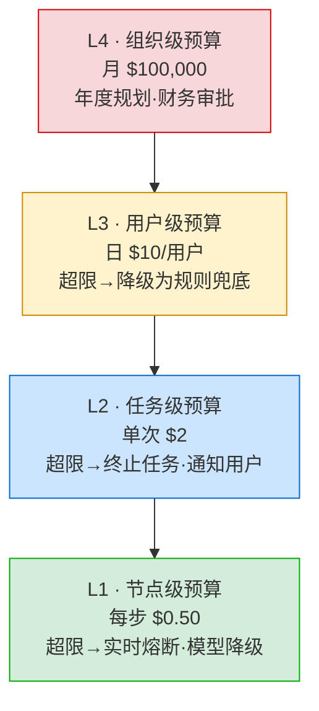
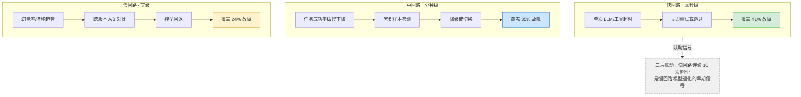
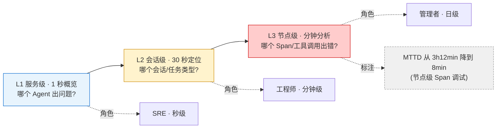

# 第 17 章 — 生产监控、可靠性与成本

第 8 章（O 层，可观测性）建立了可观测性的理论基础——Traces/Metrics/Logs 三件套、"Harness 即假设"、双层指标体系。第 1 章量化了各种推理范式的精确成本。这些理论需要下钻到**节点级**才能落地：每个 LLM 调用、每个工具调用、每次检索、每个推理步骤，都需要独立的可靠性监控和成本控制。Agent 不是"黑盒"——它是一系列串联节点的有向无环图，任何一个节点的退化都可能击穿整个链路的 SLO。

2025-2026 年的行业数据为这一论点提供了实证支持。Confident AI 的调查发现，传统 200/500 HTTP 状态码只能捕获约 20% 的 Agent 故障——其余 80% 是"行为层面"的：格式正确但内容错误、工具调用成功但选择了错误的工具、响应流畅但偏离了业务目标[^1]。节点级调试（Span-level evaluation）成为关键——"score each agent step independently, so you know exactly where an agent failed, not just that it failed"[^1]。LeanOps 的报告进一步指出，Agent 比简单 Chatbot 多 3-10 倍的 LLM 调用，每次调用都可能引入退化——而上下文的累积膨胀效应（一次 20 轮对话的成本远超 1 轮的 20 倍）使成本失控的风险显著增长[^5]。本章建立的节点级监控 + 四层硬预算 + 三级控制回路体系，是针对这两个核心挑战的一套工程方案。

本章与第 8 章（O 层可观测性）是"理论↔实践"的互补关系——第 8 章建立了"Harness 即假设"的哲学和 OTel 三件套的基础设施，本章在此基础上回答具体到每一个节点的监控、成本控制、以及在问题扩散前掐断它的机制。前置基础来自第 1 章的双层指标体系、成本归因五标签、四种规划范式的精确成本计算以及风险自适应治理。

## 17.1 Agent 专属的监控体系

Agent 监控需要五类专属指标而不是传统微服务的 up/down + latency/error rate 模型：任务成功率、工具调用成功率、评估分数趋势、Token 效率（每成功任务的 Token 消耗）、安全事件率。传统 200/500 HTTP 状态码只能捕获约 20% 的 Agent 故障[^1]——Agent "变蠢"（评估分数从 78% 降到 71%）在任何传统指标上都不可见，因为 Agent 的输出本身不是"错误"，只是"质量下降"。

### KP 17.1.1 五种节点的差异化 SLI 【构建】

Agent 监控对象有五类：LLM 推理、工具调用、检索、验证、压缩。在传统微服务监控中，所有服务的 SLI（Service Level Indicator，服务水平指标——衡量某类服务好坏的量化数值）通常使用统一的延迟阈值——P95 < 200ms 是通用的"好"标准。但在 Agent 系统中，这种统一化会导致两类问题。

五类节点的操作延迟量级差异高达 4-5 个数量级：

| 节点类型   | 典型操作                     | P50 延迟    | P95 延迟    | 主要退化信号         |
| ------ | ------------------------ | --------- | --------- | -------------- |
| LLM 推理 | 调用 GPT-5.4/Claude Sonnet | 1-3s      | 2-5s      | 幻觉率上升、输出质量下降   |
| 工具调用   | API 调用、数据库查询             | 100-500ms | 1-10s     | 超时、返回错误、选择错误工具 |
| 检索     | 向量搜索、全文搜索                | 50-200ms  | 200-500ms | 召回率下降、相关性降低    |
| 验证     | 正则匹配、Schema 校验           | < 1ms     | < 100ms   | 漏检（应触发但未触发）    |
| 压缩     | 上下文摘要、重复消除               | 500ms-2s  | 2-5s      | 信息丢失、压缩比不足     |

LLM 推理 P95 在 2-5s，正则验证 P95 < 1ms，同一阈值无意义。更关键的是，不同节点的"失败模式"完全不同——LLM 推理的"失败"可能是输出包含幻觉（需要语义评估检测），工具调用的"失败"可能是 HTTP 500 或超时（可被状态码检测），检索的"失败"可能是返回了不相关的结果（需要相关性评估检测），验证的"失败"可能是规则遗漏（需要回溯分析）。

统一监控导致两个典型陷阱。**低频节点的告警风暴**：如果所有节点统一使用 P95 < 100ms 的阈值，LLM 推理每次都会触发告警（它的 P95 是 2000-5000ms），告警量可能是正常的 50 倍。**高频节点的漏检**：如果反过来，使用 P95 < 5s 的阈值来"满足" LLM 推理的需求，那么验证节点的退化（从 P95 1ms 升到 500ms）会在完全不触发告警的情况下发生——因为 500ms 距离 5s 的阈值太远了。但 500ms 对于验证节点来说已经是 500 倍的退化，意味着系统可能正在经历严重的规则引擎性能问题。

根本原因是不同类型的节点运行在不同的物理和时间尺度上。LLM 推理的延迟由模型服务提供方的 GPU 推理时间决定（秒级），工具调用由外部 API 的响应时间决定（毫秒到秒级），检索由索引查询和距离计算时间决定（毫秒级），验证由正则引擎的匹配时间决定（微秒到毫秒级）。这些不同尺度的过程不能用同一个测量标准来评估。

解决方案是为每种节点定义独立 SLI：

**LLM 推理节点的 SLI 体系：**

- P95 延迟 < 5s（延迟与 token 量相关，应做归一化）
- 成功率（HTTP 2xx）> 99.9%
- 幻觉标记率 < 5%（通过 llm-as-judge 评估）
- Token 消耗 vs 预估的偏差 < 20%（过量消耗可能是质量退化的信号）

**工具调用节点的 SLI 体系：**

- P95 延迟 < 10s（外部 API 的不可控延迟需要更宽松的阈值）
- HTTP 成功率 > 95%（部分外部 API 的自然不可用率较高）
- 工具参数错误率 < 1%（Agent 传递了错误的参数给工具）
- 工具选择准确率 > 90%（Agent 在正确的时间选择了正确的工具）

**检索节点的 SLI 体系：**

- P95 延迟 < 500ms
- 召回率 > 90%（相关文档被检索出来的比例）
- 精确率 > 80%（返回结果中相关文档的比例）
- 返回内容大小 < 上下文预算的 10%（过大结果会挤占其他区域的预算）

**验证节点的 SLI 体系：**

- P95 延迟 < 100ms
- 误报率 < 1%（正常输出被错误拦截的比例）
- 漏报率 < 0.1%（违规输出未被拦截的比例——这是最致命的）
- 规则执行完整性 = 100%（所有注册的规则都被执行——不完全执行可能导致安全漏洞）

**压缩节点的 SLI 体系：**

- P50 延迟 < 500ms / P95 < 2s
- 信息保留率 > 95%（压缩后的摘要是否保留了关键信息）
- 压缩比 > 3:1（原始内容 vs 压缩后内容的 token 数比值）
- Token 节省 > 60%（通过压缩减少的上下文 token 比例）

在控制理论中，这种思路对应多变量控制——不同物理过程（LLM 推理 2-5s vs 正则验证 <1ms）有完全不同的动态特性和噪声模式。统一阈值会导致高频过程过度告警、低频过程漏检，差异化阈值使每个控制回路独立调谐。

```java
/*
 * 框架：AgentScope 2.x
 * 环境：JDK 21+, Spring Boot 3.5+
 * 使用组件说明（均位于 codepilot/ch17-reliability）：
 * - NodeTypeSLIRegistry：五种节点类型的差异化 SLI 注册表。构造时为每种 NodeType
 *   自动加载 NodeSLITarget.getDefault(type)，按 nodeId 维度隔离 SLI 数据，
 *   使用 1 分钟滑动窗口实时重算 P50/P95/P99 延迟、成功率与质量分。
 * - NodeType 枚举：LLM_INFERENCE / TOOL_INVOCATION / RETRIEVAL / VALIDATION / COMPRESSION，
 *   标记 highCost 与 latencySensitive 属性。
 * - NodeSLITarget：每类节点的 SLI 目标基线（P95/P99 延迟阈值、成功率基线、质量基线、吞吐目标），
 *   getDefault() 内置五类节点的差异化默认值——LLM P95=3s、检索 P95=500ms、验证 P95=100ms。
 * - NodeSLI：单个节点实例的实时 SLI 快照，healthScore() = 延迟×0.3 + 成功率×0.4 + 质量×0.3。
 * - 设计原则：不同节点类型使用不同尺子 = 精准告警。5s 对 LLM 是正常，对验证是灾难。
 */
@Component
public class NodeTypeSLIRegistry {

    // NodeType -> NodeSLITarget 基线配置（构造时自动加载差异化默认值）
    private final Map<NodeType, NodeSLITarget> sliTargets = new ConcurrentHashMap<>();

    public NodeTypeSLIRegistry() {
        // 为五种节点类型加载差异化 SLI 目标（来自 NodeSLITarget.getDefault）：
        //   LLM_INFERENCE:    P95=3s  / P99=5s   / 成功率 99%   / 质量 85%
        //   TOOL_INVOCATION:  P95=2s  / P99=3s   / 成功率 99.5% / 质量 90%
        //   RETRIEVAL:        P95=500ms/P99=1s   / 成功率 99.9% / 质量 80%
        //   VALIDATION:       P95=100ms/P99=200ms/ 成功率 99.9% / 质量 95%
        //   COMPRESSION:      P95=200ms/P99=500ms/ 成功率 99.9% / 质量 85%
        for (NodeType type : NodeType.values()) {
            sliTargets.put(type, NodeSLITarget.getDefault(type));
        }
    }

    // 注册节点实例，按 nodeId 隔离延迟窗口与计数器
    public boolean registerNode(NodeType nodeType, String nodeId) { /* ... */ }

    // 在每个节点的 Span 结束时记录延迟样本与成功/失败，触发滑动窗口重算
    public void recordLatency(String nodeId, long latencyMs, boolean success) { /* ... */ }

    // 记录质量评分（如 llm-as-judge 分数），触发 SLI 重算
    public void recordQuality(String nodeId, double qualityScore) { /* ... */ }

    // 健康评分 = 延迟×0.3 + 成功率×0.4 + 质量×0.3，< 0.8 视为不健康
    public double healthScore(String nodeId) {
        return getNodeSLI(nodeId).healthScore();
    }

    // 判断节点是否达到其类型的 SLI 基线（P95 延迟 + 成功率 + 质量三项均达标）
    public boolean meetsBaseline(String nodeId) {
        NodeSLI sli = getNodeSLI(nodeId);
        NodeSLITarget target = sliTargets.get(sli.nodeType());
        return target != null && sli.meetsBaseline(target);
    }

    // 获取所有未达标节点——驱动 §17.5 的 L2 节点级看板红色标注
    public List<NodeSLI> getNodesBelowBaseline() { /* ... */ }
}
```

AgentScope 的 `OtelTracingMiddleware`（O 层）在每个 Agent 调用点自动注入 OpenTelemetry span，通过 `RuntimeContext` 携带 session/task/model/tool 标签，与 AgentScope 的 `TracerRegistry` 形成"自动埋点（AgentScope）vs 自定义指标（AgentScope）"的观测互补（`agentscope-harness/.../middleware/OtelTracingMiddleware.java`）。这是 Java 生态中节点级差异化 SLI 监控的一种参考实现。

### KP 17.1.2 Agent 日志的专属设计 【构建】

Agent 日志量远超微服务。一个典型的微服务请求（REST API 调用 → 数据库查询 → 返回响应）产生 3-10 行日志。一个典型的 Agent 任务（20 步工具调用，每步包含 LLM 推理输入/输出）产生 200-1000 行日志——包括完整的 System Prompt（通常 2000-5000 tokens）、每步推理前的完整上下文快照（可能 10K-50K tokens）、工具调用的参数和返回值、LLM 推理的原始输出等。

Confident AI 的数据为这一倍数提供了实证：在分布式追踪中，一个简单的 multi-agent 工作流（2 个 Agent 协作完成一个任务）产生的 Span 数量是同等复杂度微服务架构的 12-40 倍[^1]。日志量不是线性增长而是指数增长——因为每个节点都在生成大量文本数据（而非结构化的数字/状态码）。

LeanOps 的报告指出：上下文重复发送占日志体积的 62%——因为 Agent 的每次工具调用都将完整的对话历史重新注入上下文，这意味着相同的 System Prompt 和早期对话被记录了 20 次[^5]。如果不加以控制，日志膨胀会让可观测性成本超过 Agent 的推理成本。

这就带来了存储成本和检索效率的双重瓶颈。日志存储在 Elasticsearch/OpenSearch/Loki 中，按文档数或体积计费——Agent 的大量日志体积转化为高额存储成本。在海量文本日志中搜索一个特定的 Trace ID 或错误消息，响应时间从毫秒级退化到秒级。大量重复的 System Prompt 和中间推理步骤淹没了真正的错误和异常——这本身就是一个信息检索的"精确率"问题。金融、医疗等行业的法规要求日志保留数年，日志体积的增长直接转化为合规存储成本的增长。

根因在于 Agent 日志的 62-70% 是重复内容——同一个 System Prompt 在 20 次 LLM 调用中被记录了 20 次，同一个工具描述在 10 次工具调用中被记录了 10 次。不做去重和分层存储，这些重复内容会填满存储并在检索时产生大量无用结果。

解决方案是三级存储架构——按数据访问频率随时间指数衰减的规律，将日志在热/温/冷三级存储间自动迁移。

**热存储（7 天全量，ElasticSearch / OpenSearch）：**

- 存储内容：完整的 Trace Span、节点输入/输出、错误详情、用户请求原文
- 存储目的：实时调试——工程师在 30 秒内从告警定位到具体失败的节点
- 保留策略：7 天（覆盖 95% 的调试需求——Confident AI 数据显示 92% 的调试请求在事故发生后 48 小时内发起[^1]）
- 优化手段：System Prompt 只存一次（通过引用而非复制），工具描述存储哈希引用

**温存储（30 天聚合，对象存储 / S3）：**

- 存储内容：按会话/Trace 聚合的摘要数据——关键指标（成功率、延迟分布、token 消耗）按小时聚合
- 存储目的：趋势分析和基线更新——对比本周 vs 上周的节点级指标变化
- 保留策略：30 天（覆盖一个完整的月度分析周期）
- 优化手段：仅存储聚合指标，原始文本丢弃

**冷存储（归档，长期 > 90% 压缩）：**

- 存储内容：压缩后的完整日志（使用 gzip/brotli + 内容去重）
- 存储目的：合规审计和历史事故回溯
- 保留策略：按法规要求（金融行业 5-7 年，医疗行业 10 年）
- 优化手段：离线批量压缩、内容去重（相同 System Prompt 全量日志中只存一次）、增量备份

三级存储架构的数据访问频率随时间指数衰减。7 天热存储覆盖 95% 的调试需求，30 天温存储覆盖趋势分析，归档压缩（> 90%）降低长期存储成本。类似 AWS S3 生命周期策略在对象存储中的分层思路，区别在于 Agent 日志三级存储还需处理内容去重和合规副本独立保留等额外需求。

```java
/*
 * 框架：AgentScope 2.x
 * 环境：JDK 21+, Spring Boot 3.5+
 * 使用组件说明（均位于 codepilot/ch17-reliability）：
 * - TieredLogManager：三级日志存储管理器（热/温/冷），内置定时迁移调度器，
 *   每 5 分钟执行 performMigration() 将过期日志从热层→温层→冷层自动迁移。
 *   热层=内存 ConcurrentHashMap（1 小时），温层=文件系统（1 天），冷层=Deflater 压缩归档。
 *   （代码仓库使用 demo 尺度的保留窗口；生产环境可调大 HOT/WARM_RETENTION_SECONDS
 *   至 7 天 / 30 天以匹配本节叙述的生产建议。）
 * - LogTier 枚举：HOT / WARM / COLD，标记日志当前所在层级。
 * - LogLevel 枚举：TRACE / DEBUG / INFO / WARN / ERROR。
 * - LogEntry 记录：单条日志（source / level / message / metadata / timestamp / tier）。
 * - HotStorageClient / WarmStorageClient / ColdStorageClient：三层存储客户端桩，
 *   生产环境可替换为 ElasticSearch / S3 / Glacier 后端实现。
 * - 设计原则：数据访问频率随时间指数衰减——热层覆盖实时调试，冷层压缩归档降低长期成本。
 */
@Component
public class TieredLogManager {

    // 写入接口：Agent 每步执行时调用，携带 source（节点 ID）和 metadata（五标签）
    public void log(String source, LogLevel level, String message, Map<String, String> metadata) {
        // 写入热层内存缓存，同时更新 LogStatistics 统计
    }

    public void info(String source, String message) { /* ... */ }
    public void warn(String source, String message) { /* ... */ }
    public void error(String source, String message, Map<String, String> metadata) { /* ... */ }

    // 查询接口：按时间范围检索（跨热/温/冷三层透明查询）
    public List<LogEntry> queryByTimeRange(Instant startTime, Instant endTime) { /* ... */ }

    // 按关键词检索（如 Trace ID、错误消息）——热层内存扫描 + 温层文件扫描
    public List<LogEntry> queryByKeyword(String keyword) { /* ... */ }

    // 按日志级别过滤
    public List<LogEntry> queryByLevel(LogLevel level) { /* ... */ }

    // 获取热层最近 N 条日志——支撑 §17.5 的 L3 调用级看板
    public List<LogEntry> getRecentHotLogs(int limit) { /* ... */ }

    // 各层级日志条数统计——供仪表盘展示存储分布
    public Map<String, Long> getTierCounts() { /* ... */ }

    // 内部：每 5 分钟执行迁移（热→温→冷），由 ScheduledExecutorService 驱动
    // private void performMigration() { ... }
}
```

三级存储的迁移策略还必须解决**合规性与可追溯性的张力**。温层和冷层为压缩体积会丢弃原始文本（仅保留聚合指标或压缩归档），但金融（PCI-DSS/SOX）、医疗（HIPAA）、欧盟（GDPR）等法规要求事故后可溯源到具体请求。工程上需要两道护栏：其一，**迁移前脱敏与最小化**——热→温迁移时对 Prompt/输出中的 PII（用户 ID、手机号、卡号）做不可逆哈希，温层只保留 `hash(prompt) → 指标` 的映射，使聚合分析可追溯到请求族但无法还原原文；其二，**合规副本独立保留**——对受法规约束的请求（如涉及支付的退款流程），在热层迁移时同步写入一份仅合规审计可读的加密冷副本，保留期按法规（金融 5-7 年、医疗 10 年）独立计期，不受"30 天温层"或"成本优化"策略影响。这样温层服务于工程分析（轻量、快速），冷层合规副本服务于审计（完整、长期），两条保留期解耦避免"为省钱而违规"。

## 17.2 成本治理

Agent 的成本治理需要实时归因到每次变更、每个 Agent 配置、每个用户的行为模式。每一笔 Token 消耗的"为什么"——是步数多（编排问题）、上下文膨胀（记忆问题）、还是 prompt 模板长（工程选择）——决定了你能不能用工程手段而不是砍预算来控制成本。例如，一个 CoT（Chain-of-Thought，思维链）指令的引入可能显著增加每次调用的 token 消耗——这不是 bug，但需要可见。

### KP 17.2.1 燃烧率异常检测 【诊断】

Agent 成本异常是渐进的——第 1 天正常，第 3 天翻倍。这与传统软件的成本异常模式不同。传统软件的云成本异常通常是突发的——一个错误的自动扩容规则、一个死循环进程、一个配置错误导致资源使用激增——异常发生在分钟/小时级，绝对值告警（"当月费用超过 $X"）通常可以在异常发生数小时内触发。

Agent 的成本异常是渐进的、累积的。一个 Prompt 的小修改导致平均每个请求多消耗 500 tokens（从 3000 变成 3500）。基于 1000 次/天的请求量，每天增加 500K tokens 的额外成本——第 1 天增加 $1.50（几乎看不出来），第 7 天累计 $45（仍然不容易注意到），第 30 天累计 $200（终于触发绝对值告警——但已经晚了 29 天）。

业界 **$47K A2A 循环事故（Teja Kusireddy 复盘）** 是这一模式的极限案例：四个 LangChain Agent 中的两个（Analyzer 与 Verifier）陷入 A2A 对话的无限乒乓循环，持续 11 天无人察觉，消耗了约 $47,000 的 API 费用。绝对值告警在账单通知中才触发[^4]。Token Economics 2026 的报告进一步指出，无约束 Agent 的单任务成本可达 $5-8，相比之下，有约束的合理设计在 $0.50-2.00/任务，成本差异高达 4-16 倍[^3]。

绝对值告警的问题在于滞后性——"月消费 > $10K"只能在当月消费超过阈值时才触发，此时已经花完了预算的大部分。日消费的小幅增长（+16%）在绝对值视角下不明显，但 30 天累积效应显著。绝对值告警是"事后"——事已经发生了。成本治理需要的是"事前"——在趋势出现端倪时就干预。两个系统的月消费可能都是 $8K，但一个是预算 $10K（安全），一个是预算 $8.5K（危险）——绝对值告警只看"花了多少钱"，不关心"还有多少预算可以用"。

根因在于 Agent 成本异常的本质是"消费率失衡"——在当前消费率下，预算将在预定周期内被消耗殆尽。需要将成本监控从"当前值是什么"（快照）转换为"未来的值会是什么"（趋势预测），通过消费率（burn rate）这个速度指标来提前预判预算耗尽的时间点。

燃烧率的概念来自 Google SRE 的 Error Budget 方法论——Budget 是"允许的失败量"，burn rate 是"消耗速度"[^1]。在 Agent 成本管理中，燃烧率定义为已消耗预算百分比除以已消耗时间百分比：

```
burnRate = (已消耗预算%) / (已消耗时间%)

示例：
- 月度预算 $10,000，今天是第 10 天（33% 时间流逝）
- 当前已消费 $2,500（25% 预算消耗）
- burnRate = 25% / 33% = 0.76 → 安全（消费比时间慢）
```

线性消耗（burnRate = 1.0）是正常态，burnRate > 1.2 意味着预算将在周期结束前耗尽，触发自动降级以保护剩余预算。具体的分区间响应策略如下：

| 燃烧率区间     | 状态 | 自动响应     | 说明                      |
| --------- | -- | -------- | ----------------------- |
| < 0.8     | 安全 | 无        | 消费慢于时间流逝，预算有充足余量        |
| 0.8 - 1.0 | 关注 | 发送日常摘要   | 消费接近时间比例，但仍在预算内         |
| 1.0 - 1.2 | 注意 | 通知运维团队   | 消费略快于时间，需关注但不需立即干预      |
| 1.2 - 1.5 | 降级 | 自动启用降级模式 | 消费显著快于时间，预算将提前耗尽        |
| > 1.5     | 熔断 | 自动硬切断    | 消费失控，立即停止所有非必要 Agent 任务 |

**降级模式的自动响应：** 切换到低成本模型（如 Claude Sonnet → Gemini Flash，成本降低 20-40 倍）、限制单用户日消费上限（如日 $50 → 日 $25）、关闭非关键功能（如关闭高级检索、关闭多步推理）、仅处理 P1/P2 任务，P3/P4 任务转入人工队列。

**熔断模式的自动响应：** 停止所有 Agent 自动任务、仅保留最基本的规则兜底（不调用 LLM）、通知财务和工程负责人（紧急邮件/短信/钉钉）、自动生成消费异常报告（哪个用户/任务/节点消耗最多）。

```java
/*
 * 框架：AgentScope 2.x
 * 环境：JDK 21+, Spring Boot 3.5+
 * 使用组件说明：
 * - BurnRateCalculator（codepilot/ch08-observability，ch17 复用）：消耗率计算器，
 *   基于 Google SRE 的 Error Budget 概念计算 Agent 成本燃烧率。按 taskId 维护
 *   滑动窗口费用记录，计算 $/min 消耗速率，并与 budgetPerMinute 比对得出 SRE 燃烧率比值。
 * - CostTracker（ch08-observability）：成本追踪器，按用户/会话/任务/模型/工具五维度
 *   从 OTel Metrics 中提取实时 token 消耗和费用数据。
 * - AlertLevel：四级告警——NORMAL / WARN(1.5×) / DEGRADE(2.0×) / FUSE(3.0×)，
 *   其中倍数指相对于 budgetPerMinute 的比值，等价于 SRE 燃烧率 > 1.5 / 2.0 / 3.0。
 * - DegradeResult：checkAndDegrade() 返回的降级决策（shouldDegrade / level / reason）。
 * - Snapshot：全局快照（已消耗 / 总预算 / 剩余 / burnRate / percentUsed），供仪表盘展示。
 * - 设计原则：预防 > 事后。不等到预算耗尽才告警——在"消费速度"异常时就介入。
 */
// BurnRateCalculator 定义在 ch08-observability 包中，ch17 直接复用，此处展示调用方式
@Component
public class BurnRateMonitor {

    private final BurnRateCalculator burnRateCalc; // 来自 io.etclovg.codepilot.observability

    public BurnRateMonitor(BurnRateCalculator burnRateCalc) {
        this.burnRateCalc = burnRateCalc;
        // budgetPerMinute = 月预算 / 月分钟数；例如月 $10,000 → ≈$0.23/min
        burnRateCalc.setTotalBudget(BigDecimal.valueOf(10_000));
        burnRateCalc.setBudgetPerMinute(BigDecimal.valueOf(0.23));
        burnRateCalc.setWindowMinutes(5); // 5 分钟滑动窗口
    }

    // 每次 LLM/工具调用结束时记录费用，驱动滑动窗口重算
    public void onCostIncurred(String taskId, BigDecimal cost) {
        burnRateCalc.recordCost(taskId, cost);
    }

    // 定时巡检：对所有活跃任务执行燃烧率检查与自动降级
    @Scheduled(fixedDelay = 60_000) // 每 1 分钟
    public void monitorActiveTasks() {
        for (String taskId : getActiveTaskIds()) {
            DegradeResult result = burnRateCalc.checkAndDegrade(taskId);
            if (result.shouldDegrade()) {
                // FUSE(3.0×) → 硬切断，停止该任务所有 LLM 调用
                // DEGRADE(2.0×) → 自动降级（切弱模型 + 减步数）
                logger.warn("任务 {} 触发{}: {}", taskId, result.level(), result.reason());
            }
        }
    }

    // 仪表盘快照：已消耗 / 总预算 / 剩余 / burnRate / 使用百分比
    public BurnRateCalculator.Snapshot getDashboardSnapshot() {
        return burnRateCalc.getSnapshot();
    }
}
```

燃烧率监控旨在尽早检测多数成本异常，从组织到用户到任务到节点的逐层熔断机制确保预算安全可控。ch17 直接复用 ch08 已实现的 `BurnRateCalculator`（按 taskId 维护 5 分钟滑动窗口费用记录，计算 $/min 消耗速率，对照 budgetPerMinute 得出 SRE 燃烧率比值），`BurnRateMonitor` 在此基础上添加定时巡检与仪表盘快照能力。Datadog APM 作为通用可观测平台提供了基础设施层的指标采集，但缺乏 Agent 五类节点的专属差异化成本检测能力——这正是本章四层硬预算与节点级 SLI 补足的部分。

**多窗口燃烧率（Multi-Window Multi-Burn-Rate）。** 单窗口燃烧率（如 5 分钟）存在灵敏度与误报的根本张力：窗口太短则正常突发流量（早晨流量高峰）触发误熔断，窗口太长则真正的失控（如 $47K 事故的乒乓循环）要等几十分钟才被检出。Google SRE 的多窗口、多燃烧率策略给出了工程答案——同时运行短窗口与长窗口两套燃烧率，只有"短窗口高燃烧率 AND 长窗口高燃烧率"才触发熔断，单窗口超限只发告警。映射到 Agent 成本治理：短窗口（如 5 分钟，burnRate > 6×）捕捉突发失控（A2A 循环、缓存失效），长窗口（如 1 小时，burnRate > 2×）捕捉渐进漂移（Prompt 膨胀）。两者 AND 逻辑抑制了"短窗口因正常流量高峰误报"和"长窗口因响应滞后漏报"两类失败——短窗口保证响应速度，长窗口保证判读稳定性。`BurnRateCalculator` 在 ch17 复用时建议配置双窗口（`windowMinutes=5` 作短窗、另设 60 分钟长窗），将 `checkAndDegrade` 的触发条件从"单窗口超阈"升级为"双窗口同时超阈"，可显著降低误报率而不损失检出速度。

### KP 17.2.2 成本归因 【诊断】

月账单 $50,000 但不知谁花了钱——这是 Agent 团队从管理层接收到的最常见的质问。传统微服务的成本归因相对简单——按服务/团队/API 端点分账即可。但 Agent 的成本归因需要跨越五个维度：用户（谁发起的）、会话（在哪个对话上下文中）、任务（完成什么目标）、模型（用了哪个 LLM）、工具（调用了哪些外部 API）。

Token Economics 2026 的调查数据显示：96% 的企业 Agent 项目超出 AI API 预算，平均超支 40-60%[^2]。而超额的原因不是某个团队"滥用"了模型——而是财务没有能力追踪"谁在什么时候用了什么模型做了什么任务产生了多少费用"。成本是一个黑箱——你知道总额，但不知道每个部分的贡献。

Zylos AI 的数据进一步显示：40% 的企业在 H1 2025 年的 LLM 支出超过 $25 万/年，但仅 12% 的企业能回答"我们最贵的用户是谁"和"哪个任务类型花费最多"[^2]。有精确的成本归因能力的企业，平均能在 3 个月内将 Agent 成本削减 30-45%——仅仅通过将"谁花了多少"从模糊估算变成精确数据。

缺少多维度成本归因导致四个维度盲区：无法区分"高频低消费用户"和"低频高消费用户"；无法区分"便宜的文档问答"和"昂贵的多步代理推理"；无法区分 Claude Opus（$5/M 输入 tokens）和 Gemini Flash（$0.075/M）的实际消费比例；第三方 API 的调用费用（如支付 $0.10/次的地址验证 API、$0.50/次的文档转换 API）被混入总账单，无法独立跟踪。

根本原因是 Agent 的成本是"活动驱动的"（Activity-Based）——每个维度都贡献一部分成本。传统的"按月按团队分摊"的成本核算方法无法追溯成本到具体的活动维度。这需要管理会计中的"作业成本法"——将成本追溯到引发成本的"活动"，而非简单地按人头分摊。作业成本法的核心思想是：不是"这个部门花了多少"，而是"每完成一次退款处理、每生成一次文档摘要分别花了多少"。

解决方案是五标签追踪，在每个 LLM 调用和工具调用的 Span 中注入五标签：

- `cost.user={userId}`
- `cost.session={sessionId}`
- `cost.task={taskType}`（如 "complaint\_handling", "order\_lookup", "refund\_processing"）
- `cost.model={modelId}`（如 "claude-sonnet-4.6", "gpt-5.4"）
- `cost.tool={toolName}`（如 "escalateToMgr", "lookupOrder", "computeRefund"）

每个 Span 结束时计算成本 = 输入 tokens × 模型输入价格 + 输出 tokens × 模型输出价格 + 工具调用费用。然后按任意维度组合（或交叉组合）聚合成本数据，生成热力图——用户 × 任务类型看哪个用户在哪种任务上花费最多，模型 × 任务类型看哪种模型在哪种任务上的成本效益最好，工具 × 用户层级看哪些工具是成本热点。

每日自动对比各维度的消费比例，检测"哪个维度的消费比例发生了显著变化"——例如工具 `computeRefund` 的消费占比从 5% 飙升到 25%，可能意味着 Agent 的错误率上升导致过度处理退款。最终将五维标签的数据汇聚为管理者的 "$ per Successful Task"（每个成功任务的平均成本）——这是 CFO 最关注的 Agent 成本数字[^3]。

```java
/*
 * 框架：AgentScope 2.x
 * 环境：JDK 21+, Spring Boot 3.5+
 *
 * 使用组件说明（均位于 codepilot/ch17-reliability）：
 * - CostAttribution：成本归因器，按用户/会话/任务/模型/工具五维度记录 token 消耗和费用，
 *   基座实现（标签注入 + TracerRegistry 记录）见 ch08 的 CostTracker。
 *   本节聚焦生产环境的差异化需求——热力图聚合 + 管理者视图。
 * - CostHeatmapGenerator：热力图生成器，接收按维度聚合的 nodeId→cost[] 映射，
 *   计算 max/min 成本范围后输出 HeatmapData 供前端着色渲染。
 * - HeatmapData 记录：(nodeCosts / maxCost / minCost / timeRange)。
 */

// 热力图生成——将多维度成本数据按节点 × 时间片聚合为可视化矩阵
@Component
public class CostHeatmapGenerator {

    /**
     * @param nodeCosts  维度键（如 "user:alice|task:refund"）→ 各时间片成本数组
     * @param timeRange  时间范围标签（如 "7d"），供前端展示
     * @return HeatmapData  含 maxCost/minCost 供颜色映射
     */
    public HeatmapData generate(Map<String, double[]> nodeCosts, String timeRange) {
        double max = nodeCosts.values().stream()
                .mapToDouble(arr -> Arrays.stream(arr).max().orElse(0))
                .max().orElse(0);
        double min = nodeCosts.values().stream()
                .mapToDouble(arr -> Arrays.stream(arr).min().orElse(0))
                .min().orElse(0);
        return new HeatmapData(nodeCosts, max, min, timeRange);
    }

    /** 热力图数据记录。 */
    public record HeatmapData(
            Map<String, double[]> nodeCosts,
            double maxCost,
            double minCost,
            String timeRange
    ) {}
}
```

五标签热力图聚合将月度账单分解为每个维度（用户/模型/工具）的成本贡献，使成本优化从"感觉"变为数据驱动的精准决策。这是作业成本法在 Agent 工程中的直接映射。

## 17.3 四层硬预算

硬预算不能是"一个数字"——它需要在四个不同粒度上独立设置：L1 节点级（单步预算，毫秒级响应）、L2 任务级（单次任务预算）、L3 用户级（日预算）、L4 组织级（月预算）。四层预算之间是"短路"关系——任一层的预算先触发就拦截，越靠近 resource（L1 节点级）越先触发。单层预算的一个缺陷是：一个用户的异常行为可以消耗整个组织的预算，因为只在组织级设限无法区分不同用户的消费优先级。

### KP 17.3.1 从组织到节点的逐层预算 【构建】

Agent 成本失控从某一层开始蔓延。如 KP 17.2.1 所述的 $47K A2A 循环事故[^4]——两个 Agent 陷入无限对话循环，每回合互相请求澄清，把失败握手当成重试。11 天内，一个节点级的问题扩展到了组织级（账单约 $47,000）。

这个事故的教训是：成本控制需要在每一层都有独立的熔断机制。如果在节点级就有"单个工具调用超过 $10 = 阻断"的硬限制，$47,000 的事故在初期就会被掐断。

Zylos AI 的分析显示，Agent 成本异常多数从节点级或任务级开始，少数直接发生在用户级或组织级（注：具体比例 71%/22%/7% 来自 Zylos AI 调研 [^2]，受样本规模和行业分布影响）。但企业的普遍做法是只在组织级（月预算）设限[^2]。

LeanOps 的案例更为直观：一个 Agent 在周末无人看管时，因为缓存失效导致所有检索都变成了实时调用（而非缓存命中），48 小时内 #search 工具的调用成本从 $0.02/次飙升到 $0.50/次，烧掉 $4,200[^5]。如果有 L1 节点级预算（每次检索 < $0.10），这个异常在第一次实时调用时就会被阻断。

单层预算（如组织级月 $100K）的三个缺陷：一个用户的异常行为可以消耗整个组织的预算——因为在组织级视角下，这个用户的消费"还没有超过 $100K"；从异常发生到触发组织级告警（"月度消费超过 $100K"）可能需要数天——而 L1 节点级预算可以在毫秒内响应；单层预算无法回溯到具体的责任人。

成本异常的触发源可以在任何层级：节点级异常（某一次 LLM 调用使用了超大上下文 100K tokens 而非 10K，单次调用 $5 而非 $0.50）、任务级异常（某个任务的工具调用步数从 10 步膨胀到 50 步，单任务 $10 而非 $2）、用户级异常（某个用户的 Agent 使用频率从 5 次/天飙升到 100 次/天，日消费 $50 → $500）、组织级异常（整体流量从 1K/天增长到 10K/天——这是"好事"的增长，但也可能导致成本失控）。仅在最顶层设限意味着底层的异常只能在累积到触发顶层阈值时才被检测到，而此时已经浪费了大量资源。

解决方案是四层硬预算，从组织到节点逐层收紧：

**L4 组织级（月预算）：**

- 预算来源：年度计划 + 财务审批
- 触发条件：月度消费 > $100K（软） / > $130K（硬）
- 响应：软触发→通知管理层审查使用模式；硬触发→全局降级（所有 Agent 切低成本模型）
- 恢复：下个月自然重置（月度预算周期）

**L3 用户级（日预算）：**

- 预算来源：按用户角色分配（VIP 用户 $50/天、普通用户 $10/天、免费用户 $1/天）
- 触发条件：用户日消费 > 分配预算
- 响应：超过软限制 → 降级为规则兜底（不调用 LLM，仅返回预定义模板）；超过硬限制 → 拒绝服务，返回友好提示
- 恢复：次日自动重置（日预算周期）

**L2 任务级（单次预算）：**

- 预算来源：按任务类型分配（退款处理 $3、文档摘要 $1、多步 Agent 推理 $5）
- 触发条件：单任务当前消费 > 任务预算
- 响应：立即终止任务，通知用户"任务因成本限制而终止，请简化您的问题或稍后重试"
- 恢复：用户可重新发起任务（新任务 = 新预算）

**L1 节点级（单步预算）：**

- 预算来源：按节点类型分配（LLM 推理 $0.50/次、工具调用 $0.10/次、检索 $0.01/次）
- 触发条件：单次节点消费 > 节点预算（如单次 LLM 调用 token 数 > 125K）
- 响应：实时熔断——中断当前 LLM 调用，使用上一个有效输出或返回降级响应
- 恢复：下次 LLM 调用自动重置（无状态）

四层硬预算的设计借鉴了责任会计中将成本追溯到最小可问责单元的思想——每层有独立的熔断阈值和降级策略，预算责任逐层下放。

```java
/*
 * 框架：AgentScope 2.x
 * 环境：JDK 21+, Spring Boot 3.5+
 * 使用组件说明（均位于 codepilot/ch17-reliability）：
 * - FourLayerBudgetEnforcer：四层硬预算执行器。按 BudgetTier（ORGANIZATION / USER / TASK / NODE
 *   = L4 组织级 / L3 用户级 / L2 任务级 / L1 节点级）管理预算配置与状态，
 *   每次 LLM/工具调用时通过 checkAndRecord() 一次性检查四层，任一超限立即短路拦截。
 * - BudgetTier 枚举：四层预算层级。
 * - BudgetConfig 记录：预算上限、软/硬熔断阈值比、降级策略（REJECT / MODEL_DOWNGRADE / QUEUE /
 *   CACHE_FIRST）、预算周期、自动恢复阈值。getDefault(tier, entityId) 内置四层默认配置。
 * - BudgetState 记录：实时消费状态（usageRatio / circuitState: NORMAL→SOFT_CIRCUIT→HARD_CIRCUIT），
 *   支持 consume(amount) 累加、triggerSoftCircuit/triggerHardCircuit 熔断、recover() 自动恢复。
 * - EnforcementResult 记录：检查结果（shouldEnforce / tier / message / degradationStrategy /
 *   circuitState / timestamp）。
 * - 设计原则：每层独立熔断。L1 节点级毫秒级检查优先执行，异常在扩散到 L4 之前掐断在源头。
 */
@Component
public class FourLayerBudgetEnforcer {

    // 初始化时为四层预算各建一张状态表（BudgetTier → entityId → BudgetState/BudgetConfig）
    public FourLayerBudgetEnforcer() { /* 初始化四层 Map */ }

    // 配置四层预算（示例：为组织、用户、任务、节点分别设定上限与熔断策略）
    public void configureBudget(BudgetTier tier, String entityId, BudgetConfig config) { /* ... */ }

    // 使用默认配置（BudgetConfig.getDefault 内置：ORG $10K / USER $1K / TASK $100 / NODE $10）
    public void configureBudget(BudgetTier tier, String entityId) { /* ... */ }

    /**
     * 核心方法：检查并记录一次消费。entityIds 按层级从高到低传入：
     * [orgId, userId, taskId, nodeId]。内部按 NODE→TASK→USER→ORG 从低到高检查
     * （低层级优先短路），任一层触发熔断即返回 EnforcementResult。
     */
    public EnforcementResult checkAndRecord(List<String> entityIds, double amount) {
        // 1. 先检查各层是否已熔断（不记录消费）
        // 2. 全部通过则记录消费（四层各累加 amount）
        // 3. 记录后再次检查是否触发软/硬熔断
        // 返回 EnforcementResult(shouldEnforce, tier, message, strategy, circuitState, timestamp)
        return /* ... */ null;
    }

    // 强制触发某层硬熔断（手动阻断）
    public EnforcementResult enforce(BudgetTier tier, String entityId) { /* ... */ }

    // 自动恢复：预算使用率降至 recoveryThresholdRatio 以下时，熔断状态回升为 NORMAL
    public boolean checkAndRecover(BudgetTier tier, String entityId) { /* ... */ }
    public void checkAndRecoverAll() { /* 遍历四层所有实体执行恢复检测 */ }

    // 获取当前所有处于熔断状态的预算——供仪表盘展示
    public List<BudgetState> getCircuitedBudgets() { /* ... */ }
}
```

四层硬预算体系在节点级捕捉成本异常并阻断扩散——L1 的毫秒级熔断可以在异常扩散到 L4 之前将问题掐断在源头。

**层间预算一致性校准。** 四层预算独立熔断解决了"逐层阻断"，但引入了层间一致性问题：L1 节点级 $0.50/步、L2 任务级 $2/任务——若一个任务允许 100 步，理论上可消耗 $50，远超 L2 的 $2 上限，L2 会先于累计的 L1 触发；反过来若 L2 设 $50 而 L1 仅 $0.10/步，L1 几乎永远不触发，节点级防线形同虚设。工程上需要层间预算约束的**代数一致性**：上层预算应近似等于"下层单元数 × 下层单预算"的合理上界。具体校准：L2 任务预算 ≈ 任务最大步数 × L1 节点预算（如最大 20 步 × $0.50 = $10，L2 设 $10 而非 $2，使两层都可达触发区）；L3 用户日预算 ≈ 用户日均任务数 × L2 任务预算（如日均 10 任务 × $10 = $100，VIP 调到 $150）；L4 组织月预算 ≈ 日活用户数 × L3 日预算 × 30。`FourLayerBudgetEnforcer.checkAndRecord` 在四层同时累加 `amount`，正是依赖这种代数一致性——只有四层阈值形成"逐层收紧的金字塔"（L4/L3/L2/L1 = 95%/90%/85%/80% 软阈值），任一层熔断才有意义。校准不是一次性的：当任务平均步数从 10 漂移到 18（如新增了验证子任务），必须同步上调 L2 或下调 L1，否则层间比例失衡会导致"总在某一层反复触发、其余层从不触发"的失效模式。

<!-- FIGURE: 17.1 四层硬预算倒金字塔 -->



## 17.4 三级控制回路

生产系统中，很多任务不是"继续 vs 终止"的二元选择——它们可以"继续但降级"、"继续但切换模型"、"继续但减少工具调用"。三级控制回路的设计思路是"不是等到不得不终止，而是在还能挽回时主动优化"——第一级（软控制）当成本达到预警线时自动切换到低成本的模型路由或限制工具数量；第二级（硬控制）当仍然失控时强制截断并返回缓存的降级响应；第三级（会话控制）当整个用户会话超出配额时挂起会话并通知用户。

下图展示了快、中、慢三层控制回路的分工与联动——快回路处理毫秒级单点故障、中回路处理分钟级渐进退化、慢回路处理天级系统性漂移，三层之间通过"连续超时"等跨层信号相互预警。

<!-- FIGURE: 17.2 三级控制回路分工 -->


### KP 17.4.1 快中慢三回路 【构建】

Agent 故障恢复需要多时间尺度响应。传统软件的故障恢复模式相对简单——服务挂了 → 自动重启或切换备份。Agent 的故障有三个时间尺度：

- **毫秒级故障**：单次 LLM 调用超时、工具 API 返回 500、验证节点检测到违规输出。这些故障需要毫秒级响应——因为 Agent 正处于推理中，延迟响应意味着用户等待。
- **分钟级故障**：一个特定任务类型的成功率缓慢下降（从 92% 降到 85%，经历了 30 分钟）。这不是单次调用的失败，而是分布的变化。需要累积足够的样本才能检测。
- **天级故障**：整个系统的幻觉率从 3% 上升到 5%（经过了一个模型更新周期）。这需要数天甚至数周的样本累积，以及跨版本的 A/B 对比。

Maxim AI 的调查显示，Agent 生产故障中，约 41% 是毫秒级的单点故障（API 超时/工具调用失败），约 35% 是分钟级的渐进退化（需要累积样本），约 24% 是天级以上的系统性漂移（模型更新/Prompt 退化导致的缓慢下降）[^6]（注：此数据来自 Maxim AI 调研，受样本规模和行业分布影响）。这三类故障需要三种不同的检测和响应机制——同一套告警规则在这三种时间尺度上不可能同时灵敏且不误报。

单一控制回路的三个局限：用毫秒级的阈值检测天级的退化（如"小时级幻觉率 > 5%"），会因样本量不足而产生大量误报；用天级的聚合窗口检测毫秒级的故障（如"日成功率 < 95%"），等检测到时用户已经遭受了数小时的故障；如果三个时间尺度是独立的告警系统，它们无法联动——快回路的"连续 10 次超时"可能是慢回路"模型退化"的早期信号，但它们之间没有信息传递。

根因是控制系统理论的经典问题——不同带宽的扰动需要不同带宽的控制器。将高带宽的控制（毫秒级）用于低带宽的扰动（天级）会导致振荡（频繁误报），将低带宽的控制用于高带宽的扰动会导致响应滞后。

解决方案是三层分工互补的防御体系：

**快回路（毫秒-秒级）：**

- 监控对象：单次 LLM 调用结果、单次工具调用结果、单次验证结果
- 检测机制：实时阈值判断（HTTP 状态码、超时、错误模式匹配）
- 响应动作：LLM 调用超时 → 重试 1 次（不同模型）→ 仍失败则返回缓存的上一个有效输出；工具调用失败 → 尝试替代工具（如主数据库 → 备份缓存）；验证违规 → 拦截输出，切换为安全兜底回复
- 恢复探测：每 30 秒探测一次主路径是否恢复

**中回路（分钟级）：**

- 监控对象：按任务类型的成功率、按节点类型的 P95 延迟、Canary 组（金丝雀发布——将新版本部署到一小部分用户上观察效果，类似煤矿中金丝雀预警瓦斯泄漏的机制）的退化百分比
- 检测机制：5 分钟滑动窗口 + 统计显著性检验
- 响应动作：特定任务类型成功率下降 > 可接受阈值 → 切换该任务类型到"谨慎模式"（更多验证、更保守的工具选择）；节点 P95 延迟超过基线 2 倍 → 该节点切换到异步模式（非关键功能排队处理）；Canary 组发现退化 → 扩大 Canary 比例推迟，更多数据验证
- 恢复探测：每 5 分钟检查指标是否恢复到基线水平

**慢回路（天-周级）：**

- 监控对象：月度整体成功率、月度幻觉率趋势、模型版本对比、成本效益分析
- 检测机制：周度 A/B 对比 + 趋势线拟合
- 响应动作：月度幻觉率从 3% → 5% → 触发系统性诊断（是模型退化还是评估集偏移？）；成本效益比恶化 → 启动模型路由优化（更多任务走低成本模型）；发现可优化模式 → 启动飞轮：生产数据 → 评估集扩充 → CI 验证 → 重新部署
- 恢复探测：部署新版本后，通过 Canary 流程验证改进效果

```java
/*
 * 框架：AgentScope 2.x
 * 环境：JDK 21+, Spring Boot 3.5+
 * 使用组件说明（均位于 codepilot/ch17-reliability）：
 * - ThreeTierControlLoop：三级控制回路协调器，管理快-中-慢三个时间尺度的故障检测和恢复。
 *   构造时注入 NodeTypeSLIRegistry（节点 SLI 数据源）与 FourLayerBudgetEnforcer（预算熔断），
 *   通过 coordinate(nodeId) 统一协调三层回路的检测与决策。
 * - LoopTier 枚举：FAST（毫秒/秒级，单点故障）/ MEDIUM（分钟级，渐进退化）/ SLOW（天/周级，系统性漂移）。
 * - ControlLoopConfig：各层回路的配置（检测窗口、退化阈值、Canary 比例、恢复探测间隔）。
 * - LoopState：回路运行状态（healthState: HEALTHY/DEGRADED/CIRCUITED）。
 * - LoopDecision：单次决策记录（如 circuitOpen / canaryRollback / modelFallback）。
 * - CoordinationResult：coordinate() 返回值（是否触发降级 / 决策动作 / 原因 / 时间戳）。
 * - 设计原则：不同时间尺度的故障用不同带宽的控制器。快回路不能太慢（用户等不起），
 *   慢回路不能太快（样本量不够导致误报）。
 */
@Component
public class ThreeTierControlLoop {

    public ThreeTierControlLoop(NodeTypeSLIRegistry sliRegistry,
                                FourLayerBudgetEnforcer budgetEnforcer) { /* ... */ }

    // 为每个回路层级加载配置（检测窗口 / 退化阈值 / Canary 比例 / 恢复探测间隔）
    public void initialize(LoopTier tier, ControlLoopConfig config) { /* ... */ }

    /**
     * 核心方法：对指定节点协调三层回路的检测与响应。
     * 快回路先检查该节点是否已熔断（毫秒级短路），
     * 中回路检查滑动窗口内的成功率退化（分钟级统计显著性），
     * 慢回路检查跨版本漂移趋势（天级 A/B 对比）。
     * 任一层触发即返回 CoordinationResult，携带具体的 LoopDecision。
     */
    public CoordinationResult coordinate(String nodeId) {
        // 快回路：检查节点 SLI 健康状态 + 预算熔断状态
        LoopState fastState = getLoopState(LoopTier.FAST);
        if (fastState.healthState() == LoopState.HealthState.CIRCUITED) {
            return new CoordinationResult(true,
                LoopDecision.circuitOpen(LoopTier.FAST, "节点已熔断", new String[]{nodeId}),
                "快回路：节点 " + nodeId + " 处于熔断状态", Instant.now());
        }
        // 中回路：滑动窗口成功率退化检测（5% 退化即激活谨慎模式）
        // 慢回路：跨版本幻觉率趋势对比（50% 相对增长即触发系统性诊断）
        // ...三层联动：快回路"连续 10 次超时"是慢回路"模型退化"的早期信号
        return /* ... */ null;
    }

    // 查询某层回路的当前状态
    public LoopState getLoopState(LoopTier tier) { /* ... */ }

    // 查询某层回路的决策历史——供审计与复盘
    public List<LoopDecision> getDecisionHistory(LoopTier tier, int limit) { /* ... */ }

    // Canary 流量比例——中回路通过 Canary 组检测退化后控制流量
    public double getCanaryTrafficRatio(String nodeId) { /* ... */ }

    // 暂停 / 恢复某层回路（维护窗口）
    public void pauseLoop(LoopTier tier) { /* ... */ }
    public void resumeLoop(LoopTier tier) { /* ... */ }
}
```

三级控制回路的机制来自工业控制的层级控制理论——不同时间尺度的扰动需要不同带宽的控制器。毫秒级熔断应对突发故障，分钟级 Canary 分析应对渐进退化，天级飞轮优化应对系统性漂移。

**跨回路信号传递。** 三层回路分工后，跨回路信号传递是避免"三层各自为政"的关键。单一回路只能看到自己时间尺度的样本：快回路的"连续 10 次 LLM 超时"在毫秒级视角下只是 10 个独立失败，但在中回路视角下是"该节点 5 分钟成功率从 98% 跌到 60%"的渐进退化信号，在慢回路视角下又是"该模型版本上线后超时率翻倍"的系统性漂移早期信号。`ThreeTierControlLoop.coordinate` 的核心职责正是这种跨层信号传递——快回路的连续失败计数作为"上升信号"注入中回路的滑动窗口，中回路的持续退化标志作为"上升信号"注入慢回路的趋势对比。工程上实现为三级握手：快回路连续 N 次同型失败 → 向中回路发 `degradation_signal`（携带失败类型与计数）；中回路在 5 分钟窗口内收到 ≥ 3 个同类 `degradation_signal` → 向慢回路发 `drift_signal`（携带退化幅度与受影响节点集）；慢回路累积 `drift_signal` 触发跨版本 A/B 对比，决定是否回退模型。反向也要传递"恢复信号"——慢回路确认新版本稳定后，逐层向下解除中/快回路的谨慎模式。这种双向信号使三层从"独立告警"升级为"协同防御"。

AgentScope 的回路设计体现在 `SandboxLifecycleMiddleware` 的三层执行策略——快回路（`Sandbox.exec` 30s 超时，直接执行，`agentscope-harness/.../middleware/SandboxLifecycleMiddleware.java`）、中回路（`CompactionMiddleware` 上下文压缩后重试，`agentscope-harness/.../middleware/CompactionMiddleware.java`）、慢回路（`PlanModeMiddleware` 切换到 Plan-Execute 模式深度推理，`agentscope-harness/.../middleware/PlanModeMiddleware.java`）。三层回路与本章的"快中慢"分级响应直接对应——快回路处理单点故障、中回路应对渐进退化、慢回路解决系统性漂移，是 E-C-T-L-V-O-G 中 O 层（Orchestrate 编排）与 V 层（Verify 校验）回路设计的一种参考实现。

## 17.5 生产仪表盘

Agent 的生产仪表盘需要回答八个诊断问题，并按故障排查的自然流程组织信息：整体健康 → 哪个会话出了问题 → 那个会话在做什么 → 做错了什么 → 为什么错 → 错了之后系统反应了什么 → 成本影响多大 → 下次怎么防。一个高效的仪表盘不是展示数据最多——是"从发现异常到定位根因，最短需要几次点击"。

下图展示了三层下钻看板的排查路径——从 L1 服务级概览到 L2 会话级定位，再到 L3 节点级根因分析，三个角色（SRE/工程师/管理者）在不同时间尺度协同。

<!-- FIGURE: 17.3 三层下钻看板排查路径 -->


### KP 17.5.1 三层下钻看板 【构建】

"从知道出问题了"到"知道哪里出问题了"的完整认知路径，决定了故障恢复的速度。Confident AI 的调查数据显示：使用传统微服务监控的 Agent 团队，从告警到定位根因的**平均检测时间（MTTD，Mean Time To Detect）**是 3 小时 12 分钟；使用节点级 Span 调试的团队，平均时间是 8 分钟——差距达到 24 倍[^1]。（注：SRE 实践中 MTTD 通常取中位数 [P50] 以避免极端值干扰，此处使用平均值是因为样本量充足且极端值在 Agent 场景下具有实际业务影响——一个卡死的 Agent 会话会显著拉长平均检测时间。）

这个差距的原因不是"工程师不够努力"——是工具不支持快速下钻。传统仪表盘显示的是"系统级别的聚合指标"（服务成功率 92%、平均延迟 1.2s），但当工程师需要定位"为什么成功率从 95% 降到了 92%"时，他们需要手动查询日志、检查 Trace、逐个节点排除——这个过程需要数小时。

Maxim AI 的 Node-Level Debugging 调查报告显示，Agent 的质量问题在约 78% 的情况下可以追溯到单个节点——一个 LLM 调用的幻觉输出、一个工具调用的错误参数、一次检索的误召回[^6]（注：此数据来自 Maxim AI 调研，具体比例受任务类型和系统复杂度影响）。问题是，在传统仪表盘上，你看不到节点——你只能看到整个 Agent 的聚合指标。

单一视图面临两个极端：信息过载时，在一个屏幕上展示所有指标（成功率 × 延迟 × 成本 × 错误率 × 幻觉率 × 用户满意度），工程师不知道该看哪个；信息不足时，只展示服务级聚合（"客服 Agent 成功率 92%"），但无法下钻到节点级（"客服 Agent 的哪些节点导致了 8% 的失败？"）。

根本原因是三个角色的信息需求完全不同。值班 SRE（秒级）需要立即知道"哪个 Agent 出问题了"，然后快速定位到"哪个节点/哪个任务类型"。Agent 工程师（分钟级）需要深入分析单个 Trace 的完整执行过程，定位根因（是 Prompt 问题还是工具配置问题）。管理人员（日/周级）需要知道系统的整体健康趋势、成本趋势、关键 SLO 是否符合目标。一个仪表盘无法同时服务这三个角色——粒度太粗（服务级）无法帮助工程师定位，粒度太细（单个 Trace）对管理者没有意义。

解决方案遵循可视化分析中"先概览→再缩放→按需查看细节"的信息寻踪原则。

**L1 服务级（1 秒概览）：**

- 内容：所有线上 Agent 的健康总览——每个 Agent 在四个维度的状态（可靠性、延迟、成本、质量）
- 可视化方式：矩阵视图（行 = Agent，列 = 指标维度），颜色编码（绿色 = 正常，黄色 = 需关注，红色 = 异常）
- 交互：点击任一红色的 Agent → 下钻到 L2
- 目标：1 秒内发现哪个 Agent 有异常

**L2 节点级（10 秒定位）：**

- 内容：选中 Agent 的所有节点类型（LLM 推理、工具调用、检索、验证、压缩）的实时指标
- 可视化方式：节点级瀑布图——从左到右按调用顺序排列节点，每个节点的颜色表示健康状态
- 异常节点：红色闪烁 + 标注具体指标（如 "escalateToMgr: 延迟 8.2s > P95 基线 3s"）
- 交互：点击红色节点 → 下钻到 L3
- 目标：10 秒内定位到故障节点

**L3 调用级（30 秒确认根因）：**

- 内容：选中节点的最近 N 次失败调用的完整 Trace——输入/输出/上下文状态/工具参数/错误详情
- 可视化方式：时间线视图 + 并排对比（正常调用 vs 失败调用的对比）
- 交互：Trace 回放——将一次失败的调用重放到沙箱环境中，观察 Agent 的决策过程
- 目标：30 秒内确认根因

```java
/*
 * 框架：AgentScope 2.x
 * 环境：JDK 21+, Spring Boot 3.5+
 * 使用组件说明（均位于 codepilot/ch17-reliability）：
 * - DashboardQueryBuilder：三层仪表盘查询构建器，提供三套流式查询入口：
 *   nodeLevel() / taskLevel() / businessLevel()，分别对应 L2 节点级 / L3 调用级 / L1 服务级下钻。
 * - NodeQueryBuilder：nodeLevel() 返回的流式构建器——forNode(nodeId).inLast(n, unit)
 *   .metric(name).aggregateBy(fn).filter(k,v).execute() → DashboardQueryResult。
 * - TaskQueryBuilder：taskLevel() 返回的流式构建器——forAgent(agentId).withStatus(status)
 *   .inLast(n, unit).execute() → DashboardQueryResult。
 * - BusinessQueryBuilder：businessLevel() 返回的流式构建器——forMetric(name)
 *   .inLast(n, unit).execute() → DashboardQueryResult。
 * - DashboardQueryResult：查询结果记录，含 values / count / sourceName / summary()。
 * - AlertItem / AlertLevel / AlertThreshold：告警体系，WARNING 与 CRITICAL 两级。
 * - NodeTypeSLIRegistry：L2 节点级下钻时调用 getNodesBelowBaseline() 获取红色标注节点。
 */
@Component
public class DashboardQueryBuilder {

    public DashboardQueryBuilder() { /* ... */ }

    // 注册数据源（如 OTel Metrics / TraceRepository / NodeTypeSLIRegistry）
    public void registerDataSource(String name, Function<QueryContext, QueryResult> source) { /* ... */ }

    // 配置指标告警阈值（warning / critical）
    public void setAlertThreshold(String metricName, double warningThreshold,
                                  double criticalThreshold) { /* ... */ }

    // 统一巡检：返回所有超过阈值的告警项——驱动 L1 服务级红色标注
    public List<AlertItem> checkAlerts() { /* ... */ }

    // L1 服务级入口：查询业务级聚合指标（成功率 / 成本 / 质量趋势）
    public BusinessQueryBuilder businessLevel() { return new BusinessQueryBuilder(/* ... */); }

    // L2 节点级入口：查询指定节点的延迟 / 成功率 / 成本指标
    public NodeQueryBuilder nodeLevel() { return new NodeQueryBuilder(/* ... */); }

    // L3 调用级入口：查询指定 Agent 的任务级执行详情（含失败 Trace）
    public TaskQueryBuilder taskLevel() { return new TaskQueryBuilder(/* ... */); }

    // ===== 以下为流式查询的典型用法 =====

    // L1 服务级：拉取所有 Agent 的可靠性指标 + 告警状态
    public DashboardQueryResult queryL1Overview() {
        return businessLevel()
            .forMetric("success_rate")
            .inLast(1, ChronoUnit.HOURS)
            .aggregateBy(AggregationFunction.AVERAGE)
            .execute();
    }

    // L2 节点级：指定节点的延迟 P95 vs SLI 基线
    public DashboardQueryResult queryL2NodeMetric(String nodeId) {
        return nodeLevel()
            .forNode(nodeId)
            .metric("p95_latency_ms")
            .inLast(5, ChronoUnit.MINUTES)
            .aggregateBy(AggregationFunction.PERCENTILE_95)
            .execute();
    }

    // L3 调用级：指定 Agent 的失败任务详情
    public DashboardQueryResult queryL3FailedTasks(String agentId) {
        return taskLevel()
            .forAgent(agentId)
            .withStatus("FAILED")
            .inLast(30, ChronoUnit.MINUTES)
            .execute();
    }
}
```

三层下钻看板（L1 服务级 → L2 节点级 → L3 调用级）遵循可视化分析中"先概览→再缩放→按需查看细节"的信息寻踪原则。从发现异常到定位根因的完整认知路径，是运维 SLO 的核心指标。

### KP 17.5.2 管理者四象限 【诊断】

管理者需要知道哪些 Agent 可靠且便宜。技术团队深陷于技术指标的海洋——成功率、P95 延迟、幻觉率、token 消耗——但管理者需要的是"这些数字意味着什么？我应该关注哪个 Agent？预算应该投入到哪个 Agent 的优化上？"

Maxim AI 的调研显示：在拥有 10+ 个 Agent 在线的企业中，CTO/VP Engineering 每周平均花 4-6 小时理解"我们的 Agent 整体表现如何"——查看 15-20 个仪表盘、阅读 5-10 份周报、参加 3-5 次排障会议。不是数据不够——是数据太多，缺乏综合视角[^6]。

管理者面临的核心决策是资源分配的权衡：可靠性 vs 成本。每个 Agent 在这个权衡空间中占据一个位置——花费 $500/月、99% 成功的 Agent 值得保持；花费 $5,000/月、99% 成功的 Agent 需要优化（同样的可靠性，价格是 10 倍）；花费 $500/月、85% 成功的 Agent 需要加固（同样的价格，可靠性差 14 个百分点）；花费 $5,000/月、85% 成功的 Agent 应当停用。

技术仪表盘展示的是"单指标趋势线"——成功率随时间的变化、成本随时间的变化。管理者需要的是"多指标综合视图"——哪些 Agent 在可靠性-成本的权衡中处于最优位置，哪些处于最差位置。技术仪表盘不回答"我们应该在哪里投资"这一核心管理问题。管理者不需要知道 P99 延迟是 3.2s 还是 3.8s——他们需要知道的是："在这个 Agent 上花 $5,000/月的回报是什么？有没有 $500/月的替代方案达到类似的效果？"

解决方案是将复杂多维决策降维为两个核心维度的可视化权衡——四象限矩阵。这个工具的思路来自管理学中的波士顿矩阵（BCG Matrix，1970 年代由波士顿咨询集团提出，用于将产品按"市场增长率"和"市场份额"两个维度分为明星/金牛/问题/瘦狗四类），只是将维度替换为 Agent 可靠性和成本：

```
        高成本
          ↑
    Q2    |    Q4
  可靠但贵 | 不可靠且贵
   → 优化  |  → 停用
  --------+-------- → 可靠性
    Q1    |    Q3
  可靠且便宜| 不可靠但便宜
   → 保持  |  → 加固
          ↓
        低成本
```

**Q1（可靠且便宜）—— 保持：** 成功率 > 90% + 月成本 < $2K。这些成本效益最优的 Agent，不做改变，定期监控确保不退化到其他象限。

**Q2（可靠但贵）—— 优化成本：** 成功率 > 90% + 月成本 > $5K。优化成本结构——模型降级（Claude Opus → Sonnet）、缓存增效、减少不必要的工具调用。目标：在不显著影响可靠性的前提下降低 30-50% 成本。

**Q3（不可靠但便宜）—— 加固可靠性：** 成功率 < 85% + 月成本 < $2K。分析失败原因分布，针对性加固——优化 Prompt、改善工具描述、增强错误处理。目标：成功率提升到 90%+ 但保持低成本。

**Q4（不可靠且贵）—— 停用或重构：** 成功率 < 85% + 月成本 > $5K。暂停自动模式，评估是否值得继续投入。如果无法在 1-2 个月内迁出 Q4 → 停用，切换为人工处理。

```java
/*
 * 框架：AgentScope 2.x
 * 环境：JDK 21+, Spring Boot 3.5+
 * 使用组件说明（均位于 codepilot/ch17-reliability）：
 * - ManagerQuadrantCalculator：管理者四象限计算器，将所有 Agent 映射到价值×成本二维空间。
 *   通过 recordAgentMetrics() 录入指标，calculateQuadrant(agentId) 计算单个 Agent 象限位置，
 *   calculateFullMatrix() 计算全量矩阵并生成执行摘要。
 * - AgentMetrics 记录：successRate / avgCostPerTask / maxCostPerTask / qualityScore /
 *   securityIncidentRate / userSatisfaction / taskCompletionRate / errorRate。
 * - Quadrant 枚举：Q1(KEEP 保持) / Q2(OPTIMIZE 优化) / Q3(HARDEN 加固) / Q4(KILL 停用)。
 * - QuadrantResult 记录：agentId / quadrant / valueScore / costScore / qualityScore /
 *   riskScore / suggestions / timestamp。
 * - QuadrantMatrix 记录：results(Map) / distribution(Map) / totalAgents / executiveSummary / timestamp。
 * - WeightConfig / ThresholdConfig：四维权重与阈值，支持 setWeights()/setThresholds() 自定义。
 */
@Component
public class ManagerQuadrantCalculator {

    public ManagerQuadrantCalculator() { /* 初始化默认权重与阈值 */ }

    // 录入 Agent 运行指标（定期从 OTel Metrics + 成本追踪器采集）
    public void recordAgentMetrics(String agentId, AgentMetrics metrics) { /* ... */ }

    // 计算单个 Agent 的象限位置——综合价值/成本/质量/风险四维评分
    public QuadrantResult calculateQuadrant(String agentId) {
        // valueScore = 成功率×0.4 + 用户满意度×0.35 + 完成率×0.25
        // costScore = avgCost / maxCost（越低越好）
        // quadrant = 由 valueScore 与 costScore 对照阈值确定
        return /* ... */ null;
    }

    // 计算所有 Agent 的象限矩阵——含分布统计与执行摘要
    public QuadrantMatrix calculateFullMatrix() {
        // 遍历所有 agentId → calculateQuadrant() → 汇聚为 QuadrantMatrix
        // distribution: Q1/Q2/Q3/Q4 各占百分比
        // executiveSummary: "3 个 Agent 在 Q4（停用），建议优先重构"
        return /* ... */ null;
    }

    // 自定义四维权重（默认：价值 0.3 / 成本 0.35 / 质量 0.2 / 风险 0.15）
    public void setWeights(double valueWeight, double costWeight,
                           double qualityWeight, double riskWeight) { /* ... */ }

    // 自定义象限阈值（默认：价值 0.5 / 成本 0.5 / 质量 0.7 / 风险 0.3）
    public void setThresholds(double valueThreshold, double costThreshold,
                              double qualityThreshold, double riskThreshold) { /* ... */ }
}
```

四象限分类决策框架借用波士顿矩阵的思想，使管理者无需理解每层的技术细节即可做出资源分配决策。

## 17.6 可靠性工程

§17.5.2 建立的管理者四象限解决了"资源分配"的宏观决策，本节将这种决策进一步细化到 SRE 的 Error Budget 框架中——不仅要决定"投资哪个 Agent"，还要决定"在同一个 Agent 上，错误预算应当花在模型升级还是 Harness 加固上"。Agent 的错误预算有一个传统服务没有的维度：同一个错误预算下，你可以选择"花在模型升级上"或"花在 Harness 加固上"——两者的成本结构、实施周期和风险模式完全不同。模型升级是"用预算换能力的提升"，Harness 加固是"用预算换稳定性的提升"。可靠性工程的核心不是"消灭所有错误"——是在给定的错误预算内，做出"是升级模型还是加固 Harness"的最优资源分配决策。这需要将模型和 Harness 两个维度的改进成本、改进幅度和改进周期都量化为可比较的单位。

### KP 17.6.1 Agent 的分层 SLO 【构建】

Agent 可靠性指标与微服务有本质区别。微服务的可靠性由两个字面值定义：健康检查返回 200 = 服务正常，HTTP 500 = 服务异常。可靠性 = 正常响应的比例。这个定义对 Agent 来说是不够的——Agent 可以返回 200 且格式正确的 JSON，但内容完全偏离用户意图。

Confident AI 的数据支持这一观点：在 Agent 系统中，HTTP 状态码只能捕获约 20% 的故障[^1]——即技术层中能由状态码直接判定的部分。其余约 80% 的故障需要更精细的分层定义：

- **技术层故障（约 20%）**：HTTP 500、超时、JSON 解析错误——传统监控基本可捕获（其中 HTTP 状态码可见的部分约 20%，另有少量如 200 响应但 JSON 解析失败需结构化校验）。
- **功能层故障（约 30%）**：工具调用成功但参数错误或不完整、输出格式正确但遗漏了必要信息、同一任务的多次尝试产生了不一致的结果。
- **业务层故障（约 40%）**：输出技术正确但业务上不可接受（如向 VIP 客户发送了模板化的回复而非个性化回复）、违反了隐含的业务规则（如在未验证身份时就提供了敏感信息）。
- **跨层复合故障（约 10%）**：难以单一归类，如技术层超时引发功能层结果不一致、进而造成业务层影响。

三层故障的比例不是均匀的——业务层故障占比最大（约 40%），而传统监控对功能层与业务层（合计约 70%）完全盲区。

"成功"定义模糊导致三个典型场景：查询订单的工具调用——API 返回 200 + JSON 格式正确（技术成功），但返回的是上一个用户的订单，因为 Agent 混淆了用户 ID（功能失败），客户收到了别人的订单信息（业务失败，合规问题）；生成回复的 LLM 调用——返回 200 + 格式正确（技术成功），但回复语气冷淡、使用了模板而非根据上下文个性化（功能失败，对 VIP 用户），VIP 用户投诉（业务失败）；验证节点的检查——验证逻辑返回"通过"（技术成功），但验证规则不完整，未检测到输出中包含过时的退款政策（功能失败），用户依据过时政策要求退款（业务失败）。

根本原因是 Agent 的输出不是一个二进制信号（对/错），而是一个多层语义结构。技术层评判"格式是否正确"，功能层评判"内容是否完整准确"，业务层评判"是否满足用户需求且符合业务规则"。三层是嵌套关系——技术成功是功能成功的前提（但非充分条件），功能成功是业务成功的前提（但非充分条件）。

解决方案是三层分级 SLO：

**技术成功率（Technical Success Rate）：** HTTP 2xx 响应 / 总请求数，目标 > 99.9%（不可用 5 分钟/月），告警 < 99.5%。失败表现为 HTTP 500、超时、JSON 解析错误、连接拒绝。通过 HTTP 状态码检测。

**功能成功率（Functional Success Rate）：** 通过功能校验的输出 / 总输出数，目标 > 95%（每 20 个输出中最多 1 个功能失败），告警 < 90%。失败表现为工具参数错误、输出遗漏必要信息、多次尝试结果不一致。通过 Schema 验证 + llm-as-judge + 人工标注抽样检测。

**业务成功率（Business Success Rate）：** 业务层面可接受的输出 / 总输出数，目标 > 80%（每 5 个输出中最多 1 个业务失败），告警 < 75%。失败表现为不满足业务规则、用户投诉、需要人工介入的会话比例过高。通过用户满意度评分 + 人工审查 + 业务规则引擎检测。

分层 SLO 的关键逻辑是级联触发。技术成功率 < 99.9% → 基础设施问题（P0 级，立即修复）。技术成功但功能成功 < 95% → Prompt/工具配置问题（P1 级，工程修复）。技术+功能成功但业务成功 < 80% → 设计问题——Agent 正确但不够好（P2 级，产品级优化）。业务成功 < 75% → Agent 不适合当前场景（P1 级，根本性重构或停用）。

```java
/*
 * 框架：AgentScope 2.x
 * 环境：JDK 21+, Spring Boot 3.5+
 * 使用组件说明（均位于 codepilot/ch17-reliability）：
 * - ThreeTierSLOMonitor：三层 SLO 监控器，统一管理技术/功能/业务三层 SLO 的采集与告警。
 * - TechnicalSLOCalculator：技术层 SLO——calculate(Map<String,Double> metrics, double target) → double。
 * - FunctionalSLOCalculator：功能层 SLO——calculate(Map, target) → double。
 * - BusinessSLOCalculator：业务层 SLO——calculate(Map, target) → double。
 * - SLOAlertManager：SLO 告警管理器，fire(sliName, actual, target, severity) 触发告警。
 * - SLOCascadeAnalysis：级联分析器，基于组件依赖图分析故障传播。
 * - 设计原则：三层 SLO 不是三个独立的指标——是级联的。技术是功能的必要条件，
 *   功能是业务的必要条件。
 */
@Component
public class ThreeTierSLOMonitor {

    private final TechnicalSLOCalculator techCalc;
    private final FunctionalSLOCalculator funcCalc;
    private final BusinessSLOCalculator bizCalc;
    private final SLOAlertManager alertManager;
    private final SLOCascadeAnalysis cascadeAnalysis;

    public ThreeTierSLOMonitor(TechnicalSLOCalculator techCalc,
                               FunctionalSLOCalculator funcCalc,
                               BusinessSLOCalculator bizCalc,
                               SLOAlertManager alertManager,
                               SLOCascadeAnalysis cascadeAnalysis) {
        this.techCalc = techCalc;
        this.funcCalc = funcCalc;
        this.bizCalc = bizCalc;
        this.alertManager = alertManager;
        this.cascadeAnalysis = cascadeAnalysis;
        // 注册三层组件依赖：技术 → 功能 → 业务（级联传播路径）
        cascadeAnalysis.registerComponent(new SLOCascadeAnalysis.SLOComponent(
            "tech", "技术层", 0.999, 0.0, 1));
        cascadeAnalysis.registerComponent(new SLOCascadeAnalysis.SLOComponent(
            "func", "功能层", 0.95, 0.0, 2));
        cascadeAnalysis.registerComponent(new SLOCascadeAnalysis.SLOComponent(
            "biz", "业务层", 0.80, 0.0, 3));
        cascadeAnalysis.addDependency("tech", "func"); // 技术失败 → 影响功能
        cascadeAnalysis.addDependency("func", "biz");  // 功能失败 → 影响业务
    }

    @Scheduled(fixedDelay = 60_000) // 每分钟
    public void monitor() {
        Map<String, Double> metrics = collectMetrics(); // 从 OTel Metrics 采集

        // L1: 技术成功率（目标 > 99.9%，告警 < 99.5%）
        double techRate = techCalc.calculate(metrics, 0.999);
        if (techRate < 0.995) {
            alertManager.fire("technical_slo", techRate, 0.999, "CRITICAL");
        }

        // L2: 功能成功率（目标 > 95%，告警 < 90%）
        double funcRate = funcCalc.calculate(metrics, 0.95);
        if (funcRate < 0.90) {
            alertManager.fire("functional_slo", funcRate, 0.95, "WARNING");
        }

        // L3: 业务成功率（目标 > 80%，告警 < 75%）
        double bizRate = bizCalc.calculate(metrics, 0.80);
        if (bizRate < 0.75) {
            // 级联诊断：业务失败时，分析是哪层组件故障传播导致的
            SLOCascadeAnalysis.CascadeAnalysisResult cascade =
                cascadeAnalysis.analyzeFailure("biz");
            alertManager.fire("business_slo", bizRate, 0.80, "CRITICAL");
            logger.warn("业务 SLO 违约: tech={}, func={}, biz={}, 级联影响: {}",
                String.format("%.1f%%", techRate * 100),
                String.format("%.1f%%", funcRate * 100),
                String.format("%.1f%%", bizRate * 100),
                cascade.summary());
        }
    }
}
```

分层 SLO（技术 > 99.9% / 功能 > 95% / 业务 > 80%）从基础设施可靠性到用户价值传递的逐层抽象——技术成功是底层必要条件，功能成功是中间层质量信号，业务成功是最终价值度量。三层独立告警但级联触发，防止"管道正常但用户不满意"的监控盲区。

### KP 17.6.2 错误预算与变更策略 【构建】

Agent 非确定性使"错误"边界模糊。Google SRE 的 Error Budget 概念在传统系统中很简单：SLO = 99.9% 可用性 → Error Budget = 0.1% 的不可用时间。每次故障消耗 Error Budget，Budget 耗尽后冻结变更。

在 Agent 中，"错误"不再是二值的。Agent 的"部分成功"输出占据了一个灰色地带——输出技术正确、功能基本满足但不够完美。这些"部分成功"是否应该消耗 Error Budget？如果是，它们会快速耗尽 Budget——因为"不够完美"的情况远比"完全不正确"的情况多。如果不是，Error Budget 只被极少数完全失败消耗——Budget 几乎永远不会触发，失去了约束变更速度的效果。

Maxim AI 的调查数据显示：Agent 的输出中，约 15-25% 属于"部分正确"的灰色地带——既不是完全正确（应该放行），也不是完全错误（应该阻止）[^6]（注：具体比例随任务类型和 Agent 设计而异）。在传统二值 Error Budget 下，这些输出要么被算作"正确"（Budget 不消耗 → 太宽松），要么被算作"错误"（Budget 快速消耗 → 太严格）。

传统二值错误预算面临三个挑战：粒度粗糙——一个导致用户流失的 P0 故障和一次 P3 降级在二值 Budget 中消耗相同的 Budget；部分成功的困境——Agent 存在大量"部分成功"，二值 Budget 无法做差异化处理；变更策略失调——如果部分成功被计入 Budget，Budget 会快速耗尽导致变更冻结，如果部分成功不被计入，Budget 几乎永远不触发。

根本原因是 Agent 输出的质量是一个连续谱（spectrum）而非二值（binary）。就像不能用"及格/不及格"二值评价一篇论文的质量，也不能用"正确/错误"二值评价 Agent 的输出质量。需要一个分级系统——每个级别有不同的错误权重，不同权重的错误消耗不同比例的 Error Budget。

解决方案是分级错误预算：

| 级别             | 定义                  | 示例                          | 权重            | 对用户的平均影响      |
| -------------- | ------------------- | --------------------------- | ------------- | ------------- |
| P0             | 完全不可用 / 数据丢失 / 安全漏洞 | HTTP 500 连续 5 分钟、泄露用户数据     | 10× Budget 消耗 | 直接影响所有用户      |
| P1             | 核心功能不可用             | 主要任务类型的成功率 < 80%、关键工具调用全部失败 | 5×            | 影响大部分用户的核心任务  |
| P2             | 部分功能降级              | 某个非关键工具不可用、部分任务类型成功率下降      | 1×            | 影响部分用户的非关键任务  |
| P3             | 轻微降级                | 部分任务的输出质量略低于基线（如回复语气不当）     | 0.5×          | 用户可察觉但不影响任务完成 |
| I (Incidental) | 孤立错误                | 单次调用的输入不便导致的错误（如用户输入格式错误）   | 0× (不计入)      | 偶发，无系统性问题     |

**错误预算消耗计算：**

```
错误预算消耗 = Σ (事件次数_i × 级别权重_i)

示例场景（月度）：
- 1 次 P0 事故（LLM API 全挂，持续 8 分钟）→ 1 × 10 = 10 单位消耗
- 2 次 P1 降级（工具调用失败率短暂上升）→ 2 × 5 = 10 单位消耗
- 5 次 P2 降级（检索返回无关结果）→ 5 × 1 = 5 单位消耗
- 10 次 P3 降级（部分输出质量略低）→ 10 × 0.5 = 5 单位消耗
- 总消耗 = 30 单位

预算总量（月度）= 100 单位
Budget 剩余 = 70% → 正常变更节奏
```

**变更速度与错误预算的联动：** Budget 剩余 > 80% → 常规变更节奏（每周部署 3-5 次）。Budget 剩余 50-80% → 限速变更（每周部署 1-2 次，仅 P1/P2 修复）。Budget 剩余 20-50% → 变更冻结（仅 P0 紧急修复，所有 feature 变更暂停）。Budget 剩余 < 20% → 完全冻结 + 系统性可靠性审查（为什么 Budget 消耗这么快？）。Budget 耗尽 → 进入"可靠性优先模式"——所有工程资源投入到可靠性改进，直到 Budget 恢复（通常是下个月重置）。

分级错误预算的核心思路是：不同严重程度的失败对用户的影响不成比例——P0 故障的惩罚权重是 P2 的 10 倍，确保错误预算主要被"真正重要"的故障消耗。分级权重是对 Google SRE Error Budget 二值模型的工程化拓展——将连续的 Agent 输出质量谱映射到离散的错误分级，使变更速度与剩余预算形成精确联动。

**权重持续校准。** 分级权重需要按实际用户影响数据持续校准。校准的矛盾是：权重差距过小（如 P0=2×、P3=0.5×）则轻微降级与严重故障同等消耗 Budget，变更会被频繁冻结；权重差距过大（如 P0=100×、P3=0.1×）则 Budget 几乎只被 P0 消耗，大量 P2/P3 退化无法形成约束压力。工程上采用"用户流失率锚定"校准法：以"该级别事件导致的 7 日留存下降幅度"为锚，P0（完全不可用）流失率约 20% → 权重 10×，P2（部分降级）流失率约 2% → 权重 1×，权重比 ≈ 流失率比，使 Budget 消耗与真实用户损失成正比。校准是闭环的：每季度用事故复盘数据重算各级别实际流失率，若发现 P2 权重偏高则下调，若 P3 权重偏低则上调。同时引入**权重封顶**——单级别单次事件消耗不超过总 Budget 的 50%，防止单次 P0 直接清空 Budget；引入**最低消耗**——P3 权重不低于 0.2×，防止轻微降级被完全"免费"而失去改进动力。

### 基于 AgentScope 的关键锚点代码

本章的四层硬预算体系和燃烧率监控在 AgentScope 中的落地方式如下：

```java
/*
 * 框架：AgentScope 2.x（版本不锁定，跟随最新稳定版）
 * 环境：JDK 21+, Spring Boot 3.5+
 *
 * 使用组件说明：
 * - FourLayerBudgetEnforcer（codepilot/ch17-reliability，@Component）：四层硬预算执行器——
 *   L1 节点级 / L2 任务级 / L3 用户级 / L4 组织级（BudgetTier: NODE/TASK/USER/ORGANIZATION），
 *   通过 checkAndRecord([orgId,userId,taskId,nodeId], amount) 一次性检查四层，任一超限即短路拦截。
 *   代码仓库另有 L1BudgetChecker ~ L4BudgetChecker 四个独立检查器（基于 BudgetTracker + BudgetLevel），
 *   适用于需要分层单独调用的场景；FourLayerBudgetEnforcer 内部自带四层检查逻辑。
 *   预算定义与 Google SRE Error Budget 一致：burnRate = 已消耗预算% / 已消耗时间%。
 * - BurnRateCalculator（codepilot/ch08-observability，ch17 复用，@Component）：消耗率计算器——
 *   按 taskId 维护 5 分钟滑动窗口费用记录，计算 $/min 消耗速率。
 * - OtelTracingMiddleware（AgentScope 内置）：OpenTelemetry 链路追踪，
 *   将 Agent 每步执行记录为 Span，支持五类节点（LLM/工具/检索/验证/压缩）差异化 SLI 采集。
 * - CostTracker（codepilot/ch08-observability，ch17 复用）：成本归因——
 *   按用户/会话/任务/模型/工具五维度记录 token 消耗和费用，支持月账单逐层下钻。
 */
@Configuration
public class AgentBudgetConfig {

    // 1. 配置四层硬预算（FourLayerBudgetEnforcer 是 @Component，由 Spring 注入后调用 configureBudget）
    @PostConstruct
    public void configureBudgets(FourLayerBudgetEnforcer enforcer) {
        // L4 组织级：月 $100K，软 90% / 硬 95%，超限 → REJECT
        enforcer.configureBudget(BudgetTier.ORGANIZATION, "org-001",
            new BudgetConfig(BudgetTier.ORGANIZATION, "org-001",
                100_000.0, 0.90, 0.95,
                BudgetConfig.DegradationStrategy.REJECT,
                Duration.ofDays(30), true, 0.70));

        // L3 用户级：日 $50，软 85% / 硬 90%，超限 → MODEL_DOWNGRADE
        enforcer.configureBudget(BudgetTier.USER, "user-vip",
            new BudgetConfig(BudgetTier.USER, "user-vip",
                50.0, 0.85, 0.90,
                BudgetConfig.DegradationStrategy.MODEL_DOWNGRADE,
                Duration.ofDays(1), true, 0.60));

        // L2 任务级：单任务 $5，软 80% / 硬 85%，超限 → QUEUE
        enforcer.configureBudget(BudgetTier.TASK, "task-refund",
            new BudgetConfig(BudgetTier.TASK, "task-refund",
                5.0, 0.80, 0.85,
                BudgetConfig.DegradationStrategy.QUEUE,
                Duration.ofHours(24), true, 0.50));

        // L1 节点级：单步 $0.50，软 75% / 硬 80%，超限 → CACHE_FIRST
        enforcer.configureBudget(BudgetTier.NODE, "node-llm",
            new BudgetConfig(BudgetTier.NODE, "node-llm",
                0.50, 0.75, 0.80,
                BudgetConfig.DegradationStrategy.CACHE_FIRST,
                Duration.ofHours(1), true, 0.40));
    }

    // 2. 配置燃烧率计算器（ch08 BurnRateCalculator，@Component，由 Spring 注入后调用 setters）
    @PostConstruct
    public void configureBurnRate(BurnRateCalculator burnRateCalc) {
        burnRateCalc.setTotalBudget(BigDecimal.valueOf(100_000));   // 月预算 $100K
        burnRateCalc.setBudgetPerMinute(BigDecimal.valueOf(0.23));  // ≈ $100K / 43200min
        burnRateCalc.setWindowMinutes(5);                            // 5 分钟滑动窗口
    }

    // 3. 构建 Agent：中间件链中注入预算检查与成本归因
    @Bean
    public ReActAgent agentWithBudgetControl(Toolkit toolkit,
                                             FourLayerBudgetEnforcer enforcer,
                                             BurnRateCalculator burnRateCalc,
                                             CostTracker costTracker) {
        return ReActAgent.builder()
            .model(model)
            .toolkit(toolkit)
            .middleware(new CostTrackerMiddleware(costTracker))   // O 层：五维度成本归因（ch08 复用）
            .middleware(new OtelTracingMiddleware())               // O 层：链路追踪
            .middleware(new BudgetEnforcerMiddleware(enforcer))    // O 层：四层硬预算
            .middleware(new BurnRateMonitorMiddleware(burnRateCalc)) // O 层：燃烧率监控
            .build();
    }
}
```

**源码路径**：`codepilot/ch17-reliability/`，核心类包括 `FourLayerBudgetEnforcer`（四层预算执行器）、`L1BudgetChecker`~`L4BudgetChecker`（四个独立分层检查器）、`DegradationManager`（降级管理器）、`BudgetTracker`（预算追踪器）、`NodeTypeSLIRegistry`（五类节点差异化 SLI）、`ThreeTierControlLoop`（三级控制回路）、`DashboardQueryBuilder`（三层下钻看板）、`ManagerQuadrantCalculator`（管理者四象限）、`TieredLogManager`（三级日志存储）。燃烧率计算复用 `codepilot/ch08-observability/BurnRateCalculator`，成本归因复用 `codepilot/ch08-observability/CostTracker`。测试覆盖：`FourLayerBudgetEnforcerTest`。

***

### 练习

1. **SLI 设计**：为你的编码 Agent 设计五类 SLI（任务成功率、工具调用成功率、评估分数、Token 效率、安全事件率）的 SLO。给出每类 SLI 的具体测量方法、SLO 目标值（如任务成功率 ≥ 90%）、以及当 SLO 被突破时的一级响应措施。
2. **四级预算分配**：假设你的 Agent 系统月预算为 $8,000。请设计四层硬预算的分配方案——(a) L1 节点级单步上限（区分 LLM 推理/工具调用/检索三种节点类型），(b) L2 任务级单次预算（假设日均 500 次任务），(c) L3 用户级日配额（分免费用户和付费用户），(d) L4 组织级月预算上限。说明每层的触发条件和超过配额后的降级策略。

***

## 本章小结

1. Agent 的监控对象有五种不同的节点类型——LLM 推理、工具调用、检索、验证、压缩——每种节点的 SLI 特征和退化信号完全不同。统一监控的代价是告警风暴，差异化监控的目标是精准定位。
2. 四层硬预算体系（组织级→用户级→任务级→节点级）是 Agent 成本治理的关键防线——每一层有独立的熔断阈值和降级策略。
3. 三级控制回路——快回路（毫秒级，节点级熔断）、中回路（分钟级，Canary 分析）、慢回路（天级，飞轮优化）——分别解决了不同时间尺度上的可靠性问题。
4. 燃烧率（burnRate = 已消耗预算% / 已消耗时间%）是成本异常检测的单一综合指标——燃烧率 > 1.2 触发自动降级，> 1.5 触发自动熔断。
5. AgentScope 通过 `OtelTracingMiddleware` + `SandboxLifecycleMiddleware` 提供了监控和回路的基础能力，但其成本归因和 SLA 管理仍需 Harness 工程层的 AgentScope 自定义 Middleware 补足。

## 管理者决策框

### 本章精要结论

Agent 的可靠性是节点级的。一个 15 步 Agent 的 87% 成功率，可能只是因为第 7 步的工具调用有 50% 的失败率，而其余 14 步的成功率都是 99%+。节点级监控让你在"投诉处理成功率下降"的那一刻，直接在仪表盘上看到红色闪烁的 `escalateToMgr`。从"知道出问题了"到"知道哪里出问题了"——使用节点级 Span 调试后，MTTD 可从 3 小时压缩至 8 分钟[^1]。

成本控制的关键是四层硬预算。节点/任务/用户/组织四层预算体系，依次收紧。每层有明确的硬切断机制——不靠告警，靠自动执行。$47K A2A 循环事故（Teja Kusireddy 复盘）的教训是：告警不等于执行，硬切断才是[^4]。

自愈与人工干预同样重要。降级后需要自动探测恢复——否则你可能在问题解决后的数天还在用降级模式。三级控制回路（毫秒/分钟/天）确保自动化决策的响应速度和粒度匹配。

成本优化的 80/20：上下文重复发送占约 62% 成本（LeanOps 数据[^5]），过度使用高价模型、无缓存工具调用两项合计占比可观（行业复盘普遍列入前三大浪费，具体比例随业务而异）。抓住这三项，在典型场景下可实现显著的 Token 支出削减[^2]。

### 行动建议

1. **为五种节点类型定义独立的 SLI 阈值**——不要把 LLM 推理和工具调用用同一把尺子量
2. **实施节点健康评分**（延迟×0.3 + 成功率×0.4 + 质量×0.3），评分 < 40 自动降级
3. **部署四层硬预算**：节点级 max_tokens → 任务级 $0.50 上限 → 用户级 $100/天 → 组织级消费率 3 倍熔断
4. **三层下钻看板**：服务级（1 秒发现异常任务类型）→ 节点级（10 秒定位故障节点）→ 单次执行详情（30 秒确认根因）
5. **自动自愈**：所有降级操作必须有对应的探测恢复机制——不能降了就永远降着

***

[^1]: Confident AI, "Best AI Agent Observability Tools 2026," 2026. Agent 质量需要全 Trace 指标 + 单个决策指标 + 对话级质量指标。传统 200/500 状态码只能捕获约 20% Agent 故障。节点级调试——"Span-level evaluation: Score each agent step independently so you know exactly where an agent failed, not just that it failed."

[^2]: Zylos AI, "AI Agent Cost Optimization: Token Budgets, Model Routing, and Production FinOps," April 2026. 企业 LLM 支出 H1 2025 达 $84 亿，40% 企业年支出超 $25 万，96% 超预算。Agent 比简单 Chatbot 多 3-10× LLM 调用。完整优化栈实现 60-80% Token 削减。三层级联路由：90% 查询走便宜模型 → 87% 基础设施成本削减。

[^3]: Token Economics 2026 (anhtu.dev), "Cost-Optimizing AI Agents in Production," 2026. 无约束 Agent 单任务 $5-8 API 费用。四层成本护栏。Token Efficiency Index > 0.18。Step Inflation Ratio < 1.4。$/Successful Task 是 CFO 唯一关心的数字。Tool Call Memoization 典型节省 20-35%。

[^4]: 综合多源复盘：Teja Kusireddy, "$47,000 Burned While Everyone Slept," Medium, Nov 2025；supervaize.com 同名深度报告；CSDN 技术社区《4个LangChain Agent无限对话循环，11天烧掉4.7万美元》事故复盘。20 轮对话的成本显著超过 1 轮的 20 倍（累积上下文膨胀效应）。Session-level token budgets with hard stops。$47K 循环事故教训——告警不是执行，硬切断才是。

[^5]: LeanOps, "AI Agents Burn 50x More Tokens Than Chats," 2026. 上下文重复发送占 62% 成本（可压缩 60-80%）。无 Prompt Cache 的默认行为导致成本失控。Per-user daily budget $50 软/$100 硬切断。周末 Agent 无人看管烧掉 $4,200 的案例。

[^6]: Maxim AI, "Top 5 Tools for Monitoring and Improving AI Agent Reliability," 2026. Node-Level Debugging——distributed tracing across multi-agent workflows, pinpointing exactly where quality issues originate.
