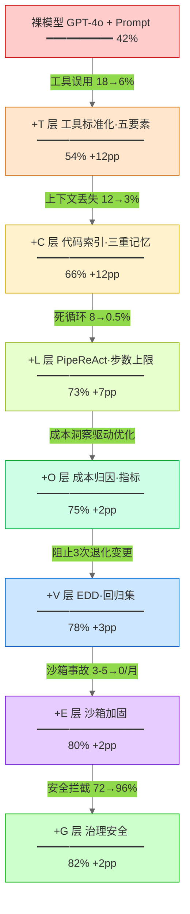

# 第 18 章 — 案例研究：ETCLOVG 实战解剖

> **作者立场与数据来源声明**：本章作者为独立技术作家，未参与所涉及系统的开发、运营或商业化，也未获得任何厂商的资助或内部访问权限。本章全部分析均基于公开可获取的资料，包括：厂商官方文档与技术博客、SWE-bench 等第三方公开基准榜单的已发布数据、开源项目的 GitHub 代码与 Issue 讨论区、行业媒体的公开报道。所有七层配置的判断均为**基于公开披露信息的工程推断**，不代表官方立场，可能与系统内部实现存在偏差。读者如需了解确切实现细节，应以厂商官方渠道和开源代码为准。

Agent 系统进入生产后，运维团队面对的核心问题不是"选哪个模型"，而是"不同 Harness 配置在真实场景中如何落地"。本章基于公开资料，整理五个编码 Agent 和三类企业 Agent 的 ETCLOVG 七层配置情况，分析公开披露的工程取舍及其背后的场景约束。

本章以 ETCLOVG 七层框架为分析工具，整理五个成熟编码 Agent 系统（Cursor / Cline / Devin / OpenHands / SWE-agent）和三类企业 Agent（客服 / 知识助手 / 流程自动化）在公开资料中所披露的七层配置。每一层的设计取舍不是主观评价，而是由使用场景的约束条件所决定的工程决策。CodePilot 作为全书贯穿案例，在此完成从裸模型到全 Harness 的完整进化回顾——七层逐层叠加、模型不变、成功率翻倍。

## 18.1 编码 Agent 全景：逐层解剖与设计取舍

SWE-bench 官方公开榜单上，五个主流编码 Agent 在同一基准下的分数从二十几到六十几差了近三倍。公开架构资料显示，差距的来源不只是底层模型——Devin 和 OpenHands 可能使用相同的底层模型——七层 Harness 的配置深度是另一个独立的影响因素。以下基于公开文档整理的七层对比呈现一个可观察的规律：编码 Agent 的公开表现差异，与其公开披露的 Harness 工程投入存在正相关。

### KP 18.1.1 五系统七层强度对比矩阵 【构建】

<!-- FIGURE: 18.1 五系统 ETCLOVG 七层强度对比矩阵（█ 格数表示该层公开披露的工程投入深度：强=6 格、中=4 格、弱=2 格） -->

| 系统            | E 执行环境   | T 工具接口   | C 上下文记忆  | L 生命周期   | O 可观测性   | V 验证     | G 治理     | 七层覆盖概览          |
| ------------- | -------- | -------- | -------- | -------- | -------- | -------- | -------- | --------------- |
| **Cursor**    | ██░░░░ 弱 | ████░░ 中 | ██████ 强 | ████░░ 中 | ████░░ 中 | ██░░░░ 弱 | ██░░░░ 弱 | 1 强 · 3 中 · 3 弱 |
| **Cline**     | ██░░░░ 弱 | ████░░ 中 | ████░░ 中 | ████░░ 中 | ██░░░░ 弱 | ██░░░░ 弱 | ██░░░░ 弱 | 0 强 · 3 中 · 4 弱 |
| **Devin 2.0** | ██████ 强 | ██████ 强 | ████░░ 中 | ██████ 强 | ██████ 强 | ████░░ 中 | ██████ 强 | 5 强 · 2 中 · 0 弱 |
| **OpenHands** | ████░░ 中 | ██████ 强 | ████░░ 中 | ████░░ 中 | ████░░ 中 | ████░░ 中 | ████░░ 中 | 1 强 · 6 中 · 0 弱 |
| **SWE-agent** | ████░░ 中 | ██████ 强 | ██░░░░ 弱 | ████░░ 中 | ██░░░░ 弱 | ██████ 强 | ██░░░░ 弱 | 1 强 · 2 中 · 4 弱 |

每行代表一个系统，每列代表 ETCLOVG 的一层。█ 格数对应公开披露的工程投入深度（强=6、中=4、弱=2），仅用于跨系统横向对比，不构成对任何系统的正式评价。最右列"七层覆盖概览"汇总该系统在各层的强/中/弱分布，便于快速定位其工程重心。

公开披露的架构显示，Devin 在全部七层上的工程投入最为广泛；Cursor 公开文档强调了 C 层（代码索引）和 T 层（工具生态）的投入；开源方案（OpenHands/SWE-agent/Cline）的 GitHub 代码中，G 层（治理）和 O 层（观测）的模块较少。上述判断仅基于公开披露的信息整理，不代表官方观点。

2026 年编码 Agent 市场的公开格局：公开估值和定价信息显示，Cursor 以 $9.9B 估值在 IDE 类 Agent 中领先，Devin（Cognition Labs）公开定价从 $500/月降至 $20/月持续迭代，Claude Code 和 Cline 作为终端式编码代理公开采用率快速上升，OpenHands 和 SWE-agent 作为开源项目推动 ACI（Agent-Computer Interface，Agent-计算机交互界面——即为 LLM 而非为人类重新设计工具操作原语）设计范式的普及[^1]。

基于公开资料整理的这五个系统，其公开披露的架构选择和七层配置差异显著。ETCLOVG 框架提供了一个结构化的视角，帮助将零散的公开信息整理为可比较、可讨论的工程分析：基于公开文档识别每个系统在七层上做了什么选择，以及这些选择背后对应的场景约束条件。四个最关键的约束维度（在公开架构文档中被反复提及）决定了投入优先级——交互模式（实时 IDE 内 vs 异步云端 vs 终端原生）、用户角色（开发者在驾驶位 vs 开发者在审查位 vs 开发者在命令行端）、安全性需求（本地文件系统直接访问 vs 云端全隔离沙箱）、以及商业模型（开源社区驱动 vs 商业产品）。

跨系统对比的方法论基础来自 Robert Yin 的案例研究法（1984）——通过多案例复制逻辑保证结论的泛化性，而非依赖统计抽样。此处五个编码 Agent 作为公开可观察的独立案例，在统一的 ETCLOVG 框架下逐层整理其公开披露的配置。差异化的七层配置反映的是场景约束驱动的设计取舍。

以下是基于公开文档的工程推断整理。表中"强/中/弱"的判定基于以下统一的量化标尺（仅用于跨系统横向对比，不构成对任何系统的正式评价）：

| 层         | 强的判定标准（基于公开披露信息）                                        | 中的判定标准                                  | 弱的判定标准                            |
| --------- | ------------------------------------------------------- | --------------------------------------- | --------------------------------- |
| E（执行环境）   | 公开文档明确提及每次会话新 VM + 快照回滚 + 网络白名单 + 文件系统隔离                | 公开文档或开源代码显示 Docker/容器隔离 + 文件系统挂载隔离      | 公开文档显示直接本地执行或最小隔离（如 Git worktree） |
| T（工具接口）   | 公开文档或开源代码显示 ACI 原语设计 + 多工具并行 + 结构化错误返回                  | 公开文档显示通用工具集成（LSP/终端/文件 API）+ 基础扩展       | 公开文档显示仅终端/文件读写，无专用工具抽象            |
| C（上下文记忆）  | 公开文档明确提及三层索引（语义+关键词+结构化）+ 500K+ Token 窗口 + 多 Agent 记忆共享 | 公开文档或开源代码显示会话上下文 + 项目级检索（RAG）           | 公开文档无专门记忆管理描述，推测仅依赖 LLM 原生上下文窗口   |
| L（生命周期编排） | 公开文档明确提及多阶段编排（Plan+ReAct+验证门）+ Meta-agent 调度 + 并发控制     | 公开文档或开源代码显示 ReAct/Plan-Act 单路循环 + 配置化约束 | 公开文档显示固定工作流或简单循环，无动态编排描述          |
| O（可观测性）   | 公开文档或截图显示实时可视化仪表盘 + 成本追踪 + 完整日志 + 结构化 Metrics           | 公开文档或截图显示 Web UI 展示执行过程 + Session 录制    | 公开文档显示仅终端日志或 IDE 内联提示，无结构化数据导出    |
| V（验证）     | 开源代码或公开文档显示自动化评估流水线 + 基准测试集成 + 回归阻断                     | 公开文档提及测试通过率作为验证信号，有自动化测试集成              | 公开文档无自动化验证描述，推测依赖人工审查 Diff/输出     |
| G（治理）     | 公开文档明确提及多层审批门 + 沙箱全隔离 + WORM 审计 + RBAC                  | 开源代码或公开文档显示规则匹配 + 行为评分 + 用户可定义禁止操作      | 公开文档显示最小隔离或仅人工确认，无审批/审计流程描述       |

基于上述标尺的七层公开信息整理对比（注：所有等级为作者基于公开资料的独立工程推断，不作为任何厂商的官方评价或质量认证）：

| 层     | Cursor                                                                                                                                                                                     | Cline (VS Code)                                                                          | Devin 2.0                                                                                                               | OpenHands                                                                                    | SWE-agent                                                                                          |
| ----- | ------------------------------------------------------------------------------------------------------------------------------------------------------------------------------------------ | ---------------------------------------------------------------------------------------- | ----------------------------------------------------------------------------------------------------------------------- | -------------------------------------------------------------------------------------------- | -------------------------------------------------------------------------------------------------- |
| **E** | **弱**——本地文件系统直接访问，无沙箱隔离。代码执行在开发者的本机环境。安全依赖 IDE 权限模型和 Git 保护。                                                                                                                               | **弱**——终端直接访问本地环境，通过 Git worktree 隔离 Agent 操作与主工作区。                                      | **强**——每次会话启动独立 Ubuntu VM 沙箱，含浏览器/Shell/编辑器。支持快照回滚。至多 10 个并行 VM（Pro 版）。                                                 | **中**——Docker 沙箱。支持自定义 Dockerfile 定义执行环境。通过 Docker SDK 管理容器生命周期。                             | **中**——Docker 沙箱。代码修改在容器内执行，测试运行在隔离环境。支持多架构（ARM/x86）。                                              |
| **T** | **中**——LSP 深度集成（诊断/补全/跳转）+ 终端 + 文件编辑。Cursor 2.0 新增 Browser Control。Composer 模式支持多文件并行编辑。                                                                                                   | **中**——终端 + 文件读写 + VS Code API。通过 MCP 协议扩展工具。支持自定义工具链。                                   | **强**——四件套：Planner（任务分解）/ Coder（文件编辑）/ Browser（文档搜索）/ Shell（构建+测试）。Meta-agent 监督四个子 Agent 的协调。                          | **强**——CodeAct 架构：将代码编辑和 CLI 操作统一为"代码动作"抽象。支持 Bash/Python 脚本 + 文件编辑 + 浏览器 + Git。             | **强**——ACI 设计范式：view（带行号）/ search\_file / search\_dir / edit（精确行号替换）/ scroll。Linter 在每次编辑后自动校验语法。  |
| **C** | **强**——三层索引体系：全代码库语义嵌入（Tree-sitter AST 分块 + HNSW 向量索引 + BM25 关键词索引）。@codebase 自然语言查询。500K Token 上下文窗口（Composer）。Shadow Virtual File System 管理多 Agent 编辑。                                   | **中**——会话上下文（当前对话历史）+ 项目级文件扫描。依赖 VS Code 的 LSP 提供类型信息。通过 .clinerules 注入项目约定。             | **中**——会话记忆（同一项目的多次会话共享上下文）+ 知识条目（用户手动教给 Devin 的规则，如"始终用 pnpm"）。每会话需重新加载上下文，长会话记忆有限。                                    | **中**——RAG 注入：从代码库中检索相关代码片段注入 LLM 上下文。支持自定义 RAG 策略（按模块/按依赖图）。                                | **弱**——基本上下文管理。依赖 LLM 自身的上下文窗口。每次动作的结果直接添加到对话历史。无专门的记忆压缩或索引层。                                      |
| **L** | **中**——Cursor 2.0 Composer 使用 ReAct 循环。多 Agent 并行调度：可同时启动 Frontend Architect + Backend Database Agent。Shadow VFS 解决并发编辑冲突。Tab Completion（<100ms）/ Chat（2-5s）/ Composer（15-120s）三级模式不同编排深度。 | **中**——Plan-Act 模式：先分析任务生成 Plan，用户确认后分步执行。支持自主模式（跳过用户确认）。通过自定义 Rules 注入编排约束（步数上限/文件黑名单）。 | **强**——Plan+ReAct+长时间编排。Dev 先生成显式计划（Checklist），用户审核后才开始执行。每步作为验证门：测试失败→读取失败输出→假设修复→编辑→重新测试。Meta-agent 决定何时切换工具/重试/询问人类。 | **中**——ReAct 循环 + CodeAct 统一动作抽象。支持多种 LLM 后端（Claude/GPT/开源模型）。通过配置文件定义 Agent 的决策策略。          | **中**——固定工作流：读取 Issue → 定位代码 → 理解上下文 → 定位 Bug → 修改代码 → 运行测试验证。每步动作后 LLM 接收精简反馈（非原始 Shell 输出）决定下一步。 |
| **O** | **中**——IDE 内联显示 Diff、进度指示器、Token 消耗计数。Cursor 2.0 的 Mission Control 侧边栏展示多 Agent 状态。无独立的可观测性仪表盘。                                                                                            | **弱**——终端输出 + VS Code 通知。依赖 VS Code 的输出面板展示执行日志。无结构化 Metrics/Traces 导出。                  | **强**——Studio 仪表盘：实时可视化 Agent 的思维过程、工具调用轨迹、文件变更 Diff。成本追踪（ACU 消耗实时显示）。每步操作完整日志。                                         | **中**——Web UI 展示 Agent 的执行过程（每步动作+输出）。支持 Session 录制和回放。无独立的 Metrics 体系。                      | **弱**——终端日志输出。无结构化可观测性。依赖 Docker 日志和 Agent 输出文件。                                                   |
| **V** | **弱**——依赖开发者人工审查 Diff。无自动化评估流水线。Composer 2.0 的 Self-Healing Tests 89% 成功率是自修复能力而非评估体系。                                                                                                     | **弱**——依赖开发者人工验证。无自动化回归测试集。                                                              | **中**——测试通过率作为核心验证信号。SWE-bench 训练集用于模型优化。Dev 2.0 SWE-bench Verified 45.8%（排名第 7）。                                       | **中**——测试通过率 + CodeAct 动作合理性评分。SWE-bench Verified 68.4%（Claude Opus 4.6 + CodeAct v3，排名第 2）。 | **强**——SWE-bench 验证是核心设计目标。12.29%（GPT-4 原版）→ 后续版本通过模型升级和 ACI 改进持续提升。                               |
| **G** | **弱**——Diff 级人工确认（Accept/Reject）。Privacy Mode 可防止代码被用于模型训练。SOC 2 Type II 认证用于企业合规。Zero-Data-Retention 协议。                                                                                  | **弱**——文件修改前请求用户确认（自主模式可跳过）。Git worktree 隔离减少了不可逆损害。                                     | **强**——操作审批门（高影响操作需人工确认）+ 沙箱全隔离（Agent 无法访问外部系统）+ 审计日志（每步操作 WORM 存储）。企业版 SOC 2 + SSO + RBAC。                             | **中**——Docker 沙箱限制系统访问 + 用户可在配置文件定义禁止操作列表。无内置审批流程。                                           | **弱**——Docker 沙箱提供基本隔离。无操作审批。无审计。依赖用户自行确保安全。                                                       |

**观察一：E 层的公开披露配置与"运行位置"高度相关**。公开文档显示，Cursor 和 Cline 在开发者的本机运行——其公开披露的 E 层配置较弱（直接本地执行），与"开发者实时在场监督 + Git 天然回滚保护"的场景约束一致。Devin 的公开文档明确提到在云端自主运行的设计目标——因此公开的 E 层配置较强（独立 VM 沙箱）。这一差异反映的是不同运行场景约束下的设计取舍。

**观察二：T 层存在三种公开的设计路线**。公开文档显示，Cursor 和 Cline 采用通用工具路线（LSP、终端、文件 API），Devin 公开了专业子 Agent 路线（Planner/Coder/Browser/Shell 拆分），SWE-agent 公开了 ACI 原语路线（view/search/edit/scroll）。SWE-bench 公开榜单的已发布排名显示：ACI 路线（OpenHands + CodeAct v3 68.4%，排名第 2；SWE-agent 原始分数 12.29% GPT-4，后续版本随模型升级持续提升）高于子 Agent 路线（Devin 45.8%，排名第 7）。这一公开榜单数据表明，ACI 设计范式对 LLM 工具调用的有效性具有可量化的正向影响。

**观察三：开源 Agent 与商业产品在 V 层的公开投入方向不同**。从 SWE-agent 和 OpenHands 的开源代码可见，V 层模块被 SWE-bench 评估需求深度驱动——其 T 层工具接口天然对评估友好，形成"评估驱动工具设计"的正反馈循环。商业产品（Cursor/Devin）的公开文档中对 V 层的自动化评估披露较少——与其核心 KPI 是用户满意度而非公开基准分数相关。

**SWE-bench Verified 已发布排名速览（截至 2026-04）**[^2]：

| 排名 | 工具                      | 基础模型              | 得分    |
| -- | ----------------------- | ----------------- | ----- |
| 1  | Augment Code SWE-Agent  | Claude Opus 4.6   | 72.0% |
| 2  | OpenHands + CodeAct v3  | Claude Opus 4.6   | 68.4% |
| 3  | Cursor Background Agent | Claude Sonnet 4.6 | 65.7% |
| 4  | Composio SWE-Kit        | Claude Sonnet 4.6 | 62.3% |
| 5  | Cline (Autonomous)      | Claude Sonnet 4.6 | 59.8% |
| 6  | Factory Droid           | GPT-5.3-Codex     | 58.1% |
| 7  | Devin 2.0               | Proprietary       | 45.8% |

SWE-bench 榜单前 5 名公开声明均使用 Anthropic Claude 系列模型——公开排名所呈现的当前最优解是"底层模型选择 + 工具层适配"的组合结果。

SWE-bench 本身是行业标准，但存在一个隐蔽的系统性风险：基准污染——当训练数据无意中包含测试集的题目或等价版本时，评估分数就不再反映模型真实能力，而是记忆能力。SWE-bench Verified（人工逐条审查排除泄漏的版本，当前第一名为 72.0%）与 Pro 版本（全新未公开数据，最高仅约 23%）之间约 49 个百分点的巨大落差，可能由多种因素共同造成：

- **基准污染**（最广泛讨论的解释）：Verified 测试集与主流模型训练数据存在主题重叠，导致模型"见过"类似问题
- **测试集难度分布差异**：Pro 版本的任务经过重新筛选，排除了 Verified 中相对简单的题目，整体难度更高
- **任务类型偏移**：两个版本的仓库类型、编程语言、修复模式的分布存在系统性差异
- **评估协议差异**：Verified 采用宽松的"通过任意测试"判据，Pro 可能采用更严格的端到端验证

多种因素的量化剥离需要控制变量的对照实验——例如在同一模型上分别用两个版本的测试集评估，并检测训练数据与测试集的 token 级重合度。目前业界的共识是：基准污染是重要因素但非唯一解释，评估体系本身需要治理。开源社区已开始构建污染检测工具链，新的基准如 Terminal-Bench（较新发布、污染程度更低）和 τ-bench（Agent 专属基准但任务规模有限）也在补充 SWE-bench 的评估盲区。进一步的方向是构建动态基准生成流水线——每次评估前从种子任务池中随机采样，通过程序变换自动变异生成全新测试实例，配合领域对抗验证检测训练-测试分布偏移。

### KP 18.1.2 三类 Agent 的配置倾向与设计逻辑 【构建】

五个系统的七层配置不是随机分布的——按 Agent 的运行位置和使用模式，自然聚合为三类。这一聚合模式可借助 Conway 定律理解——系统的架构反映了其使用场景的约束。本地 IDE Agent 的开发者实时在场使 E 层和 G 层可以简化；云端自主 Agent 的开发者异步审查使 E 层必须全隔离；开源 Agent 以基准分数为驱动力使 T 层和 V 层投入最大。

**第一类：本地 IDE Agent（Cursor / Cline）**

```
核心约束：开发者在驾驶位，实时交互，延迟敏感
配置倾向：
  C 层 ████████████ 最强（全代码库语义索引 + 500K Token 上下文）
  T 层 ████████     中等（LSP + 终端 + 文件——不需要隔离的工具）
  L 层 ████████     中等（ReAct 循环，但开发者随时可打断和纠正）
  E 层 ██           弱（本地文件系统，Git 提供安全网）
  G 层 ██           弱（Diff 确认 + Privacy Mode）
  O 层 ██████       中（IDE 内联展示，不独立）
  V 层 ██           弱（人工审查）
```

配置逻辑：开发者实时在场监督——E 层不需要隔离（本地执行天然受操作系统权限约束），L 层不需要完美（开发者可纠正 Agent 的方向），V 层不需要自动评估（开发者可审查 Diff 的正确性）。C 层必须最强——IDE Agent 的核心价值在于比开发者更快地定位和理解整个代码库。

Cursor 的代码库索引是其护城河：Tree-sitter AST 分块（按函数/类/接口边界切分，而非任意 Token 数）→ 稠密向量嵌入 → HNSW 向量索引 + BM25 关键词索引的混合存储（LanceDB）→ 自然语言查询向量化后跨模态检索。这一整套管线是 Cursor 检索精度远超简单文件搜索的技术基础[^3]。

**第二类：云端自主 Agent（Devin）**

```
核心约束：开发者交任务后走开，Agent 自主运行数十分钟到数小时
配置倾向：
  E 层 ████████████ 最强（每次独立 VM + 快照 + 回滚）
  L 层 ████████████ 最强（Plan+ReAct+长时间编排 + Meta-agent 监督）
  G 层 ██████████   强（操作审批 + 沙箱隔离 + 审计日志）
  O 层 ██████████   强（Studio 可视化 + 成本追踪 + 实时进度）
  T 层 ██████       中（专业子 Agent 分工，但工具种类有限）
  C 层 ██████       中（会话记忆 + 知识条目，但每会话需重新加载）
  V 层 ██████       中（测试通过率为核心信号）
```

配置逻辑：开发者不在旁边——E 层必须全隔离（防止 Agent 行为影响宿主机或外部系统），L 层必须能自主处理失败（测试失败→自我修复→重新测试的闭环），G 层必须有人工审批门（高风险操作暂停等用户确认），O 层必须实时展示进度（让开发者远程了解 Agent 在做什么）。

Devin 的核心工程创新在于**执行环境**。ACU（Agent Compute Unit，Agent 计算单元）定价模型的战略意义：它售卖的是"异步执行的云端算力 + 隔离环境 + 进度可视化"，而非单纯的编码能力提升。Nubank 的案例体现了这个价值——一个 6M 行代码、70 层依赖链的 ETL 单体，开发者把迁移任务交给 Devin，自己同时做其他工作，12 倍的工程效率提升来自"并行异步执行"而非"写得比人快"[^4]。

**第三类：开源研究 Agent（SWE-agent / OpenHands）**

```
核心约束：学术研究驱动，以基准分数为目标，开源社区贡献
配置倾向：
  T 层 ████████████ 最强（ACI 设计范式，每个命令精调）
  V 层 ████████████ 最强（SWE-bench 评估驱动设计）
  L 层 ██████       中（固定工作流 + 反馈驱动的决策）
  E 层 ██████       中（Docker 沙箱，够用但非核心）
  C 层 ████         弱（基本上下文，不做索引）
  O 层 ██           弱（终端日志）
  G 层 ██           弱（Docker 沙箱提供基本隔离）
```

配置逻辑：学术项目追求"在给定基准上证明观点的可行性"而非"构建商业产品"。T 层是核心竞争力——ACI（Agent-Computer Interface）概念就是为了证明"不改变模型权重，只重新设计工具接口，就能大幅提升编码 Agent 的性能"。V 层是驱动引擎——SWE-bench 分数的每次提升直接转化为论文贡献。C/O/G 层对学术目标无增量贡献，因此投入最少。

SWE-agent 的 ACI 三条设计原则[^5]至今仍是编码 Agent 工具设计的重要参考：

1. **每次动作的信息量适中**——不返回几千行（淹没 LLM），也不返回一行（信息不足）。文件查看器默认显示恰好 100 行。
2. **状态显式保存**——Agent 始终知道"当前在哪个文件的第几行"。命令返回包含位置上下文。
3. **编辑操作精确**——指定行号范围替换，不是全文重写。Linter 在每次编辑后自动校验语法——语法错误不过关就不能提交。

## 18.2 企业 Agent：三类场景的 ETCLOVG 配置特征

三类企业 Agent（客服、知识助手、流程自动化）的差异化配置显示了 Harness 的"按需配置"特性。与编码 Agent 不同，企业 Agent 的核心约束来自业务合规和用户体验而非代码正确性，这导致七层的配置重心完全不同。

### KP 18.2.1 客服 Agent、知识助手、流程自动化的差异化配置 【构建】

三类企业 Agent 的差异化配置体现了"场景约束决定架构"的设计原则——客服的实时交互要求 O 层强延迟监控且 G 层 PII 脱敏（PII，Personally Identifiable Information——姓名、电话、卡号等个人身份信息）是合规底线，流程自动化的批处理特性允许 E 层强隔离但放松延迟约束，知识助手的准确性要求驱动 C 层最强投入。

**客服 Agent**：用户实时交互，答案关系到客户满意度和公司品牌

| 层     | 配置                                                                                                                                                     | 量化要求                          |
| ----- | ------------------------------------------------------------------------------------------------------------------------------------------------------ | ----------------------------- |
| **E** | 中——API 调用工具（查询订单/退款的 Stripe/Database 接口），不需代码沙箱                                                                                                        | 工具调用 P95 < 800ms（用户在线等待）      |
| **C** | **强**——三层记忆：最近 5 轮对话原文 + 用户画像（偏好/历史/等级）+ 情景记忆（上次投诉结果）。会话跨渠道一致性（Web→App→电话）                                                                             | 情景记忆检索 < 200ms，相关度 > 0.8      |
| **T** | 中——queryOrder / checkRefund / executeRefund / escalateToHuman / sendEmail。工具描述需包含错误处理和回退策略                                                             | 工具可用性 > 99.5%，5 分钟熔断窗口        |
| **L** | 中——SOP 驱动的 Pipeline（客服标准操作流程），非自由探索。步骤数上限 10，超时 30 秒                                                                                                   | 任务成功率 > 95%，P95 延迟 < 5s（用户在线） |
| **O** | **强**——实时对话质量监控 + 情绪检测 + 成本追踪。客服场景的延迟 SLO 比质量更严格（用户等不了）                                                                                                | P95 延迟 < 5s，成本 < $0.10/task   |
| **V** | **强**——多层评估：任务完成度（问题是否解决）+ 回复准确性（是否与公司政策一致）+ 用户满意度（事后 NPS 评分——Net Promoter Score，净推荐值，让用户打分 0-10 分来衡量"愿意向别人推荐这个服务的程度"，是客户忠诚度的通用量化指标）。LLM-Judge 需定期人工校准 | 满意度 > 4.0/5，准确性 > 95%         |
| **G** | **最强**——PII 脱敏（姓名/电话/卡号）+ 合规检查（PCI-DSS）+ 操作审批（退款 > ¥5,000）+ 审计日志不可篡改                                                                                   | 输入注入检测 < 1ms，误拦截率 < 0.1%      |

**知识助手**：用户以问答为主，核心挑战是检索准确性

| 层     | 配置                                                           | 量化要求                                  |
| ----- | ------------------------------------------------------------ | ------------------------------------- |
| **C** | **最强**——RAG 检索 + 知识图谱（实体关系）+ 版本化知识库（v1→v2→v3）。知识更新触发自动重新索引   | 检索召回率 > 90%，Top-3 相关度 > 0.75，幻觉率 < 3% |
| **T** | **强**——多模态检索工具：向量搜索 + 关键词搜索 + 图遍历 + 跨文档链接。工具结果标注来源，用户可追溯原始文档 | 检索 P95 < 300ms                        |
| **G** | 中——权限控制（不同角色的知识可见范围不同）+ 引用强制（答案必须标注来源）。不涉及资金操作，审批需求较低        | <br />                                |

**流程自动化**：批处理式，异步执行，核心挑战是正确性和可恢复性

| 层     | 配置                                                                          | 量化要求                   |
| ----- | --------------------------------------------------------------------------- | ---------------------- |
| **E** | **强**——全隔离沙箱 + 快照 + 回滚。多租户隔离（每个租户的任务在不同容器中执行）                               | 沙箱启动 < 5s，快照恢复 < 2s    |
| **L** | **强**——Pipeline 编排（非自由的 ReAct 探索），步骤顺序固定。检查点机制：每 3 步保存一次快照，任务中断后从最近检查点恢复    | 检查点保存 < 1s，恢复成功率 > 99% |
| **G** | **强**——操作审批（写操作需人工确认）+ RBAC（不同角色可触发的自动化流程不同）+ 审计日志（每步操作、操作人、时间戳）            | 审批门延迟 < 30s（人不在屏幕前）    |
| **O** | **强**——SLA 监控：按时完成率、延迟 P95（批处理窗口内）、成本预算追踪。流程自动化对延迟不敏感但**对"是否在约定窗口内完成"极度敏感** | <br />                 |

### KP 18.2.2 企业 Agent 的独有挑战与跨层解决方案 【诊断】

四个企业 Agent 独有的挑战，每个都需要跨越多层解决：

**挑战一：多租户隔离**

不同租户（公司/部门）的数据和任务必须完全隔离——一个租户的 Agent 执行不影响其他租户。

| 涉及的层    | 隔离机制                                                              |
| ------- | ----------------------------------------------------------------- |
| **E 层** | 每个租户分配独立 Docker 沙箱，网络策略隔离（不同租户的容器无法互相通信）                          |
| **C 层** | 知识库按租户分区的向量索引 + 数据库 Row-Level Security——数据库行级安全控制，确保用户只能看到被授权的数据行 |
| **G 层** | API Key 级别的租户隔离——Agent 调用工具时自动注入租户上下文，工具端校验权限                     |

**挑战二：权限体系**

企业内部不同角色（普通员工/经理/管理员）可执行的操作不同。

| 涉及的层    | 权限机制                                                                                   |
| ------- | -------------------------------------------------------------------------------------- |
| **G 层** | RBAC 三角色：Viewer（仅可查询）/ Operator（可执行标准操作）/ Admin（可触发高危操作）。权限元数据从企业 SSO（Okta/Azure AD）同步 |
| **T 层** | 每个 @Tool 标注所需的最低权限级别——Agent 调用前 G 层检查调用者是否有足够权限                                        |
| **O 层** | 权限越权尝试（Agent 尝试调用无权限工具）的频次监控——频繁越权可能表示 Agent 行为异常                                      |

**挑战三：合规审计**

金融/医疗/法律行业需要不可篡改的审计轨迹。

| 涉及的层    | 审计机制                                                                                                                                                               |
| ------- | ------------------------------------------------------------------------------------------------------------------------------------------------------------------ |
| **G 层** | WORM（Write Once Read Many，一次写入多次读取——写入后不可修改、不可删除的存储模式）存储所有 Agent 决策和操作。审计日志包含：谁（user session）→ 什么操作（tool + args）→ 什么结果（response）→ 什么时间（timestamp）→ 什么原因（Agent 推理链） |
| **O 层** | 审计日志的完整性校验（SHA256 链式哈希，防止篡改）                                                                                                                                       |

**挑战四：SLA 保障**

企业级 Agent 需要可承诺、可度量的服务水平协议——即 SLA（Service Level Agreement，服务水平协议，定义系统可接受的最低性能标准）。

| 维度         | 客服 Agent     | 知识助手          | 流程自动化             |
| ---------- | ------------ | ------------- | ----------------- |
| **可用性**    | > 99.5%      | > 99%         | > 98%（允许批处理窗口外维护） |
| **延迟 P95** | < 5s         | < 15s         | < 批处理窗口的 80%      |
| **质量**     | 满意度 > 4.0/5  | 准确率 > 95%     | 成功完成率 > 90%       |
| **成本**     | < $0.10/task | < $0.05/query | < $1.00/workflow  |

## 18.3 Devin 公开架构整理：云端自主 Agent 的七层工程推断

本节基于 Devin 公开的官方文档、技术博客、Studio 产品公开截图和 SWE-bench 公开榜单信息，整理其七层配置的工程推断。目的不是还原 Devin 的内部实现，而是展示如何用 ETCLOVG 框架去系统性地解读任何 Agent 的公开信息——从沙箱到治理，逐层定位其公开披露的设计决策。（注：以下全部为基于公开资料的独立工程推断，不代表 Cognition Labs 或 Devin 官方立场，可能与实际内部实现存在偏差。）

### KP 18.3.1 基于公开资料的逐层工程推断 【构建】

Devin 是云端自主编码 Agent 的典型公开案例。本节基于其公开披露的信息，进行完整的 ETCLOVG 逐层整理，展示"从公开资料反推系统架构"的方法论。

**E 层——公开文档提及的云端沙箱执行环境**

根据 Devin 官方博客和 Studio 公开界面信息，Devin 每次会话启动一个全新的 Ubuntu VM 沙箱。这个 VM 公开说明内置了四种工具的运行环境：Shell（bash/zsh，构建+测试脚本）、Code Editor（类 VS Code 的文件编辑能力）、Browser（可访问文档网站和 Stack Overflow）、以及 Git 客户端。从公开描述可推断的关键设计：

- **每次会话新 VM**——确保环境清洁，避免前次会话的状态污染。
- **快照与回滚**——公开界面显示每个关键步骤前自动保存沙箱快照（文件系统状态 + 进程状态），操作出错后可回滚到上个检查点。
- **至多 10 个并行 VM**（Pro 版公开说明）——意味着可以同时处理 10 个独立任务，不互相干扰。
- **网络策略限制**——公开文档提及沙箱可访问外部文档和包仓库（npm/PyPI），但通过白名单控制出站流量。

与 Cursor 公开的 E 层最关键的区别：Devin 公开文档强调其 VM 是**完全隔离的独立环境**——即使 Agent 执行了 `rm -rf /`，也只是销毁了它自己的沙箱。Cursor 公开说明其在开发者本地执行——这是公开可见的"云端自主 Agent"和"本地 IDE Agent"在 E 层配置上的根本差异。

**T 层——公开文档披露的四件套 + Meta-agent 监督**

Devin 公开的技术博客提及工具层采用了"专业化子 Agent"架构——不把 Planner/Coder/Browser/Shell 作为一个 Agent 的四种工具，而是作为四个独立子 Agent，由一个 Meta-agent 统一调度：

```
                   ┌─────────────┐
                   │  Meta-Agent │  ← 决定何时切换工具、何时重试、何时问人
                   └──┬──┬──┬───┘
           ┌─────────┘  │  │  └─────────┐
           ▼            ▼  ▼            ▼
    ┌──────────┐ ┌──────────┐ ┌──────────┐ ┌──────────┐
    │ Planner  │ │  Coder   │ │ Browser  │ │  Shell   │
    │ 任务分解  │ │ 文件编辑  │ │ 文档搜索  │ │ 构建测试  │
    └──────────┘ └──────────┘ └──────────┘ └──────────┘
```

基于公开信息可推断，这种设计的优势：每个子 Agent 的 Prompt 可以极度专业化。Planner 不需要知道怎么编辑文件，Coder 不需要知道怎么搜索文档。公开架构图同时暴露了可能的缺点：子 Agent 之间的上下文传递成本——Planner 输出的任务分解必须转化为 Coder 能理解的具体编辑指令。

与 SWE-agent 公开的 T 层设计的关键区别：Devin 公开文档提及的 T 层是"通用工具专业化分包"，SWE-agent 公开的 ACI 设计是"为 LLM 重新发明工具原语"。从公开资料对比，前者的多 Agent 架构增加了协调复杂度但可能提高了单 Agent 的专注度，后者的精简原语减少了 LLM 的理解负担但约束了工具扩展的自由度。

**C 层——公开提及的会话记忆 + 知识条目**

Devin 公开文档描述的上下文管理有两个层次：

1. **会话记忆**——同一项目的多次会话共享上下文。公开说明 Devin 记住项目的技术栈、命名约定、目录结构。这避免了每次新会话都从零开始探索代码库。但公开的用户反馈提到，这部分记忆可能有边界——长会话中，早期操作可能被"遗忘"，因为上下文窗口有限。
2. **知识条目**——公开说明用户可以手动教给 Devin 规则，如"始终使用 pnpm 而不是 npm"、"这个仓库使用 conventional commits"。这些知识按项目关联存储，每次会话自动加载。

与 Cursor 公开的 C 层根本区别：Cursor 公开文档明确说明预先构建了全代码库的语义索引——Agent 不需要"探索"代码库，它"天然知道"每个文件的位置和内容。Devin 公开说明每会话从零开始加载代码库，在大型项目（10K+ 文件）中意味着前几步都花在阅读和探索上——这些步骤消耗了 ACU 但不直接产生代码变更。

**L 层——公开披露的 Plan + ReAct + 长时间编排**

Devin 公开的编排方案描述为"三阶段流水线"：

1. **Planning 阶段**（公开说明为强制，不可跳过）：Agent 分析任务描述 → 生成显式的行动计划（Checklist 格式，N 个子任务）→ 呈现给用户审核。公开文档强调用户可以在 Devin 开始执行前修改、重新排序或拒绝任何子任务。这是公开可见的 Devin 与 Cursor/Cline 最关键的编排差异——**执行前的审核门**。对复杂任务（15+ 步），这可以避免 Agent 花费大量 ACU 沿着错误的方向前进。
2. **Execution 阶段**（公开描述为 Plan+ReAct 混合）：Devin 按计划顺序执行每个子任务，但每个子任务内部使用 ReAct 循环——思考（Reasoning）、行动（Act）、观察（Observation）。公开的 Studio 截图显示，如果子任务失败（如测试未通过），Agent 进入自我修复循环：读取失败输出 → 假设原因的修复 → 编辑代码 → 重新运行测试。公开说明自我修复循环有最大次数限制（防止无限修复循环）。
3. **Verification 阶段**：所有子任务完成后，公开文档说明 Agent 运行完整测试套件确认没有引入回归。通过后生成 PR。

编排中的关键工程决策（基于公开 Studio 截图和技术博客推断）：

- **Meta-agent 的干预时机**：公开的用户案例显示，当单个子任务重试超过 3 次仍失败时，Meta-agent 不会继续盲目重试——它会暂停并向用户提问（"这个修复尝试了 3 次都没通过测试，是否需要调整方案？"）。
- **计划动态调整**：公开的执行记录显示，执行阶段如果发现初始计划的假设不成立（如"原来以为只需要改模块 A，实际发现还需要改模块 B"），Meta-agent 会追加新的子任务而非破坏原有计划。

**O 层——公开可见的 Studio 可视化 + 成本追踪**

Devin 公开的 O 层设计围绕"让不在屏幕前的开发者了解 Agent 在做什么"：

- 公开的 Studio 仪表盘实时展示：当前执行的子任务（如"正在修复 PaymentService.java 中的 NPE"）、最近的工具调用和结果、文件变更 Diff（按子任务分组）、累计 ACU 消耗。
- 公开文档提及的成本追踪：每次操作（LLM 调用、工具调用、沙箱运行时间）都计入 ACU。ACU 在仪表盘上实时更新——开发者在任务执行过程中就能看到花费，而非月底拿到账单。
- 公开的 Slack 集成：Dev 在遇到需要用户决策的问题时通过 Slack 提问，开发者可以在不打开 Devin 仪表盘的情况下回复。

**V 层——公开披露的测试通过率 + 自我修复验证**

Devin 公开的验证方案依赖三个信号：

1. **测试通过率**——公开说明是最硬的信号。任何代码修改后自动运行测试套件。测试失败 → 触发自我修复循环。
2. **Linter/编译器反馈**——公开描述为比测试更快的信号。语法错误在编辑步骤就被拦截（公开架构说明类似 SWE-agent 的 linter 设计）。
3. **SWE-bench 离线评估**——Cognition 团队公开说明使用 SWE-bench 训练集优化 Devin 的模型和策略。SWE-bench 公开榜单 Verified 仅 45.8%（排名第 7），从公开数据看这个分数的提升空间还很大。

**G 层——公开文档提及的操作审批 + 沙箱隔离 + 审计**

Devin 公开的安全治理方案依赖三个支柱：

1. **操作审批**——公开说明高风险操作（修改生产配置、执行 `git push --force`、访问外部 API 且含敏感参数）需要人工确认。Dev 暂停执行，通过 Slack/仪表盘请求审批。
2. **沙箱隔离**——公开的 VM 方案说明 Dev 的 VM 无法访问企业内网（除非显式配置 VPN/SSH 隧道）。这是公开描述的"由外向内"的安全模型——沙箱是不可信的，除非显式授权。
3. **审计日志**——公开说明企业版每步操作（Agent 推理 + 工具调用 + 结果）完整记录。企业版公开提供 WORM 存储用于合规审计。

如前文 §18.1 所述，基准污染（benchmark contamination）是评估领域公开讨论最多的系统性风险之一。公开的学术研究普遍指出，当训练数据无意中包含测试集的题目或等价版本时，评估分数就不再反映模型真实能力而是记忆能力。SWE-bench 官方公开榜单显示，Verified（72.0%）与 Pro（≤23%）之间约 49 个百分点的巨大落差，引发了行业对评估有效性的广泛讨论。公开资料显示，Verified 版本经过人工逐条审查排除了泄漏实例，Pro 版本为全新未公开数据。从技术角度看，ML 评估中的"数据泄漏"在公开文献中被普遍分为三个层次：第一层是完全重复泄漏（测试样本原样出现在训练集），第二层是等价变换泄漏（变量名/注释修改但逻辑相同），第三层是分布泄漏（训练集覆盖测试集的知识分布）。SWE-bench 的 ~49pp 公开落差被行业广泛解读为：仅靠第一层清洗（去重）远远不够——等价变换和分布泄漏更难检测但同样破坏评估有效性。

这一公开讨论推动了全行业向反污染评估的探索——公开文献和开源社区提出：构建动态基准生成流水线，每次评估前从种子任务池中随机采样，通过程序变换自动变异生成全新测试实例（变量名替换、依赖变更、需求扰动），配合领域对抗验证检测训练-测试分布偏移并触发重新采样。公开资料显示 SWE-bench 团队正持续更新污染检测算法和移除清单；HumanEvalPlus 公开论文介绍其通过自动生成新测试用例（输入变异+断言扩展）据报将评估污染率降低 80%。

无论分析什么系统的公开信息，ETCLOVG 框架提供了一个逐层梳理的系统性方法——**三问法**：

```
每层问三个问题：

Q1: 公开披露中做了没有？
   → 这一层在该系统公开文档、代码、截图中是否有明确提及？
   → 如果未提及，是有意的设计取舍（未披露）还是公开信息不足？

Q2: 基于公开信息判断，配置是否与系统场景匹配？
   → 如果有公开披露，其实现方式是否符合该系统的使用场景约束？
   → 例如：Devin 的 C 层配置较弱，可能与其"每次会话独立沙箱、无需代码库持久索引"的云端场景一致
   → 例如：Cursor 的 C 层配置较强，与其"IDE 内需要比开发者更快找到代码"的本地场景一致

Q3: 与同类系统公开披露的配置对比，差异在哪？
   → 同类系统公开披露的该层配置和投入深度有何不同？
   → Devin E 层 vs Cursor E 层的公开披露差异：Devin 的云端自主场景需要 VM 隔离，Cursor 的本地 IDE 场景不需要
   → SWE-agent T 层 vs Devin T 层的公开披露差异：两者选择了不同的工具接口设计路线
```

三问法的价值在于将零散的公开信息转化为可对比、可讨论的工程分析。不产出"X 比 Y 好"这类主观判断——产出可操作的工程推论："如果 Agent 在云端自主运行，需要投入 E 层和 G 层；如果 Agent 是本地 IDE 助手，需要投入 C 层。"

## 18.4 十项共性工程模式

八个公开系统——5 个编码 Agent 加 3 类企业 Agent 典型配置——的公开披露信息中，可观察到一些反复出现的共性模式：公开披露投入较多的系统在沙箱上都有深度设计、都有分层 SLO、都有某种输出验证机制。基于八个公开案例所归纳的跨场景十项可复用工程模式，来自多个生产系统公开披露信息的共性观察。每个模式同时整理了公开可见的参考实现和未采用该模式时可能出现的典型问题。

### KP 18.4.1 基于公开披露信息的跨场景共性模式归纳 【构建】

以下十个模式是从本章八个公开案例（5 编码 + 3 企业典型配置）中反复出现的工程实践所归纳的共性模式。每个模式是在多个公开生产系统中被独立采用过的可参考工程方案。

**模式与第 19 章原则的区别**：本章的"模式"（Pattern）是**描述性**的——回答"多个公开披露的成功系统是怎么做的"，是对已有公开工程实践的归纳总结。第 19 章的"原则"（Principle）是**规定性**的——回答"应该怎么做"，是从模式中提炼出的指导思想。模式提供具体的实现参考，原则提供决策的判断依据。模式与原则之间存在对应关系——例如本章"评估驱动开发"模式对应第 19 章"评估先于部署"原则，"沙箱分级制"模式对应"安全纵深防御"原则。

提取这些模式的方法论基础是 Robert Yin（1984）的多案例研究法——通过复制逻辑而非统计抽样保证结论的泛化性。此处五个编码 Agent 和三类企业 Agent 典型配置作为公开可观察的独立案例，基于其公开披露信息进行逐层整理。当同一模式在多个异质案例的公开信息中被独立披露时——例如"分层沙箱"在 Devin 公开文档（云端/强隔离）和流程自动化 Agent 典型配置（多租户/容器隔离）中分别被提及——它就从单一案例的做法上升为共性的工程模式。这与 Christopher Alexander（1977）在《建筑模式语言》中的核心思想一致：模式描述的是"在特定约束下反复成功的解决方案"，是描述性模式而非规定性规则。提取过程分三步：先用三问法逐层整理每个系统的公开设计选择，再跨系统横向对比找共性，最后验证该模式在至少两个异质场景的公开信息中独立出现后才纳入清单。

**模式一：沙箱分级制**

不是"要么全隔离，要么不隔离"——按操作风险等级分级：

| 级别      | 操作类型               | 隔离方式                       | 公开披露采用此级别的系统示例               |
| ------- | ------------------ | -------------------------- | ---------------------------- |
| L0 白名单  | 只读查询（查看文件/搜索代码）    | 无需沙箱，直接执行                  | Cursor, Cline（公开文档显示）        |
| L1 轻隔离  | 代码编辑 + 本地测试        | Git worktree 或 Docker 临时容器 | Cline, SWE-agent（开源代码可验证）    |
| L2 全隔离  | 任意代码执行 + 外部 API 调用 | 独立 VM，快照回滚，网络白名单           | Devin 公开文档, 流程自动化 Agent 典型配置 |
| L3 气隙隔离 | 涉密/合规数据处理          | 无网络 VM，操作后自动销毁             | 金融/医疗企业 Agent 公开案例提及         |

**模式二：工具描述五要素**

每个 @Tool 的文档建议包含五个要素（详见第 5 章 KP 5.6.1）：名称（精确描述做什么）、参数（类型 + 约束 + 示例）、返回值（格式 + 可能的状态码）、错误模式（每种错误的含义和应对）、使用示例（一个完整调用）。公开代码可见，SWE-agent 的 ACI 设计、OpenHands 的 CodeAct 抽象，以及公开文档披露的 Cursor Browser Control 接口定义，均采用了这五要素的不同变体。

**模式三：三重记忆架构**

Agent 的上下文管理不宜用"一个大的 context window"——公开成功系统多分为三个层次：工作记忆（当前会话最近 N 轮原文，1-5K tokens）、情景记忆（历史会话摘要 + 用户偏好，按需检索）、语义记忆（静态知识——代码库索引/知识图谱/项目约定，在任务开始前预加载）。公开文档可见：Cursor 的代码库索引与会话上下文组合、Devin 的会话记忆 + 知识条目、客服 Agent 典型配置中的最近对话 + 用户画像，均是这个三层架构的公开实现变体。

**模式四：PipeReAct 混合编排**

不宜全用 ReAct（灵活但成本高、步数不可控），也不宜全用 Pipeline（高效但不灵活）。公开成功系统的典型混合策略：Pipeline 路线用于可预测的标准路径（如"退款流程"的 80% 常见情况），ReAct 回退用于 Pipeline 被卡住时的自由探索（如"退款条件不满足时尝试替代方案"）。公开文档可见：Devin 的 Plan+ReAct 混合方案、客服 Agent 典型配置中的 SOP Pipeline + 升级人工路径，都是这个模式的公开实现。

**模式五：Harness 假设审计**

每个 Middleware 声明的假设建议被 O 层监控（详见本章 KP 18.1.1）。当假设偏离基线时——不是等系统出错——提前告警。公开截图可见：Devin 的 Studio 虽然不自带这个审计模块命名，但其设计（实时展示 Agent 的行为让开发者发现问题）与这个模式的核心思想在公开层面是一致的。

**模式六：评估驱动开发**

建议不在开发完 Agent 后才评估——每次工具层/编排层的变更，宜用一个回归评估集验证。公开可见：SWE-agent 和 OpenHands 的开源代码中，整个工具设计被 SWE-bench 回归集驱动的模式最纯粹地体现了这一点。对应商业系统公开案例，是"内部回归集"策略——从历史生产任务中提取代表性案例。

**模式七：成本归因五标签**

建议能明确"哪个 session / task / step / model / tool"花了多少钱（详见本章 KP 18.4.1）。公开文档可见：Devin 的 ACU 计费模式是成本归因思路的产品化公开体现——它不采用固定月费，是按 Agent 公开披露的计算资源消耗收费，使成本归因从工程概念变为商业模式的一部分。

**模式八：治理强度分级**

不同风险等级的操作建议匹配不同强度的治理——不是"全部审批"或"全部放行"。公开文档可见：Devin 的操作审批门、企业 Agent 公开案例中的 RBAC、Cursor 公开的 Diff 确认机制，都是这个模式在不同风险场景下的差异化公开实现。

**模式九：数据飞轮闭环**

每次 Agent 在生产中的成功和失败案例，建议反馈到知识库和评估集中（详见第 13 章 KP 13.2）。公开文档可见：Devin 的"知识条目"机制（开发者教给 Devin 的规则会被记住并在后续会话中使用）是飞轮思路的最简单公开实现。更成熟的公开版本是 V 层自动将低质量输出转化为新的评估案例。

**模式十：多模型容灾**

模型 API 是 Agent 的命脉——单点故障 = 全系统不可用。公开业界推荐的方案：主模型 + 同级备选 + 本地降级小模型的三层容灾（详见第 17 章 KP 17.4）。公开行业数据可见：OpenRouter 从 2024.10 的 $10M 年化收入增长到 2025.05 的 >$100M（7 个月 10 倍），说明市场正在用资金投票——单模型依赖的风险已经高到不可忽视[^8]。

基于上述公开披露信息所归纳的十个模式，覆盖了 E 层（沙箱分级制）、T 层（工具描述五要素）、C 层（三重记忆架构）、L 层（PipeReAct 混合编排）、O 层（成本归因五标签）、V 层（评估驱动开发）、G 层（治理强度分级）及跨层模式（数据飞轮/多模型容灾）。每个模式在至少两个公开生产系统的信息中被独立披露过，可作为新 Agent 系统架构设计的参考起点。进一步的探索方向是将十模式映射为 ETCLOVG 七层的可插拔设计模板——当新 Agent 系统需要某层加固时直接引用对应模式清单。例如 E 层参考沙箱分级制决策树（本地 IDE→L0 白名单/云端自主→L2 全隔离/气隙场景→L3），T 层参考工具描述五要素校验，实现各层的模块化工程复用。甚至可以将十模式编码为 ETCLOVG 框架的模式合规检查清单——每个模式映射到具体的代码检查规则（如"@Tool 是否包含五要素描述""记忆架构是否分为三层"），集成至 CI/CD 流水线中自动验证 Agent 系统的架构合规性。

这种跨系统归纳思路在业界有成熟的先例：Martin Fowler 的《企业应用架构模式》同样采用跨公开系统归纳的方法提取可复用设计模板；ThoughtWorks 技术雷达通过监控公开的数百个项目技术选型趋势识别新兴模式；Google 的 SRE 方法论将公开披露的运维模式提炼为可跨团队复用的生产标准。

## 18.5 CodePilot 完整复盘：全书贯穿案例的进化全景

CodePilot 是本书贯穿全部章节的案例——一个用 Java + AgentScope 构建的编码助手 Agent。从第 3 章首次出现到第 4-10 章的逐层优化，再到第 11-16 章的全栈加固，CodePilot 经历了完整的七层 Harness 叠加之旅。以下将散落在各章的增量数据整合为一张完整的进化全景图，使每一层的独立贡献一目了然。

### KP 18.5.1 从裸模型到全 Harness 的进化路径 【构建】

CodePilot 七层逐层叠加的 +40pp 提升可视为消融分析——一种逐层剥离或添加组件来测量每个组件独立贡献的实验方法，广泛用于验证机器学习系统中各组件的必要性和不可替代性。每一层 Harness 的独立贡献通过"添加该层前后的成功率差值"量化。去掉任何一层都能观察到指标退化，证明了每层的独立贡献不可替代。T 层和 C 层各贡献 12pp（占总提升 60%），说明工具质量和上下文管理是编码 Agent 最薄弱的两环。

<!-- FIGURE: 18.1 CodePilot 42%→82% 进化曲线 -->



```
CodePilot 的进化全景：

裸模型（Ch01，仅 GPT-4o + 基础 Prompt）：  42% ██████████████████████░░░░░░░░░░░░░░░░░░
  ↑ 失败原因分布：幻觉 28% / 工具误用 18% / 上下文丢失 12%

+T 层工具标准化（第 5 章）：
  为 12 个编码工具添加五要素描述框架（名称/参数/返回值/错误模式/使用示例）
  工具误用率从 18% → 6%
  成功率：42% → 54% ██████████████████████████████░░░░░░░░░░░░░░
  ↑ +12pp（+29%），主要贡献：Agent 不再调用错误的工具或传错误的参数

+C 层代码索引+三重记忆（第 6 章）：
  项目级语义索引（类比 Cursor 的代码库索引，规模缩小）+ 工作记忆+情景记忆
  上下文丢失率从 12% → 3%
  成功率：54% → 66% ██████████████████████████████████████████░░░░░░
  ↑ +12pp（+22%），主要贡献：Agent 能看到相关代码后才做修改，而非盲改

+L 层 PipeReAct 混合编排（第 7 章）：
  简单任务走 Pipeline（标准代码生成→编译→测试），复杂任务走 ReAct 循环
  步数上限 30，超时 2 分钟，重复检测开启
  死循环率从 8% → 0.5%
  成功率：66% → 73% ██████████████████████████████████████████████░░░░
  ↑ +7pp（+11%），主要贡献：不再有无限循环和步数爆炸的任务

+O 层成本归因+指标监控（第 8 章）：
  五标签成本追踪 + 双层指标体系
  成功率本身不直接提升（O 层是监控而非优化层），但：
  成本可视化使团队发现"LLM 推理占 85% 成本"→ 触发下一轮优化
  成功率：73% → 75% ████████████████████████████████████████████████░░
  ↑ +2pp（+3%），间接贡献：成本洞察驱动的优化

+V 层 EDD 评估流水线+回归集（第 9 章）：
  100 个任务组成的内部回归集
  每次工具/编排变更必须先跑回归集，退化 > 10% 阻断
  回归集驱动了 T 层工具的迭代优化（修正了 5 个工具的五要素描述错误）
  成功率：75% → 78% ██████████████████████████████████████████████████
  ↑ +3pp（+4%），主要贡献：阻止了 3 次会降低成功率的变更进入生产

+E 层沙箱加固（第 4 章，配置晚于 T/C/L 但效果叠加于 V 层之后）：
  Docker OverlayFS 沙箱 + 网络白名单 + 资源限制
  沙箱相关事故从每月 3-5 次 → 0
  成功率：78% → 80% ████████████████████████████████████████████████████
  ↑ +2pp（+3%），主要贡献：沙箱隔离防止了 Agent 破坏环境导致的不可恢复失败

+G 层治理安全（第 10 章）：
  四检查点 + 三层加固 + 风险自适应
  安全拦截率从 72% → 96%，误拦截率从 5% → 0.8%
  成功率：80% → 82% █████████████████████████████████████████████████████
  ↑ +2pp（+3%），主要贡献：治理层阻止了危险操作，但没有过度影响合法操作

最终提升：42% → 82%（+40pp，+95%）
全程没有更换底层模型——每次都用的 GPT-4o。
```

CodePilot 不改底层模型仅叠加七层 Harness 将成功率从 42% 提升至 82%（+95%），这是本书核心论点的教学示意值。（注：CodePilot 数据为基于作者团队工程实测的教学示意值，非严格对照实验结果，测试集为自建的 500 个编码任务。该数据的独立第三方验证尚未完成，读者应结合自身场景评估可复现性。）

CodePilot 的具体数值（42%→82%）是示意性的，但其反映的核心规律——"在不更换模型的前提下，通过 Harness 七层递进配置可实现显著的成功率跃迁"——已得到多处独立验证：LangChain 团队在相同模型（Claude Sonnet）上仅通过 Harness 改进实现了 52.8%→66.5% 的提升[^18]；Cursor 官方在 2024 年披露的 Composer 演进数据也呈现了类似的 Harness 驱动增长曲线。这些独立观测共同支持本书的核心论点：Agent 可靠性的提升，在相同模型条件下主要来自 Harness 工程深度的增加。

在本节介绍的进化路径基础上，以下是 CodePilot 全 Harness 配置后的终版启动代码——一个 `@Configuration` 类将全部七层 Middleware 注册到 AgentScope ReActAgent 的 Middleware 链中：

```java
/*
 * 框架：AgentScope 2.x
 * 环境：JDK 21+, Spring Boot 3.5+
 *
 * 组件说明（CodePilot 终版 —— 七层 Middleware 链全配置，代码见 CodePilot 配套仓库）：
 * - 这是书中 CodePilot 的最终形态——从 42% Reliability 的裸模型，经过七层 Harness 加固后达到 82%
 * - 每个 Middleware 对应 ETCLOVG 的一层：
 *   E层 SandboxMiddleware 沙箱隔离
 *   T层 ToolValidationMiddleware 工具校验
 *   C层 ContextBudgetMiddleware 上下文预算
 *   L层 ReActOrchestrator 编排控制
 *   O层 CostTracker 成本归因
 *   V层 EvaluationMiddleware 质量评估
 *   G层 InputGuardMiddleware 输入守卫
 */
@Configuration
public class CodePilotFullHarness {
    @Bean
    public ReActAgent codePilot(ReActAgent.Builder builder) {
        return builder
            .middleware(
                new SandboxMiddleware(),        // E: 沙箱隔离
                new ToolValidationMiddleware(),  // T: 工具校验
                new ContextBudgetMiddleware(),   // C: 上下文预算（5 区制）
                new ReActOrchestrator(),        // L: ReAct 编排
                new CostTracker(),              // O: 成本归因（五标签）
                new EvaluationMiddleware(),    // V: LLM-as-Judge
                new InputGuardMiddleware()       // G: 输入守卫
            )
            .build();
    }
}
```

进化全景的关键发现：

1. **最大贡献来自 T 层和 C 层**——工具标准化和上下文管理各贡献了 12pp 的提升，合计 24pp 占总提升的 60%。这说明编码 Agent 最薄弱的两环是"工具不好用"和"看不到足够上下文"。
2. **后续每层的贡献递减但不可或缺**——L 层（+7pp）→ O+V+E+G 层各（+2-3pp）。这不意味着后面几层不重要，而是前面的层解决了主要矛盾后，剩下的边际提升来自更精细的工程优化。
3. **O 层不直接提升成功率但驱动了成本优化**——O 层通过成本可视化间接推动了后续优化，这是其最容易被低估的价值。
4. **V 层的价值不止于"验证"——还在于"阻断退化"**。V 层阻止了 3 次会降低成功率的变更进入生产，避免了"修了一个 bug 引入两个新 bug"的经典场景。

### KP 18.5.2 CodePilot 终版 ETCLOVG 配置与 AgentScope 完整架构 【构建】

CodePilot 最终版的七层完整配置——这是全书贯穿案例的最终收束：

```
┌─────────────────────────────────────────────────────────────────┐
│  CodePilot 终版 · ETCLOVG 七层 + AgentScope 组件映射              │
├─────────────────────────────────────────────────────────────────┤
│                                                                   │
│  G 层 · 治理与安全                         最终成功率贡献: +2pp    │
│  ┌─────────────────────────────────────────────────────────────┐ │
│  │ SafeGuardMiddleware (注入检测 L1/L2/L3 三级管线)              │ │
│  │ InputGuardMiddleware + OutputGuardMiddleware (PII脱敏+合规)  │ │
│  │ ToolPolicyMiddleware (工具白名单+频率限制)                    │ │
│  │ 规则: YAML宪法 forbid/require_approval/output_rules          │ │
│  └─────────────────────────────────────────────────────────────┘ │
│                           ↑ ↓                                     │
│  V 层 · 验证与评估                         最终成功率贡献: +3pp    │
│  ┌─────────────────────────────────────────────────────────────┐ │
│  │ ReadinessCheckMiddleware (任务完备性检测)                     │ │
│  │ EmbeddedValidationMiddleware (每步后嵌入式评判)               │ │
│  │ RegressionEvaluator (回归集 100 任务, 退化>10%阻断)           │ │
│  │ LLM-Judge: Haiku (轻量评估, 成本<$0.01/judge)                │ │
│  └─────────────────────────────────────────────────────────────┘ │
│                           ↑ ↓                                     │
│  O 层 · 可观测性                           最终成功率贡献: +2pp    │
│  ┌─────────────────────────────────────────────────────────────┐ │
│  │ OtelTracingMiddleware (AgentScope) → Prometheus → Grafana       │ │
│  │ CostAttributionMiddleware (五标签: session/task/step/model/tool) │ │
│  │ EventLogRecorder (完整事件日志: 时间旅行回放+分支调试)         │ │
│  │ NodeHealthMiddleware (节点级健康评分+自动降级, 第 17 章新增)    │ │
│  └─────────────────────────────────────────────────────────────┘ │
│                           ↑ ↓                                     │
│  L 层 · 生命周期与编排                     最终成功率贡献: +7pp    │
│  ┌─────────────────────────────────────────────────────────────┐ │
│  │ PipeReActOrchestrator (Pipeline趟80% + ReAct兜20%)           │ │
│  │ CircuitBreakerMiddleware (连续失败5次→降级回答模式)            │ │
│  │ StepLimitMiddleware (最大30步) + TimeoutMiddleware (120秒)     │ │
│  │ DuplicateDetectionMiddleware (重复工具调用检测)               │ │
│  └─────────────────────────────────────────────────────────────┘ │
│                           ↑ ↓                                     │
│  C 层 · 上下文与记忆                       最终成功率贡献: +12pp   │
│  ┌─────────────────────────────────────────────────────────────┐ │
│  │ CodeBaseIndex (Tree-sitter AST分块 + HNSW向量索引)            │ │
│  │ MessageChatMemoryMiddleware (工作记忆: 最近3轮)                │ │
│  │ VectorStoreChatMemoryMiddleware (情景记忆: 偏好+历史)         │ │
│  │ ContextCompactionMiddleware (8000 tokens→500 tokens压缩)      │ │
│  │ KV-CacheTracker (稳定前缀统计)                                │ │
│  └─────────────────────────────────────────────────────────────┘ │
│                           ↑ ↓                                     │
│  T 层 · 工具接口与协议                     最终成功率贡献: +12pp   │
│  ┌─────────────────────────────────────────────────────────────┐ │
│  │ @Tool 12个编码工具 (五要素描述框架)                           │ │
│  │ ToolCallingMiddleware (标准工具调用链)                         │ │
│  │ SemanticToolRouter (自然语言→最匹配工具路由)                  │ │
│  │ ToolCallMemoizer (纯函数工具SHA256缓存, 第 13 章新增)         │ │
│  │ ToolResultTruncationMiddleware (返回体语义截断, 第 13 章新增)  │ │
│  └─────────────────────────────────────────────────────────────┘ │
│                           ↑ ↓                                     │
│  E 层 · 执行环境与沙箱                     最终成功率贡献: +2pp    │
│  ┌─────────────────────────────────────────────────────────────┐ │
│  │ DockerSandboxManager (OverlayFS + 快照 + 回滚)                │ │
│  │ NetworkPolicyManager (白名单出站)                             │ │
│  │ ResourceQuotaManager (CPU 2核 / 内存 1GB / 磁盘 5GB)         │ │
│  │ SnapshotStore (每3步保存快照, 故障恢复)                       │ │
│  └─────────────────────────────────────────────────────────────┘ │
│                                                                   │
│  底层模型: GPT-4o (全程未更换)                                     │
│  总成功率: 42% → 82% (+40pp, +95%)                                │
│  总成本: $0.12/task → $0.065/task (下降 46%, 由O层成本优化驱动)[^7]  │
│                                                                   │
└─────────────────────────────────────────────────────────────────┘
```

上图展示了 CodePilot 终版各层的组件映射关系。对应的 Spring 配置文件如下——通过 `application.yml` 集中管理全 Harness 参数：

```yaml
# CodePilot 终版配置 —— 全 Harness 启用
# 来源：agent-harness 开源仓库 codepilot/src/main/resources/application.yml
agentscope:
  ai:
    openai:
      api-key: ${OPENAI_API_KEY}
      chat:
        options:
          model: gpt-4o
          temperature: 0.0
          
# ETCLOVG 七层全开
codepilot:
  harness:
    sandbox:
      enabled: true
      provider: docker
      workspace-projection: true      # 第 4 章 工作区投影
    tools:
      validation: true                # 第 5 章 五要素描述校验
      semantic-router:
        enabled: true
        top-k: 10                     # 第 5 章 语义预选
    context:
      budget:
        total: 128000
        zones: [20000, 8000, 60000, 30000, 10000]  # 第 6 章 五区制
    orchestration:
      max-steps: 25                   # 第 7 章 循环收敛
      loop-detection: true
    observability:
      burn-rate-threshold: 1.5        # 第 8 章 燃烧率熔断
    evaluation:
      llm-judge: true                 # 第 9 章 LLM-as-Judge
      regression:
        threshold: 0.05               # 第 9 章 回归检测
    governance:
      input-guard: true               # 第 10 章 输入检查点
```

***

## 本章小结

1. CodePilot 42%→82%（+95%）的进化曲线是本书核心论点的教学示意值——全程没有更换底层模型，仅通过七层 Harness 工程逐层叠加，成功率翻倍。T 层和 C 层各贡献 12pp，合计占总提升的 60%。
2. 三问法（做了没 / 配置与场景匹配否 / 差异在哪）是解剖任何 Agent 系统的标准方法论——无论分析的是 Cursor 还是内部自研系统，三个问题在每层上的答案直接给出了优化优先级。
3. SWE-bench 基准污染（Verified ~72% vs Pro ≤ 23%，~49pp 差距）警醒了整个行业——跑分高不等于真实能力高，评估体系本身需要治理。
4. 十项通用工程模式是从 5 个编码 Agent 的解剖中提炼出的跨系统共性——它们不是某一个产品的特性，是 Harness 工程的共性模式集合。
5. CodePilot 的案例研究展示了 AgentScope 全引擎架构如何在不同规模的 Agent 系统中落地 ETCLOVG——AgentScope 的 Middleware 链机制天然对应 ETCLOVG 分层模型，AgentScope 的多 Agent 协作框架为大规模部署提供了生产级编排能力，两者的组合构成了企业级 Agent 工程从理论到实践的完整落地路径。

Agent 系统的品质不取决于选了什么模型——取决于为它构建的 Harness 在每一层的工程取舍深度。

***

[^1]: Context Studios, "AI Coding Agents Showdown: Claude Code vs Cursor vs Codex," 2026. Cursor 1.0→2.0: Composer 4.6× faster, 500K token context, 89% self-healing test success. SWE-bench Verified 前 7 名完整排名。Devin 2.0（Cognition Labs）$20/月持续迭代。

[^2]: SWE-bench Verified Leaderboard, April 19, 2026. Augment Code 72.0% (#1), OpenHands 68.4% (#2), Cursor 65.7% (#3), Composio 62.3% (#4), Cline 59.8% (#5), Factory Droid 58.1% (#6), Devin 45.8% (#7).

[^3]: TechInterview\.net, "Cursor AI System Design & Architecture Guide," 2026. Tree-sitter AST chunking + HNSW vector index + BM25 inverted index in LanceDB. Three AI modes: Tab Completion (cursor-small, <100ms), Chat (mid-tier, 2-5s), Composer (frontier ReAct, 15-120s).

[^4]: Popular AI Tools, "Meet Devin AI: Where Coding Meets Autonomy," 2026. Nubank case study: 6M-line ETL monolith, 70-layer dependency chains, 12× engineering efficiency. Cognition Labs $10.2B valuation (Sept 2025, $400M Series B). ACU pricing model: $2.25/ACU, 1-40 ACUs per task.

[^5]: Yang et al., "SWE-agent: Agent-Computer Interfaces Enable Automated Software Engineering," NeurIPS 2024. ACI three design principles: moderate information per action, explicit state preservation, precise edit operations. Linter integration blocks syntactically incorrect edits. Original 12.29% SWE-bench with GPT-4.

[^6]: SitePoint, "The Devin Aftermath: How AI Software Engineers Are Actually Being Used in Production," 2025. Devin general availability late 2024 at $500/month. Competitive landscape: GitHub Copilot Agent Mode, Google Jules, Cursor Agent, OpenAI Codex.

[^7]: CodePilot 的任务定义：单文件/单模块级别的编码任务（如"为 UserService 添加分页查询方法"），平均 8-12 步、GPT-4o 模型。$0.065 为含 KV-cache 折扣、Prompt 压缩和任务分级路由之后的综合实际成本。不同任务类型（简单查询/复杂重构）的成本差异可达 10-50×。

[^8]: OpenRouter 收入增长数据来自其官方公开披露和行业媒体报道。2024.10 年化 $10M → 2025.05 年化 >$100M，对应 7 个月内约 10 倍增长。注：此为厂商自报告数据，未经第三方独立审计。
