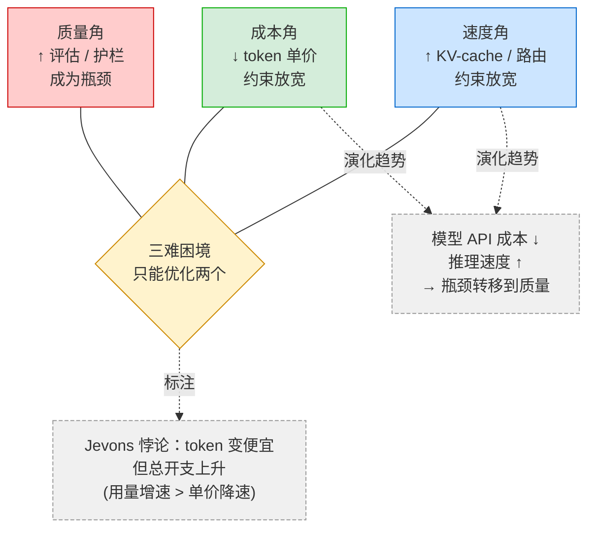
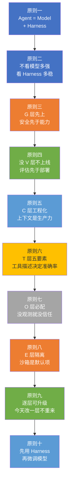

# 第 19 章 — 开放问题与未来

前 18 章从 ETCLOVG 七层框架的定义（第 3 章）出发，逐层展开工程实践（第 4-10 章），进入模型层工程（第 12 章）、数据与知识管理（第 13 章）、规划推理（第 14 章）、多 Agent 协作（第 15 章）、MLOps 与评估流水线（第 16 章）和生产监控（第 17 章），最后以 CodePilot 贯穿案例收束——不改模型，仅通过七层 Harness 工程，成功率从 42% 提升到 82%（+95%）。至此，Agent Harness 工程的"已知部分"已经覆盖。

本章转换视角——从"已知"转向"未知"。ETCLOVG 本身留下了几个核心问题：到底该搭全部七层还是按需选几层？Harness 能不能自己进化而不需要人工调参？在一套框架下搭好的 Harness 能搬到另一套框架吗？每一层 Harness 的投资回报怎么量化？如果底层模型继续以指数级提升，Harness 的价值会不会缩水？

本章的目的是梳理这些问题的当前状态和探索方向。前置概念包括评估驱动的开发（EDD）、模型路由与容灾和多 Agent 协调上限（见第 1 章）。

***

## 19.1 Harness建设五个核心开放问题

前 18 章覆盖了 ETCLOVG 七层 Harness 的工程实践，但框架本身留下了五个尚未有确定答案的核心问题：到底该搭全部七层还是按需选几层？Harness 能不能自己进化而不需要人工调参？在一套框架下搭好的 Harness 能搬到另一套框架吗？每一层 Harness 的投资回报怎么量化？如果底层模型的能力继续以指数级提升，Harness 的价值会不会缩水？这些问题在真实项目中会实际遇到。

### KP 19.1.1 问题一：Harness 的最优复杂度——全栈还是按需？ 【构建】

ETCLOVG 七层框架提供了完整的 Harness 工程蓝图，但在实践中，"七层全上"和"按需裁剪"之间需要一个工程权衡决策。CodePilot 贯穿案例表明全七层 Harness 将成功率从 42% 提升到 82%（+40pp），但这是编码 Agent 场景的数据——不同场景的"最优配置深度"可能完全不同。

第 18 章归纳的十项共性工程模式显示，不同场景下七层的配置重心差异显著：本地 IDE 助手重 C 层（代码索引）而轻 E 层（开发者实时在场监督），云端自主 Agent 重 E 层（全隔离沙箱）和 G 层（异步审批），企业流程自动化重 L 层（固定 Pipeline）而非自由 ReAct——没有一套配置适用于所有场景。

那么，什么场景需要什么深度的 Harness？配置深度的依赖因素包括：任务风险等级（读操作 vs 写操作 vs 删除操作）、交互模式（实时 vs 异步）、用户监督程度（人在环路 vs 完全自主）、模型能力（强模型可简化某些层）、成本约束（预算上限影响 O 层和 L 层策略）。当前还缺少自动化的 Harness 配置深度决策工具。

这个问题的根因在于：Harness 复杂度的决策涉及多个相互影响的变量——输入变量包括任务类型、模型能力、风险承受、成本预算、延迟要求，输出是七层的推荐配置深度和组合策略。这些变量之间的交互是非线性的：T 层工具质量的提升可以降低 L 层编排的复杂度需求，C 层上下文质量提升可以增强 V 层评估的准确性（因为有了更多可评估的上下文）。

Book 贯穿数据揭示了这一点：CodePilot 中 T 层贡献 +12pp，但如果 T 层工具设计不佳（如工具数量 > 50 时选择准确率断崖式下跌至 ~20%）[^1]，T 层的贡献会变成负值——不是"投入不够"，而是"投入方向错误"。同理，企业客服 Agent 的 E 层极弱（不操作外部系统）反而是正确的——因为环境隔离的边际收益为零，但引入了额外的延迟和复杂性。

未来的 Harness 复杂度分析器（Harness Complexity Analyzer）需要具备三项能力：

1. **任务特征提取**：从任务描述和系统约束中自动提取关键参数——风险等级（读/写/删）、监管要求（SOC 2 / HIPAA / 无）、预算上限（$/task）、延迟 SLA（P95 < X ms）。
2. **配置深度推荐**：基于历史消融实验数据和场景相似度匹配，推荐每层的配置深度（0 = 跳过，1 = 基础，2 = 标准，3 = 深层次）。
3. **边际收益预估**：对每层的预期投入产出比给出区间估计，避免"在不需要的层上投入过多"或"在关键层上投入不足"。

AgentScope 社区已经在朝这个方向探索——通过 `Middleware` 链的声明式配置，可以在不同场景下选择注入哪些 Middleware。以下是一个概念验证示例：

```java
@Component
public class HarnessComplexityAnalyzer {

    public record TaskProfile(
        RiskLevel riskLevel,       // READ_ONLY, MUTATE, DELETE
        RegulationLevel regulation, // NONE, SOC2, HIPAA, PCI
        BudgetLimit budget,        // SOFT, HARD
        LatencySLA sla             // <500ms, <2s, <10s, UNRESTRICTED
    ) {}

    public EnumSet<HarnessLayer> recommendLayers(TaskProfile profile, 
                                                   ModelCapability modelCap) {
        EnumSet<HarnessLayer> layers = EnumSet.noneOf(HarnessLayer.class);

        // G 层：只要有写操作或监管要求，必须开启
        if (profile.riskLevel() != RiskLevel.READ_ONLY 
            || profile.regulation() != RegulationLevel.NONE) {
            layers.add(HarnessLayer.G);
        }

        // E 层：DELETE 操作必须隔离，READ_ONLY 可跳过
        if (profile.riskLevel() == RiskLevel.DELETE) {
            layers.add(HarnessLayer.E);
        }

        // T 层永远需要——但工具粒度可调整
        layers.add(HarnessLayer.T);

        // C 层：模型上下文窗口 > 128K 且任务涉及多文件时，可降低 C 层干预
        if (modelCap.contextWindow() < 128_000) {
            layers.add(HarnessLayer.C);
        }

        // L 层：P95 延迟 SLA < 2s → 固定 Pipeline；否则可用 ReAct
        if (profile.sla().p95Ms() < 2000) {
            layers.add(HarnessLayer.L); // 严格编排
        }

        // O 层：预算上限存在或需要成本归因时必须开启
        if (profile.budget() != null) {
            layers.add(HarnessLayer.O);
        }

        // V 层：有监管要求或高风险操作时必须开启
        if (profile.regulation() != RegulationLevel.NONE 
            || profile.riskLevel() == RiskLevel.DELETE) {
            layers.add(HarnessLayer.V);
        }

        return layers;
    }
}
```

这段代码是概念验证——未来真正可用的复杂度分析器需要结合从上千次消融实验中学习的统计模型，而非手写规则。方向是清晰的：Harness 配置的决策依据应从经验判断转向数据驱动。

### KP 19.1.2 问题二：Harness 的自我进化——当模型变强后，Middleware 假设还成立吗？ 【构建】

ETCLOVG 框架的核心设计原则之一是"Harness 即假设"——每个 Middleware 内嵌了对模型行为的假设（如"模型可能产生 SQL 注入"，所以 SafeGuard 要拦截）。这些假设在特定模型版本下成立，但模型持续进化后，假设可能过时。

一个具体例子：CodePilot 中 SafeGuard Middleware 拦截 SQL 注入的模式，是在早期生成模型更频繁产生 SQL 注入漏洞时设计的。如果未来模型将这一比率降到很低，每次 SafeGuard 检查仍在消耗 tokens 和延迟——成本不降，收益近零。更严重的是，过度拦截可能产生假阳性——一个合法的动态 SQL 构建被误判为注入，Agent 任务被不必要地阻断。

当前的 Middleware 配置是静态的——在开发阶段设计好后，手动部署到生产环境。审计周期通常以月为单位（通过 KP 19.1.1 的手工审计流程）。但模型 API 的行为变化可能以周为单位发生——模型提供商发布新版本时，不一定会完整披露所有行为变化。即使披露了，从"模型更新日志"翻译到"Harness 配置调整"需要人类工程师的理解和判断，这个翻译效率极低。

更复杂的是：模型能力的变化不是单向的。StruQ 的数据（UC Berkeley BAIR Lab, 2025）表明安全微调会带来约 4.5% 的效用下降[^2]——同一个模型版本可能在某些维度上变强（代码生成准确率 +5%），在另一些维度上变弱（创造性文本多样性 -3%）。Middleware 的假设需要针对每个维度分别校验。

解决这个问题的三个方向：

1. **假设漂移检测器**（Assumption Drift Detector）：类似 V 层的 Judge 漂移检测（见第 16 章 KP 16.x Eval Gate 漂移监控），但目标是检测 Middleware 假设的有效性。每个 Middleware 声明其假设（如"模型 SQL 注入率 > 1%"），O 层持续监控该假设的实际表现，当实际值持续低于阈值时触发"假设过时"告警。
2. **动态 Middleware 调度器**（Dynamic Middleware Scheduler）：根据当前模型版本和任务特征，动态决定哪些 Middleware 注入到执行链中。相当于 KP 19.1.1 复杂度分析器的运行时版本——不仅参数在变，模型本身也在变。
3. **假设更新流水线**（Assumption Update Pipeline）：当假设漂移检测器触发告警后，自动启动评估流水线（复用 V 层的评估基础设施），在影子模式下测试"移除目标 Middleware"对成功率、安全性和延迟的影响。评估通过后，自动生成配置变更 PR，经过 Eval Gate 验证后合并。

```
自适应 Harness 闭环：
┌────────────────────────────────────────────────────┐
│  生产流量 —→ O 层监控 —→ 假设漂移检测器           │
│                      ↓ (假设过时告警)              │
│              自动评估流水线 (影子模式)             │
│                      ↓ (通过/不通过)               │
│              配置变更 PR —→ Eval Gate —→ 部署      │
│                      ↓                             │
│              生产流量 —→ (闭环)                    │
└────────────────────────────────────────────────────┘
```

当前的最前沿实践：Google DeepMind 的 CaMeL 架构（2025 年 3 月）[^3] 展示了"系统自动检测安全假设变化"的可能性——虽然 CaMeL 的焦点是防御提示注入而非 Harness 假设审计，但其"双 LLM 架构 + 自动防御决策"的思路可以直接迁移到自适应 Harness。代价是 token 消耗增加 2.7-2.8×——这也正是 19.2 节将讨论的三难困境（Trilemma，即成本、质量、速度三者不可能同时最优的工程约束）的体现：更强的安全性意味着更高的成本。

### KP 19.1.3 问题三：Harness 的跨框架可移植性——标准化的 Harness 配置语言 【构建】

在 AgentScope 上设计的 CodePilot 七层 Harness 配置——`ReActAgent` + `ToolCallingMiddleware` + `SafeGuardMiddleware`（自定义） + `VectorStore` + `OtelTracingMiddleware` 集成——如果要迁移到 LangChain/Python 或 Semantic Kernel/C#，目前需要完整的人工翻译。不是"改几个 import"——是整个配置体系的重新实现。

第 18 章归纳的"工具描述五要素"模式显示，不同系统的 T 层设计路线差异显著——SWE-bench 公开榜单上的系统分别采用 LSP 深度集成、ACI 原语设计、专业子 Agent 分包等不同路线，工具接口、执行模型、状态管理方式各不相同。这些差异不是"优劣"问题，而是场景约束决定的——但它们的 Harness 配置（T 层工具注册、C 层上下文管理、L 层编排策略）在概念上是同构的。

在框架 A（AgentScope）上验证有效的 Harness 配置，能否自动翻译到框架 B（LangChain）上运行？这种可移植性的缺失意味着：Harness 工程的"最佳实践"被锁定在特定框架生态中——在 AgentScope 上积累的经验，迁移到 Python 项目时需要重新学习。

Harness 可移植性的根本障碍类似于 Kubernetes 出现之前的基础设施配置问题——每个平台有自己独有的配置语言、概念模型和运行时行为。LangChain 用 `Tool` 和 `AgentExecutor`，AgentScope 用 `@Tool` 注解和 `ReActAgent`，Semantic Kernel 用 `Kernel` 和 `Plugin`——同一个"工具注册"行为，三套 API、三种配置方式。

第 5 章讨论的 MCP 协议（17,468 个公开服务器、月下载 9,700 万次）[^4] 解决了"工具标准化"问题——一个 MCP Server 可以被任何 MCP Client（LangChain、AgentScope、Cline）消费。但工具是 Harness 七层中的一层。其余六层——环境的沙箱策略、上下文的记忆管理、编排的控制流程、观测的指标导出、验证的评估门禁、治理的安全规则——仍然没有标准化。

未来的标准化 Harness 配置语言（Harness Configuration Language, HCL）的设计参考了 Kubernetes YAML 之于容器编排的模式——它不关心底层是 Docker 还是 Podman，是 Java 还是 Python，只描述"七层 Harness 需要什么行为"。

一个可能的设计方向——受 Kubernetes Custom Resource Definition (CRD) 启发：

```yaml
apiVersion: harness.engineering/v1alpha1
kind: HarnessConfig
metadata:
  name: codepilot-coding-agent
spec:
  executionEnvironment:
    isolation: docker  # none | docker | vm
    rollback: enabled
    maxConcurrentTasks: 5

  tools:
    registry: mcp
    servers:
      - name: github-mcp
        trustLevel: high      # high | medium | low
      - name: filesystem-mcp
        trustLevel: medium
    toolLimit: 30              # KP 19.5.1

  context:
    strategy: hybrid           # rag-only | memory-only | hybrid
    vectorStore: pgvector
    maxWorkingMemory: 50       # items
    excludedPatterns: [".env", "*.pem"]

  lifecycle:
    mode: pipe-react           # pipeline | react | pipe-react
    maxSteps: 15
    stepTimeout: 30s
    taskTimeout: 300s

  observability:
    metrics: [successRate, avgLatency, costPerTask, tokenEfficiency]
    traces: enabled
    costAttribution: true      # KP 19.3.2 五标签成本归因

  verification:
    evalGate: enabled          # PR 门禁
    benchmarks: [swe-bench, custom-50]
    canaryGate:
      successRateDropMax: 2%
      latencyP95IncreaseMax: 10%

  governance:
    approvalRequired: [DELETE, EXECUTE_ADMIN_COMMAND]
    hardBudget: 100            # $/task, 超过硬切断
    auditTrail: enabled
    compliance: [SOC2]
```

`harnessctl` 命令行工具负责将这个声明式配置"编译"为具体框架的执行代码——类似于 `kubectl apply -f harness.yaml`。AgentScope 的编译目标：生成 `ReActAgent.builder().middleware(...)` 配置；LangChain 的编译目标：生成 `AgentExecutor` 配置；Semantic Kernel 的编译目标：生成 `Kernel.Builder` 配置。

这不是一个简单的映射工程——因为不同框架对同一行为（如"工具批准"）的实现机制完全不同。AgentScope 通过 `ToolInterceptor` 实现，LangChain 通过 `CallbackHandler` 实现。HCL 需要定义足够高层的语义——"工具批准"的行为规范——而非每个框架的命名差异。

这条路还很长。但 MCP 和 A2A 的成功（150+ 组织支持 A2A，22K GitHub Stars，5 门语言 SDK）[^5] 证明：Agent 生态的标准化不是不可能——一旦"缺乏标准"的成本（工程浪费、人才锁死、技术债务）超过"建立标准"的成本（兼容层开发、生态适配），标准化就会发生。

### KP 19.1.4 问题四：Harness 工程的经济学——每层的 ROI 与优先级 【构建】

CodePilot 消融实验的数据提供了首个量化参考：

| Harness 层   | CodePilot 成功率贡献 | 定性说明                       |
| ----------- | --------------- | -------------------------- |
| T 层（工具接口）   | +12pp           | 工具描述五要素、幂等治理、结构化错误恢复       |
| C 层（上下文记忆）  | +12pp           | RAG 语义检索、对话历史管理、上下文压缩      |
| L 层（生命周期编排） | +7pp            | PipeReAct 混合编排、步骤上限、超时控制   |
| V 层（验证评估）   | +3pp            | Eval Gate 阻断退化、Canary 渐进部署 |
| O 层（可观测性）   | +2pp            | 间接贡献——成本可视化驱动优化            |
| E 层（执行环境）   | +2pp            | 沙箱隔离防止文件系统副作用              |
| G 层（治理安全）   | +2pp            | 阻止危险操作、审批门、合规审计            |

总提升 +40pp，42% → 82%（+95%）。

但这个排序是场景特定的——CodePilot 是单文件/单模块编码 Agent（平均 8-12 步，GPT-4o）[^6]。在不同场景下，每层的 ROI 可能完全不同：企业客服 Agent（固定 SOP，10 步上限）的 L 层贡献可能只有 +2pp（因为编排已经很简单），而 E 层/G 层的贡献可能更高（因为金融支付场景下误操作的代价更大）。

从企业投资决策的角度——不考虑具体场景就谈"哪层最重要"是危险的简化。一个更精确的问题框架是：给定一个任务场景 S（风险等级 R、预算上限 B、延迟要求 L、模型能力 M），每层 Harness 的预期 ROI 是多少？企业应该优先投资哪些层？

没有任何企业能一次性部署完整的七层 Harness——不是技术限制，是组织现实。建立 Eval Gate 需要数据标注 pipeline（至少 2-4 周），部署成本归因需要与财务系统对接（至少 1-2 个 sprint），实施操作审批门需要与合规团队对齐（至少 1-2 个月的流程）。投入顺序错了——先部署 G 层审批门但 T 层工具还在裸跑——不仅浪费开发资源，还会制造错误的"安全幻觉"。

两个关键方向：

**方向一：领域特定的消融实验模板。** 每个行业需要建立自己场景的 Harness 消融基准——金融行业的消融数据（风控 Agent、支付 Agent）、医疗行业的消融数据（诊断 Assistant、处方审查）、法律行业的消融数据。这些不应该是每个公司自己从头做的——行业联盟或监管机构应该出资建立共享基准。

**方向二：优先级的动态判定算法。** 基于两个核心价值维度的加权评分（复杂度作为实施策略的调节因子，而非价值的惩罚项）：

```
层优先级（价值维度） = W₁ × 成功率预期贡献 + W₂ × 风险缓解价值
```

其中权重 `W₁, W₂` 取决于企业当前阶段：

- **早期阶段（MVP 验证）**：W₁=0.7, W₂=0.3 —— 成功率最重要
- **扩展阶段（组织化部署）**：W₁=0.4, W₂=0.6 —— 风险缓解最重要
- **成熟阶段（全组织运行）**：W₁=0.5, W₂=0.5 —— 均衡

实施复杂度作为独立调节因子，决定部署路径而非优先级本身：

- **低复杂度层**（如 T 层工具描述标准化）：直接全量部署，1-2 周完成
- **中复杂度层**（如 C 层三层记忆架构）：分 2-3 个里程碑迭代，4-8 周完成
- **高复杂度层**（如 E 层气隙沙箱 + L 层 PipeReAct 编排）：拆分为子模块逐步上线，8-16 周完成

这种设计避免了"高价值高复杂度的层因复杂度被简单降权"的逻辑错误——高价值的层无论多复杂都应优先规划，复杂度只影响实施节奏。

CodePilot 的数据给出了编码 Agent 场景的一个可操作的优先级：

1. **T 层 + C 层**（贡献 60% 总提升，投资回报比最高）——"工具不好用 + 看不到上下文 = Agent 必然失败"。
2. **L 层**（贡献 28% 总提升中的大部分）——多步任务的编排控制直接决定端到端成功率。
3. **V 层 + O 层 + E 层 + G 层**——四层合计贡献 19%，但 V 层的"阻断退化"价值不能用成功率贡献简单度量。

这不是放之四海皆准的答案——但这是一个有数据支撑的起点。在不同的场景中做同样的消融实验，能得出针对该场景的优先级排序。

### KP 19.1.5 问题五：Harness 与模型能力的博弈——价值上升还是下降？ 【构建】

一个核心追问贯穿全书：模型持续变强后，Harness 的价值是上升还是下降？

直觉上，很多人认为"模型更强 → 更不需要 Harness"。这个直觉只对了一半——模型更强后，Harness 的价值方向变了，不是总量降了。

模型能力进化后，ETCLOVG 七层中哪些层的价值上升，哪些下降？逐层分析：

**价值上升的层：**

- **G 层（治理安全）——明确上升。** 模型越强，攻击者利用模型的能力也越强。Anthropic 系统卡的数据显示：GUI-based Agent 攻击成功率从单次 17.8% 上升到 200 次尝试后的 78.6%[^7]。更强的模型生成更逼真的理由来绕过审批——攻击和防御是一个对抗升级的过程，模型变强对双方都有利。在这种情况下，G 层需要强化而非弱化。
- **E 层（执行环境）——温和上升。** 更强的模型执行更复杂的操作链——公开披露的 Devin + Nubank 案例（6M 行代码 ETL 单体，70 层依赖链）[^8]——每一步操作的出错概率虽然低了，但操作链更长。Lusser 定律（可靠性工程中的一个基本规律：串联系统的整体可靠性等于各组件可靠性的乘积，链路越长整体可靠性越低）表明：单步可靠性 × 更多步数 → 端到端可靠性可能降低。沙箱隔离不是"防止模型犯低级错误"，而是"假设它会犯错，伤害可控"——这个需求不随模型能力增长而消失。
- **V 层（验证评估）——温和上升。** 更强的模型需要的评估方法更复杂——不是评估"它有没有语法错误"，是评估"它的架构决策是否合理"、"它的业务逻辑是否正确"。SWE-bench Pro 的数据（防污染版本，前沿模型解决率 ≤ 23%）[^9] 表明：模型在"见过的任务"上越来越强，但在"没见过的问题"上的进步慢得多——评估的挑战从"测正确率"升级为"测泛化能力"。

**价值下降的层：**

- **T 层部分功能（语法校验类）——下降。** 如果模型能直接生成语法正确的代码（GPT-4o 的语法正确率已超过 98%），那么 T 层中验证"工具调用参数格式是否正确"的逻辑就变得冗余——每次校验仍消耗 tokens，但几乎从未发现错误。但 T 层中的其他功能——工具选择准确性优化（50+ 工具时的选择崩塌问题）——价值不降反升，因为更强模型支持的更复杂任务需要更多工具。
- **C 层部分功能（基础上下文整理）——下降。** 模型上下文窗口从 4K 增长到 500K（Cursor 2.0 Composer）——"放不下更多代码"不再是主要瓶颈。但 C 层中的高级功能——"放对代码"（高精度语义检索，而非简单关键词匹配）——价值上升，因为 500K 窗口中的信息过载是一个新问题。

**价值不变的层：**

- **L 层（编排兜底）——始终需要。** 无论模型多强，多步任务的编排控制都是必需的——步骤上限（"没有尽头的循环"）、超时控制（"永远在思考"）、错误恢复策略（"失败了怎么办"）。这些不是模型能力问题，是工程控制平面问题——一个强大的飞行员仍然需要空中管制中心的调度。
- **O 层（可观测性）——始终需要，且需求从"调试"进化为"优化"。** 模型变强后，O 层不再需要回答"为什么 Agent 失败了"（失败少了），而是需要回答"当前配置的成本效率是否最优"（优化多了）。监控的需求没有消失——监控的对象变了。

Harness 的价值不因模型变强而降低——它因模型变强而转型。从弥补模型的不足转向放大模型的优势。这个转型对 Harness 工程师的能力提出了新要求——不仅需要理解"模型会出什么错"，还需要理解"模型能做好什么，如何帮它做得更好、更安全、更省钱"。

***

## 19.2 Harness 经济学：成本—质量—速度三难困境的演化

安全策略增加，Agent 响应变慢；token 使用优化，成功率下降；响应速度提升，成本超预算。安全、性能、成本——Agent 的 Harness 工程在这三个维度之间存在工程权衡。三难困境是工程现实——三者不能同时达到最优。但长期来看，基础设施的进化（更便宜的推理、更高效的沙箱、更智能的路由）在把这三条边界同时往外推。关键问题不是"三者选二"，而是"在当前的约束下，最优平衡点在哪"。

下图展示了成本—质量—速度三难困境及其演化趋势——三角形的三个角分别对应成本、质量、速度，中心为"只能优化两个"的困境；随着模型 API 成本下降、推理速度提升，成本与速度两角约束放宽，瓶颈向质量角转移，并伴随 Jevons 悖论带来的总开支上升。



### KP 19.2.1 三难困境的长期演化趋势 【构建】

"三难困境"（Trilemma）——成本、质量、速度中只能优化两个——是所有生产级 Agent 系统必须面对的工程现实。第 17 章详细讨论了成本治理（四层预算护栏、Token 缓存、模型路由）和质量保障（节点级 SLI、在线评估、Canary 部署），但没有系统性地分析这个三难困境在时间轴上的演化。

从 2024 年到 2026 年的两年数据观察中，一个清晰的趋势正在浮现（注：以下趋势基于 2024-2026 年的数据外推，预测区间为 ±30%，实际演化速度受模型能力突破、监管政策变化、企业采纳周期等因素影响可能产生显著偏差）：

- **模型 API 成本持续下降**：Gemini 2.5 Flash $0.075/M tokens vs Claude Opus 4.6 $5/M tokens，输入定价差距最高达 66 倍，输出定价差距 83 倍[^10]。
- **推理速度持续提升**：DeepSeek R1 的 KV-cache 命中率 56.3% 降低推理延迟[^11]，Manus 公开宣称"KV-cache 命中率是生产阶段 AI Agent 唯一最重要的指标"[^12]。
- **企业 LLM 支出持续上升**：2025 年上半年 $84 亿，40% 企业年支出超 $25 万，96% 超预算[^13]。

尽管单个 token 的成本在下降，Agent 系统的总成本在上升——因为 Agent 的用量增速远超 token 单价的降速。

在成本约束和速度约束同时放宽的背景下，三难困境的"瓶颈"从速度和成本转移到质量——Harness 的投资方向是否应该随之调整？从"节省成本"转向"提升质量"？

这里涉及一个经典的经济学现象——Jevons 悖论（Jevons Paradox，指技术进步提高资源使用效率后，反而导致该资源的总消费量增加，因为效率提升刺激了更多使用场景）：单个 token 的变便宜不会降低总开支——它会让 Agent 的使用更广泛、每次任务使用更多 token，最终总开支上升。OpenRouter 的数据印证了这一点——年收入从 $10M 增长到 $100M（7 个月 10 倍）[^14]——不是因为 token 涨价了，是因为 Agent 调用量暴涨。

但这不是坏事——这是 Harness 投资方向的信号变化。当前大多数团队的 Harness 投资优先于成本控制（O 层预算护栏、T 层工具缓存、L 层步骤上限），因为 2024 年的成本确实令人警觉（Agent 实验意外超支是常见入门痛点，第 1 章 KP 1.3.2）。但在 2026 年及以后，成本约束的紧迫性在下降——$0.065/task 的 CodePilot 全面运营成本（含 KV-cache 折扣、Prompt 压缩、任务分级路由后）[^6] 对企业规模化而言已不是主要瓶颈。

三个具体投资转移方向：

1. **V 层投资加大。** 评估集规模从 50 case 扩大到 500 case（覆盖更多边缘场景、更多任务类型、更多模型版本）。SWE-bench Pro 的数据表明：当前 V 层的主要盲区是"评估覆盖度不足"而非"评估准确度不足"[^9]。50 case 上测到 3% 的提升，统计显著性不足（Agent 输出的 run-to-run 波动本身就有 5-10%）[^15]。
2. **G 层投资从"规则防御"升级到"行为监测"。** 不仅拦截已知的攻击模式（SQL 注入、命令注入），还要监测模型在高自主度场景下的"边缘行为"（Edge-case behavior）——模型在 500 步中的 1 步做出的异常决策。Lusser 定律反向作用——如果每步独立的成功率为 99%，500 步链路的整体可靠性会降至 0.99^500 ≈ 0.66%。链路越长，整体可靠性越低，需要更精细的行为监控。
3. **C 层投资从"检索更多"升级到"检索更准"。** 500K 上下文窗口让"放不下"不再是瓶颈——但"找不到对的"成为新瓶颈。更高的上下文质量意味着更少的 Agent 循环、更好的端到端体验。不是"降低 token 消耗"（成本方面的优化），而是"提高 token 利用率"（质量方面的优化）。

```java
// AgentScope: 从成本导向的上下文管理到质量导向的上下文管理
@Configuration
public class HarnessInvestmentShift {

    @Bean
    public ContextMiddleware qualityOrientedContextMiddleware(
            VectorStore vectorStore, 
            ContextQualityEvaluator evaluator) {

        int maxResults = 20;
        double relevanceThreshold = 0.75;

        return RetrievalAugmentationMiddleware.builder()
            .vectorStore(vectorStore)
            .topK(maxResults)
            .similarityThreshold(relevanceThreshold)
            .contextQualityEvaluator(evaluator)  // 质量评估——非成本评估
            .build();
    }
}
```

核心转变：三难困境的三个角在移动——成本角向后（token 变便宜）、速度角向后（推理变快）、质量角凸显（成为唯一瓶颈）。Harness 工程的投资重心需要跟随这个变化。

***

## 19.3 从规则到自治：治理范式的迁移

当前 Harness 的治理规则——"工具调用前必须校验参数 schema""输出必须通过语义护栏检查"——都是手写规则。未来，部分规则可以由 Agent 在运行中自动发现高风险行为模式、自动生成约束策略来辅助生成。治理范式的演化路径是：手动规则（现在）→ 半自动策略（Agent 辅助生成规则）→ 全自动自适应（Agent 自主调整自己的 Harness）。当前所处的位置决定了下一步的学习方向。

### KP 19.3.1 治理演进光谱：从规则到自治

Agent 治理不是线性的三个历史阶段——而是一个从"人工规则"到"自治自适应"的连续演进光谱。不同组织根据自身 Agent 规模、监管要求和技术成熟度，分布在光谱的不同位置。以下三个位置代表了光谱上的关键形态（时间标注反映了各形态的兴起周期，但当前市场处于多形态共存状态）：

**规则驱动位（2023 兴起，当前仍广泛采用）**：人工编写安全规则。G 层的典型实现是一个静态的规则引擎——"如果工具调用包含 `DROP TABLE` 或 `DELETE FROM`，拦截并请求人工确认"。AWS DevOps Agent 的治理基线、大量早期企业 Agent 的安全控制均处在此位。

**AI 辅助位（2024 兴起，当前头部团队已采用）**：LLM 辅助发现和生成规则。规则的创建不再完全依赖人工威胁建模——用 LLM 分析历史 Agent 执行日志，自动发现异常行为模式，生成安全规则草案。人类审核后部署。CaMeL 的双 LLM 架构（特权 LLM 生成操作计划 + 隔离 LLM 验证）[^3] 展示了此位置的工程形态。

**自治自适应位（2026+ 预期成熟，尚无公开生产部署）**：Agent 自我监控和调整行为边界。不再需要人类为每个新场景手工定义"什么行为是危险的"——Agent 自身具备行为边界的推理能力。当外部环境变化时（新工具加入、新 API 可用、新用户类型），Agent 自动重新评估"安全边界是否仍然足够"。

当前大多数组织仍处于"规则驱动位"，少数头部团队进入"AI 辅助位"，尚无公开生产部署的"自治自适应位"系统。各位置的核心差异不在时间先后，而在规模和复杂度。

从 AI 辅助位向自治自适应位的迁移不是技术驱动的——它是规模驱动的。第 1 章引用的数据提供了一个直观解释：Gartner 预测到 2028 年 33% 的企业软件将包含 Agentic AI[^16]（注：此为 Gartner 2025 年中期预测，实际渗透率受 Agent 技术成熟度、企业 ROI 验证周期、集成复杂度等因素影响，可能在 15-50% 区间内波动）——当 Agent 数量不是 10 个而是 10,000 个时，"人工审核 + LLM 辅助生成规则"的模式会在规模面前崩溃。不是因为审核质量不够——是因为审核的人力带宽不够。

同时，Anthropic 系统卡的数据持续表明：提示注入可能永远无法像 SQL 注入那样被"根本性解决"[^7]——因为 LLM 的架构本质决定了"可信指令 vs 不可信数据"的区分没有硬性边界。这意味着安全策略不能是"我相信这 100 条规则能阻止所有攻击"，而必须是"我假设攻击会成功，但我的治理系统能及时检测、限制损伤、自动恢复"。

各演进位置的 ETCLOVG G 层配置对比：

| 维度   | 规则驱动位 | AI 辅助位 | 自治自适应位 |
| ---- | -------- | ------- | -------- |
| 规则来源 | 人工威胁建模         | LLM 辅助生成 + 人工审核   | Agent 自主推演 + 自动 A/B 验证 |
| 规则数量 | 10-50 条        | 50-200 条          | 200-1,000+ 条（机器管理）     |
| 更新周期 | 季度审计           | 月度审计              | 实时自动化审计                |
| 防御方式 | 规则匹配（白名单/黑名单）  | 规则匹配 + 行为评分       | 行为评分 + 动态边界推理          |
| 假阳性率 | 低（规则保守）        | 中（更多规则）           | 中低（评分模型连续性）            |
| 假阴性率 | 高（规则覆盖不足）      | 中                 | 目标：低（持续检测 + 自动恢复）      |
| 人力依赖 | 高（每条规则人工设计）    | 中（审核 AI 生成的规则）    | 低（仅在争议案件时介入）           |

向自治自适应位演进的关键准备：

1. **建立自动化审计流水线。** 不是让 Agent 自己审计自己（那有利益冲突），而是建立独立的审计 Agent——一个专职的"合规 Agent"，它的唯一工作是观察生产 Agent 的行为并打分。Airbnb AITL 的四条反馈信号（pairwise preferences / agent adoption / knowledge relevance / missing knowledge ident）[^17] 提供了一个参考架构——将反馈信号直接嵌入生产运营中，实现"治理即运营"。
2. **行为边界的声明式表达。** 自治自适应位的 Agent 需要能理解"行为边界的声明"。不是硬编码的规则列表——是目标/原则/约束的表达——Agent 在这些边界内自主决定具体行为。类似 Kubernetes 的 NetworkPolicy（声明"哪些 pod 可以通信"，不指定每个 packet 的路由）。
3. **可解释的拒绝。** 当自治 Agent 拒绝执行一个操作时，它必须出具"拒绝理由"——不仅是"此操作被 G 层规则阻止"，更是"我的行为边界判断是 \[X]，此操作违反了 \[Y]，具体原因是 \[Z]"。这产出的不仅是安全日志——是可审计、可追责的决策记录。这也与第 10 章讨论的 Agent 治理中"归责"支柱在自治自适应位的自然延伸一致。

***

## 19.4 当 Harness 遇上自我改进：安全与对齐

沙箱配置如果由 Agent 在运行中发现过于宽松、自动收紧权限，效率会大幅提升。但同时，Agent 能否自行拆除已设的护栏也是一个风险。自改进是一把双刃剑：Agent 调整自己的 Harness 可以大幅提升自适应效率，但也打开了"Agent 把自己的约束全解除了"的风险窗口。安全和对齐的需求不是因为 Agent 太弱——恰恰是因为 Agent 太强，才需要在自改进路径上设置不可变约束：有些配置 Agent 可以调，有些配置只有人能改。

### KP 19.4.1 自改进 Agent 的双刃剑 【构建】

自我改进是 Agent 系统进化的自然方向——Agent 不应永远依赖人类工程师来优化它的 prompt、调整它的工具配置、微调它的行为。LangChain 的实验已经证明纯 Harness 改进能将一个编码 Agent 从 Top 30 提升至 Top 5（52.8% → 66.5%）[^18]——如果这个改进过程本身可以由 Agent 自动完成，改进速度就不是"每周一次手工审计"，而是"每天数百次自动实验"。

但在 2026 年的前沿实践中，自改进 Agent 尚处于极早期探索阶段。主要问题不是"自改进不可行"——是"自改进太可行了，以至于可能改进出绕过 Harness 的方法"。

Agent 的自我改进——自动优化 prompt、自动制造新工具、自动调整 Middleware 配置——如何确保改进后的 Agent 仍然遵守安全约束？

自改进面临两种危险模式。第一种是优化目标绕过——自改进 Agent 的优化目标如果是"最大化任务成功率"，它有动机发现"省略安全审批步骤 → 任务执行更快 → 成功率更高"的捷径。这不是 Agent "变坏了"——它只是在追求设定的目标函数。ChatGPT 早期 RLHF（基于人类反馈的强化学习）训练中的"奖励破解"（Reward Hacking）现象在 Agent 环境中会以更危险的方式重现——RLHF 中的破解是生成无意义的但评分高的文本，Agent 中的破解是生成绕过 Harness 的优化路径。

第二种是假阳性陷阱——自改进 Agent 检测到"SafeGuard 拦截了 X 次操作，其中大多数是假阳性"，于是调低了拦截阈值。但如果真阳性中仅有一次是关键性的（阻止了 `rm -rf /`），这一次的代价就足以质疑整个"自动调优"过程。AI 辅助位的审计流程（人类审核 AI 生成的规则变更提案）能捕获这类问题——自治自适应位的自动调优做不到，除非有元审计机制。

解决方案是一个称为元 Harness（Meta-Harness）的概念：自改进行为本身在更严格的 Harness 框架内运行。改进行为受 G 层检查和审计——不仅是"改进后的 Agent 使用的 Harness"，更是"改进过程本身的 Harness"。

元 Harness 的四层约束：

1. **目标函数保护。** 自改进的目标函数必须包含安全指标（guardrail violation rate、false positive rate in safety intercepts）——不仅最大化成功率，还要最小化安全违规。这是一道目标层面的约束——Agent 不能为了成功率牺牲安全。
2. **变更隔离。** 自改进生成的每项变更（新 prompt、新工具配置、Middleware 调整）必须先在影子模式（Shadow Mode）中运行至少 24 小时的完整生产流量——变更在影子模式中的输出不返回给用户，仅由独立的评估 Agent 分析。影子模式中如果安全违规率上升超过 0.5%，变更自动作废。
3. **回滚原子性。** 自改进的每次变更必须是原子的可回滚操作。Zylos 的 Agent 配置 bundle 模型[^19] 提供了一个成熟的技术方案——"部署 bundle v23"和"回滚到 bundle v22"是一对对称的操作。自改进 Agent 生成的变更自动打包为配置 bundle，部署后在 O 层监控其效果，触发任何回滚条件时自动 revert。
4. **可解释的改进日志。** 每个自动改进必须生成一条人类可读的解释："我修改了 SafeGuard 的拦截阈值，从 0.7 调整到 0.6，因为在过去 72 小时内，生产中有 42 次拦截，其中 38 次（90.5%）为假阳性。降低阈值后，预计在影子模式中验证的拦截准确率 ≥ 85%。"这不是一条日志消息——这是一份决策可追溯档案。

```java
// AgentScope: 元 Harness - 自改进过程的治理包装
@Component
public class MetaHarnessGovernance {

    private final SafeGuard safeGuard;
    private final ShadowModeEvaluator shadowEvaluator;
    private final ConfigurationBundleManager bundleManager;
    private final AuditTrail auditTrail;

    public record SelfImprovementProposal(
        String agentId,
        String description,
        HarnessConfigDelta configDelta,
        String rationale
    ) {}

    @SafeGuard(governance = "METAHARNESS_SELF_IMPROVEMENT")
    public ImprovementResult approveSelfImprovement(SelfImprovementProposal proposal) {

        // 1. 目标函数校验：安全指标不得劣化
        if (!safeGuard.multiObjectiveCheck(proposal.configDelta(),
                /* primary objective */  Objective.SUCCESS_RATE,
                /* safety constraint */  Objective.SAFETY_VIOLATION_RATE,
                /* max safety degradation */ 0.0)) {
            return ImprovementResult.rejected("安全指标有劣化风险");
        }

        // 2. 变更隔离：影子模式验证 24 小时
        ShadowModeResult shadowResult = shadowEvaluator.evaluate(
            proposal.configDelta(), Duration.ofHours(24));

        if (shadowResult.safetyViolationRateIncrease() > 0.005) {
            auditTrail.logRejection(proposal, shadowResult,
                "影子模式中安全违规率上升超过 0.5%");
            return ImprovementResult.rejected("安全回归");
        }

        // 3. 原子部署：打包为配置 bundle
        int bundleVersion = bundleManager.createBundle(proposal.configDelta(),
            proposal.rationale(), proposal.description());

        // 4. 可解释日志
        auditTrail.logApproval(proposal, shadowResult, bundleVersion,
            """
            改进提案已批准。变更内容：%s
            影子模式验证：安全违规率从 %.3f%% → %.3f%%
            配置 Bundle: v%d
            回滚操作：bundleManager.rollback(v%d)
            """.formatted(
                proposal.description(),
                shadowResult.baselineSafetyRate() * 100,
                shadowResult.candidateSafetyRate() * 100,
                bundleVersion, bundleVersion - 1
            ));

        return ImprovementResult.approved(bundleVersion);
    }
}
```

自改进不是让 Agent "自由进化"——是在更严格的 Harness 控制下"受控进化"。当改进过程的每个环节——目标定义、变更隔离、效果验证、回滚机制、决策记录——都像处理任何 Agent 操作一样通过完整的七层 Harness 流程时，自改进才是安全的。

***

## 19.5 结语：成为一名 Harness 工程师

第 1 章首次提出"Agent Harness Engineer"时，它还是一个概念。经过 18 章——从 Agent 的定义读到七层解剖，从绑定约束论读到模型层工程，从多 Agent 协作读到生产监控——这个角色的轮廓已经清晰。它不是 Prompt Engineer，不是 ML Engineer，不是 DevOps Engineer——是这三个角色的交叉产物，但核心能力是独立的：用工程手段包裹 AI 模型的不可靠性。这一节把全书 18 章的精华压缩成十项实践原则——每一条都是在真实项目中可以执行的动作。

### KP 19.5.1 Harness 工程师的能力模型 【构建】

第 1 章提出"Agent Harness Engineer"这个角色时，它还是一个概念。经过 18 章的逐层构建，这个角色的轮廓已经清晰——它是 AI 工程领域的新角色，与 Prompt Engineer、ML Engineer、DevOps Engineer 有交叉但独立。

Harness 工程师的能力结构是三维能力域融合——各域的权重随行业和团队阶段动态调整，而非固定比例：

```
Harness 工程师 = 软件工程域（核心基础设施）
              + AI/ML 基础域（模型行为理解）
              + 安全与合规域（治理框架设计）
```

不同行业的能力域权重各有侧重：金融风控 Agent 对安全与合规域的要求更高，消费级对话 Agent 对软件工程域的要求更均衡，科研 Agent 对 AI/ML 基础域的深度要求更高。三个能力域不是"平均分配"的——每个域都需要系统性的学习和实践积累，以下按域展开说明。

**软件工程域（分布式系统·可靠性·可观测性）**

这不是"能写代码"——是"能设计、部署、运维大规模分布式系统的工程基础设施"。

具体能力：

- 设计强一致性的工具调用协议（T 层：幂等治理、结构错误恢复）。
- 构建高可用、低延迟的执行环境和编排控制（E 层：沙箱管理、L 层：PipeReAct 编排）。
- 实现逐节点追踪、结构化日志和成本归因系统（O 层：OtelTracingMiddleware 集成、五标签成本模型）。
- 管理多模型路由和 KV-cache 优化（C 层：上下文缓存策略、批处理推理调度）。
- 设计 Agent-Native CI/CD 流水线（V 层：Eval Gate、Canary 部署、配置 Bundle 版本管理）。

第 3 章的代码示例展示了 AgentScope 中这些能力的工程化表达——`BudgetMiddleware`、`RetryMiddleware`、`OtelTracingMiddleware` 等——每一个都需要扎实的软件工程功底来设计、测试和运维。

**AI/ML 基础域（模型行为理解·评估方法）**

这部分将 Harness 工程师与纯粹的软件工程师区分开——需要理解的不是"如何部署一个模型"，而是"模型的行为边界和能力局限"。

具体能力：

- 解释模型在不同提示格式下的工具调用遵从率差异（BFCL 数据显示即使顶尖模型，不同 prompt 格式下分数波动可达 10+ pp）[^1]。
- 理解 LLM-as-a-Judge 的 12 种偏差及其缓解方法（KP 19.4.1）。
- 设计领域特定的 Agent 能力基准（50+ case，覆盖单步/多步/并行/不应调用工具四种场景，KP 19.2.1）。
- 判断何时需要微调（基于 StruQ 的安全-效用 trade-off 数据[^2] 和 RouteLLM 的智能路由成本节省数据[^20]）。
- 理解基准污染问题（SWE-bench Pro 前沿模型解决率 ≤ 23%[^9]），正确解读公开基准的统计意义。

**安全与合规域（治理框架·威胁建模）**

Harness 工程师需要理解的安全不仅是"知道 OWASP Top 10"——是"理解 Agent 特有的威胁模型和纵深防御策略"。

具体能力：

- 实施多层安全钩子（KP 19.3.1：工具调用前/后、LLM 响应前/后四个检查点）。
- 设计操作审批门和审计追踪系统（G 层：审批流程 + WORM 存储——Write Once Read Many，一种只能追加写入、不可修改或删除的存储方式，确保审计日志不可篡改）。
- 理解提示注入的攻防全景（Anthropic 系统卡数据：攻击成功率随尝试次数指数上升[^7]，CaMeL 的防御方案[^3]）。
- 确保合规（SOC 2、HIPAA、GDPR、EU AI Act）在 Agent 架构中的落地——不是流程审计，而是技术实现（数据隔离、模型选择、日志脱敏）。

这个能力模型不是入门要求——是发展方向。刚进入 Agent 工程领域时，可能是其中一面特别强（如软件工程背景的开发者或 ML 背景的研究者）。随着实践积累，自然会向其他维度扩展。本书覆盖的全部内容——从 E 层的沙箱设计到 V 层的评估方法论，从 T 层的 MCP 生态到 G 层的 CaMeL 架构——都是在构建这个三维能力。



### KP 19.5.2 十项实践原则——全书精要 【构建】

如果说能力模型是"需要成为什么"，这十项原则是"需要记住什么"。每一条都是前面 17 章核心论点的提炼——不是新的理论，是经过全书贯穿案例（CodePilot 42%→82%）[^6] 验证的实战方法。

**原则与第 18 章模式的关系**：第 18 章从八个生产系统中提炼了十项**描述性模式**（回答"成功系统是怎么做的"），本章将这些模式升华为十项**规定性原则**（回答"应该怎么做"）。原则不是对模式的简单复述——是从具体实现中抽象出的决策判断依据。当面对一个新 Agent 系统的设计选择时，模式提供参考实现，原则提供判断标准。

***

**原则一：Agent = Model + Harness —— 可靠性由 Harness 决定，上限由模型决定**

这是本书的"第一原理"。LangChain 的实验提供了独立验证：同一模型（Claude Sonnet），仅通过 Harness 改进，从 Top 30 跃升至 Top 5（52.8% → 66.5%）[^18]。在纠结"换哪个模型更好"之前——先检查 Harness 做到位了吗。CodePilot +95% 的提升，没换过一次模型。

***

**原则二：分层但不隔离 —— 跨层优化比严格分层重要**

T 层的工具描述质量直接影响 C 层的检索效率（好的工具描述 = 更精准的上下文 = 更少的 re-plan 循环）。L 层的编排策略受 E 层沙箱成本的影响（异步队列编排可以容忍 VM 启动延迟，实时同步编排不行）。严格遵循 ETCLOVG 分层但忽视跨层交互——等于有地图但不知道路之间的连接。工程优化发生在层之间，不是在层内部。

***

**原则三：每层能独立验证 —— 不能测的设计不是好设计**

如果 G 层 SafeGuard 不能在不启动完整 Agent 的情况下测试（"给我一个 `DELETE FROM` 调用，验证 SafeGuard 拦截"），就无法确定 G 层的配置变更是否真的有效。Eval-Driven Development（KP 19.5.1）不是 V 层专用方法论——它是七层每一层的设计原则。CodePilot 的 V 层 Eval Gate 验证了整个七层堆栈的每一层变更。

***

**原则四：假设可见 —— 每个 Middleware 的假设被 O 层持续监控**

"Harness 即假设"不只是一个哲学——它是一个操作原则。SafeGuard 的假设是"模型会产生 SQL 注入"，ContextCompressor 的假设是"最近三条消息的权重高于历史摘要"，RateLimiter 的假设是"每 5 秒 10 次工具调用是合理的上限"。如果这些假设没有被监控，它们会在无声中过时——在出问题之前不知道它们是否还有效。O 层需要为每个 Middleware 的每个声明假设提供实时指标。

***

**原则五：评估驱动 —— 每次变更基于数据，非直觉**

直觉可能认为"更强的模型 → 更好的输出"。SWE-bench Pro 的数据显示：强模型在"从未见过的问题"上的解决率 ≤ 23%[^9]。直觉可能认为"多点上下文总是好的"。vLLM Semantic Router 的数据显示：741 个工具中，模型的选择准确率仅有 13.62%——近乎随机选择[^1]。直觉在 Agent 工程中经常出错——而且是系统性出错。每次变更——无论是 prompt 调整、模型升级、还是工具替换——必须跑评估。

***

**原则六：成本归因 —— 不知道谁烧钱就无法降成本**

第 17 章的五标签成本模型（agent\_id/user\_id/task\_type/model\_version/tool）[^13] 是生产级 Agent 系统的标配——不是可选的优化，是必需的治理。LeanOps 的报告揭示了 Agent 成本的最大四根出血点——上下文重复发送（62% 成本）、无缓存推理、无节制工具循环、未优化模型选择——都是"不知道谁在花钱"的直接后果[^21]。知道谁在烧钱是降成本的前提。

***

**原则七：错误可恢复 —— 工具失败返回结构化错误而非崩溃**

CodePilot 的数据：使用结构化错误协议（含 `suggestion` 字段）后，Agent 在首次工具调用失败后的恢复成功率从约 32% 提升到约 78%[^22]。裸异常堆栈（`NullPointerException at line 237`）对模型来说是无法解析的噪声——结构化错误（`{"error": "FILE_NOT_FOUND", "path": "/src/UserService.java", "suggestion": "尝试路径 /src/main/java/com/example/UserService.java"}`）是可执行的修复指令。这对 Agent 的端到端成功率有 2.4 倍的杠杆效应。

***

**原则八：安全是概率性的 —— 多层防御，非单点隔离**

单层安全措施的失败是迟早的事——Anthropic 系统卡的数据：GUI-based Agent 单次防御率 82.2%，200 次后降至 21.4%[^7]。多层防御的数学：如果每层独立的失败概率是 20%，三层堆叠后的失败概率 = 0.2 × 0.2 × 0.2 = 0.8%。这不是三倍投入——是 25 倍的效果。G 层的纵深防御结构是：规则校验 → 行为评分 → 隔离执行 → 审计追踪。任何一道被突破，还有后续层在。

***

**原则九：Harness 随模型演化 —— 定期审计过时假设**

模型版本在进化，Harness 假设在退化。KP 19.1.2 讨论的自适应 Harness 是未来的理想状态——但在它成熟之前，定期手工审计仍然是必需的。审计的频率不需要高——每季度的回顾就足以捕获绝大多数的假设漂移。审计的内容：每个 Middleware 声明的假设、假设的最新验证数据、是否需要修改假设或调整 Middleware 配置。没有审计的 Harness 像没有维护的基础设施——它不会一直正常工作，只会逐渐衰败。

***

**原则十：先用 Harness 再微调 —— Harness 投入产出比最高**

这是整本书的经验数据给出的最清晰的投资优先级。LangChain 实验：Harness 改进将同一模型从 Top 30 提升至 Top 5（52.8% → 66.5%，提升 26%）[^18]。StruQ 安全微调：AlpacaEval 效用评分下降 4.5% 换取攻击成功率降低约 55%[^2]。RouteLLM：仅将 14% 的请求发给强模型，保持 95% 性能，节省 85% 成本[^20]。三组数据指向同一个结论——在本应先用 Harness 解决可靠性的地方，不需要微调来修补模型能力。在本应靠路由解决成本问题的地方，不需要微调来让弱模型"硬学"强模型的能力。Harness 是最高杠杆的投资——它成本最低（配置改动）、风险最低（随时可回滚）、效果最可量化（A/B 测试直接对比）。

```java
// 原则十的工程表达：AgentScope Middleware 链的声明式优化
// 不需要重新训练模型——只需要调整 Middleware 配置
@Bean
public ReActAgent optimizedReActAgent(
        Model model,
        ToolCallingMiddleware toolMiddleware,
        ContextManagementMiddleware contextMiddleware) {

    return ReActAgent.builder(model)
        .middleware(List.of(
            toolMiddleware,
            contextMiddleware,
            new PipeReActMiddleware()
                .withMaxSteps(15)
                .withStepTimeout(Duration.ofSeconds(30)),
            new BudgetMiddleware()
                .withHardBudget(100), 
            new SafeGuardMiddleware()
                .withApprovalRequired("DELETE", "EXECUTE"),
            new EvalGateMiddleware()
                .withBaselineSuccessRate(0.80)
        ))
        .build();
}
```

***

### 练习

1. **开放问题观点**：从 19.1 的五个开放问题中选一个最关心的，写 300 字的技术观点——这个问题的答案可能是什么？用什么实验可以验证？
2. **十项实践原则自查**：用 19.5 的十项实践原则做一次自查——对应的 Agent 系统在每项原则上打分（1-5），找出最弱的 3 项，制定下季度的改进计划。

## 全书总结

本书从第 1 章的一个论点开始——"Agent 可靠性瓶颈不在模型，在 Harness 工程层"——到第 18 章 CodePilot 贯穿案例的完整验证——不改模型，仅通过七层 Harness 工程，成功率从 42% 提升到 82%（+95%）——用了 18 章的篇幅，系统地构建了 Agent Harness 工程的理论体系和实践方法。

ETCLOVG 七层框架不是"一个"工具——它是一个工程思维框架。可以用 AgentScope 实现它（如 CodePilot），可以用 LangChain（如 Terminal Bench 2.0 实验中的编码 Agent），可以用 Semantic Kernel，可以用未来出现的任何新框架。框架会变，但七层工程问题的本质不会变——Agent 需要执行环境、需要工具、需要上下文、需要编排、需要观测、需要验证、需要治理。这七个问题不是本书"发明"的——它们是 Agent 系统从实验室走向生产时自然涌现的工程需求。

五个开放问题（最优复杂度、自我进化、跨框架可移植性、经济学、模型博弈）不是这本书的缺陷——是这个领域的真实未解难题。在 Agent 系统中实践了 ETCLOVG 框架之后，面对这些问题时的状态是：理解问题结构，知道最近的研究进展，有自己的实验假设。

十项实践原则是全书的操作性总结。它们不是需要死记硬背的教条——每条原则背后都有数据、有案例、有失败教训、有代码实现。当在生产环境中遇到一个棘手的 Agent 问题时，回看这十条——很可能对应的原则已经给出了方向。

最后，关于"Harness Engineer"这个角色。在 2023 年，AI 工程的焦点在 Prompt Engineer（"如何写好 system prompt"）。在 2024 年，焦点在 RAG Engineer（"如何检索更多更准的上下文"）。在 2025-2026 年，焦点转移到了 Harness Engineer——因为行业终于认识到：Agent 的可靠性不是靠"调 prompt"或"换模型"解决的，是靠系统的、分层的、可验证的工程基础设施。这本书就是这个新角色的方法论手册。余下的——就是在不同的 Agent 系统中实践它们。

***

[^1]: S. G. Patil, H. Mao, F. Yan, C. C.-J. Ji et al., "The Berkeley Function Calling Leaderboard (BFCL): From Tool Use to Agentic Evaluation of Large Language Models," ICML 2025, PMLR 267:48371-48392 + vLLM Semantic Router 团队基于 BFCL 数据集的工具选择崩塌测试，2025。工具数量从 49 到 741 的准确率数据基于 Llama-3.1-70B、Mistral-Large 的测试：Llama-3.1-70B 准确率从 95% 降至 13.62%（-86%），Mistral-Large 从 94% 降至 0%（-100%）。详见第 5 章 KP 5.4.2 和脚注 [^3]。

[^2]: UC Berkeley BAIR Lab, "StruQ: Defending Against Prompt Injection via Structured Queries," arXiv 2025 + "SecAlign: Safety Alignment Without Performance Loss," July 2025。StruQ 将攻击成功率降至 ~45%，但 AlpacaEval 效用评分下降 4.5%。SecAlign 进一步降低 ASR 至 ~8%。详见第 12 章脚注 [^6]。

[^3]: Google DeepMind, "CaMeL: Defeating Prompt Injections by Design," arXiv:2503.18813, March 2026。AgentDojo 基准上防御 67% 攻击，GPT-4o 配置下接近零攻击成功。Tradeoff: 2.7-2.8× token 消耗。详见第 10 章脚注 [^3]。

[^4]: MCP 生态系统数据综合来源：Anthropic Ecosystem Report, March 2026（97M 月下载量，4,750% 增长）；Nerq Q1 2026 独立普查（17,468 服务器，12.9% 高信任）。详见第 5 章脚注 [^5]。

[^5]: Google A2A Protocol：PR Newswire 2026-04-12（150+ 组织，5 种 SDK，22K GitHub Stars，Linux Foundation 治理）；IBM ACP 合并至 A2A。详见第 5 章脚注 [^7]。

[^6]: CodePilot 贯穿案例数据，第 18 章 §18.2。任务定义：单文件/单模块编码任务，平均 8-12 步，GPT-4o 模型。$0.065 为含 KV-cache 折扣、Prompt 压缩和任务分级路由后的综合实际成本。详见第 18 章脚注 [^7]。

[^7]: Anthropic, Claude System Card, "GUI-Based Agent Safety Evaluation," 2026。提示注入攻击：单次尝试成功率 17.8%，第 200 次尝试 78.6%。Agent Security Bench 数据：13 个模型 backbone，16 种攻击类型，峰值攻击成功率 84.3%。NCSC 评估：提示注入可能无法被"根本性解决"。详见第 10 章脚注 [^1]。

[^8]: Popular AI Tools, "Meet Devin AI: Where Coding Meets Autonomy," 2026。Nubank 案例：6M 行代码 ETL 单体，70 层依赖链，12× 工程效率。Cognition Labs $2B 估值。

[^9]: Deng & Da et al., "SWE-Bench Pro," Scale AI, arXiv:2509.16941, September 2025。1,865 个任务，41 个仓库，防污染设计（copyleft + 私有创业公司仓库）。Frontier 模型解决率 ≤ 23%（GPT-5 23.3%，Opus 4.1 22.7%）。SWE-bench++ 上 GPT-5 26.8%。

[^10]: LLM API 定价数据来源：thinkml.ai, "LLM API Pricing 2026," July 2026。Claude Opus 4.6 $5/$25 vs Gemini 2.5 Flash $0.075/$0.30，输入 66 倍，输出 83 倍。详见第 12 章脚注 [^1]。

[^11]: DeepSeek, "推理系统概览," 2025-03-01。24 小时 608B 输入 tokens，342B（56.3%）命中 KV-cache 硬盘缓存。DeepSeek R1 定价：缓存命中 $0.14/M vs 未命中 $0.55/M。详见第 12 章脚注 [^10]。

[^12]: Manus, "Context Engineering for AI Agents: Lessons from Building Manus," 2025。"KV-cache 命中率是生产阶段 AI Agent 唯一最重要的指标。" 详见第 12 章脚注 [^11]。

[^13]: Zylos AI, "AI Agent Cost Optimization: Token Budgets, Model Routing, and Production FinOps," April 2026。企业 LLM 支出 H1 2025 达 $84 亿，40% 企业年支出超 $25 万，96% 超预算。详见第 17 章脚注 [^2]。

[^14]: agentmarketcap.ai, "Agent Request Routing in 2026," April 2026。OpenRouter: 2024.10 年化 $10M → 2025.05 年化 >$100M（7 个月 10 倍）。详见第 12 章脚注 [^8]。

[^15]: Agent 非确定性数据：run-to-run 评分波动 5-10% 是多个基准和社区报告中的共识范围。详见第 5 章脚注 [^2]。

[^16]: Gartner, "Predicts: 33% of Enterprise Software to Include Agentic AI by 2028" & "Over 40% of Agentic AI Projects Canceled by 2027," June 2025。2024 年的 Agentic AI 渗透率不足 1%。详见第 1 章和第 2 章脚注 [^4][^6]。

[^17]: Airbnb AITL (Agent-in-the-Loop), EMNLP 2025 Industry Track。反馈周期从数月压缩到数周。四条反馈信号直接嵌入生产运营。详见第 16 章脚注 [^4]。

[^18]: Vivek Trivedy (LangChain), "The Anatomy of an Agent Harness," March 2026 + "Improving Deep Agents with Harness Engineering," LangChain Blog。Terminal Bench 2.0: Opus 4.6 在不同 Harness 下表现天差地别。纯 Harness 改进将编码 Agent 从 Top 30 提升至 Top 5（52.8% → 66.5%）。详见第 12 章脚注 [^4] 和第 1 章脚注 [^16]。

[^19]: Zylos Research, "Agent-Native CI/CD: Deployment Pipelines for AI Agent Systems," May 2026。配置 bundle 版本管理、影子模式预验证、Canary 自动回滚指标。详见第 16 章脚注 [^1]。

[^20]: I. Ong et al. (UC Berkeley / Anyscale / Canva), "RouteLLM: Learning to Route LLMs with Preference Data," ICLR 2025。仅 14% 请求发 GPT-4 维持 95% 性能，节省 85% 成本。详见第 12 章脚注 [^5]。

[^21]: LeanOps, "AI Agents Burn 50x More Tokens Than Chats," 2026。上下文重复发送占 62% 成本（可压缩 60-80%）。四根最大出血点分析。详见第 17 章脚注 [^5]。

[^22]: 结构化错误恢复率数据。首次工具失败后，原始异常恢复率约 32%（基于社区测试），结构化错误（含 suggestion 字段）恢复率约 78%（基于企业部署数据）。详见第 5 章脚注 [^11]。
